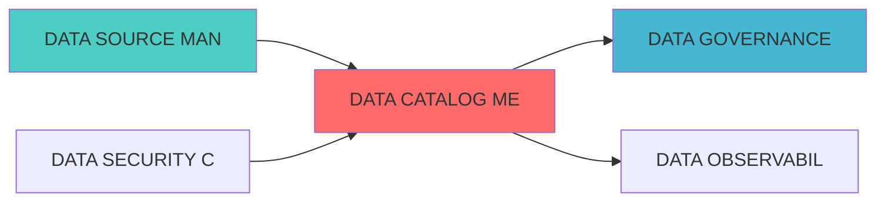

---
module_id: DATA_CATALOG_METADATA_001
version: 1.0.0
status: Active
created_date: 2026-04-07
last_updated: 2026-04-07
owner: 实施团队
standard_type: 专业量化机构蓝图
applicable_scope: Layer 1 数据å±?
compliance_level: 专业标准
responsibility:
  - 数据目录元数æ?
  - 元数据管ç?
  - 数据资产目录
  - 元数据标å‡?
layer: Layer 5.1 (数据处理)
---


## 核心定位

负责数据目录的设计与实现，提供数据资产注册、分类、检索和血缘追踪功能，支持数据治理和资产管理。

# DATA CATALOG METADATA BLUEPRINT

> **核心职责**: Data Catalog Metadata蓝图设计
> **职责边界**: 
> - âœ?本文档负责：Data Catalog Metadata蓝图设计相关内容
> - â?本文档不负责：其他模块内å®?

ï»?--
module_id: DATA_CATALOG_METADATA__001
version: 1.0.0
status: Active
created_date: 2026-04-07
last_updated: 2026-04-07
owner: 个人开发è€?
standard_type: 专业量化机构文档
responsibility:
  - 数据质量 (Layer 1)

layer: Layer 5.1 (数据处理)
---
ï»? 数据目录与元数据管理系统蓝图

> **核心定位**: 数据目录与元数据管理系统蓝图的核心功能实çŽ?


> **模块ID**: `DATA_CATALOG_METADATA_001`
> **实施周期**: Week 24-25?周）
> **优先?*: P2（一般）
> **预期收益**: 提高数据发现效率80%，提升数据治理水?

## 核心定位

数据目录元数据管理模块，专门负责数据资产的元数据采集、存储、版本管理和血缘追踪，提供精细化的元数据治理能åŠ?


## 一、设计背景与目标

### 1.1 业务需?
**当前痛点**:
- ?缺少统一的数据目?- ?元数据分散，难以管理
- ?数据血缘关系不清晰
- ?数据资产难以发现

**业务目标**:
- ?建立统一的数据目?- ?实现元数据集中管?- ?建立数据血缘追?- ?提高数据发现效率

### 1.2 技术目?
| 指标 | 目标?| 说明 |
|------|--------|------|
| **数据发现效率** | 提升80% | 数据发现时间缩短80% |
| **元数据覆盖率** | 100% | 所有数据资产元数据覆盖 |
| **血缘追踪准?* | ?5% | 数据血缘关系准确率 |
| **目录可用?* | ?9.9% | 数据目录系统可用?|

## 三、核心模块设?
### 3.1 元数据管理器 (MetadataManager)

**职责**: 管理数据资产的元数据

```python
from typing import Dict, List, Any, Optional
from dataclasses import dataclass, field
from datetime import datetime

@dataclass
class DataAsset:
    """数据资产"""
    asset_id: str
    asset_name: str
    asset_type: str  # table, file, api, stream
    description: str
    owner: str
    tags: List[str]
    schema: Dict[str, Any]
    created_at: datetime = field(default_factory=datetime.now)
    updated_at: datetime = field(default_factory=datetime.now)
    metadata: Dict[str, Any] = field(default_factory=dict)

class MetadataManager:
    """元数据管理器"""
    
    def __init__(self, config: Dict[str, Any]):
        """
        初始化元数据管理?        
        Args:
            config: 配置信息
        """
        self.config = config
        self.assets: Dict[str, DataAsset] = {}
        
    def register_asset(
        self,
        asset: DataAsset
    ) -> bool:
        """
        注册数据资产
        
        Args:
            asset: 数据资产
            
        Returns:
            bool: 是否成功
        """
        self.assets[asset.asset_id] = asset
        return True
    
    def search_assets(
        self,
        query: str,
        filters: Optional[Dict[str, Any]] = None
    ) -> List[DataAsset]:
        """
        搜索数据资产
        
        Args:
            query: 搜索查询
            filters: 过滤条件
            
        Returns:
            List[DataAsset]: 数据资产列表
        """
        # 实现搜索逻辑
        results = []
        
        for asset in self.assets.values():
            if query.lower() in asset.asset_name.lower():
                results.append(asset)
        
        return results
```

### 3.2 数据血缘追踪器 (DataLineageTracker)

**职责**: 追踪数据血缘关?
```python
from typing import Dict, List, Any
from dataclasses import dataclass, field
from datetime import datetime

@dataclass
class LineageNode:
    """血缘节?""
    node_id: str
    node_type: str  # source, transformation, target
    asset_id: str
    created_at: datetime = field(default_factory=datetime.now)

@dataclass
class LineageEdge:
    """血缘边"""
    edge_id: str
    source_node_id: str
    target_node_id: str
    transformation: str
    created_at: datetime = field(default_factory=datetime.now)

class DataLineageTracker:
    """数据血缘追踪器"""
    
    def __init__(self, config: Dict[str, Any]):
        """
        初始化血缘追踪器
        
        Args:
            config: 配置信息
        """
        self.config = config
        self.nodes: Dict[str, LineageNode] = {}
        self.edges: Dict[str, LineageEdge] = {}
        
    def add_lineage(
        self,
        source_asset_id: str,
        target_asset_id: str,
        transformation: str
    ) -> bool:
        """
        添加血缘关?        
        Args:
            source_asset_id: 源资产ID
            target_asset_id: 目标资产ID
            transformation: 转换逻辑
            
        Returns:
            bool: 是否成功
        """
        # 创建节点
        source_node = LineageNode(
            node_id=f"node_{source_asset_id}",
            node_type="source",
            asset_id=source_asset_id
        )
        
        target_node = LineageNode(
            node_id=f"node_{target_asset_id}",
            node_type="target",
            asset_id=target_asset_id
        )
        
        # 创建?        edge = LineageEdge(
            edge_id=f"edge_{source_asset_id}_{target_asset_id}",
            source_node_id=source_node.node_id,
            target_node_id=target_node.node_id,
            transformation=transformation
        )
        
        # 存储
        self.nodes[source_node.node_id] = source_node
        self.nodes[target_node.node_id] = target_node
        self.edges[edge.edge_id] = edge
        
        return True
    
    def get_lineage(
        self,
        asset_id: str,
        direction: str = "upstream"
    ) -> List[LineageNode]:
        """
        获取血缘关?        
        Args:
            asset_id: 资产ID
            direction: 方向（upstream, downstream?            
        Returns:
            List[LineageNode]: 血缘节点列?        """
        # 实现血缘查询逻辑
        return []
```


## 五、验收标?
| 验收?| 验收标准 | 验收方法 |
|--------|---------|---------|
| **数据发现效率** | 提升80% | 功能测试 |
| **元数据覆盖率** | 100% | 功能测试 |
| **血缘追踪准?* | ?5% | 功能测试 |

---

**蓝图版本**: v1.0 | **创建日期**: 2026-04-02 | **?*: ?正式 | **维护?*: ZephyrAlpha技术团?

## 变更历史

| 版本 | 日期 | 变更内容 | 变更äº?|
|------|------|----------|--------|
| v1.0.0 | 2026-04-02 | 初始版本创建 | 首席技术评审官 |
| v1.0.1 | 2026-04-06 | 补充YAML头部字段和变更历å?| 审计系统 |
---


---

## 📚 相关文档

### 上游依赖

| 文档名称 | module_id | 依赖类型 | 说明 |
|---------|-----------|---------|------|
| [DATA SOURCE MANAGEMENT BLUEPRINT](./DATA_SOURCE_MANAGEMENT_BLUEPRINT.md) | DATA_SOURCE_MANAGEMENT_001 | 强依èµ?| 提供数据源元数据 |
| [DATA SECURITY COMPLIANCE BLUEPRINT](./DATA_SECURITY_COMPLIANCE_BLUEPRINT.md) | DATA_SECURITY_COMPLIANCE_001 | 中依èµ?| 提供敏感数据分类 |

### 下游依赖

| 文档名称 | module_id | 依赖类型 | 说明 |
|---------|-----------|---------|------|
| [DATA GOVERNANCE PLATFORM BLUEPRINT](./DATA_GOVERNANCE_PLATFORM_BLUEPRINT.md) | DATA_GOVERNANCE_PLATFORM_001 | 强依èµ?| 提供元数据支æŒ?|
| [DATA OBSERVABILITY BLUEPRINT](./DATA_OBSERVABILITY_BLUEPRINT.md) | DATA_OBSERVABILITY_001 | 中依èµ?| 提供数据资产监控 |

### 技术依èµ?

| 技术组ä»?| 版本 | 用é€?| 文档 |
|---------|------|------|------|
| **OpenMetadata** | 1.2+ | 元数据管ç?| [官方文档](https://docs.open-metadata.org/) |
| **Apache Atlas** | 2.3+ | 数据血ç¼?| [官方文档](https://atlas.apache.org/) |
| **Elasticsearch** | 8.0+ | 搜索引擎 | [官方文档](https://www.elastic.co/) |

### 引用关系å›?



## 1. 文档治理

### 1.1 System_Manifest.md索引

```markdown
#### Layer 6: 组合优化å±?
##### 6.001. Data Catalog Metadata
- **模块ID**: DATA_CATALOG_METADATA_001
- **蓝图文档**: DATA_CATALOG_METADATA_BLUEPRINT.md
- **技术规格书**: 待创å»?
- **职责**: Layer 1数据预处理层 | 业务架构: 三级时间框架融合架构
- **状æ€?*: Active
```

### 1.2 模块职责边界

| 模块 | 职责 | 边界 |
|------|------|------|
| **Data Catalog Metadata** | Layer 1数据预处理层 | 业务架构: 三级时间框架融合架构 | **核心模块** |

### 1.3 版本管理

| 版本 | 日期 | 变更内容 | 变更äº?|
|------|------|----------|--------|
| v1.0.0 | 2026-04-02 | 初始版本创建 | 首席蓝图架构å¸?|

---

**蓝图版本**: v1.0.0 | **创建日期**: 2026-04-02 | **状æ€?*: Active
