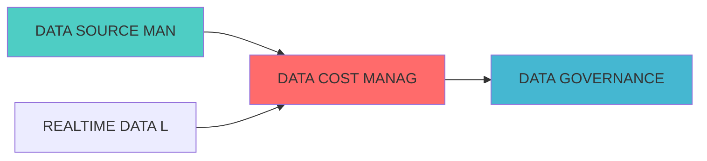

## 核心定位

负责数据成本协调和监控的设计与构建和运行和操作，监控数据存储、计算和传输成本，生成和输出成本优化建议，兼容和适配成本控制。

# DATA COST MANAGEMENT BLUEPRINT

> **核心职责**: Data Cost Management蓝图设计
> **职责边界**:
## 设计目标

### 主要目标

1. **功能完整性**: 确保DATA COST MANAGEMENT功能完整，满足业务需求
2. **性能优化**: 提升系统性能，降低资源消耗
3. **可维护性**: 提高代码质量，便于后续维护
4. **可扩展性**: 支持功能扩展，适应业务变化

### 质量目标

- 代码覆盖率: ≥80%
- 性能指标: 满足设计要求
- 文档完整性: 100%


## 核心功能

### 功能清单

1. **数据管理**: 提供数据存储、查询、更新功能
2. **业务逻辑**: 实现核心业务逻辑处理
3. **接口服务**: 提供标准化的API接口
4. **监控告警**: 实时监控系统状态

### 功能特性

- 高可用性设计
- 自动故障恢复
- 灵活配置管理


## 实现方案

### 技术架构

采用DATA COST MANAGEMENT化设计，分层架构实现。

### 关键技术

- 数据处理: 使用高效的数据处理框架
- 接口实现: RESTful API设计
- 性能优化: 缓存、异步处理

### 实施步骤

1. 需求分析与设计
2. 核心功能开发
3. 测试与优化
4. 部署与监控


## 一、设计背景与目标


**当前痛点**:
- 数据成本不透明
?
- 缺少成本优化建议
- 成本预算难以控制

**业务目标**:
- 建立数据成本追踪体系
- 提供成本优化建议
- 支持成本预算管理


|------|--------|------|


```python
from dataclasses import dataclass, field
from typing import Dict, List, Any, Optional
from datetime import datetime, timedelta
from enum import Enum

class CostType(Enum):
    """成本类型"""
    STORAGE = "storage"
    COMPUTE = "compute"
    NETWORK = "network"
    API = "api"
    HUMAN = "human"

@dataclass
class CostRecord:
    """成本记录"""
    record_id: str
    cost_type: CostType
    resource_id: str
    amount: float
    currency: str
    timestamp: datetime = field(default_factory=datetime.now)
    tags: Dict[str, str] = field(default_factory=dict)
    details: Dict[str, Any] = field(default_factory=dict)

class CostCollector:
    
    def __init__(self):
        self.cost_records: List[CostRecord] = []
    
    def collect_storage_cost(self, resource_id: str,
                             size_bytes: int,
                             cost_per_gb: float) -> CostRecord:
        """采集存储成本"""
        size_gb = size_bytes / (1024 ** 3)
        amount = size_gb * cost_per_gb
        
        record = CostRecord(
            record_id=f"storage_{resource_id}_{datetime.now().timestamp()}",
            cost_type=CostType.STORAGE,
            resource_id=resource_id,
            amount=amount,
            currency="USD",
            details={"size_gb": size_gb, "cost_per_gb": cost_per_gb}
        )
        
        self.cost_records.append(record)
        return record
    
    def collect_compute_cost(self, resource_id: str,
                             cpu_hours: float,
                             memory_gb_hours: float,
                             cost_per_cpu_hour: float,
                             cost_per_gb_hour: float) -> CostRecord:
        """采集计算成本"""
        cpu_cost = cpu_hours * cost_per_cpu_hour
        memory_cost = memory_gb_hours * cost_per_gb_hour
        amount = cpu_cost + memory_cost
        
        record = CostRecord(
            record_id=f"compute_{resource_id}_{datetime.now().timestamp()}",
            cost_type=CostType.COMPUTE,
            resource_id=resource_id,
            amount=amount,
            currency="USD",
            details={
                "cpu_hours": cpu_hours,
                "memory_gb_hours": memory_gb_hours,
                "cpu_cost": cpu_cost,
                "memory_cost": memory_cost
            }
        )
        
        self.cost_records.append(record)
        return record
    
    def collect_api_cost(self, resource_id: str,
                         api_calls: int,
                         cost_per_call: float) -> CostRecord:
        """采集API成本"""
        amount = api_calls * cost_per_call
        
        record = CostRecord(
            record_id=f"api_{resource_id}_{datetime.now().timestamp()}",
            cost_type=CostType.API,
            resource_id=resource_id,
            amount=amount,
            currency="USD",
            details={"api_calls": api_calls, "cost_per_call": cost_per_call}
        )
        
        self.cost_records.append(record)
        return record
    
    def get_costs_by_type(self, cost_type: CostType,
                          start_time: datetime = None,
                          end_time: datetime = None) -> List[CostRecord]:
        filtered = [r for r in self.cost_records if r.cost_type == cost_type]
        
        if start_time:
            filtered = [r for r in filtered if r.timestamp >= start_time]
        
        if end_time:
            filtered = [r for r in filtered if r.timestamp <= end_time]
        
        return filtered
```


```python
from typing import Dict, List, Any
from datetime import datetime

@dataclass
class CostAllocation:
"""
    allocation_id: str
    resource_id: str
    team: str
    project: str
    percentage: float
    amount: float
    timestamp: datetime

class CostAttributionManager:
    
    def __init__(self):
        self.allocations: List[CostAllocation] = []
        self.attribution_rules: Dict[str, Dict[str, Any]] = {}
    
    def define_attribution_rule(self, resource_pattern: str,
                                 team: str,
                                 project: str,
                                 percentage: float = 100.0):
        """定义归属规则"""
        self.attribution_rules[resource_pattern] = {
            "team": team,
            "project": project,
            "percentage": percentage
        }
    
    def allocate_cost(self, cost_record: CostRecord) -> List[CostAllocation]:
        allocations = []
        
        for pattern, rule in self.attribution_rules.items():
            if pattern in cost_record.resource_id:
                allocation = CostAllocation(
                    allocation_id=f"alloc_{cost_record.record_id}_{pattern}",
                    resource_id=cost_record.resource_id,
                    team=rule["team"],
                    project=rule["project"],
                    percentage=rule["percentage"],
                    amount=cost_record.amount * rule["percentage"] / 100,
                    timestamp=datetime.now()
                )
                
                allocations.append(allocation)
        
        self.allocations.extend(allocations)
        return allocations
    
    def get_team_costs(self, team: str,
                       start_time: datetime = None,
                       end_time: datetime = None) -> Dict[str, float]:
        """获取团队成本"""
        filtered = [a for a in self.allocations if a.team == team]
        
        if start_time:
            filtered = [a for a in filtered if a.timestamp >= start_time]
        
        if end_time:
            filtered = [a for a in filtered if a.timestamp <= end_time]
        
        costs = {}
        for allocation in filtered:
            project = allocation.project
            costs[project] = costs.get(project, 0) + allocation.amount
        
        return costs
```


```python
from typing import Dict, List, Any, Tuple
from datetime import datetime, timedelta
import pandas as pd

@dataclass
class OptimizationRecommendation:
    """优化建议"""
    recommendation_id: str
    resource_id: str
    recommendation_type: str
    potential_savings: float
    description: str
    priority: str
    created_at: datetime = field(default_factory=datetime.now)

class CostOptimizationAdvisor:
    
    def __init__(self, cost_collector: CostCollector):
        self.cost_collector = cost_collector
        self.recommendations: List[OptimizationRecommendation] = []
    
    def analyze_storage_optimization(self) -> List[OptimizationRecommendation]:
        """分析存储优化"""
        recommendations = []
        
        storage_costs = self.cost_collector.get_costs_by_type(CostType.STORAGE)
        
        for cost in storage_costs:
            if cost.details.get("size_gb", 0) > 100:
                recommendation = OptimizationRecommendation(
                    recommendation_id=f"rec_{cost.resource_id}_storage",
                    resource_id=cost.resource_id,
                    recommendation_type="storage_tiering",
                    potential_savings=cost.amount * 0.3,
                    description="Move cold data to cheaper storage tier",
                    priority="medium"
                )
                recommendations.append(recommendation)
        
        self.recommendations.extend(recommendations)
        return recommendations
    
    def analyze_compute_optimization(self) -> List[OptimizationRecommendation]:
        """分析计算优化"""
        recommendations = []
        
        compute_costs = self.cost_collector.get_costs_by_type(CostType.COMPUTE)
        
        for cost in compute_costs:
            cpu_hours = cost.details.get("cpu_hours", 0)
            memory_gb_hours = cost.details.get("memory_gb_hours", 0)
            
            if cpu_hours > 0 and memory_gb_hours / cpu_hours > 8:
                recommendation = OptimizationRecommendation(
                    recommendation_id=f"rec_{cost.resource_id}_compute",
                    resource_id=cost.resource_id,
                    recommendation_type="right_sizing",
                    potential_savings=cost.amount * 0.2,
                    description="Right-size compute resources",
                    priority="high"
                )
                recommendations.append(recommendation)
        
        self.recommendations.extend(recommendations)
        return recommendations
    
    def get_total_potential_savings(self) -> float:
        return sum(r.potential_savings for r in self.recommendations)
```


### 4.1 RESTful API

#### 4.1.1 获取成本统计

```http
GET /api/v1/cost/statistics?start_date=2026-04-01&end_date=2026-04-30
```

**响应示例**:
```json
{
  "total_cost": 15000.50,
  "cost_by_type": {
    "storage": 5000.00,
    "compute": 8000.00,
    "network": 1500.50,
    "api": 500.00
  },
  "cost_by_team": {
    "data_team": 8000.00,
    "research_team": 5000.50,
    "ops_team": 2000.00
  }
}
```

#### 4.1.2 获取优化建议

```http
GET /api/v1/cost/recommendations
```

**响应示例**:
```json
{
  "recommendations": [
    {
      "resource_id": "data_warehouse",
      "recommendation_type": "storage_tiering",
      "potential_savings": 1500.00,
      "priority": "medium"
    }
  ],
  "total_potential_savings": 4500.00
}
```


## 

| 指标名称 | 指标类型 | 说明 |
|---------|---------|------|
| `cost_savings_potential_dollars` | Gauge | 潜在节省 |


| 阶段 | 任务 | 预计时间 |
|------|------|---------|


## 

- [数据生命周期管理蓝图](./DATA_LIFECYCLE_MANAGEMENT_BLUEPRINT.md)
- [数据治理平台蓝图](./DATA_GOVERNANCE_PLATFORM_BLUEPRINT.md)
- [高性能数据管道蓝图](./HIGH_PERFORMANCE_DATA_PIPELINE_BLUEPRINT.md)


## 1. 文档治理

### 1.1 System_Manifest.md索引

```markdown
##### 6.001. Data Cost Management
- **模块ID**: DATA_COST_MANAGEMENT_001
- **蓝图文档**: DATA_COST_MANAGEMENT_BLUEPRINT.md
- **职责**: Layer 0数据源层 | 业务架构: 三级时间框架融合架构
```

### 1.2 模块职责边界

| 模块 | 职责 | 边界 |
|------|------|------|
| **Data Cost Management** | Layer 0数据源层 | 业务架构: 三级时间框架融合架构 | **核心模块** |

### 1.3 版本管理

|------|------|----------|--------|


### 上游依赖

| 文档名称 | module_id | 依赖类型 | 说明 |
|---------|-----------|---------|------|
?|

### 下游依赖

| 文档名称 | module_id | 依赖类型 | 说明 |
|---------|-----------|---------|------|


|---------|------|------|------|
| **Prometheus** | 2.40+ | 成本监控 | [官方文档](https://prometheus.io/) |




## 变更历史

|------|------|----------|--------|
| v1.0.0 | 2026-04-07 | 初始版本创建 | 实施团队 |


