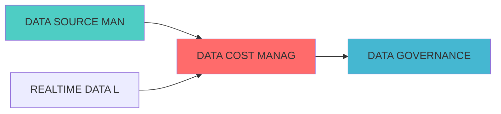

---
module_id: DATA_COST_MANAGEMENT_001
version: 1.0.0
status: Active
created_date: 2026-04-07
last_updated: 2026-04-07
owner: 实施团队
standard_type: 专业量化机构蓝图
applicable_scope: Layer 1 数据å±?
compliance_level: 专业标准
responsibility:
  - 数据成本管理
  - 成本监控
  - 成本优化
  - 成本报告
layer: Layer 5.1 (数据处理)
---


## 核心定位

负责数据成本管理的设计与实现，监控数据存储、计算和传输成本，提供成本优化建议，支持成本控制。

# DATA COST MANAGEMENT BLUEPRINT

> **核心职责**: Data Cost Management蓝图设计
> **职责边界**: 
> - âœ?本文档负责：Data Cost Management蓝图设计相关内容
> - â?本文档不负责：其他模块内å®?

ï»?--
module_id: DATACOSTMANAGEMENT_001
version: 1.0.0
status: Active
created_date: 2026-04-07
last_updated: 2026-04-07
owner: 实施团队
responsibility:
  - 因子计算
  - 组合优化
  - 数据æº?
standard_type: 专业量化机构蓝图
applicable_scope: 全系ç»?
compliance_level: 专业标准
layer: Layer 5.1 (数据处理)
ï»? 数据成本管理蓝图

> **核心定位**: 数据成本管理蓝图的核心功能实çŽ?


> **模块ID**: `DATA_COST_MGMT_001`
> **实施周期**: Week 31-32ï¼?周）
> **优先çº?*: P2（优化）
> **预期收益**: 降低数据成本30%，提升成本透明åº?00%

## 设计目标

### 主要目标

1. **功能完整性**: 确保DATA COST MANAGEMENT功能完整，满足业务需求
2. **性能优化**: 提升系统性能，降低资源消耗
3. **可维护性**: 提高代码质量，便于后续维护
4. **可扩展性**: 支持功能扩展，适应业务变化

### 质量目标

- 代码覆盖率: ≥80%
- 性能指标: 满足设计要求
- 文档完整性: 100%


## 核心功能

### 功能清单

1. **数据管理**: 提供数据存储、查询、更新功能
2. **业务逻辑**: 实现核心业务逻辑处理
3. **接口服务**: 提供标准化的API接口
4. **监控告警**: 实时监控系统状态

### 功能特性

- 高可用性设计
- 自动故障恢复
- 灵活配置管理


## 实现方案

### 技术架构

采用DATA COST MANAGEMENT化设计，分层架构实现。

### 关键技术

- 数据处理: 使用高效的数据处理框架
- 接口实现: RESTful API设计
- 性能优化: 缓存、异步处理

### 实施步骤

1. 需求分析与设计
2. 核心功能开发
3. 测试与优化
4. 部署与监控


## 核心定位

设计DATA COST MANAGEMENT的设计与实现，基于Apache Atlas技术，保障核心功能，确保数据质量合规ã€?

## 一、设计背景与目标

### 1.1 业务需æ±?

**当前痛点**:
- 数据成本不透明
- 成本归属不清æ™?
- 缺少成本优化建议
- 成本预算难以控制

**业务目标**:
- 建立数据成本追踪体系
- 实现成本归属和分æ‘?
- 提供成本优化建议
- 支持成本预算管理

### 1.2 技术目æ ?

| 指标 | 目标å€?| 说明 |
|------|--------|------|
| **成本追踪覆盖çŽ?* | 100% | 所有数据资产成本追è¸?|
| **成本归属准确çŽ?* | â‰?5% | 成本归属准确率≥95% |
| **成本降低** | â‰?0% | 数据成本降低30% |
| **预算控制准确çŽ?* | â‰?0% | 预算控制准确率≥90% |

## 三、核心模块设è®?

### 3.1 成本采集å™?(CostCollector)

```python
from dataclasses import dataclass, field
from typing import Dict, List, Any, Optional
from datetime import datetime, timedelta
from enum import Enum

class CostType(Enum):
    """成本类型"""
    STORAGE = "storage"
    COMPUTE = "compute"
    NETWORK = "network"
    API = "api"
    HUMAN = "human"

@dataclass
class CostRecord:
    """成本记录"""
    record_id: str
    cost_type: CostType
    resource_id: str
    amount: float
    currency: str
    timestamp: datetime = field(default_factory=datetime.now)
    tags: Dict[str, str] = field(default_factory=dict)
    details: Dict[str, Any] = field(default_factory=dict)

class CostCollector:
    """成本采集å™?""
    
    def __init__(self):
        self.cost_records: List[CostRecord] = []
    
    def collect_storage_cost(self, resource_id: str,
                             size_bytes: int,
                             cost_per_gb: float) -> CostRecord:
        """采集存储成本"""
        size_gb = size_bytes / (1024 ** 3)
        amount = size_gb * cost_per_gb
        
        record = CostRecord(
            record_id=f"storage_{resource_id}_{datetime.now().timestamp()}",
            cost_type=CostType.STORAGE,
            resource_id=resource_id,
            amount=amount,
            currency="USD",
            details={"size_gb": size_gb, "cost_per_gb": cost_per_gb}
        )
        
        self.cost_records.append(record)
        return record
    
    def collect_compute_cost(self, resource_id: str,
                             cpu_hours: float,
                             memory_gb_hours: float,
                             cost_per_cpu_hour: float,
                             cost_per_gb_hour: float) -> CostRecord:
        """采集计算成本"""
        cpu_cost = cpu_hours * cost_per_cpu_hour
        memory_cost = memory_gb_hours * cost_per_gb_hour
        amount = cpu_cost + memory_cost
        
        record = CostRecord(
            record_id=f"compute_{resource_id}_{datetime.now().timestamp()}",
            cost_type=CostType.COMPUTE,
            resource_id=resource_id,
            amount=amount,
            currency="USD",
            details={
                "cpu_hours": cpu_hours,
                "memory_gb_hours": memory_gb_hours,
                "cpu_cost": cpu_cost,
                "memory_cost": memory_cost
            }
        )
        
        self.cost_records.append(record)
        return record
    
    def collect_api_cost(self, resource_id: str,
                         api_calls: int,
                         cost_per_call: float) -> CostRecord:
        """采集API成本"""
        amount = api_calls * cost_per_call
        
        record = CostRecord(
            record_id=f"api_{resource_id}_{datetime.now().timestamp()}",
            cost_type=CostType.API,
            resource_id=resource_id,
            amount=amount,
            currency="USD",
            details={"api_calls": api_calls, "cost_per_call": cost_per_call}
        )
        
        self.cost_records.append(record)
        return record
    
    def get_costs_by_type(self, cost_type: CostType,
                          start_time: datetime = None,
                          end_time: datetime = None) -> List[CostRecord]:
        """按类型获取成æœ?""
        filtered = [r for r in self.cost_records if r.cost_type == cost_type]
        
        if start_time:
            filtered = [r for r in filtered if r.timestamp >= start_time]
        
        if end_time:
            filtered = [r for r in filtered if r.timestamp <= end_time]
        
        return filtered
```

### 3.2 成本归属管理å™?(CostAttributionManager)

```python
from typing import Dict, List, Any
from datetime import datetime

@dataclass
class CostAllocation:
    """成本分配"""
    allocation_id: str
    resource_id: str
    team: str
    project: str
    percentage: float
    amount: float
    timestamp: datetime

class CostAttributionManager:
    """成本归属管理å™?""
    
    def __init__(self):
        self.allocations: List[CostAllocation] = []
        self.attribution_rules: Dict[str, Dict[str, Any]] = {}
    
    def define_attribution_rule(self, resource_pattern: str,
                                 team: str,
                                 project: str,
                                 percentage: float = 100.0):
        """定义归属规则"""
        self.attribution_rules[resource_pattern] = {
            "team": team,
            "project": project,
            "percentage": percentage
        }
    
    def allocate_cost(self, cost_record: CostRecord) -> List[CostAllocation]:
        """分配成本"""
        allocations = []
        
        for pattern, rule in self.attribution_rules.items():
            if pattern in cost_record.resource_id:
                allocation = CostAllocation(
                    allocation_id=f"alloc_{cost_record.record_id}_{pattern}",
                    resource_id=cost_record.resource_id,
                    team=rule["team"],
                    project=rule["project"],
                    percentage=rule["percentage"],
                    amount=cost_record.amount * rule["percentage"] / 100,
                    timestamp=datetime.now()
                )
                
                allocations.append(allocation)
        
        self.allocations.extend(allocations)
        return allocations
    
    def get_team_costs(self, team: str,
                       start_time: datetime = None,
                       end_time: datetime = None) -> Dict[str, float]:
        """获取团队成本"""
        filtered = [a for a in self.allocations if a.team == team]
        
        if start_time:
            filtered = [a for a in filtered if a.timestamp >= start_time]
        
        if end_time:
            filtered = [a for a in filtered if a.timestamp <= end_time]
        
        costs = {}
        for allocation in filtered:
            project = allocation.project
            costs[project] = costs.get(project, 0) + allocation.amount
        
        return costs
```

### 3.3 成本优化建议å™?(CostOptimizationAdvisor)

```python
from typing import Dict, List, Any, Tuple
from datetime import datetime, timedelta
import pandas as pd

@dataclass
class OptimizationRecommendation:
    """优化建议"""
    recommendation_id: str
    resource_id: str
    recommendation_type: str
    potential_savings: float
    description: str
    priority: str
    created_at: datetime = field(default_factory=datetime.now)

class CostOptimizationAdvisor:
    """成本优化建议å™?""
    
    def __init__(self, cost_collector: CostCollector):
        self.cost_collector = cost_collector
        self.recommendations: List[OptimizationRecommendation] = []
    
    def analyze_storage_optimization(self) -> List[OptimizationRecommendation]:
        """分析存储优化"""
        recommendations = []
        
        storage_costs = self.cost_collector.get_costs_by_type(CostType.STORAGE)
        
        for cost in storage_costs:
            if cost.details.get("size_gb", 0) > 100:
                recommendation = OptimizationRecommendation(
                    recommendation_id=f"rec_{cost.resource_id}_storage",
                    resource_id=cost.resource_id,
                    recommendation_type="storage_tiering",
                    potential_savings=cost.amount * 0.3,
                    description="Move cold data to cheaper storage tier",
                    priority="medium"
                )
                recommendations.append(recommendation)
        
        self.recommendations.extend(recommendations)
        return recommendations
    
    def analyze_compute_optimization(self) -> List[OptimizationRecommendation]:
        """分析计算优化"""
        recommendations = []
        
        compute_costs = self.cost_collector.get_costs_by_type(CostType.COMPUTE)
        
        for cost in compute_costs:
            cpu_hours = cost.details.get("cpu_hours", 0)
            memory_gb_hours = cost.details.get("memory_gb_hours", 0)
            
            if cpu_hours > 0 and memory_gb_hours / cpu_hours > 8:
                recommendation = OptimizationRecommendation(
                    recommendation_id=f"rec_{cost.resource_id}_compute",
                    resource_id=cost.resource_id,
                    recommendation_type="right_sizing",
                    potential_savings=cost.amount * 0.2,
                    description="Right-size compute resources",
                    priority="high"
                )
                recommendations.append(recommendation)
        
        self.recommendations.extend(recommendations)
        return recommendations
    
    def get_total_potential_savings(self) -> float:
        """获取总潜在节çœ?""
        return sum(r.potential_savings for r in self.recommendations)
```

---
## 四、接口设è®?

### 4.1 RESTful API

#### 4.1.1 获取成本统计

```http
GET /api/v1/cost/statistics?start_date=2026-04-01&end_date=2026-04-30
```

**响应示例**:
```json
{
  "total_cost": 15000.50,
  "cost_by_type": {
    "storage": 5000.00,
    "compute": 8000.00,
    "network": 1500.50,
    "api": 500.00
  },
  "cost_by_team": {
    "data_team": 8000.00,
    "research_team": 5000.50,
    "ops_team": 2000.00
  }
}
```

#### 4.1.2 获取优化建议

```http
GET /api/v1/cost/recommendations
```

**响应示例**:
```json
{
  "recommendations": [
    {
      "resource_id": "data_warehouse",
      "recommendation_type": "storage_tiering",
      "potential_savings": 1500.00,
      "priority": "medium"
    }
  ],
  "total_potential_savings": 4500.00
}
```


## 六、监控指æ ?

| 指标名称 | 指标类型 | 说明 |
|---------|---------|------|
| `cost_total_dollars` | Gauge | 总成æœ?|
| `cost_by_type_dollars` | Gauge | 按类型成æœ?|
| `cost_by_team_dollars` | Gauge | 按团队成æœ?|
| `cost_savings_potential_dollars` | Gauge | 潜在节省 |

---

## 七、实施计åˆ?

| 阶段 | 任务 | 预计时间 |
|------|------|---------|
| **阶段1** | 搭建成本采集系统 | 2å¤?|
| **阶段2** | 开发成本归属管理器 | 3å¤?|
| **阶段3** | 开发成本优化建议器 | 3å¤?|
| **阶段4** | 开发成本仪表板 | 2å¤?|
| **阶段5** | 测试和优åŒ?| 2å¤?|

---

## 八、相关文æ¡?

- [数据生命周期管理蓝图](./DATA_LIFECYCLE_MANAGEMENT_BLUEPRINT.md)
- [数据治理平台蓝图](./DATA_GOVERNANCE_PLATFORM_BLUEPRINT.md)
- [高性能数据管道蓝图](./HIGH_PERFORMANCE_DATA_PIPELINE_BLUEPRINT.md)

---

**文档版本**: v1.0.0 | **创建日期**: 2026-04-06 | **维护è€?*: 首席蓝图架构å¸?
---

## 1. 文档治理

### 1.1 System_Manifest.md索引

```markdown
#### Layer 6: 组合优化å±?
##### 6.001. Data Cost Management
- **模块ID**: DATA_COST_MANAGEMENT_001
- **蓝图文档**: DATA_COST_MANAGEMENT_BLUEPRINT.md
- **技术规格书**: 待创å»?
- **职责**: Layer 0数据源层 | 业务架构: 三级时间框架融合架构
- **状æ€?*: Active
```

### 1.2 模块职责边界

| 模块 | 职责 | 边界 |
|------|------|------|
| **Data Cost Management** | Layer 0数据源层 | 业务架构: 三级时间框架融合架构 | **核心模块** |

### 1.3 版本管理

| 版本 | 日期 | 变更内容 | 变更äº?|
|------|------|----------|--------|
| v1.0.0 | 2026-04-06 | 初始版本创建 | 首席蓝图架构å¸?|

---

**蓝图版本**: v1.0.0 | **创建日期**: 2026-04-06 | **状æ€?*: Active


---

## 📚 相关文档

### 上游依赖

| 文档名称 | module_id | 依赖类型 | 说明 |
|---------|-----------|---------|------|
| [DATA SOURCE MANAGEMENT BLUEPRINT](./DATA_SOURCE_MANAGEMENT_BLUEPRINT.md) | DATA_SOURCE_MANAGEMENT_001 | 中依èµ?| 获取数据源使用情å†?|
| [REALTIME DATA LAKE BLUEPRINT](./REALTIME_DATA_LAKE_BLUEPRINT.md) | REALTIME_DATA_LAKE_001 | 中依èµ?| 获取存储成本数据 |

### 下游依赖

| 文档名称 | module_id | 依赖类型 | 说明 |
|---------|-----------|---------|------|
| [DATA GOVERNANCE PLATFORM BLUEPRINT](./DATA_GOVERNANCE_PLATFORM_BLUEPRINT.md) | DATA_GOVERNANCE_PLATFORM_001 | 中依èµ?| 提供成本治理策略 |

### 技术依èµ?

| 技术组ä»?| 版本 | 用é€?| 文档 |
|---------|------|------|------|
| **Prometheus** | 2.40+ | 成本监控 | [官方文档](https://prometheus.io/) |
| **Grafana** | 9.0+ | 可视化展ç¤?| [官方文档](https://grafana.com/) |

### 引用关系å›?



## 变更历史

| 版本 | 日期 | 变更内容 | 变更äº?|
|------|------|----------|--------|
| v1.0.0 | 2026-04-07 | 初始版本创建 | 实施团队 |


---

**蓝图版本**: v1.0.0 | **创建日期**: 2026-04-07 | **状æ€?*: Active
