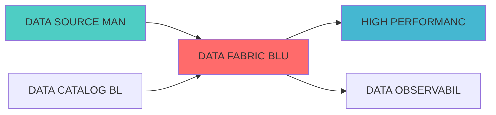

---
module_id: DATA_FABRIC_001
version: 1.0.0
status: Active
created_date: 2026-04-07
last_updated: 2026-04-07
owner: 实施团队
standard_type: 专业量化机构蓝图
applicable_scope: Layer 1 数据å±?
compliance_level: 专业标准
responsibility:
  - 数据编织
  - 数据集成
  - 数据虚拟åŒ?
  - 数据访问å±?
layer: Layer 5.1 (数据处理)
---


## 核心定位

负责数据编织的设计与实现，构建统一的数据访问层，提供数据虚拟化和联邦查询功能，支持跨平台数据整合。

# DATA FABRIC BLUEPRINT

> **核心职责**: Data Fabric蓝图设计
> **职责边界**: 
> - âœ?本文档负责：Data Fabric蓝图设计相å
³å†
容
> - â?本文档不...


## 设计目标

### 主要目标

1. **功能完整性**: 确保DATA FABRIC功能完整，满足业务需求
2. **性能优化**: 提升系统性能，降低资源消耗
3. **可维护性**: 提高代码质量，便于后续维护
4. **可扩展性**: 支持功能扩展，适应业务变化

### 质量目标

- 代码覆盖率: ≥80%
- 性能指标: 满足设计要求
- 文档完整性: 100%


## 核心功能

### 功能清单

1. **数据管理**: 提供数据存储、查询、更新功能
2. **业务逻辑**: 实现核心业务逻辑处理
3. **接口服务**: 提供标准化的API接口
4. **监控告警**: 实时监控系统状态

### 功能特性

- 高可用性设计
- 自动故障恢复
- 灵活配置管理


## 实现方案

### 技术架构

采用DATA FABRIC化设计，分层架构实现。

### 关键技术

- 数据处理: 使用高效的数据处理框架
- 接口实现: RESTful API设计
- 性能优化: 缓存、异步处理

### 实施步骤

1. 需求分析与设计
2. 核心功能开发
3. 测试与优化
4. 部署与监控


## 核心定位

构建DATA FABRIC的设计与实现，基于Apache Iceberg技术，实现核心功能，提升数据资产可见性ã€?

## 一、设计背景与目标

### 1.1 业务需æ±?

**当前痛点**:
- 数据源分散，集成复杂
- 数据访问方式不统一
- 实时数据同步困难
- 数据一致性难以保è¯?

**业务目标**:
- 建立统一的数据编织层
- 提供标准化的数据访问接口
- 实现实时数据同步
- 保证数据一致æ€?

### 1.2 技术目æ ?

| 指标 | 目标å€?| 说明 |
|------|--------|------|
| **数据源集æˆ?* | â‰?0ä¸?| 支持至少10个数据源 |
| **数据延迟** | <1ç§?| 实时数据延迟<1ç§?|
| **数据一致æ€?* | â‰?9.9% | 数据一致性≥99.9% |
| **并发连接** | â‰?00 | 支持至少200个并发连æŽ?|

## 二、系统架构设è®?

### 2.1 整体架构å›?

```
┌─────────────────────────────────────────────────────────────â”?
â”?               数据编织架构                                  â”?
├─────────────────────────────────────────────────────────────â”?
â”?                                                            â”?
â”? ┌─────────────────────────────────────────────────────â”?  â”?
â”? â”?          数据接å
¥å±?(Data Ingestion)                â”?  â”?
â”? â”? ┌─────────────â”?┌─────────────â”?┌─────────────â”?  â”?  â”?
â”? â”? │CDC采集      â”?│API采集      â”?│文件采é›?    â”?  â”?  â”?
â”? â”? â”?Debezium)   â”?â”?REST API)   â”?â”?File Watch) â”?  â”?  â”?
â”? â”? └─────────────â”?└─────────────â”?└─────────────â”?  â”?  â”?
â”? └─────────────────────────────────────────────────────â”?  â”?
�                         �                                 �
â”? ┌─────────────────────────────────────────────────────â”?  â”?
â”? â”?          数据流层 (Data Streaming)                  â”?  â”?
â”? â”? ┌─────────────â”?┌─────────────â”?┌─────────────â”?  â”?  â”?
â”? â”? │消息队åˆ?    â”?│流处理       â”?│数据路ç”?    â”?  â”?  â”?
â”? â”? â”?Kafka)      â”?â”?Kafka Streams)â”?â”?Router)   â”?  â”?  â”?
â”? â”? └─────────────â”?└─────────────â”?└─────────────â”?  â”?  â”?
â”? └─────────────────────────────────────────────────────â”?  â”?
�                         �                                 �
â”? ┌─────────────────────────────────────────────────────â”?  â”?
â”? â”?          数据服务å±?(Data Services)                 â”?  â”?
â”? â”? ┌─────────────â”?┌─────────────â”?┌─────────────â”?  â”?  â”?
â”? â”? │统一API      â”?│数据缓å­?    â”?│数据转æ?    â”?  â”?  â”?
â”? â”? â”?FastAPI)    â”?â”?Redis)      â”?â”?Transform)  â”?  â”?  â”?
â”? â”? └─────────────â”?└─────────────â”?└─────────────â”?  â”?  â”?
â”? └─────────────────────────────────────────────────────â”?  â”?
�                         �                                 �
â”? ┌─────────────────────────────────────────────────────â”?  â”?
â”? â”?          数据存储å±?(Data Storage)                  â”?  â”?
â”? â”? ┌─────────────â”?┌─────────────â”?┌─────────────â”?  â”?  â”?
â”? â”? │热数据存储   â”?│温数据存储   â”?│冷数据存储   â”?  â”?  â”?
â”? â”? â”?Redis)      â”?â”?PostgreSQL) â”?â”?S3)         â”?  â”?  â”?
â”? â”? └─────────────â”?└─────────────â”?└─────────────â”?  â”?  â”?
â”? └─────────────────────────────────────────────────────â”?  â”?
â”?                                                            â”?
└─────────────────────────────────────────────────────────────â”?
```

### 2.2 技术选型

| 组件 | 技术方æ¡?| 版本要求 | 选型理由 |
|------|---------|---------|---------|
| **消息队列** | Apache Kafka | 3.5.0+ | 高吞吐量消息队列 |
| **CDCå·¥å
·** | Debezium | 2.4.0+ | 数据变更捕获 |
| **流处ç?* | Kafka Streams | 3.5.0+ | 流式数据处理 |
| **API框架** | FastAPI | 0.100.0+ | 高性能API框架 |
| **缓存** | Redis | 7.0+ | 高性能缓存 |

---
## 三、核心模块设è®?

### 3.1 数据采集å™?(DataIngestionManager)

```python
from dataclasses import dataclass, field
from typing import Dict, List, Any, Optional
from datetime import datetime
from enum import Enum

class IngestionType(Enum):
    """采集类型"""
    CDC = "cdc"
    API = "api"
    FILE = "file"
    STREAM = "stream"

@dataclass
class DataSource:
    """数据源é
ç½?""
    source_id: str
    source_name: str
    source_type: str
    ingestion_type: IngestionType
    connection_config: Dict[str, Any]
    enabled: bool = True

class DataIngestionManager:
    """数据采集管理å™?""
    
    def __init__(self):
        self.data_sources: Dict[str, DataSource] = {}
    
    def register_source(self, source_config: Dict[str, Any]) -> DataSource:
        """注册数据æº?""
        source = DataSource(
            source_id=source_config['source_id'],
            source_name=source_config['source_name'],
            source_type=source_config['source_type'],
            ingestion_type=IngestionType(source_config['ingestion_type']),
            connection_config=source_config.get('connection_config', {})
        )
        
        self.data_sources[source.source_id] = source
        return source
    
    def start_ingestion(self, source_id: str):
        """启动数据采集"""
        source = self.data_sources.get(source_id)
        if not source or not source.enabled:
            return False
        
        # 根据采集类型启动采集
        if source.ingestion_type == IngestionType.CDC:
            self._start_cdc_ingestion(source)
        elif source.ingestion_type == IngestionType.API:
            self._start_api_ingestion(source)
        
        return True
    
    def _start_cdc_ingestion(self, source: DataSource):
        """启动CDC采集"""
        # 实现CDC采集逻辑
        pass
    
    def _start_api_ingestion(self, source: DataSource):
        """启动API采集"""
        # 实现API采集逻辑
        pass
```

### 3.2 数据流处理器 (DataStreamProcessor)

```python
from typing import Dict, List, Any, Callable
from kafka import KafkaConsumer, KafkaProducer
import json

class DataStreamProcessor:
    """数据流处理器"""
    
    def __init__(self, kafka_servers: List[str]):
        self.kafka_servers = kafka_servers
        self.consumer = None
        self.producer = None
        self.processors: Dict[str, Callable] = {}
    
    def register_processor(self, topic: str, processor: Callable):
        """注册数据处理å™?""
        self.processors[topic] = processor
    
    def start_processing(self, input_topic: str, output_topic: str):
        """启动流处ç?""
        consumer = KafkaConsumer(
            input_topic,
            bootstrap_servers=self.kafka_servers,
            value_deserializer=lambda m: json.loads(m.decode('utf-8'))
        )
        
        producer = KafkaProducer(
            bootstrap_servers=self.kafka_servers,
            value_serializer=lambda v: json.dumps(v).encode('utf-8')
        )
        
        processor = self.processors.get(input_topic)
        
        for message in consumer:
            if processor:
                processed_data = processor(message.value)
                producer.send(output_topic, value=processed_data)
    
    def transform_data(self, data: Dict[str, Any], 
                       transform_rules: Dict[str, Any]) -> Dict[str, Any]:
        """数据转换"""
        transformed_data = {}
        
        for target_field, rule in transform_rules.items():
            source_field = rule.get('source_field')
            transform_type = rule.get('transform_type')
            
            if source_field in data:
                value = data[source_field]
                
                if transform_type == 'uppercase':
                    transformed_data[target_field] = str(value).upper()
                elif transform_type == 'lowercase':
                    transformed_data[target_field] = str(value).lower()
                elif transform_type == 'number':
                    transformed_data[target_field] = float(value)
                else:
                    transformed_data[target_field] = value
        
        return transformed_data
```

### 3.3 统一数据API (UnifiedDataAPI)

```python
from fastapi import FastAPI, HTTPException
from typing import Dict, List, Any, Optional
import redis
import json

app = FastAPI()

class UnifiedDataAPI:
    """统一数据API"""
    
    def __init__(self, redis_host: str, redis_port: int):
        self.redis_client = redis.Redis(host=redis_host, port=redis_port, decode_responses=True)
    
    async def get_data(self, data_type: str, key: str) -> Optional[Dict[str, Any]]:
        """获取数据"""
        cache_key = f"{data_type}:{key}"
        cached_data = self.redis_client.get(cache_key)
        
        if cached_data:
            return json.loads(cached_data)
        
        # 从数据源获取数据
        data = await self._fetch_from_source(data_type, key)
        
        if data:
            # 缓存数据
            self.redis_client.setex(cache_key, 3600, json.dumps(data))
        
        return data
    
    async def set_data(self, data_type: str, key: str, 
                       data: Dict[str, Any], ttl: int = 3600):
        """设置数据"""
        cache_key = f"{data_type}:{key}"
        self.redis_client.setex(cache_key, ttl, json.dumps(data))
    
    async def _fetch_from_source(self, data_type: str, 
                                  key: str) -> Optional[Dict[str, Any]]:
        """从数据源获取数据"""
        # 实现从不同数据源获取数据的逻辑
        pass

@app.get("/api/v1/data/{data_type}/{key}")
async def get_data(data_type: str, key: str):
    """获取数据API"""
    api = UnifiedDataAPI("localhost", 6379)
    data = await api.get_data(data_type, key)
    
    if not data:
        raise HTTPException(status_code=404, detail="Data not found")
    
    return data

@app.post("/api/v1/data/{data_type}/{key}")
async def set_data(data_type: str, key: str, data: Dict[str, Any]):
    """设置数据API"""
    api = UnifiedDataAPI("localhost", 6379)
    await api.set_data(data_type, key, data)
    return {"status": "success"}
```


## 五、部署架æž?

```yaml
version: '3.8'
services:
  kafka:
    image: confluentinc/cp-kafka:latest
    ports:
      - "9092:9092"
    environment:
      - KAFKA_ZOOKEEPER_CONNECT=zookeeper:2181
      - KAFKA_ADVERTISED_LISTENERS=PLAINTEXT://kafka:9092
  
  zookeeper:
    image: confluentinc/cp-zookeeper:latest
    environment:
      - ZOOKEEPER_CLIENT_PORT=2181
  
  debezium:
    image: debezium/connect:latest
    ports:
      - "8083:8083"
    environment:
      - BOOTSTRAP_SERVERS=kafka:9092
      - GROUP_ID=1
      - CONFIG_STORAGE_TOPIC=my_connect_configs
      - OFFSET_STORAGE_TOPIC=my_connect_offsets
      - STATUS_STORAGE_TOPIC=my_connect_statuses
  
  redis:
    image: redis:7
    ports:
      - "6379:6379"
    volumes:
      - redis-data:/data
  
  api:
    build: .
    ports:
      - "8000:8000"
    environment:
      - KAFKA_SERVERS=kafka:9092
      - REDIS_HOST=redis
      - REDIS_PORT=6379
    depends_on:
      - kafka
      - redis

volumes:
  redis-data:
```

---

## å
­ã€ç›‘控指æ ?

| 指标名称 | 指标类型 | 说明 |
|---------|---------|------|
| `fabric_data_ingestion_total` | Counter | 数据采集总数 |
| `fabric_data_latency_seconds` | Histogram | 数据延迟 |
| `fabric_cache_hit_rate` | Gauge | 缓存命中çŽ?|
| `fabric_api_requests_total` | Counter | API请求总数 |

---

## 七、实施计åˆ?

| 阶段 | 任务 | 预计时间 |
|------|------|---------|
| **阶段1** | 搭建Kafka集群 | 3å¤?|
| **阶段2** | é
ç½®Debezium CDC | 3å¤?|
| **阶段3** | 开发数据流处理å™?| 4å¤?|
| **阶段4** | 开发统一API | 3å¤?|
| **阶段5** | 测试和优åŒ?| 2å¤?|

---

## å
«ã€ç›¸å
³æ–‡æ¡?

- [数据网格蓝图](./DATA_MESH_BLUEPRINT.md)
- 数据虚拟化蓝å›?
- [实时数据湖蓝图](./REALTIME_DATA_LAKE_BLUEPRINT.md)

---

**文档版本**: v1.0.0 | **创建日期**: 2026-04-06 | **维护è€?*: 首席蓝图架构å¸?
---

## 1. 文档治理

### 1.1 System_Manifest.md索引

```markdown
#### Layer 6: 组合优化å±?
##### 6.001. Data Fabric
- **模块ID**: DATA_FABRIC_001
- **蓝图文档**: DATA_FABRIC_BLUEPRINT.md
- **技术规格书**: å¾
创å»?
- **职责**: Layer 0数据源层 | 业务架构: 三级时间框架融合架构
- **状æ€?*: Active
```

### 1.2 模块职责边界

| 模块 | 职责 | 边界 |
|------|------|------|
| **Data Fabric** | Layer 0数据源层 | 业务架构: 三级时间框架融合架构 | **核心模块** |

### 1.3 版本管理

| 版本 | 日期 | 变更å†
容 | 变更äº?|
|------|------|----------|--------|
| v1.0.0 | 2026-04-06 | 初始版本创建 | 首席蓝图架构å¸?|

---

**蓝图版本**: v1.0.0 | **创建日期**: 2026-04-06 | **状æ€?*: Active


---

## 📚 相å
³æ–‡æ¡£

### 上游依赖

| 文档名称 | module_id | 依赖类型 | 说明 |
|---------|-----------|---------|------|
| [DATA SOURCE MANAGEMENT BLUEPRINT](./DATA_SOURCE_MANAGEMENT_BLUEPRINT.md) | DATA_SOURCE_MANAGEMENT_001 | 强依èµ?| 提供数据源连æŽ?|
| [DATA CATALOG BLUEPRINT](./DATA_CATALOG_BLUEPRINT.md) | DATA_CATALOG_001 | 中依èµ?| 提供数据资产目录 |

### 下游依赖

| 文档名称 | module_id | 依赖类型 | 说明 |
|---------|-----------|---------|------|
| [HIGH PERFORMANCE DATA PIPELINE BLUEPRINT](./HIGH_PERFORMANCE_DATA_PIPELINE_BLUEPRINT.md) | HIGH_PERFORMANCE_DATA_PIPELINE_001 | 强依èµ?| 提供数据集成服务 |
| [DATA OBSERVABILITY BLUEPRINT](./DATA_OBSERVABILITY_BLUEPRINT.md) | DATA_OBSERVABILITY_001 | 中依èµ?| 提供数据可观测æ€?|

### 技术依èµ?

| 技术组ä»?| 版本 | 用é€?| 文档 |
|---------|------|------|------|
| **Apache Kafka** | 3.5+ | 数据æµ?| [官方文档](https://kafka.apache.org/) |
| **Apache Flink** | 1.19+ | 流处ç?| [官方文档](https://flink.apache.org/) |
| **Trino** | 430+ | 分布式查è¯?| [官方文档](https://trino.io/) |

### 引用å
³ç³»å›?



## 变更历史

| 版本 | 日期 | 变更å†
容 | 变更äº?|
|------|------|----------|--------|
| v1.0.0 | 2026-04-07 | 初始版本创建 | 实施团队 |


---

**蓝图版本**: v1.0.0 | **创建日期**: 2026-04-07 | **状æ€?*: Active
