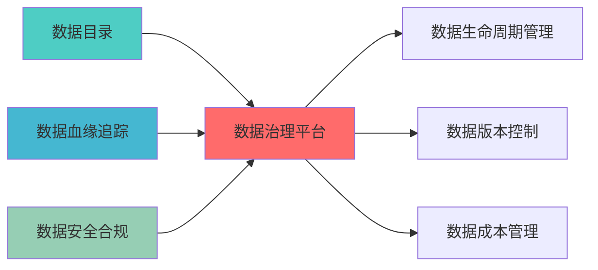

---
module_id: DATA_GOVERNANCE_PLATFORM_001
version: 1.0.0
status: Active
created_date: 2026-04-06
last_updated: '2026-04-06'
owner: 首席蓝图架构师
standard_type: 专业量化机构蓝图
applicable_scope: 'Layer 0数据源层 | 业务架构: 三级时间框架融合架构'
compliance_level: 专业标准
parent_document: ../INDEX.md
implementation_status: 设计阶段
implementation_progress: 0%
open_source_dependency: apache-atlas, datahub, open-metadata
estimated_effort: 3周
priority: P2
layer: "Layer 1 (数据源层)"
---


# 数据治理平台蓝图

> **核心定位**: 数据治理平台蓝图的核心功能实现


> **模块ID**: `DATA_GOVERNANCE_001`
> **实施周期**: Week 22-24（3周）
> **优先级**: P2（优化）
> **预期收益**: 提升数据治理效率80%，降低合规风险90%

## 一、设计背景与目标

### 1.1 业务需求

**当前痛点**:
- 数据治理流程不规范
- 数据质量责任不清晰
- 合规要求难以落实
- 数据资产价值难以评估

**业务目标**:
- 建立统一的数据治理平台
- 明确数据所有权和责任
- 自动化合规检查和审计
- 数据资产价值量化

### 1.2 技术目标

| 指标 | 目标值 | 说明 |
|------|--------|------|
| **治理流程自动化** | ≥80% | 80%以上治理流程自动化 |
| **合规检查覆盖率** | 100% | 所有数据资产合规检查 |
| **数据资产登记率** | ≥95% | 95%以上数据资产登记 |
| **治理效率提升** | ≥80% | 治理效率提升80% |

---

## 📚 相关文档

### 上游依赖

| 文档名称 | module_id | 依赖类型 | 说明 |
|---------|-----------|---------|------|
| [数据目录蓝图](./DATA_CATALOG_BLUEPRINT.md) | DATA_CATALOG_001 | 强依赖 | 提供数据资产元数据 |
| [数据血缘追踪蓝图](./DATA_CATALOG_METADATA_BLUEPRINT.md) | DATA_CATALOG_METADATA_001 | 强依赖 | 提供数据血缘关系 |
| [数据安全合规蓝图](./DATA_SECURITY_COMPLIANCE_BLUEPRINT.md) | DATA_SECURITY_COMPLIANCE_001 | 中依赖 | 提供合规策略标准 |

### 下游依赖

| 文档名称 | module_id | 依赖类型 | 说明 |
|---------|-----------|---------|------|
| [数据生命周期管理蓝图](./DATA_LIFECYCLE_MANAGEMENT_BLUEPRINT.md) | DATA_LIFECYCLE_MANAGEMENT_001 | 强依赖 | 执行生命周期治理策略 |
| [数据版本控制蓝图](./DATA_VERSION_CONTROL_BLUEPRINT.md) | DATA_VERSION_CONTROL_001 | 中依赖 | 执行版本管理策略 |
| [数据成本管理蓝图](./DATA_COST_MANAGEMENT_BLUEPRINT.md) | DATA_COST_MANAGEMENT_001 | 中依赖 | 执行成本优化策略 |

### 技术依赖

| 技术组件 | 版本 | 用途 | 文档 |
|---------|------|------|------|
| **Apache Atlas** | 2.3+ | 数据治理 | [官方文档](https://atlas.apache.org/) |
| **DataHub** | 0.10+ | 元数据管理 | [官方文档](https://datahubproject.io/) |
| **OpenMetadata** | 1.2+ | 数据目录 | [官方文档](https://docs.open-metadata.org/) |

### 引用关系图



---

## 二、系统架构设计

### 2.1 整体架构图

```
┌─────────────────────────────────────────────────────────────┐
│                数据治理平台架构                              │
├─────────────────────────────────────────────────────────────┤
│                                                             │
│  ┌─────────────────────────────────────────────────────┐   │
│  │           治理策略层 (Governance Policy)             │   │
│  │  ┌─────────────┐ ┌─────────────┐ ┌─────────────┐   │   │
│  │  │数据标准     │ │质量规则     │ │合规策略     │   │   │
│  │  └─────────────┘ └─────────────┘ └─────────────┘   │   │
│  └─────────────────────────────────────────────────────┘   │
│                          ↓                                  │
│  ┌─────────────────────────────────────────────────────┐   │
│  │           治理执行层 (Governance Execution)          │   │
│  │  ┌─────────────┐ ┌─────────────┐ ┌─────────────┐   │   │
│  │  │策略执行引擎 │ │合规检查引擎 │ │审计追踪引擎 │   │   │
│  │  └─────────────┘ └─────────────┘ └─────────────┘   │   │
│  └─────────────────────────────────────────────────────┘   │
│                          ↓                                  │
│  ┌─────────────────────────────────────────────────────┐   │
│  │           治理监控层 (Governance Monitoring)         │   │
│  │  ┌─────────────┐ ┌─────────────┐ ┌─────────────┐   │   │
│  │  │治理仪表板   │ │告警通知     │ │报告生成     │   │   │
│  │  └─────────────┘ └─────────────┘ └─────────────┘   │   │
│  └─────────────────────────────────────────────────────┘   │
│                          ↓                                  │
│  ┌─────────────────────────────────────────────────────┐   │
│  │           治理服务层 (Governance Service)            │   │
│  │  ┌─────────────┐ ┌─────────────┐ ┌─────────────┐   │   │
│  │  │治理API      │ │工作流引擎   │ │权限管理     │   │   │
│  │  └─────────────┘ └─────────────┘ └─────────────┘   │   │
│  └─────────────────────────────────────────────────────┘   │
│                                                             │
└─────────────────────────────────────────────────────────────┘
```

### 2.2 技术选型

| 组件 | 技术方案 | 版本要求 | 选型理由 |
|------|---------|---------|---------|
| **元数据管理** | Apache Atlas | 2.3.0+ | 企业级元数据管理 |
| **数据目录** | DataHub | 0.10.0+ | 现代化数据目录 |
| **工作流引擎** | Apache Airflow | 2.7.0+ | 工作流编排 |
| **策略引擎** | Open Policy Agent | 0.55+ | 策略即代码 |

---

## 三、核心模块设计

### 3.1 治理策略管理器 (GovernancePolicyManager)

```python
from dataclasses import dataclass, field
from typing import Dict, List, Any, Optional
from datetime import datetime
from enum import Enum

class PolicyType(Enum):
    """策略类型"""
    DATA_QUALITY = "data_quality"
    DATA_SECURITY = "data_security"
    DATA_PRIVACY = "data_privacy"
    DATA_RETENTION = "data_retention"
    COMPLIANCE = "compliance"

class PolicyStatus(Enum):
    """策略状态"""
    DRAFT = "draft"
    ACTIVE = "active"
    DEPRECATED = "deprecated"
    ARCHIVED = "archived"

@dataclass
class GovernancePolicy:
    """治理策略"""
    policy_id: str
    policy_name: str
    policy_type: PolicyType
    description: str
    rules: Dict[str, Any]
    scope: List[str]
    status: PolicyStatus = PolicyStatus.ACTIVE
    created_at: datetime = field(default_factory=datetime.now)
    updated_at: datetime = field(default_factory=datetime.now)

class GovernancePolicyManager:
    """治理策略管理器"""
    
    def __init__(self):
        self.policies: Dict[str, GovernancePolicy] = {}
    
    def create_policy(self, policy_config: Dict[str, Any]) -> GovernancePolicy:
        """创建治理策略"""
        policy = GovernancePolicy(
            policy_id=policy_config['policy_id'],
            policy_name=policy_config['policy_name'],
            policy_type=PolicyType(policy_config['policy_type']),
            description=policy_config.get('description', ''),
            rules=policy_config.get('rules', {}),
            scope=policy_config.get('scope', [])
        )
        
        self.policies[policy.policy_id] = policy
        return policy
    
    def get_policy(self, policy_id: str) -> Optional[GovernancePolicy]:
        """获取策略"""
        return self.policies.get(policy_id)
    
    def update_policy(self, policy_id: str, 
                      updates: Dict[str, Any]) -> Optional[GovernancePolicy]:
        """更新策略"""
        policy = self.get_policy(policy_id)
        if not policy:
            return None
        
        for key, value in updates.items():
            if hasattr(policy, key):
                setattr(policy, key, value)
        
        policy.updated_at = datetime.now()
        return policy
    
    def list_policies(self, policy_type: PolicyType = None) -> List[GovernancePolicy]:
        """列出策略"""
        if policy_type:
            return [p for p in self.policies.values() if p.policy_type == policy_type]
        return list(self.policies.values())
```

### 3.2 合规检查引擎 (ComplianceCheckEngine)

```python
from typing import Dict, List, Any, Tuple
from datetime import datetime

@dataclass
class ComplianceCheckResult:
    """合规检查结果"""
    check_id: str
    policy_id: str
    asset_id: str
    passed: bool
    violations: List[str]
    checked_at: datetime
    details: Dict[str, Any]

class ComplianceCheckEngine:
    """合规检查引擎"""
    
    def __init__(self, policy_manager: GovernancePolicyManager):
        self.policy_manager = policy_manager
    
    def check_compliance(self, asset_id: str, 
                         asset_data: Dict[str, Any]) -> ComplianceCheckResult:
        """检查合规性"""
        violations = []
        
        applicable_policies = self._get_applicable_policies(asset_id)
        
        for policy in applicable_policies:
            is_compliant, policy_violations = self._check_policy_compliance(
                policy, asset_data
            )
            
            if not is_compliant:
                violations.extend(policy_violations)
        
        return ComplianceCheckResult(
            check_id=f"check_{asset_id}_{datetime.now().timestamp()}",
            policy_id=",".join([p.policy_id for p in applicable_policies]),
            asset_id=asset_id,
            passed=len(violations) == 0,
            violations=violations,
            checked_at=datetime.now()
        )
    
    def _get_applicable_policies(self, asset_id: str) -> List[GovernancePolicy]:
        """获取适用的策略"""
        return [p for p in self.policy_manager.list_policies() 
                if p.status == PolicyStatus.ACTIVE]
    
    def _check_policy_compliance(self, policy: GovernancePolicy,
                                  asset_data: Dict[str, Any]) -> Tuple[bool, List[str]]:
        """检查策略合规性"""
        violations = []
        
        if policy.policy_type == PolicyType.DATA_QUALITY:
            violations = self._check_quality_rules(policy.rules, asset_data)
        elif policy.policy_type == PolicyType.DATA_SECURITY:
            violations = self._check_security_rules(policy.rules, asset_data)
        elif policy.policy_type == PolicyType.DATA_PRIVACY:
            violations = self._check_privacy_rules(policy.rules, asset_data)
        
        return len(violations) == 0, violations
    
    def _check_quality_rules(self, rules: Dict[str, Any],
                              asset_data: Dict[str, Any]) -> List[str]:
        """检查质量规则"""
        violations = []
        
        for rule_name, rule_config in rules.items():
            if rule_config.get('type') == 'completeness':
                threshold = rule_config.get('threshold', 0.95)
                completeness = asset_data.get('completeness', 0)
                
                if completeness < threshold:
                    violations.append(
                        f"Completeness {completeness} below threshold {threshold}"
                    )
        
        return violations
    
    def _check_security_rules(self, rules: Dict[str, Any],
                               asset_data: Dict[str, Any]) -> List[str]:
        """检查安全规则"""
        violations = []
        
        if rules.get('encryption_required'):
            if not asset_data.get('encrypted'):
                violations.append("Data must be encrypted")
        
        return violations
    
    def _check_privacy_rules(self, rules: Dict[str, Any],
                              asset_data: Dict[str, Any]) -> List[str]:
        """检查隐私规则"""
        violations = []
        
        sensitive_fields = rules.get('sensitive_fields', [])
        for field in sensitive_fields:
            if field in asset_data.get('fields', []):
                if not asset_data.get('fields', {}).get(field, {}).get('masked'):
                    violations.append(f"Sensitive field {field} must be masked")
        
        return violations
```

### 3.3 审计追踪引擎 (AuditTrailEngine)

```python
from typing import Dict, List, Any
from datetime import datetime
import json

@dataclass
class AuditEvent:
    """审计事件"""
    event_id: str
    event_type: str
    user_id: str
    asset_id: str
    action: str
    details: Dict[str, Any]
    timestamp: datetime = field(default_factory=datetime.now)

class AuditTrailEngine:
    """审计追踪引擎"""
    
    def __init__(self):
        self.audit_events: List[AuditEvent] = []
    
    def log_event(self, event_type: str, user_id: str, 
                  asset_id: str, action: str, details: Dict[str, Any] = None):
        """记录审计事件"""
        event = AuditEvent(
            event_id=f"audit_{datetime.now().timestamp()}",
            event_type=event_type,
            user_id=user_id,
            asset_id=asset_id,
            action=action,
            details=details or {}
        )
        
        self.audit_events.append(event)
    
    def get_audit_trail(self, asset_id: str = None,
                        user_id: str = None,
                        start_time: datetime = None,
                        end_time: datetime = None) -> List[AuditEvent]:
        """获取审计轨迹"""
        filtered_events = self.audit_events
        
        if asset_id:
            filtered_events = [e for e in filtered_events if e.asset_id == asset_id]
        
        if user_id:
            filtered_events = [e for e in filtered_events if e.user_id == user_id]
        
        if start_time:
            filtered_events = [e for e in filtered_events if e.timestamp >= start_time]
        
        if end_time:
            filtered_events = [e for e in filtered_events if e.timestamp <= end_time]
        
        return filtered_events
    
    def generate_audit_report(self, start_time: datetime,
                               end_time: datetime) -> Dict[str, Any]:
        """生成审计报告"""
        events = self.get_audit_trail(start_time=start_time, end_time=end_time)
        
        report = {
            "period": {
                "start": start_time.isoformat(),
                "end": end_time.isoformat()
            },
            "summary": {
                "total_events": len(events),
                "events_by_type": {},
                "events_by_user": {}
            },
            "events": [e.__dict__ for e in events]
        }
        
        for event in events:
            report["summary"]["events_by_type"][event.event_type] = \
                report["summary"]["events_by_type"].get(event.event_type, 0) + 1
            
            report["summary"]["events_by_user"][event.user_id] = \
                report["summary"]["events_by_user"].get(event.user_id, 0) + 1
        
        return report
```

---

## 四、接口设计

### 4.1 RESTful API

#### 4.1.1 创建治理策略

```http
POST /api/v1/governance/policies
```

**请求示例**:
```json
{
  "policy_name": "数据质量标准",
  "policy_type": "data_quality",
  "description": "数据质量最低标准",
  "rules": {
    "completeness": {
      "type": "completeness",
      "threshold": 0.95
    }
  },
  "scope": ["all_tables"]
}
```

#### 4.1.2 检查合规性

```http
POST /api/v1/governance/compliance/check
```

**请求示例**:
```json
{
  "asset_id": "stock_prices",
  "asset_data": {
    "completeness": 0.92,
    "encrypted": true
  }
}
```

---

## 五、部署架构

```yaml
version: '3.8'
services:
  atlas:
    image: apache/atlas:2.3.0
    ports:
      - "21000:21000"
    environment:
      - ATLAS_SERVER_HTTP_PORT=21000
  
  datahub:
    image: linkedin/datahub-gms:latest
    ports:
      - "8080:8080"
  
  airflow:
    image: apache/airflow:2.7.0
    ports:
      - "8081:8080"
    environment:
      - AIRFLOW__CORE__EXECUTOR=LocalExecutor
  
  opa:
    image: openpolicyagent/opa:latest
    ports:
      - "8181:8181"
```

---

## 六、监控指标

| 指标名称 | 指标类型 | 说明 |
|---------|---------|------|
| `governance_policies_total` | Gauge | 治理策略总数 |
| `governance_compliance_checks_total` | Counter | 合规检查总数 |
| `governance_violations_total` | Counter | 违规总数 |
| `governance_audit_events_total` | Counter | 审计事件总数 |

---

## 七、实施计划

| 阶段 | 任务 | 预计时间 |
|------|------|---------|
| **阶段1** | 搭建Atlas和DataHub | 4天 |
| **阶段2** | 开发策略管理器 | 3天 |
| **阶段3** | 开发合规检查引擎 | 4天 |
| **阶段4** | 开发审计追踪引擎 | 3天 |
| **阶段5** | 测试和优化 | 2天 |

---

## 八、相关文档

- [数据网格蓝图](./DATA_MESH_BLUEPRINT.md)
- 数据血缘追踪蓝图
- [数据安全合规蓝图](./DATA_SECURITY_COMPLIANCE_BLUEPRINT.md)

---

**文档版本**: v1.0.0 | **创建日期**: 2026-04-06 | **维护者**: 首席蓝图架构师
---

## 1. 文档治理

### 1.1 System_Manifest.md索引

```markdown
#### Layer 6: 组合优化层
##### 6.001. Data Governance Platform
- **模块ID**: DATA_GOVERNANCE_PLATFORM_001
- **蓝图文档**: DATA_GOVERNANCE_PLATFORM_BLUEPRINT.md
- **技术规格书**: 待创建
- **职责**: Layer 0数据源层 | 业务架构: 三级时间框架融合架构
- **状态**: Active
```

### 1.2 模块职责边界

| 模块 | 职责 | 边界 |
|------|------|------|
| **Data Governance Platform** | Layer 0数据源层 | 业务架构: 三级时间框架融合架构 | **核心模块** |

### 1.3 版本管理

| 版本 | 日期 | 变更内容 | 变更人 |
|------|------|----------|--------|
| v1.0.0 | 2026-04-06 | 初始版本创建 | 首席蓝图架构师 |

---

**蓝图版本**: v1.0.0 | **创建日期**: 2026-04-06 | **状态**: Active

## 变更历史

| 版本 | 日期 | 变更内容 | 变更人 |
|------|------|----------|--------|
| v1.0.0 | 2026-04-07 | 初始版本创建 | 实施团队 |


---

**蓝图版本**: v1.0.0 | **创建日期**: 2026-04-07 | **状态**: Active
