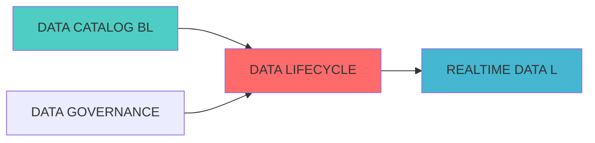

---
module_id: DATA_LIFECYCLE_MANAGEMENT_001
version: 1.0.0
status: Active
created_date: 2026-04-07
last_updated: 2026-04-07
owner: 实施团队
standard_type: 专业量化机构蓝图
compliance_level: 专业标准
responsibility:
  - 数据生命周期管理
  - 数据归档
理
  - 数据保留策略
layer: Layer 5.1 (数据处理)
---


## 核心定位

负责数据生命周期管理的设计与实现，提供数据创建、存储、归档和删除的全生命周期管理，支持数据治理。

# DATA LIFECYCLE MANAGEMENT BLUEPRINT

> **核心职责**: Data Lifecycle Management蓝图设计
> **职责边界**: 


## 设计目标

### 主要目标

1. **功能完整性**: 确保DATA LIFECYCLE MANAGEMENT功能完整，满足业务需求
2. **性能优化**: 提升系统性能，降低资源消耗
3. **可维护性**: 提高代码质量，便于后续维护
4. **可扩展性**: 支持功能扩展，适应业务变化

### 质量目标

- 代码覆盖率: ≥80%
- 性能指标: 满足设计要求
- 文档完整性: 100%


## 核心功能

### 功能清单

1. **数据管理**: 提供数据存储、查询、更新功能
2. **业务逻辑**: 实现核心业务逻辑处理
3. **接口服务**: 提供标准化的API接口
4. **监控告警**: 实时监控系统状态

### 功能特性

- 高可用性设计
- 自动故障恢复
- 灵活配置管理


## 实现方案

### 技术架构

采用DATA LIFECYCLE MANAGEMENT化设计，分层架构实现。

### 关键技术

- 数据处理: 使用高效的数据处理框架
- 接口实现: RESTful API设计
- 性能优化: 缓存、异步处理

### 实施步骤

1. 需求分析与设计
2. 核心功能开发
3. 测试与优化
4. 部署与监控


## 核心定位


## 一、设计背景与目标


**当前痛点**:
?
- 存储成本持续增长
- 数据归档和删除不规范

**业务目标**:
- 建立数据生命周期管理策略
- 自动化数据归档和删除
- 优化存储成本


|------|--------|------|


```python
from dataclasses import dataclass, field
from typing import Dict, List, Any, Optional
from datetime import datetime, timedelta
from enum import Enum

class DataTier(Enum):
    """数据分层"""
    HOT = "hot"
    WARM = "warm"
    COLD = "cold"
    ARCHIVE = "archive"

class ActionType(Enum):
    """动作类型"""
    MOVE_TO_WARM = "move_to_warm"
    MOVE_TO_COLD = "move_to_cold"
    ARCHIVE = "archive"
    DELETE = "delete"

@dataclass
class LifecyclePolicy:
    """生命周期策略"""
    policy_id: str
    policy_name: str
    data_classification: str
    retention_days: int
    actions: Dict[str, Any]
    enabled: bool = True
    created_at: datetime = field(default_factory=datetime.now)

class LifecyclePolicyManager:
    
    def __init__(self):
        self.policies: Dict[str, LifecyclePolicy] = {}
    
    def create_policy(self, policy_config: Dict[str, Any]) -> LifecyclePolicy:
        """创建生命周期策略"""
        policy = LifecyclePolicy(
            policy_id=policy_config['policy_id'],
            policy_name=policy_config['policy_name'],
            data_classification=policy_config['data_classification'],
            retention_days=policy_config['retention_days'],
            actions=policy_config.get('actions', {})
        )
        
        self.policies[policy.policy_id] = policy
        return policy
    
    def get_policy(self, policy_id: str) -> Optional[LifecyclePolicy]:
        """获取策略"""
        return self.policies.get(policy_id)
    
    def get_applicable_policy(self, data_classification: str) -> Optional[LifecyclePolicy]:
        for policy in self.policies.values():
            if policy.data_classification == data_classification and policy.enabled:
                return policy
        return None
```


```python
from typing import Dict, List, Any
from datetime import datetime, timedelta
import pandas as pd

@dataclass
class DataAsset:
    """数据资产"""
    asset_id: str
    asset_name: str
    current_tier: DataTier
    created_at: datetime
    last_accessed_at: datetime
    size_bytes: int
    classification: str

class DataTieringManager:
    
    def __init__(self):
        self.assets: Dict[str, DataAsset] = {}
    
    def register_asset(self, asset_config: Dict[str, Any]) -> DataAsset:
        """注册数据资产"""
        asset = DataAsset(
            asset_id=asset_config['asset_id'],
            asset_name=asset_config['asset_name'],
            current_tier=DataTier(asset_config.get('current_tier', 'hot')),
            created_at=asset_config.get('created_at', datetime.now()),
            last_accessed_at=asset_config.get('last_accessed_at', datetime.now()),
            size_bytes=asset_config.get('size_bytes', 0),
            classification=asset_config.get('classification', 'general')
        )
        
        self.assets[asset.asset_id] = asset
        return asset
    
    def determine_tier(self, asset_id: str) -> DataTier:
        """确定数据分层"""
        asset = self.assets.get(asset_id)
        if not asset:
            return DataTier.HOT
        
        days_since_creation = (datetime.now() - asset.created_at).days
        days_since_access = (datetime.now() - asset.last_accessed_at).days
        
        if days_since_access <= 7:
            return DataTier.HOT
        elif days_since_access <= 30:
            return DataTier.WARM
        elif days_since_access <= 90:
            return DataTier.COLD
        else:
            return DataTier.ARCHIVE
    
    def get_tier_statistics(self) -> Dict[str, Any]:
        """获取分层统计"""
        stats = {
            "hot": {"count": 0, "size": 0},
            "warm": {"count": 0, "size": 0},
            "cold": {"count": 0, "size": 0},
            "archive": {"count": 0, "size": 0}
        }
        
        for asset in self.assets.values():
            tier = asset.current_tier.value
            stats[tier]["count"] += 1
            stats[tier]["size"] += asset.size_bytes
        
        return stats
```

### 3.3 生命周期执行引擎 (LifecycleExecutionEngine)

```python
from typing import Dict, List, Any
from datetime import datetime, timedelta
import logging

logger = logging.getLogger(__name__)

@dataclass
class LifecycleAction:
    """生命周期动作"""
    action_id: str
    asset_id: str
    action_type: ActionType
    source_tier: DataTier
    target_tier: DataTier
    executed_at: datetime
    status: str
    details: Dict[str, Any]

class LifecycleExecutionEngine:
    """生命周期执行引擎"""
    
    def __init__(self, policy_manager: LifecyclePolicyManager,
                 tiering_manager: DataTieringManager):
        self.policy_manager = policy_manager
        self.tiering_manager = tiering_manager
        self.actions: List[LifecycleAction] = []
    
    def execute_lifecycle_policies(self):
        """执行生命周期策略"""
        for asset_id, asset in self.tiering_manager.assets.items():
            policy = self.policy_manager.get_applicable_policy(asset.classification)
            
            if not policy:
                continue
            
            days_since_creation = (datetime.now() - asset.created_at).days
            
            if days_since_creation >= policy.retention_days:
                self._execute_deletion(asset)
            elif days_since_creation >= policy.actions.get('archive_days', 365):
                self._execute_archive(asset)
            elif days_since_creation >= policy.actions.get('cold_days', 90):
                self._execute_tier_migration(asset, DataTier.COLD)
            elif days_since_creation >= policy.actions.get('warm_days', 30):
                self._execute_tier_migration(asset, DataTier.WARM)
    
    def _execute_tier_migration(self, asset: DataAsset, target_tier: DataTier):
        """执行分层迁移"""
        logger.info(f"Migrating asset {asset.asset_id} from {asset.current_tier} to {target_tier}")
        
        action = LifecycleAction(
            action_id=f"action_{datetime.now().timestamp()}",
            asset_id=asset.asset_id,
            action_type=ActionType.MOVE_TO_COLD if target_tier == DataTier.COLD else ActionType.MOVE_TO_WARM,
            source_tier=asset.current_tier,
            target_tier=target_tier,
            executed_at=datetime.now(),
            status="completed",
            details={}
        )
        
        asset.current_tier = target_tier
        self.actions.append(action)
    
    def _execute_archive(self, asset: DataAsset):
        """执行归档"""
        logger.info(f"Archiving asset {asset.asset_id}")
        
        action = LifecycleAction(
            action_id=f"action_{datetime.now().timestamp()}",
            asset_id=asset.asset_id,
            action_type=ActionType.ARCHIVE,
            source_tier=asset.current_tier,
            target_tier=DataTier.ARCHIVE,
            executed_at=datetime.now(),
            status="completed",
            details={}
        )
        
        asset.current_tier = DataTier.ARCHIVE
        self.actions.append(action)
    
    def _execute_deletion(self, asset: DataAsset):
        """执行删除"""
        logger.info(f"Deleting asset {asset.asset_id}")
        
        action = LifecycleAction(
            action_id=f"action_{datetime.now().timestamp()}",
            asset_id=asset.asset_id,
            action_type=ActionType.DELETE,
            source_tier=asset.current_tier,
            target_tier=None,
            executed_at=datetime.now(),
            status="completed",
            details={}
        )
        
        del self.tiering_manager.assets[asset.asset_id]
        self.actions.append(action)
```

---

### 4.1 RESTful API

#### 4.1.1 创建生命周期策略

```http
POST /api/v1/lifecycle/policies
```

**请求示例**:
```json
{
  "policy_name": "交易数据保留策略",
  "data_classification": "trading_data",
  "retention_days": 365,
  "actions": {
    "warm_days": 30,
    "cold_days": 90,
    "archive_days": 180
  }
}
```

#### 4.1.2 获取分层统计

```http
GET /api/v1/lifecycle/tiers/statistics
```

**响应示例**:
```json
{
  "hot": {"count": 10, "size": 1073741824},
  "warm": {"count": 20, "size": 2147483648},
  "cold": {"count": 30, "size": 3221225472},
  "archive": {"count": 40, "size": 4294967296}
}
```


##

| 指标名称 | 指标类型 | 说明 |
|---------|---------|------|
| `lifecycle_policies_total` | Gauge | 生命周期策略总数 |
| `lifecycle_actions_executed_total` | Counter | 执行的动作总数 |
| `lifecycle_cost_savings_dollars` | Gauge | 成本节省金额 |

---


| 阶段 | 任务 | 预计时间 |
|------|------|---------|

---

##
?

- [实时数据湖蓝图](./REALTIME_DATA_LAKE_BLUEPRINT.md)
- [数据治理平台蓝图](./DATA_GOVERNANCE_PLATFORM_BLUEPRINT.md)
- [数据成本管理蓝图](./DATA_COST_MANAGEMENT_BLUEPRINT.md)

---

---

## 1. 文档治理

### 1.1 System_Manifest.md索引

```markdown
##### 6.001. Data Lifecycle Management
- **模块ID**: DATA_LIFECYCLE_MANAGEMENT_001
- **蓝图文档**: DATA_LIFECYCLE_MANAGEMENT_BLUEPRINT.md
?
- **职责**: Layer 0数据源层 | 业务架构: 三级时间框架融合架构
- **?*: Active
```

### 1.2 模块职责边界

| 模块 | 职责 | 边界 |
|------|------|------|
| **Data Lifecycle Management** | Layer 0数据源层 | 业务架构: 三级时间框架融合架构 | **核心模块** |

### 1.3 版本管理

|------|------|----------|--------|

---


---

##

### 上游依赖

| 文档名称 | module_id | 依赖类型 | 说明 |
|---------|-----------|---------|------|
?|

### 下游依赖

| 文档名称 | module_id | 依赖类型 | 说明 |
|---------|-----------|---------|------|


|---------|------|------|------|

###
?



## 变更历史

|------|------|----------|--------|
| v1.0.0 | 2026-04-07 | 初始版本创建 | 实施团队 |


---

