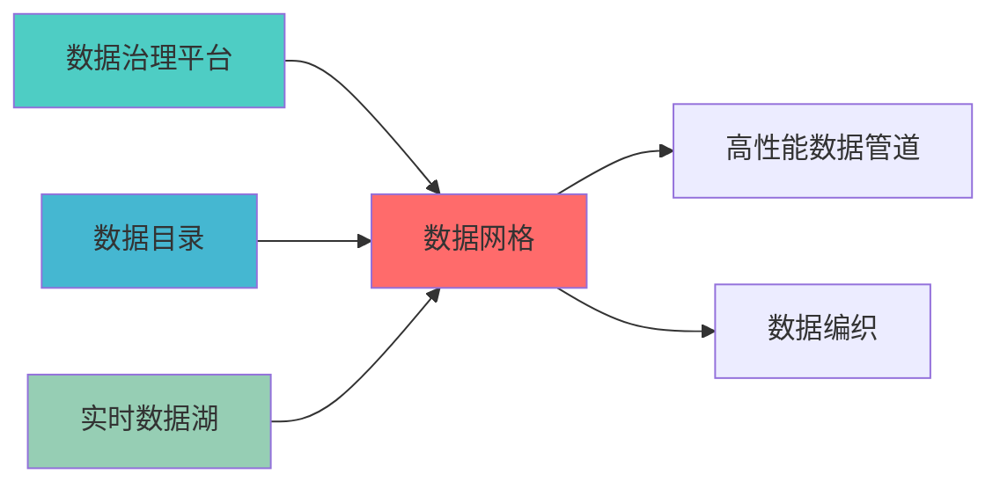

## 核心定位


负责数据网格架构的设计与构建和运行和操作，实施数据产品化和领域自治原则，支持联邦数据治理，构建可扩展的分布式数据架构。

负责数据网格架构设计，实现数据域划分、数据产品化、联邦数据治理。

# DATA MESH BLUEPRINT

> **核心职责**: Data Mesh蓝图设计
> **职责边界**:
## 设计目标

### 主要目标

1. **功能完整性**: 确保DATA MESH功能完整，满足业务需求
2. **性能优化**: 提升系统性能，降低资源消耗
3. **可维护性**: 提高代码质量，便于后续维护
4. **可扩展性**: 支持功能扩展，适应业务变化

### 质量目标

- 代码覆盖率: ≥80%
- 性能指标: 满足设计要求
- 文档完整性: 100%


## 核心功能

### 功能清单

1. **数据管理**: 提供数据存储、查询、更新功能
2. **业务逻辑**: 实现核心业务逻辑处理
3. **接口服务**: 提供标准化的API接口
4. **监控告警**: 实时监控系统状态

### 功能特性

- 高可用性设计
- 自动故障恢复
- 灵活配置管理


## 实现方案

### 技术架构

采用DATA MESH化设计，分层架构实现。

### 关键技术

- 数据处理: 使用高效的数据处理框架
- 接口实现: RESTful API设计
- 性能优化: 缓存、异步处理

### 实施步骤

1. 需求分析与设计
2. 核心功能开发
3. 测试与优化
4. 部署与监控


## 一、设计背景与目标


**当前痛点**:
?
- 数据团队成为瓶颈
- 数据质量责任分散
- 数据发现困难

**业务目标**:
- 建立领域驱动的数据所有权
- 自助式数据发现和使用


|------|--------|------|
| **数据发现时间** | <5分钟 | 数据发现时间<5分钟 |


### 上游依赖

| 文档名称 | module_id | 依赖类型 | 说明 |
|---------|-----------|---------|------|

### 下游依赖

| 文档名称 | module_id | 依赖类型 | 说明 |
|---------|-----------|---------|------|


|---------|------|------|------|
| **DataHub** | 0.10+ | 数据产品目录 | [官方文档](https://datahubproject.io/) |
| **Apache Atlas** | 2.3+ | 数据治理 | [官方文档](https://atlas.apache.org/) |
| **OpenMetadata** | 1.2+ | 





### 3.1 数据域管理器 (DataDomainManager)

```python
from dataclasses import dataclass, field
from typing import Dict, List, Any, Optional
from datetime import datetime
from enum import Enum

class DomainType(Enum):
    MARKET_DATA = "market_data"
    TRADING_DATA = "trading_data"
    RISK_DATA = "risk_data"
    FACTOR_DATA = "factor_data"
    PORTFOLIO_DATA = "portfolio_data"

@dataclass
class DataDomain:
    domain_id: str
    domain_name: str
    domain_type: DomainType
    owner: str
    description: str
    data_products: List[str] = field(default_factory=list)
    quality_sla: Dict[str, float] = field(default_factory=dict)
    created_at: datetime = field(default_factory=datetime.now)

class DataDomainManager:
    """数据域管理器"""
    
    def __init__(self):
        self.domains: Dict[str, DataDomain] = {}
    
    def create_domain(self, domain_config: Dict[str, Any]) -> DataDomain:
        domain = DataDomain(
            domain_id=domain_config['domain_id'],
            domain_name=domain_config['domain_name'],
            domain_type=DomainType(domain_config['domain_type']),
            owner=domain_config['owner'],
            description=domain_config.get('description', ''),
            quality_sla=domain_config.get('quality_sla', {})
        )
        
        self.domains[domain.domain_id] = domain
        return domain
    
    def get_domain(self, domain_id: str) -> Optional[DataDomain]:
        return self.domains.get(domain_id)
    
    def list_domains(self) -> List[DataDomain]:
        """列出所有数据域"""
        return list(self.domains.values())
    
    def assign_data_product(self, domain_id: str, product_id: str):
        domain = self.get_domain(domain_id)
        if domain and product_id not in domain.data_products:
            domain.data_products.append(product_id)
```


```python
from typing import Dict, List, Any, Optional
from datetime import datetime

@dataclass
class DataProduct:
    """数据产品"""
    product_id: str
    product_name: str
    domain_id: str
    owner: str
    description: str
    schema: Dict[str, Any]
    api_endpoint: str
    quality_metrics: Dict[str, float] = field(default_factory=dict)
    sla: Dict[str, Any] = field(default_factory=dict)
    created_at: datetime = field(default_factory=datetime.now)

class DataProductManager:
    
    def __init__(self):
        self.products: Dict[str, DataProduct] = {}
    
    def create_product(self, product_config: Dict[str, Any]) -> DataProduct:
        """创建数据产品"""
        product = DataProduct(
            product_id=product_config['product_id'],
            product_name=product_config['product_name'],
            domain_id=product_config['domain_id'],
            owner=product_config['owner'],
            description=product_config.get('description', ''),
            schema=product_config.get('schema', {}),
            api_endpoint=product_config.get('api_endpoint', ''),
            sla=product_config.get('sla', {})
        )
        
        self.products[product.product_id] = product
        return product
    
    def get_product(self, product_id: str) -> Optional[DataProduct]:
        """获取数据产品"""
        return self.products.get(product_id)
    
    def search_products(self, query: str) -> List[DataProduct]:
        """搜索数据产品"""
        results = []
        for product in self.products.values():
            if (query.lower() in product.product_name.lower() or
                query.lower() in product.description.lower()):
                results.append(product)
        return results
    
    def update_quality_metrics(self, product_id: str, 
                                metrics: Dict[str, float]):
        """更新质量指标"""
        product = self.get_product(product_id)
        if product:
            product.quality_metrics.update(metrics)
```

### 3.3 联邦治理引擎 (FederatedGovernanceEngine)

```python
from typing import Dict, List, Any
from enum import Enum

class PolicyType(Enum):
    """策略类型"""
    ACCESS_CONTROL = "access_control"
    DATA_QUALITY = "data_quality"
    DATA_RETENTION = "data_retention"
    COMPLIANCE = "compliance"

@dataclass
class GovernancePolicy:
    """治理策略"""
    policy_id: str
    policy_name: str
    policy_type: PolicyType
    domain_id: str
    rules: Dict[str, Any]
    enabled: bool = True

class FederatedGovernanceEngine:
    """联邦治理引擎"""
    
    def __init__(self):
        self.policies: Dict[str, GovernancePolicy] = {}
    
    def create_policy(self, policy_config: Dict[str, Any]) -> GovernancePolicy:
        """创建治理策略"""
        policy = GovernancePolicy(
            policy_id=policy_config['policy_id'],
            policy_name=policy_config['policy_name'],
            policy_type=PolicyType(policy_config['policy_type']),
            domain_id=policy_config['domain_id'],
            rules=policy_config.get('rules', {})
        )
        
        self.policies[policy.policy_id] = policy
        return policy
    
    def evaluate_policy(self, policy_id: str, 
                        context: Dict[str, Any]) -> bool:
        """评估策略"""
        policy = self.policies.get(policy_id)
        if not policy or not policy.enabled:
            return False
        
        # 实现策略评估逻辑
        return True
    
    def enforce_policies(self, domain_id: str, 
                         action: str) -> List[str]:
        """强制执行策略"""
        violations = []
        
        for policy in self.policies.values():
            if policy.domain_id == domain_id:
                if not self.evaluate_policy(policy.policy_id, {'action': action}):
                    violations.append(policy.policy_id)
        
        return violations
```


### 4.1 RESTful API


```http
POST /api/v1/datamesh/domains
```

**请求示例**:
```json
{
  "domain_type": "market_data",
  "owner": "market_data_team",
  "quality_sla": {
    "completeness": 0.95,
    "accuracy": 0.98
  }
}
```

#### 4.1.2 创建数据产品

```http
POST /api/v1/datamesh/products
```

**请求示例**:
```json
{
  "product_name": "实时股价数据",
  "domain_id": "market_data_domain",
  "owner": "market_data_team",
  "description": "提供实时股价数据访问",
  "api_endpoint": "/api/v1/market/realtime-prices",
  "sla": {
    "availability": 0.999,
    "latency_ms": 100
  }
}
```

#### 4.1.3 搜索数据产品

```http
GET /api/v1/datamesh/products/search?q=股价
```


```yaml
version: '3.8'
services:
  datahub:
    image: linkedin/datahub-gms:latest
    ports:
      - "8080:8080"
    environment:
      - EBEAN_DATASOURCE_USERNAME=datahub
      - EBEAN_DATASOURCE_PASSWORD=datahub
      - EBEAN_DATASOURCE_HOST=mysql:3306
      - EBEAN_DATASOURCE_URL=jdbc:mysql://mysql:3306/datahub
      - KAFKA_BOOTSTRAP_SERVER=kafka:9092
      - ELASTICSEARCH_HOST=elasticsearch:9200
    depends_on:
      - mysql
      - kafka
      - elasticsearch
  
  mysql:
    image: mysql:8.0
    environment:
      - MYSQL_ROOT_PASSWORD=datahub
      - MYSQL_DATABASE=datahub
      - MYSQL_USER=datahub
      - MYSQL_PASSWORD=datahub
    volumes:
      - mysql-data:/var/lib/mysql
  
  kafka:
    image: confluentinc/cp-kafka:latest
    environment:
      - KAFKA_ZOOKEEPER_CONNECT=zookeeper:2181
      - KAFKA_ADVERTISED_LISTENERS=PLAINTEXT://kafka:9092
  
  elasticsearch:
    image: elasticsearch:7.10.1
    environment:
      - discovery.type=single-node
    volumes:
      - es-data:/usr/share/elasticsearch/data

volumes:
  mysql-data:
  es-data:
```


## 

| 指标名称 | 指标类型 | 说明 |
|---------|---------|------|
| `datamesh_domains_total` | Gauge | 数据域总数 |
| `datamesh_products_total` | Gauge | 数据产品总数 |
| `datamesh_product_quality_score` | Gauge | 数据产品质量评分 |
| `datamesh_policy_violations_total` | Counter | 策略违规总数 |


| 阶段 | 任务 | 预计时间 |
|------|------|---------|


## 

- [实时数据湖蓝图](./REALTIME_DATA_LAKE_BLUEPRINT.md)


## 1. 文档治理

### 1.1 System_Manifest.md索引

```markdown
##### 6.001. Data Mesh
- **模块ID**: DATA_MESH_001
- **蓝图文档**: DATA_MESH_BLUEPRINT.md
- **职责**: Layer 0数据源层 | 业务架构: 三级时间框架融合架构
```

### 1.2 模块职责边界

| 模块 | 职责 | 边界 |
|------|------|------|
| **Data Mesh** | Layer 0数据源层 | 业务架构: 三级时间框架融合架构 | **核心模块** |

### 1.3 版本管理

|------|------|----------|--------|


## 变更历史

|------|------|----------|--------|
| v1.0.0 | 2026-04-07 | 初始版本创建 | 实施团队 |


