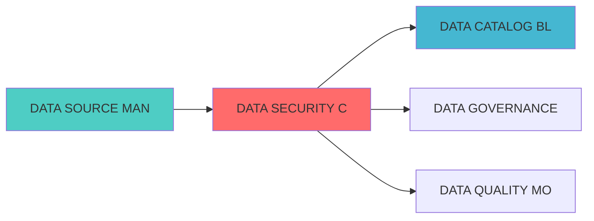

---
module_id: DATA_SECURITY_COMPLIANCE_001
version: 1.0.0
status: Active
created_date: 2026-04-07
last_updated: 2026-04-07
owner: 实施团队
standard_type: 专业量化机构蓝图
applicable_scope: Layer 1 数据å±?
compliance_level: 专业标准
responsibility:
  - 数据安å
¨åˆè§„
  - 数据加密
  - 访问控制
  - 合规审计
layer: Layer 5.1 (数据处理)
---

# DATA SECURITY COMPLIANCE BLUEPRINT

## 核心定位

负责数据安全合规的设计与实现，基于安全合规标准，实施数据访问控制和加密，确保数据安全合规。 提供数据管理、查询、更新功能，确保数据质量和一致性。


## 设计目标

### 主要目标

1. **功能完整性**: 确保DATA SECURITY COMPLIANCE功能完整，满足业务需求
2. **性能优化**: 提升系统性能，降低资源消耗
3. **可维护性**: 提高代码质量，便于后续维护
4. **可扩展性**: 支持功能扩展，适应业务变化

### 质量目标

- 代码覆盖率: ≥80%
- 性能指标: 满足设计要求
- 文档完整性: 100%


## 核心功能

### 功能清单

1. **数据管理**: 提供数据存储、查询、更新功能
2. **业务逻辑**: 实现核心业务逻辑处理
3. **接口服务**: 提供标准化的API接口
4. **监控告警**: 实时监控系统状态

### 功能特性

- 高可用性设计
- 自动故障恢复
- 灵活配置管理


## 实现方案

### 技术架构

采用DATA SECURITY COMPLIANCE化设计，分层架构实现。

### 关键技术

- 数据处理: 使用高效的数据处理框架
- 接口实现: RESTful API设计
- 性能优化: 缓存、异步处理

### 实施步骤

1. 需求分析与设计
2. 核心功能开发
3. 测试与优化
4. 部署与监控


## 核心定位

> 核心职责: Data Security Compliance蓝图设计
> 职责边界: 
> - âœ?本文档负责：Data Security Compliance蓝图设计相å
³å†
容
> - â?本文档不负责：å
¶ä»–模块å†
容，确保系统功能的稳定运行和高效执行ã€?


## 一、设计背景与目标

### 1.1 业务需æ±?

**当前痛点**:
- 数据安å
¨é£Žé™©é«?
- 合规要求复杂
- 访问控制不严æ ?
- 审计追踪不完å–?

**业务目标**:
- 建立å
¨é¢çš„数据安å
¨ä½“ç³?
- 确保符合监管要求
- 实现精细化访问控åˆ?
- 提供完整的审计追è¸?

### 1.2 技术目æ ?

| 指标 | 目标å€?| 说明 |
|------|--------|------|
| **数据加密覆盖çŽ?* | 100% | 所有敏感数据加å¯?|
| **访问控制准确çŽ?* | 100% | 访问控制准确çŽ?00% |
| **合规检查覆盖率** | 100% | 所有合规要求检æŸ?|
| **审计追踪完整æ€?* | 100% | 审计追踪完整记录 |

## 三、核心模块设è®?

### 3.1 数据加密管理å™?(DataEncryptionManager)

```python
from dataclasses import dataclass, field
from typing import Dict, List, Any, Optional
from datetime import datetime
from enum import Enum
import base64
import hashlib
from cryptography.fernet import Fernet
from cryptography.hazmat.primitives import hashes
from cryptography.hazmat.primitives.kdf.pbkdf2 import PBKDF2HMAC

class EncryptionAlgorithm(Enum):
    """加密算法"""
    AES_256 = "aes_256"
    RSA_2048 = "rsa_2048"
    FERNET = "fernet"

@dataclass
class EncryptionKey:
    """加密密钥"""
    key_id: str
    algorithm: EncryptionAlgorithm
    key_value: bytes
    created_at: datetime = field(default_factory=datetime.now)
    expires_at: Optional[datetime] = None
    metadata: Dict[str, Any] = field(default_factory=dict)

class DataEncryptionManager:
    """数据加密管理å™?""
    
    def __init__(self):
        self.keys: Dict[str, EncryptionKey] = {}
    
    def generate_key(self, key_id: str,
                     algorithm: EncryptionAlgorithm = EncryptionAlgorithm.FERNET) -> EncryptionKey:
        """生成加密密钥"""
        if algorithm == EncryptionAlgorithm.FERNET:
            key_value = Fernet.generate_key()
        else:
            # å
¶ä»–算法实现
            key_value = Fernet.generate_key()
        
        key = EncryptionKey(
            key_id=key_id,
            algorithm=algorithm,
            key_value=key_value
        )
        
        self.keys[key_id] = key
        return key
    
    def encrypt_data(self, data: str, key_id: str) -> str:
        """加密数据"""
        key = self.keys.get(key_id)
        if not key:
            raise ValueError(f"Key {key_id} not found")
        
        fernet = Fernet(key.key_value)
        encrypted = fernet.encrypt(data.encode())
        
        return base64.b64encode(encrypted).decode()
    
    def decrypt_data(self, encrypted_data: str, key_id: str) -> str:
        """解密数据"""
        key = self.keys.get(key_id)
        if not key:
            raise ValueError(f"Key {key_id} not found")
        
        fernet = Fernet(key.key_value)
        encrypted = base64.b64decode(encrypted_data.encode())
        decrypted = fernet.decrypt(encrypted)
        
        return decrypted.decode()
    
    def rotate_key(self, key_id: str) -> EncryptionKey:
        """轮换密钥"""
        old_key = self.keys.get(key_id)
        if not old_key:
            raise ValueError(f"Key {key_id} not found")
        
        new_key = self.generate_key(f"{key_id}_v{datetime.now().timestamp()}", old_key.algorithm)
        
        return new_key
```

### 3.2 访问控制管理å™?(AccessControlManager)

```python
from typing import Dict, List, Any, Set
from datetime import datetime
from enum import Enum

class Permission(Enum):
    """权限"""
    READ = "read"
    WRITE = "write"
    DELETE = "delete"
    ADMIN = "admin"

@dataclass
class User:
    """用户"""
    user_id: str
    username: str
    email: str
    roles: List[str]
    created_at: datetime = field(default_factory=datetime.now)

@dataclass
class Role:
    """角色"""
    role_id: str
    role_name: str
    permissions: Dict[str, Set[Permission]]
    description: str

class AccessControlManager:
    """访问控制管理å™?""
    
    def __init__(self):
        self.users: Dict[str, User] = {}
        self.roles: Dict[str, Role] = {}
    
    def create_role(self, role_config: Dict[str, Any]) -> Role:
        """创建角色"""
        role = Role(
            role_id=role_config['role_id'],
            role_name=role_config['role_name'],
            permissions=role_config.get('permissions', {}),
            description=role_config.get('description', '')
        )
        
        self.roles[role.role_id] = role
        return role
    
    def create_user(self, user_config: Dict[str, Any]) -> User:
        """创建用户"""
        user = User(
            user_id=user_config['user_id'],
            username=user_config['username'],
            email=user_config['email'],
            roles=user_config.get('roles', [])
        )
        
        self.users[user.user_id] = user
        return user
    
    def check_permission(self, user_id: str,
                         resource: str,
                         permission: Permission) -> bool:
        """检查权é™?""
        user = self.users.get(user_id)
        if not user:
            return False
        
        for role_id in user.roles:
            role = self.roles.get(role_id)
            if not role:
                continue
            
            if resource in role.permissions:
                if permission in role.permissions[resource]:
                    return True
        
        return False
    
    def grant_permission(self, role_id: str,
                        resource: str,
                        permission: Permission):
        """授予权限"""
        role = self.roles.get(role_id)
        if not role:
            return
        
        if resource not in role.permissions:
            role.permissions[resource] = set()
        
        role.permissions[resource].add(permission)
    
    def revoke_permission(self, role_id: str,
                         resource: str,
                         permission: Permission):
        """撤销权限"""
        role = self.roles.get(role_id)
        if not role:
            return
        
        if resource in role.permissions:
            role.permissions[resource].discard(permission)
```

### 3.3 数据脱敏å™?(DataMasker)

```python
from typing import Dict, List, Any, Callable
import re
import hashlib

class MaskingStrategy(Enum):
    """脱敏策略"""
    FULL = "full"
    PARTIAL = "partial"
    HASH = "hash"
    RANDOM = "random"

class DataMasker:
    """数据脱敏å™?""
    
    def __init__(self):
        self.masking_rules: Dict[str, Dict[str, Any]] = {}
    
    def register_masking_rule(self, field_name: str,
                               strategy: MaskingStrategy,
                               config: Dict[str, Any] = None):
        """注册脱敏规则"""
        self.masking_rules[field_name] = {
            "strategy": strategy,
            "config": config or {}
        }
    
    def mask_data(self, data: Dict[str, Any]) -> Dict[str, Any]:
        """脱敏数据"""
        masked_data = data.copy()
        
        for field_name, rule in self.masking_rules.items():
            if field_name in masked_data:
                masked_data[field_name] = self._apply_masking(
                    masked_data[field_name],
                    rule["strategy"],
                    rule["config"]
                )
        
        return masked_data
    
    def _apply_masking(self, value: Any,
                       strategy: MaskingStrategy,
                       config: Dict[str, Any]) -> Any:
        """应用脱敏策略"""
        if strategy == MaskingStrategy.FULL:
            return "***"
        
        elif strategy == MaskingStrategy.PARTIAL:
            if isinstance(value, str):
                visible_chars = config.get("visible_chars", 2)
                return value[:visible_chars] + "*" * (len(value) - visible_chars)
            return "***"
        
        elif strategy == MaskingStrategy.HASH:
            if isinstance(value, str):
                return hashlib.sha256(value.encode()).hexdigest()[:16]
            return "***"
        
        elif strategy == MaskingStrategy.RANDOM:
            if isinstance(value, str):
                return ''.join(['*' for _ in value])
            return "***"
        
        return value
    
    def mask_phone_number(self, phone: str) -> str:
        """脱敏手机å?""
        if len(phone) >= 11:
            return phone[:3] + "****" + phone[-4:]
        return "***"
    
    def mask_email(self, email: str) -> str:
        """脱敏邮箱"""
        if "@" in email:
            parts = email.split("@")
            username = parts[0]
            domain = parts[1]
            
            masked_username = username[:2] + "*" * (len(username) - 2)
            
            return f"{masked_username}@{domain}"
        return "***"
    
    def mask_id_card(self, id_card: str) -> str:
        """脱敏身份证号"""
        if len(id_card) >= 18:
            return id_card[:6] + "********" + id_card[-4:]
        return "***"
```

---
## 四、接口设è®?

### 4.1 RESTful API

#### 4.1.1 加密数据

```http
POST /api/v1/security/encrypt
```

**请求示例**:
```json
{
  "data": "敏感数据å†
容",
  "key_id": "data_encryption_key_001"
}
```

#### 4.1.2 检查权é™?

```http
POST /api/v1/security/check-permission
```

**请求示例**:
```json
{
  "user_id": "user_001",
  "resource": "stock_prices",
  "permission": "read"
}
```

#### 4.1.3 脱敏数据

```http
POST /api/v1/security/mask
```

**请求示例**:
```json
{
  "data": {
    "phone": "13800138000",
    "email": "user@example.com",
    "id_card": "110101199001011234"
  }
}
```

---

## 五、部署架æž?

```yaml
version: '3.8'
services:
  vault:
    image: hashicorp/vault:latest
    ports:
      - "8200:8200"
    environment:
      - VAULT_DEV_ROOT_TOKEN_ID=root
    cap_add:
      - IPC_LOCK
  
  opa:
    image: openpolicyagent/opa:latest
    ports:
      - "8181:8181"
    command: run --server --addr=:8181
  
  anchore:
    image: anchore/anchore-engine:latest
    ports:
      - "8228:8228"
    environment:
      - ANCHORE_ADMIN_PASSWORD=admin
  
  elasticsearch:
    image: elasticsearch:8.0.0
    ports:
      - "9200:9200"
    environment:
      - discovery.type=single-node
      - xpack.security.enabled=false
```

---

## å
­ã€ç›‘控指æ ?

| 指标名称 | 指标类型 | 说明 |
|---------|---------|------|
| `security_encryption_operations_total` | Counter | 加密操作总数 |
| `security_access_denials_total` | Counter | 访问拒绝总数 |
| `security_compliance_checks_total` | Counter | 合规检查总数 |
| `security_audit_events_total` | Counter | 审计事件总数 |

---

## 七、实施计åˆ?

| 阶段 | 任务 | 预计时间 |
|------|------|---------|
| **阶段1** | 搭建Vault和OPA | 3å¤?|
| **阶段2** | 开发加密管理器 | 4å¤?|
| **阶段3** | 开发访问控制管理器 | 4å¤?|
| **阶段4** | 开发数据脱敏器 | 3å¤?|
| **阶段5** | 测试和优åŒ?| 3å¤?|

---

## å
«ã€ç›¸å
³æ–‡æ¡?

- [数据治理平台蓝图](./DATA_GOVERNANCE_PLATFORM_BLUEPRINT.md)
- [数据源管理蓝图](./DATA_SOURCE_MANAGEMENT_BLUEPRINT.md)
- 数据血缘追踪蓝å›?

---

**文档版本**: v1.0.0 | **创建日期**: 2026-04-06 | **维护è€?*: 首席蓝图架构å¸?
---

## 1. 文档治理

### 1.1 System_Manifest.md索引

```markdown
#### Layer 6: 组合优化å±?
##### 6.001. Data Security Compliance
- **模块ID**: DATA_SECURITY_COMPLIANCE_001
- **蓝图文档**: DATA_SECURITY_COMPLIANCE_BLUEPRINT.md
- **技术规格书**: å¾
创å»?
- **职责**: Layer 0数据源层 | 业务架构: 三级时间框架融合架构
- **状æ€?*: Active
```

### 1.2 模块职责边界

| 模块 | 职责 | 边界 |
|------|------|------|
| **Data Security Compliance** | Layer 0数据源层 | 业务架构: 三级时间框架融合架构 | **核心模块** |

### 1.3 版本管理

| 版本 | 日期 | 变更å†
容 | 变更äº?|
|------|------|----------|--------|
| v1.0.0 | 2026-04-06 | 初始版本创建 | 首席蓝图架构å¸?|

---

**蓝图版本**: v1.0.0 | **创建日期**: 2026-04-06 | **状æ€?*: Active


---

## 📚 相å
³æ–‡æ¡£

### 上游依赖

| 文档名称 | module_id | 依赖类型 | 说明 |
|---------|-----------|---------|------|
| [DATA SOURCE MANAGEMENT BLUEPRINT](./DATA_SOURCE_MANAGEMENT_BLUEPRINT.md) | DATA_SOURCE_MANAGEMENT_001 | 中依èµ?| 获取数据源信æ?|

### 下游依赖

| 文档名称 | module_id | 依赖类型 | 说明 |
|---------|-----------|---------|------|
| [DATA CATALOG BLUEPRINT](./DATA_CATALOG_BLUEPRINT.md) | DATA_CATALOG_001 | 强依èµ?| 提供敏感数据标记 |
| [DATA GOVERNANCE PLATFORM BLUEPRINT](./DATA_GOVERNANCE_PLATFORM_BLUEPRINT.md) | DATA_GOVERNANCE_PLATFORM_001 | 强依èµ?| 执行合规策略 |
| [DATA QUALITY MONITORING BLUEPRINT](./DATA_QUALITY_MONITORING_BLUEPRINT.md) | DATA_QUALITY_MONITORING_001 | 中依èµ?| 提供安å
¨æ£€æŸ¥è§„åˆ?|

### 技术依èµ?

| 技术组ä»?| 版本 | 用é€?| 文档 |
|---------|------|------|------|
| **Apache Ranger** | 2.4+ | 权限管理 | [官方文档](https://ranger.apache.org/) |
| **HashiCorp Vault** | 1.15+ | 密钥管理 | [官方文档](https://www.vaultproject.io/) |

### 引用å
³ç³»å›?



## 变更历史

| 版本 | 日期 | 变更å†
容 | 变更äº?|
|------|------|----------|--------|
| v1.0.0 | 2026-04-07 | 初始版本创建 | 实施团队 |


---

**蓝图版本**: v1.0.0 | **创建日期**: 2026-04-07 | **状æ€?*: Active
