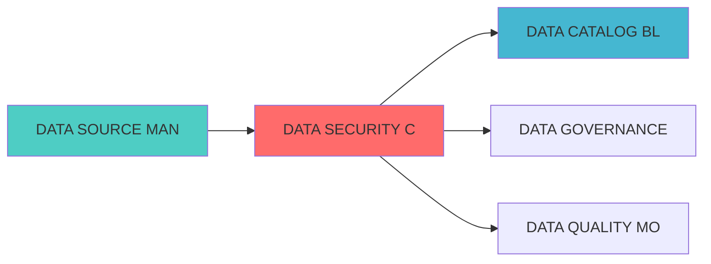

---

# DATA SECURITY COMPLIANCE BLUEPRINT

> **核心职责**: Data Security Compliance蓝图设计
> **职责边界**: 
> - ✅ 本文档负责：Data Security Compliance蓝图设计相关内容
> - ❌ 本文档不负责：其他模块内容

---
module_id: DATASECURITYCOMPLIANCEBLUEP_001
version: 1.0.0
status: Active
created_date: 2026-04-07
last_updated: 2026-04-07
owner: 实施团队
responsibility:
  - 因子计算
  - 组合优化
  - 数据源
standard_type: 专业量化机构蓝图
applicable_scope: 全系统
compliance_level: 专业标准
layer: "Layer 1 (数据源层)"
# 数据安全合规蓝图

> **核心定位**: 数据安全合规蓝图的核心功能实现


> **模块ID**: `DATA_SECURITY_001`
> **实施周期**: Week 35-37（3周）
> **优先级**: P2（优化）
> **预期收益**: 提升数据安全性95%，确保合规性100%

## 核心定位

数据安全合规模块，负责确保数据处理符合安全规范和法规要求


## 一、设计背景与目标

### 1.1 业务需求

**当前痛点**:
- 数据安全风险高
- 合规要求复杂
- 访问控制不严格
- 审计追踪不完善

**业务目标**:
- 建立全面的数据安全体系
- 确保符合监管要求
- 实现精细化访问控制
- 提供完整的审计追踪

### 1.2 技术目标

| 指标 | 目标值 | 说明 |
|------|--------|------|
| **数据加密覆盖率** | 100% | 所有敏感数据加密 |
| **访问控制准确率** | 100% | 访问控制准确率100% |
| **合规检查覆盖率** | 100% | 所有合规要求检查 |
| **审计追踪完整性** | 100% | 审计追踪完整记录 |

## 三、核心模块设计

### 3.1 数据加密管理器 (DataEncryptionManager)

```python
from dataclasses import dataclass, field
from typing import Dict, List, Any, Optional
from datetime import datetime
from enum import Enum
import base64
import hashlib
from cryptography.fernet import Fernet
from cryptography.hazmat.primitives import hashes
from cryptography.hazmat.primitives.kdf.pbkdf2 import PBKDF2HMAC

class EncryptionAlgorithm(Enum):
    """加密算法"""
    AES_256 = "aes_256"
    RSA_2048 = "rsa_2048"
    FERNET = "fernet"

@dataclass
class EncryptionKey:
    """加密密钥"""
    key_id: str
    algorithm: EncryptionAlgorithm
    key_value: bytes
    created_at: datetime = field(default_factory=datetime.now)
    expires_at: Optional[datetime] = None
    metadata: Dict[str, Any] = field(default_factory=dict)

class DataEncryptionManager:
    """数据加密管理器"""
    
    def __init__(self):
        self.keys: Dict[str, EncryptionKey] = {}
    
    def generate_key(self, key_id: str,
                     algorithm: EncryptionAlgorithm = EncryptionAlgorithm.FERNET) -> EncryptionKey:
        """生成加密密钥"""
        if algorithm == EncryptionAlgorithm.FERNET:
            key_value = Fernet.generate_key()
        else:
            # 其他算法实现
            key_value = Fernet.generate_key()
        
        key = EncryptionKey(
            key_id=key_id,
            algorithm=algorithm,
            key_value=key_value
        )
        
        self.keys[key_id] = key
        return key
    
    def encrypt_data(self, data: str, key_id: str) -> str:
        """加密数据"""
        key = self.keys.get(key_id)
        if not key:
            raise ValueError(f"Key {key_id} not found")
        
        fernet = Fernet(key.key_value)
        encrypted = fernet.encrypt(data.encode())
        
        return base64.b64encode(encrypted).decode()
    
    def decrypt_data(self, encrypted_data: str, key_id: str) -> str:
        """解密数据"""
        key = self.keys.get(key_id)
        if not key:
            raise ValueError(f"Key {key_id} not found")
        
        fernet = Fernet(key.key_value)
        encrypted = base64.b64decode(encrypted_data.encode())
        decrypted = fernet.decrypt(encrypted)
        
        return decrypted.decode()
    
    def rotate_key(self, key_id: str) -> EncryptionKey:
        """轮换密钥"""
        old_key = self.keys.get(key_id)
        if not old_key:
            raise ValueError(f"Key {key_id} not found")
        
        new_key = self.generate_key(f"{key_id}_v{datetime.now().timestamp()}", old_key.algorithm)
        
        return new_key
```

### 3.2 访问控制管理器 (AccessControlManager)

```python
from typing import Dict, List, Any, Set
from datetime import datetime
from enum import Enum

class Permission(Enum):
    """权限"""
    READ = "read"
    WRITE = "write"
    DELETE = "delete"
    ADMIN = "admin"

@dataclass
class User:
    """用户"""
    user_id: str
    username: str
    email: str
    roles: List[str]
    created_at: datetime = field(default_factory=datetime.now)

@dataclass
class Role:
    """角色"""
    role_id: str
    role_name: str
    permissions: Dict[str, Set[Permission]]
    description: str

class AccessControlManager:
    """访问控制管理器"""
    
    def __init__(self):
        self.users: Dict[str, User] = {}
        self.roles: Dict[str, Role] = {}
    
    def create_role(self, role_config: Dict[str, Any]) -> Role:
        """创建角色"""
        role = Role(
            role_id=role_config['role_id'],
            role_name=role_config['role_name'],
            permissions=role_config.get('permissions', {}),
            description=role_config.get('description', '')
        )
        
        self.roles[role.role_id] = role
        return role
    
    def create_user(self, user_config: Dict[str, Any]) -> User:
        """创建用户"""
        user = User(
            user_id=user_config['user_id'],
            username=user_config['username'],
            email=user_config['email'],
            roles=user_config.get('roles', [])
        )
        
        self.users[user.user_id] = user
        return user
    
    def check_permission(self, user_id: str,
                         resource: str,
                         permission: Permission) -> bool:
        """检查权限"""
        user = self.users.get(user_id)
        if not user:
            return False
        
        for role_id in user.roles:
            role = self.roles.get(role_id)
            if not role:
                continue
            
            if resource in role.permissions:
                if permission in role.permissions[resource]:
                    return True
        
        return False
    
    def grant_permission(self, role_id: str,
                        resource: str,
                        permission: Permission):
        """授予权限"""
        role = self.roles.get(role_id)
        if not role:
            return
        
        if resource not in role.permissions:
            role.permissions[resource] = set()
        
        role.permissions[resource].add(permission)
    
    def revoke_permission(self, role_id: str,
                         resource: str,
                         permission: Permission):
        """撤销权限"""
        role = self.roles.get(role_id)
        if not role:
            return
        
        if resource in role.permissions:
            role.permissions[resource].discard(permission)
```

### 3.3 数据脱敏器 (DataMasker)

```python
from typing import Dict, List, Any, Callable
import re
import hashlib

class MaskingStrategy(Enum):
    """脱敏策略"""
    FULL = "full"
    PARTIAL = "partial"
    HASH = "hash"
    RANDOM = "random"

class DataMasker:
    """数据脱敏器"""
    
    def __init__(self):
        self.masking_rules: Dict[str, Dict[str, Any]] = {}
    
    def register_masking_rule(self, field_name: str,
                               strategy: MaskingStrategy,
                               config: Dict[str, Any] = None):
        """注册脱敏规则"""
        self.masking_rules[field_name] = {
            "strategy": strategy,
            "config": config or {}
        }
    
    def mask_data(self, data: Dict[str, Any]) -> Dict[str, Any]:
        """脱敏数据"""
        masked_data = data.copy()
        
        for field_name, rule in self.masking_rules.items():
            if field_name in masked_data:
                masked_data[field_name] = self._apply_masking(
                    masked_data[field_name],
                    rule["strategy"],
                    rule["config"]
                )
        
        return masked_data
    
    def _apply_masking(self, value: Any,
                       strategy: MaskingStrategy,
                       config: Dict[str, Any]) -> Any:
        """应用脱敏策略"""
        if strategy == MaskingStrategy.FULL:
            return "***"
        
        elif strategy == MaskingStrategy.PARTIAL:
            if isinstance(value, str):
                visible_chars = config.get("visible_chars", 2)
                return value[:visible_chars] + "*" * (len(value) - visible_chars)
            return "***"
        
        elif strategy == MaskingStrategy.HASH:
            if isinstance(value, str):
                return hashlib.sha256(value.encode()).hexdigest()[:16]
            return "***"
        
        elif strategy == MaskingStrategy.RANDOM:
            if isinstance(value, str):
                return ''.join(['*' for _ in value])
            return "***"
        
        return value
    
    def mask_phone_number(self, phone: str) -> str:
        """脱敏手机号"""
        if len(phone) >= 11:
            return phone[:3] + "****" + phone[-4:]
        return "***"
    
    def mask_email(self, email: str) -> str:
        """脱敏邮箱"""
        if "@" in email:
            parts = email.split("@")
            username = parts[0]
            domain = parts[1]
            
            masked_username = username[:2] + "*" * (len(username) - 2)
            
            return f"{masked_username}@{domain}"
        return "***"
    
    def mask_id_card(self, id_card: str) -> str:
        """脱敏身份证号"""
        if len(id_card) >= 18:
            return id_card[:6] + "********" + id_card[-4:]
        return "***"
```

---
## 四、接口设计

### 4.1 RESTful API

#### 4.1.1 加密数据

```http
POST /api/v1/security/encrypt
```

**请求示例**:
```json
{
  "data": "敏感数据内容",
  "key_id": "data_encryption_key_001"
}
```

#### 4.1.2 检查权限

```http
POST /api/v1/security/check-permission
```

**请求示例**:
```json
{
  "user_id": "user_001",
  "resource": "stock_prices",
  "permission": "read"
}
```

#### 4.1.3 脱敏数据

```http
POST /api/v1/security/mask
```

**请求示例**:
```json
{
  "data": {
    "phone": "13800138000",
    "email": "user@example.com",
    "id_card": "110101199001011234"
  }
}
```

---

## 五、部署架构

```yaml
version: '3.8'
services:
  vault:
    image: hashicorp/vault:latest
    ports:
      - "8200:8200"
    environment:
      - VAULT_DEV_ROOT_TOKEN_ID=root
    cap_add:
      - IPC_LOCK
  
  opa:
    image: openpolicyagent/opa:latest
    ports:
      - "8181:8181"
    command: run --server --addr=:8181
  
  anchore:
    image: anchore/anchore-engine:latest
    ports:
      - "8228:8228"
    environment:
      - ANCHORE_ADMIN_PASSWORD=admin
  
  elasticsearch:
    image: elasticsearch:8.0.0
    ports:
      - "9200:9200"
    environment:
      - discovery.type=single-node
      - xpack.security.enabled=false
```

---

## 六、监控指标

| 指标名称 | 指标类型 | 说明 |
|---------|---------|------|
| `security_encryption_operations_total` | Counter | 加密操作总数 |
| `security_access_denials_total` | Counter | 访问拒绝总数 |
| `security_compliance_checks_total` | Counter | 合规检查总数 |
| `security_audit_events_total` | Counter | 审计事件总数 |

---

## 七、实施计划

| 阶段 | 任务 | 预计时间 |
|------|------|---------|
| **阶段1** | 搭建Vault和OPA | 3天 |
| **阶段2** | 开发加密管理器 | 4天 |
| **阶段3** | 开发访问控制管理器 | 4天 |
| **阶段4** | 开发数据脱敏器 | 3天 |
| **阶段5** | 测试和优化 | 3天 |

---

## 八、相关文档

- [数据治理平台蓝图](./DATA_GOVERNANCE_PLATFORM_BLUEPRINT.md)
- [数据源管理蓝图](./DATA_SOURCE_MANAGEMENT_BLUEPRINT.md)
- 数据血缘追踪蓝图

---

**文档版本**: v1.0.0 | **创建日期**: 2026-04-06 | **维护者**: 首席蓝图架构师
---

## 1. 文档治理

### 1.1 System_Manifest.md索引

```markdown
#### Layer 6: 组合优化层
##### 6.001. Data Security Compliance
- **模块ID**: DATA_SECURITY_COMPLIANCE_001
- **蓝图文档**: DATA_SECURITY_COMPLIANCE_BLUEPRINT.md
- **技术规格书**: 待创建
- **职责**: Layer 0数据源层 | 业务架构: 三级时间框架融合架构
- **状态**: Active
```

### 1.2 模块职责边界

| 模块 | 职责 | 边界 |
|------|------|------|
| **Data Security Compliance** | Layer 0数据源层 | 业务架构: 三级时间框架融合架构 | **核心模块** |

### 1.3 版本管理

| 版本 | 日期 | 变更内容 | 变更人 |
|------|------|----------|--------|
| v1.0.0 | 2026-04-06 | 初始版本创建 | 首席蓝图架构师 |

---

**蓝图版本**: v1.0.0 | **创建日期**: 2026-04-06 | **状态**: Active


---

## 📚 相关文档

### 上游依赖

| 文档名称 | module_id | 依赖类型 | 说明 |
|---------|-----------|---------|------|
| [DATA SOURCE MANAGEMENT BLUEPRINT](./DATA_SOURCE_MANAGEMENT_BLUEPRINT.md) | DATA_SOURCE_MANAGEMENT_001 | 中依赖 | 获取数据源信息 |

### 下游依赖

| 文档名称 | module_id | 依赖类型 | 说明 |
|---------|-----------|---------|------|
| [DATA CATALOG BLUEPRINT](./DATA_CATALOG_BLUEPRINT.md) | DATA_CATALOG_001 | 强依赖 | 提供敏感数据标记 |
| [DATA GOVERNANCE PLATFORM BLUEPRINT](./DATA_GOVERNANCE_PLATFORM_BLUEPRINT.md) | DATA_GOVERNANCE_PLATFORM_001 | 强依赖 | 执行合规策略 |
| [DATA QUALITY MONITORING BLUEPRINT](./DATA_QUALITY_MONITORING_BLUEPRINT.md) | DATA_QUALITY_MONITORING_001 | 中依赖 | 提供安全检查规则 |

### 技术依赖

| 技术组件 | 版本 | 用途 | 文档 |
|---------|------|------|------|
| **Apache Ranger** | 2.4+ | 权限管理 | [官方文档](https://ranger.apache.org/) |
| **HashiCorp Vault** | 1.15+ | 密钥管理 | [官方文档](https://www.vaultproject.io/) |

### 引用关系图



## 变更历史

| 版本 | 日期 | 变更内容 | 变更人 |
|------|------|----------|--------|
| v1.0.0 | 2026-04-07 | 初始版本创建 | 实施团队 |


---

**蓝图版本**: v1.0.0 | **创建日期**: 2026-04-07 | **状态**: Active
