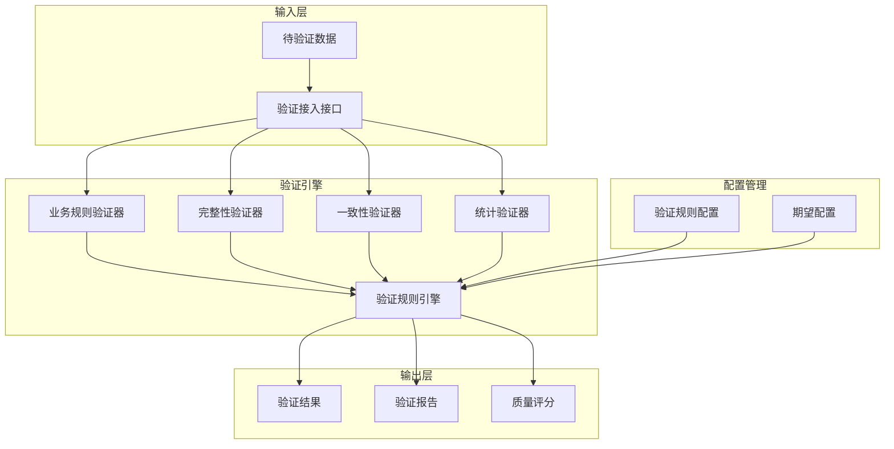

# 数据验证引擎蓝图

> **核心职责**: 业务规则验证、数据完整性检查、数据一致性验证
> **职责边界**: 
> - ✅ 本文档负责：数据验证、业务规则检查、完整性验证
> - ❌ 本文档不负责：数据清洗（由清洗引擎负责）

## 📋 执行摘要

本蓝图设计基于Great Expectations和Pandera的数据验证引擎，提供专业级数据验证能力，适合个人开发和AI维护。

**核心价值**:
- 业务规则自动验证
- 数据完整性检查
- 跨源数据一致性验证
- 验证报告生成
- 数据质量评分

**开源方案**: Great Expectations + Pandera + Voluptuous

**预估工作量**: 50小时

---

## 1. 模块定位与目标

### 1.1 模块定位

**Layer定位**: Layer 1 - 数据预处理层（数据治理模块）

**核心价值**:
- 确保数据符合业务规则
- 防止脏数据进入系统
- 提供数据质量度量
- 自动化验证流程

**业务价值**:
- 降低数据风险
- 提高数据可信度
- 减少人工审核
- 提升系统稳定性

### 1.2 设计目标

| 目标 | 优先级 | 技术实现 |
|------|--------|----------|
| **业务规则验证** | P0 | Great Expectations |
| **数据完整性检查** | P0 | Pandera Schema |
| **跨源一致性验证** | P0 | 自定义验证器 |
| **验证报告生成** | P1 | Great Expectations Docs |
| **数据质量评分** | P1 | 自定义评分引擎 |

---

## 2. 系统架构设计

### 2.1 架构概览



### 2.2 核心组件

#### 2.2.1 业务规则验证器

**职责**: 验证数据是否符合业务规则

**技术栈**: Great Expectations

**核心功能**:
- 价格范围验证
- 成交量合理性验证
- 时间序列连续性验证
- 市场状态验证

#### 2.2.2 完整性验证器

**职责**: 验证数据完整性

**技术栈**: Pandera

**核心功能**:
- 必填字段检查
- 数据类型验证
- 唯一性约束验证
- 外键约束验证

#### 2.2.3 一致性验证器

**职责**: 验证跨源数据一致性

**技术栈**: 自定义验证器

**核心功能**:
- 跨数据源对比
- 时间戳对齐验证
- 价格一致性验证
- 成交量一致性验证

#### 2.2.4 统计验证器

**职责**: 验证数据统计特性

**技术栈**: Great Expectations

**核心功能**:
- 分布验证
- 统计指标验证
- 异常分布检测
- 趋势验证

---

## 3. 开源方案集成

### 3.1 Great Expectations集成

**GitHub**: https://github.com/great-expectations/great_expectations

**Star数**: 9.8k+

**核心特性**:
- 丰富的内置期望类型
- 自动化数据文档生成
- 验证结果可视化
- 支持多种数据源

**集成方式**:

```python
import great_expectations as gx
from great_expectations.dataset import SparkDataset

class BusinessRuleValidator:
    """业务规则验证器"""
    
    def __init__(self, spark, config):
        self.spark = spark
        self.config = config
        self.context = gx.get_context()
    
    def validate_price_range(self, df, symbol, price_column='close'):
        """
        验证价格范围
        
        Args:
            df: Spark DataFrame
            symbol: 股票代码
            price_column: 价格列名
        
        Returns:
            ValidationResult: 验证结果
        """
        expectations = self.config.get('price_ranges', {}).get(symbol, {})
        
        if not expectations:
            return self._create_warning_result(f"No price range config for {symbol}")
        
        min_price = expectations.get('min', 0)
        max_price = expectations.get('max', float('inf'))
        
        expectation_suite = self.context.add_expectation_suite(
            f"price_range_{symbol}"
        )
        
        expectation_suite.add_expectation(
            gx.expectations.ExpectColumnValuesToBeBetween(
                column=price_column,
                min_value=min_price,
                max_value=max_price
            )
        )
        
        validator = self.context.get_validator(
            batch_request=self._create_batch_request(df),
            expectation_suite=expectation_suite
        )
        
        return validator.validate()
    
    def validate_volume(self, df, volume_column='volume'):
        """
        验证成交量合理性
        
        Args:
            df: Spark DataFrame
            volume_column: 成交量列名
        
        Returns:
            ValidationResult: 验证结果
        """
        expectation_suite = self.context.add_expectation_suite("volume_validation")
        
        expectation_suite.add_expectation(
            gx.expectations.ExpectColumnValuesToBeBetween(
                column=volume_column,
                min_value=0,
                max_value=1e12
            )
        )
        
        expectation_suite.add_expectation(
            gx.expectations.ExpectColumnValuesToNotBeNull(
                column=volume_column
            )
        )
        
        validator = self.context.get_validator(
            batch_request=self._create_batch_request(df),
            expectation_suite=expectation_suite
        )
        
        return validator.validate()
    
    def validate_time_continuity(self, df, time_column='timestamp', freq='1min'):
        """
        验证时间序列连续性
        
        Args:
            df: Spark DataFrame
            time_column: 时间列名
            freq: 预期频率
        
        Returns:
            ValidationResult: 验证结果
        """
        expectation_suite = self.context.add_expectation_suite("time_continuity")
        
        expectation_suite.add_expectation(
            gx.expectations.ExpectColumnValuesToBeUnique(
                column=time_column
            )
        )
        
        expectation_suite.add_expectation(
            gx.expectations.ExpectColumnValuesToNotBeNull(
                column=time_column
            )
        )
        
        validator = self.context.get_validator(
            batch_request=self._create_batch_request(df),
            expectation_suite=expectation_suite
        )
        
        return validator.validate()
```

### 3.2 Pandera集成

**GitHub**: https://github.com/unionai-oss/pandera

**Star数**: 3.2k+

**核心特性**:
- Schema定义与验证
- 数据类型强制转换
- 统计验证
- 支持Spark DataFrame

**集成方式**:

```python
import pandera as pa
from pandera import Column, DataFrameSchema, Check
from pandera.typing import SparkDataFrame

class IntegrityValidator:
    """完整性验证器"""
    
    def __init__(self, spark, config):
        self.spark = spark
        self.config = config
        self.schemas = self._load_schemas()
    
    def _load_schemas(self):
        """加载Schema定义"""
        return {
            'tick_data': DataFrameSchema({
                'symbol': Column(str, Check.str_length(min_value=1)),
                'timestamp': Column(pa.DateTime, nullable=False),
                'open': Column(float, Check.ge(0)),
                'high': Column(float, Check.ge(0)),
                'low': Column(float, Check.ge(0)),
                'close': Column(float, Check.ge(0)),
                'volume': Column(int, Check.ge(0)),
            }, strict=True),
            
            'order_book': DataFrameSchema({
                'symbol': Column(str, Check.str_length(min_value=1)),
                'timestamp': Column(pa.DateTime, nullable=False),
                'bid_price': Column(float, Check.ge(0)),
                'bid_volume': Column(int, Check.ge(0)),
                'ask_price': Column(float, Check.ge(0)),
                'ask_volume': Column(int, Check.ge(0)),
            }, strict=True),
            
            'trade_data': DataFrameSchema({
                'symbol': Column(str, Check.str_length(min_value=1)),
                'timestamp': Column(pa.DateTime, nullable=False),
                'price': Column(float, Check.ge(0)),
                'volume': Column(int, Check.ge(0)),
                'side': Column(str, Check.isin(['buy', 'sell'])),
            }, strict=True)
        }
    
    def validate_schema(self, df, schema_name):
        """
        验证Schema
        
        Args:
            df: Spark DataFrame
            schema_name: Schema名称
        
        Returns:
            ValidationResult: 验证结果
        """
        schema = self.schemas.get(schema_name)
        
        if not schema:
            raise ValueError(f"Unknown schema: {schema_name}")
        
        try:
            validated_df = schema.validate(df)
            return {
                'success': True,
                'errors': [],
                'warnings': []
            }
        except pa.errors.SchemaError as e:
            return {
                'success': False,
                'errors': e.failure_cases.to_dict('records'),
                'warnings': []
            }
    
    def validate_completeness(self, df, required_columns):
        """
        验证数据完整性
        
        Args:
            df: Spark DataFrame
            required_columns: 必填列列表
        
        Returns:
            ValidationResult: 验证结果
        """
        errors = []
        
        for col in required_columns:
            null_count = df.filter(df[col].isNull()).count()
            if null_count > 0:
                errors.append({
                    'column': col,
                    'error': f"Found {null_count} null values",
                    'severity': 'error'
                })
        
        return {
            'success': len(errors) == 0,
            'errors': errors,
            'warnings': []
        }
    
    def validate_uniqueness(self, df, unique_columns):
        """
        验证唯一性约束
        
        Args:
            df: Spark DataFrame
            unique_columns: 唯一性约束列列表
        
        Returns:
            ValidationResult: 验证结果
        """
        errors = []
        
        for cols in unique_columns:
            if isinstance(cols, str):
                cols = [cols]
            
            duplicate_count = df.groupBy(*cols).count().filter('count > 1').count()
            
            if duplicate_count > 0:
                errors.append({
                    'columns': cols,
                    'error': f"Found {duplicate_count} duplicate groups",
                    'severity': 'error'
                })
        
        return {
            'success': len(errors) == 0,
            'errors': errors,
            'warnings': []
        }
```

### 3.3 一致性验证器

**技术栈**: 自定义实现

**核心功能**:
- 跨数据源对比
- 时间戳对齐
- 价格一致性验证

```python
from pyspark.sql import SparkSession
from pyspark.sql.functions import col, abs as spark_abs

class ConsistencyValidator:
    """一致性验证器"""
    
    def __init__(self, spark: SparkSession, config):
        self.spark = spark
        self.config = config
        self.tolerance = config.get('tolerance', 0.01)
    
    def validate_cross_source(self, df1, df2, key_columns, value_columns):
        """
        跨数据源验证
        
        Args:
            df1: 第一个数据源
            df2: 第二个数据源
            key_columns: 键列
            value_columns: 值列
        
        Returns:
            ValidationResult: 验证结果
        """
        errors = []
        
        joined_df = df1.alias('a').join(
            df2.alias('b'),
            on=key_columns,
            how='inner'
        )
        
        for value_col in value_columns:
            diff_col = f"{value_col}_diff"
            joined_df = joined_df.withColumn(
                diff_col,
                spark_abs(col(f"a.{value_col}") - col(f"b.{value_col}")) / col(f"a.{value_col}")
            )
            
            inconsistent_count = joined_df.filter(col(diff_col) > self.tolerance).count()
            
            if inconsistent_count > 0:
                errors.append({
                    'column': value_col,
                    'error': f"Found {inconsistent_count} inconsistent records",
                    'tolerance': self.tolerance,
                    'severity': 'warning'
                })
        
        return {
            'success': len(errors) == 0,
            'errors': errors,
            'warnings': []
        }
    
    def validate_timestamp_alignment(self, df1, df2, timestamp_column='timestamp'):
        """
        验证时间戳对齐
        
        Args:
            df1: 第一个数据源
            df2: 第二个数据源
            timestamp_column: 时间戳列名
        
        Returns:
            ValidationResult: 验证结果
        """
        errors = []
        
        timestamps1 = df1.select(timestamp_column).distinct().collect()
        timestamps2 = df2.select(timestamp_column).distinct().collect()
