---
responsibility:
  - 动态相关性建æ¨?
  - 相关性预æµ?
  - 相关性矩é˜?
  - 相关性分æž?

module_id: DYNAMIC_CORRELATION_MODELING_001
version: 1.0.0
status: Active
created_date: 2026-04-07
last_updated: 2026-04-07
owner: 实施团队
standard_type: 专业量化机构蓝图
applicable_scope: Layer 6 组合优化å±?
compliance_level: 专业标准
layer: Layer 5.3 (风险管理)
---


## 核心定位

负责动态相关性建模的设计与实现，基于时变相关性模型，捕捉资产间相关性的动态变化，支持风险管理和组合优化。

# 动态相关性建模蓝å›?
## 核心定位

构建动态相关性建模的设计与实现，基于时变相关系数模型技术，捕捉资产间相关性的动态变化，支持风险管理和资产配置决策ã€?

---


> **核心职责**: 使用DCC-GARCH模型实时更新资产间相关æ€?
> **职责边界**: 
> - âœ?本文档负责：动态相关性、相关性突变识åˆ?
> - â?本文档不负责：因子计算（由因子模块负责）
## 📚 相关文档

### 上游依赖

| 文档名称 | module_id | 依赖类型 | 说明 |
|---------|-----------|---------|------|
| [数据质量监控蓝图](./DATA_QUALITY_MONITORING_BLUEPRINT.md) | DATA_QUALITY_MONITORING_001 | 强依èµ?| 提供数据质量指标 |
| [数据目录蓝图](./DATA_CATALOG_BLUEPRINT.md) | DATA_CATALOG_001 | 强依èµ?| 提供资产元数æ?|
| 数据血缘追踪蓝å›?| DATA_LINEAGE_TRACKING_001 | 中依èµ?| 提供数据血ç¼?|

### 下游依赖

| 文档名称 | module_id | 依赖类型 | 说明 |
|---------|-----------|---------|------|
| [风险平价策略蓝图](./RISK_PARITY_STRATEGY_BLUEPRINT.md) | RISK_PARITY_STRATEGY_001 | 强依èµ?| 风险平价策略 |
| [组合优化引擎集成蓝图](./PORTFOLIO_OPTIMIZER_INTEGRATION_BLUEPRINT.md) | PORTFOLIO_OPTIMIZER_INTEGRATION_001 | 强依èµ?| 组合优化 |
| [VaR/ES监控蓝图](./VAR_ES_MONITORING_BLUEPRINT.md) | VAR_ES_MONITORING_001 | 中依èµ?| VaR/ES监控 |

### 技术依èµ?

| 技术组ä»?| 版本 | 用é€?| 文档 |
|---------|------|------|------|
| **arch** | 5.0+ | GARCH模型 | [官方文档](https://arch.readthedocs.io/) |
| **mgarch** | 0.1+ | 多元GARCH | [官方文档](https://github.com/abbass2/mgarch) |
| **NumPy** | 1.24+ | 数值计ç®?| [官方文档](https://numpy.org/) |
| **Pandas** | 2.0+ | 数据处理 | [官方文档](https://pandas.pydata.org/) |

### 引用关系å›?

```mermaid
graph LR
    A[数据质量监控] --> B[动态相关性建模]
    C[数据目录] --> B
    D[数据血缘追踪] --> B
    
    B --> E[风险平价策略]
    B --> F[组合优化引擎]
    B --> G[VaR/ES监控]
    
    style B fill:#ff6b6b
    style A fill:#4ecdc4
    style C fill:#45b7d1
```



---

## 2. 架构设计

### 2.1 系统架构?
```
┌─────────────────────────────────────────────────────────────────??                 跨资产相关性动态建模系统架?                     ?├─────────────────────────────────────────────────────────────────??                                                                ?? ┌──────────────────────────────────────────────────────────? ?? ?             数据输入?                                   ? ?? ? ┌──────────? ┌──────────? ┌──────────? ┌──────────?? ?? ? ?股票收益 ? ?债券收益 ? ?商品收益 ? ?汇率收益 ?? ?? ? ?数据     ? ?数据     ? ?数据     ? ?数据     ?? ?? ? └──────────? └──────────? └──────────? └──────────?? ?? └──────────────────────────────────────────────────────────? ??                         ?                                     ?? ┌──────────────────────────────────────────────────────────? ?? ?             GARCH模型层（单资产波动率建模?               ? ?? ? ┌────────────────────────────────────────────────────? ? ?? ? ? GARCH(1,1) Model for Each Asset                   ? ? ?? ? ? σ²?= ω + α·ε²ₜ₋?+ β·σ²ₜ₋?                     ? ? ?? ? └────────────────────────────────────────────────────? ? ?? └──────────────────────────────────────────────────────────? ??                         ?                                     ?? ┌──────────────────────────────────────────────────────────? ?? ?             DCC模型层（动态相关性建模）                    ? ?? ? ┌────────────────────────────────────────────────────? ? ?? ? ? Dynamic Conditional Correlation (DCC)             ? ? ?? ? ? Q?= (1-α-β)·Q̄ + α·uₜ₋₁·u'ₜ₋?+ β·Qₜ₋?        ? ? ?? ? ? R?= diag(Q??² · Q?· diag(Q??²           ? ? ?? ? └────────────────────────────────────────────────────? ? ?? └──────────────────────────────────────────────────────────? ??                         ?                                     ?? ┌──────────────────────────────────────────────────────────? ?? ?             相关性突变检测层                              ? ?? ? ┌──────────? ┌──────────? ┌──────────?              ? ?? ? ?结构突变 ? ?极端市场 ? ?相关?  ?              ? ?? ? ?检?    ? ?识别     ? ?预警     ?              ? ?? ? └──────────? └──────────? └──────────?              ? ?? └──────────────────────────────────────────────────────────? ??                         ?                                     ?? ┌──────────────────────────────────────────────────────────? ?? ?             输出?                                       ? ?? ? ┌──────────? ┌──────────? ┌──────────?              ? ?? ? ?动态相?? ?突变预警 ? ?风险调整 ?              ? ?? ? ?性矩?  ? ?信号     ? ?建议     ?              ? ?? ? └──────────? └──────────? └──────────?              ? ?? └──────────────────────────────────────────────────────────? ?└─────────────────────────────────────────────────────────────────?```

### 2.2 核心数据?
```
市场收益率数?    ?数据预处理（缺失值处理、异常值检测）
    ?单资产GARCH模型拟合（估计条件波动率?    ?标准化残差计?    ?DCC模型拟合（估计动态相关性）
    ?动态相关性矩阵输?    ?相关性突变检?    ?预警信号生成
```

---

## 3. 核心模块设计

### 3.1 动态相关性建模器（DynamicCorrelationModeler?
```python
class DynamicCorrelationModeler:
    """
    动态相关性建模器
    
    索引: DYNAMIC_CORR_001-M01
    职责: 使用DCC-GARCH模型估计动态相关性矩?    输入: 多资产收益率数据
    输出: 动态相关性矩阵、突变检测结果、预警信?    """
    
    def __init__(self, config: DCCConfig):
        self.config = config
        self.garch_models = {}  # 存储各资产的GARCH模型
        self.dcc_model = None   # DCC模型
        self.regime_detector = CorrelationRegimeDetector()
        
    def fit(self, returns_data: pd.DataFrame) -> 'DynamicCorrelationModeler':
        """
        拟合DCC-GARCH模型
        
        Args:
            returns_data: 多资产收益率数据（DataFrame，列为资产）
            
        Returns:
            self: 拟合后的模型实例
        """
        # 1. 拟合单资产GARCH模型
        for asset in returns_data.columns:
            self.garch_models[asset] = self._fit_garch(
                returns_data[asset]
            )
        
        # 2. 计算标准化残?        standardized_residuals = self._calculate_standardized_residuals(
            returns_data
        )
        
        # 3. 拟合DCC模型
        self.dcc_model = self._fit_dcc(standardized_residuals)
        
        return self
    
    def estimate_dynamic_correlation(
        self, 
        returns_data: pd.DataFrame,
        market_state: str = 'normal'
    ) -> DynamicCorrelationResult:
        """
        估计动态相关性矩?        
        Args:
            returns_data: 多资产收益率数据
            market_state: 市场状态（normal/extreme?            
        Returns:
            DynamicCorrelationResult: 动态相关性结?        """
        # 1. 获取动态相关性矩?        dcc_correlation = self.dcc_model.conditional_correlation()
        
        # 2. 检测相关性突?        regime_change = self.regime_detector.detect(dcc_correlation)
        
        # 3. 极端市场调整
        if market_state == 'extreme':
            dcc_correlation = self._adjust_for_extreme_market(
                dcc_correlation, regime_change
            )
        
        # 4. 计算协方差矩?        conditional_volatility = self._get_conditional_volatility()
        dynamic_covariance = self._correlation_to_covariance(
            dcc_correlation, conditional_volatility
        )
        
        return DynamicCorrelationResult(
            correlation_matrix=dcc_correlation,
            covariance_matrix=dynamic_covariance,
            regime=regime_change,
            confidence=self._calculate_confidence(dcc_correlation),
            timestamp=datetime.now()
        )
    
    def detect_correlation_breakdown(
        self,
        correlation_history: List[pd.DataFrame],
        window: int = 20
    ) -> CorrelationBreakdownResult:
        """
        检测相关性突?        
        Args:
            correlation_history: 历史相关性矩阵列?            window: 检测窗口大?            
        Returns:
            CorrelationBreakdownResult: 突变检测结?        """
        # 1. 计算相关性变化率
        correlation_changes = self._calculate_correlation_changes(
            correlation_history, window
        )
        
        # 2. 识别突变?        breakdown_points = self._identify_breakdown_points(
            correlation_changes
        )
        
        # 3. 评估突变严重程度
        severity = self._assess_breakdown_severity(breakdown_points)
        
        return CorrelationBreakdownResult(
            breakdown_points=breakdown_points,
            severity=severity,
            affected_assets=self._identify_affected_assets(breakdown_points),
            recommendation=self._generate_breakdown_recommendation(severity)
        )
    
    def forecast_correlation(
        self,
        horizon: int = 5
    ) -> CorrelationForecast:
        """
        预测未来相关?        
        Args:
            horizon: 预测期数（天数）
            
        Returns:
            CorrelationForecast: 相关性预测结?        """
        # 1. 预测条件波动?        volatility_forecast = self._forecast_volatility(horizon)
        
        # 2. 预测相关?        correlation_forecast = self.dcc_model.forecast(horizon)
        
        # 3. 计算预测区间
        confidence_interval = self._calculate_forecast_interval(
            correlation_forecast
        )
        
        return CorrelationForecast(
            correlation_forecast=correlation_forecast,
            volatility_forecast=volatility_forecast,
            confidence_interval=confidence_interval,
            forecast_horizon=horizon
        )
    
    def _fit_garch(self, returns: pd.Series) -> arch_model:
        """拟合单资产GARCH模型"""
        model = arch_model(returns, vol='Garch', p=1, q=1)
        fitted_model = model.fit(disp='off')
        return fitted_model
    
    def _calculate_standardized_residuals(
        self, 
        returns_data: pd.DataFrame
    ) -> pd.DataFrame:
        """计算标准化残?""
        standardized = pd.DataFrame(index=returns_data.index)
        
        for asset in returns_data.columns:
            residuals = self.garch_models[asset].resid
            conditional_vol = self.garch_models[asset].conditional_volatility
            standardized[asset] = residuals / conditional_vol
        
        return standardized
    
    def _fit_dcc(self, standardized_residuals: pd.DataFrame):
        """拟合DCC模型"""
        from mgarch import mgarch
        
        dist = 't'
        model = mgarch.mgarch(dist)
        model.fit(standardized_residuals)
        
        return model
    
    def _adjust_for_extreme_market(
        self,
        correlation: pd.DataFrame,
        regime_change: RegimeChange
    ) -> pd.DataFrame:
        """极端市场相关性调?""
        # 在极端市场下，相关性趋向于1
        adjustment_factor = self.config.extreme_market_adjustment_factor
        
        if regime_change.is_extreme:
            # 增加相关性（趋向??            adjusted_corr = correlation + adjustment_factor * (1 - correlation)
            # 确保对角线为1
            np.fill_diagonal(adjusted_corr.values, 1.0)
            return adjusted_corr
        
        return correlation
```

### 3.2 相关性突变检测器（CorrelationRegimeDetector?
```python
class CorrelationRegimeDetector:
    """
    相关性突变检测器
    
    索引: DYNAMIC_CORR_001-M02
    职责: 检测相关性结构性突?    """
    
    def __init__(self, config: RegimeDetectionConfig):
        self.config = config
        self.breakdown_threshold = config.breakdown_threshold
        
    def detect(
        self, 
        correlation_matrix: pd.DataFrame
    ) -> RegimeChange:
        """
        检测相关性突?        
        Args:
            correlation_matrix: 当前相关性矩?            
        Returns:
            RegimeChange: 突变检测结?        """
        # 1. 计算相关性均值变?        mean_correlation = correlation_matrix.values[
            np.triu_indices_from(correlation_matrix.values, k=1)
        ].mean()
        
        # 2. 与历史均值比?        historical_mean = self._get_historical_mean_correlation()
        deviation = abs(mean_correlation - historical_mean)
        
        # 3. 判断是否突变
        is_breakdown = deviation > self.breakdown_threshold
        
        # 4. 识别极端市场
        is_extreme = self._is_extreme_market(correlation_matrix)
        
        return RegimeChange(
            is_breakdown=is_breakdown,
            is_extreme=is_extreme,
            deviation=deviation,
            mean_correlation=mean_correlation,
            historical_mean=historical_mean,
            timestamp=datetime.now()
        )
    
    def _is_extreme_market(
        self, 
        correlation_matrix: pd.DataFrame
    ) -> bool:
        """判断是否为极端市?""
        # 极端市场特征：相关性普遍升高（趋向??        off_diagonal = correlation_matrix.values[
            np.triu_indices_from(correlation_matrix.values, k=1)
        ]
        mean_corr = off_diagonal.mean()
        
        return mean_corr > self.config.extreme_correlation_threshold
```

### 3.3 配置类定?
```python
@dataclass
class DCCConfig:
    """DCC模型配置"""
    garch_p: int = 1  # GARCH模型p?    garch_q: int = 1  # GARCH模型q?    dcc_alpha: float = 0.05  # DCC模型alpha参数
    dcc_beta: float = 0.9   # DCC模型beta参数
    extreme_market_adjustment_factor: float = 0.3  # 极端市场调整因子
    retrain_frequency: int = 30  # 模型重训练频率（天）
    
@dataclass
class RegimeDetectionConfig:
    """突变检测配?""
    breakdown_threshold: float = 0.15  # 突变?    extreme_correlation_threshold: float = 0.7  # 极端市场相关性阈?    lookback_window: int = 252  # 回看窗口（交易日?```

---

## 4. 数据模型定义

### 4.1 输入数据模型

```python
@dataclass
class AssetReturns:
    """资产收益率数?""
    symbol: str
    returns: pd.Series  # 日收益率序列
    timestamps: pd.DatetimeIndex
    
@dataclass
class MarketData:
    """市场数据"""
    assets: List[AssetReturns]
    market_regime: str  # normal/stress/crisis
```

### 4.2 输出数据模型

```python
@dataclass
class DynamicCorrelationResult:
    """动态相关性结?""
    correlation_matrix: pd.DataFrame
    covariance_matrix: pd.DataFrame
    regime: RegimeChange
    confidence: float
    timestamp: datetime
    
@dataclass
class CorrelationBreakdownResult:
    """相关性突变结?""
    breakdown_points: List[datetime]
    severity: str  # low/medium/high
    affected_assets: List[str]
    recommendation: str
    
@dataclass
class RegimeChange:
    """范式转换结果"""
    is_breakdown: bool
    is_extreme: bool
    deviation: float
    mean_correlation: float
    historical_mean: float
    timestamp: datetime
```

---

## 5. 技术实现细?
### 5.1 DCC-GARCH模型原理

**GARCH(1,1)模型**（单资产波动率）?```
σ²?= ω + α·ε²ₜ₋?+ β·σ²ₜ₋?```

**DCC模型**（动态相关性）?```
Q?= (1-α-β)·Q̄ + α·uₜ₋₁·u'ₜ₋?+ β·Qₜ₋?R?= diag(Q??² · Q?· diag(Q??²
```

其中?- Q? 拟相关性矩?- R? 动态相关性矩?- u? 标准化残?- α, β: DCC参数

### 5.2 开源库选择

**推荐?*?1. **arch**: 用于GARCH模型拟合
   - 安装：`pip install arch`
   - 文档：https://arch.readthedocs.io/

2. **mgarch**: 用于DCC模型拟合
   - 安装：`pip install mgarch`
   - GitHub: https://github.com/ritchan/mgarch

3. **备选方?*: 使用`statsmodels` + 自实现DCC

### 5.3 性能优化

**计算优化**?- 使用Numba加速矩阵运?- 并行计算多资产GARCH模型
- 缓存中间结果

**内存优化**?- 仅保留最近N天的数据
- 定期清理历史相关性矩?
---

## 6. 集成方案

### 6.1 与风险平价优化器集成

```python
class RiskParityOptimizer:
    """风险平价优化器（集成动态相关性）"""
    
    def __init__(self, correlation_modeler: DynamicCorrelationModeler):
        self.correlation_modeler = correlation_modeler
        
    def optimize(self, returns: pd.DataFrame) -> pd.Series:
        """执行风险平价优化"""
        # 1. 获取动态相关性矩?        corr_result = self.correlation_modeler.estimate_dynamic_correlation(
            returns
        )
        
        # 2. 使用动态协方差矩阵进行优化
        weights = self._risk_parity_optimization(
            corr_result.covariance_matrix
        )
        
        return weights
```

### 6.2 与预警系统集?
```python
class CorrelationAlertSystem:
    """相关性预警系?""
    
    def __init__(self, correlation_modeler: DynamicCorrelationModeler):
        self.correlation_modeler = correlation_modeler
        
    def monitor(self, returns: pd.DataFrame) -> Alert:
        """监控相关性变?""
        # 1. 检测突?        breakdown = self.correlation_modeler.detect_correlation_breakdown(
            returns
        )
        
        # 2. 生成预警
        if breakdown.severity == 'high':
            return Alert(
                level='CRITICAL',
                message=f'相关性突变检测：{breakdown.recommendation}',
                affected_assets=breakdown.affected_assets
            )
```

---

## 7. 测试策略

### 7.1 单元测试

```python
def test_garch_fitting():
    """测试GARCH模型拟合"""
    returns = generate_test_returns()
    modeler = DynamicCorrelationModeler(DCCConfig())
    modeler.fit(returns)
    
    assert len(modeler.garch_models) == returns.shape[1]
    assert modeler.dcc_model is not None

def test_dynamic_correlation_estimation():
    """测试动态相关性估?""
    returns = generate_test_returns()
    modeler = DynamicCorrelationModeler(DCCConfig())
    modeler.fit(returns)
    
    result = modeler.estimate_dynamic_correlation(returns)
    
    assert result.correlation_matrix.shape == (returns.shape[1], returns.shape[1])
    assert np.allclose(np.diag(result.correlation_matrix.values), 1.0)

def test_breakdown_detection():
    """测试突变检?""
    # 生成包含突变的数?    returns = generate_returns_with_breakdown()
    modeler = DynamicCorrelationModeler(DCCConfig())
    modeler.fit(returns)
    
    breakdown = modeler.detect_correlation_breakdown(returns)
    
    assert breakdown.is_breakdown == True
```

### 7.2 集成测试

```python
def test_integration_with_risk_parity():
    """测试与风险平价优化器集成"""
    returns = load_historical_returns()
    
    # 初始化动态相关性建模器
    correlation_modeler = DynamicCorrelationModeler(DCCConfig())
    correlation_modeler.fit(returns)
    
    # 初始化风险平价优化器
    optimizer = RiskParityOptimizer(correlation_modeler)
    
    # 执行优化
    weights = optimizer.optimize(returns)
    
    # 验证结果
    assert weights.sum() == 1.0
    assert all(weights >= 0)
```

---

## 8. 实施路线?
### 8.1 开发阶段（2周）

**Week 1: 核心模型开?*
- Day 1-2: 数据预处理模?- Day 3-4: GARCH模型拟合模块
- Day 5: DCC模型拟合模块

**Week 2: 功能完善与测?*
- Day 1-2: 相关性突变检测模?- Day 3: 预警系统集成
- Day 4: 单元测试与集成测?- Day 5: 文档编写与代码审?
### 8.2 里程?
| 里程?| 时间 | 交付?| 验收标准 |
|--------|------|--------|----------|
| **M1: 数据层完?* | Day 2 | 数据预处理模?| 数据质量?5% |
| **M2: GARCH模型完成** | Day 4 | 单资产波动率建模 | 模型收敛 |
| **M3: DCC模型完成** | Day 5 | 动态相关性建?| 相关性矩阵有?|
| **M4: 突变检测完?* | Day 7 | 突变检测模?| 检测准确率?0% |
| **M5: 集成测试通过** | Day 9 | 完整系统 | 所有测试通过 |
| **M6: 生产就绪** | Day 10 | 生产系统 | 系统稳定运行 |

---

## 9. AI维护指南

### 9.1 自动化监控指?
**模型健康度指?*?- GARCH模型收敛?- DCC参数稳定?- 相关性矩阵正?
**业务指标**?- 相关性预测准确率
- 突变检测召回率
- 预警及时?
### 9.2 自动化维护任?
**每日任务**?- 更新收益率数?- 重新估计动态相?- 检查突变预?
**每周任务**?- 评估模型性能
- 调整模型参数（如需要）

**每月任务**?- 重新训练模型
- 更新历史相关性基?- 生成月度报告

### 9.3 异常处理

**模型异常**?- GARCH模型不收??调整初始值或使用备选模?- DCC参数越界 ?重新训练或使用历史参?- 相关性矩阵非正定 ?应用正则?
**数据异常**?- 缺失数据 ?使用插值或前值填?- 异常??使用Winsorize处理

---

## 10. 预期收益评估

### 10.1 定量收益

| 指标 | 当前水平 | 目标水平 | 提升幅度 |
|------|---------|---------|---------|
| **风险平价优化精度** | 80% | 95% | +15% |
| **极端市场风险识别** | ?| 提前1-2?| 新增能力 |
| **相关性预测准确率** | N/A | ?5% | 新增能力 |
| **组合回撤控制** | -25% | ?18% | +28% |

### 10.2 定性收?
- ?实现桥水核心能力：动态相关性建?- ?提升极端市场风险控制能力
- ?为风险平价优化提供精确输?- ?建立相关性突变预警机?
---

## 11. 风险与约?
### 11.1 技术风?
| 风险?| 风险等级 | 缓解措施 |
|--------|----------|----------|
| **GARCH模型不收?* | P2 | 使用多种初始值、简化模?|
| **DCC参数不稳?* | P2 | 定期重新训练、参数约?|
| **计算性能瓶颈** | P3 | 使用Numba加速、并行计?|

### 11.2 实施约束

1. **数据约束**: 需要至?年的历史数据
2. **计算约束**: DCC模型计算较慢，需要优?3. **时间约束**: 开发周?周，需合理安排

---

## 附录

### A. 参考文?
1. **DCC-GARCH模型**:
   - Engle, R. (2002). "Dynamic Conditional Correlation"
   - Tse, Y.K. and Tsui, A.K.C. (2002). "A Multivariate GARCH Model"

2. **相关性突变检?*:
   - Ang, A. and Bekaert, G. (2002). "International Asset Allocation with Regime Shifts"

### B. 开源资?
- arch? https://github.com/bashtage/arch
- mgarch? https://github.com/ritchan/mgarch
- 示例代码: docs/examples/dynamic_correlation_example.py

---

## 12. 变更历史

| 版本 | 日期 | 变更内容 | 变更äº?|
|------|------|----------|--------|
| v1.0.0 | 2026-04-03 | 初始版本创建 | 组合优化层负责人 |

---

**蓝图版本**: v1.0.1 | **创建日期**: 2026-04-03 | **状æ€?*: Final | **下一æ­?*: 技术规格书编写
---

## 13. 文档治理

### 13.1 System_Manifest.md索引

```markdown
#### Layer 6: 组合优化å±?
##### 6.001. Dynamic Correlation Modeling
- **模块ID**: DYNAMIC_CORRELATION_MODELING_001
- **蓝图文档**: DYNAMIC_CORRELATION_MODELING_BLUEPRINT.md
- **技术规格书**: 待创å»?
- **职责**: 全系ç»?
- **状æ€?*: Active
```

### 13.2 模块职责边界

| 模块 | 职责 | 边界 |
|------|------|------|
| **Dynamic Correlation Modeling** | 全系ç»?| **核心模块** |

### 13.3 版本管理

| 版本 | 日期 | 变更内容 | 变更äº?|
|------|------|----------|--------|
| v1.0.0 | 2026-04-03 | 初始版本创建 | 首席蓝图架构å¸?|

---

**蓝图版本**: v1.0.0 | **创建日期**: 2026-04-03 | **状æ€?*: Active
