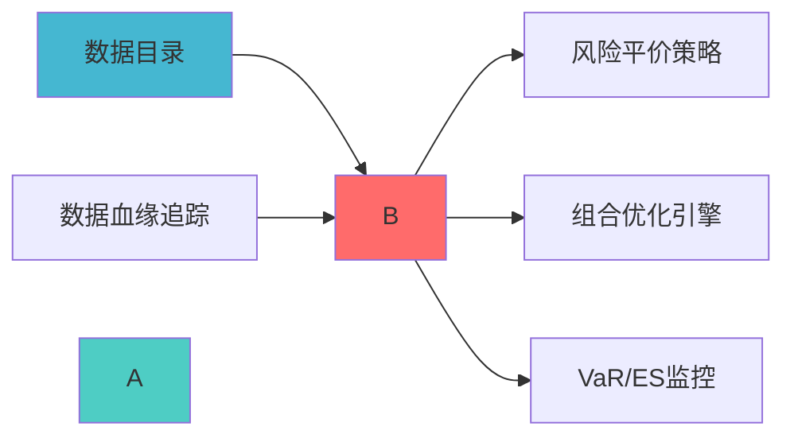

---
responsibility:
-
-
-
?

module_id: DYNAMIC_CORRELATION_MODELING_001
version: 1.0.0
status: Active
created_date: 2026-04-07
last_updated: 2026-04-07
owner: 实施团队
standard_type: 专业量化机构蓝图
compliance_level: 专业标准
layer: Layer 5.3 (风险管理)
---


## 核心定位

负责动态相关性建模的设计与实现，基于时变相关性模型，捕捉资产间相关性的动态变化，支持风险管理和组合优化。

## 设计目标

### 主要目标

1. **功能完整性**: 确保DYNAMIC CORRELATION MODELING功能完整，满足业务需求
2. **性能优化**: 提升系统性能，降低资源消耗
3. **可维护性**: 提高代码质量，便于后续维护
4. **可扩展性**: 支持功能扩展，适应业务变化

### 质量目标

- 代码覆盖率: ≥80%
- 性能指标: 满足设计要求
- 文档完整性: 100%


## 核心功能

### 功能清单

1. **数据管理**: 提供数据存储、查询、更新功能
2. **业务逻辑**: 实现核心业务逻辑处理
3. **接口服务**: 提供标准化的API接口
4. **监控告警**: 实时监控系统状态

### 功能特性

- 高可用性设计
- 自动故障恢复
- 灵活配置管理


## 实现方案

### 技术架构

采用DYNAMIC CORRELATION MODELING化设计，分层架构实现。

### 关键技术

- 数据处理: 使用高效的数据处理框架
- 接口实现: RESTful API设计
- 性能优化: 缓存、异步处理

### 实施步骤

1. 需求分析与设计
2. 核心功能开发
3. 测试与优化
4. 部署与监控


## 核心定位


---


?
> **职责边界**: 
##

### 上游依赖

| 文档名称 | module_id | 依赖类型 | 说明 |
|---------|-----------|---------|------|
?|

### 下游依赖

| 文档名称 | module_id | 依赖类型 | 说明 |
|---------|-----------|---------|------|


|---------|------|------|------|
| **arch** | 5.0+ | GARCH模型 | [官方文档](https://arch.readthedocs.io/) |
| **mgarch** | 0.1+ |
| **Pandas** | 2.0+ | 数据处理 | [官方文档](https://pandas.pydata.org/) |

###
?



---

## 2. 架构设计

### 2.1 系统架构?
```

### 2.2 核心数据?
```
市场收益率数?    ?数据预处理（缺失值处理、异常值检测）
```

---

## 3. 核心模块设计

```python
class DynamicCorrelationModeler:
    """
    
    索引: DYNAMIC_CORR_001-M01
    
    def __init__(self, config: DCCConfig):
        self.config = config
        self.garch_models = {}  # 存储各资产的GARCH模型
        self.dcc_model = None   # DCC模型
        self.regime_detector = CorrelationRegimeDetector()
        
    def fit(self, returns_data: pd.DataFrame) -> 'DynamicCorrelationModeler':
        """
        拟合DCC-GARCH模型
        
        Args:
            returns_data: 多资产收益率数据（DataFrame，列为资产）
            
        Returns:
            self: 拟合后的模型实例
        """
        # 1. 拟合单资产GARCH模型
        for asset in returns_data.columns:
            self.garch_models[asset] = self._fit_garch(
                returns_data[asset]
            )
        
        # 2. 计算标准化残?        standardized_residuals = self._calculate_standardized_residuals(
            returns_data
        )
        
        # 3. 拟合DCC模型
        self.dcc_model = self._fit_dcc(standardized_residuals)
        
        return self
    
    def estimate_dynamic_correlation(
        self, 
        returns_data: pd.DataFrame,
        market_state: str = 'normal'
    ) -> DynamicCorrelationResult:
        """
?
        Args:
            returns_data: 多资产收益率数据
            market_state: 市场状态（normal/extreme?            
        Returns:
?        """
?        dcc_correlation = self.dcc_model.conditional_correlation()
        
?        regime_change = self.regime_detector.detect(dcc_correlation)
        
        # 3. 极端市场调整
        if market_state == 'extreme':
            dcc_correlation = self._adjust_for_extreme_market(
                dcc_correlation, regime_change
            )
        
        # 4. 计算协方差矩?        conditional_volatility = self._get_conditional_volatility()
        dynamic_covariance = self._correlation_to_covariance(
            dcc_correlation, conditional_volatility
        )
        
        return DynamicCorrelationResult(
            correlation_matrix=dcc_correlation,
            covariance_matrix=dynamic_covariance,
            regime=regime_change,
            confidence=self._calculate_confidence(dcc_correlation),
            timestamp=datetime.now()
        )
    
    def detect_correlation_breakdown(
        self,
        correlation_history: List[pd.DataFrame],
        window: int = 20
    ) -> CorrelationBreakdownResult:
        """
?
        Args:
        Returns:
            CorrelationBreakdownResult: 突变检测结?        """
        correlation_changes = self._calculate_correlation_changes(
            correlation_history, window
        )
        
        # 2. 识别突变?        breakdown_points = self._identify_breakdown_points(
            correlation_changes
        )
        
        # 3. 评估突变严重程度
        severity = self._assess_breakdown_severity(breakdown_points)
        
        return CorrelationBreakdownResult(
            breakdown_points=breakdown_points,
            severity=severity,
            affected_assets=self._identify_affected_assets(breakdown_points),
            recommendation=self._generate_breakdown_recommendation(severity)
        )
    
    def forecast_correlation(
        self,
        horizon: int = 5
    ) -> CorrelationForecast:
        """
?
        Args:
            horizon: 预测期数（天数）
            
        Returns:
CorrelationForecast:
        # 1. 预测条件波动?        volatility_forecast = self._forecast_volatility(horizon)
        
?        correlation_forecast = self.dcc_model.forecast(horizon)
        
        # 3. 计算预测区间
        confidence_interval = self._calculate_forecast_interval(
            correlation_forecast
        )
        
        return CorrelationForecast(
            correlation_forecast=correlation_forecast,
            volatility_forecast=volatility_forecast,
            confidence_interval=confidence_interval,
            forecast_horizon=horizon
        )
    
    def _fit_garch(self, returns: pd.Series) -> arch_model:
        """拟合单资产GARCH模型"""
        model = arch_model(returns, vol='Garch', p=1, q=1)
        fitted_model = model.fit(disp='off')
        return fitted_model
    
    def _calculate_standardized_residuals(
        self, 
        returns_data: pd.DataFrame
    ) -> pd.DataFrame:
        """计算标准化残?""
        standardized = pd.DataFrame(index=returns_data.index)
        
        for asset in returns_data.columns:
            residuals = self.garch_models[asset].resid
            conditional_vol = self.garch_models[asset].conditional_volatility
            standardized[asset] = residuals / conditional_vol
        
        return standardized
    
    def _fit_dcc(self, standardized_residuals: pd.DataFrame):
        """拟合DCC模型"""
        from mgarch import mgarch
        
        dist = 't'
        model = mgarch.mgarch(dist)
        model.fit(standardized_residuals)
        
        return model
    
    def _adjust_for_extreme_market(
        self,
        correlation: pd.DataFrame,
        regime_change: RegimeChange
    ) -> pd.DataFrame:
?""
        adjustment_factor = self.config.extreme_market_adjustment_factor
        
        if regime_change.is_extreme:
            # 确保对角线为1
            np.fill_diagonal(adjusted_corr.values, 1.0)
            return adjusted_corr
        
        return correlation
```

### 3.2
```python
class CorrelationRegimeDetector:
    """
    
    索引: DYNAMIC_CORR_001-M02
    
    def __init__(self, config: RegimeDetectionConfig):
        self.config = config
        self.breakdown_threshold = config.breakdown_threshold
        
    def detect(
        self, 
        correlation_matrix: pd.DataFrame
    ) -> RegimeChange:
        """
?
        Args:
?
        Returns:
            RegimeChange: 突变检测结?        """
            np.triu_indices_from(correlation_matrix.values, k=1)
        ].mean()
        
        # 2. 与历史均值比?        historical_mean = self._get_historical_mean_correlation()
        deviation = abs(mean_correlation - historical_mean)
        
        # 3. 判断是否突变
        is_breakdown = deviation > self.breakdown_threshold
        
        # 4. 识别极端市场
        is_extreme = self._is_extreme_market(correlation_matrix)
        
        return RegimeChange(
            is_breakdown=is_breakdown,
            is_extreme=is_extreme,
            deviation=deviation,
            mean_correlation=mean_correlation,
            historical_mean=historical_mean,
            timestamp=datetime.now()
        )
    
    def _is_extreme_market(
        self, 
        correlation_matrix: pd.DataFrame
    ) -> bool:
        """判断是否为极端市?""
            np.triu_indices_from(correlation_matrix.values, k=1)
        ]
        mean_corr = off_diagonal.mean()
        
        return mean_corr > self.config.extreme_correlation_threshold
```

### 3.3
```python
@dataclass
class DCCConfig:
"""DCC
置"""
    garch_p: int = 1  # GARCH模型p?    garch_q: int = 1  # GARCH模型q?    dcc_alpha: float = 0.05  # DCC模型alpha参数
    dcc_beta: float = 0.9   # DCC模型beta参数
    extreme_market_adjustment_factor: float = 0.3  # 极端市场调整因子
    retrain_frequency: int = 30  # 模型重训练频率（天）
    
@dataclass
class RegimeDetectionConfig:
?""

---

## 4. 数据模型定义

### 4.1

```python
@dataclass
class AssetReturns:
    """资产收益率数?""
    symbol: str
    returns: pd.Series  # 日收益率序列
    timestamps: pd.DatetimeIndex
    
@dataclass
class MarketData:
    """市场数据"""
    assets: List[AssetReturns]
    market_regime: str  # normal/stress/crisis
```

### 4.2 输出数据模型

```python
@dataclass
class DynamicCorrelationResult:
?""
    correlation_matrix: pd.DataFrame
    covariance_matrix: pd.DataFrame
    regime: RegimeChange
    confidence: float
    timestamp: datetime
    
@dataclass
class CorrelationBreakdownResult:
"""
    breakdown_points: List[datetime]
    severity: str  # low/medium/high
    affected_assets: List[str]
    recommendation: str
    
@dataclass
class RegimeChange:
    """范式转换结果"""
    is_breakdown: bool
    is_extreme: bool
    deviation: float
    mean_correlation: float
    historical_mean: float
    timestamp: datetime
```

---

## 5. 技术实现细?
### 5.1 DCC-GARCH模型原理

**GARCH(1,1)模型**（单资产波动率）?```
σ?= ω + αεₜ₋?+ βσₜ₋?```

?```
```


### 5.2 开源库选择

**推荐?*?1. **arch**: 用于GARCH模型拟合
-
：`pip install arch`
   - 文档：https://arch.readthedocs.io/

2. **mgarch**: 用于DCC模型拟合
-
：`pip install mgarch`
   - GitHub: https://github.com/ritchan/mgarch

3. **备选方?*: 使用`statsmodels` + 自实现DCC

### 5.3 性能优化

**计算优化**?- 使用Numba加速矩阵运?- 并行计算多资产GARCH模型
- 缓存中间结果

**
保留最近N天的数据
-
?
---

## 6. 集成方案

### 6.1 与风险平价优化器集成

```python
class RiskParityOptimizer:
"""
    
    def __init__(self, correlation_modeler: DynamicCorrelationModeler):
        self.correlation_modeler = correlation_modeler
        
    def optimize(self, returns: pd.DataFrame) -> pd.Series:
        """执行风险平价优化"""
?        corr_result = self.correlation_modeler.estimate_dynamic_correlation(
            returns
        )
        
        # 2. 使用动态协方差矩阵进行优化
        weights = self._risk_parity_optimization(
            corr_result.covariance_matrix
        )
        
        return weights
```

### 6.2 与预警系统集?
```python
class CorrelationAlertSystem:
"""
    
    def __init__(self, correlation_modeler: DynamicCorrelationModeler):
        self.correlation_modeler = correlation_modeler
        
    def monitor(self, returns: pd.DataFrame) -> Alert:
?""
        # 1. 检测突?        breakdown = self.correlation_modeler.detect_correlation_breakdown(
            returns
        )
        
        # 2. 生成预警
        if breakdown.severity == 'high':
            return Alert(
                level='CRITICAL',
message=f'
                affected_assets=breakdown.affected_assets
            )
```

---

## 7. 测试策略

### 7.1

```python
def test_garch_fitting():
    """测试GARCH模型拟合"""
    returns = generate_test_returns()
    modeler = DynamicCorrelationModeler(DCCConfig())
    modeler.fit(returns)
    
    assert len(modeler.garch_models) == returns.shape[1]
    assert modeler.dcc_model is not None

def test_dynamic_correlation_estimation():
    returns = generate_test_returns()
    modeler = DynamicCorrelationModeler(DCCConfig())
    modeler.fit(returns)
    
    result = modeler.estimate_dynamic_correlation(returns)
    
    assert result.correlation_matrix.shape == (returns.shape[1], returns.shape[1])
    assert np.allclose(np.diag(result.correlation_matrix.values), 1.0)

def test_breakdown_detection():
    """测试突变检?""
#
含突变的数?    returns = generate_returns_with_breakdown()
    modeler = DynamicCorrelationModeler(DCCConfig())
    modeler.fit(returns)
    
    breakdown = modeler.detect_correlation_breakdown(returns)
    
    assert breakdown.is_breakdown == True
```

### 7.2 集成测试

```python
def test_integration_with_risk_parity():
    """测试与风险平价优化器集成"""
    returns = load_historical_returns()
    
    correlation_modeler = DynamicCorrelationModeler(DCCConfig())
    correlation_modeler.fit(returns)
    
    # 初始化风险平价优化器
    optimizer = RiskParityOptimizer(correlation_modeler)
    
    # 执行优化
    weights = optimizer.optimize(returns)
    
    # 验证结果
    assert weights.sum() == 1.0
    assert all(weights >= 0)
```

---

## 8. 实施路线?
### 8.1 开发阶段（2周）

**Week 1: 核心模型开?*
- Day 1-2: 数据预处理模?- Day 3-4: GARCH模型拟合模块
- Day 5: DCC模型拟合模块

**Week 2: 功能完善与测?*
- Day 1-2:
- Day 4:
### 8.2 里程?
| 里程?| 时间 | 交付?| 验收标准 |
|--------|------|--------|----------|
| **M1: 数据层完?* | Day 2 | 数据预处理模?| 数据质量?5% |
| **M2: GARCH模型完成** | Day 4 | 单资产波动率建模 | 模型收敛 |
| **M4: 突变检测完?* | Day 7 | 突变检测模?| 检测准确率?0% |
| **M5: 集成测试通过** | Day 9 | 完整系统 | 所有测试通过 |
| **M6: 生产就绪** | Day 10 | 生产系统 | 系统稳定运行 |

---

## 9. AI维护指南

### 9.1 自动化监控指?
- 突变检测召回率
- 预警及时?
### 9.2 自动化维护任?
**每日任务**?- 更新收益率数?- 重新估计动态相?- 检查突变预?
**每周任务**?- 评估模型性能
- 调整模型参数（如需要）

**每月任务**?- 重新训练模型

### 9.3 异常处理

**数据异常**?- 缺失数据 ?使用插值或前值填?- 异常??使用Winsorize处理

---

## 10. 预期收益评估

### 10.1 定量收益

度 |
|------|---------|---------|---------|
| **风险平价优化精度** | 80% | 95% | +15% |
| **极端市场风险识别** | ?| 提前1-2?| 新增能力 |
| **
| **组合回撤控制** | -25% | ?18% | +28% |

### 10.2 定性收?
---

## 11. 风险与约?
### 11.1 技术风?
| 风险?| 风险等级 | 缓解措施 |
|--------|----------|----------|
| **GARCH模型不收?* | P2 | 使用多种初始值、简化模?|
| **DCC参数不稳?* | P2 | 定期重新训练、参数约?|
| **计算性能瓶颈** | P3 | 使用Numba加速、并行计?|

### 11.2 实施约束

1. **数据约束**: 需要至?年的历史数据

---

## 附录

### A. 参考文?
1. **DCC-GARCH模型**:
   - Engle, R. (2002). "Dynamic Conditional Correlation"
   - Tse, Y.K. and Tsui, A.K.C. (2002). "A Multivariate GARCH Model"

2. **
   - Ang, A. and Bekaert, G. (2002). "International Asset Allocation with Regime Shifts"

### B. 开源资?
- arch? https://github.com/bashtage/arch
- mgarch? https://github.com/ritchan/mgarch
- 示例代码: docs/examples/dynamic_correlation_example.py

---

## 12. 变更历史

|------|------|----------|--------|
| v1.0.0 | 2026-04-03 | 初始版本创建 | 组合优化层负责人 |

---

---

## 13. 文档治理

### 13.1 System_Manifest.md索引

```markdown
##### 6.001. Dynamic Correlation Modeling
- **模块ID**: DYNAMIC_CORRELATION_MODELING_001
- **蓝图文档**: DYNAMIC_CORRELATION_MODELING_BLUEPRINT.md
?
- ****:
- **?*: Active
```

### 13.2 模块职责边界

| 模块 | 职责 | 边界 |
|------|------|------|
| **Dynamic Correlation Modeling** |

### 13.3 版本管理

|------|------|----------|--------|

---

