---
responsibility:
  - 动态相å
³æ€§å»ºæ¨?
  - 相å
³æ€§é¢„æµ?
  - 相å
³æ€§çŸ©é˜?
  - 相å
³æ€§åˆ†æž?

module_id: DYNAMIC_CORRELATION_MODELING_001
version: 1.0.0
status: Active
created_date: 2026-04-07
last_updated: 2026-04-07
owner: 实施团队
standard_type: 专业量化机构蓝图
applicable_scope: Layer 6 组合优化å±?
compliance_level: 专业标准
layer: Layer 5.3 (风险管理)
---


## 核心定位

负责动态相关性建模的设计与实现，基于时变相关性模型，捕捉资产间相关性的动态变化，支持风险管理和组合优化。

# 动态相å
³æ€§å»ºæ¨¡è“å›?
## 设计目标

### 主要目标

1. **功能完整性**: 确保DYNAMIC CORRELATION MODELING功能完整，满足业务需求
2. **性能优化**: 提升系统性能，降低资源消耗
3. **可维护性**: 提高代码质量，便于后续维护
4. **可扩展性**: 支持功能扩展，适应业务变化

### 质量目标

- 代码覆盖率: ≥80%
- 性能指标: 满足设计要求
- 文档完整性: 100%


## 核心功能

### 功能清单

1. **数据管理**: 提供数据存储、查询、更新功能
2. **业务逻辑**: 实现核心业务逻辑处理
3. **接口服务**: 提供标准化的API接口
4. **监控告警**: 实时监控系统状态

### 功能特性

- 高可用性设计
- 自动故障恢复
- 灵活配置管理


## 实现方案

### 技术架构

采用DYNAMIC CORRELATION MODELING化设计，分层架构实现。

### 关键技术

- 数据处理: 使用高效的数据处理框架
- 接口实现: RESTful API设计
- 性能优化: 缓存、异步处理

### 实施步骤

1. 需求分析与设计
2. 核心功能开发
3. 测试与优化
4. 部署与监控


## 核心定位

构建动态相å
³æ€§å»ºæ¨¡çš„设计与实现，基于时变相å
³ç³»æ•°æ¨¡åž‹æŠ€æœ¯ï¼Œæ•æ‰èµ„产间相å
³æ€§çš„动态变化，支持风险管理和资产é
ç½®å†³ç­–ã€?

---


> **核心职责**: 使用DCC-GARCH模型实时更新资产间相å
³æ€?
> **职责边界**: 
> - âœ?本文档负责：动态相å
³æ€§ã€ç›¸å
³æ€§çªå˜è¯†åˆ?
> - â?本文档不负责：因子计算（由因子模块负责）
## 📚 相å
³æ–‡æ¡£

### 上游依赖

| 文档名称 | module_id | 依赖类型 | 说明 |
|---------|-----------|---------|------|
| [数据质量监控蓝图](./DATA_QUALITY_MONITORING_BLUEPRINT.md) | DATA_QUALITY_MONITORING_001 | 强依èµ?| 提供数据质量指标 |
| [数据目录蓝图](./DATA_CATALOG_BLUEPRINT.md) | DATA_CATALOG_001 | 强依èµ?| 提供资产å
ƒæ•°æ?|
| 数据血缘追踪蓝å›?| DATA_LINEAGE_TRACKING_001 | 中依èµ?| 提供数据血ç¼?|

### 下游依赖

| 文档名称 | module_id | 依赖类型 | 说明 |
|---------|-----------|---------|------|
| [风险平价策略蓝图](./RISK_PARITY_STRATEGY_BLUEPRINT.md) | RISK_PARITY_STRATEGY_001 | 强依èµ?| 风险平价策略 |
| [组合优化引擎集成蓝图](./PORTFOLIO_OPTIMIZER_INTEGRATION_BLUEPRINT.md) | PORTFOLIO_OPTIMIZER_INTEGRATION_001 | 强依èµ?| 组合优化 |
| [VaR/ES监控蓝图](./VAR_ES_MONITORING_BLUEPRINT.md) | VAR_ES_MONITORING_001 | 中依èµ?| VaR/ES监控 |

### 技术依èµ?

| 技术组ä»?| 版本 | 用é€?| 文档 |
|---------|------|------|------|
| **arch** | 5.0+ | GARCH模型 | [官方文档](https://arch.readthedocs.io/) |
| **mgarch** | 0.1+ | 多å
ƒGARCH | [官方文档](https://github.com/abbass2/mgarch) |
| **NumPy** | 1.24+ | 数值计ç®?| [官方文档](https://numpy.org/) |
| **Pandas** | 2.0+ | 数据处理 | [官方文档](https://pandas.pydata.org/) |

### 引用å
³ç³»å›?



---

## 2. 架构设计

### 2.1 系统架构?
```
┌─────────────────────────────────────────────────────────────────??                 跨资产相å
³æ€§åŠ¨æ€å»ºæ¨¡ç³»ç»Ÿæž¶?                     ?├─────────────────────────────────────────────────────────────────??                                                                ?? ┌──────────────────────────────────────────────────────────? ?? ?             数据输å
¥?                                   ? ?? ? ┌──────────? ┌──────────? ┌──────────? ┌──────────?? ?? ? ?股票收益 ? ?债券收益 ? ?商品收益 ? ?汇率收益 ?? ?? ? ?数据     ? ?数据     ? ?数据     ? ?数据     ?? ?? ? └──────────? └──────────? └──────────? └──────────?? ?? └──────────────────────────────────────────────────────────? ??                         ?                                     ?? ┌──────────────────────────────────────────────────────────? ?? ?             GARCH模型层（单资产波动率建模?               ? ?? ? ┌────────────────────────────────────────────────────? ? ?? ? ? GARCH(1,1) Model for Each Asset                   ? ? ?? ? ? σ²?= ω + α·ε²ₜ₋?+ β·σ²ₜ₋?                     ? ? ?? ? └────────────────────────────────────────────────────? ? ?? └──────────────────────────────────────────────────────────? ??                         ?                                     ?? ┌──────────────────────────────────────────────────────────? ?? ?             DCC模型层（动态相å
³æ€§å»ºæ¨¡ï¼‰                    ? ?? ? ┌────────────────────────────────────────────────────? ? ?? ? ? Dynamic Conditional Correlation (DCC)             ? ? ?? ? ? Q?= (1-α-β)·Q̄ + α·uₜ₋₁·u'ₜ₋?+ β·Qₜ₋?        ? ? ?? ? ? R?= diag(Q??² · Q?· diag(Q??²           ? ? ?? ? └────────────────────────────────────────────────────? ? ?? └──────────────────────────────────────────────────────────? ??                         ?                                     ?? ┌──────────────────────────────────────────────────────────? ?? ?             相å
³æ€§çªå˜æ£€æµ‹å±‚                              ? ?? ? ┌──────────? ┌──────────? ┌──────────?              ? ?? ? ?结构突变 ? ?极端市场 ? ?相å
³?  ?              ? ?? ? ?检?    ? ?识别     ? ?预警     ?              ? ?? ? └──────────? └──────────? └──────────?              ? ?? └──────────────────────────────────────────────────────────? ??                         ?                                     ?? ┌──────────────────────────────────────────────────────────? ?? ?             输出?                                       ? ?? ? ┌──────────? ┌──────────? ┌──────────?              ? ?? ? ?动态相?? ?突变预警 ? ?风险调整 ?              ? ?? ? ?性矩?  ? ?信号     ? ?建议     ?              ? ?? ? └──────────? └──────────? └──────────?              ? ?? └──────────────────────────────────────────────────────────? ?└─────────────────────────────────────────────────────────────────?```

### 2.2 核心数据?
```
市场收益率数?    ?数据预处理（缺失值处理、异常值检测）
    ?单资产GARCH模型拟合（估计条件波动率?    ?标准化残差计?    ?DCC模型拟合（估计动态相å
³æ€§ï¼‰
    ?动态相å
³æ€§çŸ©é˜µè¾“?    ?相å
³æ€§çªå˜æ£€?    ?预警信号生成
```

---

## 3. 核心模块设计

### 3.1 动态相å
³æ€§å»ºæ¨¡å™¨ï¼ˆDynamicCorrelationModeler?
```python
class DynamicCorrelationModeler:
    """
    动态相å
³æ€§å»ºæ¨¡å™¨
    
    索引: DYNAMIC_CORR_001-M01
    职责: 使用DCC-GARCH模型估计动态相å
³æ€§çŸ©?    输å
¥: 多资产收益率数据
    输出: 动态相å
³æ€§çŸ©é˜µã€çªå˜æ£€æµ‹ç»“果、预警信?    """
    
    def __init__(self, config: DCCConfig):
        self.config = config
        self.garch_models = {}  # 存储各资产的GARCH模型
        self.dcc_model = None   # DCC模型
        self.regime_detector = CorrelationRegimeDetector()
        
    def fit(self, returns_data: pd.DataFrame) -> 'DynamicCorrelationModeler':
        """
        拟合DCC-GARCH模型
        
        Args:
            returns_data: 多资产收益率数据（DataFrame，列为资产）
            
        Returns:
            self: 拟合后的模型实例
        """
        # 1. 拟合单资产GARCH模型
        for asset in returns_data.columns:
            self.garch_models[asset] = self._fit_garch(
                returns_data[asset]
            )
        
        # 2. 计算标准化残?        standardized_residuals = self._calculate_standardized_residuals(
            returns_data
        )
        
        # 3. 拟合DCC模型
        self.dcc_model = self._fit_dcc(standardized_residuals)
        
        return self
    
    def estimate_dynamic_correlation(
        self, 
        returns_data: pd.DataFrame,
        market_state: str = 'normal'
    ) -> DynamicCorrelationResult:
        """
        估计动态相å
³æ€§çŸ©?        
        Args:
            returns_data: 多资产收益率数据
            market_state: 市场状态（normal/extreme?            
        Returns:
            DynamicCorrelationResult: 动态相å
³æ€§ç»“?        """
        # 1. 获取动态相å
³æ€§çŸ©?        dcc_correlation = self.dcc_model.conditional_correlation()
        
        # 2. 检测相å
³æ€§çª?        regime_change = self.regime_detector.detect(dcc_correlation)
        
        # 3. 极端市场调整
        if market_state == 'extreme':
            dcc_correlation = self._adjust_for_extreme_market(
                dcc_correlation, regime_change
            )
        
        # 4. 计算协方差矩?        conditional_volatility = self._get_conditional_volatility()
        dynamic_covariance = self._correlation_to_covariance(
            dcc_correlation, conditional_volatility
        )
        
        return DynamicCorrelationResult(
            correlation_matrix=dcc_correlation,
            covariance_matrix=dynamic_covariance,
            regime=regime_change,
            confidence=self._calculate_confidence(dcc_correlation),
            timestamp=datetime.now()
        )
    
    def detect_correlation_breakdown(
        self,
        correlation_history: List[pd.DataFrame],
        window: int = 20
    ) -> CorrelationBreakdownResult:
        """
        检测相å
³æ€§çª?        
        Args:
            correlation_history: 历史相å
³æ€§çŸ©é˜µåˆ—?            window: 检测窗口大?            
        Returns:
            CorrelationBreakdownResult: 突变检测结?        """
        # 1. 计算相å
³æ€§å˜åŒ–率
        correlation_changes = self._calculate_correlation_changes(
            correlation_history, window
        )
        
        # 2. 识别突变?        breakdown_points = self._identify_breakdown_points(
            correlation_changes
        )
        
        # 3. 评估突变严重程度
        severity = self._assess_breakdown_severity(breakdown_points)
        
        return CorrelationBreakdownResult(
            breakdown_points=breakdown_points,
            severity=severity,
            affected_assets=self._identify_affected_assets(breakdown_points),
            recommendation=self._generate_breakdown_recommendation(severity)
        )
    
    def forecast_correlation(
        self,
        horizon: int = 5
    ) -> CorrelationForecast:
        """
        预测未来相å
³?        
        Args:
            horizon: 预测期数（天数）
            
        Returns:
            CorrelationForecast: 相å
³æ€§é¢„测结?        """
        # 1. 预测条件波动?        volatility_forecast = self._forecast_volatility(horizon)
        
        # 2. 预测相å
³?        correlation_forecast = self.dcc_model.forecast(horizon)
        
        # 3. 计算预测区间
        confidence_interval = self._calculate_forecast_interval(
            correlation_forecast
        )
        
        return CorrelationForecast(
            correlation_forecast=correlation_forecast,
            volatility_forecast=volatility_forecast,
            confidence_interval=confidence_interval,
            forecast_horizon=horizon
        )
    
    def _fit_garch(self, returns: pd.Series) -> arch_model:
        """拟合单资产GARCH模型"""
        model = arch_model(returns, vol='Garch', p=1, q=1)
        fitted_model = model.fit(disp='off')
        return fitted_model
    
    def _calculate_standardized_residuals(
        self, 
        returns_data: pd.DataFrame
    ) -> pd.DataFrame:
        """计算标准化残?""
        standardized = pd.DataFrame(index=returns_data.index)
        
        for asset in returns_data.columns:
            residuals = self.garch_models[asset].resid
            conditional_vol = self.garch_models[asset].conditional_volatility
            standardized[asset] = residuals / conditional_vol
        
        return standardized
    
    def _fit_dcc(self, standardized_residuals: pd.DataFrame):
        """拟合DCC模型"""
        from mgarch import mgarch
        
        dist = 't'
        model = mgarch.mgarch(dist)
        model.fit(standardized_residuals)
        
        return model
    
    def _adjust_for_extreme_market(
        self,
        correlation: pd.DataFrame,
        regime_change: RegimeChange
    ) -> pd.DataFrame:
        """极端市场相å
³æ€§è°ƒ?""
        # 在极端市场下，相å
³æ€§è¶‹å‘于1
        adjustment_factor = self.config.extreme_market_adjustment_factor
        
        if regime_change.is_extreme:
            # 增加相å
³æ€§ï¼ˆè¶‹å‘??            adjusted_corr = correlation + adjustment_factor * (1 - correlation)
            # 确保对角线为1
            np.fill_diagonal(adjusted_corr.values, 1.0)
            return adjusted_corr
        
        return correlation
```

### 3.2 相å
³æ€§çªå˜æ£€æµ‹å™¨ï¼ˆCorrelationRegimeDetector?
```python
class CorrelationRegimeDetector:
    """
    相å
³æ€§çªå˜æ£€æµ‹å™¨
    
    索引: DYNAMIC_CORR_001-M02
    职责: 检测相å
³æ€§ç»“构性突?    """
    
    def __init__(self, config: RegimeDetectionConfig):
        self.config = config
        self.breakdown_threshold = config.breakdown_threshold
        
    def detect(
        self, 
        correlation_matrix: pd.DataFrame
    ) -> RegimeChange:
        """
        检测相å
³æ€§çª?        
        Args:
            correlation_matrix: 当前相å
³æ€§çŸ©?            
        Returns:
            RegimeChange: 突变检测结?        """
        # 1. 计算相å
³æ€§å‡å€¼å˜?        mean_correlation = correlation_matrix.values[
            np.triu_indices_from(correlation_matrix.values, k=1)
        ].mean()
        
        # 2. 与历史均值比?        historical_mean = self._get_historical_mean_correlation()
        deviation = abs(mean_correlation - historical_mean)
        
        # 3. 判断是否突变
        is_breakdown = deviation > self.breakdown_threshold
        
        # 4. 识别极端市场
        is_extreme = self._is_extreme_market(correlation_matrix)
        
        return RegimeChange(
            is_breakdown=is_breakdown,
            is_extreme=is_extreme,
            deviation=deviation,
            mean_correlation=mean_correlation,
            historical_mean=historical_mean,
            timestamp=datetime.now()
        )
    
    def _is_extreme_market(
        self, 
        correlation_matrix: pd.DataFrame
    ) -> bool:
        """判断是否为极端市?""
        # 极端市场特征：相å
³æ€§æ™®éå‡é«˜ï¼ˆè¶‹å‘??        off_diagonal = correlation_matrix.values[
            np.triu_indices_from(correlation_matrix.values, k=1)
        ]
        mean_corr = off_diagonal.mean()
        
        return mean_corr > self.config.extreme_correlation_threshold
```

### 3.3 é
ç½®ç±»å®š?
```python
@dataclass
class DCCConfig:
    """DCC模型é
ç½®"""
    garch_p: int = 1  # GARCH模型p?    garch_q: int = 1  # GARCH模型q?    dcc_alpha: float = 0.05  # DCC模型alpha参数
    dcc_beta: float = 0.9   # DCC模型beta参数
    extreme_market_adjustment_factor: float = 0.3  # 极端市场调整因子
    retrain_frequency: int = 30  # 模型重训练频率（天）
    
@dataclass
class RegimeDetectionConfig:
    """突变检测é
?""
    breakdown_threshold: float = 0.15  # 突变?    extreme_correlation_threshold: float = 0.7  # 极端市场相å
³æ€§é˜ˆ?    lookback_window: int = 252  # 回看窗口（交易日?```

---

## 4. 数据模型定义

### 4.1 输å
¥æ•°æ®æ¨¡åž‹

```python
@dataclass
class AssetReturns:
    """资产收益率数?""
    symbol: str
    returns: pd.Series  # 日收益率序列
    timestamps: pd.DatetimeIndex
    
@dataclass
class MarketData:
    """市场数据"""
    assets: List[AssetReturns]
    market_regime: str  # normal/stress/crisis
```

### 4.2 输出数据模型

```python
@dataclass
class DynamicCorrelationResult:
    """动态相å
³æ€§ç»“?""
    correlation_matrix: pd.DataFrame
    covariance_matrix: pd.DataFrame
    regime: RegimeChange
    confidence: float
    timestamp: datetime
    
@dataclass
class CorrelationBreakdownResult:
    """相å
³æ€§çªå˜ç»“?""
    breakdown_points: List[datetime]
    severity: str  # low/medium/high
    affected_assets: List[str]
    recommendation: str
    
@dataclass
class RegimeChange:
    """范式转换结果"""
    is_breakdown: bool
    is_extreme: bool
    deviation: float
    mean_correlation: float
    historical_mean: float
    timestamp: datetime
```

---

## 5. 技术实现细?
### 5.1 DCC-GARCH模型原理

**GARCH(1,1)模型**（单资产波动率）?```
σ²?= ω + α·ε²ₜ₋?+ β·σ²ₜ₋?```

**DCC模型**（动态相å
³æ€§ï¼‰?```
Q?= (1-α-β)·Q̄ + α·uₜ₋₁·u'ₜ₋?+ β·Qₜ₋?R?= diag(Q??² · Q?· diag(Q??²
```

å
¶ä¸­?- Q? 拟相å
³æ€§çŸ©?- R? 动态相å
³æ€§çŸ©?- u? 标准化残?- α, β: DCC参数

### 5.2 开源库选择

**推荐?*?1. **arch**: 用于GARCH模型拟合
   - 安è£
：`pip install arch`
   - 文档：https://arch.readthedocs.io/

2. **mgarch**: 用于DCC模型拟合
   - 安è£
：`pip install mgarch`
   - GitHub: https://github.com/ritchan/mgarch

3. **备选方?*: 使用`statsmodels` + 自实现DCC

### 5.3 性能优化

**计算优化**?- 使用Numba加速矩阵运?- 并行计算多资产GARCH模型
- 缓存中间结果

**å†
存优化**?- ä»
保留最近N天的数据
- 定期æ¸
理历史相å
³æ€§çŸ©?
---

## 6. 集成方案

### 6.1 与风险平价优化器集成

```python
class RiskParityOptimizer:
    """风险平价优化器（集成动态相å
³æ€§ï¼‰"""
    
    def __init__(self, correlation_modeler: DynamicCorrelationModeler):
        self.correlation_modeler = correlation_modeler
        
    def optimize(self, returns: pd.DataFrame) -> pd.Series:
        """执行风险平价优化"""
        # 1. 获取动态相å
³æ€§çŸ©?        corr_result = self.correlation_modeler.estimate_dynamic_correlation(
            returns
        )
        
        # 2. 使用动态协方差矩阵进行优化
        weights = self._risk_parity_optimization(
            corr_result.covariance_matrix
        )
        
        return weights
```

### 6.2 与预警系统集?
```python
class CorrelationAlertSystem:
    """相å
³æ€§é¢„警系?""
    
    def __init__(self, correlation_modeler: DynamicCorrelationModeler):
        self.correlation_modeler = correlation_modeler
        
    def monitor(self, returns: pd.DataFrame) -> Alert:
        """监控相å
³æ€§å˜?""
        # 1. 检测突?        breakdown = self.correlation_modeler.detect_correlation_breakdown(
            returns
        )
        
        # 2. 生成预警
        if breakdown.severity == 'high':
            return Alert(
                level='CRITICAL',
                message=f'相å
³æ€§çªå˜æ£€æµ‹ï¼š{breakdown.recommendation}',
                affected_assets=breakdown.affected_assets
            )
```

---

## 7. 测试策略

### 7.1 单å
ƒæµ‹è¯•

```python
def test_garch_fitting():
    """测试GARCH模型拟合"""
    returns = generate_test_returns()
    modeler = DynamicCorrelationModeler(DCCConfig())
    modeler.fit(returns)
    
    assert len(modeler.garch_models) == returns.shape[1]
    assert modeler.dcc_model is not None

def test_dynamic_correlation_estimation():
    """测试动态相å
³æ€§ä¼°?""
    returns = generate_test_returns()
    modeler = DynamicCorrelationModeler(DCCConfig())
    modeler.fit(returns)
    
    result = modeler.estimate_dynamic_correlation(returns)
    
    assert result.correlation_matrix.shape == (returns.shape[1], returns.shape[1])
    assert np.allclose(np.diag(result.correlation_matrix.values), 1.0)

def test_breakdown_detection():
    """测试突变检?""
    # 生成åŒ
含突变的数?    returns = generate_returns_with_breakdown()
    modeler = DynamicCorrelationModeler(DCCConfig())
    modeler.fit(returns)
    
    breakdown = modeler.detect_correlation_breakdown(returns)
    
    assert breakdown.is_breakdown == True
```

### 7.2 集成测试

```python
def test_integration_with_risk_parity():
    """测试与风险平价优化器集成"""
    returns = load_historical_returns()
    
    # 初始化动态相å
³æ€§å»ºæ¨¡å™¨
    correlation_modeler = DynamicCorrelationModeler(DCCConfig())
    correlation_modeler.fit(returns)
    
    # 初始化风险平价优化器
    optimizer = RiskParityOptimizer(correlation_modeler)
    
    # 执行优化
    weights = optimizer.optimize(returns)
    
    # 验证结果
    assert weights.sum() == 1.0
    assert all(weights >= 0)
```

---

## 8. 实施路线?
### 8.1 开发阶段（2周）

**Week 1: 核心模型开?*
- Day 1-2: 数据预处理模?- Day 3-4: GARCH模型拟合模块
- Day 5: DCC模型拟合模块

**Week 2: 功能完善与测?*
- Day 1-2: 相å
³æ€§çªå˜æ£€æµ‹æ¨¡?- Day 3: 预警系统集成
- Day 4: 单å
ƒæµ‹è¯•ä¸Žé›†æˆæµ‹?- Day 5: 文档编写与代码审?
### 8.2 里程?
| 里程?| 时间 | 交付?| 验收标准 |
|--------|------|--------|----------|
| **M1: 数据层完?* | Day 2 | 数据预处理模?| 数据质量?5% |
| **M2: GARCH模型完成** | Day 4 | 单资产波动率建模 | 模型收敛 |
| **M3: DCC模型完成** | Day 5 | 动态相å
³æ€§å»º?| 相å
³æ€§çŸ©é˜µæœ‰?|
| **M4: 突变检测完?* | Day 7 | 突变检测模?| 检测准确率?0% |
| **M5: 集成测试通过** | Day 9 | 完整系统 | 所有测试通过 |
| **M6: 生产就绪** | Day 10 | 生产系统 | 系统稳定运行 |

---

## 9. AI维护指南

### 9.1 自动化监控指?
**模型健康度指?*?- GARCH模型收敛?- DCC参数稳定?- 相å
³æ€§çŸ©é˜µæ­£?
**业务指标**?- 相å
³æ€§é¢„测准确率
- 突变检测召回率
- 预警及时?
### 9.2 自动化维护任?
**每日任务**?- 更新收益率数?- 重新估计动态相?- 检查突变预?
**每周任务**?- 评估模型性能
- 调整模型参数（如需要）

**每月任务**?- 重新训练模型
- 更新历史相å
³æ€§åŸº?- 生成月度报告

### 9.3 异常处理

**模型异常**?- GARCH模型不收??调整初始值或使用备选模?- DCC参数越界 ?重新训练或使用历史参?- 相å
³æ€§çŸ©é˜µéžæ­£å®š ?应用正则?
**数据异常**?- 缺失数据 ?使用插值或前值填?- 异常??使用Winsorize处理

---

## 10. 预期收益评估

### 10.1 定量收益

| 指标 | 当前水平 | 目标水平 | 提升å¹
度 |
|------|---------|---------|---------|
| **风险平价优化精度** | 80% | 95% | +15% |
| **极端市场风险识别** | ?| 提前1-2?| 新增能力 |
| **相å
³æ€§é¢„测准确率** | N/A | ?5% | 新增能力 |
| **组合回撤控制** | -25% | ?18% | +28% |

### 10.2 定性收?
- ?实现桥水核心能力：动态相å
³æ€§å»º?- ?提升极端市场风险控制能力
- ?为风险平价优化提供精确输?- ?建立相å
³æ€§çªå˜é¢„警机?
---

## 11. 风险与约?
### 11.1 技术风?
| 风险?| 风险等级 | 缓解措施 |
|--------|----------|----------|
| **GARCH模型不收?* | P2 | 使用多种初始值、简化模?|
| **DCC参数不稳?* | P2 | 定期重新训练、参数约?|
| **计算性能瓶颈** | P3 | 使用Numba加速、并行计?|

### 11.2 实施约束

1. **数据约束**: 需要至?年的历史数据
2. **计算约束**: DCC模型计算较æ
¢ï¼Œéœ€è¦ä¼˜?3. **时间约束**: 开发周?周，需合理安排

---

## 附录

### A. 参考文?
1. **DCC-GARCH模型**:
   - Engle, R. (2002). "Dynamic Conditional Correlation"
   - Tse, Y.K. and Tsui, A.K.C. (2002). "A Multivariate GARCH Model"

2. **相å
³æ€§çªå˜æ£€?*:
   - Ang, A. and Bekaert, G. (2002). "International Asset Allocation with Regime Shifts"

### B. 开源资?
- arch? https://github.com/bashtage/arch
- mgarch? https://github.com/ritchan/mgarch
- 示例代码: docs/examples/dynamic_correlation_example.py

---

## 12. 变更历史

| 版本 | 日期 | 变更å†
容 | 变更äº?|
|------|------|----------|--------|
| v1.0.0 | 2026-04-03 | 初始版本创建 | 组合优化层负责人 |

---

**蓝图版本**: v1.0.1 | **创建日期**: 2026-04-03 | **状æ€?*: Final | **下一æ­?*: 技术规格书编写
---

## 13. 文档治理

### 13.1 System_Manifest.md索引

```markdown
#### Layer 6: 组合优化å±?
##### 6.001. Dynamic Correlation Modeling
- **模块ID**: DYNAMIC_CORRELATION_MODELING_001
- **蓝图文档**: DYNAMIC_CORRELATION_MODELING_BLUEPRINT.md
- **技术规格书**: å¾
创å»?
- **职责**: å
¨ç³»ç»?
- **状æ€?*: Active
```

### 13.2 模块职责边界

| 模块 | 职责 | 边界 |
|------|------|------|
| **Dynamic Correlation Modeling** | å
¨ç³»ç»?| **核心模块** |

### 13.3 版本管理

| 版本 | 日期 | 变更å†
容 | 变更äº?|
|------|------|----------|--------|
| v1.0.0 | 2026-04-03 | 初始版本创建 | 首席蓝图架构å¸?|

---

**蓝图版本**: v1.0.0 | **创建日期**: 2026-04-03 | **状æ€?*: Active
