# DYNAMIC LEVERAGE MANAGEMENT BLUEPRINT

## 核心定位

负责动态杠杆管理。基于风险平价和杠杆优化技术，动态调整杠杆水平，优化风险收益特征。


## 核心定位

构建动态杠杆管理的设计与实现，基于风险平价和杠杆优化技术，动态调整投资组合杠杆水平，优化风险收益特征，确保资金使用效率ã€?

---


> **核心职责**: Dynamic Leverage Management蓝图设计
> **职责边界**: 
> - âœ?本文档负责：Dynamic Leverage Management蓝图设计相关内容
> - â?本文档不负责：其他模块内å®?

ï»?--
module_id: DYNAMIC_LEVERAGE_MANAGEMENT__001
version: 1.0.0
status: Active
created_date: 2026-04-07
last_updated: 2026-04-07
owner: 个人开发è€?
standard_type: 专业量化机构文档
responsibility:
  - 风险预算 (Layer 11)

layer: Layer 5.3 (风险管理)
---
ï»? 模块概述

> **开发时?*: 140h
> **核心定位**: 基于市场波动率和风险预算动态调整杠杆水平，实现风险调整后收益最大化

## 📚 相关文档

### 上游依赖

| 文档名称 | module_id | 依赖类型 | 说明 |
|---------|-----------|---------|------|
| [融资优化蓝图](./FINANCING_OPTIMIZATION_BLUEPRINT.md) | FINANCING_OPTIMIZATION_001 | 强依èµ?| 提供融资成本数据 |
| [VaR/ES监控蓝图](./VAR_ES_MONITORING_BLUEPRINT.md) | VAR_ES_MONITORING_001 | 强依èµ?| 提供风险指标 |
| [简化风险预算系统蓝图](./SIMPLIFIED_RISK_BUDGET_SYSTEM_BLUEPRINT.md) | SIMPLIFIED_RISK_BUDGET_SYSTEM_001 | 强依èµ?| 提供风险预算 |

### 下游依赖

| 文档名称 | module_id | 依赖类型 | 说明 |
|---------|-----------|---------|------|
| [组合优化引擎集成蓝图](./PORTFOLIO_OPTIMIZER_INTEGRATION_BLUEPRINT.md) | PORTFOLIO_OPTIMIZER_INTEGRATION_001 | 强依èµ?| 组合优化 |
| [保证金监控蓝图](./MARGIN_CALL_MONITOR_BLUEPRINT.md) | MARGIN_CALL_MONITOR_001 | 中依èµ?| 保证金监æŽ?|
| [风险平价策略蓝图](./RISK_PARITY_STRATEGY_BLUEPRINT.md) | RISK_PARITY_STRATEGY_001 | 中依èµ?| 风险平价策略 |

### 技术依èµ?

| 技术组ä»?| 版本 | 用é€?| 文档 |
|---------|------|------|------|
| **NumPy** | 1.24+ | 数值计ç®?| [官方文档](https://numpy.org/) |
| **Pandas** | 2.0+ | 数据处理 | [官方文档](https://pandas.pydata.org/) |
| **SciPy** | 1.10+ | 科学计算 | [官方文档](https://scipy.org/) |

### 引用关系å›?

```mermaid
graph LR
    A[融资优化] --> B[动态杠杆管理]
    C[VaR/ES监控] --> B
    D[简化风险预算] --> B
    
    B --> E[组合优化引擎]
    B --> F[保证金监控]
    B --> G[风险平价策略]
    
    style B fill:#ff6b6b
    style A fill:#4ecdc4
    style C fill:#45b7d1
```



---

## 2. 架构设计

### 2.1 系统架构?
```
┌─────────────────────────────────────────────────────────────────??                   动态杠杆管理系统架?                          ?├─────────────────────────────────────────────────────────────────??                                                                ?? ┌──────────────────────────────────────────────────────────? ?? ?             市场环境感知?                               ? ?? ? ┌──────────? ┌──────────? ┌──────────? ┌──────────?? ?? ? ?波动?  ? ?相关?  ? ?流动?  ? ?市场情绪 ?? ?? ? ?监控     ? ?监控     ? ?监控     ? ?监控     ?? ?? ? └──────────? └──────────? └──────────? └──────────?? ?? └──────────────────────────────────────────────────────────? ??                         ?                                     ?? ┌──────────────────────────────────────────────────────────? ?? ?             风险预算计算?                               ? ?? ? ┌──────────? ┌──────────? ┌──────────? ┌──────────?? ?? ? ?风险预算 ? ?VaR计算  ? ?CVaR计算 ? ?压力测试 ?? ?? ? ?分配     ? ?         ? ?         ? ?         ?? ?? ? └──────────? └──────────? └──────────? └──────────?? ?? └──────────────────────────────────────────────────────────? ??                         ?                                     ?? ┌──────────────────────────────────────────────────────────? ?? ?             杠杆优化引擎?                               ? ?? ? ┌──────────────────?     ┌──────────────────?        ? ?? ? ? 波动率目标杠?  ?     ? 风险预算杠杆    ?        ? ?? ? ? 优化?         ?     ? 优化?         ?        ? ?? ? ? ┌────────────? ?     ? ┌────────────? ?        ? ?? ? ? │Inverse Vol ? ?     ? │Risk Parity ? ?        ? ?? ? ? │Strategy    ? ?     ? │Leverage    ? ?        ? ?? ? ? └────────────? ?     ? └────────────? ?        ? ?? ? ? ┌────────────? ?     ? ┌────────────? ?        ? ?? ? ? │Kelly       ? ?     ? │Max Sharpe  ? ?        ? ?? ? ? │Criterion   ? ?     ? │Leverage    ? ?        ? ?? ? ? └────────────? ?     ? └────────────? ?        ? ?? ? └──────────────────?     └──────────────────?        ? ?? └──────────────────────────────────────────────────────────? ??                         ?                                     ?? ┌──────────────────────────────────────────────────────────? ?? ?             杠杆决策与执行层                              ? ?? ? ┌──────────? ┌──────────? ┌──────────? ┌──────────?? ?? ? ?杠杆决策 ? ?约束检?? ?执行监控 ? ?异常处理 ?? ?? ? ?融合     ? ?         ? ?         ? ?         ?? ?? ? └──────────? └──────────? └──────────? └──────────?? ?? └──────────────────────────────────────────────────────────? ??                         ?                                     ?? ┌──────────────────────────────────────────────────────────? ?? ?             风险监控与预警层                              ? ?? ? ┌──────────? ┌──────────? ┌──────────? ┌──────────?? ?? ? ?杠杆监控 ? ?风险预警 ? ?止损触发 ? ?应急降??? ?? ? └──────────? └──────────? └──────────? └──────────?? ?? └──────────────────────────────────────────────────────────? ?└─────────────────────────────────────────────────────────────────?```

### 2.2 模块分层架构

**Layer 1 - 市场环境感知?*
- 波动率监控器（已实现波动率、隐含波动率?- 相关性监控器（资产间相关性矩阵）
- 流动性监控器（买卖价差、市场深度）
- 市场情绪监控器（VIX、恐慌指数）

**Layer 2 - 风险预算计算?*
- 风险预算分配器（策略级、资产级风险预算?- VaR计算器（历史模拟法、参数法?- CVaR计算器（条件风险价值）
- 压力测试引擎（历史情景、假设情景）

**Layer 3 - 杠杆优化引擎?*
- 波动率目标杠杆优化器（Inverse Volatility Strategy?- 风险预算杠杆优化器（Risk Parity Leverage?- Kelly准则杠杆计算?- 最大夏普比率杠杆优化器

**Layer 4 - 杠杆决策与执行层**
- 杠杆决策融合器（多策略融合）
- 约束检查器（杠杆上限、风险约束）
- 执行监控器（杠杆调整执行跟踪?- 异常处理器（异常情况应对?
**Layer 5 - 风险监控与预警层**
- 杠杆监控器（实时杠杆水平监控?- 风险预警器（风险阈值预警）
- 止损触发器（自动止损机制?- 应急降仓器（极端市场应急处理）

### 2.3 数据流设?
```
市场数据 ?环境感知 ?风险预算 ?杠杆优化 ?决策融合
    ?          ?          ?          ?          ?波动率计? 相关性更? VaR计算    多策略优? 约束检?    ?          ?          ?          ?          ?情绪指标    流动性评? 压力测试   杠杆建议    执行监控
```

---

## 3. 核心组件详细设计

### 3.1 波动率感知杠杆优化器

**设计目标**: 基于市场波动率动态调整杠杆，实现波动率目标策?
```python
class VolatilityTargetLeverageOptimizer:
    """波动率目标杠杆优化器
    
    索引: LEVERAGE_001-M01
    职责: 基于目标波动率动态调整杠杆水?    输入: 当前波动率、目标波动率、当前杠?    输出: 最优杠杆水?    """
    
    def __init__(self, config: VolatilityTargetConfig):
        self.config = config
        self.target_volatility = config.target_volatility  # 目标波动率（?5%?        self.max_leverage = config.max_leverage            # 最大杠杆（?.0?        self.min_leverage = config.min_leverage            # 最小杠杆（?.5?        self.volatility_lookback = config.volatility_lookback  # 波动率回看期（如60天）
        
    def calculate_optimal_leverage(self, portfolio_returns: pd.Series,
                                   current_leverage: float) -> LeverageDecision:
        """计算最优杠杆水?        
        Args:
            portfolio_returns: 组合历史收益?            current_leverage: 当前杠杆水平
            
        Returns:
            LeverageDecision: 包含最优杠杆、调整幅度、调整理?        """
        # 1. 计算当前波动?        current_volatility = self._calculate_volatility(portfolio_returns)
        
        # 2. 计算目标杠杆（Inverse Volatility Strategy?        target_leverage = self.target_volatility / current_volatility
        
        # 3. 应用杠杆约束
        target_leverage = np.clip(target_leverage, self.min_leverage, self.max_leverage)
        
        # 4. 计算调整幅度
        adjustment = target_leverage - current_leverage
        
        # 5. 判断是否需要调?        if abs(adjustment) < self.config.adjustment_threshold:
            action = 'hold'
        elif adjustment > 0:
            action = 'increase'
        else:
            action = 'decrease'
        
        # 6. 计算调整后的预期波动?        expected_volatility = current_volatility * target_leverage
        
        return LeverageDecision(
            optimal_leverage=target_leverage,
            current_leverage=current_leverage,
            adjustment=adjustment,
            action=action,
            current_volatility=current_volatility,
            target_volatility=self.target_volatility,
            expected_volatility=expected_volatility,
            reason=f"波动率目标策? 当前波动率{current_volatility:.2%}, 目标波动率{self.target_volatility:.2%}"
        )
    
    def _calculate_volatility(self, returns: pd.Series) -> float:
        """计算年化波动?        
        使用指数加权移动平均（EWMA）计算波动率
        """
        # EWMA波动率（lambda=0.94?        ewma_vol = returns.ewm(span=self.volatility_lookback).std()
        
        # 年化
        annualized_vol = ewma_vol.iloc[-1] * np.sqrt(252)
        
        return annualized_vol
    
    def adjust_for_market_regime(self, base_leverage: float,
                                 market_regime: str) -> float:
        """根据市场范式调整杠杆
        
        Args:
            base_leverage: 基础杠杆水平
            market_regime: 市场范式（expansion/stagflation/recession/recovery?            
        Returns:
            float: 调整后的杠杆水平
        """
        # 市场范式杠杆调整系数
        regime_multipliers = {
            'expansion': 1.2,      # 扩张期：适度提高杠杆
            'stagflation': 0.8,    # 滞胀期：降低杠杆
            'recession': 0.6,      # 衰退期：大幅降低杠杆
            'recovery': 1.0        # 复苏期：维持基础杠杆
        }
        
        multiplier = regime_multipliers.get(market_regime, 1.0)
        adjusted_leverage = base_leverage * multiplier
        
        # 应用杠杆约束
        return np.clip(adjusted_leverage, self.min_leverage, self.max_leverage)
```

### 3.2 风险预算杠杆优化?
**设计目标**: 在风险预算约束下优化杠杆水平，实现风险平?
```python
class RiskBudgetLeverageOptimizer:
    """风险预算杠杆优化?    
    索引: LEVERAGE_001-M02
    职责: 在风险预算约束下优化杠杆水平
    输入: 风险预算、当前风险贡献、杠杆水?    输出: 风险预算约束下的最优杠?    """
    
    def __init__(self, config: RiskBudgetConfig):
        self.config = config
        self.risk_budget = config.risk_budget              # 总风险预算（?0%?        self.max_leverage = config.max_leverage            # 最大杠?        self.risk_measure = config.risk_measure            # 风险度量（VaR/CVaR?        
    def optimize_leverage(self, portfolio_weights: np.ndarray,
                         covariance_matrix: np.ndarray,
                         current_leverage: float) -> LeverageDecision:
        """优化杠杆水平
        
        Args:
            portfolio_weights: 组合权重
            covariance_matrix: 协方差矩?            current_leverage: 当前杠杆水平
            
        Returns:
            LeverageDecision: 风险预算约束下的最优杠杆决?        """
        # 1. 计算当前组合风险
        current_risk = self._calculate_portfolio_risk(
            portfolio_weights, covariance_matrix, current_leverage
        )
        
        # 2. 计算目标杠杆（使风险等于风险预算?        if current_risk > 0:
            target_leverage = self.risk_budget / current_risk * current_leverage
        else:
            target_leverage = self.max_leverage
        
        # 3. 应用杠杆约束
        target_leverage = np.clip(target_leverage, 0.5, self.max_leverage)
        
        # 4. 计算调整幅度
        adjustment = target_leverage - current_leverage
        
        # 5. 计算风险贡献
        risk_contributions = self._calculate_risk_contributions(
            portfolio_weights, covariance_matrix, target_leverage
        )
        
        return LeverageDecision(
            optimal_leverage=target_leverage,
            current_leverage=current_leverage,
            adjustment=adjustment,
            action='increase' if adjustment > 0 else 'decrease' if adjustment < 0 else 'hold',
            current_risk=current_risk,
            target_risk=self.risk_budget,
            risk_contributions=risk_contributions,
            reason=f"风险预算约束: 当前风险{current_risk:.2%}, 目标风险{self.risk_budget:.2%}"
        )
    
    def _calculate_portfolio_risk(self, weights: np.ndarray,
                                  cov_matrix: np.ndarray,
                                  leverage: float) -> float:
        """计算组合风险（年化标准差?""
        # 应用杠杆
        leveraged_weights = weights * leverage
        
        # 计算组合方差
        portfolio_variance = np.dot(leveraged_weights.T, np.dot(cov_matrix, leveraged_weights))
        
        # 年化标准?        portfolio_risk = np.sqrt(portfolio_variance) * np.sqrt(252)
        
        return portfolio_risk
    
    def _calculate_risk_contributions(self, weights: np.ndarray,
                                     cov_matrix: np.ndarray,
                                     leverage: float) -> np.ndarray:
        """计算各资产的风险贡献"""
        leveraged_weights = weights * leverage
        
        # 组合波动?        portfolio_vol = np.sqrt(np.dot(leveraged_weights.T, np.dot(cov_matrix, leveraged_weights)))
        
        # 边际风险贡献
        marginal_risk = np.dot(cov_matrix, leveraged_weights) / portfolio_vol
        
        # 风险贡献
        risk_contributions = leveraged_weights * marginal_risk
        
        # 标准化为百分?        risk_contributions_pct = risk_contributions / portfolio_vol
        
        return risk_contributions_pct
```

### 3.3 Kelly准则杠杆计算?
**设计目标**: 基于Kelly准则计算最优杠杆，最大化长期增长?
```python
class KellyLeverageCalculator:
    """Kelly准则杠杆计算?    
    索引: LEVERAGE_001-M03
    职责: 使用Kelly准则计算最优杠?    输入: 历史收益率、胜率、盈亏比
    输出: Kelly最优杠?    """
    
    def __init__(self, config: KellyConfig):
        self.config = config
        self.kelly_fraction = config.kelly_fraction      # Kelly分数（如0.5，即半Kelly?        self.max_leverage = config.max_leverage          # 最大杠?        self.lookback_period = config.lookback_period    # 回看?        
    def calculate_kelly_leverage(self, strategy_returns: pd.Series) -> KellyResult:
        """计算Kelly最优杠?        
        Args:
            strategy_returns: 策略历史收益?            
        Returns:
            KellyResult: 包含Kelly杠杆、半Kelly杠杆、调整后杠杆
        """
        # 1. 计算期望收益率和波动?        mean_return = strategy_returns.mean() * 252      # 年化期望收益?        volatility = strategy_returns.std() * np.sqrt(252)  # 年化波动?        
        # 2. 计算Sharpe比率
        sharpe_ratio = mean_return / volatility if volatility > 0 else 0
        
        # 3. 计算Kelly杠杆
        # Kelly公式: f* = μ / σ² = Sharpe / σ
        kelly_leverage = sharpe_ratio / volatility if volatility > 0 else 0
        
        # 4. 应用Kelly分数（半Kelly、四分之一Kelly等）
        adjusted_kelly = kelly_leverage * self.kelly_fraction
        
        # 5. 应用杠杆约束
        final_leverage = np.clip(adjusted_kelly, 0.5, self.max_leverage)
        
        # 6. 计算胜率和盈亏比
        win_rate, win_loss_ratio = self._calculate_win_metrics(strategy_returns)
        
        return KellyResult(
            kelly_leverage=kelly_leverage,
            adjusted_leverage=final_leverage,
            kelly_fraction=self.kelly_fraction,
            expected_return=mean_return,
            volatility=volatility,
            sharpe_ratio=sharpe_ratio,
            win_rate=win_rate,
            win_loss_ratio=win_loss_ratio,
            reason=f"Kelly准则: Sharpe={sharpe_ratio:.2f}, Kelly杠杆={kelly_leverage:.2f}, 调整?{final_leverage:.2f}"
        )
    
    def _calculate_win_metrics(self, returns: pd.Series) -> Tuple[float, float]:
        """计算胜率和盈亏比"""
        # 胜率
        positive_returns = returns[returns > 0]
        negative_returns = returns[returns < 0]
        
        win_rate = len(positive_returns) / len(returns) if len(returns) > 0 else 0
        
        # 盈亏?        avg_win = positive_returns.mean() if len(positive_returns) > 0 else 0
        avg_loss = abs(negative_returns.mean()) if len(negative_returns) > 0 else 1
        
        win_loss_ratio = avg_win / avg_loss if avg_loss > 0 else 0
        
        return win_rate, win_loss_ratio
    
    def adjust_for_drawdown(self, base_leverage: float,
                           current_drawdown: float,
                           max_drawdown: float) -> float:
        """根据回撤调整杠杆
        
        Args:
            base_leverage: 基础杠杆水平
            current_drawdown: 当前回撤
            max_drawdown: 最大回撤容忍度
            
        Returns:
            float: 调整后的杠杆水平
        """
        # 回撤调整系数
        if current_drawdown < max_drawdown * 0.5:
            # 回撤较小，维持基础杠杆
            multiplier = 1.0
        elif current_drawdown < max_drawdown * 0.8:
            # 回撤中等，适度降低杠杆
            multiplier = 0.8
        else:
            # 回撤较大，大幅降低杠?            multiplier = 0.5
        
        adjusted_leverage = base_leverage * multiplier
        
        return np.clip(adjusted_leverage, 0.5, self.max_leverage)
```

### 3.4 杠杆决策融合?
**设计目标**: 融合多种杠杆优化策略的决策，输出最终杠杆水?
```python
class LeverageDecisionFusion:
    """杠杆决策融合?    
    索引: LEVERAGE_001-M04
    职责: 融合多种杠杆优化策略的决?    输入: 多个杠杆优化器的决策
    输出: 最终杠杆决?    """
    
    def __init__(self, config: FusionConfig):
        self.config = config
        self.strategy_weights = config.strategy_weights  # 各策略权?        self.constraints = config.constraints            # 杠杆约束
        
    def fuse_decisions(self, decisions: Dict[str, LeverageDecision],
                      market_context: MarketContext) -> FinalLeverageDecision:
        """融合多个杠杆决策
        
        Args:
            decisions: 各策略的杠杆决策
            market_context: 市场环境上下?            
        Returns:
            FinalLeverageDecision: 最终杠杆决?        """
        # 1. 加权平均杠杆水平
        weighted_leverage = 0.0
        total_weight = 0.0
        
        for strategy_name, decision in decisions.items():
            weight = self.strategy_weights.get(strategy_name, 1.0 / len(decisions))
            weighted_leverage += weight * decision.optimal_leverage
            total_weight += weight
        
        final_leverage = weighted_leverage / total_weight if total_weight > 0 else 1.0
        
        # 2. 应用市场环境调整
        final_leverage = self._adjust_for_market_conditions(
            final_leverage, market_context
        )
        
        # 3. 应用约束条件
        final_leverage = self._apply_constraints(final_leverage, market_context)
        
        # 4. 计算调整幅度
        current_leverage = market_context.current_leverage
        adjustment = final_leverage - current_leverage
        
        # 5. 生成决策理由
        reasons = [decision.reason for decision in decisions.values()]
        
        return FinalLeverageDecision(
            final_leverage=final_leverage,
            current_leverage=current_leverage,
            adjustment=adjustment,
            action='increase' if adjustment > 0.05 else 'decrease' if adjustment < -0.05 else 'hold',
            strategy_contributions=decisions,
            market_adjustment=market_context.regime,
            constraints_applied=self.constraints,
            reasons=reasons,
            confidence=self._calculate_confidence(decisions)
        )
    
    def _adjust_for_market_conditions(self, leverage: float,
                                      context: MarketContext) -> float:
        """根据市场环境调整杠杆"""
        # 波动率调?        if context.volatility_regime == 'high':
            leverage *= 0.8
        elif context.volatility_regime == 'low':
            leverage *= 1.1
        
        # 流动性调?        if context.liquidity_regime == 'low':
            leverage *= 0.7
        
        # 市场范式调整
        regime_multipliers = {
            'expansion': 1.2,
            'stagflation': 0.8,
            'recession': 0.6,
            'recovery': 1.0
        }
        
        multiplier = regime_multipliers.get(context.regime, 1.0)
        leverage *= multiplier
        
        return leverage
    
    def _apply_constraints(self, leverage: float,
                          context: MarketContext) -> float:
        """应用杠杆约束"""
        # 最大杠杆约?        leverage = min(leverage, self.constraints.max_leverage)
        
        # 最小杠杆约?        leverage = max(leverage, self.constraints.min_leverage)
        
        # 单日调整幅度约束
        max_adjustment = self.constraints.max_daily_adjustment
        current_leverage = context.current_leverage
        
        if abs(leverage - current_leverage) > max_adjustment:
            if leverage > current_leverage:
                leverage = current_leverage + max_adjustment
            else:
                leverage = current_leverage - max_adjustment
        
        return leverage
    
    def _calculate_confidence(self, decisions: Dict[str, LeverageDecision]) -> float:
        """计算决策置信?""
        # 基于策略一致性计算置信度
        leverages = [d.optimal_leverage for d in decisions.values()]
        
        if len(leverages) == 0:
            return 0.0
        
        # 计算杠杆水平的标准差
        std_leverage = np.std(leverages)
        mean_leverage = np.mean(leverages)
        
        # 变异系数（越小越一致）
        cv = std_leverage / mean_leverage if mean_leverage > 0 else 1.0
        
        # 置信度（变异系数越小，置信度越高?        confidence = max(0, 1 - cv)
        
        return confidence
```

### 3.5 杠杆风险监控?
**设计目标**: 实时监控杠杆风险，触发预警和止损机制

```python
class LeverageRiskMonitor:
    """杠杆风险监控?    
    索引: LEVERAGE_001-M05
    职责: 实时监控杠杆风险，触发预警和止损
    输入: 当前杠杆、组合风险、市场数?    输出: 风险预警、止损信?    """
    
    def __init__(self, config: RiskMonitorConfig):
        self.config = config
        self.alert_thresholds = config.alert_thresholds  # 预警?        self.stop_loss_thresholds = config.stop_loss_thresholds  # 止损?        
    def monitor_leverage_risk(self, current_leverage: float,
                             portfolio_value: float,
                             market_data: pd.DataFrame) -> RiskMonitorResult:
        """监控杠杆风险
        
        Args:
            current_leverage: 当前杠杆水平
            portfolio_value: 组合?            market_data: 市场数据
            
        Returns:
            RiskMonitorResult: 风险监控结果
        """
        # 1. 计算杠杆相关风险指标
        leverage_ratio = current_leverage
        margin_usage = self._calculate_margin_usage(current_leverage, portfolio_value)
        leverage_var = self._calculate_leverage_var(current_leverage, market_data)
        leverage_cvar = self._calculate_leverage_cvar(current_leverage, market_data)
        
        # 2. 检查预警阈?        alerts = self._check_alert_thresholds(
            leverage_ratio, margin_usage, leverage_var, leverage_cvar
        )
        
        # 3. 检查止损阈?        stop_loss_triggered = self._check_stop_loss(
            leverage_ratio, margin_usage, leverage_var
        )
        
        # 4. 计算风险评分
        risk_score = self._calculate_risk_score(
            leverage_ratio, margin_usage, leverage_var, leverage_cvar
        )
        
        # 5. 生成建议
        recommendations = self._generate_recommendations(
            risk_score, alerts, stop_loss_triggered
        )
        
        return RiskMonitorResult(
            leverage_ratio=leverage_ratio,
            margin_usage=margin_usage,
            leverage_var=leverage_var,
            leverage_cvar=leverage_cvar,
            risk_score=risk_score,
            alerts=alerts,
            stop_loss_triggered=stop_loss_triggered,
            recommendations=recommendations
        )
    
    def _calculate_margin_usage(self, leverage: float,
                                portfolio_value: float) -> float:
        """计算保证金使用率"""
        # 简化计算：假设保证金要求为杠杆的倒数
        margin_requirement = portfolio_value / leverage
        margin_usage = margin_requirement / portfolio_value
        
        return margin_usage
    
    def _calculate_leverage_var(self, leverage: float,
                               market_data: pd.DataFrame,
                               confidence_level: float = 0.95) -> float:
        """计算杠杆VaR"""
        returns = market_data['close'].pct_change().dropna()
        
        # 应用杠杆
        leveraged_returns = returns * leverage
        
        # 计算VaR（历史模拟法?        var = np.percentile(leveraged_returns, (1 - confidence_level) * 100)
        
        return abs(var)
    
    def _calculate_leverage_cvar(self, leverage: float,
                                market_data: pd.DataFrame,
                                confidence_level: float = 0.95) -> float:
        """计算杠杆CVaR（条件风险价值）"""
        returns = market_data['close'].pct_change().dropna()
        
        # 应用杠杆
        leveraged_returns = returns * leverage
        
        # 计算VaR
        var = np.percentile(leveraged_returns, (1 - confidence_level) * 100)
        
        # 计算CVaR（VaR以下的平均损失）
        cvar = leveraged_returns[leveraged_returns <= var].mean()
        
        return abs(cvar)
    
    def _check_alert_thresholds(self, leverage: float, margin_usage: float,
                                var: float, cvar: float) -> List[RiskAlert]:
        """检查预警阈?""
        alerts = []
        
        # 杠杆预警
        if leverage > self.alert_thresholds['leverage_high']:
            alerts.append(RiskAlert(
                alert_type='leverage_high',
                severity='warning',
                message=f"杠杆水平过高: {leverage:.2f}",
                current_value=leverage,
                threshold=self.alert_thresholds['leverage_high']
            ))
        
        # 保证金使用率预警
        if margin_usage > self.alert_thresholds['margin_usage_high']:
            alerts.append(RiskAlert(
                alert_type='margin_usage_high',
                severity='warning',
                message=f"保证金使用率过高: {margin_usage:.2%}",
                current_value=margin_usage,
                threshold=self.alert_thresholds['margin_usage_high']
            ))
        
        # VaR预警
        if var > self.alert_thresholds['var_high']:
            alerts.append(RiskAlert(
                alert_type='var_high',
                severity='warning',
                message=f"VaR过高: {var:.2%}",
                current_value=var,
                threshold=self.alert_thresholds['var_high']
            ))
        
        return alerts
    
    def _check_stop_loss(self, leverage: float, margin_usage: float,
                        var: float) -> bool:
        """检查止损阈?""
        # 杠杆止损
        if leverage > self.stop_loss_thresholds['leverage_max']:
            return True
        
        # 保证金止?        if margin_usage > self.stop_loss_thresholds['margin_usage_max']:
            return True
        
        # VaR止损
        if var > self.stop_loss_thresholds['var_max']:
            return True
        
        return False
    
    def _calculate_risk_score(self, leverage: float, margin_usage: float,
                             var: float, cvar: float) -> float:
        """计算综合风险评分?-100?""
        # 杠杆风险评分
        leverage_score = min(100, leverage / self.config.max_leverage * 100)
        
        # 保证金风险评?        margin_score = min(100, margin_usage * 100)
        
        # VaR风险评分
        var_score = min(100, var / self.config.max_var * 100)
        
        # CVaR风险评分
        cvar_score = min(100, cvar / self.config.max_cvar * 100)
        
        # 综合风险评分（加权平均）
        risk_score = (
            0.3 * leverage_score +
            0.2 * margin_score +
            0.3 * var_score +
            0.2 * cvar_score
        )
        
        return risk_score
    
    def _generate_recommendations(self, risk_score: float,
                                 alerts: List[RiskAlert],
                                 stop_loss: bool) -> List[str]:
        """生成风险建议"""
        recommendations = []
        
        if stop_loss:
            recommendations.append("⚠️ 止损触发：立即降低杠杆至安全水平")
        elif risk_score > 80:
            recommendations.append("🔴 高风险：建议立即降低杠杆")
        elif risk_score > 60:
            recommendations.append("🟠 中高风险：建议适度降低杠杆")
        elif risk_score > 40:
            recommendations.append("🟡 中风险：维持当前杠杆水平")
        else:
            recommendations.append("🟢 低风险：可适度提高杠杆")
        
        for alert in alerts:
            recommendations.append(f"⚠️ {alert.message}")
        
        return recommendations
```

---

## 4. 接口定义

### 4.1 核心接口

```python
from abc import ABC, abstractmethod
from dataclasses import dataclass
from typing import Dict, List, Optional, Tuple
import numpy as np
import pandas as pd

@dataclass
class LeverageDecision:
    """杠杆决策"""
    optimal_leverage: float              # 最优杠?    current_leverage: float              # 当前杠杆
    adjustment: float                    # 调整幅度
    action: str                          # 动作（increase/decrease/hold?    reason: str                          # 决策理由
    current_volatility: Optional[float] = None
    target_volatility: Optional[float] = None
    expected_volatility: Optional[float] = None
    current_risk: Optional[float] = None
    target_risk: Optional[float] = None
    risk_contributions: Optional[np.ndarray] = None

@dataclass
class KellyResult:
    """Kelly准则结果"""
    kelly_leverage: float                # Kelly杠杆
    adjusted_leverage: float             # 调整后杠?    kelly_fraction: float                # Kelly分数
    expected_return: float               # 期望收益?    volatility: float                    # 波动?    sharpe_ratio: float                  # Sharpe比率
    win_rate: float                      # 胜率
    win_loss_ratio: float                # 盈亏?    reason: str                          # 决策理由

@dataclass
class FinalLeverageDecision:
    """最终杠杆决?""
    final_leverage: float                # 最终杠?    current_leverage: float              # 当前杠杆
    adjustment: float                    # 调整幅度
    action: str                          # 动作
    strategy_contributions: Dict[str, LeverageDecision]  # 各策略贡?    market_adjustment: str               # 市场调整
    constraints_applied: Dict            # 应用的约?    reasons: List[str]                   # 决策理由
    confidence: float                    # 置信?
@dataclass
class RiskAlert:
    """风险预警"""
    alert_type: str                      # 预警类型
    severity: str                        # 严重程度
    message: str                         # 预警消息
    current_value: float                 # 当前?    threshold: float                     # ?
@dataclass
class RiskMonitorResult:
    """风险监控结果"""
    leverage_ratio: float                # 杠杆比率
    margin_usage: float                  # 保证金使用率
    leverage_var: float                  # 杠杆VaR
    leverage_cvar: float                 # 杠杆CVaR
    risk_score: float                    # 风险评分
    alerts: List[RiskAlert]              # 预警列表
    stop_loss_triggered: bool            # 止损触发
    recommendations: List[str]           # 建议

@dataclass
class MarketContext:
    """市场环境上下?""
    current_leverage: float              # 当前杠杆
    regime: str                          # 市场范式
    volatility_regime: str               # 波动率范?    liquidity_regime: str                # 流动性范?    current_drawdown: float              # 当前回撤


class ILeverageOptimizer(ABC):
    """杠杆优化器接?""
    
    @abstractmethod
    def optimize(self, *args, **kwargs) -> LeverageDecision:
        """优化杠杆"""
        pass


class ILeverageMonitor(ABC):
    """杠杆监控器接?""
    
    @abstractmethod
    def monitor(self, current_leverage: float, 
               portfolio_value: float,
               market_data: pd.DataFrame) -> RiskMonitorResult:
        """监控杠杆风险"""
        pass
```

### 4.2 主接?
```python
class DynamicLeverageManagementSystem:
    """动态杠杆管理系统主接口
    
    索引: LEVERAGE_001-MAIN
    职责: 协调杠杆优化、决策融合、风险监?    """
    
    def __init__(self, config: LeverageSystemConfig):
        self.config = config
        self.volatility_optimizer = VolatilityTargetLeverageOptimizer(config.vol_config)
        self.risk_budget_optimizer = RiskBudgetLeverageOptimizer(config.risk_config)
        self.kelly_calculator = KellyLeverageCalculator(config.kelly_config)
        self.decision_fusion = LeverageDecisionFusion(config.fusion_config)
        self.risk_monitor = LeverageRiskMonitor(config.monitor_config)
        
    def optimize_leverage(self, portfolio_returns: pd.Series,
                         portfolio_weights: np.ndarray,
                         covariance_matrix: np.ndarray,
                         market_data: pd.DataFrame,
                         market_context: MarketContext) -> FinalLeverageDecision:
        """优化杠杆水平
        
        Args:
            portfolio_returns: 组合历史收益?            portfolio_weights: 组合权重
            covariance_matrix: 协方差矩?            market_data: 市场数据
            market_context: 市场环境上下?            
        Returns:
            FinalLeverageDecision: 最终杠杆决?        """
        # 1. 波动率目标杠杆优?        vol_decision = self.volatility_optimizer.calculate_optimal_leverage(
            portfolio_returns, market_context.current_leverage
        )
        
        # 2. 风险预算杠杆优化
        risk_decision = self.risk_budget_optimizer.optimize_leverage(
            portfolio_weights, covariance_matrix, market_context.current_leverage
        )
        
        # 3. Kelly杠杆计算
        kelly_result = self.kelly_calculator.calculate_kelly_leverage(portfolio_returns)
        kelly_decision = LeverageDecision(
            optimal_leverage=kelly_result.adjusted_leverage,
            current_leverage=market_context.current_leverage,
            adjustment=kelly_result.adjusted_leverage - market_context.current_leverage,
            action='increase' if kelly_result.adjusted_leverage > market_context.current_leverage else 'decrease',
            reason=kelly_result.reason
        )
        
        # 4. 决策融合
        decisions = {
            'volatility_target': vol_decision,
            'risk_budget': risk_decision,
            'kelly': kelly_decision
        }
        
        final_decision = self.decision_fusion.fuse_decisions(decisions, market_context)
        
        return final_decision
    
    def monitor_risk(self, current_leverage: float,
                    portfolio_value: float,
                    market_data: pd.DataFrame) -> RiskMonitorResult:
        """监控杠杆风险
        
        Args:
            current_leverage: 当前杠杆
            portfolio_value: 组合?            market_data: 市场数据
            
        Returns:
            RiskMonitorResult: 风险监控结果
        """
        return self.risk_monitor.monitor_leverage_risk(
            current_leverage, portfolio_value, market_data
        )
```

---

## 5. 实施计划

### 5.1 开发里程碑

**Phase 1: 核心组件开发（Week 1-2?*
- ?实现波动率目标杠杆优化器
- ?实现风险预算杠杆优化?- ?实现Kelly准则杠杆计算?- ?完成单元测试

**Phase 2: 决策融合与监控（Week 3-4?*
- ?实现杠杆决策融合?- ?实现杠杆风险监控?- ?实现预警和止损机?- ?完成集成测试

**Phase 3: 系统集成与优化（Week 5-6?*
- ?集成到组合优化层
- ?实现实时监控接口
- ?完成性能优化
- ?完成回测验证

**Phase 4: 生产部署（Week 7-8?*
- ?生产环境部署
- ?监控系统集成
- ?应急预案测?- ?文档完善

### 5.2 技术栈

| 组件 | 技术选型 | 版本要求 |
|------|----------|----------|
| **优化引擎** | CVXPY, scipy | ?.2, ?.7 |
| **风险管理** | numpy, pandas | ?.21, ?.3 |
| **监控告警** | Prometheus, Grafana | ?.0, ?.0 |
| **数据存储** | Redis, PostgreSQL | ?.0, ?3.0 |
| **可视?* | matplotlib, plotly | ?.5, ?.0 |

### 5.3 性能指标

| 指标 | 目标?| 验证方法 |
|------|--------|----------|
| **杠杆调整延迟** | ??| 性能测试 |
| **风险监控频率** | 实时（每秒） | 系统监控 |
| **预警响应时间** | ?00ms | 压力测试 |
| **系统可用?* | ?9.9% | 运维监控 |

---

## 6. 风险与约?
### 6.1 技术风?
| 风险?| 风险等级 | 缓解措施 |
|--------|----------|----------|
| **杠杆调整滞后** | P1 | 实时监控、快速响应机?|
| **风险模型失效** | P1 | 多模型冗余、压力测?|
| **极端市场风险** | P0 | 止损机制、应急降?|
| **系统故障** | P2 | 高可用架构、故障恢?|

### 6.2 实施约束

1. **数据约束**: 需要实时市场数据支?2. **计算约束**: 需要高性能计算资源
3. **风控约束**: 需要严格的风控审批流程
4. **合规约束**: 需要符合监管杠杆限?
---

## 7. 验收标准

### 7.1 功能验收

- ?支持多种杠杆优化策略（波动率目标、风险预算、Kelly?- ?支持杠杆决策融合
- ?支持实时风险监控和预?- ?支持止损和应急降仓机?
### 7.2 性能验收

- ?杠杆调整延迟??- ?风险监控频率?Hz
- ?预警响应时间?00ms
- ?系统可用性≥99.9%

### 7.3 质量验收

- ?代码覆盖率≥85%
- ?文档完整度≥95%
- ?符合API契约规范
- ?通过安全审计

---

## 8. 参考资?
### 8.1 学术论文

1. **Kelly Criterion**: Kelly, J. L. (1956). "A New Interpretation of Information Rate"
2. **Risk Parity**: Qian, E. (2005). "Risk Parity Portfolios"
3. **Volatility Targeting**: Hocquard, A., et al. (2013). "The Long-Term Benefits of Volatility Targeting"

### 8.2 开源项?
1. **CVXPY**: https://www.cvxpy.org/
2. **PyPortfolioOpt**: https://github.com/robertmartin8/PyPortfolioOpt
3. **Riskfolio-Lib**: https://github.com/dcajasn/Riskfolio-Lib

### 8.3 相关文档

- PROFESSIONAL_MULTI_TIMEFRAME_ARCHITECTURE.md
- PORTFOLIO_OPTIMIZATION_BLUEPRINT.md
- API_Contract.md

---

**文档版本**: v1.0
**最后更?*: 2026-04-02
**审核?*: 待审?**下一?*: 提交技术评审官审核

## 变更历史

| 版本 | 日期 | 变更内容 | 变更äº?|
|------|------|----------|--------|
| v1.0.0 | 2026-04-02 | 初始版本创建 | 组合优化层负责人 |

---

**蓝图版本**: v1.0.1 | **创建日期**: 2026-04-02 | **状æ€?*: Active
---

## 9. 文档治理

### 9.1 System_Manifest.md索引

```markdown
#### Layer 6: 组合优化å±?
##### 6.001. Dynamic Leverage Management
- **模块ID**: DYNAMIC_LEVERAGE_MANAGEMENT_001
- **蓝图文档**: DYNAMIC_LEVERAGE_MANAGEMENT_BLUEPRINT.md
- **技术规格书**: 待创å»?
- **职责**: 全系ç»?
- **状æ€?*: Active
```

### 9.2 模块职责边界

| 模块 | 职责 | 边界 |
|------|------|------|
| **Dynamic Leverage Management** | 全系ç»?| **核心模块** |

### 9.3 版本管理

| 版本 | 日期 | 变更内容 | 变更äº?|
|------|------|----------|--------|
| v1.0.0 | 2026-04-02 | 初始版本创建 | 首席蓝图架构å¸?|

---

**蓝图版本**: v1.0.0 | **创建日期**: 2026-04-02 | **状æ€?*: Active
