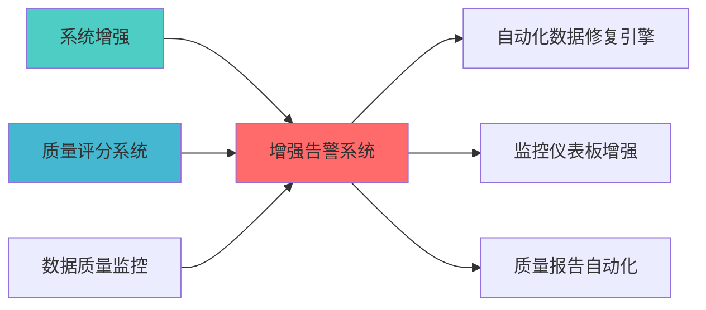

---
module_id: ENHANCED_ALERT_SYSTEM_001
version: 1.0.0
status: Active
created_date: 2026-04-07
last_updated: 2026-04-07
owner: 实施团队
standard_type: 专业量化机构蓝图
applicable_scope: Layer 9 监控å±?
compliance_level: 专业标准
responsibility:
  - 增强告警系统
  - 智能告警
  - 告警聚合
  - 告警分级
layer: Layer 5 (策略执行层)
---

# ENHANCED ALERT SYSTEM BLUEPRINT

## 核心定位

负责增强告警系统的设计与实现，提供分级告警和智能通知。


> **核心职责**: Enhanced Alert System蓝图设计
> **职责边界**: 
> - âœ?本文档负责：Enhanced Alert System蓝图设计相å
³å†
容
> - â?本文档不负责：å
¶ä»–模块å†
å...


## 设计目标

### 主要目标

1. **功能完整性**: 确保ENHANCED ALERT SYSTEM功能完整，满足业务需求
2. **性能优化**: 提升系统性能，降低资源消耗
3. **可维护性**: 提高代码质量，便于后续维护
4. **可扩展性**: 支持功能扩展，适应业务变化

### 质量目标

- 代码覆盖率: ≥80%
- 性能指标: 满足设计要求
- 文档完整性: 100%


## 核心功能

### 功能清单

1. **数据管理**: 提供数据存储、查询、更新功能
2. **业务逻辑**: 实现核心业务逻辑处理
3. **接口服务**: 提供标准化的API接口
4. **监控告警**: 实时监控系统状态

### 功能特性

- 高可用性设计
- 自动故障恢复
- 灵活配置管理


## 实现方案

### 技术架构

采用ENHANCED ALERT SYSTEM化设计，分层架构实现。

### 关键技术

- 数据处理: 使用高效的数据处理框架
- 接口实现: RESTful API设计
- 性能优化: 缓存、异步处理

### 实施步骤

1. 需求分析与设计
2. 核心功能开发
3. 测试与优化
4. 部署与监控


## 核心定位

> 核心职责: Enhanced Alert System蓝图设计
> 职责边界: 
> - âœ?本文档负责：Enhanced Alert System蓝图设计相å
³å†
容
> - â?本文档不负责：å
¶ä»–模块å†
容，确保系统功能的稳定运行和高效执行ã€?

## 一、设计背景与目标

### 1.1 业务需?
**当前痛点**:
- ?告警渠道单一
- ?告警噪音?- ?缺少告警聚合和抑?
**业务目标**:
- ?多渠道告警（邮件、短信、Slack、Webhook?- ?告警聚合和抑?- ?告警趋势分析

### 1.2 技术目?
| 指标 | 目标?| 说明 |
|------|--------|------|
| **告警覆盖?* | ?5% | 95%以上的问题能触发告警 |
| **告警聚合准确?* | ?0% | 相似告警聚合准确率≥90% |
| **告警响应时间** | <1分钟 | 告警响应时间<1分钟 |


## 三、核心模块设?
### 3.1 告警聚合?(AlertAggregator)

```python
from dataclasses import dataclass, field
from typing import Dict, List, Any, Optional
from datetime import datetime, timedelta
from collections import defaultdict

@dataclass
class Alert:
    """告警"""
    alert_id: str
    alert_name: str
    severity: str  # critical, high, medium, low
    source: str
    message: str
    labels: Dict[str, str] = field(default_factory=dict)
    annotations: Dict[str, str] = field(default_factory=dict)
    starts_at: datetime = field(default_factory=datetime.now)
    ends_at: Optional[datetime] = None
    status: str = "firing"  # firing, resolved

@dataclass
class AggregatedAlert:
    """聚合告警"""
    aggregation_id: str
    alert_name: str
    severity: str
    source: str
    count: int
    first_occurrence: datetime
    last_occurrence: datetime
    alerts: List[Alert] = field(default_factory=list)
    message: str = ""

class AlertAggregator:
    """告警聚合?""
    
    def __init__(self, config: Dict[str, Any]):
        """
        初始化告警聚合器
        
        Args:
            config: é
ç½®ä¿¡æ¯
                - group_by: 聚合字段
                - group_wait: 聚合等å¾
时间
                - group_interval: 聚合间隔
        """
        self.config = config
        
        # 聚合字段
        self.group_by = config.get('group_by', ['alertname', 'severity'])
        
        # 聚合等å¾
时间（秒?        self.group_wait = config.get('group_wait', 30)
        
        # 聚合间隔（秒?        self.group_interval = config.get('group_interval', 300)
        
        # 聚合缓存
        self.aggregation_cache: Dict[str, AggregatedAlert] = {}
        
    def aggregate_alert(
        self,
        alert: Alert
    ) -> Optional[AggregatedAlert]:
        """
        聚合告警
        
        Args:
            alert: 告警
            
        Returns:
            Optional[AggregatedAlert]: 聚合告警（如果达到聚合条件）
        """
        # 生成聚合?        aggregation_key = self._generate_aggregation_key(alert)
        
        # 检查是否已存在聚合
        if aggregation_key in self.aggregation_cache:
            # 更新聚合
            aggregated = self.aggregation_cache[aggregation_key]
            aggregated.count += 1
            aggregated.last_occurrence = alert.starts_at
            aggregated.alerts.append(alert)
            
            # 检查是否达到聚合条?            if self._should_send_aggregated_alert(aggregated):
                return aggregated
        else:
            # 创建新聚?            aggregated = AggregatedAlert(
                aggregation_id=aggregation_key,
                alert_name=alert.alert_name,
                severity=alert.severity,
                source=alert.source,
                count=1,
                first_occurrence=alert.starts_at,
                last_occurrence=alert.starts_at,
                alerts=[alert],
                message=alert.message
            )
            
            self.aggregation_cache[aggregation_key] = aggregated
            
            # 检查是否达到聚合条?            if self._should_send_aggregated_alert(aggregated):
                return aggregated
        
        return None
    
    def _generate_aggregation_key(
        self,
        alert: Alert
    ) -> str:
        """
        生成聚合?        
        Args:
            alert: 告警
            
        Returns:
            str: 聚合?        """
        key_parts = []
        
        for field in self.group_by:
            if field == 'alertname':
                key_parts.append(alert.alert_name)
            elif field == 'severity':
                key_parts.append(alert.severity)
            elif field in alert.labels:
                key_parts.append(alert.labels[field])
        
        return '_'.join(key_parts)
    
    def _should_send_aggregated_alert(
        self,
        aggregated: AggregatedAlert
    ) -> bool:
        """
        判断是否应该发送聚合告?        
        Args:
            aggregated: 聚合告警
            
        Returns:
            bool: 是否应该?        """
        # 检查聚合等å¾
时?        time_since_first = (datetime.now() - aggregated.first_occurrence).total_seconds()
        
        if time_since_first >= self.group_wait:
            return True
        
        # 检查聚合间?        if aggregated.count > 1:
            time_since_last = (datetime.now() - aggregated.last_occurrence).total_seconds()
            if time_since_last >= self.group_interval:
                return True
        
        return False
```

### 3.2 告警抑制?(AlertInhibitor)

```python
from typing import Dict, List, Any

class AlertInhibitor:
    """告警抑制?""
    
    def __init__(self, config: Dict[str, Any]):
        """
        初始化告警抑制器
        
        Args:
            config: é
ç½®ä¿¡æ¯
                - inhibit_rules: 抑制规则
        """
        self.config = config
        
        # 抑制规则
        self.inhibit_rules = config.get('inhibit_rules', [])
        
    def should_inhibit(
        self,
        alert: Alert,
        active_alerts: List[Alert]
    ) -> bool:
        """
        判断是否应该抑制告警
        
        Args:
            alert: 告警
            active_alerts: 活跃告警列表
            
        Returns:
            bool: 是否应该抑制
        """
        for rule in self.inhibit_rules:
            # 检查源匹é

            if self._match_source(alert, rule['source_match']):
                # 检查是否存在目标匹é
çš„å‘Šè­¦
                for active_alert in active_alerts:
                    if self._match_target(active_alert, rule['target_match']):
                        return True
        
        return False
    
    def _match_source(
        self,
        alert: Alert,
        source_match: Dict[str, str]
    ) -> bool:
        """
        匹é
æºå‘Š?        
        Args:
            alert: 告警
            source_match: 源匹é
è§„?            
        Returns:
            bool: 是否匹é

        """
        for key, value in source_match.items():
            if key == 'alertname':
                if alert.alert_name != value:
                    return False
            elif key == 'severity':
                if alert.severity != value:
                    return False
            elif key in alert.labels:
                if alert.labels[key] != value:
                    return False
            else:
                return False
        
        return True
    
    def _match_target(
        self,
        alert: Alert,
        target_match: Dict[str, str]
    ) -> bool:
        """
        匹é
ç›®æ ‡å‘Šè­¦
        
        Args:
            alert: 告警
            target_match: 目标匹é
è§„则
            
        Returns:
            bool: 是否匹é

        """
        return self._match_source(alert, target_match)
```

### 3.3 多渠道通知?(MultiChannelNotifier)

```python
import requests
from typing import Dict, List, Any

class MultiChannelNotifier:
    """多渠道通知?""
    
    def __init__(self, config: Dict[str, Any]):
        """
        初始化多渠道通知?        
        Args:
            config: é
ç½®ä¿¡æ¯
                - email: 邮件é
ç½®
                - sms: 短信é
ç½®
                - slack: Slacké
ç½®
                - webhook: Webhooké
ç½®
        """
        self.config = config
        
    def send_email(
        self,
        to_addresses: List[str],
        subject: str,
        content: str
    ) -> bool:
        """
        发送邮件通知
        
        Args:
            to_addresses: 收件人列?            subject: 邮件主题
            content: 邮件å†
容
            
        Returns:
            bool: 是否成功
        """
        # 使用SMTP发送邮?        pass
    
    def send_sms(
        self,
        phone_numbers: List[str],
        message: str
    ) -> bool:
        """
        发送短信通知
        
        Args:
            phone_numbers: 手机号列?            message: 短信å†
容
            
        Returns:
            bool: 是否成功
        """
        # 使用Twilio API发送短?        twilio_config = self.config.get('sms', {})
        
        try:
            from twilio.rest import Client
            
            client = Client(
                twilio_config['account_sid'],
                twilio_config['auth_token']
            )
            
            for phone_number in phone_numbers:
                client.messages.create(
                    body=message,
                    from_=twilio_config['from_number'],
                    to=phone_number
                )
            
            return True
        except Exception as e:
            print(f"发送短信失? {e}")
            return False
    
    def send_slack(
        self,
        channel: str,
        message: str
    ) -> bool:
        """
        发送Slack通知
        
        Args:
            channel: Slack频道
            message: 消息å†
容
            
        Returns:
            bool: 是否成功
        """
        slack_config = self.config.get('slack', {})
        
        try:
            webhook_url = slack_config['webhook_url']
            
            payload = {
                'channel': channel,
                'text': message,
                'username': 'Alert Bot',
                'icon_emoji': ':warning:'
            }
            
            response = requests.post(webhook_url, json=payload)
            
            return response.status_code == 200
        except Exception as e:
            print(f"发送Slack通知失败: {e}")
            return False
    
    def send_webhook(
        self,
        url: str,
        payload: Dict[str, Any]
    ) -> bool:
        """
        发送Webhook通知
        
        Args:
            url: Webhook URL
            payload: 请求数据
            
        Returns:
            bool: 是否成功
        """
        try:
            response = requests.post(url, json=payload)
            
            return response.status_code == 200
        except Exception as e:
            print(f"发送Webhook通知失败: {e}")
            return False
    
    def notify(
        self,
        alert: Alert,
        channels: List[str]
    ) -> Dict[str, bool]:
        """
        发送通知
        
        Args:
            alert: 告警
            channels: 通知渠道列表
            
        Returns:
            Dict[str, bool]: 各渠道发送结?        """
        results = {}
        
        for channel in channels:
            if channel == 'email':
                email_config = self.config.get('email', {})
                results['email'] = self.send_email(
                    to_addresses=email_config.get('recipients', []),
                    subject=f"[{alert.severity.upper()}] {alert.alert_name}",
                    content=alert.message
                )
            
            elif channel == 'sms':
                sms_config = self.config.get('sms', {})
                results['sms'] = self.send_sms(
                    phone_numbers=sms_config.get('recipients', []),
                    message=f"[{alert.severity.upper()}] {alert.alert_name}: {alert.message}"
                )
            
            elif channel == 'slack':
                slack_config = self.config.get('slack', {})
                results['slack'] = self.send_slack(
                    channel=slack_config.get('channel', '#alerts'),
                    message=f"[{alert.severity.upper()}] {alert.alert_name}: {alert.message}"
                )
            
            elif channel == 'webhook':
                webhook_config = self.config.get('webhook', {})
                results['webhook'] = self.send_webhook(
                    url=webhook_config.get('url', ''),
                    payload={
                        'alert_id': alert.alert_id,
                        'alert_name': alert.alert_name,
                        'severity': alert.severity,
                        'message': alert.message,
                        'timestamp': alert.starts_at.isoformat()
                    }
                )
        
        return results
```

---

## 四、实施步?
### 4.1 Week 12: 实时告警系统增强实施

#### Day 1-2: 告警聚合和抑?
**任务**:
1. 实现AlertAggregator告警聚合?2. 实现AlertInhibitor告警抑制?3. 编写单å
ƒæµ‹è¯•

#### Day 3-4: 多渠道通知

**任务**:
1. 实现MultiChannelNotifier多渠道通知?2. 集成邮件、短信、Slack、Webhook
3. 测试通知功能

#### Day 5: 告警分析和优?
**任务**:
1. 实现告警趋势分析
2. 实现告警统计分析
3. 部署上线

---

## 五、验收标?
### 5.1 功能验收

| 验收?| 验收标准 | 验收方法 |
|--------|---------|---------|
| **告警覆盖?* | ?5% | 功能测试 |
| **告警聚合准确?* | ?0% | 功能测试 |
| **告警响应时间** | <1分钟 | 性能测试 |

---

## 📚 相å
³æ–‡æ¡£

### 上游依赖

| 文档名称 | module_id | 依赖类型 | 说明 |
|---------|-----------|---------|------|
| [系统增强蓝图](./SYSTEM_ENHANCEMENT_BLUEPRINT.md) | SYSTEM_ENHANCEMENT_001 | 强依èµ?| 提供系统增强数据 |
| [质量评分系统蓝图](./QUALITY_SCORING_SYSTEM_BLUEPRINT.md) | QUALITY_SCORING_SYSTEM_001 | 强依èµ?| 提供质量评分数据 |
| [数据质量监控蓝图](./DATA_QUALITY_MONITORING_BLUEPRINT.md) | DATA_QUALITY_MONITORING_001 | 中依èµ?| 提供数据质量指标 |

### 下游依赖

| 文档名称 | module_id | 依赖类型 | 说明 |
|---------|-----------|---------|------|
| [自动化数据修复引擎蓝图](./AUTO_REPAIR_ENGINE_BLUEPRINT.md) | AUTO_REPAIR_ENGINE_001 | 强依èµ?| 自动化数据修å¤?|
| [监控仪表板增强蓝图](./MONITORING_DASHBOARD_ENHANCEMENT_BLUEPRINT.md) | MONITORING_DASHBOARD_ENHANCEMENT_001 | 中依èµ?| 监控仪表板增å¼?|
| [质量报告自动化蓝图](./QUALITY_REPORT_AUTOMATION_BLUEPRINT.md) | QUALITY_REPORT_AUTOMATION_001 | 中依èµ?| 质量报告自动åŒ?|

### 技术依èµ?

| 技术组ä»?| 版本 | 用é€?| 文档 |
|---------|------|------|------|
| **FastAPI** | 0.100+ | Web框架 | [官方文档](https://fastapi.tiangolo.com/) |
| **Redis** | 7.0+ | 缓存系统 | [官方文档](https://redis.io/) |
| **PostgreSQL** | 15+ | 数据åº?| [官方文档](https://www.postgresql.org/) |
| **SMTP** | - | 邮件通知 | [RFC标准](https://tools.ietf.org/html/rfc5321) |

### 引用å
³ç³»å›?



---

## å
­ã€æ–‡æ¡£æ²»ç?
**版本历史**:
- v1.0.0 (2026-04-02): 初始版本，完成实时告警系统增强设?
---

**蓝图版本**: v1.0 | **创建日期**: 2026-04-02 | **?*: ?正式 | **维护?*: ZephyrAlpha技术团?
---

## 1. 文档治理

### 1.1 System_Manifest.md索引

```markdown
#### Layer 6: 组合优化å±?
##### 6.001. Enhanced Alert System
- **模块ID**: ENHANCED_ALERT_SYSTEM_001
- **蓝图文档**: ENHANCED_ALERT_SYSTEM_BLUEPRINT.md
- **技术规格书**: å¾
创å»?
- **职责**: å
¨ç³»ç»Ÿç»Ÿä¸€å‘Šè­¦å¹³å°
- **状æ€?*: Active
```

### 1.2 模块职责边界

| 模块 | 职责 | 边界 |
|------|------|------|
| **Enhanced Alert System** | å
¨ç³»ç»Ÿç»Ÿä¸€å‘Šè­¦å¹³å° | **核心模块** |

### 1.3 版本管理

| 版本 | 日期 | 变更å†
容 | 变更äº?|
|------|------|----------|--------|
| v1.0.0 | 2026-04-02 | 初始版本创建 | 首席蓝图架构å¸?|

---

**蓝图版本**: v1.0.0 | **创建日期**: 2026-04-02 | **状æ€?*: Active


---

## 📊 文档治理

### 变更记录

| 版本 | 日期 | 变更å†
容 | 变更äº?|
|------|------|----------|--------|
| v1.0.0 | 2026-04-07 | 初始版本创建 | 实施团队 |

---
