# 执行策略�测器��

> **核心定�**: 执行策略�测器�图的核心功能��


> **版本**: v1.0
> **创建日期**: 2026-04-06
> **开�项�*: Backtrader (12k+ Stars) + VeighNa (27k+ Stars)
> **目标**: �建专业级执行策略�测器，���测到�盘无�切�

## 核心定�

负责Execution Strategy Backtester的设计���和维护，�供核心功能支�，确�系统模�的稳定�行和高效执行�

## 二���设�

### 2.1 Layer定�

**Layer归�**: Layer 5 - 策略执行�

**模�类别**: 核心�测模�

**��角色**: 
- 作为策略执行层的�测核心
- 为智能执行算法�供策略验�
- 为策略引��供�测能�

### 2.2 系统���

```
┌─────────────────────────────────────────────────────────────────�
�                 执行策略�测器��                              �
├─────────────────────────────────────────────────────────────────�
â”?                                                                â”?
� ┌───────────────────────────────────────────────────────────��
� �             数�管��                                  ��
� � ┌─────────────────────────────────────────────────────���
� � ���数�管�                                        ���
� � � ├── K线数�                                      ���
� � � ├── Tick数�                                      ���
� � � ├── 订�簿数�                                   ���
� � � └── �交数�                                      ���
� � └─────────────────────────────────────────────────────���
� � ┌─────────────────────────────────────────────────────���
� � �数�预处�                                         ���
� � � ├── 数�清洗                                      ���
� � � ├── 数�对�                                      ���
� � � ├── 数�验�                                      ���
� � � └── 数�缓存                                      ���
� � └─────────────────────────────────────────────────────���
� └───────────────────────────────────────────────────────────��
â”?                                                                â”?
� ┌───────────────────────────────────────────────────────────��
� �             �测引��                                  ��
� � ┌─────────────────────────────────────────────────────���
� � �Backtrader�测引�                                  ���
� � � ├── 策略框�                                      ���
� � � ├── 指标计算                                      ���
� � � ├── 订�管�                                      ���
� � � └── 事件驱动                                      ���
� � └─────────────────────────────────────────────────────���
� � ┌─────────────────────────────────────────────────────���
� � �执行算法模拟                                        ���
� � � ├── TWAP模拟                                      ���
� � � ├── VWAP模拟                                      ���
� � � ├── POV模拟                                       ���
� � � └── IS模拟                                        ���
� � └─────────────────────────────────────────────────────���
� └───────────────────────────────────────────────────────────��
â”?                                                                â”?
� ┌───────────────────────────────────────────────────────────��
� �             模拟�                                      ��
� � ┌─────────────────────────────────────────────────────���
� � �滑点模拟                                            ���
� � � ├── 固定滑点                                      ���
� � � ├── 百分比滑�                                   ���
� � � ├── 市场冲击滑点                                  ���
� � � └── �动性滑�                                   ���
� � └─────────────────────────────────────────────────────���
� � ┌─────────────────────────────────────────────────────���
� � ��本模拟                                            ���
� � � ├── 佣金�本                                      ���
� � � ├── �花�                                       ���
� � � ├── 市场冲击�本                                  ���
� � � └── 机会�本                                      ���
� � └─────────────────────────────────────────────────────���
� � ┌─────────────────────────────────────────────────────���
� � ��动性模�                                         ���
� � � ├── 订�簿深�                                   ���
� � � ├── �交���                                   ���
� � � ├── 部分�交                                      ���
� � � └── 拒�模拟                                      ���
� � └─────────────────────────────────────────────────────���
� └───────────────────────────────────────────────────────────��
â”?                                                                â”?
� ┌───────────────────────────────────────────────────────────��
� �             分��                                      ��
� � ┌─────────────────────────────────────────────────────���
� � �性能指标计算                                        ���
� � � ├── 收益�指�                                   ���
� � � ├── �险指标                                      ���
� � � ├── 执行质�指标                                  ���
� � � └── �本指标                                      ���
� � └─────────────────────────────────────────────────────���
� � ┌─────────────────────────────────────────────────────���
� � ��视化分�                                         ���
� � � ├── 资金曲线                                      ���
� � � ├── �撤曲线                                      ���
� � � ├── 执行质��                                   ���
� � � └── �本分��                                   ���
� � └─────────────────────────────────────────────────────���
� └───────────────────────────────────────────────────────────��
â”?                                                                â”?
� ┌───────────────────────────────────────────────────────────��
� �             �盘切��                                  ��
� � ┌─────────────────────────────────────────────────────���
� � �VeighNa�盘��                                     ���
� � � ├── QMT��                                       ���
� � � ├── CTP��                                       ���
� � � ├── 订�管�                                      ���
� � � └── �时监�                                      ���
� � └─────────────────────────────────────────────────────���
� � ┌─────────────────────────────────────────────────────���
� � �策略�移                                            ���
� � � ├── �测策略                                      ���
� � � ├── �盘策略                                      ���
� � � ├── �数�步                                      ���
� � � └── ���步                                      ���
� � └─────────────────────────────────────────────────────���
� └───────────────────────────────────────────────────────────��
└─────────────────────────────────────────────────────────────────�
```

### 2.3 模��责�边�

**核心�责**: 为执行策略�供专业的�测和验�能�

**�责边界**:
- �本模�负�
  - 执行策略�测
  - 滑点和�本模�
  - �测结�分�
  - �测到�盘切�
  
- �本模��负责:
  - 策略信�生�（由SignalGenerator负责�
  - �盘交易执行（由QMTExecutor负责�
  - �险�制（由RiskHedgeEngine负责�
  - 数���（由DataSource负责�

---

## 三�技术��方�

### 3.1 开�项目集�

#### Backtrader框�集�

**项目信�**:
- **项目�称**: Backtrader
- **Stars**: 12k+
- **许��*: MIT
- **语言**: Python
- **维护状�*: 活跃

**核心功能**:
- 策略�测框�
- 指标计算引�
- 订�管�系统
- 事件驱动��

**集�方案**:
```python
import backtrader as bt

class ExecutionStrategy(bt.Strategy):
    def __init__(self):
        self.order = None
        self.buyprice = None
        self.buycomm = None
        
    def next(self):
        if not self.position:
            if self.data.close[0] > self.data.open[0]:
                self.order = self.buy(size=100)
        else:
            if self.data.close[0] < self.data.open[0]:
                self.order = self.sell(size=100)
                
    def notify_order(self, order):
        if order.status in [order.Completed]:
            if order.isbuy():
                self.buyprice = order.executed.price
                self.buycomm = order.executed.comm
```

#### VeighNa框�集�

**项目信�**:
- **项目�称**: VeighNa (vn.py)
- **Stars**: 27k+
- **许��*: MIT
- **语言**: Python
- **维护状�*: 活跃

**核心功能**:
- �盘交易��
- 多券商支�
- 策略管�
- �时监�

**集�方案**:
```python
from vnpy.trader.engine import MainEngine
from vnpy.trader.ui import MainWindow, create_qapp
from vnpy.gateway.ctp import CtpGateway
from vnpy.app.cta_strategy import CtaStrategyApp

class LiveTradingEngine:
    def __init__(self):
        self.main_engine = MainEngine()
        self.main_engine.add_gateway(CtpGateway)
        self.main_engine.add_app(CtaStrategyApp)
        
    def connect(self, userid, password, brokerid, td_address, md_address):
        self.main_engine.connect({
            "userid": userid,
            "password": password,
            "brokerid": brokerid,
            "td_address": td_address,
            "md_address": md_address
        }, "CTP")
```

### 3.2 核心算法设计

#### 3.2.1 滑点模拟算法

**固定滑点**:
```python
def calculate_fixed_slippage(price, slippage_rate):
    return price * slippage_rate
```

**市场冲击滑点**:
```python
def calculate_market_impact_slippage(order_size, avg_volume, volatility):
    participation_rate = order_size / avg_volume
    impact_coefficient = 0.1
    slippage = impact_coefficient * participation_rate * volatility
    return slippage
```

**�动性滑�*:
```python
def calculate_liquidity_slippage(order_size, order_book_depth):
    available_liquidity = sum([level['volume'] for level in order_book_depth])
    if order_size > available_liquidity:
        return float('inf')
    else:
        return order_size / available_liquidity * 0.001
```

#### 3.2.2 �本模拟算法

**显性�本模�*:
```python
def simulate_explicit_costs(trade_value, commission_rate, stamp_duty_rate):
    commission = trade_value * commission_rate
    stamp_duty = trade_value * stamp_duty_rate
    return commission + stamp_duty
```

**�性�本模�*:
```python
def simulate_implicit_costs(trade, market_data):
    market_impact = calculate_market_impact(trade, market_data)
    timing_cost = calculate_timing_cost(trade, market_data)
    spread_cost = calculate_spread_cost(trade, market_data)
    return market_impact + timing_cost + spread_cost
```

### 3.3 数�模�设计

#### 3.3.1 �测�置模�

```python
class BacktestConfig:
    start_date: datetime
    end_date: datetime
    initial_capital: float
    commission_rate: float
    stamp_duty_rate: float
    slippage_model: str
    data_frequency: str  # daily/hourly/minute/tick
```

#### 3.3.2 �测结�模�

```python
class BacktestResult:
    total_return: float
    annual_return: float
    max_drawdown: float
    sharpe_ratio: float
    win_rate: float
    profit_factor: float
    total_trades: int
    total_cost: float
    execution_quality_score: float
```

---

## 四�个人开�适用性分�

### 4.1 开�项目优�

| 优势维度 | 说� | 评分 |
|---------|------|------|
| **开���* | Backtrader和VeighNa完全�费 | �����|
| **Python�生** | ��有系统无�集�| �����|
| **文档完善** | 详细文档和示例代�| �����|
| **社区活跃** | 问题�快速�得解�| �����|
| **功能完整** | 满足专业机�需�| �����|

### 4.2 AI维护�行�

| 维护维度 | �行�| 说� |
|---------|--------|------|
| **代��解** | �����| AI�快速�解框�代�结�|
| **Bug修�** | �����| AI�快速定�和修�Bug |
| **功能扩展** | �����| AI�基�框�扩展自定义功能 |
| **性能优化** | ���� | AI�分�和优化性能瓶颈 |
| **文档维护** | �����| AI�自动生�和维护文档 |

### 4.3 �施�本评估

| �本维度 | 评估结� | 说� |
|---------|---------|------|
| **开�工�* | 4�| 集�Backtrader+VeighNa |
| **学习�本** | �| 两个框�文档完善 |
| **维护�本** | �| 开�项目维护活�|
| **硬件�本** | �| 无需�外硬件投入 |

---

## 五��施路径规�

### 5.1 Phase 1: Backtrader集�（Week 1-2�

**目标**: 集�Backtrader�测引�

**任务清�**:
1. �安装Backtrader�赖
2. �创建�测引�基础�
3. �����数�加载
4. ���基础�测功能
5. ��元测试和集�测�

**交付��**:
- Backtrader�测引�
- ��数�管�模�
- 基础�测功能

### 5.2 Phase 2: 模拟功能开�（Week 3�

**目标**: 开�滑点和�本模拟功能

**任务清�**:
1. ���滑点模拟模�
2. ����本模拟模�
3. ����动性模拟模�
4. �集�市场冲击模�
5. �集�测试

**交付��**:
- 滑点模拟模�
- �本模拟模�
- �动性模拟模�

### 5.3 Phase 3: VeighNa集�（Week 4�

**目标**: 集�VeighNa�盘��

**任务清�**:
1. �安装VeighNa�赖
2. �创建�盘交易引�
3. ����测到�盘切�
4. �开�API��
5. �文档完善

**交付��**:
- VeighNa�盘��
- �测到�盘切�功�
- API��文档
- 用户手册

---

## 六�质���标�

### 6.1 功能完整性检�

| 功能�| 完整性��| 验�方法 |
|--------|-----------|---------|
| **�测引�** | 支�多�策略类� | 功能测试 |
| **滑点模拟** | 支�多�滑点模� | �元测试 |
| **�本模拟** | 支�全�本模�| 集�测试 |
| **�盘切�** | 无�切� | 性能测试 |

### 6.2 性能�求

| 性能指标 | �求 | 说� |
|---------|------|------|
| **�测速度** | 1000 bars/s | 满足快速�测需�|
| **数���** | 100万�/�| 支�大规模数���|
| **内存�用** | <2GB | �次�测内存�制 |

### 6.3 准确性��

| 准确性指�| �求 | 说� |
|---------|------|------|
| **�测精度** | 99.9% | ��盘结�对�|
| **滑点模拟精度** | 95% | ��际滑点对�|
| **�本模拟精度** | 98% | ��际�本对�|

---

## 七��险评估�缓解

### 7.1 技术��

| �险�| �险等级 | 缓解�施 |
|--------|---------|---------|
| **框�兼容�* | �| 充分测试，版本��|
| **性能瓶颈** | �| 性能优化，缓存机�|
| **数�质�** | �| 数�验�，异常处�|

### 7.2 �施�险

| �险�| �险等级 | 缓解�施 |
|--------|---------|---------|
| **学习曲线** | �| 文档完善，示例代�|
| **集����* | �| 分阶段�施，充分测试 |
| **维护�本** | �| 开�项目维护活�|

---

## 八�专业机�对�

### 8.1 QuantConnect对标

| 功能模� | QuantConnect�� | 本�图��| 对标程度 |
|---------|-----------------|-----------|---------|
| **�测引�** | 专业�测系统 | Backtrader框� | �����(100%) |
| **数�管�** | 云端数� | 本地数�管� | ���� (80%) |
| **�盘切�** | 多券商支�| VeighNa多券�| ���� (80%) |

### 8.2 专业�化机�对标

| 功能模� | 专业机��� | 本�图��| 对标程度 |
|---------|------------|-----------|---------|
| **滑点模拟** | 高精度模�| 多模�模�| ���� (80%) |
| **�本模拟** | 全�本模�| 显��性��| ���� (80%) |
| **�动性模�* | 订�簿模�| 深度模拟 | ���� (80%) |

---

## ��相关文�

### 上游�赖

| 文档�称 | module_id | �赖类� | 说� |
|---------|-----------|---------|------|
| [智能执行引��图](./SMART_EXECUTION_ENGINE_BLUEPRINT.md) | SMART_EXECUTION_ENGINE_001 | 强��| �供执行算法 |
| [数�质�监��图](./DATA_QUALITY_MONITORING_BLUEPRINT.md) | DATA_QUALITY_MONITORING_001 | 强��| �供数�质�指标 |
| [市场冲击模��图](./MARKET_IMPACT_MODEL_BLUEPRINT.md) | MARKET_IMPACT_MODEL_001 | 中��| �供市场冲击模� |

### 下游�赖

| 文档�称 | module_id | �赖类� | 说� |
|---------|-----------|---------|------|
| [算法交易优化器�图](./ALGORITHMIC_TRADING_OPTIMIZER_BLUEPRINT.md) | ALGORITHMIC_TRADING_OPTIMIZER_001 | 强��| 算法交易优化 |
| [交易�本分�引��图](./TRANSACTION_COST_ANALYSIS_ENGINE_BLUEPRINT.md) | TRANSACTION_COST_ANALYSIS_ENGINE_001 | 中��| 交易�本分� |
| [智能订�路由�图](./SMART_ORDER_ROUTER_BLUEPRINT.md) | SMART_ORDER_ROUTER_001 | 中��| 智能订�路由 |

### 技术��

| 技术组�| 版本 | 用�| 文档 |
|---------|------|------|------|
| **backtrader** | 1.9+ | �测框� | [官方文档](https://www.backtrader.com/) |
| **vnpy** | 3.0+ | �盘�� | [官方文档](https://www.vnpy.com/) |
| **Pandas** | 2.0+ | 数�处� | [官方文档](https://pandas.pydata.org/) |
| **NumPy** | 1.24+ | 数值计�| [官方文档](https://numpy.org/) |
| **Matplotlib** | 3.7+ | �视�| [官方文档](https://matplotlib.org/) |

### 引用关系�

```mermaid
graph LR
    A[智能执行引�] --> B[执行策略�测器]
    C[数�质�监�] --> B
    D[市场冲击模�] --> B
    
    B --> E[算法交易优化器]
    B --> F[交易�本分�引�]
    B --> G[智能订�路由]
    
    style B fill:#ff6b6b
    style A fill:#4ecdc4
    style C fill:#45b7d1
```



### 相关�图文档

| 文档�称 | 说� |
|---------|------|
| ARCHITECTURE.md | 系统��文档 |
| STRATEGY_EXECUTION_LAYER_BLUEPRINT.md | 策略执行层��|
| [SMART_EXECUTION_ENGINE_BLUEPRINT.md](./SMART_EXECUTION_ENGINE_BLUEPRINT.md) | 智能执行引��图 |
| [TRANSACTION_COST_ANALYSIS_ENGINE_BLUEPRINT.md](./TRANSACTION_COST_ANALYSIS_ENGINE_BLUEPRINT.md) | 交易�本分�引��图 |

---

**�图版本**: v1.0
**�图日期**: 2026-04-06
**�图编写**: 首席���
**�图状�*: 已完�

## �更��

| 版本 | 日期 | �更内容 | �更�|
|------|------|----------|--------|
| v1.0.0 | 2026-04-06 | �始版本创建 | 首席���|

---

**�图版本**: v1.0.0 | **创建日期**: 2026-04-06 | **状�*: Active
---

## 1. 文档治�

### 1.1 System_Manifest.md索引

```markdown
#### Layer 5: 策略执行�
##### 6.001. Execution Strategy Backtester
- **模�ID**: EXECUTION_STRATEGY_BACKTESTER_001
- **�图文档**: EXECUTION_STRATEGY_BACKTESTER_BLUEPRINT.md
- **技术规格书**: 待创�
- **�责**: Layer 5 - 策略执行�
- **状�*: Active
```

### 1.2 模��责边界

| 模� | �责 | 边界 |
|------|------|------|
| **Execution Strategy Backtester** | Layer 5 - 策略执行�| **核心模�** |

### 1.3 版本管�

| 版本 | 日期 | �更内容 | �更�|
|------|------|----------|--------|
| v1.0.0 | 2026-04-06 | �始版本创建 | 首席�图���|

---

**�图版本**: v1.0.0 | **创建日期**: 2026-04-06 | **状�*: Active
