## 核心定位

负责执行策略回测的设计与实现，基于历史数据模拟交易执行，评估执行策略效果，支持执行策略优化。

# 执行策略回测器蓝å›?

> **核心定位**: 执行策略回测器蓝图的核心功能实现


> **版本**: v1.0
> **创建日期**: 2026-04-06
> **开源项ç›?*: Backtrader (12k+ Stars) + VeighNa (27k+ Stars)
> **目标**: 构建专业级执行策略回测器，实现回测到实盘无缝切换

## 核心定位

负责Execution Strategy Backtester的设计、实现和维护，提供核心功能支持，确保系统模块的稳定运行和高效执行ã€?

## 二、架构设è®?

### 2.1 Layer定位

**Layer归属**: Layer 5 - 策略执行å±?

**模块类别**: 核心回测模块

**架构角色**: 
- 作为策略执行层的回测核心
- 为智能执行算法提供策略验è¯?
- 为策略引擎提供回测能åŠ?

### 2.2 系统架构å›?

```
┌─────────────────────────────────────────────────────────────────â”?
â”?                 执行策略回测器架æž?                              â”?
├─────────────────────────────────────────────────────────────────â”?
â”?                                                                â”?
â”? ┌───────────────────────────────────────────────────────────â”?â”?
â”? â”?             数据管理å±?                                  â”?â”?
â”? â”? ┌─────────────────────────────────────────────────────â”?â”?â”?
â”? â”? â”?历史数据管理                                        â”?â”?â”?
â”? â”? â”? ├── K线数æ?                                      â”?â”?â”?
â”? â”? â”? ├── Tick数据                                      â”?â”?â”?
â”? â”? â”? ├── 订单簿数æ?                                   â”?â”?â”?
â”? â”? â”? └── 成交数据                                      â”?â”?â”?
â”? â”? └─────────────────────────────────────────────────────â”?â”?â”?
â”? â”? ┌─────────────────────────────────────────────────────â”?â”?â”?
â”? â”? â”?数据预处ç?                                         â”?â”?â”?
â”? â”? â”? ├── 数据清洗                                      â”?â”?â”?
â”? â”? â”? ├── 数据对齐                                      â”?â”?â”?
â”? â”? â”? ├── 数据验证                                      â”?â”?â”?
â”? â”? â”? └── 数据缓存                                      â”?â”?â”?
â”? â”? └─────────────────────────────────────────────────────â”?â”?â”?
â”? └───────────────────────────────────────────────────────────â”?â”?
â”?                                                                â”?
â”? ┌───────────────────────────────────────────────────────────â”?â”?
â”? â”?             回测引擎å±?                                  â”?â”?
â”? â”? ┌─────────────────────────────────────────────────────â”?â”?â”?
â”? â”? â”?Backtrader回测引擎                                  â”?â”?â”?
â”? â”? â”? ├── 策略框架                                      â”?â”?â”?
â”? â”? â”? ├── 指标计算                                      â”?â”?â”?
â”? â”? â”? ├── 订单管理                                      â”?â”?â”?
â”? â”? â”? └── 事件驱动                                      â”?â”?â”?
â”? â”? └─────────────────────────────────────────────────────â”?â”?â”?
â”? â”? ┌─────────────────────────────────────────────────────â”?â”?â”?
â”? â”? â”?执行算法模拟                                        â”?â”?â”?
â”? â”? â”? ├── TWAP模拟                                      â”?â”?â”?
â”? â”? â”? ├── VWAP模拟                                      â”?â”?â”?
â”? â”? â”? ├── POV模拟                                       â”?â”?â”?
â”? â”? â”? └── IS模拟                                        â”?â”?â”?
â”? â”? └─────────────────────────────────────────────────────â”?â”?â”?
â”? └───────────────────────────────────────────────────────────â”?â”?
â”?                                                                â”?
â”? ┌───────────────────────────────────────────────────────────â”?â”?
â”? â”?             模拟å±?                                      â”?â”?
â”? â”? ┌─────────────────────────────────────────────────────â”?â”?â”?
â”? â”? â”?滑点模拟                                            â”?â”?â”?
â”? â”? â”? ├── 固定滑点                                      â”?â”?â”?
â”? â”? â”? ├── 百分比滑ç‚?                                   â”?â”?â”?
â”? â”? â”? ├── 市场冲击滑点                                  â”?â”?â”?
â”? â”? â”? └── 流动性滑ç‚?                                   â”?â”?â”?
â”? â”? └─────────────────────────────────────────────────────â”?â”?â”?
â”? â”? ┌─────────────────────────────────────────────────────â”?â”?â”?
â”? â”? â”?成本模拟                                            â”?â”?â”?
â”? â”? â”? ├── 佣金成本                                      â”?â”?â”?
â”? â”? â”? ├── 印花ç¨?                                       â”?â”?â”?
â”? â”? â”? ├── 市场冲击成本                                  â”?â”?â”?
â”? â”? â”? └── 机会成本                                      â”?â”?â”?
â”? â”? └─────────────────────────────────────────────────────â”?â”?â”?
â”? â”? ┌─────────────────────────────────────────────────────â”?â”?â”?
â”? â”? â”?流动性模æ‹?                                         â”?â”?â”?
â”? â”? â”? ├── 订单簿深åº?                                   â”?â”?â”?
â”? â”? â”? ├── 成交量限åˆ?                                   â”?â”?â”?
â”? â”? â”? ├── 部分成交                                      â”?â”?â”?
â”? â”? â”? └── 拒单模拟                                      â”?â”?â”?
â”? â”? └─────────────────────────────────────────────────────â”?â”?â”?
â”? └───────────────────────────────────────────────────────────â”?â”?
â”?                                                                â”?
â”? ┌───────────────────────────────────────────────────────────â”?â”?
â”? â”?             分析å±?                                      â”?â”?
â”? â”? ┌─────────────────────────────────────────────────────â”?â”?â”?
â”? â”? â”?性能指标计算                                        â”?â”?â”?
â”? â”? â”? ├── 收益率指æ ?                                   â”?â”?â”?
â”? â”? â”? ├── 风险指标                                      â”?â”?â”?
â”? â”? â”? ├── 执行质量指标                                  â”?â”?â”?
â”? â”? â”? └── 成本指标                                      â”?â”?â”?
â”? â”? └─────────────────────────────────────────────────────â”?â”?â”?
â”? â”? ┌─────────────────────────────────────────────────────â”?â”?â”?
â”? â”? â”?可视化分æž?                                         â”?â”?â”?
â”? â”? â”? ├── 资金曲线                                      â”?â”?â”?
â”? â”? â”? ├── 回撤曲线                                      â”?â”?â”?
â”? â”? â”? ├── 执行质量å›?                                   â”?â”?â”?
â”? â”? â”? └── 成本分析å›?                                   â”?â”?â”?
â”? â”? └─────────────────────────────────────────────────────â”?â”?â”?
â”? └───────────────────────────────────────────────────────────â”?â”?
â”?                                                                â”?
â”? ┌───────────────────────────────────────────────────────────â”?â”?
â”? â”?             实盘切换å±?                                  â”?â”?
â”? â”? ┌─────────────────────────────────────────────────────â”?â”?â”?
â”? â”? â”?VeighNa实盘接口                                     â”?â”?â”?
â”? â”? â”? ├── QMT接口                                       â”?â”?â”?
â”? â”? â”? ├── CTP接口                                       â”?â”?â”?
â”? â”? â”? ├── 订单管理                                      â”?â”?â”?
â”? â”? â”? └── 实时监控                                      â”?â”?â”?
â”? â”? └─────────────────────────────────────────────────────â”?â”?â”?
â”? â”? ┌─────────────────────────────────────────────────────â”?â”?â”?
â”? â”? â”?策略迁移                                            â”?â”?â”?
â”? â”? â”? ├── 回测策略                                      â”?â”?â”?
â”? â”? â”? ├── 实盘策略                                      â”?â”?â”?
â”? â”? â”? ├── 参数同步                                      â”?â”?â”?
â”? â”? â”? └── 风控同步                                      â”?â”?â”?
â”? â”? └─────────────────────────────────────────────────────â”?â”?â”?
â”? └───────────────────────────────────────────────────────────â”?â”?
└─────────────────────────────────────────────────────────────────â”?
```

### 2.3 模块职责与边ç•?

**核心职责**: 为执行策略提供专业的回测和验证能åŠ?

**职责边界**:
- âœ?本模块负è´?
  - 执行策略回测
  - 滑点和成本模æ‹?
  - 回测结果分析
  - 回测到实盘切æ?
  
- â?本模块不负责:
  - 策略信号生成（由SignalGenerator负责ï¼?
  - 实盘交易执行（由QMTExecutor负责ï¼?
  - 风险控制（由RiskHedgeEngine负责ï¼?
  - 数据获取（由DataSource负责ï¼?

---

## 三、技术实现方æ¡?

### 3.1 开源项目集æˆ?

#### Backtrader框架集成

**项目信息**:
- **项目名称**: Backtrader
- **Stars**: 12k+
- **许可�*: MIT
- **语言**: Python
- **维护状æ€?*: 活跃

**核心功能**:
- 策略回测框架
- 指标计算引擎
- 订单管理系统
- 事件驱动架构

**集成方案**:
```python
import backtrader as bt

class ExecutionStrategy(bt.Strategy):
    def __init__(self):
        self.order = None
        self.buyprice = None
        self.buycomm = None
        
    def next(self):
        if not self.position:
            if self.data.close[0] > self.data.open[0]:
                self.order = self.buy(size=100)
        else:
            if self.data.close[0] < self.data.open[0]:
                self.order = self.sell(size=100)
                
    def notify_order(self, order):
        if order.status in [order.Completed]:
            if order.isbuy():
                self.buyprice = order.executed.price
                self.buycomm = order.executed.comm
```

#### VeighNa框架集成

**项目信息**:
- **项目名称**: VeighNa (vn.py)
- **Stars**: 27k+
- **许可�*: MIT
- **语言**: Python
- **维护状æ€?*: 活跃

**核心功能**:
- 实盘交易接口
- 多券商支æŒ?
- 策略管理
- 实时监控

**集成方案**:
```python
from vnpy.trader.engine import MainEngine
from vnpy.trader.ui import MainWindow, create_qapp
from vnpy.gateway.ctp import CtpGateway
from vnpy.app.cta_strategy import CtaStrategyApp

class LiveTradingEngine:
    def __init__(self):
        self.main_engine = MainEngine()
        self.main_engine.add_gateway(CtpGateway)
        self.main_engine.add_app(CtaStrategyApp)
        
    def connect(self, userid, password, brokerid, td_address, md_address):
        self.main_engine.connect({
            "userid": userid,
            "password": password,
            "brokerid": brokerid,
            "td_address": td_address,
            "md_address": md_address
        }, "CTP")
```

### 3.2 核心算法设计

#### 3.2.1 滑点模拟算法

**固定滑点**:
```python
def calculate_fixed_slippage(price, slippage_rate):
    return price * slippage_rate
```

**市场冲击滑点**:
```python
def calculate_market_impact_slippage(order_size, avg_volume, volatility):
    participation_rate = order_size / avg_volume
    impact_coefficient = 0.1
    slippage = impact_coefficient * participation_rate * volatility
    return slippage
```

**流动性滑ç‚?*:
```python
def calculate_liquidity_slippage(order_size, order_book_depth):
    available_liquidity = sum([level['volume'] for level in order_book_depth])
    if order_size > available_liquidity:
        return float('inf')
    else:
        return order_size / available_liquidity * 0.001
```

#### 3.2.2 成本模拟算法

**显性成本模æ‹?*:
```python
def simulate_explicit_costs(trade_value, commission_rate, stamp_duty_rate):
    commission = trade_value * commission_rate
    stamp_duty = trade_value * stamp_duty_rate
    return commission + stamp_duty
```

**隐性成本模æ‹?*:
```python
def simulate_implicit_costs(trade, market_data):
    market_impact = calculate_market_impact(trade, market_data)
    timing_cost = calculate_timing_cost(trade, market_data)
    spread_cost = calculate_spread_cost(trade, market_data)
    return market_impact + timing_cost + spread_cost
```

### 3.3 数据模型设计

#### 3.3.1 回测配置模型

```python
class BacktestConfig:
    start_date: datetime
    end_date: datetime
    initial_capital: float
    commission_rate: float
    stamp_duty_rate: float
    slippage_model: str
    data_frequency: str  # daily/hourly/minute/tick
```

#### 3.3.2 回测结果模型

```python
class BacktestResult:
    total_return: float
    annual_return: float
    max_drawdown: float
    sharpe_ratio: float
    win_rate: float
    profit_factor: float
    total_trades: int
    total_cost: float
    execution_quality_score: float
```

---

## 四、个人开发适用性分æž?

### 4.1 开源项目优åŠ?

| 优势维度 | 说明 | 评分 |
|---------|------|------|
| **开源免è´?* | Backtrader和VeighNa完全免费 | ⭐⭐⭐⭐â­?|
| **Python原生** | 与现有系统无缝集æˆ?| ⭐⭐⭐⭐â­?|
| **文档完善** | 详细文档和示例代ç ?| ⭐⭐⭐⭐â­?|
| **社区活跃** | 问题可快速获得解ç­?| ⭐⭐⭐⭐â­?|
| **功能完整** | 满足专业机构需æ±?| ⭐⭐⭐⭐â­?|

### 4.2 AI维护可行æ€?

| 维护维度 | 可行æ€?| 说明 |
|---------|--------|------|
| **代码理解** | ⭐⭐⭐⭐â­?| AI可快速理解框架代码结æž?|
| **Bug修复** | ⭐⭐⭐⭐â­?| AI可快速定位和修复Bug |
| **功能扩展** | ⭐⭐⭐⭐â­?| AI可基于框架扩展自定义功能 |
| **性能优化** | ⭐⭐⭐⭐ | AI可分析和优化性能瓶颈 |
| **文档维护** | ⭐⭐⭐⭐â­?| AI可自动生成和维护文档 |

### 4.3 实施成本评估

| 成本维度 | 评估结果 | 说明 |
|---------|---------|------|
| **开发工æ—?* | 4å‘?| 集成Backtrader+VeighNa |
| **学习成本** | ä½?| 两个框架文档完善 |
| **维护成本** | ä½?| 开源项目维护活è·?|
| **硬件成本** | æ—?| 无需额外硬件投入 |

---

## 五、实施路径规åˆ?

### 5.1 Phase 1: Backtrader集成（Week 1-2ï¼?

**目标**: 集成Backtrader回测引擎

**任务清单**:
1. âœ?安装Backtrader依赖
2. âœ?创建回测引擎基础ç±?
3. âœ?实现历史数据加载
4. âœ?实现基础回测功能
5. âœ?单元测试和集成测è¯?

**交付成果**:
- Backtrader回测引擎
- 历史数据管理模块
- 基础回测功能

### 5.2 Phase 2: 模拟功能开发（Week 3ï¼?

**目标**: 开发滑点和成本模拟功能

**任务清单**:
1. âœ?实现滑点模拟模块
2. âœ?实现成本模拟模块
3. âœ?实现流动性模拟模å?
4. âœ?集成市场冲击模型
5. âœ?集成测试

**交付成果**:
- 滑点模拟模块
- 成本模拟模块
- 流动性模拟模å?

### 5.3 Phase 3: VeighNa集成（Week 4ï¼?

**目标**: 集成VeighNa实盘接口

**任务清单**:
1. âœ?安装VeighNa依赖
2. âœ?创建实盘交易引擎
3. âœ?实现回测到实盘切æ?
4. âœ?开发API接口
5. âœ?文档完善

**交付成果**:
- VeighNa实盘接口
- 回测到实盘切换功èƒ?
- API接口文档
- 用户手册

---

## 六、质量保证标å‡?

### 6.1 功能完整性检æŸ?

| 功能é¡?| 完整性要æ±?| 验证方法 |
|--------|-----------|---------|
| **回测引擎** | 支持多种策略类型 | 功能测试 |
| **滑点模拟** | 支持多种滑点模型 | 单元测试 |
| **成本模拟** | 支持全成本模æ‹?| 集成测试 |
| **实盘切换** | 无缝切换 | 性能测试 |

### 6.2 性能要求

| 性能指标 | 要求 | 说明 |
|---------|------|------|
| **回测速度** | 1000 bars/s | 满足快速回测需æ±?|
| **数据吞吐** | 100万条/æ¬?| 支持大规模数据回æµ?|
| **内存占用** | <2GB | 单次回测内存限制 |

### 6.3 准确性要æ±?

| 准确性指æ ?| 要求 | 说明 |
|---------|------|------|
| **回测精度** | 99.9% | 与实盘结果对æ¯?|
| **滑点模拟精度** | 95% | 与实际滑点对æ¯?|
| **成本模拟精度** | 98% | 与实际成本对æ¯?|

---

## 七、风险评估与缓解

### 7.1 技术风é™?

| 风险é¡?| 风险等级 | 缓解措施 |
|--------|---------|---------|
| **框架兼容æ€?* | ä½?| 充分测试，版本锁å®?|
| **性能瓶颈** | ä¸?| 性能优化，缓存机åˆ?|
| **数据质量** | ä¸?| 数据验证，异常处ç?|

### 7.2 实施风险

| 风险é¡?| 风险等级 | 缓解措施 |
|--------|---------|---------|
| **学习曲线** | ä½?| 文档完善，示例代ç ?|
| **集成复杂åº?* | ä¸?| 分阶段实施，充分测试 |
| **维护成本** | ä½?| 开源项目维护活è·?|

---

## 八、专业机构对æ ?

### 8.1 QuantConnect对标

| 功能模块 | QuantConnect实现 | 本蓝图实çŽ?| 对标程度 |
|---------|-----------------|-----------|---------|
| **回测引擎** | 专业回测系统 | Backtrader框架 | ⭐⭐⭐⭐â­?(100%) |
| **数据管理** | 云端数据 | 本地数据管理 | ⭐⭐⭐⭐ (80%) |
| **实盘切换** | 多券商支æŒ?| VeighNa多券å•?| ⭐⭐⭐⭐ (80%) |

### 8.2 专业量化机构对标

| 功能模块 | 专业机构实现 | 本蓝图实çŽ?| 对标程度 |
|---------|------------|-----------|---------|
| **滑点模拟** | 高精度模æ‹?| 多模型模æ‹?| ⭐⭐⭐⭐ (80%) |
| **成本模拟** | 全成本模æ‹?| 显æ€?隐性成æœ?| ⭐⭐⭐⭐ (80%) |
| **流动性模æ‹?* | 订单簿模æ‹?| 深度模拟 | ⭐⭐⭐⭐ (80%) |

---

## 九、相关文æ¡?

### 上游依赖

| 文档名称 | module_id | 依赖类型 | 说明 |
|---------|-----------|---------|------|
| [智能执行引擎蓝图](./SMART_EXECUTION_ENGINE_BLUEPRINT.md) | SMART_EXECUTION_ENGINE_001 | 强依èµ?| 提供执行算法 |
| [数据质量监控蓝图](./DATA_QUALITY_MONITORING_BLUEPRINT.md) | DATA_QUALITY_MONITORING_001 | 强依èµ?| 提供数据质量指标 |
| [市场冲击模型蓝图](./MARKET_IMPACT_MODEL_BLUEPRINT.md) | MARKET_IMPACT_MODEL_001 | 中依èµ?| 提供市场冲击模型 |

### 下游依赖

| 文档名称 | module_id | 依赖类型 | 说明 |
|---------|-----------|---------|------|
| [算法交易优化器蓝图](./ALGORITHMIC_TRADING_OPTIMIZER_BLUEPRINT.md) | ALGORITHMIC_TRADING_OPTIMIZER_001 | 强依èµ?| 算法交易优化 |
| [交易成本分析引擎蓝图](./TRANSACTION_COST_ANALYSIS_ENGINE_BLUEPRINT.md) | TRANSACTION_COST_ANALYSIS_ENGINE_001 | 中依èµ?| 交易成本分析 |
| [智能订单路由蓝图](./SMART_ORDER_ROUTER_BLUEPRINT.md) | SMART_ORDER_ROUTER_001 | 中依èµ?| 智能订单路由 |

### 技术依èµ?

| 技术组ä»?| 版本 | 用é€?| 文档 |
|---------|------|------|------|
| **backtrader** | 1.9+ | 回测框架 | [官方文档](https://www.backtrader.com/) |
| **vnpy** | 3.0+ | 实盘接口 | [官方文档](https://www.vnpy.com/) |
| **Pandas** | 2.0+ | 数据处理 | [官方文档](https://pandas.pydata.org/) |
| **NumPy** | 1.24+ | 数值计ç®?| [官方文档](https://numpy.org/) |
| **Matplotlib** | 3.7+ | 可视åŒ?| [官方文档](https://matplotlib.org/) |

### 引用关系å›?

```mermaid
graph LR
    A[智能执行引擎] --> B[执行策略回测器]
    C[数据质量监控] --> B
    D[市场冲击模型] --> B
    
    B --> E[算法交易优化器]
    B --> F[交易成本分析引擎]
    B --> G[智能订单路由]
    
    style B fill:#ff6b6b
    style A fill:#4ecdc4
    style C fill:#45b7d1
```



### 相关蓝图文档

| 文档名称 | 说明 |
|---------|------|
| ARCHITECTURE.md | 系统架构文档 |
| STRATEGY_EXECUTION_LAYER_BLUEPRINT.md | 策略执行层蓝å›?|
| [SMART_EXECUTION_ENGINE_BLUEPRINT.md](./SMART_EXECUTION_ENGINE_BLUEPRINT.md) | 智能执行引擎蓝图 |
| [TRANSACTION_COST_ANALYSIS_ENGINE_BLUEPRINT.md](./TRANSACTION_COST_ANALYSIS_ENGINE_BLUEPRINT.md) | 交易成本分析引擎蓝图 |

---

**蓝图版本**: v1.0
**蓝图日期**: 2026-04-06
**蓝图编写**: 首席架构å¸?
**蓝图状æ€?*: 已完æˆ?

## 变更历史

| 版本 | 日期 | 变更内容 | 变更äº?|
|------|------|----------|--------|
| v1.0.0 | 2026-04-06 | 初始版本创建 | 首席架构å¸?|

---

**蓝图版本**: v1.0.0 | **创建日期**: 2026-04-06 | **状æ€?*: Active
---

## 1. 文档治理

### 1.1 System_Manifest.md索引

```markdown
#### Layer 5: 策略执行å±?
##### 6.001. Execution Strategy Backtester
- **模块ID**: EXECUTION_STRATEGY_BACKTESTER_001
- **蓝图文档**: EXECUTION_STRATEGY_BACKTESTER_BLUEPRINT.md
- **技术规格书**: 待创å»?
- **职责**: Layer 5 - 策略执行å±?
- **状æ€?*: Active
```

### 1.2 模块职责边界

| 模块 | 职责 | 边界 |
|------|------|------|
| **Execution Strategy Backtester** | Layer 5 - 策略执行å±?| **核心模块** |

### 1.3 版本管理

| 版本 | 日期 | 变更内容 | 变更äº?|
|------|------|----------|--------|
| v1.0.0 | 2026-04-06 | 初始版本创建 | 首席蓝图架构å¸?|

---

**蓝图版本**: v1.0.0 | **创建日期**: 2026-04-06 | **状æ€?*: Active
