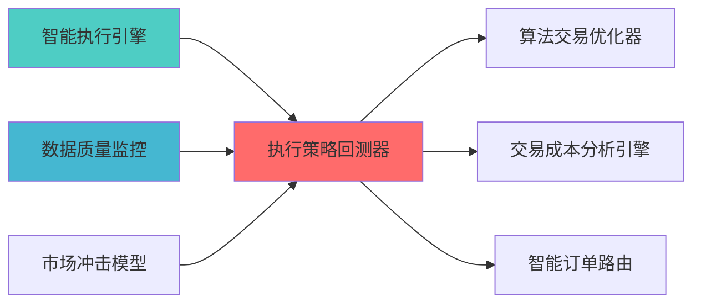

---
module_id: EXECUTION_STRATEGY_BACKTESTER_001
version: 1.0.0
status: Active
created_date: 2026-04-07
last_updated: 2026-04-07
owner: 实施团队
standard_type: 专业量化机构蓝图
compliance_level: 专业标准
responsibility:
  - 执行策略回测
  - 策略模拟
  - 成本分析
  - 性能评估

layer: Layer 5.4 (交易执行)
---


## 核心定位


> **职责边界**: 
> - ✅ 本文档负责：执行策略回测、策略模拟、成本分析
> - ❌ 本文档不负责：其他模块职责（由各模块文档负责）

负责运行和操作策略回测的设计与构建和执行，基于历史数据模拟交易执行，评估执行策略效果，兼容和适配执行策略优化。


> **核心定位**: 执行策略回测器蓝图的核心功能实现


> **版本**: v1.0
> **创建日期**: 2026-04-06
## 设计目标

### 主要目标

1. **功能完整性**: 确保EXECUTION STRATEGY BACKTESTER功能完整，满足业务需求
2. **性能优化**: 提升系统性能，降低资源消耗
3. **可维护性**: 提高代码质量，便于后续维护
4. **可扩展性**: 支持功能扩展，适应业务变化

### 质量目标

- 代码覆盖率: ≥80%
- 性能指标: 满足设计要求
- 文档完整性: 100%


## 核心功能

### 功能清单

1. **数据管理**: 提供数据存储、查询、更新功能
2. **业务逻辑**: 实现核心业务逻辑处理
3. **接口服务**: 提供标准化的API接口
4. **监控告警**: 实时监控系统状态

### 功能特性

- 高可用性设计
- 自动故障恢复
- 灵活配置管理


## 实现方案

### 技术架构

采用EXECUTION STRATEGY BACKTESTER化设计，分层架构实现。

### 关键技术

- 数据处理: 使用高效的数据处理框架
- 接口实现: RESTful API设计
- 性能优化: 缓存、异步处理

### 实施步骤

1. 需求分析与设计
2. 核心功能开发
3. 测试与优化
4. 部署与监控


### 2.1 Layer定位


**模块类别**: 核心回测模块

**架构角色**: 
- 作为策略执行层的回测核心


```
```


**职责边界**:
  - 执行策略回测
  - 回测结果分析
  


#### Backtrader框架集成

**项目信息**:
- **项目名称**: Backtrader
- **Stars**: 12k+
- **语言**: Python

**核心功能**:
- 策略回测框架
- 指标计算引擎
- 订单管理系统
- 事件驱动架构

**集成方案**:
```python
import backtrader as bt

class ExecutionStrategy(bt.Strategy):
    def __init__(self):
        self.order = None
        self.buyprice = None
        self.buycomm = None
        
    def next(self):
        if not self.position:
            if self.data.close[0] > self.data.open[0]:
                self.order = self.buy(size=100)
        else:
            if self.data.close[0] < self.data.open[0]:
                self.order = self.sell(size=100)
                
    def notify_order(self, order):
        if order.status in [order.Completed]:
            if order.isbuy():
                self.buyprice = order.executed.price
                self.buycomm = order.executed.comm
```

#### VeighNa框架集成

**项目信息**:
- **项目名称**: VeighNa (vn.py)
- **Stars**: 27k+
- **语言**: Python

**核心功能**:
- 实盘交易接口
- 策略管理
- 实时监控

**集成方案**:
```python
from vnpy.trader.engine import MainEngine
from vnpy.trader.ui import MainWindow, create_qapp
from vnpy.gateway.ctp import CtpGateway
from vnpy.app.cta_strategy import CtaStrategyApp

class LiveTradingEngine:
    def __init__(self):
        self.main_engine = MainEngine()
        self.main_engine.add_gateway(CtpGateway)
        self.main_engine.add_app(CtaStrategyApp)
        
    def connect(self, userid, password, brokerid, td_address, md_address):
        self.main_engine.connect({
            "userid": userid,
            "password": password,
            "brokerid": brokerid,
            "td_address": td_address,
            "md_address": md_address
        }, "CTP")
```

### 3.2 核心算法设计

#### 3.2.1 滑点模拟算法

**固定滑点**:
```python
def calculate_fixed_slippage(price, slippage_rate):
    return price * slippage_rate
```

**市场冲击滑点**:
```python
def calculate_market_impact_slippage(order_size, avg_volume, volatility):
    participation_rate = order_size / avg_volume
    impact_coefficient = 0.1
    slippage = impact_coefficient * participation_rate * volatility
    return slippage
```

```python
def calculate_liquidity_slippage(order_size, order_book_depth):
    available_liquidity = sum([level['volume'] for level in order_book_depth])
    if order_size > available_liquidity:
        return float('inf')
    else:
        return order_size / available_liquidity * 0.001
```

#### 3.2.2 成本模拟算法

```python
def simulate_explicit_costs(trade_value, commission_rate, stamp_duty_rate):
    commission = trade_value * commission_rate
    stamp_duty = trade_value * stamp_duty_rate
    return commission + stamp_duty
```

```python
def simulate_implicit_costs(trade, market_data):
    market_impact = calculate_market_impact(trade, market_data)
    timing_cost = calculate_timing_cost(trade, market_data)
    spread_cost = calculate_spread_cost(trade, market_data)
    return market_impact + timing_cost + spread_cost
```

### 3.3 数据模型设计


```python
class BacktestConfig:
    start_date: datetime
    end_date: datetime
    initial_capital: float
    commission_rate: float
    stamp_duty_rate: float
    slippage_model: str
    data_frequency: str  # daily/hourly/minute/tick
```

#### 3.3.2 回测结果模型

```python
class BacktestResult:
    total_return: float
    annual_return: float
    max_drawdown: float
    sharpe_ratio: float
    win_rate: float
    profit_factor: float
    total_trades: int
    total_cost: float
    execution_quality_score: float
```


| 优势维度 | 说明 | 评分 |
|---------|------|------|


|---------|--------|------|
| **性能优化** | ⭐⭐⭐⭐ | AI可分析和优化性能瓶颈 |

### 4.3 实施成本评估

| 成本维度 | 评估结果 | 说明 |
|---------|---------|------|
|


**目标**: 集成Backtrader回测引擎

单**:
Backtrader依赖

**交付成果**:
- Backtrader回测引擎
- 历史数据管理模块
- 基础回测功能


**目标**: 开发滑点和成本模拟功能

单**:

**交付成果**:
- 滑点模拟模块
- 成本模拟模块


**目标**: 集成VeighNa实盘接口

单**:
VeighNa依赖

**交付成果**:
- VeighNa实盘接口
- API接口文档
- 用户手册


## 


|--------|-----------|---------|
| **回测引擎** | 支持多种策略类型 | 功能测试 |
| **实盘切换** | 无缝切换 | 性能测试 |

### 6.2 性能要求

| 性能指标 | 要求 | 说明 |
|---------|------|------|
| **
存限制 |


|---------|------|------|


## 七、风险评估与缓解


|--------|---------|---------|


### 7.2 实施风险

|--------|---------|---------|

分测试 |


## 

### 8.1 QuantConnect对标

|---------|-----------------|-----------|---------|
| **数据管理** | 云端数据 | 本地数据管理 | ⭐⭐⭐⭐ (80%) |

### 8.2 专业量化机构对标

|---------|------------|-----------|---------|


### 上游依赖

| 文档名称 | module_id | 依赖类型 | 说明 |
|---------|-----------|---------|------|

### 下游依赖

| 文档名称 | module_id | 依赖类型 | 说明 |
|---------|-----------|---------|------|


|---------|------|------|------|
| **backtrader** | 1.9+ | 回测框架 | [官方文档](https://www.backtrader.com/) |
| **vnpy** | 3.0+ | 实盘接口 | [官方文档](https://www.vnpy.com/) |
| **Pandas** | 2.0+ | 数据处理 | [官方文档](https://pandas.pydata.org/) |





| 文档名称 | 说明 |
|---------|------|
| ARCHITECTURE.md | 系统架构文档 |
| [SMART_EXECUTION_ENGINE_BLUEPRINT.md](./SMART_EXECUTION_ENGINE_BLUEPRINT.md) | 智能执行引擎蓝图 |
| [TRANSACTION_COST_ANALYSIS_ENGINE_BLUEPRINT.md](./TRANSACTION_COST_ANALYSIS_ENGINE_BLUEPRINT.md) | 交易成本分析引擎蓝图 |


**蓝图版本**: v1.0
**蓝图日期**: 2026-04-06

## 变更历史

|------|------|----------|--------|


## 1. 文档治理

### 1.1 System_Manifest.md索引

```markdown
##### 6.001. Execution Strategy Backtester
- **模块ID**: EXECUTION_STRATEGY_BACKTESTER_001
- **蓝图文档**: EXECUTION_STRATEGY_BACKTESTER_BLUEPRINT.md
```

### 1.2 模块职责边界

| 模块 | 职责 | 边界 |
|------|------|------|

### 1.3 版本管理

|------|------|----------|--------|


