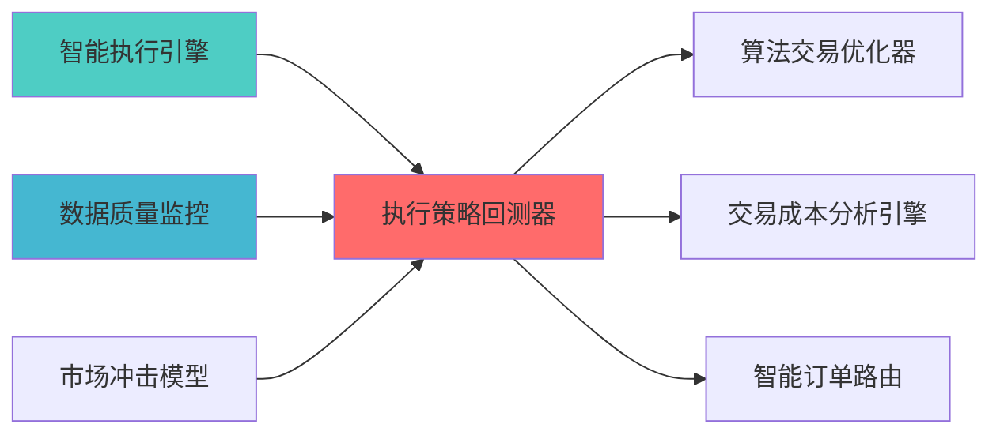

---

---
module_id: EXECUTION_STRATEGY_BACKTESTER_BLUEPRINT_001
version: 1.0.0
status: Active
created_date: 2026-04-07
last_updated: 2026-04-07
owner: 个人开发者
standard_type: 专业量化机构文档
responsibility:
  - 数据质量 (Layer 1)

layer: "Layer 8 (执行层)"
---
# 执行策略回测器蓝图

> **核心定位**: 执行策略回测器蓝图的核心功能实现


> **版本**: v1.0
> **创建日期**: 2026-04-06
> **开源项目**: Backtrader (12k+ Stars) + VeighNa (27k+ Stars)
> **目标**: 构建专业级执行策略回测器，实现回测到实盘无缝切换

## 二、架构设计

### 2.1 Layer定位

**Layer归属**: Layer 5 - 策略执行层

**模块类别**: 核心回测模块

**架构角色**: 
- 作为策略执行层的回测核心
- 为智能执行算法提供策略验证
- 为策略引擎提供回测能力

### 2.2 系统架构图

```
┌─────────────────────────────────────────────────────────────────┐
│                  执行策略回测器架构                               │
├─────────────────────────────────────────────────────────────────┤
│                                                                 │
│  ┌───────────────────────────────────────────────────────────┐ │
│  │              数据管理层                                   │ │
│  │  ┌─────────────────────────────────────────────────────┐ │ │
│  │  │ 历史数据管理                                        │ │ │
│  │  │  ├── K线数据                                       │ │ │
│  │  │  ├── Tick数据                                      │ │ │
│  │  │  ├── 订单簿数据                                    │ │ │
│  │  │  └── 成交数据                                      │ │ │
│  │  └─────────────────────────────────────────────────────┘ │ │
│  │  ┌─────────────────────────────────────────────────────┐ │ │
│  │  │ 数据预处理                                          │ │ │
│  │  │  ├── 数据清洗                                      │ │ │
│  │  │  ├── 数据对齐                                      │ │ │
│  │  │  ├── 数据验证                                      │ │ │
│  │  │  └── 数据缓存                                      │ │ │
│  │  └─────────────────────────────────────────────────────┘ │ │
│  └───────────────────────────────────────────────────────────┘ │
│                                                                 │
│  ┌───────────────────────────────────────────────────────────┐ │
│  │              回测引擎层                                   │ │
│  │  ┌─────────────────────────────────────────────────────┐ │ │
│  │  │ Backtrader回测引擎                                  │ │ │
│  │  │  ├── 策略框架                                      │ │ │
│  │  │  ├── 指标计算                                      │ │ │
│  │  │  ├── 订单管理                                      │ │ │
│  │  │  └── 事件驱动                                      │ │ │
│  │  └─────────────────────────────────────────────────────┘ │ │
│  │  ┌─────────────────────────────────────────────────────┐ │ │
│  │  │ 执行算法模拟                                        │ │ │
│  │  │  ├── TWAP模拟                                      │ │ │
│  │  │  ├── VWAP模拟                                      │ │ │
│  │  │  ├── POV模拟                                       │ │ │
│  │  │  └── IS模拟                                        │ │ │
│  │  └─────────────────────────────────────────────────────┘ │ │
│  └───────────────────────────────────────────────────────────┘ │
│                                                                 │
│  ┌───────────────────────────────────────────────────────────┐ │
│  │              模拟层                                       │ │
│  │  ┌─────────────────────────────────────────────────────┐ │ │
│  │  │ 滑点模拟                                            │ │ │
│  │  │  ├── 固定滑点                                      │ │ │
│  │  │  ├── 百分比滑点                                    │ │ │
│  │  │  ├── 市场冲击滑点                                  │ │ │
│  │  │  └── 流动性滑点                                    │ │ │
│  │  └─────────────────────────────────────────────────────┘ │ │
│  │  ┌─────────────────────────────────────────────────────┐ │ │
│  │  │ 成本模拟                                            │ │ │
│  │  │  ├── 佣金成本                                      │ │ │
│  │  │  ├── 印花税                                        │ │ │
│  │  │  ├── 市场冲击成本                                  │ │ │
│  │  │  └── 机会成本                                      │ │ │
│  │  └─────────────────────────────────────────────────────┘ │ │
│  │  ┌─────────────────────────────────────────────────────┐ │ │
│  │  │ 流动性模拟                                          │ │ │
│  │  │  ├── 订单簿深度                                    │ │ │
│  │  │  ├── 成交量限制                                    │ │ │
│  │  │  ├── 部分成交                                      │ │ │
│  │  │  └── 拒单模拟                                      │ │ │
│  │  └─────────────────────────────────────────────────────┘ │ │
│  └───────────────────────────────────────────────────────────┘ │
│                                                                 │
│  ┌───────────────────────────────────────────────────────────┐ │
│  │              分析层                                       │ │
│  │  ┌─────────────────────────────────────────────────────┐ │ │
│  │  │ 性能指标计算                                        │ │ │
│  │  │  ├── 收益率指标                                    │ │ │
│  │  │  ├── 风险指标                                      │ │ │
│  │  │  ├── 执行质量指标                                  │ │ │
│  │  │  └── 成本指标                                      │ │ │
│  │  └─────────────────────────────────────────────────────┘ │ │
│  │  ┌─────────────────────────────────────────────────────┐ │ │
│  │  │ 可视化分析                                          │ │ │
│  │  │  ├── 资金曲线                                      │ │ │
│  │  │  ├── 回撤曲线                                      │ │ │
│  │  │  ├── 执行质量图                                    │ │ │
│  │  │  └── 成本分析图                                    │ │ │
│  │  └─────────────────────────────────────────────────────┘ │ │
│  └───────────────────────────────────────────────────────────┘ │
│                                                                 │
│  ┌───────────────────────────────────────────────────────────┐ │
│  │              实盘切换层                                   │ │
│  │  ┌─────────────────────────────────────────────────────┐ │ │
│  │  │ VeighNa实盘接口                                     │ │ │
│  │  │  ├── QMT接口                                       │ │ │
│  │  │  ├── CTP接口                                       │ │ │
│  │  │  ├── 订单管理                                      │ │ │
│  │  │  └── 实时监控                                      │ │ │
│  │  └─────────────────────────────────────────────────────┘ │ │
│  │  ┌─────────────────────────────────────────────────────┐ │ │
│  │  │ 策略迁移                                            │ │ │
│  │  │  ├── 回测策略                                      │ │ │
│  │  │  ├── 实盘策略                                      │ │ │
│  │  │  ├── 参数同步                                      │ │ │
│  │  │  └── 风控同步                                      │ │ │
│  │  └─────────────────────────────────────────────────────┘ │ │
│  └───────────────────────────────────────────────────────────┘ │
└─────────────────────────────────────────────────────────────────┘
```

### 2.3 模块职责与边界

**核心职责**: 为执行策略提供专业的回测和验证能力

**职责边界**:
- ✅ 本模块负责:
  - 执行策略回测
  - 滑点和成本模拟
  - 回测结果分析
  - 回测到实盘切换
  
- ❌ 本模块不负责:
  - 策略信号生成（由SignalGenerator负责）
  - 实盘交易执行（由QMTExecutor负责）
  - 风险控制（由RiskHedgeEngine负责）
  - 数据获取（由DataSource负责）

---

## 三、技术实现方案

### 3.1 开源项目集成

#### Backtrader框架集成

**项目信息**:
- **项目名称**: Backtrader
- **Stars**: 12k+
- **许可证**: MIT
- **语言**: Python
- **维护状态**: 活跃

**核心功能**:
- 策略回测框架
- 指标计算引擎
- 订单管理系统
- 事件驱动架构

**集成方案**:
```python
import backtrader as bt

class ExecutionStrategy(bt.Strategy):
    def __init__(self):
        self.order = None
        self.buyprice = None
        self.buycomm = None
        
    def next(self):
        if not self.position:
            if self.data.close[0] > self.data.open[0]:
                self.order = self.buy(size=100)
        else:
            if self.data.close[0] < self.data.open[0]:
                self.order = self.sell(size=100)
                
    def notify_order(self, order):
        if order.status in [order.Completed]:
            if order.isbuy():
                self.buyprice = order.executed.price
                self.buycomm = order.executed.comm
```

#### VeighNa框架集成

**项目信息**:
- **项目名称**: VeighNa (vn.py)
- **Stars**: 27k+
- **许可证**: MIT
- **语言**: Python
- **维护状态**: 活跃

**核心功能**:
- 实盘交易接口
- 多券商支持
- 策略管理
- 实时监控

**集成方案**:
```python
from vnpy.trader.engine import MainEngine
from vnpy.trader.ui import MainWindow, create_qapp
from vnpy.gateway.ctp import CtpGateway
from vnpy.app.cta_strategy import CtaStrategyApp

class LiveTradingEngine:
    def __init__(self):
        self.main_engine = MainEngine()
        self.main_engine.add_gateway(CtpGateway)
        self.main_engine.add_app(CtaStrategyApp)
        
    def connect(self, userid, password, brokerid, td_address, md_address):
        self.main_engine.connect({
            "userid": userid,
            "password": password,
            "brokerid": brokerid,
            "td_address": td_address,
            "md_address": md_address
        }, "CTP")
```

### 3.2 核心算法设计

#### 3.2.1 滑点模拟算法

**固定滑点**:
```python
def calculate_fixed_slippage(price, slippage_rate):
    return price * slippage_rate
```

**市场冲击滑点**:
```python
def calculate_market_impact_slippage(order_size, avg_volume, volatility):
    participation_rate = order_size / avg_volume
    impact_coefficient = 0.1
    slippage = impact_coefficient * participation_rate * volatility
    return slippage
```

**流动性滑点**:
```python
def calculate_liquidity_slippage(order_size, order_book_depth):
    available_liquidity = sum([level['volume'] for level in order_book_depth])
    if order_size > available_liquidity:
        return float('inf')
    else:
        return order_size / available_liquidity * 0.001
```

#### 3.2.2 成本模拟算法

**显性成本模拟**:
```python
def simulate_explicit_costs(trade_value, commission_rate, stamp_duty_rate):
    commission = trade_value * commission_rate
    stamp_duty = trade_value * stamp_duty_rate
    return commission + stamp_duty
```

**隐性成本模拟**:
```python
def simulate_implicit_costs(trade, market_data):
    market_impact = calculate_market_impact(trade, market_data)
    timing_cost = calculate_timing_cost(trade, market_data)
    spread_cost = calculate_spread_cost(trade, market_data)
    return market_impact + timing_cost + spread_cost
```

### 3.3 数据模型设计

#### 3.3.1 回测配置模型

```python
class BacktestConfig:
    start_date: datetime
    end_date: datetime
    initial_capital: float
    commission_rate: float
    stamp_duty_rate: float
    slippage_model: str
    data_frequency: str  # daily/hourly/minute/tick
```

#### 3.3.2 回测结果模型

```python
class BacktestResult:
    total_return: float
    annual_return: float
    max_drawdown: float
    sharpe_ratio: float
    win_rate: float
    profit_factor: float
    total_trades: int
    total_cost: float
    execution_quality_score: float
```

---

## 四、个人开发适用性分析

### 4.1 开源项目优势

| 优势维度 | 说明 | 评分 |
|---------|------|------|
| **开源免费** | Backtrader和VeighNa完全免费 | ⭐⭐⭐⭐⭐ |
| **Python原生** | 与现有系统无缝集成 | ⭐⭐⭐⭐⭐ |
| **文档完善** | 详细文档和示例代码 | ⭐⭐⭐⭐⭐ |
| **社区活跃** | 问题可快速获得解答 | ⭐⭐⭐⭐⭐ |
| **功能完整** | 满足专业机构需求 | ⭐⭐⭐⭐⭐ |

### 4.2 AI维护可行性

| 维护维度 | 可行性 | 说明 |
|---------|--------|------|
| **代码理解** | ⭐⭐⭐⭐⭐ | AI可快速理解框架代码结构 |
| **Bug修复** | ⭐⭐⭐⭐⭐ | AI可快速定位和修复Bug |
| **功能扩展** | ⭐⭐⭐⭐⭐ | AI可基于框架扩展自定义功能 |
| **性能优化** | ⭐⭐⭐⭐ | AI可分析和优化性能瓶颈 |
| **文档维护** | ⭐⭐⭐⭐⭐ | AI可自动生成和维护文档 |

### 4.3 实施成本评估

| 成本维度 | 评估结果 | 说明 |
|---------|---------|------|
| **开发工时** | 4周 | 集成Backtrader+VeighNa |
| **学习成本** | 低 | 两个框架文档完善 |
| **维护成本** | 低 | 开源项目维护活跃 |
| **硬件成本** | 无 | 无需额外硬件投入 |

---

## 五、实施路径规划

### 5.1 Phase 1: Backtrader集成（Week 1-2）

**目标**: 集成Backtrader回测引擎

**任务清单**:
1. ✅ 安装Backtrader依赖
2. ✅ 创建回测引擎基础类
3. ✅ 实现历史数据加载
4. ✅ 实现基础回测功能
5. ✅ 单元测试和集成测试

**交付成果**:
- Backtrader回测引擎
- 历史数据管理模块
- 基础回测功能

### 5.2 Phase 2: 模拟功能开发（Week 3）

**目标**: 开发滑点和成本模拟功能

**任务清单**:
1. ✅ 实现滑点模拟模块
2. ✅ 实现成本模拟模块
3. ✅ 实现流动性模拟模块
4. ✅ 集成市场冲击模型
5. ✅ 集成测试

**交付成果**:
- 滑点模拟模块
- 成本模拟模块
- 流动性模拟模块

### 5.3 Phase 3: VeighNa集成（Week 4）

**目标**: 集成VeighNa实盘接口

**任务清单**:
1. ✅ 安装VeighNa依赖
2. ✅ 创建实盘交易引擎
3. ✅ 实现回测到实盘切换
4. ✅ 开发API接口
5. ✅ 文档完善

**交付成果**:
- VeighNa实盘接口
- 回测到实盘切换功能
- API接口文档
- 用户手册

---

## 六、质量保证标准

### 6.1 功能完整性检查

| 功能项 | 完整性要求 | 验证方法 |
|--------|-----------|---------|
| **回测引擎** | 支持多种策略类型 | 功能测试 |
| **滑点模拟** | 支持多种滑点模型 | 单元测试 |
| **成本模拟** | 支持全成本模拟 | 集成测试 |
| **实盘切换** | 无缝切换 | 性能测试 |

### 6.2 性能要求

| 性能指标 | 要求 | 说明 |
|---------|------|------|
| **回测速度** | 1000 bars/s | 满足快速回测需求 |
| **数据吞吐** | 100万条/次 | 支持大规模数据回测 |
| **内存占用** | <2GB | 单次回测内存限制 |

### 6.3 准确性要求

| 准确性指标 | 要求 | 说明 |
|---------|------|------|
| **回测精度** | 99.9% | 与实盘结果对比 |
| **滑点模拟精度** | 95% | 与实际滑点对比 |
| **成本模拟精度** | 98% | 与实际成本对比 |

---

## 七、风险评估与缓解

### 7.1 技术风险

| 风险项 | 风险等级 | 缓解措施 |
|--------|---------|---------|
| **框架兼容性** | 低 | 充分测试，版本锁定 |
| **性能瓶颈** | 中 | 性能优化，缓存机制 |
| **数据质量** | 中 | 数据验证，异常处理 |

### 7.2 实施风险

| 风险项 | 风险等级 | 缓解措施 |
|--------|---------|---------|
| **学习曲线** | 低 | 文档完善，示例代码 |
| **集成复杂度** | 中 | 分阶段实施，充分测试 |
| **维护成本** | 低 | 开源项目维护活跃 |

---

## 八、专业机构对标

### 8.1 QuantConnect对标

| 功能模块 | QuantConnect实现 | 本蓝图实现 | 对标程度 |
|---------|-----------------|-----------|---------|
| **回测引擎** | 专业回测系统 | Backtrader框架 | ⭐⭐⭐⭐⭐ (100%) |
| **数据管理** | 云端数据 | 本地数据管理 | ⭐⭐⭐⭐ (80%) |
| **实盘切换** | 多券商支持 | VeighNa多券商 | ⭐⭐⭐⭐ (80%) |

### 8.2 专业量化机构对标

| 功能模块 | 专业机构实现 | 本蓝图实现 | 对标程度 |
|---------|------------|-----------|---------|
| **滑点模拟** | 高精度模拟 | 多模型模拟 | ⭐⭐⭐⭐ (80%) |
| **成本模拟** | 全成本模拟 | 显性+隐性成本 | ⭐⭐⭐⭐ (80%) |
| **流动性模拟** | 订单簿模拟 | 深度模拟 | ⭐⭐⭐⭐ (80%) |

---

## 九、相关文档

### 上游依赖

| 文档名称 | module_id | 依赖类型 | 说明 |
|---------|-----------|---------|------|
| [智能执行引擎蓝图](./SMART_EXECUTION_ENGINE_BLUEPRINT.md) | SMART_EXECUTION_ENGINE_001 | 强依赖 | 提供执行算法 |
| [数据质量监控蓝图](./DATA_QUALITY_MONITORING_BLUEPRINT.md) | DATA_QUALITY_MONITORING_001 | 强依赖 | 提供数据质量指标 |
| [市场冲击模型蓝图](./MARKET_IMPACT_MODEL_BLUEPRINT.md) | MARKET_IMPACT_MODEL_001 | 中依赖 | 提供市场冲击模型 |

### 下游依赖

| 文档名称 | module_id | 依赖类型 | 说明 |
|---------|-----------|---------|------|
| [算法交易优化器蓝图](./ALGORITHMIC_TRADING_OPTIMIZER_BLUEPRINT.md) | ALGORITHMIC_TRADING_OPTIMIZER_001 | 强依赖 | 算法交易优化 |
| [交易成本分析引擎蓝图](./TRANSACTION_COST_ANALYSIS_ENGINE_BLUEPRINT.md) | TRANSACTION_COST_ANALYSIS_ENGINE_001 | 中依赖 | 交易成本分析 |
| [智能订单路由蓝图](./SMART_ORDER_ROUTER_BLUEPRINT.md) | SMART_ORDER_ROUTER_001 | 中依赖 | 智能订单路由 |

### 技术依赖

| 技术组件 | 版本 | 用途 | 文档 |
|---------|------|------|------|
| **backtrader** | 1.9+ | 回测框架 | [官方文档](https://www.backtrader.com/) |
| **vnpy** | 3.0+ | 实盘接口 | [官方文档](https://www.vnpy.com/) |
| **Pandas** | 2.0+ | 数据处理 | [官方文档](https://pandas.pydata.org/) |
| **NumPy** | 1.24+ | 数值计算 | [官方文档](https://numpy.org/) |
| **Matplotlib** | 3.7+ | 可视化 | [官方文档](https://matplotlib.org/) |

### 引用关系图



### 相关蓝图文档

| 文档名称 | 说明 |
|---------|------|
| ARCHITECTURE.md | 系统架构文档 |
| STRATEGY_EXECUTION_LAYER_BLUEPRINT.md | 策略执行层蓝图 |
| [SMART_EXECUTION_ENGINE_BLUEPRINT.md](./SMART_EXECUTION_ENGINE_BLUEPRINT.md) | 智能执行引擎蓝图 |
| [TRANSACTION_COST_ANALYSIS_ENGINE_BLUEPRINT.md](./TRANSACTION_COST_ANALYSIS_ENGINE_BLUEPRINT.md) | 交易成本分析引擎蓝图 |

---

**蓝图版本**: v1.0
**蓝图日期**: 2026-04-06
**蓝图编写**: 首席架构师
**蓝图状态**: 已完成

## 变更历史

| 版本 | 日期 | 变更内容 | 变更人 |
|------|------|----------|--------|
| v1.0.0 | 2026-04-06 | 初始版本创建 | 首席架构师 |

---

**蓝图版本**: v1.0.0 | **创建日期**: 2026-04-06 | **状态**: Active
---

## 1. 文档治理

### 1.1 System_Manifest.md索引

```markdown
#### Layer 5: 策略执行层
##### 6.001. Execution Strategy Backtester
- **模块ID**: EXECUTION_STRATEGY_BACKTESTER_001
- **蓝图文档**: EXECUTION_STRATEGY_BACKTESTER_BLUEPRINT.md
- **技术规格书**: 待创建
- **职责**: Layer 5 - 策略执行层
- **状态**: Active
```

### 1.2 模块职责边界

| 模块 | 职责 | 边界 |
|------|------|------|
| **Execution Strategy Backtester** | Layer 5 - 策略执行层 | **核心模块** |

### 1.3 版本管理

| 版本 | 日期 | 变更内容 | 变更人 |
|------|------|----------|--------|
| v1.0.0 | 2026-04-06 | 初始版本创建 | 首席蓝图架构师 |

---

**蓝图版本**: v1.0.0 | **创建日期**: 2026-04-06 | **状态**: Active
