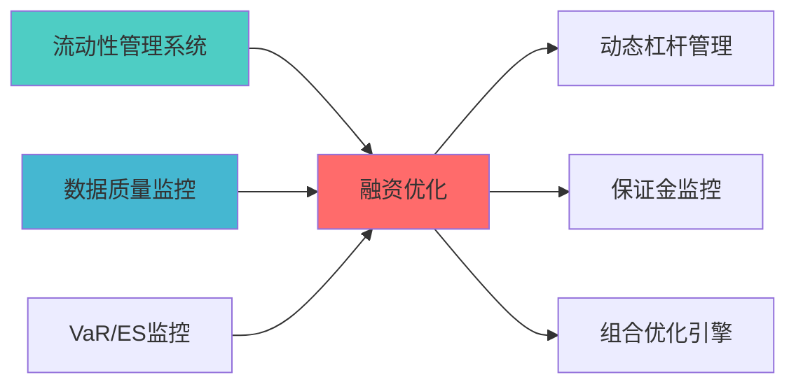

# 概述

> **索引**: `FINANCING_OPTIMIZATION_001`
> **开发时?*: 40h
> **核心定位**: 融资成本优化、杠杆效率提?
## 📚 相关文档

### 上游依赖

| 文档名称 | module_id | 依赖类型 | 说明 |
|---------|-----------|---------|------|
| [流动性管理系统蓝图](./LIQUIDITY_MANAGEMENT_SYSTEM_BLUEPRINT.md) | LIQUIDITY_MANAGEMENT_SYSTEM_001 | 强依赖 | 提供流动性数据 |
| [数据质量监控蓝图](./DATA_QUALITY_MONITORING_BLUEPRINT.md) | DATA_QUALITY_MONITORING_001 | 强依赖 | 提供数据质量指标 |
| [VaR/ES监控蓝图](./VAR_ES_MONITORING_BLUEPRINT.md) | VAR_ES_MONITORING_001 | 中依赖 | 提供风险指标 |

### 下游依赖

| 文档名称 | module_id | 依赖类型 | 说明 |
|---------|-----------|---------|------|
| [动态杠杆管理蓝图](./DYNAMIC_LEVERAGE_MANAGEMENT_BLUEPRINT.md) | DYNAMIC_LEVERAGE_MANAGEMENT_001 | 强依赖 | 杠杆管理 |
| [保证金监控蓝图](./MARGIN_CALL_MONITOR_BLUEPRINT.md) | MARGIN_CALL_MONITOR_001 | 中依赖 | 保证金监控 |
| [组合优化引擎集成蓝图](./PORTFOLIO_OPTIMIZER_INTEGRATION_BLUEPRINT.md) | PORTFOLIO_OPTIMIZER_INTEGRATION_001 | 中依赖 | 组合优化 |

### 技术依赖

| 技术组件 | 版本 | 用途 | 文档 |
|---------|------|------|------|
| **NumPy** | 1.24+ | 数值计算 | [官方文档](https://numpy.org/) |
| **Pandas** | 2.0+ | 数据处理 | [官方文档](https://pandas.pydata.org/) |
| **SciPy** | 1.10+ | 科学计算 | [官方文档](https://scipy.org/) |

### 引用关系图



---

## 2. 融资策略

### 2.1 融资渠道

- **券商融资**: 便捷但成本较?- **银行融资**: 成本较低但审批复?- **回购协议**: 灵活性高

### 2.2 成本优化

- **利率比较**: 选择最优融资渠?- **期限匹配**: 资产期限与融资期限匹?
---

## 3. 核心算法

```python
def optimize_financing(capital_needed: float,
                       financing_options: Dict[str, float],
                       risk_limits: Dict[str, float]) -> Dict[str, float]:
    """
    融资优化
    
    Args:
        capital_needed: 所需资金
        financing_options: 融资选项 {渠道: 成本}
        risk_limits: 风险限制 {渠道: 限制}
        
    Returns:
        Dict[str, float]: 最优融资组?    """
    optimal_mix = {}
    for channel, cost in financing_options.items():
        if cost < min(financing_options.values()):
            optimal_mix[channel] = capital_needed
        else:
            optimal_mix[channel] = risk_limits[channel]
    
    return optimal_mix
```

---

**蓝图版本**: v1.0 | **创建日期**: 2026-04-03 | **状?*: Draft | **下一?*: 技术规格书编写

## 变更历史

| 版本 | 日期 | 变更内容 | 变更人 |
|------|------|----------|--------|
| v1.0.0 | 2026-04-03 | 初始版本创建 | 组合优化层负责人 |
| v1.0.1 | 2026-04-06 | 补充YAML头部字段和变更历史 | 审计系统 |

---

**蓝图版本**: v1.0.1 | **创建日期**: 2026-04-03 | **状态**: Active
---

## 4. 文档治理

### 4.1 System_Manifest.md索引

```markdown
#### Layer 6: 组合优化层
##### 6.001. Financing Optimization
- **模块ID**: FINANCING_OPTIMIZATION_001
- **蓝图文档**: FINANCING_OPTIMIZATION_BLUEPRINT.md
- **技术规格书**: 待创建
- **职责**: 全系统
- **状态**: Active
```

### 4.2 模块职责边界

| 模块 | 职责 | 边界 |
|------|------|------|
| **Financing Optimization** | 全系统 | **核心模块** |

### 4.3 版本管理

| 版本 | 日期 | 变更内容 | 变更人 |
|------|------|----------|--------|
| v1.0.0 | 2026-04-03 | 初始版本创建 | 首席蓝图架构师 |

---

**蓝图版本**: v1.0.0 | **创建日期**: 2026-04-03 | **状态**: Active
