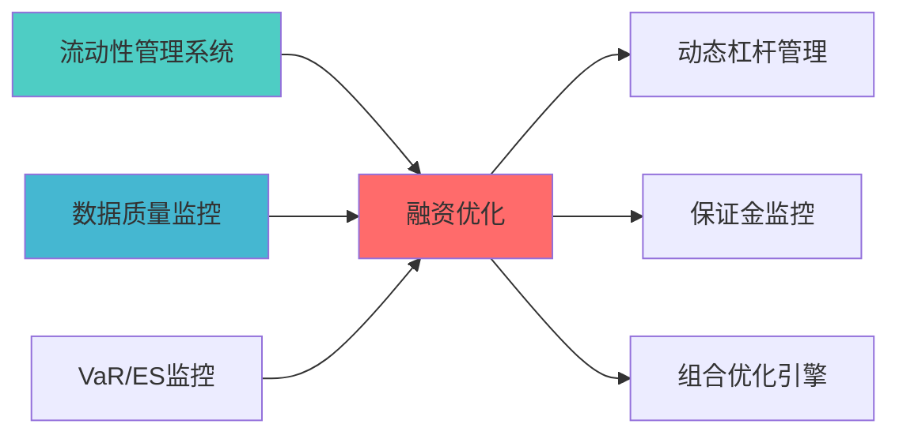

---
module_id: FINANCING_OPTIMIZATION_001
version: 1.0.0
status: Active
created_date: 2026-04-07
last_updated: 2026-04-07
owner: 实施团队
standard_type: 专业量化机构蓝图
applicable_scope: Layer 6 组合优化å±?
compliance_level: 专业标准
responsibility:
  - 融资优化
  - 融资成本优化
  - 杠杆效率提升
  - 融资策略
layer: Layer 5 (策略执行层)
---


## 核心定位

负责融资优化的设计与实现，优化融资成本和融资结构，提供融资决策支持，支持资金管理。

# 融资优化蓝图

> **核心职责**: 融资优化，融资成本优化和杠杆效率提升
> **职责边界**: 
> - âœ?本文档负责：融资优化、融资成本优化、杠杆效率提升、融资策ç•?
> - â...


## 设计目标

### 主要目标

1. **功能完整性**: 确保FINANCING OPTIMIZATION功能完整，满足业务需求
2. **性能优化**: 提升系统性能，降低资源消耗
3. **可维护性**: 提高代码质量，便于后续维护
4. **可扩展性**: 支持功能扩展，适应业务变化

### 质量目标

- 代码覆盖率: ≥80%
- 性能指标: 满足设计要求
- 文档完整性: 100%


## 核心功能

### 功能清单

1. **数据管理**: 提供数据存储、查询、更新功能
2. **业务逻辑**: 实现核心业务逻辑处理
3. **接口服务**: 提供标准化的API接口
4. **监控告警**: 实时监控系统状态

### 功能特性

- 高可用性设计
- 自动故障恢复
- 灵活配置管理


## 实现方案

### 技术架构

采用FINANCING OPTIMIZATION化设计，分层架构实现。

### 关键技术

- 数据处理: 使用高效的数据处理框架
- 接口实现: RESTful API设计
- 性能优化: 缓存、异步处理

### 实施步骤

1. 需求分析与设计
2. 核心功能开发
3. 测试与优化
4. 部署与监控


## 核心定位

实现FINANCING OPTIMIZATION的设计与实现，基于因子投资技术，评估核心功能，提升收益风险比ã€?

## 📚 相å
³æ–‡æ¡£

### 上游依赖

| 文档名称 | module_id | 依赖类型 | 说明 |
|---------|-----------|---------|------|
| [流动性管理系统蓝图](./LIQUIDITY_MANAGEMENT_SYSTEM_BLUEPRINT.md) | LIQUIDITY_MANAGEMENT_SYSTEM_001 | 强依èµ?| 提供流动性数æ?|
| [数据质量监控蓝图](./DATA_QUALITY_MONITORING_BLUEPRINT.md) | DATA_QUALITY_MONITORING_001 | 强依èµ?| 提供数据质量指标 |
| [VaR/ES监控蓝图](./VAR_ES_MONITORING_BLUEPRINT.md) | VAR_ES_MONITORING_001 | 中依èµ?| 提供风险指标 |

### 下游依赖

| 文档名称 | module_id | 依赖类型 | 说明 |
|---------|-----------|---------|------|
| [动态杠杆管理蓝图](./DYNAMIC_LEVERAGE_MANAGEMENT_BLUEPRINT.md) | DYNAMIC_LEVERAGE_MANAGEMENT_001 | 强依èµ?| 杠杆管理 |
| [保证金监控蓝图](./MARGIN_CALL_MONITOR_BLUEPRINT.md) | MARGIN_CALL_MONITOR_001 | 中依èµ?| 保证金监æŽ?|
| [组合优化引擎集成蓝图](./PORTFOLIO_OPTIMIZER_INTEGRATION_BLUEPRINT.md) | PORTFOLIO_OPTIMIZER_INTEGRATION_001 | 中依èµ?| 组合优化 |

### 技术依èµ?

| 技术组ä»?| 版本 | 用é€?| 文档 |
|---------|------|------|------|
| **NumPy** | 1.24+ | 数值计ç®?| [官方文档](https://numpy.org/) |
| **Pandas** | 2.0+ | 数据处理 | [官方文档](https://pandas.pydata.org/) |
| **SciPy** | 1.10+ | 科学计算 | [官方文档](https://scipy.org/) |

### 引用å
³ç³»å›?



---

## 2. 融资策略

### 2.1 融资渠道

- **券商融资**: 便捷但成本较?- **银行融资**: 成本较低但审批复?- **回购协议**: 灵活性高

### 2.2 成本优化

- **利率比较**: 选择最优融资渠?- **期限匹é
**: 资产期限与融资期限匹?
---

## 3. 核心算法

```python
def optimize_financing(capital_needed: float,
                       financing_options: Dict[str, float],
                       risk_limits: Dict[str, float]) -> Dict[str, float]:
    """
    融资优化
    
    Args:
        capital_needed: 所需资金
        financing_options: 融资选项 {渠道: 成本}
        risk_limits: 风险限制 {渠道: 限制}
        
    Returns:
        Dict[str, float]: 最优融资组?    """
    optimal_mix = {}
    for channel, cost in financing_options.items():
        if cost < min(financing_options.values()):
            optimal_mix[channel] = capital_needed
        else:
            optimal_mix[channel] = risk_limits[channel]
    
    return optimal_mix
```

---

**蓝图版本**: v1.0 | **创建日期**: 2026-04-03 | **çŠ?*: Draft | **下一?*: 技术规格书编写

## 变更历史

| 版本 | 日期 | 变更å†
容 | 变更äº?|
|------|------|----------|--------|
| v1.0.0 | 2026-04-03 | 初始版本创建 | 组合优化层负责人 |
| v1.0.1 | 2026-04-06 | è¡¥å

YAML头部字段和变更历å?| 审计系统 |

---

**蓝图版本**: v1.0.1 | **创建日期**: 2026-04-03 | **状æ€?*: Active
---

## 4. 文档治理

### 4.1 System_Manifest.md索引

```markdown
#### Layer 6: 组合优化å±?
##### 6.001. Financing Optimization
- **模块ID**: FINANCING_OPTIMIZATION_001
- **蓝图文档**: FINANCING_OPTIMIZATION_BLUEPRINT.md
- **技术规格书**: å¾
创å»?
- **职责**: å
¨ç³»ç»?
- **状æ€?*: Active
```

### 4.2 模块职责边界

| 模块 | 职责 | 边界 |
|------|------|------|
| **Financing Optimization** | å
¨ç³»ç»?| **核心模块** |

### 4.3 版本管理

| 版本 | 日期 | 变更å†
容 | 变更äº?|
|------|------|----------|--------|
| v1.0.0 | 2026-04-03 | 初始版本创建 | 首席蓝图架构å¸?|

---

**蓝图版本**: v1.0.0 | **创建日期**: 2026-04-03 | **状æ€?*: Active
