---
responsibility:
  - 层级风险预算
  - 风险预算分配
  - 风险层级管理
  - 风险预算优化

module_id: HIERARCHICAL_RISK_BUDGET_001
version: 1.0.0
status: Active
created_date: 2026-04-07
last_updated: 2026-04-07
owner: 实施团队
standard_type: 专业量化机构蓝图
applicable_scope: Layer 6 组合优化å±?
compliance_level: 专业标准
layer: Layer 5.2 (组合优化)
---

# 层级风险预算蓝图

> **核心职责**: 多层级风险预算分é…?
> **职责边界**: 
> - âœ?本文档负责：层级风险预算、多维度风险控制
> - â?本文档不负责：因子计算（由因子模块负责）


## 核心定位

负责Hierarchical Risk Budget的设计、实现和维护，提供核心功能支持，确保系统模块的稳定运行和高效执行ã€?

## 1. 概述

### 1.1 模块定位

**Layer定位**: Layer 6 - 组合优化层（风险预算模块ï¼?

**核心价å€?*:
- 支持多层级风险预算分配（资产类→策略→因子）
- 实现层级间的风险传导和汇æ€?
- 提供灵活的风险预算配ç½?

**业务价å€?*:
- 精细化风险管ç?
- 支持复杂组合结构
- 提升风险控制透明åº?

### 1.2 版本信息

| 项目 | 内容 |
|------|------|
| **模块ID** | HIERARCHICAL_RISK_BUDGET_001 |
| **版本** | v1.0.0 |
| **开源依èµ?* | Riskfolio-Lib, skfolio |
| **预计工时** | 5-7å¤?|

### 1.3 与其他风险预算模块的关系

本模块是风险预算体系中的**高级多层级模å?*，与其他模块形成层级关系ï¼?

| 模块 | 核心定位 | 适用场景 | 关系说明 |
|------|----------|----------|----------|
| **RISK_CONTRIBUTION_ANALYSIS** | 风险贡献分析 | 基础分析能力 | 本模块依赖其计算风险贡献 |
| **SIMPLIFIED_RISK_BUDGET_SYSTEM** | 简化风险预ç®?| 个人开发、快速实çŽ?| 本模块是其高级扩展版æœ?|
| **HIERARCHICAL_RISK_BUDGET** (本模å? | 层级风险预算 | 多层级复杂组å?| 支持资产类→策略→因子多层级 |

**推荐实施路径**:
1. 先实çŽ?RISK_CONTRIBUTION_ANALYSIS (2-3å¤? - 基础分析能力
2. 再实çŽ?SIMPLIFIED_RISK_BUDGET_SYSTEM (60h) - 简化版æœ?
3. 最后实çŽ?HIERARCHICAL_RISK_BUDGET (5-7å¤? - 高级多层çº?

---
## 📚 相关文档

### 上游依赖

| 文档名称 | module_id | 依赖类型 | 说明 |
|---------|-----------|---------|------|
| [风险贡献分析蓝图](./RISK_CONTRIBUTION_ANALYSIS_BLUEPRINT.md) | RISK_CONTRIBUTION_ANALYSIS_001 | 强依èµ?| 提供风险贡献计算 |
| [简化风险预算系统蓝图](./SIMPLIFIED_RISK_BUDGET_SYSTEM_BLUEPRINT.md) | SIMPLIFIED_RISK_BUDGET_SYSTEM_001 | 强依èµ?| 提供简化版本基础 |
| [组合优化引擎集成蓝图](./PORTFOLIO_OPTIMIZER_INTEGRATION_BLUEPRINT.md) | PORTFOLIO_OPTIMIZER_INTEGRATION_001 | 强依èµ?| 提供优化器基础接口 |

### 下游依赖

| 文档名称 | module_id | 依赖类型 | 说明 |
|---------|-----------|---------|------|
| [RISK_PARITY_STRATEGY_BLUEPRINT.md](./RISK_PARITY_STRATEGY_BLUEPRINT.md) | RISK_PARITY_STRATEGY_001 | 强依èµ?| 风险平价策略 |
| [STRATEGY_SELECTION_BLUEPRINT.md](./STRATEGY_SELECTION_BLUEPRINT.md) | STRATEGY_SELECTION_001 | 中依èµ?| 策略选择 |
| [PORTFOLIO_REBALANCING_BLUEPRINT.md](./PORTFOLIO_REBALANCING_BLUEPRINT.md) | PORTFOLIO_REBALANCING_001 | 中依èµ?| 组合再平è¡?|

### 技术依èµ?

| 技术组ä»?| 版本 | 用é€?| 文档 |
|---------|------|------|------|
| **Riskfolio-Lib** | 5.0+ | 风险优化 | [官方文档](https://riskfolio-lib.readthedocs.io/) |
| **skfolio** | 1.0+ | 组合学习 | [官方文档](https://skfolio.org/) |
| **NumPy** | 1.24+ | 数值计ç®?| [官方文档](https://numpy.org/) |
| **Pandas** | 2.0+ | 数据处理 | [官方文档](https://pandas.pydata.org/) |

### 引用关系å›?

```mermaid
graph LR
    A[风险贡献分析] --> B[层级风险预算]
    C[简化风险预算] --> B
    D[组合优化引擎] --> B
    
    B --> E[风险平价策略]
    B --> F[策略选择]
    B --> G[组合再平衡]
    
    style B fill:#ff6b6b
    style A fill:#4ecdc4
    style C fill:#45b7d1
```



---

## 2. 技术实çŽ?

### 2.1 核心API

```python
from dataclasses import dataclass
from typing import Dict, List
import numpy as np

@dataclass
class RiskBudgetLevel:
    """风险预算层级"""
    level_name: str
    budget: float
    children: List['RiskBudgetLevel']

class HierarchicalRiskBudgetManager:
    """层级风险预算管理å™?""
    
    def __init__(self, hierarchy: RiskBudgetLevel):
        self.hierarchy = hierarchy
        
    def allocate_risk_budget(
        self,
        total_risk_budget: float,
        cov_matrix: np.ndarray,
        level_mapping: Dict[str, List[int]]
    ) -> Dict[str, np.ndarray]:
        """
        分配层级风险预算
        
        Args:
            total_risk_budget: 总风险预ç®?
            cov_matrix: 协方差矩é˜?
            level_mapping: 层级到资产的映射
            
        Returns:
            各层级的权重分配
        """
        pass
    
    def aggregate_risk_contribution(
        self,
        weights: np.ndarray,
        cov_matrix: np.ndarray,
        level_mapping: Dict[str, List[int]]
    ) -> Dict[str, float]:
        """
        汇总各层级风险贡献
        
        Returns:
            各层级的风险贡献
        """
        pass
```

---

## 3. 接口定义

```python
class HierarchicalRiskBudgetAPI:
    """层级风险预算API"""
    
    @endpoint("/api/v1/hierarchical_risk_budget/allocate")
    async def allocate(
        self,
        hierarchy: RiskBudgetLevel,
        cov_matrix: List[List[float]]
    ) -> AllocationResult:
        """分配层级风险预算"""
        
    @endpoint("/api/v1/hierarchical_risk_budget/aggregate")
    async def aggregate(
        self,
        weights: List[float],
        cov_matrix: List[List[float]],
        level_mapping: Dict[str, List[int]]
    ) -> AggregationResult:
        """汇总风险贡çŒ?""
```

---

## 4. 实施路径

| 阶段 | 任务 | 工时 |
|------|------|------|
| Phase 1 | 层级结构设计 | 12h |
| Phase 2 | 预算分配算法实现 | 16h |
| Phase 3 | API、测试、文æ¡?| 12h |

---

**蓝图版本**: v1.0.0 | **创建日期**: 2026-04-06 | **状æ€?*: Active | **合规çŽ?*: 100% âœ?

## 变更历史

| 版本 | 日期 | 变更内容 | 变更äº?|
|------|------|----------|--------|
| v1.0.0 | 2026-04-06 | 初始版本创建 | 首席蓝图架构å¸?|
| v1.0.1 | 2026-04-06 | 补充YAML头部字段和变更历å?| 审计系统 |

---

**蓝图版本**: v1.0.1 | **创建日期**: 2026-04-06 | **状æ€?*: Active
---

## 5. 文档治理

### 5.1 System_Manifest.md索引

```markdown
#### Layer 6: 组合优化å±?
##### 6.001. Hierarchical Risk Budget
- **模块ID**: HIERARCHICAL_RISK_BUDGET_001
- **蓝图文档**: HIERARCHICAL_RISK_BUDGET_BLUEPRINT.md
- **技术规格书**: 待创å»?
- **职责**: Layer 6 组合优化å±?
- **状æ€?*: Active
```

### 5.2 模块职责边界

| 模块 | 职责 | 边界 |
|------|------|------|
| **Hierarchical Risk Budget** | Layer 6 组合优化å±?| **核心模块** |

### 5.3 版本管理

| 版本 | 日期 | 变更内容 | 变更äº?|
|------|------|----------|--------|
| v1.0.0 | 2026-04-06 | 初始版本创建 | 首席蓝图架构å¸?|

---

**蓝图版本**: v1.0.0 | **创建日期**: 2026-04-06 | **状æ€?*: Active
