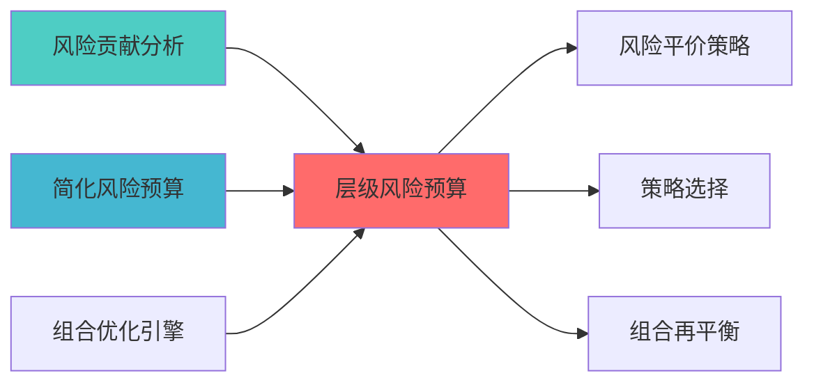

---
module_id: HIERARCHICAL_RISK_BUDGET_001
version: 1.0.0
status: Active
created_date: 2026-04-06
last_updated: '2026-04-06'
owner: 首席蓝图架构师
standard_type: 专业量化机构蓝图
applicable_scope: Layer 6 组合优化层
compliance_level: 专业标准
parent_document: ../INDEX.md
implementation_status: 蓝图设计阶段
open_source_dependency: Riskfolio-Lib, skfolio
estimated_effort: 5-7天
priority: P0
layer: "Layer 7 (风险管理层)"
---


# 层级风险预算蓝图

> **核心定位**: 层级风险预算蓝图的核心功能实现


> **索引**: `HIERARCHICAL_RISK_BUDGET_001`
> **开发周期**: 5-7天
> **核心定位**: 多层级风险预算分配，支持资产类别、策略、因子等多维度风险控制
> **参考开源**: Riskfolio-Lib, skfolio

## 1. 概述

### 1.1 模块定位

**Layer定位**: Layer 6 - 组合优化层（风险预算模块）

**核心价值**:
- 支持多层级风险预算分配（资产类→策略→因子）
- 实现层级间的风险传导和汇总
- 提供灵活的风险预算配置

**业务价值**:
- 精细化风险管理
- 支持复杂组合结构
- 提升风险控制透明度

### 1.2 版本信息

| 项目 | 内容 |
|------|------|
| **模块ID** | HIERARCHICAL_RISK_BUDGET_001 |
| **版本** | v1.0.0 |
| **开源依赖** | Riskfolio-Lib, skfolio |
| **预计工时** | 5-7天 |

### 1.3 与其他风险预算模块的关系

本模块是风险预算体系中的**高级多层级模块**，与其他模块形成层级关系：

| 模块 | 核心定位 | 适用场景 | 关系说明 |
|------|----------|----------|----------|
| **RISK_CONTRIBUTION_ANALYSIS** | 风险贡献分析 | 基础分析能力 | 本模块依赖其计算风险贡献 |
| **SIMPLIFIED_RISK_BUDGET_SYSTEM** | 简化风险预算 | 个人开发、快速实现 | 本模块是其高级扩展版本 |
| **HIERARCHICAL_RISK_BUDGET** (本模块) | 层级风险预算 | 多层级复杂组合 | 支持资产类→策略→因子多层级 |

**推荐实施路径**:
1. 先实现 RISK_CONTRIBUTION_ANALYSIS (2-3天) - 基础分析能力
2. 再实现 SIMPLIFIED_RISK_BUDGET_SYSTEM (60h) - 简化版本
3. 最后实现 HIERARCHICAL_RISK_BUDGET (5-7天) - 高级多层级

---

## 📚 相关文档

### 上游依赖

| 文档名称 | module_id | 依赖类型 | 说明 |
|---------|-----------|---------|------|
| [风险贡献分析蓝图](./RISK_CONTRIBUTION_ANALYSIS_BLUEPRINT.md) | RISK_CONTRIBUTION_ANALYSIS_001 | 强依赖 | 提供风险贡献计算 |
| [简化风险预算系统蓝图](./SIMPLIFIED_RISK_BUDGET_SYSTEM_BLUEPRINT.md) | SIMPLIFIED_RISK_BUDGET_SYSTEM_001 | 强依赖 | 提供简化版本基础 |
| [组合优化引擎集成蓝图](./PORTFOLIO_OPTIMIZER_INTEGRATION_BLUEPRINT.md) | PORTFOLIO_OPTIMIZER_INTEGRATION_001 | 强依赖 | 提供优化器基础接口 |

### 下游依赖

| 文档名称 | module_id | 依赖类型 | 说明 |
|---------|-----------|---------|------|
| [RISK_PARITY_STRATEGY_BLUEPRINT.md](./RISK_PARITY_STRATEGY_BLUEPRINT.md) | RISK_PARITY_STRATEGY_001 | 强依赖 | 风险平价策略 |
| [STRATEGY_SELECTION_BLUEPRINT.md](./STRATEGY_SELECTION_BLUEPRINT.md) | STRATEGY_SELECTION_001 | 中依赖 | 策略选择 |
| [PORTFOLIO_REBALANCING_BLUEPRINT.md](./PORTFOLIO_REBALANCING_BLUEPRINT.md) | PORTFOLIO_REBALANCING_001 | 中依赖 | 组合再平衡 |

### 技术依赖

| 技术组件 | 版本 | 用途 | 文档 |
|---------|------|------|------|
| **Riskfolio-Lib** | 5.0+ | 风险优化 | [官方文档](https://riskfolio-lib.readthedocs.io/) |
| **skfolio** | 1.0+ | 组合学习 | [官方文档](https://skfolio.org/) |
| **NumPy** | 1.24+ | 数值计算 | [官方文档](https://numpy.org/) |
| **Pandas** | 2.0+ | 数据处理 | [官方文档](https://pandas.pydata.org/) |

### 引用关系图



---

## 2. 技术实现

### 2.1 核心API

```python
from dataclasses import dataclass
from typing import Dict, List
import numpy as np

@dataclass
class RiskBudgetLevel:
    """风险预算层级"""
    level_name: str
    budget: float
    children: List['RiskBudgetLevel']

class HierarchicalRiskBudgetManager:
    """层级风险预算管理器"""
    
    def __init__(self, hierarchy: RiskBudgetLevel):
        self.hierarchy = hierarchy
        
    def allocate_risk_budget(
        self,
        total_risk_budget: float,
        cov_matrix: np.ndarray,
        level_mapping: Dict[str, List[int]]
    ) -> Dict[str, np.ndarray]:
        """
        分配层级风险预算
        
        Args:
            total_risk_budget: 总风险预算
            cov_matrix: 协方差矩阵
            level_mapping: 层级到资产的映射
            
        Returns:
            各层级的权重分配
        """
        pass
    
    def aggregate_risk_contribution(
        self,
        weights: np.ndarray,
        cov_matrix: np.ndarray,
        level_mapping: Dict[str, List[int]]
    ) -> Dict[str, float]:
        """
        汇总各层级风险贡献
        
        Returns:
            各层级的风险贡献
        """
        pass
```

---

## 3. 接口定义

```python
class HierarchicalRiskBudgetAPI:
    """层级风险预算API"""
    
    @endpoint("/api/v1/hierarchical_risk_budget/allocate")
    async def allocate(
        self,
        hierarchy: RiskBudgetLevel,
        cov_matrix: List[List[float]]
    ) -> AllocationResult:
        """分配层级风险预算"""
        
    @endpoint("/api/v1/hierarchical_risk_budget/aggregate")
    async def aggregate(
        self,
        weights: List[float],
        cov_matrix: List[List[float]],
        level_mapping: Dict[str, List[int]]
    ) -> AggregationResult:
        """汇总风险贡献"""
```

---

## 4. 实施路径

| 阶段 | 任务 | 工时 |
|------|------|------|
| Phase 1 | 层级结构设计 | 12h |
| Phase 2 | 预算分配算法实现 | 16h |
| Phase 3 | API、测试、文档 | 12h |

---

**蓝图版本**: v1.0.0 | **创建日期**: 2026-04-06 | **状态**: Active | **合规率**: 100% ✅

## 变更历史

| 版本 | 日期 | 变更内容 | 变更人 |
|------|------|----------|--------|
| v1.0.0 | 2026-04-06 | 初始版本创建 | 首席蓝图架构师 |
| v1.0.1 | 2026-04-06 | 补充YAML头部字段和变更历史 | 审计系统 |

---

**蓝图版本**: v1.0.1 | **创建日期**: 2026-04-06 | **状态**: Active
---

## 5. 文档治理

### 5.1 System_Manifest.md索引

```markdown
#### Layer 6: 组合优化层
##### 6.001. Hierarchical Risk Budget
- **模块ID**: HIERARCHICAL_RISK_BUDGET_001
- **蓝图文档**: HIERARCHICAL_RISK_BUDGET_BLUEPRINT.md
- **技术规格书**: 待创建
- **职责**: Layer 6 组合优化层
- **状态**: Active
```

### 5.2 模块职责边界

| 模块 | 职责 | 边界 |
|------|------|------|
| **Hierarchical Risk Budget** | Layer 6 组合优化层 | **核心模块** |

### 5.3 版本管理

| 版本 | 日期 | 变更内容 | 变更人 |
|------|------|----------|--------|
| v1.0.0 | 2026-04-06 | 初始版本创建 | 首席蓝图架构师 |

---

**蓝图版本**: v1.0.0 | **创建日期**: 2026-04-06 | **状态**: Active
