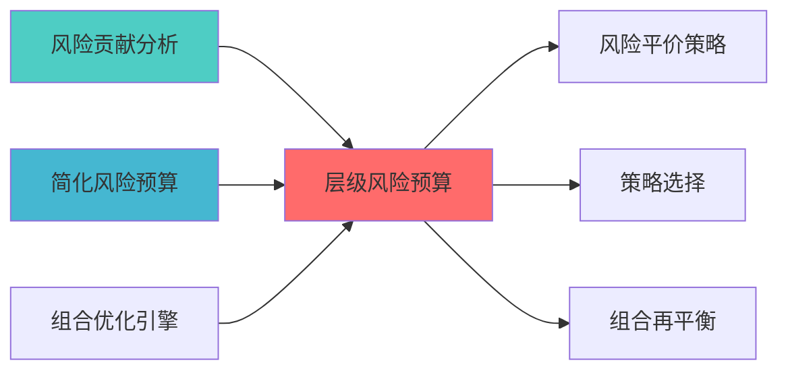

---
module_id: HIERARCHICAL_RISK_BUDGET_001
version: 1.0.0
status: Active
created_date: 2026-04-07
last_updated: 2026-04-07
owner: 实施团队
standard_type: 专业量化机构蓝图
applicable_scope: Layer 5.3 风险管理
compliance_level: 专业标准
responsibility:
  - 风险管理框架设计与实施方案与优化维护
layer: Layer 5.3 (风险管理)
---
# 层级风险预算蓝图

?
> **职责边界**: 


## 核心定位


层级风险预算系统，构建和运行和操作多层次的风险预算分配和协调和监控，兼容和适配从资产类别到具体证券的风险预算分解，确保风险在各个层级得到有效控制。
### 主要目标

1. **功能完整性**: 确保HIERARCHICAL RISK BUDGET功能完整，满足业务需求
2. **性能优化**: 提升系统性能，降低资源消耗
3. **可维护性**: 提高代码质量，便于后续维护
4. **可扩展性**: 支持功能扩展，适应业务变化

### 质量目标

- 代码覆盖率: ≥80%
- 性能指标: 满足设计要求
- 文档完整性: 100%


## 核心功能

### 功能清单

1. **数据管理**: 提供数据存储、查询、更新功能
2. **业务逻辑**: 实现核心业务逻辑处理
3. **接口服务**: 提供标准化的API接口
4. **监控告警**: 实时监控系统状态

### 功能特性

- 高可用性设计
- 自动故障恢复
- 灵活配置管理


## 实现方案

### 技术架构

采用HIERARCHICAL RISK BUDGET化设计，分层架构实现。

### 关键技术

- 数据处理: 使用高效的数据处理框架
- 接口实现: RESTful API设计
- 性能优化: 缓存、异步处理

### 实施步骤

1. 需求分析与设计
2. 核心功能开发
3. 测试与优化
4. 部署与监控


## 1. 概述

### 1.1 模块定位


- 支持复杂组合结构

### 1.2 版本信息

|------|------|
| **模块ID** | HIERARCHICAL_RISK_BUDGET_001 |
| **版本** | v1.0.0 |


|------|----------|----------|----------|

**推荐实施路径**:
1. å

---

### 上游依赖

| 文档名称 | module_id | 依赖类型 | 说明 |
|---------|-----------|---------|------|

### 下游依赖

| 文档名称 | module_id | 依赖类型 | 说明 |
|---------|-----------|---------|------|


|---------|------|------|------|
| **Riskfolio-Lib** | 5.0+ | 风险优化 | [官方文档](https://riskfolio-lib.readthedocs.io/) |
| **skfolio** | 1.0+ | 组合学习 | [官方文档](https://skfolio.org/) |
| **Pandas** | 2.0+ | 数据处理 | [官方文档](https://pandas.pydata.org/) |




---


### 2.1 核心API

```python
from dataclasses import dataclass
from typing import Dict, List
import numpy as np

@dataclass
class RiskBudgetLevel:
    """风险预算层级"""
    level_name: str
    budget: float
    children: List['RiskBudgetLevel']

class HierarchicalRiskBudgetManager:
    
    def __init__(self, hierarchy: RiskBudgetLevel):
        self.hierarchy = hierarchy
        
    def allocate_risk_budget(
        self,
        total_risk_budget: float,
        cov_matrix: np.ndarray,
        level_mapping: Dict[str, List[int]]
    ) -> Dict[str, np.ndarray]:
        """
        
        Args:
            level_mapping: 层级到资产的映射
            
        Returns:

        """
        pass
    
    def aggregate_risk_contribution(
        self,
        weights: np.ndarray,
        cov_matrix: np.ndarray,
        level_mapping: Dict[str, List[int]]
    ) -> Dict[str, float]:
        """
        汇总各层级风险贡献
        
        Returns:
            各层级的风险贡献
        """
        pass
```

---

## 3. 接口定义

```python
class HierarchicalRiskBudgetAPI:
    """层级风险预算API"""
    
    @endpoint("/api/v1/hierarchical_risk_budget/allocate")
    async def allocate(
        self,
        hierarchy: RiskBudgetLevel,
        cov_matrix: List[List[float]]
    ) -> AllocationResult:
        
    @endpoint("/api/v1/hierarchical_risk_budget/aggregate")
    async def aggregate(
        self,
        weights: List[float],
        cov_matrix: List[List[float]],
        level_mapping: Dict[str, List[int]]
    ) -> AggregationResult:
```

---

## 4. 实施路径

| 阶段 | 任务 | 工时 |
|------|------|------|
| Phase 1 | 层级结构设计 | 12h |

---


## 变更历史

|------|------|----------|--------|


---

---

## 5. 文档治理

### 5.1 System_Manifest.md索引

```markdown
##### 6.001. Hierarchical Risk Budget
- **模块ID**: HIERARCHICAL_RISK_BUDGET_001
- **蓝图文档**: HIERARCHICAL_RISK_BUDGET_BLUEPRINT.md
```

### 5.2 模块职责边界

| 模块 | 职责 | 边界 |
|------|------|------|

### 5.3 版本管理

|------|------|----------|--------|

---

