# 高性能数据管道蓝图

> **核心职责**: 高性能数据管道，数据处理优化和性能优化
> **职责边界**: 
> - âœ?本文档负责：高性能数据管道、数据处理优化、数据流管理、性能优化
> - â?本文档不负责：数据采集、数据存储、数据质量监æŽ?
ï»? 高性能数据管道蓝图

> **核心定位**: 高性能数据管道蓝图的核心功能实çŽ?


> **模块ID**: `HIGH_PERF_PIPELINE_001`
> **实施周期**: Week 38-40ï¼?周）
> **优先çº?*: P2（优化）
> **预期收益**: 提升数据处理性能10倍，降低延迟90%

## 核心定位

> 核心职责: High Performance Data Pipeline蓝图设计
> 职责边界: 
> - âœ?本文档负责：High Performance Data Pipeline蓝图设计相关内容
> - â?本文档不负责：其他模块内容，确保系统功能的稳定运行和高效执行ã€?


## 一、设计背景与目标

### 1.1 业务需æ±?

**当前痛点**:
- 数据处理速度æ…?
- 批处理延迟高
- 资源利用率低
- 扩展性差

**业务目标**:
- 建立高性能数据处理管道
- 支持实时和批处理混合
- 提升资源利用çŽ?
- 支持水平扩展

### 1.2 技术目æ ?

| 指标 | 目标å€?| 说明 |
|------|--------|------|
| **数据处理吞吐é‡?* | â‰?00万条/ç§?| 处理吞吐量≥100万条/ç§?|
| **端到端延è¿?* | <100ms | 端到端延è¿?100ms |
| **资源利用çŽ?* | â‰?0% | 资源利用率≥80% |
| **扩展æ€?* | 线性扩å±?| 支持线性水平扩å±?|

---
## 📚 相关文档

### 上游依赖

| 文档名称 | module_id | 依赖类型 | 说明 |
|---------|-----------|---------|------|
| [数据源管理蓝图](./DATA_SOURCE_MANAGEMENT_BLUEPRINT.md) | DATA_SOURCE_MANAGEMENT_001 | 强依èµ?| 提供数据源连æŽ?|
| [实时数据湖蓝图](./REALTIME_DATA_LAKE_BLUEPRINT.md) | REALTIME_DATA_LAKE_001 | 强依èµ?| 提供数据存储 |
| [数据网格蓝图](./DATA_MESH_BLUEPRINT.md) | DATA_MESH_001 | 中依èµ?| 提供分布式数据处ç?|

### 下游依赖

| 文档名称 | module_id | 依赖类型 | 说明 |
|---------|-----------|---------|------|
| [数据质量监控蓝图](./DATA_QUALITY_MONITORING_BLUEPRINT.md) | DATA_QUALITY_MONITORING_001 | 强依èµ?| 提供数据质量检查点 |
| 数据虚拟化蓝å›?| DATA_VIRTUALIZATION_001 | 强依èµ?| 提供数据虚拟化服åŠ?|
| [数据编织蓝图](./DATA_FABRIC_BLUEPRINT.md) | DATA_FABRIC_001 | 中依èµ?| 提供数据集成服务 |

### 技术依èµ?

| 技术组ä»?| 版本 | 用é€?| 文档 |
|---------|------|------|------|
| **Apache Spark** | 3.5+ | 大规模数据处ç?| [官方文档](https://spark.apache.org/) |
| **Apache Flink** | 1.19+ | 流式数据处理 | [官方文档](https://flink.apache.org/) |
| **Ray** | 2.10+ | 分布式计ç®?| [官方文档](https://www.ray.io/) |

### 引用关系å›?

```mermaid
graph LR
    A[数据源管理] --> D[高性能数据管道]
    B[实时数据湖] --> D
    C[数据网格] --> D
    
    D --> E[数据质量监控]
    D --> F[数据虚拟化]
    D --> G[数据编织]
    
    style D fill:#ff6b6b
    style A fill:#4ecdc4
    style B fill:#45b7d1
    style C fill:#96ceb4
```



---

## 二、系统架构设è®?

### 2.1 整体架构å›?

```
┌─────────────────────────────────────────────────────────────â”?
â”?               高性能数据管道架构                            â”?
├─────────────────────────────────────────────────────────────â”?
â”?                                                            â”?
â”? ┌─────────────────────────────────────────────────────â”?  â”?
â”? â”?          数据接入å±?(Data Ingestion)                â”?  â”?
â”? â”? ┌─────────────â”?┌─────────────â”?┌─────────────â”?  â”?  â”?
â”? â”? │Kafka        â”?│Kinesis      â”?│Pulsar       â”?  â”?  â”?
â”? â”? └─────────────â”?└─────────────â”?└─────────────â”?  â”?  â”?
â”? └─────────────────────────────────────────────────────â”?  â”?
�                         �                                 �
â”? ┌─────────────────────────────────────────────────────â”?  â”?
â”? â”?          流处理层 (Stream Processing)               â”?  â”?
â”? â”? ┌─────────────â”?┌─────────────â”?┌─────────────â”?  â”?  â”?
â”? â”? │Apache Flink â”?│Spark Streamingâ”?│Ray         â”?  â”?  â”?
â”? â”? └─────────────â”?└─────────────â”?└─────────────â”?  â”?  â”?
â”? └─────────────────────────────────────────────────────â”?  â”?
�                         �                                 �
â”? ┌─────────────────────────────────────────────────────â”?  â”?
â”? â”?          批处理层 (Batch Processing)                â”?  â”?
â”? â”? ┌─────────────â”?┌─────────────â”?┌─────────────â”?  â”?  â”?
â”? â”? │Apache Spark â”?│Dask         â”?│Ray          â”?  â”?  â”?
â”? â”? └─────────────â”?└─────────────â”?└─────────────â”?  â”?  â”?
â”? └─────────────────────────────────────────────────────â”?  â”?
�                         �                                 �
â”? ┌─────────────────────────────────────────────────────â”?  â”?
â”? â”?          数据存储å±?(Data Storage)                  â”?  â”?
â”? â”? ┌─────────────â”?┌─────────────â”?┌─────────────â”?  â”?  â”?
â”? â”? │Delta Lake   â”?│Iceberg      â”?│Hudi         â”?  â”?  â”?
â”? â”? └─────────────â”?└─────────────â”?└─────────────â”?  â”?  â”?
â”? └─────────────────────────────────────────────────────â”?  â”?
â”?                                                            â”?
└─────────────────────────────────────────────────────────────â”?
```

### 2.2 技术选型

| 组件 | 技术方æ¡?| 版本要求 | 选型理由 |
|------|---------|---------|---------|
| **流处ç?* | Apache Flink | 1.18+ | 低延迟流处理 |
| **批处ç?* | Apache Spark | 3.5+ | 大规模批处理 |
| **分布式计ç®?* | Ray | 2.9+ | 分布式Python计算 |
| **数据æ¹?* | Delta Lake | 3.0+ | 高性能数据æ¹?|

---

## 三、核心模块设è®?

### 3.1 流处理引æ“?(StreamProcessingEngine)

```python
from dataclasses import dataclass, field
from typing import Dict, List, Any, Callable
from datetime import datetime
from enum import Enum
import json

class ProcessingMode(Enum):
    """处理模式"""
    STREAMING = "streaming"
    BATCH = "batch"

@dataclass
class StreamConfig:
    """流配ç½?""
    stream_id: str
    source_topic: str
    sink_topic: str
    processing_mode: ProcessingMode
    parallelism: int = 4
    checkpoint_interval: int = 60000

class StreamProcessingEngine:
    """流处理引æ“?""
    
    def __init__(self):
        self.streams: Dict[str, StreamConfig] = {}
        self.processors: Dict[str, Callable] = {}
    
    def register_stream(self, stream_config: Dict[str, Any]) -> StreamConfig:
        """注册æµ?""
        stream = StreamConfig(
            stream_id=stream_config['stream_id'],
            source_topic=stream_config['source_topic'],
            sink_topic=stream_config['sink_topic'],
            processing_mode=ProcessingMode(stream_config.get('processing_mode', 'streaming')),
            parallelism=stream_config.get('parallelism', 4),
            checkpoint_interval=stream_config.get('checkpoint_interval', 60000)
        )
        
        self.streams[stream.stream_id] = stream
        return stream
    
    def register_processor(self, stream_id: str, processor: Callable):
        """注册处理å™?""
        self.processors[stream_id] = processor
    
    def process_stream(self, stream_id: str):
        """处理æµ?""
        stream = self.streams.get(stream_id)
        if not stream:
            raise ValueError(f"Stream {stream_id} not found")
        
        processor = self.processors.get(stream_id)
        if not processor:
            raise ValueError(f"Processor for stream {stream_id} not found")
        
        # 实现流处理逻辑
        # 这里是伪代码，实际需要集成Flink或其他流处理框架
        pass
    
    def create_window_aggregation(self, stream_id: str,
                                   window_size: int,
                                   aggregation_func: Callable):
        """创建窗口聚合"""
        # 实现窗口聚合逻辑
        pass
    
    def create_join_operation(self, left_stream: str,
                               right_stream: str,
                               join_condition: Callable):
        """创建连接操作"""
        # 实现流连接逻辑
        pass
```

### 3.2 批处理引æ“?(BatchProcessingEngine)

```python
from typing import Dict, List, Any, Callable
from datetime import datetime
import pandas as pd
from concurrent.futures import ThreadPoolExecutor, ProcessPoolExecutor

@dataclass
class BatchJob:
    """批处理作ä¸?""
    job_id: str
    job_name: str
    input_path: str
    output_path: str
    processing_func: Callable
    parallelism: int = 4
    created_at: datetime = field(default_factory=datetime.now)

class BatchProcessingEngine:
    """批处理引æ“?""
    
    def __init__(self):
        self.jobs: Dict[str, BatchJob] = {}
        self.executor = ProcessPoolExecutor(max_workers=8)
    
    def create_job(self, job_config: Dict[str, Any]) -> BatchJob:
        """创建批处理作ä¸?""
        job = BatchJob(
            job_id=job_config['job_id'],
            job_name=job_config['job_name'],
            input_path=job_config['input_path'],
            output_path=job_config['output_path'],
            processing_func=job_config['processing_func'],
            parallelism=job_config.get('parallelism', 4)
        )
        
        self.jobs[job.job_id] = job
        return job
    
    def execute_job(self, job_id: str) -> Dict[str, Any]:
        """执行批处理作ä¸?""
        job = self.jobs.get(job_id)
        if not job:
            raise ValueError(f"Job {job_id} not found")
        
        start_time = datetime.now()
        
        try:
            # 读取数据
            input_data = self._read_data(job.input_path)
            
            # 并行处理
            chunks = self._split_data(input_data, job.parallelism)
            
            futures = []
            for chunk in chunks:
                future = self.executor.submit(job.processing_func, chunk)
                futures.append(future)
            
            # 收集结果
            results = [future.result() for future in futures]
            
            # 合并结果
            output_data = self._merge_results(results)
            
            # 写入数据
            self._write_data(job.output_path, output_data)
            
            end_time = datetime.now()
            
            return {
                "job_id": job_id,
                "status": "success",
                "start_time": start_time,
                "end_time": end_time,
                "duration_seconds": (end_time - start_time).total_seconds(),
                "records_processed": len(input_data)
            }
        except Exception as e:
            end_time = datetime.now()
            
            return {
                "job_id": job_id,
                "status": "failed",
                "error": str(e),
                "start_time": start_time,
                "end_time": end_time
            }
    
    def _read_data(self, path: str) -> pd.DataFrame:
        """读取数据"""
        # 实现数据读取逻辑
        return pd.DataFrame()
    
    def _split_data(self, data: pd.DataFrame, chunks: int) -> List[pd.DataFrame]:
        """分割数据"""
        return [data.iloc[i::chunks] for i in range(chunks)]
    
    def _merge_results(self, results: List[pd.DataFrame]) -> pd.DataFrame:
        """合并结果"""
        return pd.concat(results, ignore_index=True)
    
    def _write_data(self, path: str, data: pd.DataFrame):
        """写入数据"""
        # 实现数据写入逻辑
        pass
```

### 3.3 性能优化å™?(PerformanceOptimizer)

```python
from typing import Dict, List, Any, Tuple
from datetime import datetime
import pandas as pd
import numpy as np

@dataclass
class PerformanceMetrics:
    """性能指标"""
    throughput: float
    latency_ms: float
    cpu_utilization: float
    memory_utilization: float
    timestamp: datetime = field(default_factory=datetime.now)

class PerformanceOptimizer:
    """性能优化å™?""
    
    def __init__(self):
        self.metrics_history: List[PerformanceMetrics] = []
        self.optimization_rules: List[Dict[str, Any]] = []
    
    def collect_metrics(self, throughput: float,
                        latency_ms: float,
                        cpu_utilization: float,
                        memory_utilization: float):
        """收集性能指标"""
        metrics = PerformanceMetrics(
            throughput=throughput,
            latency_ms=latency_ms,
            cpu_utilization=cpu_utilization,
            memory_utilization=memory_utilization
        )
        
        self.metrics_history.append(metrics)
    
    def analyze_performance(self) -> Dict[str, Any]:
        """分析性能"""
        if not self.metrics_history:
            return {}
        
        throughputs = [m.throughput for m in self.metrics_history]
        latencies = [m.latency_ms for m in self.metrics_history]
        cpu_utils = [m.cpu_utilization for m in self.metrics_history]
        memory_utils = [m.memory_utilization for m in self.metrics_history]
        
        return {
            "avg_throughput": np.mean(throughputs),
            "max_throughput": np.max(throughputs),
            "avg_latency_ms": np.mean(latencies),
            "p99_latency_ms": np.percentile(latencies, 99),
            "avg_cpu_utilization": np.mean(cpu_utils),
            "avg_memory_utilization": np.mean(memory_utils)
        }
    
    def suggest_optimizations(self) -> List[Dict[str, Any]]:
        """建议优化"""
        suggestions = []
        
        analysis = self.analyze_performance()
        
        if analysis.get("avg_cpu_utilization", 0) > 0.8:
            suggestions.append({
                "type": "scale_out",
                "priority": "high",
                "description": "CPU utilization is high, consider scaling out"
            })
        
        if analysis.get("p99_latency_ms", 0) > 100:
            suggestions.append({
                "type": "optimize_processing",
                "priority": "high",
                "description": "P99 latency is high, optimize processing logic"
            })
        
        if analysis.get("avg_memory_utilization", 0) > 0.8:
            suggestions.append({
                "type": "increase_memory",
                "priority": "medium",
                "description": "Memory utilization is high, consider increasing memory"
            })
        
        return suggestions
    
    def auto_tune(self):
        """自动调优"""
        suggestions = self.suggest_optimizations()
        
        for suggestion in suggestions:
            if suggestion["priority"] == "high":
                # 实现自动调优逻辑
                pass
```

---

## 四、接口设è®?

### 4.1 RESTful API

#### 4.1.1 创建流处理作ä¸?

```http
POST /api/v1/pipeline/streams
```

**请求示例**:
```json
{
  "stream_id": "stock_price_stream",
  "source_topic": "raw_stock_prices",
  "sink_topic": "processed_stock_prices",
  "processing_mode": "streaming",
  "parallelism": 8
}
```

#### 4.1.2 创建批处理作ä¸?

```http
POST /api/v1/pipeline/batch-jobs
```

**请求示例**:
```json
{
  "job_id": "daily_data_processing",
  "job_name": "Daily Data Processing",
  "input_path": "s3://data/raw/",
  "output_path": "s3://data/processed/",
  "parallelism": 16
}
```

#### 4.1.3 获取性能指标

```http
GET /api/v1/pipeline/metrics
```

**响应示例**:
```json
{
  "avg_throughput": 1500000,
  "max_throughput": 2000000,
  "avg_latency_ms": 45.2,
  "p99_latency_ms": 89.5,
  "avg_cpu_utilization": 0.75,
  "avg_memory_utilization": 0.65
}
```

---

## 五、部署架æž?

```yaml
version: '3.8'
services:
  spark-master:
    image: bitnami/spark:latest
    ports:
      - "8080:8080"
      - "7077:7077"
    environment:
      - SPARK_MODE=master
  
  spark-worker:
    image: bitnami/spark:latest
    environment:
      - SPARK_MODE=worker
      - SPARK_MASTER_URL=spark://spark-master:7077
    deploy:
      replicas: 3
  
  flink-jobmanager:
    image: flink:latest
    ports:
      - "8081:8081"
    environment:
      - FLINK_PROPERTIES=jobmanager.rpc.address: flink-jobmanager
  
  flink-taskmanager:
    image: flink:latest
    environment:
      - FLINK_PROPERTIES=jobmanager.rpc.address: flink-jobmanager
    deploy:
      replicas: 3
  
  ray-head:
    image: rayproject/ray:latest
    ports:
      - "8265:8265"
    command: ray start --head --dashboard-host=0.0.0.0
  
  ray-worker:
    image: rayproject/ray:latest
    command: ray start --address=ray-head:6379
    deploy:
      replicas: 3
```

---

## 六、监控指æ ?

| 指标名称 | 指标类型 | 说明 |
|---------|---------|------|
| `pipeline_throughput_records_per_second` | Gauge | 处理吞吐é‡?|
| `pipeline_latency_milliseconds` | Histogram | 处理延迟 |
| `pipeline_cpu_utilization_ratio` | Gauge | CPU利用çŽ?|
| `pipeline_memory_utilization_ratio` | Gauge | 内存利用çŽ?|

---

## 七、实施计åˆ?

| 阶段 | 任务 | 预计时间 |
|------|------|---------|
| **阶段1** | 搭建Spark和Flink集群 | 4å¤?|
| **阶段2** | 开发流处理引擎 | 5å¤?|
| **阶段3** | 开发批处理引擎 | 5å¤?|
| **阶段4** | 开发性能优化å™?| 3å¤?|
| **阶段5** | 测试和优åŒ?| 3å¤?|

---

## 八、相关文æ¡?

- [实时数据湖蓝图](./REALTIME_DATA_LAKE_BLUEPRINT.md)
- [数据源管理蓝图](./DATA_SOURCE_MANAGEMENT_BLUEPRINT.md)
- [数据成本管理蓝图](./DATA_COST_MANAGEMENT_BLUEPRINT.md)

---

**文档版本**: v1.0.0 | **创建日期**: 2026-04-06 | **维护è€?*: 首席蓝图架构å¸?
---

## 1. 文档治理

### 1.1 System_Manifest.md索引

```markdown
#### Layer 6: 组合优化å±?
##### 6.001. High Performance Data Pipeline
- **模块ID**: HIGH_PERFORMANCE_DATA_PIPELINE_001
- **蓝图文档**: HIGH_PERFORMANCE_DATA_PIPELINE_BLUEPRINT.md
- **技术规格书**: 待创å»?
- **职责**: Layer 1数据预处理层 | 业务架构: 三级时间框架融合架构
- **状æ€?*: Active
```

### 1.2 模块职责边界

| 模块 | 职责 | 边界 |
|------|------|------|
| **High Performance Data Pipeline** | Layer 1数据预处理层 | 业务架构: 三级时间框架融合架构 | **核心模块** |

### 1.3 版本管理

| 版本 | 日期 | 变更内容 | 变更äº?|
|------|------|----------|--------|
| v1.0.0 | 2026-04-06 | 初始版本创建 | 首席蓝图架构å¸?|

---

**蓝图版本**: v1.0.0 | **创建日期**: 2026-04-06 | **状æ€?*: Active

## 变更历史

| 版本 | 日期 | 变更内容 | 变更äº?|
|------|------|----------|--------|
| v1.0.0 | 2026-04-07 | 初始版本创建 | 实施团队 |


---

**蓝图版本**: v1.0.0 | **创建日期**: 2026-04-07 | **状æ€?*: Active
