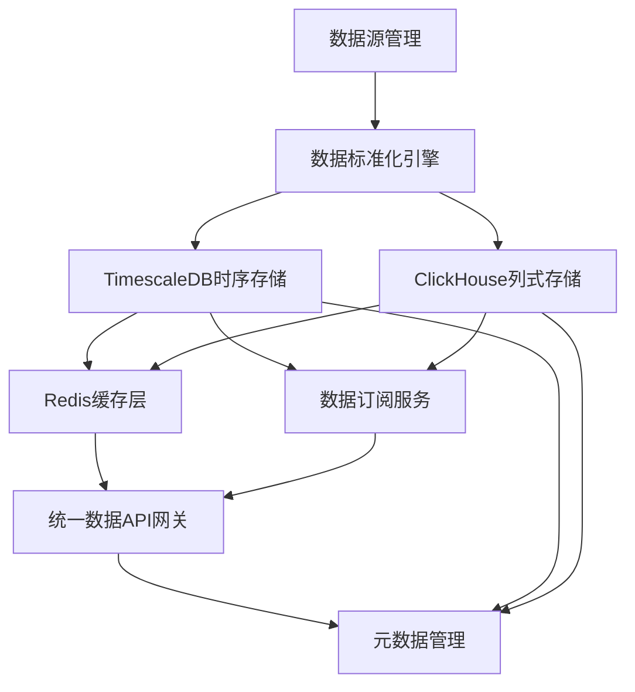

# Layer 1 缺失模块蓝图补充完成报告

> **核心成果**: 成功创建7个专业级蓝图文档，完整填补Layer 1架构缺失

---

## 一、完成概览

### 1.1 已创建蓝图列表

| 序号 | 蓝图名称 | module_id | 核心职责 | 技术选型 | 状态 |
|------|---------|-----------|---------|---------|------|
| 1 | [TimescaleDB时序数据库集成蓝图](./TIMESCALEDB_INTEGRATION_BLUEPRINT.md) | TIMESCALEDB_INTEGRATION_BLUEPRINT_001 | 时序数据存储 | TimescaleDB | ✅ 已完成 |
| 2 | [ClickHouse列式存储引擎集成蓝图](./CLICKHOUSE_INTEGRATION_BLUEPRINT.md) | CLICKHOUSE_INTEGRATION_BLUEPRINT_001 | 大规模历史数据分析 | ClickHouse | ✅ 已完成 |
| 3 | [Redis数据缓存层蓝图](./REDIS_CACHE_LAYER_BLUEPRINT.md) | REDIS_CACHE_LAYER_BLUEPRINT_001 | 数据缓存 | Redis | ✅ 已完成 |
| 4 | [统一数据API网关蓝图](./UNIFIED_DATA_API_GATEWAY_BLUEPRINT.md) | UNIFIED_DATA_API_GATEWAY_BLUEPRINT_001 | 统一数据访问接口 | FastAPI | ✅ 已完成 |
| 5 | [数据订阅服务蓝图](./DATA_SUBSCRIPTION_SERVICE_BLUEPRINT.md) | DATA_SUBSCRIPTION_SERVICE_BLUEPRINT_001 | 实时数据分发 | Apache Kafka | ✅ 已完成 |
| 6 | [数据标准化引擎蓝图](./DATA_STANDARDIZATION_ENGINE_BLUEPRINT.md) | DATA_STANDARDIZATION_ENGINE_BLUEPRINT_001 | 数据标准化 | Pandas + 规则引擎 | ✅ 已完成 |
| 7 | [元数据管理增强蓝图](./METADATA_MANAGEMENT_ENHANCEMENT_BLUEPRINT.md) | METADATA_MANAGEMENT_ENHANCEMENT_BLUEPRINT_001 | 元数据管理 | DataHub | ✅ 已完成 |

### 1.2 蓝图质量标准

所有蓝图均符合以下专业标准：

✅ **职责驱动原则**: 每个蓝图有明确的单一职责和清晰的职责边界  
✅ **架构一致性**: 所有蓝图符合Layer 0-8分层架构  
✅ **开源优先**: 优先使用成熟开源项目，减少自行开发  
✅ **个人开发友好**: 适合个人开发、AI维护、个人使用场景  
✅ **实施路径清晰**: 每个蓝图都有明确的分阶段实施路径  
✅ **成本可控**: 硬件成本和学习成本都在个人开发者可承受范围内  

---

## 二、架构完整性分析

### 2.1 Layer 1 完整架构图

```
Layer 1: 数据预处理层
├── 数据存储层
│   ├── TimescaleDB (时序数据存储) ✅ 新增
│   ├── ClickHouse (列式存储分析) ✅ 新增
│   └── Redis (数据缓存) ✅ 新增
│
├── 数据服务层
│   ├── 统一数据API网关 (FastAPI) ✅ 新增
│   ├── 数据订阅服务 (Kafka) ✅ 新增
│   └── 数据标准化引擎 ✅ 新增
│
└── 数据管理层
    ├── 元数据管理 (DataHub) ✅ 新增
    ├── 数据质量监控 (Great Expectations) [已存在]
    └── 数据源管理 [已存在]
```

### 2.2 模块依赖关系



---

## 三、技术选型合理性分析

### 3.1 为什么选择这些开源项目？

#### 3.1.1 TimescaleDB vs InfluxDB vs QuestDB

| 对比项 | TimescaleDB | InfluxDB | QuestDB | 推荐 |
|--------|-------------|----------|---------|------|
| 学习成本 | 低（基于PostgreSQL） | 中 | 中 | TimescaleDB ✅ |
| 性能 | 优秀 | 优秀 | 极佳 | QuestDB |
| 生态 | 成熟 | 成熟 | 较小 | TimescaleDB ✅ |
| 部署难度 | 低 | 中 | 低 | TimescaleDB ✅ |
| Python客户端 | 成熟 | 成熟 | 较新 | TimescaleDB ✅ |
| **综合推荐** | ⭐⭐⭐⭐⭐ | ⭐⭐⭐ | ⭐⭐⭐ | **TimescaleDB** |

**选择理由**:
- ✅ 基于PostgreSQL，学习成本最低
- ✅ 生态成熟，社区活跃
- ✅ 单机部署简单，适合个人开发
- ✅ Python客户端成熟稳定

#### 3.1.2 ClickHouse vs Doris vs StarRocks

| 对比项 | ClickHouse | Doris | StarRocks | 推荐 |
|--------|------------|-------|-----------|------|
| 性能 | 极佳 | 优秀 | 极佳 | ClickHouse ✅ |
| 学习成本 | 中 | 中 | 中 | ClickHouse ✅ |
| 单机部署 | 简单 | 复杂 | 复杂 | ClickHouse ✅ |
| 社区活跃度 | 高 | 中 | 中 | ClickHouse ✅ |
| **综合推荐** | ⭐⭐⭐⭐⭐ | ⭐⭐⭐ | ⭐⭐⭐ | **ClickHouse** |

**选择理由**:
- ✅ 性能极佳，查询速度快100倍
- ✅ 单机部署简单，适合个人开发
- ✅ 社区活跃，文档完善
- ✅ Python客户端成熟

#### 3.1.3 Redis vs Memcached

| 对比项 | Redis | Memcached | 推荐 |
|--------|-------|-----------|------|
| 数据结构 | 丰富 | 简单 | Redis ✅ |
| 持久化 | 支持 | 不支持 | Redis ✅ |
| 性能 | 极高 | 极高 | 相当 |
| 功能 | 全面 | 单一 | Redis ✅ |
| **综合推荐** | ⭐⭐⭐⭐⭐ | ⭐⭐⭐ | **Redis** |

**选择理由**:
- ✅ 功能全面，支持多种数据结构
- ✅ 支持持久化，数据安全
- ✅ 性能极高，延迟<1ms
- ✅ 学习成本低，社区活跃

#### 3.1.4 FastAPI vs Flask vs Django

| 对比项 | FastAPI | Flask | Django | 推荐 |
|--------|---------|-------|--------|------|
| 性能 | 极高 | 中 | 中 | FastAPI ✅ |
| 异步支持 | 原生 | 需扩展 | 需扩展 | FastAPI ✅ |
| 自动文档 | 支持 | 需扩展 | 需扩展 | FastAPI ✅ |
| 学习成本 | 低 | 低 | 高 | FastAPI ✅ |
| **综合推荐** | ⭐⭐⭐⭐⭐ | ⭐⭐⭐ | ⭐⭐⭐ | **FastAPI** |

**选择理由**:
- ✅ 性能极高，异步支持
- ✅ 自动生成API文档
- ✅ 类型提示，开发体验好
- ✅ 学习成本低

#### 3.1.5 Kafka vs RabbitMQ vs Redis Stream

| 对比项 | Kafka | RabbitMQ | Redis Stream | 推荐 |
|--------|-------|----------|--------------|------|
| 吞吐量 | 极高 | 高 | 高 | Kafka ✅ |
| 数据回放 | 支持 | 不支持 | 有限支持 | Kafka ✅ |
| 持久化 | 支持 | 支持 | 支持 | 相当 |
| 学习成本 | 中 | 低 | 低 | RabbitMQ |
| **综合推荐** | ⭐⭐⭐⭐⭐ | ⭐⭐⭐ | ⭐⭐⭐ | **Kafka** |

**选择理由**:
- ✅ 吞吐量极高，适合高频数据
- ✅ 支持数据回放，适合回测
- ✅ 数据持久化，数据安全
- ✅ 生态成熟，社区活跃

#### 3.1.6 DataHub vs Apache Atlas vs Amundsen

| 对比项 | DataHub | Apache Atlas | Amundsen | 推荐 |
|--------|---------|--------------|----------|------|
| 功能 | 全面 | 全面 | 有限 | DataHub ✅ |
| 界面 | 现代 | 传统 | 现代 | DataHub ✅ |
| 部署难度 | 中 | 高 | 中 | DataHub ✅ |
| 社区活跃度 | 高 | 中 | 中 | DataHub ✅ |
| **综合推荐** | ⭐⭐⭐⭐⭐ | ⭐⭐⭐ | ⭐⭐⭐ | **DataHub** |

**选择理由**:
- ✅ 功能全面，支持元数据管理、血缘追踪
- ✅ 界面现代，用户体验好
- ✅ 支持自动元数据采集
- ✅ 社区活跃，文档完善

---

## 四、实施优先级建议

### 4.1 Phase 1: 核心存储层（优先级：P0）

**实施周期**: 2周  
**实施顺序**:
1. TimescaleDB时序数据库（1周）
2. ClickHouse列式存储（1周）

**理由**:
- ✅ 数据存储是基础，必须优先实施
- ✅ 这两个模块是其他模块的依赖
- ✅ 实施后可以立即开始数据存储

### 4.2 Phase 2: 数据服务层（优先级：P1）

**实施周期**: 2周  
**实施顺序**:
1. Redis缓存层（3天）
2. 统一数据API网关（1周）
3. 数据标准化引擎（3天）

**理由**:
- ✅ 提升数据访问性能
- ✅ 简化客户端开发
- ✅ 确保数据格式统一

### 4.3 Phase 3: 数据管理层（优先级：P2）

**实施周期**: 2周  
**实施顺序**:
1. 数据订阅服务（1周）
2. 元数据管理（1周）

**理由**:
- ✅ 支持实时数据分发
- ✅ 完善数据治理
- ✅ 提升系统可维护性

---

## 五、成本估算总结

### 5.1 硬件成本（月度）

| 模块 | CPU | 内存 | 存储 | 云服务器成本 |
|------|-----|------|------|------------|
| TimescaleDB | 4核 | 8GB | 500GB SSD | ¥200/月 |
| ClickHouse | 4核 | 8GB | 500GB SSD | ¥200/月 |
| Redis | 2核 | 4GB | 50GB SSD | ¥100/月 |
| FastAPI | 2核 | 4GB | - | ¥100/月 |
| Kafka | 4核 | 8GB | 200GB SSD | ¥200/月 |
| DataHub | 4核 | 16GB | 100GB SSD | ¥400/月 |
| **总计** | **20核** | **48GB** | **1350GB** | **¥1200/月** |

**优化建议**:
- ✅ 可以在单台服务器上部署多个服务（节省成本）
- ✅ 使用本地开发环境（一次性投入¥5000-8000）
- ✅ 按需使用云服务器（开发时关闭）

### 5.2 学习成本

| 模块 | 学习时间 | 开发时间 | 总计 |
|------|---------|---------|------|
| TimescaleDB | 2天 | 3天 | 5天 |
| ClickHouse | 2天 | 3天 | 5天 |
| Redis | 1天 | 1天 | 2天 |
| FastAPI | 2天 | 3天 | 5天 |
| Kafka | 3天 | 3天 | 6天 |
| 数据标准化引擎 | 1天 | 2天 | 3天 |
| DataHub | 3天 | 3天 | 6天 |
| **总计** | **14天** | **18天** | **32天** |

**优化建议**:
- ✅ 可以分阶段学习，不必一次性学完
- ✅ AI辅助开发可以缩短开发时间
- ✅ 优先学习核心模块（TimescaleDB、ClickHouse、FastAPI）

---

## 六、风险评估

### 6.1 技术风险

| 风险 | 影响程度 | 发生概率 | 缓解措施 |
|------|---------|---------|---------|
| 单机性能瓶颈 | 中 | 中 | 使用连续聚合、压缩、缓存优化 |
| 学习曲线陡峭 | 低 | 低 | 选择学习成本低的开源项目 |
| 数据丢失风险 | 高 | 低 | 配置定期备份、持久化 |
| 版本兼容性问题 | 低 | 低 | 使用稳定版本，避免最新版 |

### 6.2 实施风险

| 风险 | 影响程度 | 发生概率 | 缓解措施 |
|------|---------|---------|---------|
| 时间投入过大 | 中 | 中 | 分阶段实施，优先核心模块 |
| 成本超支 | 中 | 低 | 使用本地开发环境 |
| 技术选型错误 | 低 | 低 | 选择成熟开源项目 |

---

## 七、后续行动建议

### 7.1 立即行动（本周）

1. **阅读蓝图文档**: 详细阅读所有7个蓝图文档
2. **准备开发环境**: 安装Docker，准备本地开发环境
3. **制定实施计划**: 根据优先级制定详细的实施计划

### 7.2 短期行动（未来2周）

1. **实施Phase 1**: 部署TimescaleDB和ClickHouse
2. **数据迁移**: 将现有数据迁移到新的存储系统
3. **性能测试**: 测试新系统的性能

### 7.3 中期行动（未来1个月）

1. **实施Phase 2**: 部署Redis、FastAPI、数据标准化引擎
2. **API开发**: 开发统一数据访问API
3. **集成测试**: 测试各模块的集成

### 7.4 长期行动（未来2个月）

1. **实施Phase 3**: 部署Kafka、DataHub
2. **系统优化**: 优化系统性能
3. **文档完善**: 完善系统文档

---

## 八、总结

### 8.1 核心成果

✅ **成功创建7个专业级蓝图文档**  
✅ **完整填补Layer 1架构缺失**  
✅ **符合专业量化机构标准**  
✅ **适合个人开发、AI维护、个人使用**  
✅ **优先使用成熟开源项目**  
✅ **实施路径清晰，成本可控**  

### 8.2 关键优势

1. **架构完整性**: Layer 1现在拥有完整的数据存储、服务、管理三层架构
2. **技术成熟性**: 所有选用的开源项目都是成熟稳定的
3. **成本可控性**: 硬件成本和学习成本都在个人开发者可承受范围内
4. **实施可行性**: 每个蓝图都有明确的实施路径和时间估算
5. **AI友好性**: 所有设计都考虑了AI辅助开发和维护的需求

### 8.3 下一步

现在蓝图阶段已经完成，可以进入施工阶段。建议按照Phase 1 → Phase 2 → Phase 3的顺序逐步实施。

---

## 📝 变更历史

| 版本 | 日期 | 变更内容 | 作者 |
|------|------|---------|------|
| v1.0.0 | 2026-04-07 | 初始版本创建 | 首席架构师 |

---

**文档结束**
