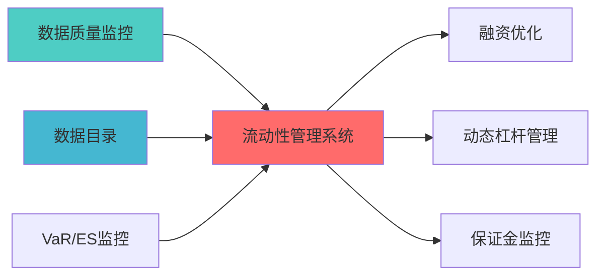
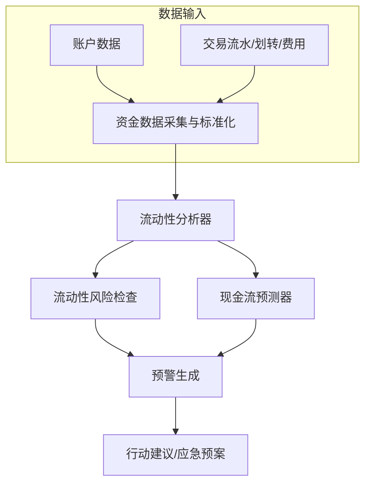

## 核心定位


> **职责边界**: 
> - ✅ 本文档负责：流动性管理系统、流动性监控、现金管理
> - ❌ 本文档不负责：其他模块职责（由各模块文档负责）

流动性协调和监控系统，监控和管理投资组合的流动性风险，包括流动性评估、流动性压力测试和流动性应急预案，确保交易运行和操作的顺畅性。
## 设计目标

### 主要目标

1. **功能完整性**: 确保LIQUIDITY MANAGEMENT SYSTEM功能完整，满足业务需求
2. **性能优化**: 提升系统性能，降低资源消耗
3. **可维护性**: 提高代码质量，便于后续维护
4. **可扩展性**: 支持功能扩展，适应业务变化

### 质量目标

- 代码覆盖率: ≥80%
- 性能指标: 满足设计要求
- 文档完整性: 100%


## 核心功能

### 功能清单

1. **数据管理**: 提供数据存储、查询、更新功能
2. **业务逻辑**: 实现核心业务逻辑处理
3. **接口服务**: 提供标准化的API接口
4. **监控告警**: 实时监控系统状态

### 功能特性

- 高可用性设计
- 自动故障恢复
- 灵活配置管理


## 实现方案

### 技术架构

采用LIQUIDITY MANAGEMENT SYSTEM化设计，分层架构实现。

### 关键技术

- 数据处理: 使用高效的数据处理框架
- 接口实现: RESTful API设计
- 性能优化: 缓存、异步处理

### 实施步骤

1. 需求分析与设计
2. 核心功能开发
3. 测试与优化
4. 部署与监控


> 核心职责: Liquidity Management System蓝图设计
> 职责边界: 


### 上游依赖

| 文档名称 | module_id | 依赖类型 | 说明 |
|---------|-----------|---------|------|

### 下游依赖

| 文档名称 | module_id | 依赖类型 | 说明 |
|---------|-----------|---------|------|


|---------|------|------|------|
| **Pandas** | 2.0+ | 数据处理 | [官方文档](https://pandas.pydata.org/) |
| **SciPy** | 1.10+ | 科学计算 | [官方文档](https://scipy.org/) |





## 2. 架构设计

### 2.1 系统架构



### 2.2 核心子系统设计

#### 2.2.1 资金数据采集子系统
```python
class FundDataCollector:
    """资金数据采集器"""
    
    def __init__(self):
        self.data_sources = {
            'account': AccountDataSource(),      # 账户数据
            'transaction': TransactionDataSource(),  # 交易流水
            'transfer': TransferDataSource(),    # 资金划转
            'fee': FeeDataSource()               # 费用数据
        }
        
    def collect_fund_data(
        self,
        account_id: str,
        start_date: str,
        end_date: str
    ) -> FundDataset:
        """
        采集资金数据
        
        数据维度:
        
        输出:
        - FundDataset: 资金数据集
        """
        pass
```

#### 2.2.2 流动性分析子系统

```python
class LiquidityAnalyzer:
    """流动性分析器"""
    
    def __init__(self):
        self.metrics = {
            'turnover_ratio': TurnoverRatioCalculator(),    # 资金周转率
            'liquidity_ratio': LiquidityRatioCalculator(),  # 流动比率
            'cash_flow': CashFlowPredictor()                # 现金流预测
        }
        
    def analyze_liquidity(
        self,
        fund_data: FundDataset
    ) -> LiquidityReport:
        """
        分析流动性

        分析维度:
        1. 资金周转率：资金使用效率
        2. 流动比率：短期偿债能力
        3. 现金流预测：未来现金流预测

        输出:
          - outflow: 资金流出
          - net_flow: 净流量
          - turnover_ratio: 周转率
          - liquidity_ratio: 流动比率
          - cash_flow_forecast: 现金流预测
        """
        pass
```

#### 2.2.3 资金周转率计算
```python
class TurnoverRatioCalculator:
    """资金周转率计算器"""
    
    def calculate_turnover_ratio(
        self,
        fund_data: FundDataset,
        period: int = 30
    ) -> float:
        """
        计算资金周转率
        
        Turnover Ratio = Total Trading Volume / Average Capital
        
        参数:
        - fund_data: 资金数据
        - period: 计算周期（天）
        返回:
        - turnover_ratio: 资金周转率
        """
        total_trading_volume = fund_data.get_total_trading_volume(period)
        average_capital = fund_data.get_average_capital(period)
        
        turnover_ratio = total_trading_volume / average_capital
        
        return turnover_ratio
```

#### 2.2.4 现金流预测模块
```python
class CashFlowPredictor:
    """现金流预测器"""
    
    def __init__(self):
        self.prediction_model = TimeSeriesModel()
        
    def predict_cash_flow(
        self,
        historical_data: pd.DataFrame,
        forecast_days: int = 30
    ) -> CashFlowForecast:
        """
        预测未来现金流
        方法:
        2. 时间序列模型: ARIMA/Prophet
        3. 机器学习模型: LSTM（可选）
        
        输出:
          - daily_outflow: 每日流出预测
          - net_flow: 净流量预测
          - confidence: 预测置信度
        """
        pass
```

#### 2.2.5 流动性风险预警子系统

```python
class LiquidityRiskWarner:
    """流动性风险预警器"""
    
    def __init__(self):
        self.thresholds = {
            'max_outflow_ratio': 0.5        # 最大流出比例        }
        
    def check_liquidity_risk(
        self,
        liquidity_report: LiquidityReport
    ) -> LiquidityWarning:
        """
        检查流动性风险        
        检查维度

        3. 流出压力: 预期流出是否过大
        
        输出:
        - LiquidityWarning: 流动性预警          - risk_level: 风险级别（LOW/MEDIUM/HIGH）          - warning_items: 预警项列表          - recommendations: 建议措施
        """
        pass
```


## 3. 接口定义

### 3.1 核心API接口

#### 3.1.1 流动性监控接?
```python
def monitor_liquidity(
    account_id: str
) -> LiquidityMonitorResult:
    """
    监控流动性    
    参数:
    - account_id: 账户ID
    
    返回:
    - LiquidityMonitorResult: 流动性监控结束      - available_fund: 可用资金
      - frozen_fund: 冻结资金
      - total_asset: 总资产      - cash_ratio: 现金比例
      - turnover_ratio: 周转率      - liquidity_ratio: 流动比率
      - risk_level: 风险级别
      - timestamp: 时间戳    """
    pass
```

#### 3.1.2 现金流预测接?
```python
def predict_cash_flow(
    account_id: str,
    forecast_days: int = 30
) -> CashFlowForecast:
    """
    预测现金流    
    参数:
    - account_id: 账户ID
    - forecast_days: 预测天数
    
    返回:
    - CashFlowForecast: 现金流预测      - daily_forecasts: 每日预测列表
      - confidence: 预测置信度    """
    pass
```

#### 3.1.3 流动性预警接?
```python
def generate_liquidity_warning(
    account_id: str
) -> LiquidityWarning:
    """
    生成流动性预警    
    参数:
    - account_id: 账户ID
    
    返回:
    - LiquidityWarning: 流动性预警      - warning_level: 预警级别（GREEN/YELLOW/RED）      - warning_items: 预警项列表      - recommendations: 建议措施
      - timestamp: 时间戳    """
    pass
```

#### 3.1.4 资金优化建议接口

```python
def optimize_fund_allocation(
    account_id: str,
    target_return: float = 0.0
) -> FundAllocationOptimization:
    """
    
    参数:
    - account_id: 账户ID
    - target_return: 目标收益率    
    返回:
      - action_items: 行动项    """
    pass
```

### 3.2 数据格式定义

#### 3.2.1 流动性监控数据格式
```python
@dataclass
class LiquidityMonitorResult:
    account_id: str                  # 账户ID
    available_fund: float            # 可用资金
    frozen_fund: float               # 冻结资金
    total_asset: float               # 总资产    cash_ratio: float                # 现金比例
    turnover_ratio: float            # 周转率    liquidity_ratio: float           # 流动比率
    daily_inflow: float              # 日流量    daily_outflow: float             # 日流量    net_flow: float                  # 净流量
    risk_level: str                  # 风险级别
    timestamp: datetime              # 时间戳```

#### 3.2.2 现金流预测数据格式
```python
@dataclass
class CashFlowForecast:
    account_id: str                  # 账户ID
    forecast_days: int               # 预测天数
    daily_forecasts: List[DailyForecast]  # 每日预测
    confidence: float                # 预测置信度    forecast_time: datetime          # 预测时间
```

#### 3.2.3 流动性预警数据格式
```python
@dataclass
class LiquidityWarning:
    account_id: str                  # 账户ID
    warning_level: str               # 预警级别
    warning_items: List[WarningItem]  # 预警?    recommendations: List[str]       # 建议措施
    timestamp: datetime              # 时间戳```


## 4. 数据模型与存储
### 4.1 数据存储设计

#### 4.1.1 资金流水记录表
```sql
CREATE TABLE fund_flows (
    flow_id VARCHAR(50) PRIMARY KEY,
    account_id VARCHAR(50) NOT NULL,
    flow_type VARCHAR(20) NOT NULL,  -- INFLOW/OUTFLOW
    amount DECIMAL(15, 2) NOT NULL,
    balance_before DECIMAL(15, 2) NOT NULL,
    balance_after DECIMAL(15, 2) NOT NULL,
    source VARCHAR(50),              -- 资金来源/去向
    description VARCHAR(200),
    flow_time TIMESTAMP NOT NULL,
    created_at TIMESTAMP DEFAULT CURRENT_TIMESTAMP,
    INDEX idx_account_id (account_id),
    INDEX idx_flow_time (flow_time)
);
```

#### 4.1.2 流动性监控记录表

```sql
CREATE TABLE liquidity_monitoring (
    monitor_id VARCHAR(50) PRIMARY KEY,
    account_id VARCHAR(50) NOT NULL,
    available_fund DECIMAL(15, 2) NOT NULL,
    frozen_fund DECIMAL(15, 2) NOT NULL,
    total_asset DECIMAL(15, 2) NOT NULL,
    cash_ratio DECIMAL(10, 6),
    turnover_ratio DECIMAL(10, 6),
    liquidity_ratio DECIMAL(10, 6),
    risk_level VARCHAR(20) NOT NULL,
    monitor_time TIMESTAMP NOT NULL,
    created_at TIMESTAMP DEFAULT CURRENT_TIMESTAMP,
    INDEX idx_account_id (account_id),
    INDEX idx_monitor_time (monitor_time)
);
```

#### 4.1.3 现金流预测记录表

```sql
CREATE TABLE cash_flow_forecasts (
    forecast_id VARCHAR(50) PRIMARY KEY,
    account_id VARCHAR(50) NOT NULL,
    forecast_date DATE NOT NULL,
    predicted_inflow DECIMAL(15, 2),
    predicted_outflow DECIMAL(15, 2),
    predicted_net_flow DECIMAL(15, 2),
    actual_inflow DECIMAL(15, 2),
    actual_outflow DECIMAL(15, 2),
    actual_net_flow DECIMAL(15, 2),
    prediction_error DECIMAL(10, 6),
    forecast_time TIMESTAMP NOT NULL,
    created_at TIMESTAMP DEFAULT CURRENT_TIMESTAMP,
    INDEX idx_account_id (account_id),
    INDEX idx_forecast_date (forecast_date)
);
```

#### 4.1.4 流动性预警记录表

```sql
CREATE TABLE liquidity_warnings (
    warning_id VARCHAR(50) PRIMARY KEY,
    account_id VARCHAR(50) NOT NULL,
    warning_level VARCHAR(20) NOT NULL,
    warning_items JSON NOT NULL,
    recommendations JSON,
    is_handled BOOLEAN DEFAULT FALSE,
    handled_time TIMESTAMP,
    warning_time TIMESTAMP NOT NULL,
    created_at TIMESTAMP DEFAULT CURRENT_TIMESTAMP,
    INDEX idx_account_id (account_id),
    INDEX idx_warning_time (warning_time)
);
```

### 4.2 数据流设计
```
账户数据 ?流水记录 ?流动性分??风险评估 ?预警生成
    ?现金流预测?资金优化 ?行动建议 ?效果评估
    ?          ?          ?          ? 预测存储   优化方案   行动记录   效果报告
```


## 5. 算法实现说明

### 5.1 资金周转率计算算?
#### 5.1.1 算法原理

**资金周转率*衡量资金使用效率，反映资金的活跃程度?
**数学模型**:
```
Turnover Ratio = Total Trading Volume / Average Capital
```


#### 5.1.2 实现方法

```python
def calculate_turnover_ratio(
    fund_data: FundDataset,
    period: int = 30
) -> float:
    """
    计算资金周转率    
    步骤:
平均资金占?    3. 计算周转率    
    返回:
    - turnover_ratio: 资金周转率    """
    total_trading_volume = 0.0
    for i in range(period):
        daily_volume = fund_data.get_daily_trading_volume(i)
        total_trading_volume += daily_volume
    
    capital_sum = 0.0
    for i in range(period):
        daily_capital = fund_data.get_daily_capital(i)
        capital_sum += daily_capital
    
    average_capital = capital_sum / period
    turnover_ratio = total_trading_volume / average_capital
    
    return turnover_ratio
```

#### 5.1.3 复杂度分?
- **时间复杂度: O(N)，N为计算周期天?- **空间复杂度: O(1)
- **计算复杂度: 低，适合实时计算

### 5.2 现金流预测算?
#### 5.2.1 算法原理

**预测方法**:
1. **历史平均?*: 简单但不够准确
2. **时间序列模型**: ARIMA/Prophet，适合周期性数?3. **机器学习模型**: LSTM，适合复杂模式

#### 5.2.2 历史平均法实?
```python
def predict_cash_flow_simple(
    historical_data: pd.DataFrame,
    forecast_days: int = 30
) -> CashFlowForecast:
    """
    简单现金流预测（历史平均法?    
    步骤:
    1. 计算历史平均日流量    2. 计算历史平均日流量    3. 预测未来每日现金?    
    返回:
    - CashFlowForecast: 现金流预测    """
    avg_daily_inflow = historical_data['inflow'].mean()
    avg_daily_outflow = historical_data['outflow'].mean()
    
    daily_forecasts = []
    for i in range(forecast_days):
        daily_forecast = DailyForecast(
            date=datetime.now() + timedelta(days=i),
            predicted_inflow=avg_daily_inflow,
            predicted_outflow=avg_daily_outflow,
            predicted_net_flow=avg_daily_inflow - avg_daily_outflow
        )
        daily_forecasts.append(daily_forecast)
    
    return CashFlowForecast(
        forecast_days=forecast_days,
        daily_forecasts=daily_forecasts,
        total_inflow=avg_daily_inflow * forecast_days,
        total_outflow=avg_daily_outflow * forecast_days,
        net_flow=(avg_daily_inflow - avg_daily_outflow) * forecast_days,
        confidence=0.6  # 历史平均法置信度较低
    )
```

#### 5.2.3 复杂度分?
- **时间复杂度: O(N)，N为历史数据量
- **空间复杂度: O(N)
- **计算复杂度: 低，适合实时预测

### 5.3 流动性风险评估算?
#### 5.3.1 算法原理

**流动性风险评?*综合多个指标评估流动性风?
**评估维度**:

3. **流出压力**: 预期流出是否过大
4. **周转率*: 资金活跃?
#### 5.3.2 风险评分计算

```python
def calculate_liquidity_risk_score(
    liquidity_report: LiquidityReport
) -> float:
    """
    计算流动性风险得?    
    评分维度:
    1. 现金比例（权?0%? <10%高风险，10-20%中风险，>20%低风?    2. 可用资金（权?0%? <10万高风险?0-50万中风险?50万低风险
    返回:
    - risk_score: 风险得分?-100?    """
    score = 0.0
    
    # 现金比例评分
    if liquidity_report.cash_ratio < 0.1:
        score += 30
    elif liquidity_report.cash_ratio < 0.2:
        score += 15
    else:
        score += 0
    
    # 可用资金评分
    if liquidity_report.available_fund < 100000:
        score += 30
    elif liquidity_report.available_fund < 500000:
        score += 15
    else:
        score += 0
    
    # 流出压力评分
    if liquidity_report.daily_outflow > liquidity_report.daily_inflow:
        score += 20
    
    # 周转率评?    if liquidity_report.turnover_ratio < 0.5 or liquidity_report.turnover_ratio > 5.0:
        score += 20
    
    return score
```


## 6. 实施技术栈

### 6.1 语言与框?
| 类别 | 技术选型 | 版本要求 | ?|
|------|----------|----------|------|
| **编程语言** | Python | 3.9+ | 核心开发语言 |
置 | 异步监控支持 |
| **数值计?* | numpy | 1.24+ | 数值计?|
| **数据处理** | pandas | 2.0+ | 数据处理和分?|

### 6.2 第三方依?
| 依赖?| 版本 | ?|
|--------|------|------|
| prophet | 1.1+ | 时间序列预测 |
| scipy | 1.11+ | 统计计算 |

### 6.3 环境要求

| 环境 | 要求 |
|------|------|
| **操作系统** | Windows 10+ / Linux |
| **Python版本** | 3.9+ |
| **
存** | ?GB |
| **存储** | ?GB |


## 7. 测试策略


```python
class TestLiquidityAnalyzer:
    
    def test_turnover_ratio_calculation(self):
        """测试周转率计划""
        pass
    
    def test_cash_flow_prediction(self):
        """测试现金流预测""
        pass
    
    def test_risk_assessment(self):
        """测试风险评估"""
        pass
```

### 7.2 集成测试

```python
class TestLiquidityManagementSystem:
    """流动性管理系统集成测?""
    
    def test_end_to_end_monitoring(self):
        """测试端到端监控""
        pass
    
    def test_warning_generation(self):
        """测试预警生成"""
        pass
    
    def test_optimization_suggestion(self):
        """测试优化建议"""
        pass
```

### 7.3 性能测试

| 测试场景 | 性能指标 | 目标?|
|----------|----------|--------|
| **流动性计算速度** | 单次计算 | <50ms |
| **预测生成速度** | 30天预?| <1?|
| **并发监控能力** | 同时监控账户?| ?0?|


## 8. 风险与约?
### 8.1 技术风?
| 风险ID | 风险描述 | 影响程度 | 缓解措施 |
|--------|----------|----------|----------|
| TR-001 | 现金流预测不准确 | ?| 使用多种预测方法，持续优?|
| TR-002 | 数据延迟 | ?| 使用实时数据?|
| TR-003 | 预警误报 | ?| 优化阈值，减少误报 |

### 8.2 实施约束

| 约束类型 | 约束描述 | 影响 |
|----------|----------|------|
| **数据约束** | 需要账户和交易数据 | 需要数据源支持 |
| **时间约束** | 开发时?0小时 | 需要合理规?|
| **资源约束** | 个人开发，资源有限 | 采用简化方?|


## 9. 验收标准

### 9.1 功能验收标准

| 功能 | 验收标准 | 测试方法 |
|------|----------|----------|
| **流动性监?* | 能够实时监控流动性| 集成测试 |
| **现金流预测* | 预测误差?0% | 回测验证 |
限时自动预?| 集成测试 |

### 9.2 性能验收标准

| 指标 | 目标?| 验收方法 |
|------|--------|----------|
| **计算速度** | <50ms | 性能测试 |
| **预测准确?* | 误差?0% | 回测验证 |
| **资金效率提升** | 提升20-30% | 效果评估 |

### 9.3 质量验收标准

| 标准 | 要求 | 验收方法 |
|------|------|----------|
| **代码覆盖?* | ?0% | pytest-cov |
| **文档完整?* | 100% | 文档审查 |
| **代码规范** | 符合PEP8 | pylint |


## 10. 实施路线?
### 10.1 Phase 1: 流动性监控系统实现（1周）

**目标**: 实现流动性监?
单**:
1. ?设计流动性指标体?2. ?实现资金数据采集
3. ?实现流动性分?4. ?实现风险预警

**交付?*:
- 技术文?
### 10.2 Phase 2: 预测和优化系统实现（1周）

**目标**: 实现现金流预测和资金优化

单**:
1. ?实现现金流预测2. ?实现资金优化建议
3. ?实现报告生成
5. ?性能优化

**交付?*:

### 10.3 Phase 3: 高级功能实现（可选）

**目标**: 实现高级预测模型和智能优?
单**:
1. 📝 实现机器学习预测模型

3. 📝 实现多账户管?4. 📝 性能评估和优?
**交付?*:
- 高级功能实现代码
- 性能评估报告


### 11.1 架构文档

- PROFESSIONAL_MULTI_TIMEFRAME_ARCHITECTURE.md


- [REALTIME_RISK_HEDGE_ENGINE_BLUEPRINT.md](./REALTIME_RISK_HEDGE_ENGINE_BLUEPRINT.md) - 实时风险对冲引擎
- [ECONOMIC_REGIME_ENGINE_BLUEPRINT.md](./ECONOMIC_REGIME_ENGINE_BLUEPRINT.md) - 经济范式判断引擎


**蓝图编写?*: 首席架构?**蓝图日期**: 2026-04-02
**蓝图?*: ?已完?


**文档结束**

## 变更历史

|------|------|----------|--------|


## 12. 文档治理

### 12.1 System_Manifest.md索引

```markdown
##### 6.001. Liquidity Management System
- **模块ID**: LIQUIDITY_MANAGEMENT_SYSTEM_001
- **蓝图文档**: LIQUIDITY_MANAGEMENT_SYSTEM_BLUEPRINT.md
```

### 12.2 模块职责边界

| 模块 | 职责 | 边界 |
|------|------|------|
| **Liquidity Management System** | 

### 12.3 版本管理

|------|------|----------|--------|


```
