# 流动性管理系统蓝å›?

## 核心定位

负责流动性管理系统的设计与实现，优化资金配置。


> **核心职责**: 流动性管理，监控资金流动性，优化资金配置
> **职责边界**: 
> - âœ?本文档负责：流动性管理、资金流动性监控、资金需求预测、资金配置优åŒ?
> - â?本文档不负责：资金调度、风险控制、订单执è¡?
ï»? 模块概述

> **开发时?*: 80h
> **核心定位**: 监控资金流动性，预测资金需求，优化资金配置，实现桥水模式的流动性管理能?
## 核心定位

> 核心职责: Liquidity Management System蓝图设计
> 职责边界: 
> - âœ?本文档负责：Liquidity Management System蓝图设计相关内容
> - â?本文档不负责：其他模块内容，确保系统功能的稳定运行和高效执行ã€?

## 📚 相关文档

### 上游依赖

| 文档名称 | module_id | 依赖类型 | 说明 |
|---------|-----------|---------|------|
| [数据质量监控蓝图](./DATA_QUALITY_MONITORING_BLUEPRINT.md) | DATA_QUALITY_MONITORING_001 | 强依èµ?| 提供数据质量指标 |
| [数据目录蓝图](./DATA_CATALOG_BLUEPRINT.md) | DATA_CATALOG_001 | 强依èµ?| 提供资金数据元数æ?|
| [VaR/ES监控蓝图](./VAR_ES_MONITORING_BLUEPRINT.md) | VAR_ES_MONITORING_001 | 中依èµ?| 提供风险指标 |

### 下游依赖

| 文档名称 | module_id | 依赖类型 | 说明 |
|---------|-----------|---------|------|
| [融资优化蓝图](./FINANCING_OPTIMIZATION_BLUEPRINT.md) | FINANCING_OPTIMIZATION_001 | 强依èµ?| 融资优化 |
| [动态杠杆管理蓝图](./DYNAMIC_LEVERAGE_MANAGEMENT_BLUEPRINT.md) | DYNAMIC_LEVERAGE_MANAGEMENT_001 | 中依èµ?| 杠杆管理 |
| [保证金监控蓝图](./MARGIN_CALL_MONITOR_BLUEPRINT.md) | MARGIN_CALL_MONITOR_001 | 中依èµ?| 保证金监æŽ?|

### 技术依èµ?

| 技术组ä»?| 版本 | 用é€?| 文档 |
|---------|------|------|------|
| **Pandas** | 2.0+ | 数据处理 | [官方文档](https://pandas.pydata.org/) |
| **NumPy** | 1.24+ | 数值计ç®?| [官方文档](https://numpy.org/) |
| **SciPy** | 1.10+ | 科学计算 | [官方文档](https://scipy.org/) |
| **Matplotlib** | 3.7+ | 可视åŒ?| [官方文档](https://matplotlib.org/) |

### 引用关系å›?

```mermaid
graph LR
    A[数据质量监控] --> B[流动性管理系统]
    C[数据目录] --> B
    D[VaR/ES监控] --> B
    
    B --> E[融资优化]
    B --> F[动态杠杆管理]
    B --> G[保证金监控]
    
    style B fill:#ff6b6b
    style A fill:#4ecdc4
    style C fill:#45b7d1
```



---

## 2. 架构设计

### 2.1 系统架构?
```
┌─────────────────────────────────────────────────────────────────??                   流动性管理系统架?                            ?├─────────────────────────────────────────────────────────────────??                                                                ?? ┌──────────────────────────────────────────────────────────? ?? ?             资金数据采集?                               ? ?? ? ┌──────────? ┌──────────? ┌──────────? ┌──────────?? ?? ? ?账户余额 ? ?交易流水 ? ?资金划转 ? ?费用数据 ?? ?? ? └──────────? └──────────? └──────────? └──────────?? ?? └──────────────────────────────────────────────────────────? ??                         ?                                     ?? ┌──────────────────────────────────────────────────────────? ?? ?             流动性分析层                                  ? ?? ? ┌──────────? ┌──────────? ┌──────────? ┌──────────?? ?? ? ?流入流出 ? ?资金周转 ? ?流动比率 ? ?现金?  ?? ?? ? ?分析     ? ?率分?  ? ?计算     ? ?预测     ?? ?? ? └──────────? └──────────? └──────────? └──────────?? ?? └──────────────────────────────────────────────────────────? ??                         ?                                     ?? ┌──────────────────────────────────────────────────────────? ?? ?             风险预警与决策层                              ? ?? ? ┌──────────? ┌──────────? ┌──────────? ┌──────────?? ?? ? ?风险评估 ? ?预警生成 ? ?资金调配 ? ?应急预??? ?? ? └──────────? └──────────? └──────────? └──────────?? ?? └──────────────────────────────────────────────────────────? ??                         ?                                     ?? ┌──────────────────────────────────────────────────────────? ?? ?             报告与优化层                                  ? ?? ? ┌──────────? ┌──────────? ┌──────────? ┌──────────?? ?? ? ?报告生成 ? ?效率分析 ? ?优化建议 ? ?历史对比 ?? ?? ? └──────────? └──────────? └──────────? └──────────?? ?? └──────────────────────────────────────────────────────────? ??                                                                ?└─────────────────────────────────────────────────────────────────?```

### 2.2 核心子系统设?
#### 2.2.1 资金数据采集子系?
```python
class FundDataCollector:
    """资金数据采集?""
    
    def __init__(self):
        self.data_sources = {
            'account': AccountDataSource(),      # 账户数据
            'transaction': TransactionDataSource(),  # 交易流水
            'transfer': TransferDataSource(),    # 资金划转
            'fee': FeeDataSource()               # 费用数据
        }
        
    def collect_fund_data(
        self,
        account_id: str,
        start_date: str,
        end_date: str
    ) -> FundDataset:
        """
        采集资金数据
        
        数据维度:
        1. 账户余额: 可用资金、冻结资金、总资?        2. 交易流水: 买入、卖出、成交金?        3. 资金划转: 入金、出金、转账记?        4. 费用数据: 佣金、印花税、过户费
        
        输出:
        - FundDataset: 资金数据?        """
        pass
```

#### 2.2.2 流动性分析子系统

```python
class LiquidityAnalyzer:
    """流动性分析器"""
    
    def __init__(self):
        self.metrics = {
            'turnover_ratio': TurnoverRatioCalculator(),    # 资金周转?            'liquidity_ratio': LiquidityRatioCalculator(),  # 流动比率
            'cash_flow': CashFlowPredictor()                # 现金流预?        }
        
    def analyze_liquidity(
        self,
        fund_data: FundDataset
    ) -> LiquidityReport:
        """
        分析流动?        
        分析维度:
        1. 资金流入流出: ??月资金流动情?        2. 资金周转? 资金使用效率
        3. 流动比率: 短期偿债能?        4. 现金流预? 未来现金流预?        
        输出:
        - LiquidityReport: 流动性报?          - inflow: 资金流入
          - outflow: 资金流出
          - net_flow: 净流量
          - turnover_ratio: 周转?          - liquidity_ratio: 流动比率
          - cash_flow_forecast: 现金流预?        """
        pass
```

#### 2.2.3 资金周转率计?
```python
class TurnoverRatioCalculator:
    """资金周转率计算器"""
    
    def calculate_turnover_ratio(
        self,
        fund_data: FundDataset,
        period: int = 30
    ) -> float:
        """
        计算资金周转?        
        公式:
        Turnover Ratio = Total Trading Volume / Average Capital
        
        参数:
        - fund_data: 资金数据
        - period: 计算周期（天?        
        返回:
        - turnover_ratio: 资金周转?        """
        total_trading_volume = fund_data.get_total_trading_volume(period)
        average_capital = fund_data.get_average_capital(period)
        
        turnover_ratio = total_trading_volume / average_capital
        
        return turnover_ratio
```

#### 2.2.4 现金流预测模?
```python
class CashFlowPredictor:
    """现金流预测器"""
    
    def __init__(self):
        self.prediction_model = TimeSeriesModel()
        
    def predict_cash_flow(
        self,
        historical_data: pd.DataFrame,
        forecast_days: int = 30
    ) -> CashFlowForecast:
        """
        预测未来现金?        
        方法:
        1. 历史平均? 基于历史平均流入流出
        2. 时间序列模型: ARIMA/Prophet
        3. 机器学习模型: LSTM（可选）
        
        输出:
        - CashFlowForecast: 现金流预?          - daily_inflow: 每日流入预测
          - daily_outflow: 每日流出预测
          - net_flow: 净流量预测
          - confidence: 预测置信?        """
        pass
```

#### 2.2.5 流动性风险预警子系统

```python
class LiquidityRiskWarner:
    """流动性风险预警器"""
    
    def __init__(self):
        self.thresholds = {
            'min_cash_ratio': 0.1,          # 最低现金比?            'min_available_fund': 100000,   # 最低可用资金（元）
            'max_outflow_ratio': 0.5        # 最大流出比?        }
        
    def check_liquidity_risk(
        self,
        liquidity_report: LiquidityReport
    ) -> LiquidityWarning:
        """
        检查流动性风?        
        检查维?
        1. 现金比例: 可用资金/总资?        2. 可用资金: 绝对金额是否充足
        3. 流出压力: 预期流出是否过大
        
        输出:
        - LiquidityWarning: 流动性预?          - risk_level: 风险级别（LOW/MEDIUM/HIGH?          - warning_items: 预警项列?          - recommendations: 建议措施
        """
        pass
```

---

## 3. 接口定义

### 3.1 核心API接口

#### 3.1.1 流动性监控接?
```python
def monitor_liquidity(
    account_id: str
) -> LiquidityMonitorResult:
    """
    监控流动?    
    参数:
    - account_id: 账户ID
    
    返回:
    - LiquidityMonitorResult: 流动性监控结?      - available_fund: 可用资金
      - frozen_fund: 冻结资金
      - total_asset: 总资?      - cash_ratio: 现金比例
      - turnover_ratio: 周转?      - liquidity_ratio: 流动比率
      - risk_level: 风险级别
      - timestamp: 时间?    """
    pass
```

#### 3.1.2 现金流预测接?
```python
def predict_cash_flow(
    account_id: str,
    forecast_days: int = 30
) -> CashFlowForecast:
    """
    预测现金?    
    参数:
    - account_id: 账户ID
    - forecast_days: 预测天数
    
    返回:
    - CashFlowForecast: 现金流预?      - daily_forecasts: 每日预测列表
      - total_inflow: 总流入预?      - total_outflow: 总流出预?      - net_flow: 净流量预测
      - confidence: 预测置信?    """
    pass
```

#### 3.1.3 流动性预警接?
```python
def generate_liquidity_warning(
    account_id: str
) -> LiquidityWarning:
    """
    生成流动性预?    
    参数:
    - account_id: 账户ID
    
    返回:
    - LiquidityWarning: 流动性预?      - warning_level: 预警级别（GREEN/YELLOW/RED?      - warning_items: 预警项列?      - recommendations: 建议措施
      - timestamp: 时间?    """
    pass
```

#### 3.1.4 资金优化建议接口

```python
def optimize_fund_allocation(
    account_id: str,
    target_return: float = 0.0
) -> FundAllocationOptimization:
    """
    优化资金配置
    
    参数:
    - account_id: 账户ID
    - target_return: 目标收益?    
    返回:
    - FundAllocationOptimization: 资金配置优化建议
      - current_allocation: 当前配置
      - optimal_allocation: 最优配?      - expected_improvement: 预期改善
      - action_items: 行动?    """
    pass
```

### 3.2 数据格式定义

#### 3.2.1 流动性监控数据格?
```python
@dataclass
class LiquidityMonitorResult:
    account_id: str                  # 账户ID
    available_fund: float            # 可用资金
    frozen_fund: float               # 冻结资金
    total_asset: float               # 总资?    cash_ratio: float                # 现金比例
    turnover_ratio: float            # 周转?    liquidity_ratio: float           # 流动比率
    daily_inflow: float              # 日流?    daily_outflow: float             # 日流?    net_flow: float                  # 净流量
    risk_level: str                  # 风险级别
    timestamp: datetime              # 时间?```

#### 3.2.2 现金流预测数据格?
```python
@dataclass
class CashFlowForecast:
    account_id: str                  # 账户ID
    forecast_days: int               # 预测天数
    daily_forecasts: List[DailyForecast]  # 每日预测
    total_inflow: float              # 总流入预?    total_outflow: float             # 总流出预?    net_flow: float                  # 净流量预测
    confidence: float                # 预测置信?    forecast_time: datetime          # 预测时间
```

#### 3.2.3 流动性预警数据格?
```python
@dataclass
class LiquidityWarning:
    account_id: str                  # 账户ID
    warning_level: str               # 预警级别
    warning_items: List[WarningItem]  # 预警?    recommendations: List[str]       # 建议措施
    timestamp: datetime              # 时间?```

---

## 4. 数据模型与存?
### 4.1 数据存储设计

#### 4.1.1 资金流水记录?
```sql
CREATE TABLE fund_flows (
    flow_id VARCHAR(50) PRIMARY KEY,
    account_id VARCHAR(50) NOT NULL,
    flow_type VARCHAR(20) NOT NULL,  -- INFLOW/OUTFLOW
    amount DECIMAL(15, 2) NOT NULL,
    balance_before DECIMAL(15, 2) NOT NULL,
    balance_after DECIMAL(15, 2) NOT NULL,
    source VARCHAR(50),              -- 资金来源/去向
    description VARCHAR(200),
    flow_time TIMESTAMP NOT NULL,
    created_at TIMESTAMP DEFAULT CURRENT_TIMESTAMP,
    INDEX idx_account_id (account_id),
    INDEX idx_flow_time (flow_time)
);
```

#### 4.1.2 流动性监控记录表

```sql
CREATE TABLE liquidity_monitoring (
    monitor_id VARCHAR(50) PRIMARY KEY,
    account_id VARCHAR(50) NOT NULL,
    available_fund DECIMAL(15, 2) NOT NULL,
    frozen_fund DECIMAL(15, 2) NOT NULL,
    total_asset DECIMAL(15, 2) NOT NULL,
    cash_ratio DECIMAL(10, 6),
    turnover_ratio DECIMAL(10, 6),
    liquidity_ratio DECIMAL(10, 6),
    risk_level VARCHAR(20) NOT NULL,
    monitor_time TIMESTAMP NOT NULL,
    created_at TIMESTAMP DEFAULT CURRENT_TIMESTAMP,
    INDEX idx_account_id (account_id),
    INDEX idx_monitor_time (monitor_time)
);
```

#### 4.1.3 现金流预测记录表

```sql
CREATE TABLE cash_flow_forecasts (
    forecast_id VARCHAR(50) PRIMARY KEY,
    account_id VARCHAR(50) NOT NULL,
    forecast_date DATE NOT NULL,
    predicted_inflow DECIMAL(15, 2),
    predicted_outflow DECIMAL(15, 2),
    predicted_net_flow DECIMAL(15, 2),
    actual_inflow DECIMAL(15, 2),
    actual_outflow DECIMAL(15, 2),
    actual_net_flow DECIMAL(15, 2),
    prediction_error DECIMAL(10, 6),
    forecast_time TIMESTAMP NOT NULL,
    created_at TIMESTAMP DEFAULT CURRENT_TIMESTAMP,
    INDEX idx_account_id (account_id),
    INDEX idx_forecast_date (forecast_date)
);
```

#### 4.1.4 流动性预警记录表

```sql
CREATE TABLE liquidity_warnings (
    warning_id VARCHAR(50) PRIMARY KEY,
    account_id VARCHAR(50) NOT NULL,
    warning_level VARCHAR(20) NOT NULL,
    warning_items JSON NOT NULL,
    recommendations JSON,
    is_handled BOOLEAN DEFAULT FALSE,
    handled_time TIMESTAMP,
    warning_time TIMESTAMP NOT NULL,
    created_at TIMESTAMP DEFAULT CURRENT_TIMESTAMP,
    INDEX idx_account_id (account_id),
    INDEX idx_warning_time (warning_time)
);
```

### 4.2 数据流设?
```
账户数据 ?流水记录 ?流动性分??风险评估 ?预警生成
    ?          ?          ?          ?          ? 余额快照   流水存储   指标计算   风险得分   预警记录
    ?现金流预??资金优化 ?行动建议 ?效果评估
    ?          ?          ?          ? 预测存储   优化方案   行动记录   效果报告
```

---

## 5. 算法实现说明

### 5.1 资金周转率计算算?
#### 5.1.1 算法原理

**资金周转?*衡量资金使用效率，反映资金的活跃程度?
**数学模型**:
```
Turnover Ratio = Total Trading Volume / Average Capital
```

其中?- Total Trading Volume: 总交易金?- Average Capital: 平均资金占用

#### 5.1.2 实现方法

```python
def calculate_turnover_ratio(
    fund_data: FundDataset,
    period: int = 30
) -> float:
    """
    计算资金周转?    
    步骤:
    1. 计算周期内总交易金?    2. 计算周期内平均资金占?    3. 计算周转?    
    返回:
    - turnover_ratio: 资金周转?    """
    total_trading_volume = 0.0
    for i in range(period):
        daily_volume = fund_data.get_daily_trading_volume(i)
        total_trading_volume += daily_volume
    
    capital_sum = 0.0
    for i in range(period):
        daily_capital = fund_data.get_daily_capital(i)
        capital_sum += daily_capital
    
    average_capital = capital_sum / period
    turnover_ratio = total_trading_volume / average_capital
    
    return turnover_ratio
```

#### 5.1.3 复杂度分?
- **时间复杂?*: O(N)，N为计算周期天?- **空间复杂?*: O(1)
- **计算复杂?*: 低，适合实时计算

### 5.2 现金流预测算?
#### 5.2.1 算法原理

**现金流预?*基于历史数据预测未来的资金流入流?
**预测方法**:
1. **历史平均?*: 简单但不够准确
2. **时间序列模型**: ARIMA/Prophet，适合周期性数?3. **机器学习模型**: LSTM，适合复杂模式

#### 5.2.2 历史平均法实?
```python
def predict_cash_flow_simple(
    historical_data: pd.DataFrame,
    forecast_days: int = 30
) -> CashFlowForecast:
    """
    简单现金流预测（历史平均法?    
    步骤:
    1. 计算历史平均日流?    2. 计算历史平均日流?    3. 预测未来每日现金?    
    返回:
    - CashFlowForecast: 现金流预?    """
    avg_daily_inflow = historical_data['inflow'].mean()
    avg_daily_outflow = historical_data['outflow'].mean()
    
    daily_forecasts = []
    for i in range(forecast_days):
        daily_forecast = DailyForecast(
            date=datetime.now() + timedelta(days=i),
            predicted_inflow=avg_daily_inflow,
            predicted_outflow=avg_daily_outflow,
            predicted_net_flow=avg_daily_inflow - avg_daily_outflow
        )
        daily_forecasts.append(daily_forecast)
    
    return CashFlowForecast(
        forecast_days=forecast_days,
        daily_forecasts=daily_forecasts,
        total_inflow=avg_daily_inflow * forecast_days,
        total_outflow=avg_daily_outflow * forecast_days,
        net_flow=(avg_daily_inflow - avg_daily_outflow) * forecast_days,
        confidence=0.6  # 历史平均法置信度较低
    )
```

#### 5.2.3 复杂度分?
- **时间复杂?*: O(N)，N为历史数据量
- **空间复杂?*: O(N)
- **计算复杂?*: 低，适合实时预测

### 5.3 流动性风险评估算?
#### 5.3.1 算法原理

**流动性风险评?*综合多个指标评估流动性风?
**评估维度**:
1. **现金比例**: 可用资金/总资?2. **可用资金**: 绝对金额是否充足
3. **流出压力**: 预期流出是否过大
4. **周转?*: 资金活跃?
#### 5.3.2 风险评分计算

```python
def calculate_liquidity_risk_score(
    liquidity_report: LiquidityReport
) -> float:
    """
    计算流动性风险得?    
    评分维度:
    1. 现金比例（权?0%? <10%高风险，10-20%中风险，>20%低风?    2. 可用资金（权?0%? <10万高风险?0-50万中风险?50万低风险
    3. 流出压力（权?0%? 流出/流入>1高风?    4. 周转率（权重20%? 过高或过低都有风?    
    返回:
    - risk_score: 风险得分?-100?    """
    score = 0.0
    
    # 现金比例评分
    if liquidity_report.cash_ratio < 0.1:
        score += 30
    elif liquidity_report.cash_ratio < 0.2:
        score += 15
    else:
        score += 0
    
    # 可用资金评分
    if liquidity_report.available_fund < 100000:
        score += 30
    elif liquidity_report.available_fund < 500000:
        score += 15
    else:
        score += 0
    
    # 流出压力评分
    if liquidity_report.daily_outflow > liquidity_report.daily_inflow:
        score += 20
    
    # 周转率评?    if liquidity_report.turnover_ratio < 0.5 or liquidity_report.turnover_ratio > 5.0:
        score += 20
    
    return score
```

---

## 6. 实施技术栈

### 6.1 语言与框?
| 类别 | 技术选型 | 版本要求 | ?|
|------|----------|----------|------|
| **编程语言** | Python | 3.9+ | 核心开发语言 |
| **异步框架** | asyncio | 内置 | 异步监控支持 |
| **数值计?* | numpy | 1.24+ | 数值计?|
| **数据处理** | pandas | 2.0+ | 数据处理和分?|

### 6.2 第三方依?
| 依赖?| 版本 | ?|
|--------|------|------|
| prophet | 1.1+ | 时间序列预测 |
| scipy | 1.11+ | 统计计算 |

### 6.3 环境要求

| 环境 | 要求 |
|------|------|
| **操作系统** | Windows 10+ / Linux |
| **Python版本** | 3.9+ |
| **内存** | ?GB |
| **存储** | ?GB |

---

## 7. 测试策略

### 7.1 单元测试

```python
class TestLiquidityAnalyzer:
    """流动性分析单元测?""
    
    def test_turnover_ratio_calculation(self):
        """测试周转率计?""
        pass
    
    def test_cash_flow_prediction(self):
        """测试现金流预?""
        pass
    
    def test_risk_assessment(self):
        """测试风险评估"""
        pass
```

### 7.2 集成测试

```python
class TestLiquidityManagementSystem:
    """流动性管理系统集成测?""
    
    def test_end_to_end_monitoring(self):
        """测试端到端监?""
        pass
    
    def test_warning_generation(self):
        """测试预警生成"""
        pass
    
    def test_optimization_suggestion(self):
        """测试优化建议"""
        pass
```

### 7.3 性能测试

| 测试场景 | 性能指标 | 目标?|
|----------|----------|--------|
| **流动性计算速度** | 单次计算 | <50ms |
| **预测生成速度** | 30天预?| <1?|
| **并发监控能力** | 同时监控账户?| ?0?|

---

## 8. 风险与约?
### 8.1 技术风?
| 风险ID | 风险描述 | 影响程度 | 缓解措施 |
|--------|----------|----------|----------|
| TR-001 | 现金流预测不准确 | ?| 使用多种预测方法，持续优?|
| TR-002 | 数据延迟 | ?| 使用实时数据?|
| TR-003 | 预警误报 | ?| 优化阈值，减少误报 |

### 8.2 实施约束

| 约束类型 | 约束描述 | 影响 |
|----------|----------|------|
| **数据约束** | 需要账户和交易数据 | 需要数据源支持 |
| **时间约束** | 开发时?0小时 | 需要合理规?|
| **资源约束** | 个人开发，资源有限 | 采用简化方?|

---

## 9. 验收标准

### 9.1 功能验收标准

| 功能 | 验收标准 | 测试方法 |
|------|----------|----------|
| **流动性监?* | 能够实时监控流动?| 集成测试 |
| **现金流预?* | 预测误差?0% | 回测验证 |
| **风险预警** | 风险超限时自动预?| 集成测试 |

### 9.2 性能验收标准

| 指标 | 目标?| 验收方法 |
|------|--------|----------|
| **计算速度** | <50ms | 性能测试 |
| **预测准确?* | 误差?0% | 回测验证 |
| **资金效率提升** | 提升20-30% | 效果评估 |

### 9.3 质量验收标准

| 标准 | 要求 | 验收方法 |
|------|------|----------|
| **代码覆盖?* | ?0% | pytest-cov |
| **文档完整?* | 100% | 文档审查 |
| **代码规范** | 符合PEP8 | pylint |

---

## 10. 实施路线?
### 10.1 Phase 1: 流动性监控系统实现（1周）

**目标**: 实现流动性监?
**任务清单**:
1. ?设计流动性指标体?2. ?实现资金数据采集
3. ?实现流动性分?4. ?实现风险预警
5. ?编写单元测试

**交付?*:
- 流动性监控实现代?- 单元测试代码
- 技术文?
### 10.2 Phase 2: 预测和优化系统实现（1周）

**目标**: 实现现金流预测和资金优化

**任务清单**:
1. ?实现现金流预?2. ?实现资金优化建议
3. ?实现报告生成
4. ?编写单元测试
5. ?性能优化

**交付?*:
- 预测和优化实现代?- 单元测试代码

### 10.3 Phase 3: 高级功能实现（可选）

**目标**: 实现高级预测模型和智能优?
**任务清单**:
1. 📝 实现机器学习预测模型
2. 📝 实现智能资金调配
3. 📝 实现多账户管?4. 📝 性能评估和优?
**交付?*:
- 高级功能实现代码
- 性能评估报告

---

## 11. 相关文档

### 11.1 架构文档

- PROFESSIONAL_MULTI_TIMEFRAME_ARCHITECTURE.md

### 11.2 相关模块

- [REALTIME_RISK_HEDGE_ENGINE_BLUEPRINT.md](./REALTIME_RISK_HEDGE_ENGINE_BLUEPRINT.md) - 实时风险对冲引擎
- [ECONOMIC_REGIME_ENGINE_BLUEPRINT.md](./ECONOMIC_REGIME_ENGINE_BLUEPRINT.md) - 经济范式判断引擎

---

**蓝图编写?*: 首席架构?**蓝图日期**: 2026-04-02
**蓝图?*: ?已完?
---

**文档结束**

## 变更历史

| 版本 | 日期 | 变更内容 | 变更äº?|
|------|------|----------|--------|
| v1.0.0 | 2026-04-02 | 初始版本创建 | 个人开发è€?|

---

**蓝图版本**: v1.0.1 | **创建日期**: 2026-04-02 | **状æ€?*: Active
---

## 12. 文档治理

### 12.1 System_Manifest.md索引

```markdown
#### Layer 5: 中观策略å±?
##### 6.001. Liquidity Management System
- **模块ID**: LIQUIDITY_MANAGEMENT_SYSTEM_001
- **蓝图文档**: LIQUIDITY_MANAGEMENT_SYSTEM_BLUEPRINT.md
- **技术规格书**: 待创å»?
- **职责**: 全系ç»?
- **状æ€?*: Active
```

### 12.2 模块职责边界

| 模块 | 职责 | 边界 |
|------|------|------|
| **Liquidity Management System** | 全系ç»?| **核心模块** |

### 12.3 版本管理

| 版本 | 日期 | 变更内容 | 变更äº?|
|------|------|----------|--------|
| v1.0.0 | 2026-04-02 | 初始版本创建 | 首席蓝图架构å¸?|

---

**蓝图版本**: v1.0.0 | **创建日期**: 2026-04-02 | **状æ€?*: Active
