---
responsibility:
  - 市场冲击建模
  - 冲击成本预测
  - 交易影响分析
  - 冲击优化

module_id: MARKET_IMPACT_MODEL_001
version: 1.0.0
status: Active
created_date: 2026-04-07
last_updated: 2026-04-07
owner: 实施团队
standard_type: 专业量化机构蓝图
applicable_scope: Layer 5 交易成本å±?
compliance_level: 专业标准
layer: Layer 5.4 (交易执行)
---

# 市场冲击模型蓝图

> **核心职责**: 预测交易对市场价格的影响，优化执行策ç•?
> **职责边界**: 
> - âœ?本文档负责：市场冲击预测、执行优åŒ?
> - â?本文档不负责：因子计算（由因子模块负责）


## 核心定位

负责Market Impact Model的设计、实现和维护，提供核心功能支持，确保系统模块的稳定运行和高效执行ã€?

## 1. 模块概述

### 1.1 业务背景与价值主?
**业务需?*?- 当前系统缺乏市场冲击预测能力，大额订单执行成本不可控
- 无法准确评估交易行为对市场价格的影响，导致执行策略盲?- 缺乏基于市场冲击的执行优化机?- 需要实现文艺复兴模式的市场冲击控制能力

**价值主?*?- 准确预测市场冲击（误差≤20%?- 优化执行策略，降低执行成?0-50%
- 提供实时冲击监控和预?- 为智能执行算法提供决策支?
### 1.2 技术定位与架构层归?
**Layer定位**: Layer 5 - 策略执行层（微观执行层）

**模块类别**: 核心模块（P0级）

**架构角色**: 
- 作为微观执行层的基础设施，为智能执行算法提供冲击预测
- 作为成本控制的核心组件，预测和控制交易成?- 作为风险管理的重要环节，评估交易行为的市场影?- 作为文艺复兴模式的关键实现，提供市场冲击控制能力

### 1.3 核心功能清单

1. **市场冲击预测**: 预测交易行为对市场价格的影响
2. **执行成本估算**: 估算订单执行的总成?3. **最优执行策?*: 基于冲击预测优化执行策略
4. **实时冲击监控**: 监控实际冲击与预测的偏差
5. **模型持续优化**: 根据实际数据持续优化模型

---

## 📚 相关文档

### 上游依赖

| 文档名称 | module_id | 依赖类型 | 说明 |
|---------|-----------|---------|------|
| [数据质量监控蓝图](./DATA_QUALITY_MONITORING_BLUEPRINT.md) | DATA_QUALITY_MONITORING_001 | 强依èµ?| 提供数据质量指标 |
| [数据目录蓝图](./DATA_CATALOG_BLUEPRINT.md) | DATA_CATALOG_001 | 强依èµ?| 提供市场数据元数æ?|
| [组合优化引擎集成蓝图](./PORTFOLIO_OPTIMIZER_INTEGRATION_BLUEPRINT.md) | PORTFOLIO_OPTIMIZER_INTEGRATION_001 | 中依èµ?| 提供优化器基础接口 |

### 下游依赖

| 文档名称 | module_id | 依赖类型 | 说明 |
|---------|-----------|---------|------|
| [交易成本优化模型蓝图](./TRADING_COST_OPTIMIZATION_BLUEPRINT.md) | TRADING_COST_OPTIMIZATION_001 | 强依èµ?| 交易成本优化 |
| [算法交易优化器蓝图](./ALGORITHMIC_TRADING_OPTIMIZER_BLUEPRINT.md) | ALGORITHMIC_TRADING_OPTIMIZER_001 | 强依èµ?| 算法交易执行 |
| [智能订单路由蓝图](./SMART_ORDER_ROUTER_BLUEPRINT.md) | SMART_ORDER_ROUTER_001 | 中依èµ?| 订单路由优化 |

### 技术依èµ?

| 技术组ä»?| 版本 | 用é€?| 文档 |
|---------|------|------|------|
| **NumPy** | 1.24+ | 数值计ç®?| [官方文档](https://numpy.org/) |
| **Pandas** | 2.0+ | 数据处理 | [官方文档](https://pandas.pydata.org/) |
| **SciPy** | 1.10+ | 科学计算 | [官方文档](https://scipy.org/) |
| **Statsmodels** | 0.14+ | 统计建模 | [官方文档](https://www.statsmodels.org/) |

### 引用关系å›?

```mermaid
graph LR
    A[数据质量监控] --> B[市场冲击模型]
    C[数据目录] --> B
    D[组合优化引擎] --> B
    
    B --> E[交易成本优化模型]
    B --> F[算法交易优化器]
    B --> G[智能订单路由]
    
    style B fill:#ff6b6b
    style A fill:#4ecdc4
    style C fill:#45b7d1
```



---

## 2. 架构设计

### 2.1 系统架构?
```
┌─────────────────────────────────────────────────────────────────??                   市场冲击模型架构                               ?├─────────────────────────────────────────────────────────────────??                                                                ?? ┌──────────────────────────────────────────────────────────? ?? ?             历史数据采集与处理层                          ? ?? ? ┌──────────? ┌──────────? ┌──────────? ┌──────────?? ?? ? ?交易数据 ? ?行情数据 ? ?订单数据 ? ?数据清洗 ?? ?? ? └──────────? └──────────? └──────────? └──────────?? ?? └──────────────────────────────────────────────────────────? ??                         ?                                     ?? ┌──────────────────────────────────────────────────────────? ?? ?             市场冲击模型训练?                           ? ?? ? ┌──────────? ┌──────────? ┌──────────? ┌──────────?? ?? ? ?特征工程 ? ?模型训练 ? ?参数优化 ? ?模型验证 ?? ?? ? └──────────? └──────────? └──────────? └──────────?? ?? └──────────────────────────────────────────────────────────? ??                         ?                                     ?? ┌──────────────────────────────────────────────────────────? ?? ?             冲击预测与优化层                              ? ?? ? ┌──────────? ┌──────────? ┌──────────? ┌──────────?? ?? ? ?冲击预测 ? ?成本估算 ? ?策略优化 ? ?风险评估 ?? ?? ? └──────────? └──────────? └──────────? └──────────?? ?? └──────────────────────────────────────────────────────────? ??                         ?                                     ?? ┌──────────────────────────────────────────────────────────? ?? ?             实时监控与反馈层                              ? ?? ? ┌──────────? ┌──────────? ┌──────────? ┌──────────?? ?? ? ?实时监控 ? ?冲击预警 ? ?模型更新 ? ?报告生成 ?? ?? ? └──────────? └──────────? └──────────? └──────────?? ?? └──────────────────────────────────────────────────────────? ??                                                                ?└─────────────────────────────────────────────────────────────────?```

### 2.2 核心子系统设?
#### 2.2.1 历史数据采集与处理子系统

```python
class MarketImpactDataCollector:
    """市场冲击数据采集?""
    
    def __init__(self):
        self.data_sources = {
            'trades': TradeDataSource(),      # 交易数据
            'quotes': QuoteDataSource(),      # 行情数据
            'orders': OrderDataSource(),      # 订单数据
            'market': MarketDataSource()      # 市场数据
        }
        
    def collect_impact_data(
        self,
        symbol: str,
        start_date: str,
        end_date: str
    ) -> ImpactDataset:
        """
        采集市场冲击数据
        
        数据维度:
        1. 交易数据: 成交量、成交价格、成交时?        2. 行情数据: 买卖价差、深度、波动率
        3. 订单数据: 订单大小、订单类型、执行时?        4. 市场数据: ADV、市值、流动性指?        
        输出:
        - ImpactDataset: 冲击数据?        """
        pass
```

#### 2.2.2 市场冲击模型训练子系?
```python
class MarketImpactModelTrainer:
    """市场冲击模型训练?""
    
    def __init__(self):
        self.models = {
            'linear': LinearImpactModel(),           # 线性冲击模?            'almgren_chriss': AlmgrenChrissModel(),  # Almgren-Chriss模型
            'ml': MachineLearningModel()             # 机器学习模型
        }
        
    def train_model(
        self,
        data: ImpactDataset,
        model_type: str = 'linear'
    ) -> MarketImpactModel:
        """
        训练市场冲击模型
        
        模型类型:
        1. 线性冲击模? Impact = α * (Q/ADV)^β
        2. Almgren-Chriss模型: 临时冲击 + 永久冲击
        3. 机器学习模型: 基于特征的预测模?        
        输出:
        - MarketImpactModel: 训练好的模型
        """
        pass
```

#### 2.2.3 线性冲击模型实?
```python
class LinearImpactModel:
    """线性市场冲击模?""
    
    def __init__(self):
        self.alpha = 0.1   # 冲击系数
        self.beta = 0.5    # 冲击指数
        
    def predict_impact(
        self,
        order_size: float,
        adv: float,
        volatility: float
    ) -> MarketImpact:
        """
        预测市场冲击
        
        模型公式:
        Impact = α * (Q/ADV)^β * σ
        
        参数:
        - Q: 订单大小
        - ADV: 平均日成交量
        - σ: 波动?        
        输出:
        - MarketImpact: 冲击预测结果
          - temporary_impact: 临时冲击
          - permanent_impact: 永久冲击
          - total_impact: 总冲?        """
        participation_rate = order_size / adv
        impact = self.alpha * (participation_rate ** self.beta) * volatility
        
        return MarketImpact(
            temporary_impact=impact * 0.7,
            permanent_impact=impact * 0.3,
            total_impact=impact
        )
```

#### 2.2.4 Almgren-Chriss模型实现

```python
class AlmgrenChrissModel:
    """Almgren-Chriss市场冲击模型"""
    
    def __init__(self):
        self.sigma = 0.02      # 波动?        self.eta = 0.1         # 临时冲击系数
        self.gamma = 0.1       # 永久冲击系数
        
    def predict_impact(
        self,
        order_size: float,
        execution_time: float,
        adv: float
    ) -> MarketImpact:
        """
        Almgren-Chriss模型预测
        
        模型公式:
        临时冲击: I_temp = η * (Q/ADV) / T
        永久冲击: I_perm = γ * (Q/ADV)
        总冲? I_total = I_temp + I_perm
        
        参数:
        - Q: 订单大小
        - T: 执行时间（天?        - ADV: 平均日成交量
        
        输出:
        - MarketImpact: 冲击预测结果
        """
        trading_rate = order_size / (execution_time * adv)
        
        temporary_impact = self.eta * trading_rate
        permanent_impact = self.gamma * (order_size / adv)
        total_impact = temporary_impact + permanent_impact
        
        return MarketImpact(
            temporary_impact=temporary_impact,
            permanent_impact=permanent_impact,
            total_impact=total_impact
        )
```

---

## 3. 接口定义

### 3.1 核心API接口

#### 3.1.1 冲击预测接口

```python
def predict_market_impact(
    symbol: str,
    order_size: float,
    execution_time: float = 1.0,
    model_type: str = 'linear'
) -> MarketImpactPrediction:
    """
    预测市场冲击
    
    参数:
    - symbol: 股票代码
    - order_size: 订单大小（股?    - execution_time: 执行时间（天?    - model_type: 模型类型（linear/almgren_chriss/ml?    
    返回:
    - MarketImpactPrediction: 冲击预测结果
      - temporary_impact: 临时冲击（bps?      - permanent_impact: 永久冲击（bps?      - total_impact: 总冲击（bps?      - execution_cost: 执行成本（元?      - confidence: 预测置信?    """
    pass
```

#### 3.1.2 最优执行策略接?
```python
def optimize_execution_strategy(
    symbol: str,
    order_size: float,
    max_time: float,
    max_impact: float
) -> OptimalStrategy:
    """
    优化执行策略
    
    参数:
    - symbol: 股票代码
    - order_size: 订单大小（股?    - max_time: 最大执行时间（天）
    - max_impact: 最大允许冲击（bps?    
    返回:
    - OptimalStrategy: 最优执行策?      - optimal_time: 最优执行时?      - optimal_participation_rate: 最优参与率
      - expected_impact: 预期冲击
      - expected_cost: 预期成本
    """
    pass
```

#### 3.1.3 实时冲击监控接口

```python
def monitor_realtime_impact(
    execution_id: str
) -> ImpactMonitorResult:
    """
    监控实时冲击
    
    返回:
    - ImpactMonitorResult: 监控结果
      - predicted_impact: 预测冲击
      - actual_impact: 实际冲击
      - deviation: 偏差
      - warning_level: 预警级别（GREEN/YELLOW/RED?    """
    pass
```

### 3.2 数据格式定义

#### 3.2.1 市场冲击预测数据格式

```python
@dataclass
class MarketImpactPrediction:
    symbol: str                    # 股票代码
    order_size: float              # 订单大小
    execution_time: float          # 执行时间（天?    temporary_impact: float        # 临时冲击（bps?    permanent_impact: float        # 永久冲击（bps?    total_impact: float            # 总冲击（bps?    execution_cost: float          # 执行成本（元?    confidence: float              # 预测置信?    model_type: str                # 模型类型
    timestamp: datetime            # 预测时间
```

#### 3.2.2 最优执行策略数据格?
```python
@dataclass
class OptimalStrategy:
    symbol: str                    # 股票代码
    order_size: float              # 订单大小
    optimal_time: float            # 最优执行时间（天）
    optimal_participation_rate: float  # 最优参与率
    time_slices: int               # 时间分片数量
    expected_impact: float         # 预期冲击（bps?    expected_cost: float           # 预期成本（元?    risk_level: str                # 风险级别（LOW/MEDIUM/HIGH?```

---

## 4. 数据模型与存?
### 4.1 数据存储设计

#### 4.1.1 冲击预测记录?
```sql
CREATE TABLE impact_predictions (
    prediction_id VARCHAR(50) PRIMARY KEY,
    symbol VARCHAR(20) NOT NULL,
    order_size DECIMAL(15, 2) NOT NULL,
    execution_time DECIMAL(10, 4) NOT NULL,
    model_type VARCHAR(20) NOT NULL,
    temporary_impact DECIMAL(10, 6),
    permanent_impact DECIMAL(10, 6),
    total_impact DECIMAL(10, 6) NOT NULL,
    execution_cost DECIMAL(15, 4),
    confidence DECIMAL(5, 4),
    prediction_time TIMESTAMP NOT NULL,
    created_at TIMESTAMP DEFAULT CURRENT_TIMESTAMP,
    INDEX idx_symbol (symbol),
    INDEX idx_prediction_time (prediction_time)
);
```

#### 4.1.2 实际冲击记录?
```sql
CREATE TABLE actual_impacts (
    impact_id VARCHAR(50) PRIMARY KEY,
    prediction_id VARCHAR(50) NOT NULL,
    symbol VARCHAR(20) NOT NULL,
    order_size DECIMAL(15, 2) NOT NULL,
    actual_impact DECIMAL(10, 6) NOT NULL,
    predicted_impact DECIMAL(10, 6) NOT NULL,
    deviation DECIMAL(10, 6) NOT NULL,
    execution_start_time TIMESTAMP NOT NULL,
    execution_end_time TIMESTAMP NOT NULL,
    created_at TIMESTAMP DEFAULT CURRENT_TIMESTAMP,
    FOREIGN KEY (prediction_id) REFERENCES impact_predictions(prediction_id),
    INDEX idx_symbol (symbol),
    INDEX idx_execution_time (execution_start_time)
);
```

#### 4.1.3 模型参数?
```sql
CREATE TABLE model_parameters (
    param_id VARCHAR(50) PRIMARY KEY,
    model_type VARCHAR(20) NOT NULL,
    symbol VARCHAR(20),
    alpha DECIMAL(10, 6),
    beta DECIMAL(10, 6),
    eta DECIMAL(10, 6),
    gamma DECIMAL(10, 6),
    sigma DECIMAL(10, 6),
    training_date TIMESTAMP NOT NULL,
    validation_score DECIMAL(10, 6),
    is_active BOOLEAN DEFAULT TRUE,
    created_at TIMESTAMP DEFAULT CURRENT_TIMESTAMP,
    INDEX idx_model_type (model_type),
    INDEX idx_symbol (symbol)
);
```

### 4.2 数据流设?
```
历史数据 ?特征工程 ?模型训练 ?参数优化 ?模型验证
    ?          ?          ?          ?          ? 数据存储   特征存储   参数存储   评分存储   验证报告
    ?实时预测 ?冲击监控 ?偏差分析 ?模型更新 ?性能报告
```

---

## 5. 算法实现说明

### 5.1 线性冲击模型详细说?
#### 5.1.1 模型原理

**线性冲击模?*是最简单的市场冲击模型，假设冲击与订单规模呈幂律关?
**数学模型**:
```
Impact = α * (Q/ADV)^β * σ
```

其中?- α: 冲击系数（通过历史数据拟合?- β: 冲击指数（通常?.5-1.0?- Q: 订单大小
- ADV: 平均日成交量
- σ: 波动?
#### 5.1.2 参数拟合方法

```python
def fit_linear_model(
    historical_data: pd.DataFrame
) -> Tuple[float, float]:
    """
    拟合线性冲击模型参?    
    方法: 最小二乘法
    
    步骤:
    1. 计算参与? PR = Q / ADV
    2. 计算实际冲击: Impact = (执行价格 - 初始价格) / 初始价格
    3. 对数变换: log(Impact) = log(α) + β * log(PR)
    4. 线性回归拟合α和β
    
    返回:
    - alpha: 冲击系数
    - beta: 冲击指数
    """
    pass
```

#### 5.1.3 复杂度分?
- **时间复杂?*: O(N)，N为历史数据量
- **空间复杂?*: O(N)
- **计算复杂?*: 低，适合实时预测

### 5.2 Almgren-Chriss模型详细说明

#### 5.2.1 模型原理

**Almgren-Chriss模型**将市场冲击分为临时冲击和永久冲击两部?
**数学模型**:
```
临时冲击: I_temp = η * (Q/ADV) / T
永久冲击: I_perm = γ * (Q/ADV)
总冲? I_total = I_temp + I_perm
```

其中?- η: 临时冲击系数
- γ: 永久冲击系数
- Q: 订单大小
- T: 执行时间（天?- ADV: 平均日成交量

#### 5.2.2 最优执行时间求?
```python
def optimize_execution_time(
    order_size: float,
    adv: float,
    eta: float,
    gamma: float,
    sigma: float,
    risk_aversion: float
) -> float:
    """
    求解最优执行时?    
    目标函数:
    Minimize: E[Cost] + λ * Var[Cost]
    
    其中:
    - E[Cost] = η * (Q/ADV) / T + γ * (Q/ADV)
    - Var[Cost] = σ^2 * T * (Q/ADV)^2
    - λ: 风险厌恶系数
    
    求解:
    T* = sqrt(η * (Q/ADV) / (λ * σ^2 * (Q/ADV)^2))
    
    返回:
    - optimal_time: 最优执行时间（天）
    """
    pass
```

#### 5.2.3 复杂度分?
- **时间复杂?*: O(1)
- **空间复杂?*: O(1)
- **计算复杂?*: 低，适合实时优化

---

## 6. 实施技术栈

### 6.1 语言与框?
| 类别 | 技术选型 | 版本要求 | ?|
|------|----------|----------|------|
| **编程语言** | Python | 3.9+ | 核心开发语言 |
| **数值计?* | numpy | 1.24+ | 数值计?|
| **数据处理** | pandas | 2.0+ | 数据处理和分?|
| **科学计算** | scipy | 1.11+ | 优化求解 |

### 6.2 第三方依?
| 依赖?| 版本 | ?|
|--------|------|------|
| scikit-learn | 1.3+ | 机器学习模型 |
| statsmodels | 0.14+ | 统计建模 |

### 6.3 环境要求

| 环境 | 要求 |
|------|------|
| **操作系统** | Windows 10+ / Linux |
| **Python版本** | 3.9+ |
| **内存** | ?GB |
| **存储** | ?GB（历史数据） |

---

## 7. 测试策略

### 7.1 单元测试

```python
class TestLinearImpactModel:
    """线性冲击模型单元测?""
    
    def test_impact_prediction(self):
        """测试冲击预测"""
        pass
    
    def test_parameter_fitting(self):
        """测试参数拟合"""
        pass
    
    def test_edge_cases(self):
        """测试边界情况"""
        pass
```

### 7.2 集成测试

```python
class TestMarketImpactModel:
    """市场冲击模型集成测试"""
    
    def test_end_to_end_prediction(self):
        """测试端到端预?""
        pass
    
    def test_model_update(self):
        """测试模型更新"""
        pass
    
    def test_realtime_monitoring(self):
        """测试实时监控"""
        pass
```

### 7.3 性能测试

| 测试场景 | 性能指标 | 目标?|
|----------|----------|--------|
| **预测速度** | 单次预测 | <10ms |
| **模型训练** | 训练时间 | <5分钟 |
| **并发预测** | 同时预测?| ?00?|

---

## 8. 风险与约?
### 8.1 技术风?
| 风险ID | 风险描述 | 影响程度 | 缓解措施 |
|--------|----------|----------|----------|
| TR-001 | 模型预测不准?| ?| 使用多种模型，持续优?|
| TR-002 | 历史数据不足 | ?| 使用模拟数据，逐步积累 |
| TR-003 | 市场条件变化 | ?| 定期更新模型参数 |

### 8.2 实施约束

| 约束类型 | 约束描述 | 影响 |
|----------|----------|------|
| **数据约束** | 需要历史交易数?| 需要数据准?|
| **时间约束** | 开发时?0小时 | 需要合理规?|
| **资源约束** | 个人开发，资源有限 | 采用简化方?|

---

## 9. 验收标准

### 9.1 功能验收标准

| 功能 | 验收标准 | 测试方法 |
|------|----------|----------|
| **冲击预测** | 预测误差?0% | 回测验证 |
| **策略优化** | 能够优化执行策略 | 集成测试 |
| **实时监控** | 实时监控冲击偏差 | 集成测试 |

### 9.2 性能验收标准

| 指标 | 目标?| 验收方法 |
|------|--------|----------|
| **预测准确?* | 误差?0% | 回测验证 |
| **预测速度** | <10ms | 性能测试 |
| **成本降低** | 降低30-50% | 回测验证 |

### 9.3 质量验收标准

| 标准 | 要求 | 验收方法 |
|------|------|----------|
| **代码覆盖?* | ?0% | pytest-cov |
| **文档完整?* | 100% | 文档审查 |
| **代码规范** | 符合PEP8 | pylint |

---

## 10. 实施路线?
### 10.1 Phase 1: 线性冲击模型实现（1周）

**目标**: 实现基础线性冲击模?
**任务清单**:
1. ?设计数据结构
2. ?实现参数拟合
3. ?实现冲击预测
4. ?实现成本估算
5. ?编写单元测试

**交付?*:
- 线性冲击模型实现代?- 单元测试代码
- 技术文?
### 10.2 Phase 2: Almgren-Chriss模型实现?周）

**目标**: 实现Almgren-Chriss模型

**任务清单**:
1. ?实现临时冲击和永久冲击分?2. ?实现最优执行时间求?3. ?实现策略优化
4. ?编写单元测试
5. ?性能优化

**交付?*:
- Almgren-Chriss模型实现代码
- 策略优化代码
- 单元测试代码

### 10.3 Phase 3: 高级功能实现（可选）

**目标**: 实现机器学习模型和实时监?
**任务清单**:
1. 📝 实现机器学习冲击模型
2. 📝 实现实时冲击监控
3. 📝 实现模型自动更新
4. 📝 性能评估和优?
**交付?*:
- 机器学习模型实现代码
- 实时监控系统
- 性能评估报告

---

## 11. 相关文档

### 11.1 技术规格书

- MARKET_IMPACT_MODEL_TECHNICAL_SPECIFICATION.md

### 11.2 改进计划

- SMART_EXECUTION_MARKET_IMPACT_IMPROVEMENT_PLAN.md

### 11.3 架构文档

- PROFESSIONAL_MULTI_TIMEFRAME_ARCHITECTURE.md

---

**蓝图编写?*: 首席架构?**蓝图日期**: 2026-04-02
**蓝图?*: ?已完?
---

**文档结束**

## 变更历史

| 版本 | 日期 | 变更内容 | 变更äº?|
|------|------|----------|--------|
| v1.0.0 | 2026-04-02 | 初始版本创建 | 个人开发è€?|

---

**蓝图版本**: v1.0.1 | **创建日期**: 2026-04-02 | **状æ€?*: Active
---

## 12. 文档治理

### 12.1 System_Manifest.md索引

```markdown
#### Layer 5: 微观执行å±?
##### 6.001. Market Impact Model
- **模块ID**: MARKET_IMPACT_MODEL_001
- **蓝图文档**: MARKET_IMPACT_MODEL_BLUEPRINT.md
- **技术规格书**: 待创å»?
- **职责**: 全系ç»?
- **状æ€?*: Active
```

### 12.2 模块职责边界

| 模块 | 职责 | 边界 |
|------|------|------|
| **Market Impact Model** | 全系ç»?| **核心模块** |

### 12.3 版本管理

| 版本 | 日期 | 变更内容 | 变更äº?|
|------|------|----------|--------|
| v1.0.0 | 2026-04-02 | 初始版本创建 | 首席蓝图架构å¸?|

---

**蓝图版本**: v1.0.0 | **创建日期**: 2026-04-02 | **状æ€?*: Active
