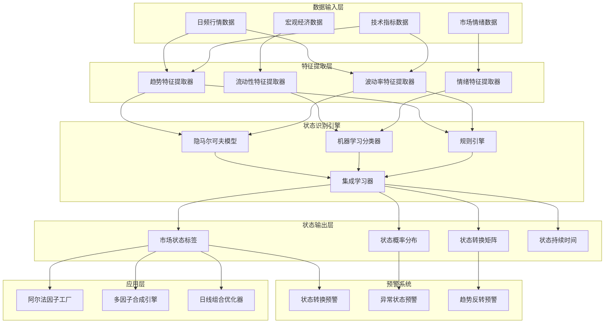

> **版本**: v1.0
> **创建日期**: 2026-04-06
> **核心定位**: 为中观策略层提供市场状态识别能力
> **索引**: `MARKET_REGIME_DETECTION_001`
> **开发周期**: 2.5周

---

## 📋 执行摘要

市场状态识别系统是清风量化系统中观策略层的核心模块，负责识别当前市场所处的状态（牛市、熊市、震荡市等），为多因子合成引擎和日线组合优化器提供市场环境判断依据。

### 核心价值

- **多维度状态识别**: 结合趋势、波动率、流动性等多个维度
- **实时状态监控**: 日度更新，及时捕捉市场状态转换
- **历史回溯分析**: 提供完整的历史市场状态序列
- **状态转换预警**: 提前预警市场状态可能发生的变化

---

## 🎯 模块定位与职责

### 层级定位

```
┌─────────────────────────────────────────────────────────┐
│           清风量化系统 - 三级时间框架架构                │
├─────────────────────────────────────────────────────────┤
│  第一级：宏观配置层（季度/年度）                         │
│  第二级：中观策略层（周度/日度）                         │
│    ├─ 市场状态识别系统（本模块）                        │
│    ├─ 阿尔法因子工厂                                    │
│    ├─ 多因子合成引擎                                    │
│    └─ 日线组合优化器                                    │
│  第三级：微观执行层（日内/分钟/秒级）                    │
└─────────────────────────────────────────────────────────┘
```

### 核心职责

| 职责类别 | 具体职责 | 输出产物 |
|---------|---------|---------|
| **状态识别** | 识别当前市场状态 | 市场状态标签 |
| **特征提取** | 提取市场特征指标 | 特征向量 |
| **模型训练** | 训练状态识别模型 | 训练好的模型 |
| **状态预测** | 预测未来市场状态 | 状态预测结果 |
| **转换预警** | 预警状态转换 | 预警信号 |

### 非职责边界

- ❌ **因子计算**: 由阿尔法因子工厂负责
- ❌ **组合优化**: 由日线组合优化器负责
- ❌ **交易执行**: 由微观执行层负责
- ❌ **经济范式判断**: 由宏观配置层负责

---

## 🏗️ 架构设计

### 整体架构



### 市场状态定义

| 状态代码 | 状态名称 | 特征描述 | 典型表现 |
|---------|---------|---------|---------|
| **BULL** | 牛市 | 趋势向上，波动率适中 | 指数持续上涨，成交量放大 |
| **BEAR** | 熊市 | 趋势向下，波动率较高 | 指数持续下跌，恐慌情绪浓厚 |
| **SIDEWAYS** | 震荡市 | 无明显趋势，波动率较低 | 指数横盘整理，成交量萎缩 |
| **HIGH_VOL** | 高波动市 | 波动率异常高 | 指数剧烈波动，不确定性高 |
| **CRISIS** | 危机市 | 极端下跌，流动性枯竭 | 指数暴跌，市场恐慌 |

---

## 🔧 关键组件设计

### 1. 特征提取器 (Feature Extractor)

```python
from typing import Dict, Any, List
import pandas as pd
import numpy as np
from scipy import stats

class MarketFeatureExtractor:
    """市场特征提取器"""
    
    def __init__(self):
        self.trend_extractor = TrendFeatureExtractor()
        self.volatility_extractor = VolatilityFeatureExtractor()
        self.liquidity_extractor = LiquidityFeatureExtractor()
        self.sentiment_extractor = SentimentFeatureExtractor()
        
    def extract_features(self, 
                        market_data: pd.DataFrame,
                        window: int = 20) -> pd.DataFrame:
        """提取市场特征"""
        features = pd.DataFrame(index=market_data.index)
        
        # 提取趋势特征
        trend_features = self.trend_extractor.extract(market_data, window)
        features = pd.concat([features, trend_features], axis=1)
        
        # 提取波动率特征
        volatility_features = self.volatility_extractor.extract(market_data, window)
        features = pd.concat([features, volatility_features], axis=1)
        
        # 提取流动性特征
        liquidity_features = self.liquidity_extractor.extract(market_data, window)
        features = pd.concat([features, liquidity_features], axis=1)
        
        # 提取情绪特征
        sentiment_features = self.sentiment_extractor.extract(market_data, window)
        features = pd.concat([features, sentiment_features], axis=1)
        
        return features


class TrendFeatureExtractor:
    """趋势特征提取器"""
    
    def extract(self, data: pd.DataFrame, window: int) -> pd.DataFrame:
        """提取趋势特征"""
        features = pd.DataFrame(index=data.index)
        
        # 1. 移动平均线斜率
        features['ma_slope'] = self._calculate_ma_slope(data['close'], window)
        
        # 2. 价格动量
        features['momentum'] = data['close'].pct_change(window)
        
        # 3. 趋势强度（ADX）
        features['adx'] = self._calculate_adx(data, window)
        
        # 4. 价格位置（相对于N日高低点）
        features['price_position'] = (data['close'] - data['low'].rolling(window).min()) / \
                                     (data['high'].rolling(window).max() - data['low'].rolling(window).min())
        
        # 5. MACD
        features['macd'], features['macd_signal'], features['macd_hist'] = \
            self._calculate_macd(data['close'])
        
        return features
    
    def _calculate_ma_slope(self, prices: pd.Series, window: int) -> pd.Series:
        """计算移动平均线斜率"""
        ma = prices.rolling(window).mean()
        slope = ma.diff() / ma.shift(1)
        return slope
    
    def _calculate_adx(self, data: pd.DataFrame, window: int) -> pd.Series:
        """计算ADX指标"""
        high = data['high']
        low = data['low']
        close = data['close']
        
        plus_dm = high.diff()
        minus_dm = -low.diff()
        
        plus_dm[plus_dm < 0] = 0
        minus_dm[minus_dm < 0] = 0
        
        tr = self._calculate_true_range(data)
        atr = tr.rolling(window).mean()
        
        plus_di = 100 * (plus_dm.rolling(window).mean() / atr)
        minus_di = 100 * (minus_dm.rolling(window).mean() / atr)
        
        dx = 100 * abs(plus_di - minus_di) / (plus_di + minus_di)
        adx = dx.rolling(window).mean()
        
        return adx
    
    def _calculate_true_range(self, data: pd.DataFrame) -> pd.Series:
        """计算真实波幅"""
        high = data['high']
        low = data['low']
        close = data['close']
        
        tr1 = high - low
        tr2 = abs(high - close.shift(1))
        tr3 = abs(low - close.shift(1))
        
        tr = pd.concat([tr1, tr2, tr3], axis=1).max(axis=1)
        return tr
    
    def _calculate_macd(self, prices: pd.Series) -> tuple:
        """计算MACD指标"""
        ema12 = prices.ewm(span=12, adjust=False).mean()
        ema26 = prices.ewm(span=26, adjust=False).mean()
        
        macd = ema12 - ema26
        signal = macd.ewm(span=9, adjust=False).mean()
        hist = macd - signal
        
        return macd, signal, hist


class VolatilityFeatureExtractor:
    """波动率特征提取器"""
    
    def extract(self, data: pd.DataFrame, window: int) -> pd.DataFrame:
        """提取波动率特征"""
        features = pd.DataFrame(index=data.index)
        
        # 1. 历史波动率
        features['historical_vol'] = data['close'].pct_change().rolling(window).std() * np.sqrt(252)
        
        # 2. Parkinson波动率
        features['parkinson_vol'] = self._calculate_parkinson_volatility(data, window)
        
        # 3. Garman-Klass波动率
        features['garman_klass_vol'] = self._calculate_garman_klass_volatility(data, window)
        
        # 4. 波动率偏度
        features['vol_skew'] = data['close'].pct_change().rolling(window).skew()
        
        # 5. 波动率峰度
        features['vol_kurtosis'] = data['close'].pct_change().rolling(window).kurt()
        
        # 6. VIX-like指标
        features['vix_like'] = features['historical_vol'] * 100
        
        return features
    
    def _calculate_parkinson_volatility(self, data: pd.DataFrame, window: int) -> pd.Series:
        """计算Parkinson波动率"""
        high = data['high']
        low = data['low']
        
        hl_ratio = np.log(high / low)
        parkinson_vol = np.sqrt(
            (hl_ratio ** 2).rolling(window).mean() / (4 * np.log(2))
        ) * np.sqrt(252)
        
        return parkinson_vol
    
    def _calculate_garman_klass_volatility(self, data: pd.DataFrame, window: int) -> pd.Series:
        """计算Garman-Klass波动率"""
        high = data['high']
        low = data['low']
        close = data['close']
        open_price = data['open']
        
        hl_log = np.log(high / low)
        co_log = np.log(close / open_price)
        
        gk_vol = np.sqrt(
            (0.5 * hl_log ** 2 - (2 * np.log(2) - 1) * co_log ** 2).rolling(window).mean()
        ) * np.sqrt(252)
        
        return gk_vol


class LiquidityFeatureExtractor:
    """流动性特征提取器"""
    
    def extract(self, data: pd.DataFrame, window: int) -> pd.DataFrame:
        """提取流动性特征"""
        features = pd.DataFrame(index=data.index)
        
        # 1. 成交量变化率
        features['volume_change'] = data['volume'].pct_change(window)
        
        # 2. 成交额变化率
        features['amount_change'] = data['amount'].pct_change(window) if 'amount' in data.columns else 0
        
        # 3. 换手率
        features['turnover_rate'] = data['turnover_rate'] if 'turnover_rate' in data.columns else \
            data['volume'] / data['volume'].rolling(window).mean()
        
        # 4. Amihud非流动性指标
        features['amihud_illiquidity'] = self._calculate_amihud_illiquidity(data, window)
        
        # 5. 成交量加权价格偏离
        features['vwap_deviation'] = self._calculate_vwap_deviation(data, window)
        
        return features
    
    def _calculate_amihud_illiquidity(self, data: pd.DataFrame, window: int) -> pd.Series:
        """计算Amihud非流动性指标"""
        returns = abs(data['close'].pct_change())
        volume = data['volume']
        
        illiquidity = (returns / volume).rolling(window).mean()
        return illiquidity
    
    def _calculate_vwap_deviation(self, data: pd.DataFrame, window: int) -> pd.Series:
        """计算VWAP偏离度"""
        typical_price = (data['high'] + data['low'] + data['close']) / 3
        vwap = (typical_price * data['volume']).rolling(window).sum() / \
               data['volume'].rolling(window).sum()
        
        deviation = (data['close'] - vwap) / vwap
        return deviation


class SentimentFeatureExtractor:
    """情绪特征提取器"""
    
    def extract(self, data: pd.DataFrame, window: int) -> pd.DataFrame:
        """提取情绪特征"""
        features = pd.DataFrame(index=data.index)
        
        # 1. 涨跌停比例
        features['limit_ratio'] = self._calculate_limit_ratio(data, window)
        
        # 2. 上涨下跌比例
        features['advance_decline_ratio'] = self._calculate_advance_decline_ratio(data, window)
        
        # 3. 新高新低比例
        features['new_high_low_ratio'] = self._calculate_new_high_low_ratio(data, window)
        
        # 4. 市场宽度
        features['market_breadth'] = self._calculate_market_breadth(data, window)
        
        return features
    
    def _calculate_limit_ratio(self, data: pd.DataFrame, window: int) -> pd.Series:
        """计算涨跌停比例"""
        # 简化实现：使用价格变化率代替
        price_change = data['close'].pct_change()
        limit_up = (price_change >= 0.095).rolling(window).mean()
        limit_down = (price_change <= -0.095).rolling(window).mean()
        
        return limit_up / (limit_down + 1e-10)
    
    def _calculate_advance_decline_ratio(self, data: pd.DataFrame, window: int) -> pd.Series:
        """计算上涨下跌比例"""
        price_change = data['close'].pct_change()
        advance = (price_change > 0).rolling(window).mean()
        decline = (price_change < 0).rolling(window).mean()
        
        return advance / (decline + 1e-10)
    
    def _calculate_new_high_low_ratio(self, data: pd.DataFrame, window: int) -> pd.Series:
        """计算新高新低比例"""
        new_high = (data['close'] == data['high'].rolling(window).max()).rolling(window).mean()
        new_low = (data['close'] == data['low'].rolling(window).min()).rolling(window).mean()
        
        return new_high / (new_low + 1e-10)
    
    def _calculate_market_breadth(self, data: pd.DataFrame, window: int) -> pd.Series:
        """计算市场宽度"""
        # 使用价格相对于移动平均线的位置
        ma = data['close'].rolling(window).mean()
        breadth = (data['close'] > ma).rolling(window).mean()
        
        return breadth
```

### 2. 隐马尔可夫模型 (Hidden Markov Model)

```python
from typing import Dict, Any, List, Tuple
import pandas as pd
import numpy as np
from hmmlearn import hmm

class MarketRegimeHMM:
    """基于隐马尔可夫模型的市场状态识别"""
    
    def __init__(self, n_states: int = 5):
        self.n_states = n_states
        self.model = None
        self.state_names = {
            0: 'BULL',
            1: 'BEAR',
            2: 'SIDEWAYS',
            3: 'HIGH_VOL',
            4: 'CRISIS'
        }
        
    def train(self, features: pd.DataFrame) -> None:
        """训练HMM模型"""
        # 准备训练数据
        X = features.values
        
        # 标准化
        from sklearn.preprocessing import StandardScaler
        scaler = StandardScaler()
        X_scaled = scaler.fit_transform(X)
        
        # 训练HMM模型
        self.model = hmm.GaussianHMM(
            n_components=self.n_states,
            covariance_type='full',
            n_iter=100,
            random_state=42
        )
        
        self.model.fit(X_scaled)
        self.scaler = scaler
        
    def predict(self, features: pd.DataFrame) -> Tuple[pd.Series, pd.DataFrame]:
        """预测市场状态"""
        X = features.values
        X_scaled = self.scaler.transform(X)
        
        # 预测隐状态序列
        hidden_states = self.model.predict(X_scaled)
        
        # 计算状态概率
        state_probs = self.model.predict_proba(X_scaled)
        
        # 转换为DataFrame
        state_series = pd.Series(
            [self.state_names[s] for s in hidden_states],
            index=features.index
        )
        
        state_probs_df = pd.DataFrame(
            state_probs,
            index=features.index,
            columns=[self.state_names[i] for i in range(self.n_states)]
        )
        
        return state_series, state_probs_df
    
    def get_transition_matrix(self) -> pd.DataFrame:
        """获取状态转移矩阵"""
        transmat = self.model.transmat_
        
        transmat_df = pd.DataFrame(
            transmat,
            index=[self.state_names[i] for i in range(self.n_states)],
            columns=[self.state_names[i] for i in range(self.n_states)]
        )
        
        return transmat_df
    
    def get_state_duration(self, state_series: pd.Series) -> Dict[str, float]:
        """计算各状态平均持续时间"""
        durations = {}
        
        for state_name in self.state_names.values():
            state_mask = state_series == state_name
            state_changes = state_mask.astype(int).diff().fillna(0)
            
            starts = state_changes[state_changes == 1].index
            ends = state_changes[state_changes == -1].index
            
            if len(starts) > 0 and len(ends) > 0:
                if starts[0] > ends[0]:
                    ends = ends[1:]
                if len(starts) > len(ends):
                    starts = starts[:len(ends)]
                
                duration_list = [(end - start).days for start, end in zip(starts, ends)]
                durations[state_name] = np.mean(duration_list) if duration_list else 0
            else:
                durations[state_name] = 0
        
        return durations
```

### 3. 机器学习分类器 (ML Classifier)

```python
from typing import Dict, Any, List
import pandas as pd
import numpy as np
from sklearn.ensemble import RandomForestClassifier, GradientBoostingClassifier
from sklearn.model_selection import train_test_split
from sklearn.metrics import classification_report, confusion_matrix

class MarketRegimeClassifier:
    """基于机器学习的市场状态分类器"""
    
    def __init__(self, model_type: str = 'random_forest'):
        self.model_type = model_type
        self.model = None
        self.state_names = ['BULL', 'BEAR', 'SIDEWAYS', 'HIGH_VOL', 'CRISIS']
        
        if model_type == 'random_forest':
            self.model = RandomForestClassifier(
                n_estimators=100,
                max_depth=10,
                random_state=42,
                n_jobs=-1
            )
        elif model_type == 'gradient_boosting':
            self.model = GradientBoostingClassifier(
                n_estimators=100,
                max_depth=5,
                random_state=42
            )
    
    def create_labels(self, 
                     returns: pd.Series,
                     volatility: pd.Series) -> pd.Series:
        """创建训练标签"""
        labels = pd.Series(index=returns.index, dtype=str)
        
        # 定义标签规则
        for i in range(len(returns)):
            ret = returns.iloc[i]
            vol = volatility.iloc[i]
            
            if ret > 0.02 and vol < 0.20:
                labels.iloc[i] = 'BULL'
            elif ret < -0.02 and vol > 0.25:
                labels.iloc[i] = 'BEAR'
            elif abs(ret) < 0.01 and vol < 0.15:
                labels.iloc[i] = 'SIDEWAYS'
            elif vol > 0.35:
                labels.iloc[i] = 'HIGH_VOL'
            elif ret < -0.05 and vol > 0.40:
                labels.iloc[i] = 'CRISIS'
            else:
                labels.iloc[i] = 'SIDEWAYS'
        
        return labels
    
    def train(self, 
             features: pd.DataFrame,
             labels: pd.Series) -> Dict[str, Any]:
        """训练分类器"""
        # 分割训练集和测试集
        X_train, X_test, y_train, y_test = train_test_split(
            features, labels, test_size=0.2, random_state=42
        )
        
        # 训练模型
        self.model.fit(X_train, y_train)
        
        # 评估模型
        y_pred = self.model.predict(X_test)
        
        report = classification_report(y_test, y_pred, output_dict=True)
        cm = confusion_matrix(y_test, y_pred)
        
        return {
            'classification_report': report,
            'confusion_matrix': cm,
            'feature_importance': dict(zip(features.columns, self.model.feature_importances_))
        }
    
    def predict(self, features: pd.DataFrame) -> Tuple[pd.Series, pd.DataFrame]:
        """预测市场状态"""
        predictions = self.model.predict(features)
        probabilities = self.model.predict_proba(features)
        
        state_series = pd.Series(predictions, index=features.index)
        
        state_probs_df = pd.DataFrame(
            probabilities,
            index=features.index,
            columns=self.model.classes_
        )
        
        return state_series, state_probs_df
```

### 4. 集成学习器 (Ensemble Learner)

```python
from typing import Dict, Any, List, Tuple
import pandas as pd
import numpy as np

class MarketRegimeEnsemble:
    """市场状态识别集成学习器"""
    
    def __init__(self):
        self.hmm_model = MarketRegimeHMM()
        self.ml_classifier = MarketRegimeClassifier()
        self.rule_engine = MarketRegimeRuleEngine()
        
        # 权重配置
        self.weights = {
            'hmm': 0.4,
            'ml': 0.4,
            'rule': 0.2
        }
        
    def train(self, 
             features: pd.DataFrame,
             returns: pd.Series,
             volatility: pd.Series) -> None:
        """训练所有模型"""
        # 训练HMM
        self.hmm_model.train(features)
        
        # 创建标签并训练ML分类器
        labels = self.ml_classifier.create_labels(returns, volatility)
        self.ml_classifier.train(features, labels)
        
    def predict(self, features: pd.DataFrame) -> Tuple[pd.Series, pd.DataFrame]:
        """集成预测"""
        # HMM预测
        hmm_states, hmm_probs = self.hmm_model.predict(features)
        
        # ML预测
        ml_states, ml_probs = self.ml_classifier.predict(features)
        
        # 规则引擎预测
        rule_states, rule_probs = self.rule_engine.predict(features)
        
        # 加权投票
        final_states = self._weighted_voting(
            hmm_states, ml_states, rule_states,
            hmm_probs, ml_probs, rule_probs
        )
        
        # 计算最终概率
        final_probs = self._weighted_probability(
            hmm_probs, ml_probs, rule_probs
        )
        
        return final_states, final_probs
    
    def _weighted_voting(self,
                        hmm_states: pd.Series,
                        ml_states: pd.Series,
                        rule_states: pd.Series,
                        hmm_probs: pd.DataFrame,
                        ml_probs: pd.DataFrame,
                        rule_probs: pd.DataFrame) -> pd.Series:
        """加权投票"""
        final_states = pd.Series(index=hmm_states.index, dtype=str)
        
        for idx in hmm_states.index:
            scores = {}
            
            for state in self.hmm_model.state_names.values():
                score = 0
                if hmm_states.loc[idx] == state:
                    score += self.weights['hmm']
                if ml_states.loc[idx] == state:
                    score += self.weights['ml']
                if rule_states.loc[idx] == state:
                    score += self.weights['rule']
                
                # 加上概率权重
                if state in hmm_probs.columns:
                    score += self.weights['hmm'] * hmm_probs.loc[idx, state]
                if state in ml_probs.columns:
                    score += self.weights['ml'] * ml_probs.loc[idx, state]
                if state in rule_probs.columns:
                    score += self.weights['rule'] * rule_probs.loc[idx, state]
                
                scores[state] = score
            
            final_states.loc[idx] = max(scores, key=scores.get)
        
        return final_states
    
    def _weighted_probability(self,
                             hmm_probs: pd.DataFrame,
                             ml_probs: pd.DataFrame,
                             rule_probs: pd.DataFrame) -> pd.DataFrame:
        """加权概率"""
        all_states = list(set(
            hmm_probs.columns.tolist() +
            ml_probs.columns.tolist() +
            rule_probs.columns.tolist()
        ))
        
        final_probs = pd.DataFrame(
            index=hmm_probs.index,
            columns=all_states,
            dtype=float
        )
        
        for state in all_states:
            prob = 0
            if state in hmm_probs.columns:
                prob += self.weights['hmm'] * hmm_probs[state]
            if state in ml_probs.columns:
                prob += self.weights['ml'] * ml_probs[state]
            if state in rule_probs.columns:
                prob += self.weights['rule'] * rule_probs[state]
            
            final_probs[state] = prob
        
        # 归一化
        final_probs = final_probs.div(final_probs.sum(axis=1), axis=0)
        
        return final_probs


class MarketRegimeRuleEngine:
    """基于规则的市场状态识别引擎"""
    
    def __init__(self):
        self.state_names = ['BULL', 'BEAR', 'SIDEWAYS', 'HIGH_VOL', 'CRISIS']
        
    def predict(self, features: pd.DataFrame) -> Tuple[pd.Series, pd.DataFrame]:
        """基于规则预测市场状态"""
        states = pd.Series(index=features.index, dtype=str)
        probs = pd.DataFrame(
            0.0,
            index=features.index,
            columns=self.state_names
        )
        
        for idx in features.index:
            state, prob = self._apply_rules(features.loc[idx])
            states.loc[idx] = state
            probs.loc[idx] = prob
        
        return states, probs
    
    def _apply_rules(self, features: pd.Series) -> Tuple[str, pd.Series]:
        """应用规则"""
        probs = pd.Series(0.0, index=self.state_names)
        
        # 规则1: 趋势判断
        if features.get('ma_slope', 0) > 0.01 and features.get('adx', 0) > 25:
            probs['BULL'] += 0.3
        elif features.get('ma_slope', 0) < -0.01 and features.get('adx', 0) > 25:
            probs['BEAR'] += 0.3
        else:
            probs['SIDEWAYS'] += 0.3
        
        # 规则2: 波动率判断
        if features.get('historical_vol', 0) > 0.35:
            probs['HIGH_VOL'] += 0.3
        elif features.get('historical_vol', 0) > 0.45 and features.get('momentum', 0) < -0.05:
            probs['CRISIS'] += 0.4
        
        # 规则3: 动量判断
        if features.get('momentum', 0) > 0.05:
            probs['BULL'] += 0.2
        elif features.get('momentum', 0) < -0.05:
            probs['BEAR'] += 0.2
        
        # 规则4: 流动性判断
        if features.get('amihud_illiquidity', 0) > 1e-8:
            probs['CRISIS'] += 0.2
        
        # 归一化概率
        if probs.sum() > 0:
            probs = probs / probs.sum()
        else:
            probs['SIDEWAYS'] = 1.0
        
        # 选择最大概率的状态
        state = probs.idxmax()
        
        return state, probs
```

---

## 📊 数据模型设计

### 市场状态识别结果表

```sql
CREATE TABLE market_regime_detection (
    id BIGINT AUTO_INCREMENT PRIMARY KEY,
    trade_date DATE NOT NULL COMMENT '交易日期',
    market_state VARCHAR(20) NOT NULL COMMENT '市场状态',
    state_probability DECIMAL(5, 4) COMMENT '状态概率',
    bull_prob DECIMAL(5, 4) COMMENT '牛市概率',
    bear_prob DECIMAL(5, 4) COMMENT '熊市概率',
    sideways_prob DECIMAL(5, 4) COMMENT '震荡市概率',
    high_vol_prob DECIMAL(5, 4) COMMENT '高波动市概率',
    crisis_prob DECIMAL(5, 4) COMMENT '危机市概率',
    detection_method VARCHAR(50) COMMENT '检测方法',
    confidence_score DECIMAL(5, 4) COMMENT '置信度分数',
    created_time TIMESTAMP DEFAULT CURRENT_TIMESTAMP COMMENT '创建时间',
    UNIQUE KEY uk_trade_date (trade_date),
    INDEX idx_market_state (market_state),
    INDEX idx_trade_date (trade_date)
) COMMENT '市场状态识别结果表';
```

### 市场特征表

```sql
CREATE TABLE market_features (
    id BIGINT AUTO_INCREMENT PRIMARY KEY,
    trade_date DATE NOT NULL COMMENT '交易日期',
    feature_name VARCHAR(50) NOT NULL COMMENT '特征名称',
    feature_value DECIMAL(20, 10) COMMENT '特征值',
    feature_category VARCHAR(50) COMMENT '特征类别',
    created_time TIMESTAMP DEFAULT CURRENT_TIMESTAMP COMMENT '创建时间',
    UNIQUE KEY uk_date_feature (trade_date, feature_name),
    INDEX idx_trade_date (trade_date),
    INDEX idx_feature_category (feature_category)
) COMMENT '市场特征表';
```

### 状态转换记录表

```sql
CREATE TABLE regime_transition_log (
    id BIGINT AUTO_INCREMENT PRIMARY KEY,
    transition_date DATE NOT NULL COMMENT '转换日期',
    from_state VARCHAR(20) NOT NULL COMMENT '原状态',
    to_state VARCHAR(20) NOT NULL COMMENT '新状态',
    transition_probability DECIMAL(5, 4) COMMENT '转换概率',
    duration_days INT COMMENT '状态持续天数',
    created_time TIMESTAMP DEFAULT CURRENT_TIMESTAMP COMMENT '创建时间',
    INDEX idx_transition_date (transition_date),
    INDEX idx_from_state (from_state),
    INDEX idx_to_state (to_state)
) COMMENT '状态转换记录表';
```

---

## 🔌 接口规范

### RESTful API接口

#### 1. 获取当前市场状态

```
GET /api/v1/market/regime/current

Response:
{
    "status": "success",
    "data": {
        "trade_date": "2024-12-06",
        "market_state": "BULL",
        "state_probability": 0.75,
        "probabilities": {
            "BULL": 0.75,
            "BEAR": 0.10,
            "SIDEWAYS": 0.10,
            "HIGH_VOL": 0.04,
            "CRISIS": 0.01
        },
        "confidence_score": 0.85
    }
}
```

#### 2. 获取历史市场状态

```
GET /api/v1/market/regime/history?start_date=2024-01-01&end_date=2024-12-31

Response:
{
    "status": "success",
    "data": [
        {
            "trade_date": "2024-12-06",
            "market_state": "BULL",
            "state_probability": 0.75
        },
        ...
    ]
}
```

#### 3. 获取状态转换预警

```
GET /api/v1/market/regime/alert

Response:
{
    "status": "success",
    "alerts": [
        {
            "alert_type": "regime_transition",
            "current_state": "BULL",
            "predicted_state": "SIDEWAYS",
            "transition_probability": 0.35,
            "alert_time": "2024-12-06T10:00:00Z"
        }
    ]
}
```

---

## 🚀 实施要点

### 阶段1：特征提取器开发（第1周）

**任务**:
1. ✅ 实现趋势特征提取器
2. ✅ 实现波动率特征提取器
3. ✅ 实现流动性特征提取器
4. ✅ 实现情绪特征提取器
5. ✅ 编写单元测试

**验收标准**:
- 所有特征可以正确提取
- 特征值范围合理
- 单元测试覆盖率≥80%

---

### 阶段2：模型开发（第1-2周）

**任务**:
1. ✅ 实现HMM模型
2. ✅ 实现ML分类器
3. ✅ 实现规则引擎
4. ✅ 实现集成学习器
5. ✅ 编写单元测试

**验收标准**:
- 所有模型可以正常训练和预测
- 模型性能达标
- 单元测试覆盖率≥80%

---

### 阶段3：集成测试与优化（第2-3周）

**任务**:
1. ✅ 编写集成测试用例
2. ✅ 执行模型性能评估
3. ✅ 优化模型参数
4. ✅ 部署到生产环境
5. ✅ 编写部署文档

**验收标准**:
- 集成测试全部通过
- 模型准确率≥80%
- 部署文档完整

---

## 🧪 测试策略

### 单元测试

```python
import pytest
import pandas as pd
import numpy as np

def test_trend_feature_extractor():
    """测试趋势特征提取器"""
    extractor = TrendFeatureExtractor()
    
    # 创建测试数据
    data = pd.DataFrame({
        'open': [100, 101, 102, 103, 104],
        'high': [105, 106, 107, 108, 109],
        'low': [95, 96, 97, 98, 99],
        'close': [102, 103, 104, 105, 106]
    })
    
    # 提取特征
    features = extractor.extract(data, window=3)
    
    # 验证结果
    assert 'ma_slope' in features.columns
    assert 'momentum' in features.columns
    assert 'adx' in features.columns


def test_hmm_model():
    """测试HMM模型"""
    model = MarketRegimeHMM(n_states=5)
    
    # 创建测试数据
    features = pd.DataFrame(
        np.random.randn(100, 10),
        columns=[f'feature_{i}' for i in range(10)]
    )
    
    # 训练模型
    model.train(features)
    
    # 预测
    states, probs = model.predict(features)
    
    # 验证结果
    assert len(states) == len(features)
    assert probs.shape == (len(features), 5)
```

---

## 📈 性能指标

### 模型性能要求

| 指标 | 目标值 |
|------|--------|
| **状态识别准确率** | ≥80% |
| **状态转换召回率** | ≥70% |
| **预测延迟** | <1秒 |
| **模型更新频率** | 每日 |

### 特征提取性能

| 特征类型 | 计算时间 |
|---------|---------|
| **趋势特征** | <100ms |
| **波动率特征** | <150ms |
| **流动性特征** | <100ms |
| **情绪特征** | <200ms |

---

## 🔗 相关文档

- [阿尔法因子工厂蓝图](./ALPHA_FACTOR_FACTORY_BLUEPRINT.md)
- 多因子合成引擎蓝图
- 专业多时间框架策略架构

---

## 📝 变更历史

| 版本 | 日期 | 变更内容 | 作者 |
|------|------|---------|------|
| v1.0.0 | 2026-04-06 | 初始版本创建 | 首席架构师 |

---

**蓝图状态**: ✅ 设计完成
**下一步**: 开始实施阶段1 - 特征提取器开发
---

## 1. 文档治理

### 1.1 System_Manifest.md索引

```markdown
#### Layer 3: 中观策略层
##### 6.001. Meso Market Regime
- **模块ID**: MARKET_REGIME_DETECTION_001
- **蓝图文档**: MARKET_REGIME_DETECTION_BLUEPRINT.md
- **技术规格书**: 待创建
- **职责**: 中观策略层市场状态识别
- **状态**: Active
```

### 1.2 模块职责边界

| 模块 | 职责 | 边界 |
|------|------|------|
| **Meso Market Regime** | 中观策略层市场状态识别 | **核心模块** |

### 1.3 版本管理

| 版本 | 日期 | 变更内容 | 变更人 |
|------|------|----------|--------|
| v1.0.0 | 2026-04-06 | 初始版本创建 | 首席蓝图架构师 |

---

**蓝图版本**: v1.0.0 | **创建日期**: 2026-04-06 | **状态**: Active
