---
responsibility:
  - 多目标优åŒ?
  - 帕累托最优解生成
  - 目标权衡分析
  - 优化算法选择

module_id: MULTI_OBJECTIVE_OPTIMIZATION_001
version: 1.0.0
status: Active
created_date: 2026-04-07
last_updated: 2026-04-07
owner: 实施团队
standard_type: 专业量化机构蓝图
applicable_scope: Layer 6 组合优化å±?
compliance_level: 专业标准
layer: Layer 5.2 (组合优化)
---

# 多目标优化蓝å›?

## 核心定位

负责多目标优化的设计与实现，平衡多个投资目标。


> **核心职责**: 同时优化收益、风险、流动性等多个目标
> **职责边界**: 
> - âœ?本文档负责：多目标优化、帕累托最优解生成
> - â?本文档不负责：因子计算（由因子模块负责）


## 核心定位

负责Multi Objective Optimization的设计、实现和维护，提供核心功能支持，确保系统模块的稳定运行和高效执行ã€?

## 1. 概述

### 1.1 模块定位

**Layer定位**: Layer 6 - 组合优化层（约束求解模块ï¼?

**核心价å€?*:
- 支持同时优化多个冲突目标（如最大化收益、最小化风险、最小化成本ï¼?
- 生成Pareto前沿，提供多解选择
- 支持加权求和法、Î?约束法、NSGA-II等多种算æ³?

**业务价å€?*:
- 更真实的投资决策场景
- 多维度权衡分æž?
- 灵活的风险收益平è¡?

### 1.2 版本信息

| 项目 | 内容 |
|------|------|
| **模块ID** | MULTI_OBJECTIVE_OPTIMIZATION_001 |
| **版本** | v1.0.0 |
| **开源依èµ?* | cvxpy, pymoo |
| **预计工时** | 5-7å¤?|

---
## 📚 相关文档

### 上游依赖

| 文档名称 | module_id | 依赖类型 | 说明 |
|---------|-----------|---------|------|
| [组合优化引擎集成蓝图](./PORTFOLIO_OPTIMIZER_INTEGRATION_BLUEPRINT.md) | PORTFOLIO_OPTIMIZER_INTEGRATION_001 | 强依èµ?| 提供优化器基础接口 |
| [数据质量监控蓝图](./DATA_QUALITY_MONITORING_BLUEPRINT.md) | DATA_QUALITY_MONITORING_001 | 强依èµ?| 提供数据质量指标 |
| [PORTFOLIO_CONSTRAINT_MANAGEMENT_BLUEPRINT.md](./PORTFOLIO_CONSTRAINT_MANAGEMENT_BLUEPRINT.md) | PORTFOLIO_CONSTRAINT_MANAGEMENT_001 | 强依èµ?| 提供约束条件 |

### 下游依赖

| 文档名称 | module_id | 依赖类型 | 说明 |
|---------|-----------|---------|------|
| [STRATEGIC_ALLOCATION_ENGINE_BLUEPRINT.md](./STRATEGIC_ALLOCATION_ENGINE_BLUEPRINT.md) | STRATEGIC_ALLOCATION_ENGINE_001 | 强依èµ?| 战略资产配置优化 |
| [PORTFOLIO_SCENARIO_ANALYSIS_BLUEPRINT.md](./PORTFOLIO_SCENARIO_ANALYSIS_BLUEPRINT.md) | PORTFOLIO_SCENARIO_ANALYSIS_001 | 中依èµ?| 场景分析优化 |
| [RISK_PARITY_STRATEGY_BLUEPRINT.md](./RISK_PARITY_STRATEGY_BLUEPRINT.md) | RISK_PARITY_STRATEGY_001 | 中依èµ?| 风险平价策略 |

### 技术依èµ?

| 技术组ä»?| 版本 | 用é€?| 文档 |
|---------|------|------|------|
| **CVXPY** | 1.5+ | 凸优化求è§?| [官方文档](https://www.cvxpy.org/) |
| **pymoo** | 0.6+ | 多目标优åŒ?| [官方文档](https://pymoo.org/) |
| **NumPy** | 1.24+ | 数值计ç®?| [官方文档](https://numpy.org/) |
| **SciPy** | 1.11+ | 科学计算 | [官方文档](https://scipy.org/) |

### 引用关系å›?

```mermaid
graph LR
    A[组合优化引擎] --> B[多目标优化]
    C[数据质量监控] --> B
    D[组合约束管理] --> B
    
    B --> E[战略资产配置]
    B --> F[场景分析]
    B --> G[风险平价策略]
    
    style B fill:#ff6b6b
    style A fill:#4ecdc4
    style D fill:#45b7d1
```



---

## 2. 技术实çŽ?

### 2.1 核心API

```python
from cvxpy import *
import pymoo as mo
from pymoo.algorithms.moo.nsga2 import NSGA2
from pymoo.operators.crossover.sbx import SBX
from pymoo.operators.mutation.polynomial import PolynomialMutation

class MultiObjectiveOptimizer:
    """多目标优化器"""
    
    def __init__(self, n_assets: int):
        self.n_assets = n_assets
        
    def optimize_weighted_sum(
        self,
        returns: np.ndarray,
        cov_matrix: np.ndarray,
        risk_weight: float = 0.5
    ) -> np.ndarray:
        """
        加权求和æ³?
        
        Args:
            returns: 预期收益çŽ?
            cov_matrix: 协方差矩é˜?
            risk_weight: 风险权重 (1-risk_weight为收益权é‡?
        
        Returns:
            最优权é‡?
        """
        w = Variable(self.n_assets)
        portfolio_return = returns @ w
        portfolio_variance = quad_form(w, cov_matrix)
        
        objective = Maximize((1 - risk_weight) * portfolio_return 
                           - risk_weight * portfolio_variance)
        
        constraints = [sum(w) == 1, w >= 0]
        
        problem = Problem(objective, constraints)
        problem.solve()
        
        return w.value
    
    def optimize_pareto_front(
        self,
        returns: np.ndarray,
        cov_matrix: np.ndarray,
        n_solutions: int = 50
    ) -> np.ndarray:
        """
        NSGA-II Pareto前沿优化
        
        Returns:
            Pareto最优解é›?
        """
        problem = PortfolioProblem(returns, cov_matrix)
        
        algorithm = NSGA2(
            pop_size=100,
            crossover=SBX(prob=0.9, eta=15),
            mutation=PolynomialMutation(eta=20),
            n_offsprings=10
        )
        
        from pymoo.optimize import minimize
        result = minimize(problem, algorithm, 
                        ('n_gen', 200),
                        verbose=False)
        
        return result.X
```

---

## 3. 接口定义

```python
class MultiObjectiveAPI:
    """多目标优化API"""
    
    @endpoint("/api/v1/multi_objective/weighted")
    async def optimize_weighted(
        self,
        returns: List[float],
        cov_matrix: List[List[float]],
        risk_weight: float
    ) -> OptimizationResult:
        """加权求和优化"""
        
    @endpoint("/api/v1/multi_objective/pareto")
    async def optimize_pareto(
        self,
        returns: List[float],
        cov_matrix: List[List[float]],
        n_solutions: int = 50
    ) -> ParetoResult:
        """Pareto前沿优化"""
        
    @endpoint("/api/v1/multi_objective/epsilon")
    async def optimize_epsilon(
        self,
        returns: List[float],
        cov_matrix: List[List[float]],
        epsilon_values: List[float]
    ) -> List[OptimizationResult]:
        """ε-约束法优åŒ?""
```

---

## 4. 实施路径

| 阶段 | 任务 | 工时 |
|------|------|------|
| Phase 1 | cvxpy加权求和法实çŽ?| 16h |
| Phase 2 | pymoo Pareto前沿实现 | 20h |
| Phase 3 | API、文档、测è¯?| 12h |

---

**蓝图版本**: v1.0.0 | **创建日期**: 2026-04-06 | **状æ€?*: Active | **合规çŽ?*: 100% âœ?

## 变更历史

| 版本 | 日期 | 变更内容 | 变更äº?|
|------|------|----------|--------|
| v1.0.0 | 2026-04-06 | 初始版本创建 | 首席蓝图架构å¸?|
| v1.0.1 | 2026-04-06 | 补充YAML头部字段和变更历å?| 审计系统 |

---

**蓝图版本**: v1.0.1 | **创建日期**: 2026-04-06 | **状æ€?*: Active
---

## 5. 文档治理

### 5.1 System_Manifest.md索引

```markdown
#### Layer 6: 组合优化å±?
##### 6.001. Multi Objective Optimization
- **模块ID**: MULTI_OBJECTIVE_OPTIMIZATION_001
- **蓝图文档**: MULTI_OBJECTIVE_OPTIMIZATION_BLUEPRINT.md
- **技术规格书**: 待创å»?
- **职责**: Layer 6 组合优化å±?
- **状æ€?*: Active
```

### 5.2 模块职责边界

| 模块 | 职责 | 边界 |
|------|------|------|
| **Multi Objective Optimization** | Layer 6 组合优化å±?| **核心模块** |

### 5.3 版本管理

| 版本 | 日期 | 变更内容 | 变更äº?|
|------|------|----------|--------|
| v1.0.0 | 2026-04-06 | 初始版本创建 | 首席蓝图架构å¸?|

---

**蓝图版本**: v1.0.0 | **创建日期**: 2026-04-06 | **状æ€?*: Active
