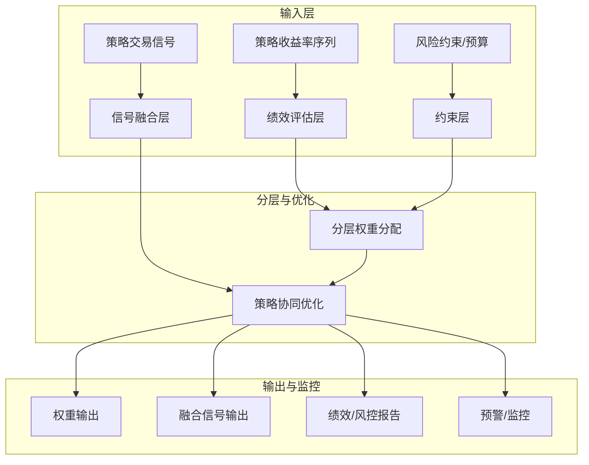

---
module_id: MULTI_STRATEGY_HIERARCHICAL_SYSTEM_001
version: 1.0.0
status: Active
created_date: 2026-04-07
last_updated: 2026-04-07
owner: 实施团队
standard_type: 专业量化机构蓝图
compliance_level: 专业标准
responsibility:
  - 多策略分层
  - 多策略协调
  - 层级优化
  - 信号融合
layer: Layer 5.2 (组合优化)
---


## 核心定位

负责多策略分层系统的设计与构建和运行和操作，构建策略分层架构，生成和输出策略协调和风险预算分配功能，兼容和适配多策略协调和监控。本模块实现策略间的协调与优化，确保各策略协同工作。
## 设计目标

### 主要目标

1. **功能完整性**: 确保MULTI STRATEGY HIERARCHICAL SYSTEM功能完整，满足业务需求
2. **性能优化**: 提升系统性能，降低资源消耗
3. **可维护性**: 提高代码质量，便于后续维护
4. **可扩展性**: 支持功能扩展，适应业务变化

### 质量目标

- 代码覆盖率: ≥80%
- 性能指标: 满足设计要求
- 文档完整性: 100%


## 核心功能

### 功能清单

1. **数据管理**: 提供数据存储、查询、更新功能
2. **业务逻辑**: 实现核心业务逻辑处理
3. **接口服务**: 提供标准化的API接口
4. **监控告警**: 实时监控系统状态

### 功能特性

- 高可用性设计
- 自动故障恢复
- 灵活配置管理


## 实现方案

### 技术架构

采用MULTI STRATEGY HIERARCHICAL SYSTEM化设计，分层架构实现。

### 关键技术

- 数据处理: 使用高效的数据处理框架
- 接口实现: RESTful API设计
- 性能优化: 缓存、异步处理

### 实施步骤

1. 需求分析与设计
2. 核心功能开发
3. 测试与优化
4. 部署与监控


> **职责边界**: 

> **开发时间: 160h

## 2. 架构设计

### 2.1 系统架构



### 2.3 数据流设计

```
信号收集 → 信号验证 → 风险评估 → 权重约束 → 融合决策 → 动态调整
```


## 3. 核心组件详细设计

### 3.1 策略绩效评估

```python
class StrategyPerformanceEvaluator:
    """策略绩效评估器    
    索引: STRATEGY_HIERARCHY_001-M01
    输出: 策略绩效评估结果
    """
    
    def __init__(self, config: PerformanceConfig):
        self.config = config
        self.risk_free_rate = config.risk_free_rate  # 无风险利率        
    def evaluate_strategy(self, strategy_returns: pd.Series,
                         benchmark_returns: Optional[pd.Series] = None,
                         strategy_name: str = '') -> StrategyPerformance:
        """评估策略绩效
        
        Args:
            strategy_returns: 策略历史收益率            benchmark_returns: 基准收益率（可选）
            strategy_name: 策略名称
            
        Returns:
            StrategyPerformance: 策略绩效评估结果
        """
        # 1. 计算收益率指标        return_metrics = self._calculate_return_metrics(strategy_returns)
        
        # 2. 计算风险指标
        risk_metrics = self._calculate_risk_metrics(strategy_returns)
        
        # 3. 计算风险调整收益指标
        risk_adjusted_metrics = self._calculate_risk_adjusted_metrics(
            strategy_returns, risk_metrics
        )
        
        # 4. 计算相对指标（如果有基准）
        relative_metrics = {}
        if benchmark_returns is not None:
            relative_metrics = self._calculate_relative_metrics(
                strategy_returns, benchmark_returns
            )
        
        # 5. 计算容量指标
        capacity_metrics = self._calculate_capacity_metrics(strategy_returns)
        
        return StrategyPerformance(
            strategy_name=strategy_name,
            return_metrics=return_metrics,
            risk_metrics=risk_metrics,
            risk_adjusted_metrics=risk_adjusted_metrics,
            relative_metrics=relative_metrics,
            capacity_metrics=capacity_metrics
        )
    
    def _calculate_return_metrics(self, returns: pd.Series) -> Dict[str, float]:
        """计算收益率指标""
        return {
            'total_return': (1 + returns).prod() - 1,
            'annual_return': returns.mean() * 252,
            'monthly_return': returns.mean() * 21,
            'positive_days': (returns > 0).sum() / len(returns),
            'best_day': returns.max(),
            'worst_day': returns.min()
        }
    
    def _calculate_risk_metrics(self, returns: pd.Series) -> Dict[str, float]:
        """计算风险指标"""
        # VaR (95%置信度
        var_95 = np.percentile(returns, 5)
        
        # CVaR (条件风险（CVaR）
        cvar_95 = returns[returns <= var_95].mean()
        
        # 最大回撤        cumulative = (1 + returns).cumprod()
        running_max = cumulative.cummax()
        drawdown = (cumulative - running_max) / running_max
        max_drawdown = drawdown.min()
        
        # 下行风险
        negative_returns = returns[returns < 0]
        downside_risk = negative_returns.std() * np.sqrt(252) if len(negative_returns) > 0 else 0
        
        return {
            'volatility': returns.std() * np.sqrt(252),
            'var_95': abs(var_95),
            'cvar_95': abs(cvar_95),
            'max_drawdown': abs(max_drawdown),
            'downside_risk': downside_risk
        }
    
    def _calculate_risk_adjusted_metrics(self, returns: pd.Series,
                                        risk_metrics: Dict[str, float]) -> Dict[str, float]:
        """计算风险调整收益指标"""
        annual_return = returns.mean() * 252
        volatility = risk_metrics['volatility']
        max_drawdown = risk_metrics['max_drawdown']
        downside_risk = risk_metrics['downside_risk']
        
        # Sharpe比率
        sharpe_ratio = (annual_return - self.risk_free_rate) / volatility if volatility > 0 else 0
        
        # Sortino比率
        sortino_ratio = (annual_return - self.risk_free_rate) / downside_risk if downside_risk > 0 else 0
        
        # Calmar比率
        calmar_ratio = annual_return / max_drawdown if max_drawdown > 0 else 0
        
        return {
            'sharpe_ratio': sharpe_ratio,
            'sortino_ratio': sortino_ratio,
            'calmar_ratio': calmar_ratio,
            'information_ratio': sharpe_ratio  # 简化处理        }
    
    def _calculate_relative_metrics(self, strategy_returns: pd.Series,
                                   benchmark_returns: pd.Series) -> Dict[str, float]:
        """计算相对指标"""
        # Alpha和Beta
        covariance = np.cov(strategy_returns, benchmark_returns)[0, 1]
        benchmark_variance = benchmark_returns.var()
        
        beta = covariance / benchmark_variance if benchmark_variance > 0 else 0
        alpha = strategy_returns.mean() - beta * benchmark_returns.mean()
        
        # 跟踪误差
        tracking_error = (strategy_returns - benchmark_returns).std() * np.sqrt(252)
        
        # 信息比率
        excess_return = (strategy_returns.mean() - benchmark_returns.mean()) * 252
        information_ratio = excess_return / tracking_error if tracking_error > 0 else 0
        
        return {
            'alpha': alpha * 252,
            'beta': beta,
            'tracking_error': tracking_error,
            'information_ratio': information_ratio
        }
    
    def _calculate_capacity_metrics(self, returns: pd.Series) -> Dict[str, float]:
        """计算容量指标"""
        # 平均持仓时间
        avg_holding_period = 5  # 简化：假设平均持仓 5 天        
        # 资金周转率        turnover_rate = 252 / avg_holding_period
        
        # 策略容量（简化估算）
        # 基于收益率波动和流动性估算        capacity = 1e8 * (1 / returns.std())  # 简化：波动率越小，容量越大
        
        return {
            'avg_holding_period': avg_holding_period,
            'turnover_rate': turnover_rate,
            'estimated_capacity': capacity
        }
    
    def calculate_correlation_matrix(self, strategy_returns: Dict[str, pd.Series]) -> pd.DataFrame:
        Args:
            strategy_returns: 各策略的收益率序列            
        Returns:
        returns_df = pd.DataFrame(strategy_returns)
        correlation_matrix = returns_df.corr()
        
        return correlation_matrix
```


```python
class StrategyLayerWeightAllocator:
    """
    索引: STRATEGY_HIERARCHY_001-M02
    """
    
    def __init__(self, config: WeightAllocationConfig):
        self.config = config
        self.core_strategy_weight = config.core_strategy_weight  # 核心策略层权重（例如 60%）
        self.satellite_strategy_weight = config.satellite_strategy_weight  # 卫星策略层权重（例如 40%）
    def allocate_weights(self, strategy_performances: Dict[str, StrategyPerformance],
                        correlation_matrix: pd.DataFrame,
                        current_weights: Dict[str, float]) -> WeightAllocationResult:
        
        Args:
            strategy_performances: 各策略的绩效评估结果
            
        Returns:
        """
        # 1. 策略分类（核心策略 vs 卫星策略）
        core_strategies, satellite_strategies = self._classify_strategies(
            strategy_performances
        )
        
        # 2. 核心策略层权重分配
        core_weights = self._allocate_layer_weights(
            core_strategies, strategy_performances, correlation_matrix,
            self.core_strategy_weight
        )
        
        # 3. 卫星策略层权重分配
        satellite_weights = self._allocate_layer_weights(
            satellite_strategies, strategy_performances, correlation_matrix,
            self.satellite_strategy_weight
        )
        
        # 4. 合并权重
        final_weights = {**core_weights, **satellite_weights}
        
        # 5. 应用权重约束
        final_weights = self._apply_weight_constraints(final_weights, current_weights)
        
        # 6. 计算风险贡献
        risk_contributions = self._calculate_risk_contributions(
            final_weights, correlation_matrix
        )
        
        return WeightAllocationResult(
            weights=final_weights,
            core_weights=core_weights,
            satellite_weights=satellite_weights,
            risk_contributions=risk_contributions,
            adjustment_reason=self._generate_adjustment_reason(
                current_weights, final_weights
            )
        )
    
    def _classify_strategies(self, performances: Dict[str, StrategyPerformance]) -> Tuple[List[str], List[str]]:
        """策略分类
        
        核心策略：夏普比率≥1.5，最大回撤≤15%
        core_strategies = []
        satellite_strategies = []
        
        for name, perf in performances.items():
            sharpe = perf.risk_adjusted_metrics['sharpe_ratio']
            max_dd = perf.risk_metrics['max_drawdown']
            
            if sharpe >= 1.5 and max_dd <= 0.15:
                core_strategies.append(name)
            else:
                satellite_strategies.append(name)
        
        return core_strategies, satellite_strategies
    
    def _allocate_layer_weights(self, strategies: List[str],
                                performances: Dict[str, StrategyPerformance],
                                correlation_matrix: pd.DataFrame,
                                layer_weight: float) -> Dict[str, float]:
权重
        
        """
        if len(strategies) == 0:
            return {}
        
        # 计算各策略的风险贡献
        strategy_risks = {}
        for name in strategies:
            perf = performances[name]
            strategy_risks[name] = perf.risk_metrics['volatility']
        
        # 风险平价权重
        inv_risks = {name: 1.0 / risk for name, risk in strategy_risks.items()}
        total_inv_risk = sum(inv_risks.values())
        
        weights = {
            name: (inv_risk / total_inv_risk) * layer_weight
            for name, inv_risk in inv_risks.items()
        }
        
        return weights
    
    def _apply_weight_constraints(self, weights: Dict[str, float],
                                 current_weights: Dict[str, float]) -> Dict[str, float]:
        """应用权重约束"""
        # 权重下限
        min_weight = self.config.min_weight
        weights = {k: max(v, min_weight) for k, v in weights.items()}
        
        # 权重上限
        max_weight = self.config.max_weight
        weights = {k: min(v, max_weight) for k, v in weights.items()}
        
        # 权重归一化        total_weight = sum(weights.values())
        weights = {k: v / total_weight for k, v in weights.items()}
        
度限制
        max_adjustment = self.config.max_daily_adjustment
        for name in weights:
            if name in current_weights:
                adjustment = weights[name] - current_weights[name]
                if abs(adjustment) > max_adjustment:
                    if adjustment > 0:
                        weights[name] = current_weights[name] + max_adjustment
                    else:
                        weights[name] = current_weights[name] - max_adjustment
        
        # 再次归一化        total_weight = sum(weights.values())
        weights = {k: v / total_weight for k, v in weights.items()}
        
        return weights
    
    def _calculate_risk_contributions(self, weights: Dict[str, float],
                                     correlation_matrix: pd.DataFrame) -> Dict[str, float]:
        """计算风险贡献"""
        # 简化计算：基于权重和波动率
        risk_contributions = {}
        for name, weight in weights.items():
            avg_correlation = correlation_matrix[name].mean()
            risk_contributions[name] = weight * avg_correlation
        
        # 标准化        total_risk = sum(risk_contributions.values())
        if total_risk > 0:
            risk_contributions = {k: v / total_risk for k, v in risk_contributions.items()}
        
        return risk_contributions
    
    def _generate_adjustment_reason(self, current_weights: Dict[str, float],
                                   new_weights: Dict[str, float]) -> str:
        """生成调整理由"""
        adjustments = []
        
        for name in new_weights:
            if name in current_weights:
                adjustment = new_weights[name] - current_weights[name]
                if abs(adjustment) > 0.01:
                    direction = "提高" if adjustment > 0 else "降低"
                    adjustments.append(f"{direction}{name}权重{abs(adjustment):.2%}")
        
        if adjustments:
            return "基于绩效评估和风险贡献调整 " + ", ".join(adjustments)
        else:
"
```

### 3.3 信号融合引擎

**设计目标**: 融合多策略信号，解决信号冲突，输出最终交易信号
```python
class SignalFusionEngine:
    """信号融合引擎
    
    索引: STRATEGY_HIERARCHY_001-M03
    职责: 融合多策略信号，解决信号冲突
    输出: 融合后的最终信号    """
    
    def __init__(self, config: FusionConfig):
        self.config = config
        self.fusion_method = config.fusion_method  # 融合方法（voting/weighted/ml）
    def fuse_signals(self, strategy_signals: Dict[str, TradingSignal],
                    strategy_weights: Dict[str, float],
                    historical_accuracy: Dict[str, float]) -> FusedSignal:
        """融合多策略信号        
        Args:
            strategy_signals: 各策略的交易信号
            strategy_weights: 策略权重
            historical_accuracy: 各策略的历史准确率            
        Returns:
            FusedSignal: 融合后的信号
        """
        # 1. 检测信号冲突
        conflicts = self._detect_conflicts(strategy_signals)
        
        # 2. 根据融合方法融合信号
        if self.fusion_method == 'voting':
            fused_signal = self._voting_fusion(strategy_signals, strategy_weights)
        elif self.fusion_method == 'weighted':
            fused_signal = self._weighted_fusion(
                strategy_signals, strategy_weights, historical_accuracy
            )
        elif self.fusion_method == 'ml':
            fused_signal = self._ml_fusion(strategy_signals, strategy_weights)
        else:
            fused_signal = self._weighted_fusion(
                strategy_signals, strategy_weights, historical_accuracy
            )
        
        # 3. 添加冲突信息
        fused_signal.conflicts = conflicts
        
        return fused_signal
    
    def _detect_conflicts(self, signals: Dict[str, TradingSignal]) -> List[SignalConflict]:
        """检测信号冲突"""
        conflicts = []
        
        # 检测方向冲突        directions = [sig.direction for sig in signals.values()]
        if 'long' in directions and 'short' in directions:
            conflicts.append(SignalConflict(
                conflict_type='direction',
                description='多空方向冲突',
                strategies=[name for name, sig in signals.items() if sig.direction in ['long', 'short']]
            ))
        
        # 检测强度冲突        strengths = [sig.strength for sig in signals.values()]
        if max(strengths) - min(strengths) > 0.5:
            conflicts.append(SignalConflict(
                conflict_type='strength',
                description='信号强度差异过大',
                strategies=list(signals.keys())
            ))
        
        return conflicts
    
    def _voting_fusion(self, signals: Dict[str, TradingSignal],
                      weights: Dict[str, float]) -> FusedSignal:
        """投票法融合"""
        # 统计各方向的加权票数
        votes = {'long': 0.0, 'short': 0.0, 'neutral': 0.0}
        
        for name, signal in signals.items():
            weight = weights.get(name, 1.0 / len(signals))
            votes[signal.direction] += weight
        
        # 选择票数最多的方向
        final_direction = max(votes, key=votes.get)
        final_strength = votes[final_direction] / sum(votes.values())
        
        return FusedSignal(
            direction=final_direction,
            strength=final_strength,
            confidence=votes[final_direction],
            fusion_method='voting',
            contributing_strategies=signals.keys()
        )
    
    def _weighted_fusion(self, signals: Dict[str, TradingSignal],
                        weights: Dict[str, float],
                        accuracy: Dict[str, float]) -> FusedSignal:
        """加权平均融合"""
        # 计算综合权重（策略权重 * 历史准确率）
        composite_weights = {}
        for name in signals:
            strategy_weight = weights.get(name, 1.0 / len(signals))
            strategy_accuracy = accuracy.get(name, 0.5)
            composite_weights[name] = strategy_weight * strategy_accuracy
        
        # 归一化        total_weight = sum(composite_weights.values())
        composite_weights = {k: v / total_weight for k, v in composite_weights.items()}
        
        # 加权平均信号强度
        weighted_strength = 0.0
        weighted_direction = 0.0
        
        for name, signal in signals.items():
            weight = composite_weights[name]
            
            # 方向转换为数值（long=1, neutral=0, short=-1）
            direction_value = {'long': 1, 'neutral': 0, 'short': -1}[signal.direction]
            
            weighted_direction += weight * direction_value * signal.strength
            weighted_strength += weight * signal.strength
        
        # 确定最终方向
        if weighted_direction > 0.1:
            final_direction = 'long'
        elif weighted_direction < -0.1:
            final_direction = 'short'
        else:
            final_direction = 'neutral'
        
        return FusedSignal(
            direction=final_direction,
            strength=abs(weighted_direction),
            confidence=weighted_strength,
            fusion_method='weighted',
            contributing_strategies=signals.keys()
        )
    
    def _ml_fusion(self, signals: Dict[str, TradingSignal],
                  weights: Dict[str, float]) -> FusedSignal:
        """机器学习融合（简化版）"""
应使用训练好的ML模型
        # 这里简化为加权平均
        
        return self._weighted_fusion(signals, weights, {})
```

### 3.4 策略协同优化


```python
class StrategySynergyOptimizer:
    """策略协同优化器    
    索引: STRATEGY_HIERARCHY_001-M04

    """
    
    def __init__(self, config: SynergyConfig):
        self.config = config
        
    def optimize_synergy(self, strategy_performances: Dict[str, StrategyPerformance],
                        correlation_matrix: pd.DataFrame,
                        resource_constraints: ResourceConstraints) -> SynergyOptimizationResult:
        """优化策略协同
        
        Args:
            strategy_performances: 策略绩效
            
        Returns:
            SynergyOptimizationResult: 协同优化结果
        """
        # 1. 识别协同效应
        synergies = self._identify_synergies(correlation_matrix)
        
        # 2. 识别冲突策略
        conflicts = self._identify_conflicts(correlation_matrix)
        

        resource_allocation = self._optimize_resources(
            strategy_performances, synergies, conflicts, resource_constraints
        )
        
        # 4. 生成优化建议
        recommendations = self._generate_recommendations(synergies, conflicts)
        
        return SynergyOptimizationResult(
            synergies=synergies,
            conflicts=conflicts,
            resource_allocation=resource_allocation,
            recommendations=recommendations
        )
    
    def _identify_synergies(self, correlation_matrix: pd.DataFrame) -> List[StrategySynergy]:
        """识别协同效应
        
        synergies = []
        
        strategies = correlation_matrix.columns
        for i, strat1 in enumerate(strategies):
            for j, strat2 in enumerate(strategies):
                if i < j:
                    corr = correlation_matrix.loc[strat1, strat2]
                    
                    if -0.3 <= corr <= 0.3:
                        synergy_type = 'diversification' if corr >= 0 else 'hedging'
                        synergies.append(StrategySynergy(
                            strategy1=strat1,
                            strategy2=strat2,
                            correlation=corr,
                            synergy_type=synergy_type,
                            benefit='风险分散' if synergy_type == 'diversification' else '风险对冲'
                        ))
        
        return synergies
    
    def _identify_conflicts(self, correlation_matrix: pd.DataFrame) -> List[StrategyConflict]:
        """识别冲突策略
        
        冲突策略：相关系数 > 0.7 的策略组
        """
        conflicts = []
        
        strategies = correlation_matrix.columns
        for i, strat1 in enumerate(strategies):
            for j, strat2 in enumerate(strategies):
                if i < j:
                    corr = correlation_matrix.loc[strat1, strat2]
                    
                    # 高相关 = 冲突
                    if corr > 0.7:
                        conflicts.append(StrategyConflict(
                            strategy1=strat1,
                            strategy2=strat2,
                            correlation=corr,
                            conflict_type='high_correlation',
                        ))
        
        return conflicts
    
    def _optimize_resources(self, performances: Dict[str, StrategyPerformance],
                           synergies: List[StrategySynergy],
                           conflicts: List[StrategyConflict],
                           constraints: ResourceConstraints) -> Dict[str, ResourceAllocation]:
"""
        allocations = {}
        
            base_allocation = perf.risk_adjusted_metrics['sharpe_ratio'] / 3.0  # 归一化            
            # 协同加成
            synergy_bonus = 0.0
            for synergy in synergies:
                if name in [synergy.strategy1, synergy.strategy2]:
                    synergy_bonus += 0.1
            
            # 冲突惩罚
            conflict_penalty = 0.0
            for conflict in conflicts:
                if name in [conflict.strategy1, conflict.strategy2]:
                    conflict_penalty += 0.1
            
            # 最终分配            final_allocation = base_allocation + synergy_bonus - conflict_penalty
            final_allocation = max(0.1, min(1.0, final_allocation))  # 限制在[0.1, 1.0]
            
            allocations[name] = ResourceAllocation(
                strategy_name=name,
                allocation_ratio=final_allocation,
                capital_allocation=constraints.total_capital * final_allocation,
                risk_budget=constraints.total_risk_budget * final_allocation
            )
        
        # 归一化        total_allocation = sum(a.allocation_ratio for a in allocations.values())
        for name in allocations:
            allocations[name].allocation_ratio /= total_allocation
            allocations[name].capital_allocation = constraints.total_capital * allocations[name].allocation_ratio
            allocations[name].risk_budget = constraints.total_risk_budget * allocations[name].allocation_ratio
        
        return allocations
    
    def _generate_recommendations(self, synergies: List[StrategySynergy],
                                 conflicts: List[StrategyConflict]) -> List[str]:
        """生成优化建议"""
        recommendations = []
        
        # 协同建议
        for synergy in synergies[:3]:  # 3 个协同效应            recommendations.append(

            )
        
        # 冲突建议
        for conflict in conflicts[:3]:  # 3 个冲突            recommendations.append(
            )
        
        return recommendations
```


## 4. 接口定义

### 4.1 核心接口

```python
from abc import ABC, abstractmethod
from dataclasses import dataclass
from typing import Dict, List, Optional, Tuple
import numpy as np
import pandas as pd

@dataclass
class StrategyPerformance:
    """策略绩效"""
    strategy_name: str
    return_metrics: Dict[str, float]
    risk_metrics: Dict[str, float]
    risk_adjusted_metrics: Dict[str, float]
    relative_metrics: Dict[str, float]
    capacity_metrics: Dict[str, float]

@dataclass
class TradingSignal:
    """交易信号"""
    strategy_name: str
    direction: str          # long/short/neutral
    strength: float         # 0-1
    confidence: float       # 0-1
    timestamp: pd.Timestamp

@dataclass
class FusedSignal:
    """融合信号"""
    direction: str
    strength: float
    confidence: float
    fusion_method: str
    contributing_strategies: List[str]
    conflicts: Optional[List['SignalConflict']] = None

@dataclass
class SignalConflict:
    """信号冲突"""
    conflict_type: str
    description: str
    strategies: List[str]

@dataclass
class WeightAllocationResult:
    weights: Dict[str, float]
    core_weights: Dict[str, float]
    satellite_weights: Dict[str, float]
    risk_contributions: Dict[str, float]
    adjustment_reason: str

@dataclass
class StrategySynergy:
    """策略协同"""
    strategy1: str
    strategy2: str
    correlation: float
    synergy_type: str
    benefit: str

@dataclass
class StrategyConflict:
    """策略冲突"""
    strategy1: str
    strategy2: str
    correlation: float
    conflict_type: str
    recommendation: str

@dataclass
class ResourceAllocation:
"""
    strategy_name: str
    allocation_ratio: float
    capital_allocation: float
    risk_budget: float

@dataclass
class ResourceConstraints:
    """资源约束"""
    total_capital: float
    total_risk_budget: float
    max_strategies: int

@dataclass
class SynergyOptimizationResult:
    """协同优化结果"""
    synergies: List[StrategySynergy]
    conflicts: List[StrategyConflict]
    resource_allocation: Dict[str, ResourceAllocation]
    recommendations: List[str]


class IPerformanceEvaluator(ABC):
    """绩效评估器接口"""
    
    @abstractmethod
    def evaluate(self, returns: pd.Series, benchmark: Optional[pd.Series] = None) -> StrategyPerformance:
        """评估策略绩效"""
        pass


class IWeightAllocator(ABC):
    
    @abstractmethod
    def allocate(self, performances: Dict[str, StrategyPerformance],
                correlation_matrix: pd.DataFrame) -> Dict[str, float]:
        pass


class ISignalFusion(ABC):
    """信号融合接口"""
    
    @abstractmethod
    def fuse(self, signals: Dict[str, TradingSignal],
            weights: Dict[str, float]) -> FusedSignal:
        """融合信号"""
        pass
```

### 4.2 主接口
```python
class MultiStrategyHierarchicalSystem:
    """多策略分层系统主接口
    
    索引: STRATEGY_HIERARCHY_001-MAIN
    
    def __init__(self, config: HierarchicalSystemConfig):
        self.config = config
        self.performance_evaluator = StrategyPerformanceEvaluator(config.performance_config)
        self.weight_allocator = StrategyLayerWeightAllocator(config.weight_config)
        self.signal_fusion = SignalFusionEngine(config.fusion_config)
        self.synergy_optimizer = StrategySynergyOptimizer(config.synergy_config)
        
    def manage_strategies(self, strategy_returns: Dict[str, pd.Series],
                         strategy_signals: Dict[str, TradingSignal],
                         current_weights: Dict[str, float],
                         resource_constraints: ResourceConstraints) -> ManagementResult:
        """管理多策略        
        Args:
            strategy_returns: 各策略的历史收益率
            strategy_signals: 各策略的当前信号
            current_weights: 当前权重
            resource_constraints: 资源约束
            
        Returns:
            ManagementResult: 管理结果
        """
        # 1. 绩效评估
        performances = {}
        for name, returns in strategy_returns.items():
            performances[name] = self.performance_evaluator.evaluate_strategy(returns)
        
        

        weight_result = self.weight_allocator.allocate_weights(
            performances, correlation_matrix, current_weights
        )
        
        # 4. 信号融合
        historical_accuracy = {
            name: 0.5 + perf.risk_adjusted_metrics['sharpe_ratio'] / 10.0
            for name, perf in performances.items()
        }
        
        fused_signal = self.signal_fusion.fuse_signals(
            strategy_signals, weight_result.weights, historical_accuracy
        )
        
        # 5. 协同优化
        synergy_result = self.synergy_optimizer.optimize_synergy(
            performances, correlation_matrix, resource_constraints
        )
        
        return ManagementResult(
            performances=performances,
            weight_allocation=weight_result,
            fused_signal=fused_signal,
            synergy_optimization=synergy_result,
            correlation_matrix=correlation_matrix
        )
```


## 5. 实施计划

### 5.1 开发里程碑


**Phase 2: 信号融合与协同优化（Week 3-4）
- 实现信号融合引擎
- 实现策略协同优化?- 完成集成测试

**Phase 3: 系统集成与优化（Week 5-6）
- 集成到组合优化层
- 实现实时监控接口
- 完成性能优化
- 完成回测验证

**Phase 4: 生产部署（Week 7-8）
- 生产环境部署
- 监控系统集成
- 文档完善
- 用户培训

### 5.2 技术栈

| 组件 | 技术选型 | 版本要求 |
|------|----------|----------|
| **优化引擎** | CVXPY, scipy | ?.2, ?.7 |
| **数据分析** | numpy, pandas | ?.21, ?.3 |
| **机器学习** | scikit-learn | ?.0 |
| **可视?* | matplotlib, plotly | ?.5, ?.0 |
| **监控** | Prometheus, Grafana | ?.0, ?.0 |

### 5.3 性能指标

| 指标 | 目指标| 验证方法 |
|------|--------|----------|
| **权重调整延迟** | （待补充） | 性能测试 |
| **信号融合延迟** | （待补充） | 性能测试 |
| **策略夏普比率** | ≥1.0 | 回测验证 |


## 6. 风险与约束
### 6.1 技术风?
| 风险?| 风险等级 | 缓解措施 |
|--------|----------|----------|
| **策略过拟?* | P1 | 样本外验证、交叉验证|
| **信号冲突频繁** | P2 | 优化融合算法、增加冲突解决机?|
| **权重调整滞后** | P2 | 实时监控、快速响?|

分测?|

### 6.2 实施约束

1. **数据约束**: 需要足够长的历史数据支持绩效评?2. **计算约束**: 需要高性能计算资源支持实时优化
3. **策略约束**: 需要足够多的策略支持分层管?4. **风控约束**: 需要严格的风控审批流程


## 7. 验收标准

### 7.1 功能验收

- 支持策略分层权重动态分?- 支持多策略信号融合和冲突解决
- 支持策略协同效应识别和优?
### 7.2 性能验收

- 权重调整延迟（待补充）
- 信号融合延迟（待补充）
- 策略夏普比率 ≥ 1.0

### 7.3 质量验收

- 代码覆盖率≥85%
- 文档完整度≥95%
- 符合API契约规范
- 通过代码审查


## 8. 参考资?
### 8.1 学术论文

1. **Risk Parity**: Qian, E. (2005). "Risk Parity Portfolios"
2. **Multi-Strategy**: Asness, C., et al. (2013). "Value and Momentum Everywhere"
3. **Signal Fusion**: Qin, Z., et al. (2008). "Multi-Source Information Fusion"

### 8.2 开源项?
1. **PyPortfolioOpt**: https://github.com/robertmartin8/PyPortfolioOpt
2. **Riskfolio-Lib**: https://github.com/dcajasn/Riskfolio-Lib
3. **scikit-learn**: https://scikit-learn.org/


- PROFESSIONAL_MULTI_TIMEFRAME_ARCHITECTURE.md
- PORTFOLIO_OPTIMIZATION_BLUEPRINT.md
- API_Contract.md


**文档版本**: v1.0
**最后更?*: 2026-04-02
审?**下一?*: 提交技术评审官审核

## 变更历史

|------|------|----------|--------|
| v1.0.0 | 2026-04-02 | 初始版本创建 | 组合优化层负责人 |


## 9. 文档治理

### 9.1 System_Manifest.md索引

```markdown
##### 6.001. Multi Strategy Hierarchical System
- **模块ID**: MULTI_STRATEGY_HIERARCHICAL_SYSTEM_001
- **蓝图文档**: MULTI_STRATEGY_HIERARCHICAL_SYSTEM_BLUEPRINT.md
```

### 9.2 模块职责边界

| 模块 | 职责 | 边界 |
|------|------|------|
| **Multi Strategy Hierarchical System** | 

### 9.3 版本管理

|------|------|----------|--------|


```
