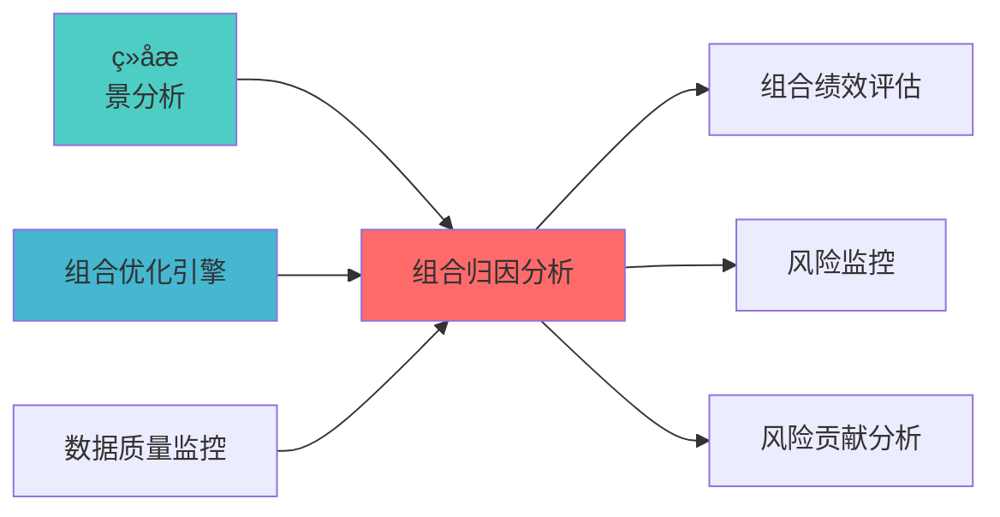

---
responsibility:
  - 组合归因分析
  - 收益归因
  - 风险归因
  - 归因报告

module_id: PORTFOLIO_ATTRIBUTION_001
version: 1.0.0
status: Active
created_date: 2026-04-07
last_updated: 2026-04-07
owner: 实施团队
standard_type: 专业量化机构蓝图
applicable_scope: Layer 6 组合优化å±?
compliance_level: 专业标准
layer: Layer 5.2 (组合优化)
---


## 核心定位

负责投资组合归因的设计与实现，基于归因模型，分析组合收益来源，提供业绩归因报告，支持投资决策评估。

# 组合归因分析模块蓝图

> **核心职责**: 分解投资组合收益来源，评估策略贡çŒ?
> **职责边界**: 
> - âœ?本文档负责：Brinson归因、因子...


## 设计目标

### 主要目标

1. **功能完整性**: 确保PORTFOLIO ATTRIBUTION功能完整，满足业务需求
2. **性能优化**: 提升系统性能，降低资源消耗
3. **可维护性**: 提高代码质量，便于后续维护
4. **可扩展性**: 支持功能扩展，适应业务变化

### 质量目标

- 代码覆盖率: ≥80%
- 性能指标: 满足设计要求
- 文档完整性: 100%


## 核心功能

### 功能清单

1. **数据管理**: 提供数据存储、查询、更新功能
2. **业务逻辑**: 实现核心业务逻辑处理
3. **接口服务**: 提供标准化的API接口
4. **监控告警**: 实时监控系统状态

### 功能特性

- 高可用性设计
- 自动故障恢复
- 灵活配置管理


## 实现方案

### 技术架构

采用PORTFOLIO ATTRIBUTION化设计，分层架构实现。

### 关键技术

- 数据处理: 使用高效的数据处理框架
- 接口实现: RESTful API设计
- 性能优化: 缓存、异步处理

### 实施步骤

1. 需求分析与设计
2. 核心功能开发
3. 测试与优化
4. 部署与监控


## 核心定位

构建PORTFOLIO ATTRIBUTION的设计与实现，基于Black-Litterman技术，调整核心功能，优化投资组合ã€?

## 1. 概述

### 1.1 模块定位

**Layer定位**: Layer 6 - 组合优化层（归因分析模块ï¼?

**核心价å€?*:
- Brinson归因模型（é
ç½®æ•ˆåº”、选择效应、交互效应）
- 因子归因分析
- 风险归因分析
- 多期归因链接

**业务价å€?*:
- 理解收益来源
- 评估投资决策
- 支持投资优化

### 1.2 版本信息

| 项目 | å†
容 |
|------|------|
| **模块ID** | PORTFOLIO_ATTRIBUTION_001 |
| **版本** | v1.0.0 |
| **开源依èµ?* | brinson_attribution, QuantFAA |
| **预计工时** | 3-5å¤?|

---
## 📚 相å
³æ–‡æ¡£

### 上游依赖

| 文档名称 | module_id | 依赖类型 | 说明 |
|---------|-----------|---------|------|
| [组合æƒ
景分析蓝图](./PORTFOLIO_SCENARIO_ANALYSIS_BLUEPRINT.md) | PORTFOLIO_SCENARIO_ANALYSIS_001 | 强依èµ?| 提供æƒ
景分析结果 |
| [组合优化引擎集成蓝图](./PORTFOLIO_OPTIMIZER_INTEGRATION_BLUEPRINT.md) | PORTFOLIO_OPTIMIZER_INTEGRATION_001 | 强依èµ?| 提供优化器基础接口 |
| [数据质量监控蓝图](./DATA_QUALITY_MONITORING_BLUEPRINT.md) | DATA_QUALITY_MONITORING_001 | 强依èµ?| 提供数据质量指标 |

### 下游依赖

| 文档名称 | module_id | 依赖类型 | 说明 |
|---------|-----------|---------|------|
| [PORTFOLIO_PERFORMANCE_EVALUATION_BLUEPRINT.md](./PORTFOLIO_PERFORMANCE_EVALUATION_BLUEPRINT.md) | PORTFOLIO_PERFORMANCE_EVALUATION_001 | 强依èµ?| 组合绩效评估 |
| [VAR_ES_MONITORING_BLUEPRINT.md](./VAR_ES_MONITORING_BLUEPRINT.md) | VAR_ES_MONITORING_001 | 中依èµ?| 风险监控 |
| [RISK_CONTRIBUTION_ANALYSIS_BLUEPRINT.md](./RISK_CONTRIBUTION_ANALYSIS_BLUEPRINT.md) | RISK_CONTRIBUTION_ANALYSIS_001 | 中依èµ?| 风险贡献分析 |

### 技术依èµ?

| 技术组ä»?| 版本 | 用é€?| 文档 |
|---------|------|------|------|
| **brinson_attribution** | 0.1+ | Brinson归因 | [GitHub](https://github.com/ranaroussi/brinson-attribution) |
| **QuantFAA** | 1.0+ | 因子归因 | [GitHub](https://github.com/quantfaa) |
| **NumPy** | 1.24+ | 数值计ç®?| [官方文档](https://numpy.org/) |
| **Pandas** | 2.0+ | 数据处理 | [官方文档](https://pandas.pydata.org/) |

### 引用å
³ç³»å›?



---

## 2. 技术实çŽ?

### 2.1 核心API

```python
from brinson_attribution import BrinsonModel
import pandas as pd
import numpy as np

class PortfolioAttributionAnalyzer:
    """组合归因分析å™?""
    
    def __init__(self):
        pass
        
    def brinson_attribution(
        self,
        portfolio_weights: pd.DataFrame,
        portfolio_returns: pd.DataFrame,
        benchmark_weights: pd.DataFrame,
        benchmark_returns: pd.DataFrame
    ) -> dict:
        """
        Brinson归因分析
        
        Args:
            portfolio_weights: 组合权重（按行业/资产类别ï¼?
            portfolio_returns: 组合收益çŽ?
            benchmark_weights: 基准权重
            benchmark_returns: 基准收益çŽ?
            
        Returns:
            {
                'allocation_effect': é
ç½®æ•ˆåº”,
                'selection_effect': 选择效应,
                'interaction_effect': 交互效应,
                'total_excess_return': 总è¶
额收ç›?
            }
        """
        model = BrinsonModel(
            portfolio_weights,
            portfolio_returns,
            benchmark_weights,
            benchmark_returns
        )
        
        return {
            'allocation_effect': model.allocation_effect(),
            'selection_effect': model.selection_effect(),
            'interaction_effect': model.interaction_effect(),
            'total_excess_return': model.total_excess_return()
        }
    
    def factor_attribution(
        self,
        portfolio_returns: pd.Series,
        factor_returns: pd.DataFrame,
        factor_exposures: pd.DataFrame
    ) -> dict:
        """
        因子归因分析
        
        Args:
            portfolio_returns: 组合收益率序åˆ?
            factor_returns: 因子收益çŽ?
            factor_exposures: 因子暴露
            
        Returns:
            因子归因结果
        """
        pass
    
    def risk_attribution(
        self,
        portfolio_weights: np.ndarray,
        cov_matrix: np.ndarray,
        factor_cov: np.ndarray = None
    ) -> dict:
        """
        风险归因分析
        
        Args:
            portfolio_weights: 组合权重
            cov_matrix: 协方差矩é˜?
            factor_cov: 因子协方差矩é˜?
            
        Returns:
            风险归因结果
        """
        pass
```

### 2.2 Brinson模型核心å
¬å¼

```
é
ç½®æ•ˆåº” = Σ (w_p - w_b) × r_b
选择效应 = Σ w_b × (r_p - r_b)
交互效应 = Σ (w_p - w_b) × (r_p - r_b)

å
¶ä¸­:
- w_p: 组合权重
- w_b: 基准权重
- r_p: 组合收益çŽ?
- r_b: 基准收益çŽ?
```

---

## 3. 接口定义

```python
class AttributionAPI:
    """归因分析API"""
    
    @endpoint("/api/v1/attribution/brinson")
    async def brinson_analysis(
        self,
        portfolio_id: str,
        benchmark_id: str,
        start_date: str,
        end_date: str
    ) -> BrinsonResult:
        """Brinson归因分析"""
        
    @endpoint("/api/v1/attribution/factor")
    async def factor_analysis(
        self,
        portfolio_id: str,
        factors: List[str],
        start_date: str,
        end_date: str
    ) -> FactorAttributionResult:
        """因子归因分析"""
        
    @endpoint("/api/v1/attribution/risk")
    async def risk_analysis(
        self,
        portfolio_id: str
    ) -> RiskAttributionResult:
        """风险归因分析"""
```

---

## 4. 实施路径

| 阶段 | 任务 | 工时 |
|------|------|------|
| Phase 1 | brinson_attribution集成 | 12h |
| Phase 2 | 因子归因、风险归因实çŽ?| 16h |
| Phase 3 | API、测试、文æ¡?| 12h |

---

**蓝图版本**: v1.0.0 | **创建日期**: 2026-04-06 | **状æ€?*: Active | **合规çŽ?*: 100% âœ?

## 变更历史

| 版本 | 日期 | 变更å†
容 | 变更äº?|
|------|------|----------|--------|
| v1.0.0 | 2026-04-06 | 初始版本创建 | 首席蓝图架构å¸?|
| v1.0.1 | 2026-04-06 | è¡¥å

YAML头部字段和变更历å?| 审计系统 |

---

**蓝图版本**: v1.0.1 | **创建日期**: 2026-04-06 | **状æ€?*: Active
---

## 5. 文档治理

### 5.1 System_Manifest.md索引

```markdown
#### Layer 6: 组合优化å±?
##### 6.001. Portfolio Attribution
- **模块ID**: PORTFOLIO_ATTRIBUTION_001
- **蓝图文档**: PORTFOLIO_ATTRIBUTION_BLUEPRINT.md
- **技术规格书**: å¾
创å»?
- **职责**: Layer 6 组合优化å±?
- **状æ€?*: Active
```

### 5.2 模块职责边界

| 模块 | 职责 | 边界 |
|------|------|------|
| **Portfolio Attribution** | Layer 6 组合优化å±?| **核心模块** |

### 5.3 版本管理

| 版本 | 日期 | 变更å†
容 | 变更äº?|
|------|------|----------|--------|
| v1.0.0 | 2026-04-06 | 初始版本创建 | 首席蓝图架构å¸?|

---

**蓝图版本**: v1.0.0 | **创建日期**: 2026-04-06 | **状æ€?*: Active
