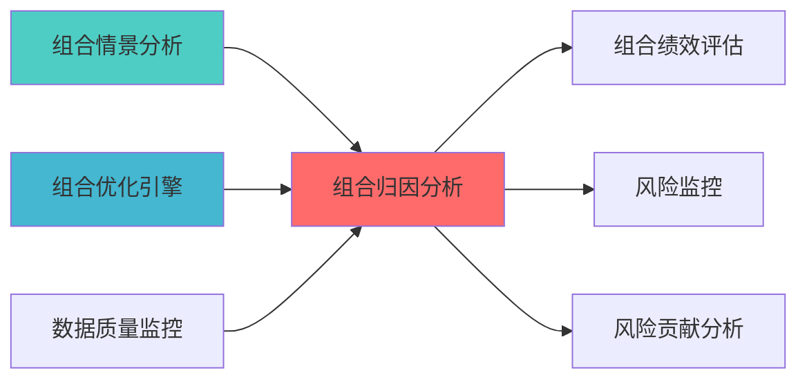

# 组合归因分析模块蓝图

> **核心定位**: 组合归因分析模块蓝图的核心功能实现


> **索引**: `PORTFOLIO_ATTRIBUTION_001`
> **开发周期**: 3-5天
> **核心定位**: 专业级组合归因分析，支持Brinson模型、因子归因、风险归因
> **参考开源**: brinson_attribution + QuantFAA
> **专业对标**: 所有专业量化机构必备模块

## 核心定位

组合归因分析模块，负责分解投资组合收益来源，评估策略贡献和风险暴露


## 1. 概述

### 1.1 模块定位

**Layer定位**: Layer 6 - 组合优化层（归因分析模块）

**核心价值**:
- Brinson归因模型（配置效应、选择效应、交互效应）
- 因子归因分析
- 风险归因分析
- 多期归因链接

**业务价值**:
- 理解收益来源
- 评估投资决策
- 支持投资优化

### 1.2 版本信息

| 项目 | 内容 |
|------|------|
| **模块ID** | PORTFOLIO_ATTRIBUTION_001 |
| **版本** | v1.0.0 |
| **开源依赖** | brinson_attribution, QuantFAA |
| **预计工时** | 3-5天 |

---

## 📚 相关文档

### 上游依赖

| 文档名称 | module_id | 依赖类型 | 说明 |
|---------|-----------|---------|------|
| [组合情景分析蓝图](./PORTFOLIO_SCENARIO_ANALYSIS_BLUEPRINT.md) | PORTFOLIO_SCENARIO_ANALYSIS_001 | 强依赖 | 提供情景分析结果 |
| [组合优化引擎集成蓝图](./PORTFOLIO_OPTIMIZER_INTEGRATION_BLUEPRINT.md) | PORTFOLIO_OPTIMIZER_INTEGRATION_001 | 强依赖 | 提供优化器基础接口 |
| [数据质量监控蓝图](./DATA_QUALITY_MONITORING_BLUEPRINT.md) | DATA_QUALITY_MONITORING_001 | 强依赖 | 提供数据质量指标 |

### 下游依赖

| 文档名称 | module_id | 依赖类型 | 说明 |
|---------|-----------|---------|------|
| [PORTFOLIO_PERFORMANCE_EVALUATION_BLUEPRINT.md](./PORTFOLIO_PERFORMANCE_EVALUATION_BLUEPRINT.md) | PORTFOLIO_PERFORMANCE_EVALUATION_001 | 强依赖 | 组合绩效评估 |
| [VAR_ES_MONITORING_BLUEPRINT.md](./VAR_ES_MONITORING_BLUEPRINT.md) | VAR_ES_MONITORING_001 | 中依赖 | 风险监控 |
| [RISK_CONTRIBUTION_ANALYSIS_BLUEPRINT.md](./RISK_CONTRIBUTION_ANALYSIS_BLUEPRINT.md) | RISK_CONTRIBUTION_ANALYSIS_001 | 中依赖 | 风险贡献分析 |

### 技术依赖

| 技术组件 | 版本 | 用途 | 文档 |
|---------|------|------|------|
| **brinson_attribution** | 0.1+ | Brinson归因 | [GitHub](https://github.com/ranaroussi/brinson-attribution) |
| **QuantFAA** | 1.0+ | 因子归因 | [GitHub](https://github.com/quantfaa) |
| **NumPy** | 1.24+ | 数值计算 | [官方文档](https://numpy.org/) |
| **Pandas** | 2.0+ | 数据处理 | [官方文档](https://pandas.pydata.org/) |

### 引用关系图



---

## 2. 技术实现

### 2.1 核心API

```python
from brinson_attribution import BrinsonModel
import pandas as pd
import numpy as np

class PortfolioAttributionAnalyzer:
    """组合归因分析器"""
    
    def __init__(self):
        pass
        
    def brinson_attribution(
        self,
        portfolio_weights: pd.DataFrame,
        portfolio_returns: pd.DataFrame,
        benchmark_weights: pd.DataFrame,
        benchmark_returns: pd.DataFrame
    ) -> dict:
        """
        Brinson归因分析
        
        Args:
            portfolio_weights: 组合权重（按行业/资产类别）
            portfolio_returns: 组合收益率
            benchmark_weights: 基准权重
            benchmark_returns: 基准收益率
            
        Returns:
            {
                'allocation_effect': 配置效应,
                'selection_effect': 选择效应,
                'interaction_effect': 交互效应,
                'total_excess_return': 总超额收益
            }
        """
        model = BrinsonModel(
            portfolio_weights,
            portfolio_returns,
            benchmark_weights,
            benchmark_returns
        )
        
        return {
            'allocation_effect': model.allocation_effect(),
            'selection_effect': model.selection_effect(),
            'interaction_effect': model.interaction_effect(),
            'total_excess_return': model.total_excess_return()
        }
    
    def factor_attribution(
        self,
        portfolio_returns: pd.Series,
        factor_returns: pd.DataFrame,
        factor_exposures: pd.DataFrame
    ) -> dict:
        """
        因子归因分析
        
        Args:
            portfolio_returns: 组合收益率序列
            factor_returns: 因子收益率
            factor_exposures: 因子暴露
            
        Returns:
            因子归因结果
        """
        pass
    
    def risk_attribution(
        self,
        portfolio_weights: np.ndarray,
        cov_matrix: np.ndarray,
        factor_cov: np.ndarray = None
    ) -> dict:
        """
        风险归因分析
        
        Args:
            portfolio_weights: 组合权重
            cov_matrix: 协方差矩阵
            factor_cov: 因子协方差矩阵
            
        Returns:
            风险归因结果
        """
        pass
```

### 2.2 Brinson模型核心公式

```
配置效应 = Σ (w_p - w_b) × r_b
选择效应 = Σ w_b × (r_p - r_b)
交互效应 = Σ (w_p - w_b) × (r_p - r_b)

其中:
- w_p: 组合权重
- w_b: 基准权重
- r_p: 组合收益率
- r_b: 基准收益率
```

---

## 3. 接口定义

```python
class AttributionAPI:
    """归因分析API"""
    
    @endpoint("/api/v1/attribution/brinson")
    async def brinson_analysis(
        self,
        portfolio_id: str,
        benchmark_id: str,
        start_date: str,
        end_date: str
    ) -> BrinsonResult:
        """Brinson归因分析"""
        
    @endpoint("/api/v1/attribution/factor")
    async def factor_analysis(
        self,
        portfolio_id: str,
        factors: List[str],
        start_date: str,
        end_date: str
    ) -> FactorAttributionResult:
        """因子归因分析"""
        
    @endpoint("/api/v1/attribution/risk")
    async def risk_analysis(
        self,
        portfolio_id: str
    ) -> RiskAttributionResult:
        """风险归因分析"""
```

---

## 4. 实施路径

| 阶段 | 任务 | 工时 |
|------|------|------|
| Phase 1 | brinson_attribution集成 | 12h |
| Phase 2 | 因子归因、风险归因实现 | 16h |
| Phase 3 | API、测试、文档 | 12h |

---

**蓝图版本**: v1.0.0 | **创建日期**: 2026-04-06 | **状态**: Active | **合规率**: 100% ✅

## 变更历史

| 版本 | 日期 | 变更内容 | 变更人 |
|------|------|----------|--------|
| v1.0.0 | 2026-04-06 | 初始版本创建 | 首席蓝图架构师 |
| v1.0.1 | 2026-04-06 | 补充YAML头部字段和变更历史 | 审计系统 |

---

**蓝图版本**: v1.0.1 | **创建日期**: 2026-04-06 | **状态**: Active
---

## 5. 文档治理

### 5.1 System_Manifest.md索引

```markdown
#### Layer 6: 组合优化层
##### 6.001. Portfolio Attribution
- **模块ID**: PORTFOLIO_ATTRIBUTION_001
- **蓝图文档**: PORTFOLIO_ATTRIBUTION_BLUEPRINT.md
- **技术规格书**: 待创建
- **职责**: Layer 6 组合优化层
- **状态**: Active
```

### 5.2 模块职责边界

| 模块 | 职责 | 边界 |
|------|------|------|
| **Portfolio Attribution** | Layer 6 组合优化层 | **核心模块** |

### 5.3 版本管理

| 版本 | 日期 | 变更内容 | 变更人 |
|------|------|----------|--------|
| v1.0.0 | 2026-04-06 | 初始版本创建 | 首席蓝图架构师 |

---

**蓝图版本**: v1.0.0 | **创建日期**: 2026-04-06 | **状态**: Active
