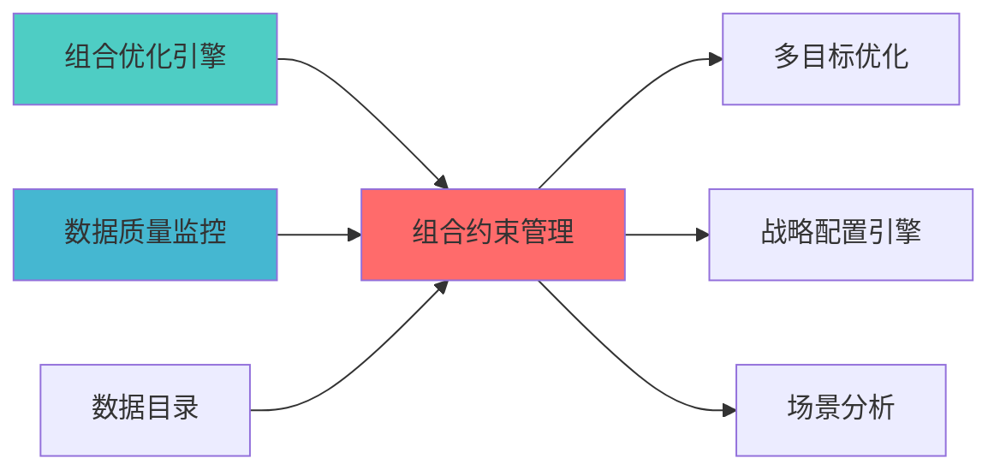

# 组合约束管理模块蓝图

> **核心定位**: 组合约束管理模块蓝图的核心功能实现


> **索引**: `PORTFOLIO_CONSTRAINT_001`
> **开发周期**: 3-5天
> **核心定位**: 专业级组合约束管理，支持约束库、冲突检测、优先级管理
> **参考开源**: PyPortfolioOpt + skfolio
> **专业对标**: 所有专业量化机构必备模块

## 核心定位

组合约束管理模块，负责定义和管理投资组合约束条件，确保合规性和风险控制


## 1. 概述

### 1.1 模块定位

**Layer定位**: Layer 6 - 组合优化层（约束管理模块）

**核心价值**:
- 约束库管理（行业约束、因子约束、风险约束）
- 约束冲突检测
- 约束优先级管理
- 约束可视化
- 约束模板库

**业务价值**:
- 确保组合符合投资限制
- 自动化约束检查
- 提升合规效率

### 1.2 版本信息

| 项目 | 内容 |
|------|------|
| **模块ID** | PORTFOLIO_CONSTRAINT_MANAGEMENT_001 |
| **版本** | v1.0.0 |
| **开源依赖** | PyPortfolioOpt, skfolio |
| **预计工时** | 3-5天 |

---

## 📚 相关文档

### 上游依赖

| 文档名称 | module_id | 依赖类型 | 说明 |
|---------|-----------|---------|------|
| [组合优化引擎集成蓝图](./PORTFOLIO_OPTIMIZER_INTEGRATION_BLUEPRINT.md) | PORTFOLIO_OPTIMIZER_INTEGRATION_001 | 强依赖 | 提供优化器基础接口 |
| [数据质量监控蓝图](./DATA_QUALITY_MONITORING_BLUEPRINT.md) | DATA_QUALITY_MONITORING_001 | 强依赖 | 提供数据质量指标 |
| [数据目录蓝图](./DATA_CATALOG_BLUEPRINT.md) | DATA_CATALOG_001 | 中依赖 | 提供资产元数据 |

### 下游依赖

| 文档名称 | module_id | 依赖类型 | 说明 |
|---------|-----------|---------|------|
| [多目标优化蓝图](./MULTI_OBJECTIVE_OPTIMIZATION_BLUEPRINT.md) | MULTI_OBJECTIVE_OPTIMIZATION_001 | 强依赖 | 多目标优化约束 |
| [战略配置引擎蓝图](./STRATEGIC_ALLOCATION_ENGINE_BLUEPRINT.md) | STRATEGIC_ALLOCATION_ENGINE_001 | 强依赖 | 战略配置约束 |
| [PORTFOLIO_SCENARIO_ANALYSIS_BLUEPRINT.md](./PORTFOLIO_SCENARIO_ANALYSIS_BLUEPRINT.md) | PORTFOLIO_SCENARIO_ANALYSIS_001 | 中依赖 | 场景分析约束 |

### 技术依赖

| 技术组件 | 版本 | 用途 | 文档 |
|---------|------|------|------|
| **PyPortfolioOpt** | 1.5+ | 组合优化 | [官方文档](https://pyportfolioopt.readthedocs.io/) |
| **skfolio** | 1.0+ | 组合学习 | [官方文档](https://skfolio.org/) |
| **NumPy** | 1.24+ | 数值计算 | [官方文档](https://numpy.org/) |
| **Pandas** | 2.0+ | 数据处理 | [官方文档](https://pandas.pydata.org/) |

### 引用关系图



---

## 2. 技术实现

### 2.1 核心API

```python
from pypfopt import EfficientFrontier
from typing import List, Dict
import pandas as pd
import numpy as np

class ConstraintManager:
    """组合约束管理器"""
    
    def __init__(self):
        self.constraints = []
        
    def add_sector_constraint(
        self,
        sector_weights: Dict[str, tuple],
        sector_mapping: Dict[str, List[str]]
    ):
        """
        添加行业约束
        
        Args:
            sector_weights: 行业权重限制，格式 {'科技': (0.0, 0.3), '金融': (0.1, 0.4)}
            sector_mapping: 股票到行业的映射
        """
        pass
    
    def add_factor_constraint(
        self,
        factor_exposures: pd.DataFrame,
        factor_limits: Dict[str, tuple]
    ):
        """
        添加因子约束
        
        Args:
            factor_exposures: 因子暴露矩阵
            factor_limits: 因子暴露限制
        """
        pass
    
    def add_risk_constraint(
        self,
        max_volatility: float = None,
        max_drawdown: float = None,
        max_var: float = None
    ):
        """
        添加风险约束
        
        Args:
            max_volatility: 最大波动率
            max_drawdown: 最大回撤
            max_var: 最大VaR
        """
        pass
    
    def detect_conflicts(self) -> List[dict]:
        """
        检测约束冲突
        
        Returns:
            冲突列表
        """
        pass
    
    def apply_constraints(
        self,
        ef: EfficientFrontier
    ) -> EfficientFrontier:
        """
        应用约束到优化器
        
        Args:
            ef: EfficientFrontier对象
            
        Returns:
            添加约束后的优化器
        """
        pass
```

### 2.2 约束类型

| 约束类型 | 说明 | 示例 |
|---------|------|------|
| **权重约束** | 单个资产权重限制 | w_i ∈ [0, 0.1] |
| **行业约束** | 行业权重限制 | Σ w_i (科技) ≤ 0.3 |
| **因子约束** | 因子暴露限制 | -0.5 ≤ β_size ≤ 0.5 |
| **风险约束** | 风险指标限制 | σ_p ≤ 0.15 |
| **交易约束** | 交易限制 | |w_t - w_{t-1}| ≤ 0.05 |

---

## 3. 接口定义

```python
class ConstraintAPI:
    """约束管理API"""
    
    @endpoint("/api/v1/constraints/add")
    async def add_constraint(
        self,
        constraint_type: str,
        constraint_params: dict
    ) -> ConstraintResult:
        """添加约束"""
        
    @endpoint("/api/v1/constraints/check_conflicts")
    async def check_conflicts(
        self,
        constraints: List[dict]
    ) -> ConflictCheckResult:
        """检查约束冲突"""
        
    @endpoint("/api/v1/constraints/apply")
    async def apply_constraints(
        self,
        portfolio_id: str,
        optimizer_config: dict
    ) -> OptimizationResult:
        """应用约束优化"""
```

---

## 4. 实施路径

| 阶段 | 任务 | 工时 |
|------|------|------|
| Phase 1 | 约束库管理实现 | 12h |
| Phase 2 | 冲突检测、skfolio集成 | 16h |
| Phase 3 | API、测试、文档 | 12h |

---

**蓝图版本**: v1.0.0 | **创建日期**: 2026-04-06 | **状态**: Active | **合规率**: 100% ✅

## 变更历史

| 版本 | 日期 | 变更内容 | 变更人 |
|------|------|----------|--------|
| v1.0.0 | 2026-04-06 | 初始版本创建 | 首席蓝图架构师 |
| v1.0.1 | 2026-04-06 | 补充YAML头部字段和变更历史 | 审计系统 |

---

**蓝图版本**: v1.0.1 | **创建日期**: 2026-04-06 | **状态**: Active
---

## 5. 文档治理

### 5.1 System_Manifest.md索引

```markdown
#### Layer 6: 组合优化层
##### 6.001. Portfolio Constraint Management
- **模块ID**: PORTFOLIO_CONSTRAINT_MANAGEMENT_001
- **蓝图文档**: PORTFOLIO_CONSTRAINT_MANAGEMENT_BLUEPRINT.md
- **技术规格书**: 待创建
- **职责**: Layer 6 组合优化层
- **状态**: Active
```

### 5.2 模块职责边界

| 模块 | 职责 | 边界 |
|------|------|------|
| **Portfolio Constraint Management** | Layer 6 组合优化层 | **核心模块** |

### 5.3 版本管理

| 版本 | 日期 | 变更内容 | 变更人 |
|------|------|----------|--------|
| v1.0.0 | 2026-04-06 | 初始版本创建 | 首席蓝图架构师 |

---

**蓝图版本**: v1.0.0 | **创建日期**: 2026-04-06 | **状态**: Active
