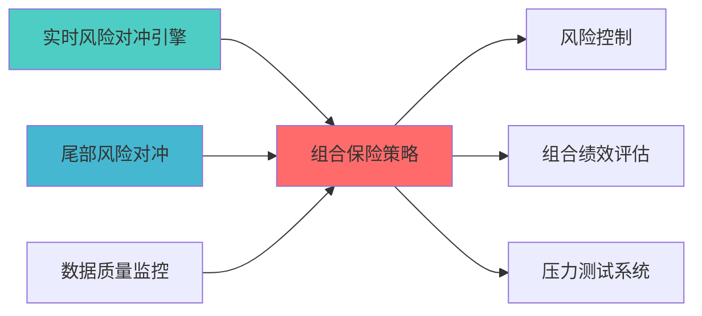

## 核心定位

负责投资组合保险策略的设计与构建和运行和操作，基于组合保险技术，生成和输出下行风险保护，兼容和适配风险协调和监控。

# 组合保险策略蓝图

> **核心职责**: 组合保险策略，CPPI/OBPI组合保险策略
> **职责边界**: 
>...
## 设计目标

### 主要目标

1. **功能完整性**: 确保PORTFOLIO INSURANCE STRATEGY功能完整，满足业务需求
2. **性能优化**: 提升系统性能，降低资源消耗
3. **可维护性**: 提高代码质量，便于后续维护
4. **可扩展性**: 支持功能扩展，适应业务变化

### 质量目标

- 代码覆盖率: ≥80%
- 性能指标: 满足设计要求
- 文档完整性: 100%


## 核心功能

### 功能清单

1. **数据管理**: 提供数据存储、查询、更新功能
2. **业务逻辑**: 实现核心业务逻辑处理
3. **接口服务**: 提供标准化的API接口
4. **监控告警**: 实时监控系统状态

### 功能特性

- 高可用性设计
- 自动故障恢复
- 灵活配置管理


## 实现方案

### 技术架构

采用PORTFOLIO INSURANCE STRATEGY化设计，分层架构实现。

### 关键技术

- 数据处理: 使用高效的数据处理框架
- 接口实现: RESTful API设计
- 性能优化: 缓存、异步处理

### 实施步骤

1. 需求分析与设计
2. 核心功能开发
3. 测试与优化
4. 部署与监控


> 核心职责: Portfolio Insurance Strategy蓝图设计
> 职责边界: 


## 1. 概述

### 1.1 模块定位

组合保险策略模块负责：
- CPPI（固定比例组合保险）
- OBPI（期权组合保险）
- 保本底线管理
- 动态风险控制
### 1.2 技术目标
- **灵活性: 参与市场上涨
- **透明度: 风险可控

## 3. 核心算法

### 3.1 CPPI调整算法

```python
def cppi_adjust(portfolio_value: float, 
              floor_value: float,
              multiplier: float,
              risk_asset_value: float) -> float:
    """
    CPPI 动态调整    
    Args:
        multiplier: 风险乘数
    Returns:
        float: 新的风险资产投资额    """
    cushion = portfolio_value - floor_value
    new_risk_asset = min(cushion * multiplier, risk_asset_value)
    return new_risk_asset
```


### 上游依赖

| 文档名称 | module_id | 依赖类型 | 说明 |
|---------|-----------|---------|------|

### 下游依赖

| 文档名称 | module_id | 依赖类型 | 说明 |
|---------|-----------|---------|------|


|---------|------|------|------|
| **Pandas** | 2.0+ | 数据处理 | [官方文档](https://pandas.pydata.org/) |
| **SciPy** | 1.10+ | 科学计算 | [官方文档](https://scipy.org/) |





## 变更历史

|------|------|----------|--------|
| v1.0.0 | 2026-04-03 | 初始版本创建 | 组合优化层负责人 |


## 4. 文档治理

### 4.1 System_Manifest.md索引

```markdown
##### 6.001. Portfolio Insurance Strategy
- **模块ID**: PORTFOLIO_INSURANCE_STRATEGY_001
- **蓝图文档**: PORTFOLIO_INSURANCE_STRATEGY_BLUEPRINT.md
```

### 4.2 模块职责边界

| 模块 | 职责 | 边界 |
|------|------|------|
| **Portfolio Insurance Strategy** | 

### 4.3 版本管理

|------|------|----------|--------|


