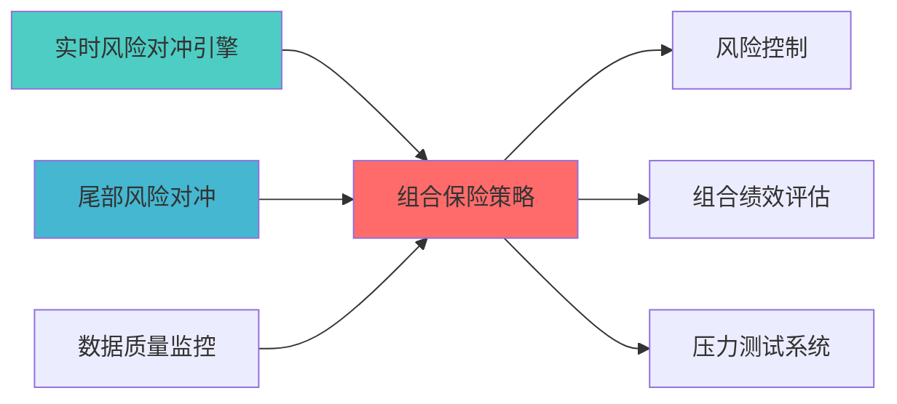

# 组合保险策略蓝图

> **核心职责**: 组合保险策略，CPPI/OBPI组合保险策略
> **职责边界**: 
> - �?本文档负责：组合保险策略、CPPI/OBPI、下行风险保护、动态对�?
> - �?本文档不负责：组合优化、风险控制、风险监�?
�? 概述

> **索引**: `CPPI__001`
> **开发时?*: 80h
> **核心定位**: CPPI/OBPI组合保险策略?--

## 核心定位

> 核心职责: Portfolio Insurance Strategy蓝图设计
> 职责边界: 
> - �?本文档负责：Portfolio Insurance Strategy蓝图设计相关内容
> - �?本文档不负责：其他模块内容，确保系统功能的稳定运行和高效执行�?


## 1. 概述

### 1.1 模块定位

组合保险策略模块负责?- CPPI（固定比例组合保险）
- OBPI（期权组合保险）
- 保本底线管理
- 动态风险控?
### 1.2 技术目?
- **安全?*: 确保本金安全
- **灵活?*: 参与市场上涨
- **透明?*: 风险可控

## 3. 核心算法

### 3.1 CPPI调整算法

```python
def cppi_adjust(portfolio_value: float, 
              floor_value: float,
              multiplier: float,
              risk_asset_value: float) -> float:
    """
    CPPI动态调?    
    Args:
        portfolio_value: 组合�?        floor_value: 保本底线
        multiplier: 风险乘数
        risk_asset_value: 风险资产�?        
    Returns:
        float: 新的风险资产投资?    """
    cushion = portfolio_value - floor_value
    new_risk_asset = min(cushion * multiplier, risk_asset_value)
    return new_risk_asset
```

---

**蓝图版本**: v1.0 | **创建日期**: 2026-04-03 | **�?*: Draft | **下一?*: 技术规格书编写

---

## 📚 相关文档

### 上游依赖

| 文档名称 | module_id | 依赖类型 | 说明 |
|---------|-----------|---------|------|
| [实时风险对冲引擎蓝图](./REALTIME_RISK_HEDGE_ENGINE_BLUEPRINT.md) | REALTIME_RISK_HEDGE_ENGINE_001 | 强依�?| 提供实时风险对冲 |
| [尾部风险对冲蓝图](./TAIL_RISK_HEDGING_BLUEPRINT.md) | TAIL_RISK_HEDGING_001 | 强依�?| 提供尾部风险对冲策略 |
| [数据质量监控蓝图](./DATA_QUALITY_MONITORING_BLUEPRINT.md) | DATA_QUALITY_MONITORING_001 | 中依�?| 提供数据质量指标 |

### 下游依赖

| 文档名称 | module_id | 依赖类型 | 说明 |
|---------|-----------|---------|------|
| [风险控制蓝图](./RISK_CONTROL_BLUEPRINT.md) | RISK_CONTROL_001 | 强依�?| 风险控制 |
| [组合绩效评估蓝图](./PORTFOLIO_PERFORMANCE_EVALUATION_BLUEPRINT.md) | PORTFOLIO_PERFORMANCE_EVALUATION_001 | 中依�?| 组合绩效评估 |
| [压力测试系统蓝图](./STRESS_TESTING_SYSTEM_BLUEPRINT.md) | STRESS_TESTING_SYSTEM_001 | 中依�?| 压力测试 |

### 技术依�?

| 技术组�?| 版本 | 用�?| 文档 |
|---------|------|------|------|
| **NumPy** | 1.24+ | 数值计�?| [官方文档](https://numpy.org/) |
| **Pandas** | 2.0+ | 数据处理 | [官方文档](https://pandas.pydata.org/) |
| **SciPy** | 1.10+ | 科学计算 | [官方文档](https://scipy.org/) |

### 引用关系�?



---

## 变更历史

| 版本 | 日期 | 变更内容 | 变更�?|
|------|------|----------|--------|
| v1.0.0 | 2026-04-03 | 初始版本创建 | 组合优化层负责人 |
| v1.0.1 | 2026-04-06 | 补充YAML头部字段和变更历�?| 审计系统 |

---

**蓝图版本**: v1.0.1 | **创建日期**: 2026-04-03 | **状�?*: Active
---

## 4. 文档治理

### 4.1 System_Manifest.md索引

```markdown
#### Layer 6: 组合优化�?
##### 6.001. Portfolio Insurance Strategy
- **模块ID**: PORTFOLIO_INSURANCE_STRATEGY_001
- **蓝图文档**: PORTFOLIO_INSURANCE_STRATEGY_BLUEPRINT.md
- **技术规格书**: 待创�?
- **职责**: 全系�?
- **状�?*: Active
```

### 4.2 模块职责边界

| 模块 | 职责 | 边界 |
|------|------|------|
| **Portfolio Insurance Strategy** | 全系�?| **核心模块** |

### 4.3 版本管理

| 版本 | 日期 | 变更内容 | 变更�?|
|------|------|----------|--------|
| v1.0.0 | 2026-04-03 | 初始版本创建 | 首席蓝图架构�?|

---

**蓝图版本**: v1.0.0 | **创建日期**: 2026-04-03 | **状�?*: Active
