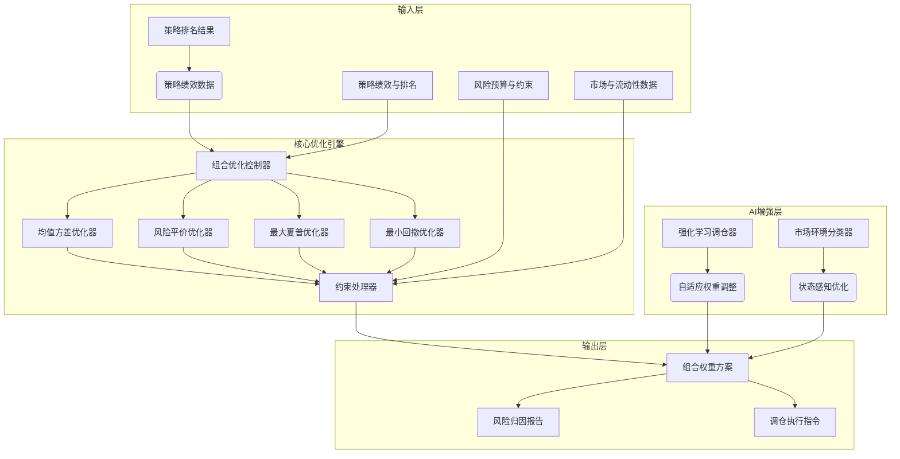

# 策略组合优化系统技术蓝图

> **版本说明**：ZephyrAlpha 专业量化交易系统 v5.3 — 策略组合优化系统详细技术设计
> **索引**: `PORTFOLIO_OPTIMIZATION_001`
> **开发周期**: 140小时（含集成与胶合开发）

> **关联文档**：本蓝图是 [STRATEGY_SELECTION_BLUEPRINT.md](./STRATEGY_SELECTION_BLUEPRINT.md) 的后续组件，专注于多策略组合构建与优化。


> **职责边界**: 
> - ✅ 本文档负责：投资组合优化框架、优化流程协调、优化结果整合
> - ❌ 本文档不负责：具体优化算法（由各优化模块负责）

## 核心定位

负责投资组合优化框架的设计与构建和运行和操作，协调各类优化器，整合优化结果，生成和输出多目标优化兼容和适配。本模块是组合优化层的核心框架，统一协调和监控各类优化任务。
### 主要目标

1. **功能完整性**: 确保PORTFOLIO OPTIMIZATION功能完整，满足业务需求
2. **性能优化**: 提升系统性能，降低资源消耗
3. **可维护性**: 提高代码质量，便于后续维护
4. **可扩展性**: 支持功能扩展，适应业务变化

### 质量目标

- 代码覆盖率: ≥80%
- 性能指标: 满足设计要求
- 文档完整性: 100%


## 核心功能

### 功能清单

1. **数据管理**: 提供数据存储、查询、更新功能
2. **业务逻辑**: 实现核心业务逻辑处理
3. **接口服务**: 提供标准化的API接口
4. **监控告警**: 实时监控系统状态

### 功能特性

- 高可用性设计
- 自动故障恢复
- 灵活配置管理


## 实现方案

### 技术架构

采用PORTFOLIO OPTIMIZATION化设计，分层架构实现。

### 关键技术

- 数据处理: 使用高效的数据处理框架
- 接口实现: RESTful API设计
- 性能优化: 缓存、异步处理

### 实施步骤

1. 需求分析与设计
2. 核心功能开发
3. 测试与优化
4. 部署与监控


## 一、设计目标与约束

### 1.1 核心设计目标

|------|--------|----------|
| **风险预算管理** | P1 | 多层次风险预算体系，支持策略层、资产层、因子层风险控制 |
| **动态调仓逻辑** | P1 | 基于市场状态、策略表现、风险指标的动态调仓决策系统 |
| **实时组合监控** | P2 | 组合风险敞口、绩效归因、风格漂移实时监控与预警 |

### 1.2 技术约束与原则

须有明确的数学逻辑和业务解释。
过预设阈值，单策略风险贡献度可控。
须考虑实盘执行可行性（流动性、冲击成本等）。

### 1.3 与现有系统集成

| 已有模块 | 集成方式 | 接口定义 |
|----------|----------|----------|
| **风险管理系统** | 输出目标 | 输出组合风险预算、风险限额要求 |
| **订单执行系统** | 输出目标 | 输出调仓指令、目标仓位 |


## 二、系统架构设计

### 2.1 架构概览



### 2.2 模块分层架构

**Layer 1 - 数据准备层**
- 策略绩效数据提取
- 风险预算解析

**Layer 2 - 核心优化层**
- 组合优化控制器（调度器）
- 多种优化算法实现
- 约束条件处理

**Layer 3 - AI增强层**
- 强化学习与自适应调仓
- 市场环境感知优化
- 自适应调仓决策

**Layer 4 - 结果输出层**
- 组合权重输出
- 风险归因分析
- 调仓指令生成


## 三、核心组件详细设计

### 3.1 组合优化控制器（PortfolioOptimizationController）

```python
class PortfolioOptimizationController:
    """
    组合优化控制器 — 负责调度不同的优化算法，管理优化流程
    """
    
    def __init__(self, config: OptimizationConfig):
        self.config = config
        self.optimizers = {
            'mean_variance': MeanVarianceOptimizer(),
            'risk_parity': RiskParityOptimizer(),
            'max_sharpe': MaxSharpeOptimizer(),
            'min_drawdown': MinDrawdownOptimizer(),
            'black_litterman': BlackLittermanOptimizer()
        }
        self.constraint_processor = ConstraintProcessor()
        self.risk_budget_manager = RiskBudgetManager()
        
    async def optimize_portfolio(self, optimization_request: OptimizationRequest) -> OptimizationResult:
        """
        执行组合优化
        
        Args:
            optimization_request: 含策略列表、绩效数据、约束条件等

        Returns:
        """
        # 1. 数据准备与验证
        validated_data = await self._prepare_optimization_data(optimization_request)
        
        # 2. 风险预算处理
        risk_constraints = self.risk_budget_manager.process_budget(optimization_request.risk_budget)
        
        # 3. 执行优化算法
        optimizer = self.optimizers.get(optimization_request.optimization_method)
        if not optimizer:
            raise ValueError(f"不支持的优化方法: {optimization_request.optimization_method}")
            
        raw_weights = optimizer.optimize(
            returns=validated_data['returns'],
            cov_matrix=validated_data['cov_matrix'],
            constraints=risk_constraints
        )
        
        # 4. 应用交易成本与流动性约束
        adjusted_weights = self.constraint_processor.apply_real_world_constraints(
            raw_weights, 
            optimization_request.trading_constraints
        )
        
        # 5. 生成优化报告
        result = OptimizationResult(
            weights=adjusted_weights,
            expected_return=self._calculate_expected_return(adjusted_weights, validated_data['returns']),
            risk_metrics=self._calculate_risk_metrics(adjusted_weights, validated_data['cov_matrix']),
            risk_attribution=self._calculate_risk_attribution(adjusted_weights, validated_data['cov_matrix']),
            optimization_details={
                'method': optimization_request.optimization_method,
                'constraints_applied': risk_constraints,
                'iterations': optimizer.get_iteration_count()
            }
        )
        
        return result
    
    async def _prepare_optimization_data(self, request: OptimizationRequest) -> Dict:
        """
        准备优化所需数据
        """
        # 提取策略绩效数据
        returns_data = []
        for strategy in request.strategies:
            # 从批量评估结果中获取策略的历史收益序列
            performance = await self._get_strategy_performance(strategy.strategy_id)
            returns_data.append(performance['returns_series'])
        
        returns_df = pd.DataFrame(returns_data).T
        cov_matrix = returns_df.cov()
        correlation_matrix = returns_df.corr()
        
        return {
            'returns': returns_df.mean(),
            'cov_matrix': cov_matrix,
            'correlation_matrix': correlation_matrix,
            'strategy_ids': [s.strategy_id for s in request.strategies]
        }
```


```python
class MeanVarianceOptimizer:
    """
    使用 PyPortfolioOpt 库实现
    """
    
    def __init__(self, risk_free_rate: float = 0.02):
        self.risk_free_rate = risk_free_rate
        
    def optimize(self, returns: pd.Series, cov_matrix: pd.DataFrame, 
                constraints: List[Constraint]) -> pd.Series:
        """
        
        Args:
            returns: 各策略预期收益率
            cov_matrix: 协方差矩阵
            constraints: 约束条件列表
            
        Returns:
            pd.Series: 最优权重分布
        """
        # 使用 PyPortfolioOpt 求解
        from pypfopt import EfficientFrontier
        
        # 创建有效前沿
        ef = EfficientFrontier(returns, cov_matrix)
        
        # 应用约束条件
        for constraint in constraints:
            if constraint.type == 'weight_bound':
                ef.add_constraint(lambda w: w[constraint.strategy_idx] <= constraint.max_weight)
            elif constraint.type == 'sector_limit':
                # 行业限制约束
                pass
        
        # 优化目标：最小化波动率或最大化夏普比率
        if constraints.optimization_target == 'min_volatility':
            weights = ef.min_volatility()
        elif constraints.optimization_target == 'max_sharpe':
            weights = ef.max_sharpe()
        elif constraints.optimization_target == 'efficient_risk':
            weights = ef.efficient_risk(target_volatility=constraints.target_volatility)
        elif constraints.optimization_target == 'efficient_return':
            weights = ef.efficient_return(target_return=constraints.target_return)
        
        # 清理数值噪声权重
        cleaned_weights = ef.clean_weights()
        
        return pd.Series(cleaned_weights)
    
    def plot_efficient_frontier(self, returns: pd.Series, cov_matrix: pd.DataFrame):
        """
        绘制有效前沿图
        """
        from pypfopt import plotting
        
        ef = EfficientFrontier(returns, cov_matrix)
        fig, ax = plt.subplots()
        plotting.plot_efficient_frontier(ef, ax=ax, show_assets=True)
        
        # 标记最优组合点
        if hasattr(self, 'optimal_weights'):
            ret, vol, sharpe = ef.portfolio_performance(weights=self.optimal_weights)
            ax.scatter(vol, ret, marker='*', s=200, c='r', label='最优组合')
        
        ax.legend()
        return fig
```

### 3.3 风险平价优化器（RiskParityOptimizer）

```python
class RiskParityOptimizer:
    """
    使用 Riskfolio-Lib 库实现
    """
    
    def __init__(self, risk_measure: str = 'CVaR', alpha: float = 0.05):
        self.risk_measure = risk_measure  # CVaR, VaR, CDaR, EDaR 等
        self.alpha = alpha  # CVaR置信水平
        
    def optimize(self, returns: pd.DataFrame, constraints: List[Constraint]) -> pd.Series:
        """
        执行风险平价优化
        
        Args:
            returns: 策略收益数据框
            constraints: 约束条件
            
        Returns:
            pd.Series: 风险平价权重
        """
        import riskfolio as rp
        
        # 创建投资组合对象
        port = rp.Portfolio(returns=returns)
        
        # 选择风险度量方法
        port.assets_stats(method_mu='hist', method_cov='hist')
        
        # 设置优化问题
        rm = self.risk_measure  # 风险度量方法
        obj = 'Risk'  # 目标函数：最小化风险
        hist = True  # 使用历史数据
        
        # 设置约束条件
        upper_bound = constraints.get('upper_bound', 1.0)
        lower_bound = constraints.get('lower_bound', 0.0)
        
        # 执行风险平价优化
        w = port.rp_optimization(
            model=model,
            rm=rm,
            rf=0,  # 无风险利率
            b=None,  # 风险预算（None表示等风险贡献）
            hist=hist,
            upper_bound=upper_bound,
            lower_bound=lower_bound
        )
        
        return w
    
    def calculate_risk_contribution(self, weights: pd.Series, cov_matrix: pd.DataFrame) -> pd.Series:
        """
        计算各策略的风险贡献度
        """
        portfolio_variance = weights.T @ cov_matrix @ weights
        marginal_risk_contribution = cov_matrix @ weights
        risk_contribution = weights * marginal_risk_contribution / portfolio_variance
        
        return risk_contribution
    
    def plot_risk_contribution(self, weights: pd.Series, cov_matrix: pd.DataFrame):
        """
        绘制风险贡献度图
        """
        risk_contrib = self.calculate_risk_contribution(weights, cov_matrix)
        
        fig, (ax1, ax2) = plt.subplots(1, 2, figsize=(12, 5))
        
        # 权重分布图
        weights.plot(kind='bar', ax=ax1, color='skyblue')
')
        ax1.set_ylabel('权重比例')
        ax1.tick_params(axis='x', rotation=45)
        
        # 风险贡献度图
        risk_contrib.plot(kind='bar', ax=ax2, color='lightcoral')
        ax2.set_title('风险贡献度分布')
        ax2.set_ylabel('风险贡献度')
        ax2.tick_params(axis='x', rotation=45)
        
        plt.tight_layout()
        return fig
```

### 3.4 约束处理器（ConstraintProcessor）

```python
class ConstraintProcessor:
    """
    约束处理器 — 处理各种实盘约束条件
    """
    
    def __init__(self):
        self.constraint_handlers = {
            'position_limit': self._handle_position_limit,
            'turnover_limit': self._handle_turnover_limit,
            'liquidity_constraint': self._handle_liquidity_constraint,
            'transaction_cost': self._handle_transaction_cost,
            'sector_exposure': self._handle_sector_exposure,
            'factor_exposure': self._handle_factor_exposure
        }
        
    def apply_real_world_constraints(self, raw_weights: pd.Series, 
                                    constraints: Dict[str, Any]) -> pd.Series:
        """
        应用实盘约束条件
        
        Args:
            raw_weights: 理论优化权重
¸
            
        Returns:
            pd.Series: 调整后的实盘可行权重
        """
        adjusted_weights = raw_weights.copy()
        
        constraint_priority = [
            'position_limit',      # 仓位限制（监管要求）
            'liquidity_constraint', # 流动性约束
            'transaction_cost',    # 交易成本
            'turnover_limit',      # 换手率限制
            'sector_exposure',     # 行业暴露限制
            'factor_exposure'      # 因子暴露限制
        ]
        
        for constraint_type in constraint_priority:
            if constraint_type in constraints:
                handler = self.constraint_handlers.get(constraint_type)
                if handler:
                    adjusted_weights = handler(adjusted_weights, constraints[constraint_type])
        
        # 确保权重和为1（归一化）
        adjusted_weights = adjusted_weights / adjusted_weights.sum()
        
        return adjusted_weights
    
    def _handle_position_limit(self, weights: pd.Series, limit_config: Dict) -> pd.Series:
        """
        处理单策略仓位限制
        """
        max_position = limit_config.get('max_position', 0.3)  # 默认单策略最大仓位 30%
        min_position = limit_config.get('min_position', 0.01) # 默认最小仓位 1%
        
        # 应用上下界
        weights = weights.clip(lower=min_position, upper=max_position)
        
        return weights
    
    def _handle_transaction_cost(self, weights: pd.Series, cost_config: Dict) -> pd.Series:
        """
        处理交易成本约束
        """
        current_positions = cost_config.get('current_positions', pd.Series(0, index=weights.index))
        transaction_costs = cost_config.get('transaction_costs', {})
        
        # 计算调仓比例
        rebalance_amount = abs(weights - current_positions)
        
        # 估算交易成本
        total_cost = 0
        for strategy_id in weights.index:
            if strategy_id in transaction_costs:
                cost_rate = transaction_costs[strategy_id]
                strategy_cost = rebalance_amount[strategy_id] * cost_rate
                total_cost += strategy_cost
        
        cost_threshold = cost_config.get('cost_threshold', 0.005)  # 默认0.5%
        if total_cost > cost_threshold:
            reduction_factor = cost_threshold / total_cost
            weights = current_positions + (weights - current_positions) * reduction_factor
        
        return weights
    
    def _handle_liquidity_constraint(self, weights: pd.Series, liquidity_config: Dict) -> pd.Series:
        """
        处理流动性约束
        """
        liquidity_data = liquidity_config.get('liquidity_data', {})
        portfolio_value = liquidity_config.get('portfolio_value', 1e6)  # 默认组合规模（示例）
        
        adjusted_weights = weights.copy()
        
        for strategy_id, weight in weights.items():
            if strategy_id in liquidity_data:
                daily_volume = liquidity_data[strategy_id].get('daily_volume', 0)
                position_value = weight * portfolio_value
                

超过日成交量的 5%（示例）
                max_daily_trade = daily_volume * 0.05
                if position_value > max_daily_trade * 3:  # 多日建仓约束（示例）
                    adjusted_weights[strategy_id] = (max_daily_trade * 3) / portfolio_value
        
        return adjusted_weights
```

### 3.5 强化学习调仓器（RLRebalancer）

```python
class RLRebalancer:
    """
    强化学习调仓器 — 使用强化学习优化动态调仓决策
    """
    
    def __init__(self, state_dim: int = 20, action_dim: int = 10):
        
        # 使用 Stable-Baselines3
        self.model = None
        self.env = None
        
    def train(self, historical_data: pd.DataFrame, 
              training_episodes: int = 10000) -> None:
        """
        训练强化学习模型
        
        Args:
            historical_data: 历史市场数据和策略表现数据
            training_episodes: 训练轮数
        """
        # 创建强化学习环境
        self.env = PortfolioRebalanceEnv(
            data=historical_data,
            initial_weights=np.ones(self.action_dim) / self.action_dim,
            transaction_cost=0.001,
            lookback_window=20
        )
        
        # 使用 PPO 算法（Proximal Policy Optimization）
        from stable_baselines3 import PPO
        
        self.model = PPO(
            'MlpPolicy',
            self.env,
            verbose=1,
            learning_rate=0.0003,
            n_steps=2048,
            batch_size=64,
            n_epochs=10,
            gamma=0.99,
            gae_lambda=0.95,
            clip_range=0.2,
            clip_range_vf=None,
            ent_coef=0.01,
            vf_coef=0.5,
            max_grad_norm=0.5,
            use_sde=False,
            sde_sample_freq=-1,
            target_kl=None,
            tensorboard_log="./rl_rebalancer_logs/"
        )
        
        # 训练模型
        self.model.learn(total_timesteps=training_episodes)
        
    def predict_rebalance_action(self, current_state: Dict) -> np.ndarray:
        """
        预测调仓动作
        
        Args:
            current_state: 当前状态（市场状态、策略表现、风险指标等）
            
        Returns:
            np.ndarray: 权重调整动作
        """
        if self.model is None:
        
        observation = self._format_state_to_observation(current_state)
        
        # 预测动作
        action, _ = self.model.predict(observation, deterministic=True)
        
        return action
    
    def _format_state_to_observation(self, state: Dict) -> np.ndarray:
        """
        """
        # 市场状态特征
        market_features = [
            state.get('market_trend', 0),
            state.get('market_volatility', 0),
            state.get('market_liquidity', 0),
            state.get('economic_regime', 0)
        ]
        
        # 策略表现特征
        strategy_features = []
        for strategy_id in state.get('strategy_performance', {}):
            perf = state['strategy_performance'][strategy_id]
            strategy_features.extend([
                perf.get('sharpe_ratio', 0),
                perf.get('max_drawdown', 0),
                perf.get('win_rate', 0),
                perf.get('profit_factor', 0)
            ])
        
        # 风险指标特征
        risk_features = [
            state.get('portfolio_var', 0),
            state.get('portfolio_cvar', 0),
            state.get('concentration_risk', 0),
            state.get('liquidity_risk', 0)
        ]
        
        # 组合成观察向量
        observation = np.concatenate([
            market_features,
            strategy_features[:min(len(strategy_features), 8)],  # 最多 8 个策略特征
            risk_features
        ])
        

或截断至固定维度
        if len(observation) < self.state_dim:
            observation = np.pad(observation, (0, self.state_dim - len(observation)))
        elif len(observation) > self.state_dim:
            observation = observation[:self.state_dim]
        
        return observation
```


## 四、开源模块集成方案

### 4.1 PyPortfolioOpt集成

```yaml
# PyPortfolioOpt 配置片段（示例）
pypfopt_config:
  optimization_methods:
    - name: "mean_variance"
      parameters:
        target_return: null
        target_volatility: null
        market_neutral: false
        risk_free_rate: 0.02
    
    - name: "efficient_risk"
      description: "给定风险水平下的最优收益"
      parameters:
        target_volatility: 0.15
    
    - name: "efficient_return"
      description: "给定收益水平下的最小风险"
      parameters:
        target_return: 0.10
  
  constraints:
    weight_bounds: [0.01, 0.3]  # 单策略权重范围 1%-30%
    sector_exposure: null
    factor_exposure: null
  
  risk_model:
    covariance_estimator: "sample_cov"  # 样本协方差
    shrinkage_method: "ledoit_wolf"     # Ledoit-Wolf收缩估计
```

### 4.2 Riskfolio-Lib集成

```yaml
# Riskfolio-Lib 配置片段（示例）
riskfolio_config:
  risk_measures:
    - name: "CVaR"
      parameters:
        alpha: 0.05
        confidence_level: 0.95
    
    - name: "CDaR"
      description: "条件在险回撤"
      parameters:
        alpha: 0.05
    
    - name: "EDaR"
      description: "熵在险价值（示例）"
      parameters:
        alpha: 0.05
  
  optimization_models:
    - name: "Classic"
    
    - name: "BL"
      description: "Black-Litterman模型"
      parameters:
        P: null  # 观点矩阵
        Q: null  # 观点收益向量
        Omega: null  # 观点不确定性矩阵
    
    - name: "FM"
      description: "因子模型风险平价"
  
  constraints:
    upper_bound: 0.3
    lower_bound: 0.01
    budget: 1.0
```

### 4.3 CVXPY 集成（自定义优化问题）

```python
# 自定义优化问题示例：最小化回撤优化
import cvxpy as cp

class MinDrawdownOptimizer:
    """
    最小化回撤优化 — 使用 CVXPY 求解自定义优化问题
    """
    
    def optimize(self, returns: pd.DataFrame, max_positions: int = 10) -> pd.Series:
        n_assets = returns.shape[1]
        
        # 决策变量：权重向量
        w = cp.Variable(n_assets)
        
        # 计算组合收益序列
        portfolio_returns = returns.values @ w
        
        # 计算累积收益和回撤
        cumulative_returns = cp.cumsum(portfolio_returns)
        running_max = cp.maximum.accumulate(cumulative_returns)
        drawdown = running_max - cumulative_returns
        
        # 目标函数：最小化最大回撤
        objective = cp.Minimize(cp.max(drawdown))
        
        # 约束条件
        constraints = [
            cp.sum(w) == 1,  # 权重和为1
            w <= 0.3,  # 单资产最大权重 30%
            cp.norm(w, 0) <= max_positions  # 最多持有 max_positions 个策略
        ]
        
        # 求解优化问题
        problem = cp.Problem(objective, constraints)
        problem.solve(solver=cp.ECOS)
        
        return pd.Series(w.value, index=returns.columns)
```


### 5.1 完整优化流程示例

```python
async def run_complete_portfolio_optimization():
    """
    完整的组合优化流程示例
    """
    # 1. 从策略选择系统获取已选择的策略
    selection_system = StrategySelectionSystem()
    selected_strategies = await selection_system.get_top_strategies(
        count=10,
        criteria=['sharpe_ratio', 'max_drawdown', 'win_rate']
    )
    
    # 2. 从批量评估系统获取策略绩效数据
    batch_evaluator = BatchEvaluationSystem()
    performance_data = await batch_evaluator.get_strategy_performance(
        strategy_ids=[s.id for s in selected_strategies],
        lookback_period=252  # 一年交易日（示例）
    )
    
    # 3. 构建优化配置（示例）
    optimization_config = {
        'optimization_method': 'mean_variance',
        'optimization_target': 'max_sharpe',
        'risk_budget': {
            'max_portfolio_volatility': 0.15,
            'max_drawdown_budget': 0.20,
            'strategy_risk_limits': {
                strategy_id: {'max_risk_contribution': 0.25}
                for strategy_id in performance_data.keys()
            }
        },
        'trading_constraints': {
            'position_limit': {'max_position': 0.3, 'min_position': 0.01},
            'transaction_cost': {'cost_rate': 0.001, 'cost_threshold': 0.005},
            'liquidity_constraint': {
                'portfolio_value': 1000000,
                'liquidity_data': await get_liquidity_data()
            }
        }
    }
    
    # 4. 创建优化请求
    optimization_request = OptimizationRequest(
        strategies=selected_strategies,
        performance_data=performance_data,
        config=optimization_config
    )
    
    # 5. 执行组合优化
    optimizer = PortfolioOptimizationController(config=optimization_config)
    result = await optimizer.optimize_portfolio(optimization_request)
    
    # 6. 输出优化结果
    print("=" * 60)
    print("组合优化结果")
    print("=" * 60)
    
:")
    for strategy_id, weight in result.weights.items():
        print(f"  {strategy_id}: {weight:.2%}")
    
    print(f"\n预期绩效:")
    print(f"  预期年化收益: {result.expected_return:.2%}")
    print(f"  预期年化波动: {result.risk_metrics['annual_volatility']:.2%}")
    print(f"  预期夏普比率: {result.risk_metrics['sharpe_ratio']:.2f}")
    print(f"  预期最大回撤 {result.risk_metrics['max_drawdown']:.2%}")
    
    print(f"\n风险贡献度")
    for strategy_id, risk_contrib in result.risk_attribution['strategy_contributions'].items():
        print(f"  {strategy_id}: {risk_contrib:.2%}")
    
    # 7. 生成可视化报告
    report_generator = OptimizationReportGenerator()
    report = report_generator.generate_report(result)
    
    # 保存报告
    report.save("portfolio_optimization_report.html")
    
    return result
```

### 5.2 命令行接口示例

```bash
# 查看可用的优化方法
python portfolio_optimizer.py list-methods

python portfolio_optimizer.py optimize \
  --method mean_variance \
  --target max_sharpe \
  --strategies strategy_001 strategy_002 strategy_003 \
  --lookback-days 252 \
  --risk-limit 0.15 \
  --output results/optimization_result.json

# 执行风险平价优化
python portfolio_optimizer.py optimize \
  --method risk_parity \
  --risk-measure CVaR \
  --alpha 0.05 \
  --strategies strategy_004 strategy_005 strategy_006 \
  --lookback-days 504 \
  --output results/risk_parity_result.json

# 生成优化报告
python portfolio_optimizer.py generate-report \
  --input results/optimization_result.json \
  --output reports/optimization_report.html

# 批量优化测试
python portfolio_optimizer.py batch-optimize \
  --config configs/batch_optimization.yaml \
  --output-dir results/batch_optimization/
```

### 5.3 YAML 配置示例

```yaml
# configs/portfolio_optimization.yaml
portfolio_optimization:
  input:
    strategy_source: "strategy_selection_system"
    top_strategy_count: 15
    selection_criteria: ["sharpe_ratio", "max_drawdown", "win_rate", "profit_factor"]
    lookback_period: 252  # 交易日

  optimization:
    primary_method: "mean_variance"
    alternative_methods: ["risk_parity", "max_sharpe", "min_drawdown"]
    optimization_target: "max_sharpe"
    risk_free_rate: 0.02

  risk_budget:
    max_portfolio_volatility: 0.15
    max_strategy_weight: 0.25
    strategy_limits:
      min_strategies: 5
      max_strategies: 12

  trading_constraints:
    position_limits:
      max_single_position: 0.30
      min_position: 0.01
    turnover_limits:
      max_monthly_turnover: 0.60
    transaction_costs:
      default_cost_rate: 0.001
      strategy_specific_costs:
        high_frequency_strategy: 0.002
        options_strategy: 0.003

  output:
    generate_report: true
    report_format: "html"
    save_weights: true
    weights_format: "json"
    visualize_results: true
    create_performance_charts: true

  monitoring:
    rebalance_frequency: "weekly"
    performance_check_frequency: "daily"
    alert_thresholds:
      drawdown_warning: 0.08
      volatility_warning: 0.08
      concentration_warning: 0.05
```


## 六、实施路线图

### 6.1 开发阶段划分

**阶段一：基础框架搭建（约 6 周）**
- 创建组合优化控制器基类
- 集成 PyPortfolioOpt 基础优化功能
- 实现基本约束处理
- 开发数据准备模块

**阶段二：高级优化算法（约 6 周）**
- 集成 Riskfolio-Lib 风险平价优化
- 实现 CVXPY 自定义优化问题
- 开发 Black-Litterman 模型
- 添加因子模型优化

**阶段三：AI 增强功能（约 6 周）**
- 实现强化学习调仓原型
- 开发市场环境感知优化器
- 添加自适应权重调整算法
- 集成机器学习风险预测

**阶段四：实盘集成与优化（6 周）**
- 与订单执行系统集成
- 实盘约束条件精细化处理
- 第三方存管与清算对接（如适用）
- 容错机制与监控告警

### 6.2 里程碑与交付物

| 里程碑 | 预计完成时间 | 交付物 | 成功标准 |
|--------|--------------|--------|----------|
| **M3：AI 调仓系统** | 第 18 周结束 | 1. 强化学习调仓原型<br>2. 市场环境分类<br>3. 自适应优化框架 | AI 调仓策略样本外表现优于静态基准（约定指标） |
| **M4：实盘就绪** | 第 24 周结束 | 1. 完整实盘约束处理<br>2. 高性能优化引擎<br>3. 监控告警系统 | 通过约 3 个月模拟盘测试，换手率等指标在预设区间 |

### 6.3 风险评估与应对

| 风险类型 | 概率 | 影响 | 应对措施 |
|----------|------|------|----------|
| **优化结果过拟合** | 中 | 高 | 1. 样本外测试验证<br>2. 正则化技术应用<br>3. 参数敏感性分析 |
| **计算性能瓶颈** | 中 | 中 | 1. 并行计算优化<br>2. 缓存机制实现<br>3. 增量计算算法 |
| **实盘执行偏差** | 中 | 高 | 1. 交易成本精确建模<br>2. 流动性约束处理<br>3. 滑点模拟测试 |
| **模型风险** | 低 | 高 | 1. 多模型对比验证<br>2. 压力测试<br>3. 人工干预机制 |


## 七、附录：开源项目参考

### 7.1 核心优化库

1. **PyPortfolioOpt** — Python 投资组合优化库
   - GitHub: https://github.com/robertmartin8/PyPortfolioOpt
   - 集成方式：作为均值方差与有效前沿相关能力的基础依赖。

2. **Riskfolio-Lib** — Python 风险平价与组合优化库
   - GitHub: https://github.com/dcajasn/Riskfolio-Lib
   - 特点：专业风险平价实现，支持多种风险度量（CVaR、CDaR、EDaR 等）
   - 集成方式：作为高级风险平价与鲁棒优化模块。

3. **CVXPY** — Python 凸优化建模库
   - GitHub: https://github.com/cvxpy/cvxpy
   - 特点：凸优化求解与约束表达
   - 集成方式：用于自定义目标（如回撤、换手惩罚等）。

4. **Stable-Baselines3** — 强化学习库
   - GitHub: https://github.com/DLR-RM/stable-baselines3
   - 特点：PPO、A2C、SAC 等算法实现
   - 集成方式：用于强化学习调仓与决策实验。

5. **scikit-learn** — 机器学习库
   - GitHub: https://github.com/scikit-learn/scikit-learn
   - 特点：分类、回归、特征工程与模型评估
   - 集成方式：市场状态识别与辅助特征。

6. **TA-Lib** — 技术分析库
   - GitHub: https://github.com/mrjbq7/ta-lib
   - 特点：技术指标计算
   - 集成方式：策略侧特征工程（若需）。

### 7.3 数据与可视化

7. **yfinance** — 雅虎财经数据接口
   - GitHub: https://github.com/ranaroussi/yfinance
   - 集成方式：获取行情与基本面等公开数据（需自行校验授权与质量）。

8. **Plotly/Dash** — 交互式可视化
   - GitHub: https://github.com/plotly/plotly.py
   - 特点：交互式图表与简易 Web 报告
   - 集成方式：优化结果展示与内部分享。

### 7.4 参考实现项目

9. **Qlib** — 微软量化研究框架
   - GitHub: https://github.com/microsoft/qlib
   - 参考价值：研究流水线、因子与组合实验的组织方式。

10. **QuantConnect Lean** — 开源量化引擎
    - GitHub: https://github.com/QuantConnect/Lean
    - 参考价值：实盘撮合、订单与组合管理的工程化结构。

## 八、总结与展望

本蓝图强调在统一框架下编排多种优化器与约束，支持灵活组合与扩展；实施时需充分考虑交易成本、流动性与监管限制等实盘因素。

4. **风险可控**：多层次风险预算体系，将组合风险约束在预设范围内。  
5. **AI 增强**：利用强化学习与机器学习改进动态调仓与状态感知。

对非研发读者而言，主要工程工作通常包括：将各开源组件集成到统一服务与配置体系中（约占较大工作量）、参数与配置调优、测试与验证、以及文档与界面（命令行或 Web）交付。

通过分阶段实施（例如约 24 周开发周期），可逐步构建专业级策略组合优化能力，支撑多策略协同、风险分散与绩效改进。

*文档结束 — 策略组合优化系统技术蓝图 v1.0*

## 变更历史

|------|------|----------|--------|


