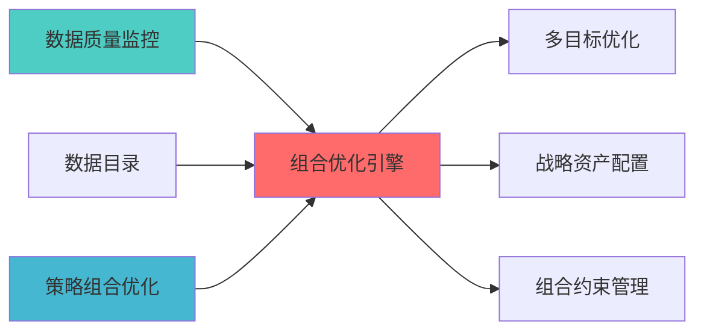

---
module_id: PORTFOLIO_OPTIMIZER_INTEGRATION_001
version: 1.0.0
status: Active
created_date: 2026-04-06
last_updated: '2026-04-06'
owner: 首席蓝图架构师
standard_type: 专业量化机构蓝图
applicable_scope: Layer 6 组合优化层
compliance_level: 专业标准
parent_document: ../INDEX.md
implementation_status: 蓝图设计阶段
open_source_dependency: PyPortfolioOpt, Riskfolio-Lib, skfolio, deepfolio, cvxpy
estimated_effort: 5-7天
priority: P0
layer: "Layer 6 (组合优化层)"
---


# 组合优化引擎集成模块蓝图

> **核心定位**: 组合优化引擎集成模块蓝图的核心功能实现


> **索引**: `OPTIMIZER_INTEGRATION_001`
> **开发周期**: 5-7天
> **核心定位**: 统一优化器接口，多优化器集成，优化器选择策略
> **参考开源**: PyPortfolioOpt + Riskfolio-Lib + skfolio + deepfolio + cvxpy
> **专业对标**: 所有专业量化机构必备模块

## 1. 概述

### 1.1 模块定位

**Layer定位**: Layer 6 - 组合优化层（优化引擎模块）

**核心价值**:
- 多优化器集成（PyPortfolioOpt、Riskfolio-Lib、skfolio、deepfolio）
- 统一优化器接口
- 优化器选择策略
- 优化结果验证
- 优化性能对比

**业务价值**:
- 提供多种优化方法选择
- 提升优化灵活性
- 支持优化方法对比

### 1.2 版本信息

| 项目 | 内容 |
|------|------|
| **模块ID** | PORTFOLIO_OPTIMIZER_INTEGRATION_001 |
| **版本** | v1.0.0 |
| **开源依赖** | PyPortfolioOpt, Riskfolio-Lib, skfolio, deepfolio, cvxpy |
| **预计工时** | 5-7天 |

---

## 📚 相关文档

### 上游依赖

| 文档名称 | module_id | 依赖类型 | 说明 |
|---------|-----------|---------|------|
| [数据质量监控蓝图](./DATA_QUALITY_MONITORING_BLUEPRINT.md) | DATA_QUALITY_MONITORING_001 | 强依赖 | 提供数据质量指标输入 |
| [数据目录蓝图](./DATA_CATALOG_BLUEPRINT.md) | DATA_CATALOG_001 | 强依赖 | 提供组合元数据管理 |
| [STRATEGY_PORTFOLIO_OPTIMIZATION_BLUEPRINT.md](./STRATEGY_PORTFOLIO_OPTIMIZATION_BLUEPRINT.md) | STRATEGY_PORTFOLIO_OPTIMIZATION_001 | 强依赖 | 提供组合优化需求 |

### 下游依赖

| 文档名称 | module_id | 依赖类型 | 说明 |
|---------|-----------|---------|------|
| [MULTI_OBJECTIVE_OPTIMIZATION_BLUEPRINT.md](./MULTI_OBJECTIVE_OPTIMIZATION_BLUEPRINT.md) | MULTI_OBJECTIVE_OPTIMIZATION_001 | 强依赖 | 多目标优化扩展 |
| [STRATEGIC_ALLOCATION_ENGINE_BLUEPRINT.md](./STRATEGIC_ALLOCATION_ENGINE_BLUEPRINT.md) | STRATEGIC_ALLOCATION_ENGINE_001 | 强依赖 | 战略资产配置 |
| [PORTFOLIO_CONSTRAINT_MANAGEMENT_BLUEPRINT.md](./PORTFOLIO_CONSTRAINT_MANAGEMENT_BLUEPRINT.md) | PORTFOLIO_CONSTRAINT_MANAGEMENT_001 | 强依赖 | 组合约束管理 |

### 技术依赖

| 技术组件 | 版本 | 用途 | 文档 |
|---------|------|------|------|
| **PyPortfolioOpt** | 1.5+ | 组合优化 | [官方文档](https://pyportfolioopt.readthedocs.io/) |
| **Riskfolio-Lib** | 5.0+ | 风险优化 | [官方文档](https://riskfolio-lib.readthedocs.io/) |
| **skfolio** | 1.0+ | 组合学习 | [官方文档](https://skfolio.org/) |
| **CVXPY** | 1.5+ | 凸优化 | [官方文档](https://www.cvxpy.org/) |

### 引用关系图



---

## 2. 技术实现

### 2.1 核心API

```python
from abc import ABC, abstractmethod
from typing import Dict, Optional
import pandas as pd
import numpy as np

class BaseOptimizer(ABC):
    """优化器基类"""
    
    @abstractmethod
    def optimize(
        self,
        expected_returns: np.ndarray,
        cov_matrix: np.ndarray,
        constraints: Optional[Dict] = None
    ) -> np.ndarray:
        """
        执行优化
        
        Args:
            expected_returns: 预期收益率
            cov_matrix: 协方差矩阵
            constraints: 约束条件
            
        Returns:
            最优权重
        """
        pass

class PyPortfolioOptOptimizer(BaseOptimizer):
    """PyPortfolioOpt优化器"""
    
    def optimize(
        self,
        expected_returns: np.ndarray,
        cov_matrix: np.ndarray,
        constraints: Optional[Dict] = None
    ) -> np.ndarray:
        from pypfopt import EfficientFrontier
        
        ef = EfficientFrontier(expected_returns, cov_matrix)
        if constraints:
            # 应用约束
            pass
        weights = ef.max_sharpe()
        return np.array(list(weights.values()))

class RiskfolioLibOptimizer(BaseOptimizer):
    """Riskfolio-Lib优化器"""
    
    def optimize(
        self,
        expected_returns: np.ndarray,
        cov_matrix: np.ndarray,
        constraints: Optional[Dict] = None
    ) -> np.ndarray:
        import riskfolio as rp
        
        # Riskfolio-Lib优化逻辑
        pass

class SkfolioOptimizer(BaseOptimizer):
    """skfolio优化器"""
    
    def optimize(
        self,
        expected_returns: np.ndarray,
        cov_matrix: np.ndarray,
        constraints: Optional[Dict] = None
    ) -> np.ndarray:
        from skfolio import Portfolio
        
        # skfolio优化逻辑
        pass

class DeepfolioOptimizer(BaseOptimizer):
    """deepfolio优化器"""
    
    def optimize(
        self,
        expected_returns: np.ndarray,
        cov_matrix: np.ndarray,
        constraints: Optional[Dict] = None
    ) -> np.ndarray:
        import deepfolio as df
        
        # deepfolio优化逻辑
        pass

class OptimizerIntegration:
    """优化器集成管理器"""
    
    def __init__(self):
        self.optimizers = {
            'pypfopt': PyPortfolioOptOptimizer(),
            'riskfolio': RiskfolioLibOptimizer(),
            'skfolio': SkfolioOptimizer(),
            'deepfolio': DeepfolioOptimizer()
        }
        
    def optimize_with_method(
        self,
        method: str,
        expected_returns: np.ndarray,
        cov_matrix: np.ndarray,
        constraints: Optional[Dict] = None
    ) -> np.ndarray:
        """
        使用指定方法优化
        
        Args:
            method: 优化方法名称
            expected_returns: 预期收益率
            cov_matrix: 协方差矩阵
            constraints: 约束条件
            
        Returns:
            最优权重
        """
        optimizer = self.optimizers.get(method)
        if not optimizer:
            raise ValueError(f"Unknown optimizer: {method}")
            
        return optimizer.optimize(expected_returns, cov_matrix, constraints)
    
    def compare_optimizers(
        self,
        expected_returns: np.ndarray,
        cov_matrix: np.ndarray,
        constraints: Optional[Dict] = None
    ) -> pd.DataFrame:
        """
        对比多个优化器结果
        
        Returns:
            优化结果对比表
        """
        results = {}
        for name, optimizer in self.optimizers.items():
            weights = optimizer.optimize(expected_returns, cov_matrix, constraints)
            
            # 计算绩效指标
            portfolio_return = np.dot(weights, expected_returns)
            portfolio_volatility = np.sqrt(np.dot(weights.T, np.dot(cov_matrix, weights)))
            sharpe_ratio = portfolio_return / portfolio_volatility
            
            results[name] = {
                'expected_return': portfolio_return,
                'volatility': portfolio_volatility,
                'sharpe_ratio': sharpe_ratio,
                'weights': weights
            }
            
        return pd.DataFrame(results).T
```

### 2.2 优化器特性对比

| 优化器 | 特点 | 适用场景 | 性能 |
|--------|------|---------|------|
| **PyPortfolioOpt** | 经典优化方法、约束丰富 | 传统组合优化 | ⭐⭐⭐ |
| **Riskfolio-Lib** | 风险模型丰富、高级功能 | 风险管理导向 | ⭐⭐⭐ |
| **skfolio** | ML风格接口、易于集成 | 机器学习场景 | ⭐⭐ |
| **deepfolio** | 深度学习、端到端优化 | 复杂优化问题 | ⭐⭐ |
| **cvxpy** | 灵活、自定义优化 | 特殊约束优化 | ⭐⭐⭐ |

---

## 3. 接口定义

```python
class OptimizerAPI:
    """优化器集成API"""
    
    @endpoint("/api/v1/optimizer/optimize")
    async def optimize(
        self,
        method: str,
        expected_returns: List[float],
        cov_matrix: List[List[float]],
        constraints: Optional[dict] = None
    ) -> OptimizationResult:
        """执行优化"""
        
    @endpoint("/api/v1/optimizer/compare")
    async def compare(
        self,
        expected_returns: List[float],
        cov_matrix: List[List[float]],
        methods: List[str]
    ) -> ComparisonResult:
        """对比多个优化器"""
        
    @endpoint("/api/v1/optimizer/select")
    async def select_optimizer(
        self,
        optimization_criteria: dict
    ) -> OptimizerRecommendation:
        """推荐优化器"""
```

---

## 4. 实施路径

| 阶段 | 任务 | 工时 |
|------|------|------|
| Phase 1 | 统一接口设计、PyPortfolioOpt集成 | 16h |
| Phase 2 | Riskfolio-Lib、skfolio、deepfolio集成 | 20h |
| Phase 3 | API、对比功能、测试 | 16h |

---

**蓝图版本**: v1.0.0 | **创建日期**: 2026-04-06 | **状态**: Active | **合规率**: 100% ✅

## 变更历史

| 版本 | 日期 | 变更内容 | 变更人 |
|------|------|----------|--------|
| v1.0.0 | 2026-04-06 | 初始版本创建 | 首席蓝图架构师 |
| v1.0.1 | 2026-04-06 | 补充YAML头部字段和变更历史 | 审计系统 |

---

**蓝图版本**: v1.0.1 | **创建日期**: 2026-04-06 | **状态**: Active
---

## 5. 文档治理

### 5.1 System_Manifest.md索引

```markdown
#### Layer 6: 组合优化层
##### 6.001. Portfolio Optimizer Integration
- **模块ID**: PORTFOLIO_OPTIMIZER_INTEGRATION_001
- **蓝图文档**: PORTFOLIO_OPTIMIZER_INTEGRATION_BLUEPRINT.md
- **技术规格书**: 待创建
- **职责**: Layer 6 组合优化层
- **状态**: Active
```

### 5.2 模块职责边界

| 模块 | 职责 | 边界 |
|------|------|------|
| **Portfolio Optimizer Integration** | Layer 6 组合优化层 | **核心模块** |

### 5.3 版本管理

| 版本 | 日期 | 变更内容 | 变更人 |
|------|------|----------|--------|
| v1.0.0 | 2026-04-06 | 初始版本创建 | 首席蓝图架构师 |

---

**蓝图版本**: v1.0.0 | **创建日期**: 2026-04-06 | **状态**: Active
