---
responsibility:
  - 组合优化引擎集成
  - 优化器接å?
  - 多优化器协调
  - 优化结果融合

module_id: PORTFOLIO_OPTIMIZER_INTEGRATION_001
version: 1.0.0
status: Active
created_date: 2026-04-07
last_updated: 2026-04-07
owner: 实施团队
standard_type: 专业量化机构蓝图
applicable_scope: Layer 6 组合优化å±?
compliance_level: 专业标准
layer: Layer 5.2 (组合优化)
---


## 核心定位

负责投资组合优化器集成的设计与实现，整合优化算法和约束处理，提供统一的优化接口，支持组合优化。

# 组合优化引擎集成模块蓝图

> **核心职责**: 统一优化器接口，多优化器集成
> **职责边界**: 
> - âœ?本文档负责：优化器集成、统一接口、优化器选择
> - â?本文档不负责：因子计算（由因子模块负责）


## 设计目标

### 主要目标

1. **功能完整性**: 确保PORTFOLIO OPTIMIZER INTEGRATION功能完整，满足业务需求
2. **性能优化**: 提升系统性能，降低资源消耗
3. **可维护性**: 提高代码质量，便于后续维护
4. **可扩展性**: 支持功能扩展，适应业务变化

### 质量目标

- 代码覆盖率: ≥80%
- 性能指标: 满足设计要求
- 文档完整性: 100%


## 核心功能

### 功能清单

1. **数据管理**: 提供数据存储、查询、更新功能
2. **业务逻辑**: 实现核心业务逻辑处理
3. **接口服务**: 提供标准化的API接口
4. **监控告警**: 实时监控系统状态

### 功能特性

- 高可用性设计
- 自动故障恢复
- 灵活配置管理


## 实现方案

### 技术架构

采用PORTFOLIO OPTIMIZER INTEGRATION化设计，分层架构实现。

### 关键技术

- 数据处理: 使用高效的数据处理框架
- 接口实现: RESTful API设计
- 性能优化: 缓存、异步处理

### 实施步骤

1. 需求分析与设计
2. 核心功能开发
3. 测试与优化
4. 部署与监控


## 核心定位

构建PORTFOLIO OPTIMIZER INTEGRATION的设计与实现，基于因子投资技术，调整核心功能，提升收益风险比ã€?

## 1. 概述

### 1.1 模块定位

**Layer定位**: Layer 6 - 组合优化层（优化引擎模块ï¼?

**核心价å€?*:
- 多优化器集成（PyPortfolioOpt、Riskfolio-Lib、skfolio、deepfolioï¼?
- 统一优化器接å?
- 优化器选择策略
- 优化结果验证
- 优化性能对比

**业务价å€?*:
- 提供多种优化方法选择
- 提升优化灵活æ€?
- 支持优化方法对比

### 1.2 版本信息

| 项目 | 内容 |
|------|------|
| **模块ID** | PORTFOLIO_OPTIMIZER_INTEGRATION_001 |
| **版本** | v1.0.0 |
| **开源依èµ?* | PyPortfolioOpt, Riskfolio-Lib, skfolio, deepfolio, cvxpy |
| **预计工时** | 5-7å¤?|

---
## 📚 相关文档

### 上游依赖

| 文档名称 | module_id | 依赖类型 | 说明 |
|---------|-----------|---------|------|
| [数据质量监控蓝图](./DATA_QUALITY_MONITORING_BLUEPRINT.md) | DATA_QUALITY_MONITORING_001 | 强依èµ?| 提供数据质量指标输入 |
| [数据目录蓝图](./DATA_CATALOG_BLUEPRINT.md) | DATA_CATALOG_001 | 强依èµ?| 提供组合元数据管ç?|
| [STRATEGY_PORTFOLIO_OPTIMIZATION_BLUEPRINT.md](./STRATEGY_PORTFOLIO_OPTIMIZATION_BLUEPRINT.md) | STRATEGY_PORTFOLIO_OPTIMIZATION_001 | 强依èµ?| 提供组合优化需æ±?|

### 下游依赖

| 文档名称 | module_id | 依赖类型 | 说明 |
|---------|-----------|---------|------|
| [MULTI_OBJECTIVE_OPTIMIZATION_BLUEPRINT.md](./MULTI_OBJECTIVE_OPTIMIZATION_BLUEPRINT.md) | MULTI_OBJECTIVE_OPTIMIZATION_001 | 强依èµ?| 多目标优化扩å±?|
| [STRATEGIC_ALLOCATION_ENGINE_BLUEPRINT.md](./STRATEGIC_ALLOCATION_ENGINE_BLUEPRINT.md) | STRATEGIC_ALLOCATION_ENGINE_001 | 强依èµ?| 战略资产配置 |
| [PORTFOLIO_CONSTRAINT_MANAGEMENT_BLUEPRINT.md](./PORTFOLIO_CONSTRAINT_MANAGEMENT_BLUEPRINT.md) | PORTFOLIO_CONSTRAINT_MANAGEMENT_001 | 强依èµ?| 组合约束管理 |

### 技术依èµ?

| 技术组ä»?| 版本 | 用é€?| 文档 |
|---------|------|------|------|
| **PyPortfolioOpt** | 1.5+ | 组合优化 | [官方文档](https://pyportfolioopt.readthedocs.io/) |
| **Riskfolio-Lib** | 5.0+ | 风险优化 | [官方文档](https://riskfolio-lib.readthedocs.io/) |
| **skfolio** | 1.0+ | 组合学习 | [官方文档](https://skfolio.org/) |
| **CVXPY** | 1.5+ | 凸优åŒ?| [官方文档](https://www.cvxpy.org/) |

### 引用关系å›?

```mermaid
graph LR
    A[数据质量监控] --> B[组合优化引擎]
    C[数据目录] --> B
    D[策略组合优化] --> B
    
    B --> E[多目标优化]
    B --> F[战略资产配置]
    B --> G[组合约束管理]
    
    style B fill:#ff6b6b
    style A fill:#4ecdc4
    style D fill:#45b7d1
```



---

## 2. 技术实çŽ?

### 2.1 核心API

```python
from abc import ABC, abstractmethod
from typing import Dict, Optional
import pandas as pd
import numpy as np

class BaseOptimizer(ABC):
    """优化器基ç±?""
    
    @abstractmethod
    def optimize(
        self,
        expected_returns: np.ndarray,
        cov_matrix: np.ndarray,
        constraints: Optional[Dict] = None
    ) -> np.ndarray:
        """
        执行优化
        
        Args:
            expected_returns: 预期收益çŽ?
            cov_matrix: 协方差矩é˜?
            constraints: 约束条件
            
        Returns:
            最优权é‡?
        """
        pass

class PyPortfolioOptOptimizer(BaseOptimizer):
    """PyPortfolioOpt优化å™?""
    
    def optimize(
        self,
        expected_returns: np.ndarray,
        cov_matrix: np.ndarray,
        constraints: Optional[Dict] = None
    ) -> np.ndarray:
        from pypfopt import EfficientFrontier
        
        ef = EfficientFrontier(expected_returns, cov_matrix)
        if constraints:
            # 应用约束
            pass
        weights = ef.max_sharpe()
        return np.array(list(weights.values()))

class RiskfolioLibOptimizer(BaseOptimizer):
    """Riskfolio-Lib优化å™?""
    
    def optimize(
        self,
        expected_returns: np.ndarray,
        cov_matrix: np.ndarray,
        constraints: Optional[Dict] = None
    ) -> np.ndarray:
        import riskfolio as rp
        
        # Riskfolio-Lib优化逻辑
        pass

class SkfolioOptimizer(BaseOptimizer):
    """skfolio优化å™?""
    
    def optimize(
        self,
        expected_returns: np.ndarray,
        cov_matrix: np.ndarray,
        constraints: Optional[Dict] = None
    ) -> np.ndarray:
        from skfolio import Portfolio
        
        # skfolio优化逻辑
        pass

class DeepfolioOptimizer(BaseOptimizer):
    """deepfolio优化å™?""
    
    def optimize(
        self,
        expected_returns: np.ndarray,
        cov_matrix: np.ndarray,
        constraints: Optional[Dict] = None
    ) -> np.ndarray:
        import deepfolio as df
        
        # deepfolio优化逻辑
        pass

class OptimizerIntegration:
    """优化器集成管理器"""
    
    def __init__(self):
        self.optimizers = {
            'pypfopt': PyPortfolioOptOptimizer(),
            'riskfolio': RiskfolioLibOptimizer(),
            'skfolio': SkfolioOptimizer(),
            'deepfolio': DeepfolioOptimizer()
        }
        
    def optimize_with_method(
        self,
        method: str,
        expected_returns: np.ndarray,
        cov_matrix: np.ndarray,
        constraints: Optional[Dict] = None
    ) -> np.ndarray:
        """
        使用指定方法优化
        
        Args:
            method: 优化方法名称
            expected_returns: 预期收益çŽ?
            cov_matrix: 协方差矩é˜?
            constraints: 约束条件
            
        Returns:
            最优权é‡?
        """
        optimizer = self.optimizers.get(method)
        if not optimizer:
            raise ValueError(f"Unknown optimizer: {method}")
            
        return optimizer.optimize(expected_returns, cov_matrix, constraints)
    
    def compare_optimizers(
        self,
        expected_returns: np.ndarray,
        cov_matrix: np.ndarray,
        constraints: Optional[Dict] = None
    ) -> pd.DataFrame:
        """
        对比多个优化器结æž?
        
        Returns:
            优化结果对比è¡?
        """
        results = {}
        for name, optimizer in self.optimizers.items():
            weights = optimizer.optimize(expected_returns, cov_matrix, constraints)
            
            # 计算绩效指标
            portfolio_return = np.dot(weights, expected_returns)
            portfolio_volatility = np.sqrt(np.dot(weights.T, np.dot(cov_matrix, weights)))
            sharpe_ratio = portfolio_return / portfolio_volatility
            
            results[name] = {
                'expected_return': portfolio_return,
                'volatility': portfolio_volatility,
                'sharpe_ratio': sharpe_ratio,
                'weights': weights
            }
            
        return pd.DataFrame(results).T
```

### 2.2 优化器特性对æ¯?

| 优化å™?| 特点 | 适用场景 | 性能 |
|--------|------|---------|------|
| **PyPortfolioOpt** | 经典优化方法、约束丰å¯?| 传统组合优化 | ⭐⭐â­?|
| **Riskfolio-Lib** | 风险模型丰富、高级功èƒ?| 风险管理导向 | ⭐⭐â­?|
| **skfolio** | ML风格接口、易于集æˆ?| 机器学习场景 | ⭐⭐ |
| **deepfolio** | 深度学习、端到端优化 | 复杂优化问题 | ⭐⭐ |
| **cvxpy** | 灵活、自定义优化 | 特殊约束优化 | ⭐⭐â­?|

---

## 3. 接口定义

```python
class OptimizerAPI:
    """优化器集成API"""
    
    @endpoint("/api/v1/optimizer/optimize")
    async def optimize(
        self,
        method: str,
        expected_returns: List[float],
        cov_matrix: List[List[float]],
        constraints: Optional[dict] = None
    ) -> OptimizationResult:
        """执行优化"""
        
    @endpoint("/api/v1/optimizer/compare")
    async def compare(
        self,
        expected_returns: List[float],
        cov_matrix: List[List[float]],
        methods: List[str]
    ) -> ComparisonResult:
        """对比多个优化å™?""
        
    @endpoint("/api/v1/optimizer/select")
    async def select_optimizer(
        self,
        optimization_criteria: dict
    ) -> OptimizerRecommendation:
        """推荐优化å™?""
```

---

## 4. 实施路径

| 阶段 | 任务 | 工时 |
|------|------|------|
| Phase 1 | 统一接口设计、PyPortfolioOpt集成 | 16h |
| Phase 2 | Riskfolio-Lib、skfolio、deepfolio集成 | 20h |
| Phase 3 | API、对比功能、测è¯?| 16h |

---

**蓝图版本**: v1.0.0 | **创建日期**: 2026-04-06 | **状æ€?*: Active | **合规çŽ?*: 100% âœ?

## 变更历史

| 版本 | 日期 | 变更内容 | 变更äº?|
|------|------|----------|--------|
| v1.0.0 | 2026-04-06 | 初始版本创建 | 首席蓝图架构å¸?|
| v1.0.1 | 2026-04-06 | 补充YAML头部字段和变更历å?| 审计系统 |

---

**蓝图版本**: v1.0.1 | **创建日期**: 2026-04-06 | **状æ€?*: Active
---

## 5. 文档治理

### 5.1 System_Manifest.md索引

```markdown
#### Layer 6: 组合优化å±?
##### 6.001. Portfolio Optimizer Integration
- **模块ID**: PORTFOLIO_OPTIMIZER_INTEGRATION_001
- **蓝图文档**: PORTFOLIO_OPTIMIZER_INTEGRATION_BLUEPRINT.md
- **技术规格书**: 待创å»?
- **职责**: Layer 6 组合优化å±?
- **状æ€?*: Active
```

### 5.2 模块职责边界

| 模块 | 职责 | 边界 |
|------|------|------|
| **Portfolio Optimizer Integration** | Layer 6 组合优化å±?| **核心模块** |

### 5.3 版本管理

| 版本 | 日期 | 变更内容 | 变更äº?|
|------|------|----------|--------|
| v1.0.0 | 2026-04-06 | 初始版本创建 | 首席蓝图架构å¸?|

---

**蓝图版本**: v1.0.0 | **创建日期**: 2026-04-06 | **状æ€?*: Active
