---
responsibility:
  - 组合绩效评估
  - 绩效指标计算
  - 绩效归因分析
  - 绩效报告生成

module_id: PORTFOLIO_PERFORMANCE_EVALUATION_001
version: 1.0.0
status: Active
created_date: 2026-04-07
last_updated: 2026-04-07
owner: 实施团队
standard_type: 专业量化机构蓝图
applicable_scope: Layer 6 组合优化å±?
compliance_level: 专业标准
layer: Layer 5.2 (组合优化)
---

# 组合绩效评估模块蓝图
## 核心定位

构建投资组合绩效评估的设计与实现，基于多维度绩效归因技术，评估投资组合收益来源和风险暴露，支持投资决策优化ã€?

---


> **核心职责**: 计算和评估投资组合的风险调整收益
> **职责边界**: 
> - âœ?本文档负责：绩效评估、风险调整收益、基准对æ¯?
> - â?本文档不负责：因子计算（由因子模块负责）


## 1. 概述

### 1.1 模块定位与目æ ?

**Layer定位**: Layer 6 - 组合优化层（绩效评估模块ï¼?

**核心价å€?*:
- 提供专业级组合绩效评估指æ ?
- 支持多维度风险调整收益分æž?
- 基准对比和绩效归å›?
- 滚动绩效指标计算
- 可视化绩效报告生æˆ?

**业务价å€?*:
- 量化评估策略表现
- 支持投资决策
- 满足合规报告要求
- 提升投资透明åº?

### 1.2 版本信息

| 项目 | 内容 |
|------|------|
| **模块ID** | PORTFOLIO_PERFORMANCE_EVALUATION_001 |
| **版本** | v1.0.0 |
| **状æ€?* | Active |
| **创建日期** | 2026-04-06 |
| **最后更æ–?* | 2026-04-06 |
| **开源依èµ?* | pyfolio, QuantStats |
| **预计工时** | 2-3å¤?|

### 1.3 与现有模块关ç³?

| 关系类型 | 模块名称 | module_id | 集成方式 |
|---------|---------|-----------|---------|
| **输入依赖** | 策略引擎 | STRAT_ENGINE_001 | 获取策略收益çŽ?|
| **输入依赖** | 回测执行模块 | Backtrader集成 | 获取回测结果 |
| **输出目标** | AI报告å±?| Layer 7 | 提供绩效报告 |
| **协同工作** | 组合归因分析 | PORTFOLIO_ATTRIBUTION_001 | 绩效归因分析 |

---
## 📚 相关文档

### 上游依赖

| 文档名称 | module_id | 依赖类型 | 说明 |
|---------|-----------|---------|------|
| [组合归因分析蓝图](./PORTFOLIO_ATTRIBUTION_BLUEPRINT.md) | PORTFOLIO_ATTRIBUTION_001 | 强依èµ?| 提供归因分析结果 |
| [VaR/ES监控蓝图](./VAR_ES_MONITORING_BLUEPRINT.md) | VAR_ES_MONITORING_001 | 强依èµ?| 提供风险指标数据 |
| [组合优化引擎集成蓝图](./PORTFOLIO_OPTIMIZER_INTEGRATION_BLUEPRINT.md) | PORTFOLIO_OPTIMIZER_INTEGRATION_001 | 强依èµ?| 提供组合权重数据 |

### 下游依赖

| 文档名称 | module_id | 依赖类型 | 说明 |
|---------|-----------|---------|------|
| [SYSTEM_INTEGRATION_BLUEPRINT.md](./SYSTEM_INTEGRATION_BLUEPRINT.md) | SYSTEM_INTEGRATION_001 | 强依èµ?| 系统集成报告 |
| [MONITORING_DASHBOARD_ENHANCEMENT_BLUEPRINT.md](./MONITORING_DASHBOARD_ENHANCEMENT_BLUEPRINT.md) | MONITORING_DASHBOARD_ENHANCEMENT_001 | 中依èµ?| 监控仪表板增å¼?|
| [QUALITY_REPORT_AUTOMATION_BLUEPRINT.md](./QUALITY_REPORT_AUTOMATION_BLUEPRINT.md) | QUALITY_REPORT_AUTOMATION_001 | 中依èµ?| 质量报告自动åŒ?|

### 技术依èµ?

| 技术组ä»?| 版本 | 用é€?| 文档 |
|---------|------|------|------|
| **pyfolio** | 0.9+ | 组合分析 | [GitHub](https://github.com/quantopian/pyfolio) |
| **QuantStats** | 0.0.62+ | 绩效分析 | [GitHub](https://github.com/ranaroussi/quantstats) |
| **NumPy** | 1.24+ | 数值计ç®?| [官方文档](https://numpy.org/) |
| **Pandas** | 2.0+ | 数据处理 | [官方文档](https://pandas.pydata.org/) |

### 引用关系å›?

```mermaid
graph LR
    A[组合归因分析] --> B[组合绩效评估]
    C[VaR/ES监控] --> B
    D[组合优化引擎] --> B
    
    B --> E[系统集成]
    B --> F[监控仪表板]
    B --> G[质量报告自动化]
    
    style B fill:#ff6b6b
    style A fill:#4ecdc4
    style C fill:#45b7d1
```



---

## 2. 架构设计

### 2.1 Layer定位与职责边ç•?

**Layer 6 - 组合优化层架æž?*:

```
Layer 6: 组合优化å±?
├── 6.1 组合构建模块
â”?  ├── 组合优化å™?(PORTFOLIO_OPTIMIZATION_001)
â”?  ├── Black-Litterman模型 (BLACK_LITTERMAN_MODEL_001)
â”?  └── 风险平价策略 (RISK_PARITY_STRATEGY_001)
├── 6.2 约束求解模块
â”?  └── 约束求解å™?(CONSTRAINT_SOLVER_001)
├── 6.3 风险预算模块
â”?  └── 风险预算系统 (SIMPLIFIED_RISK_BUDGET_SYSTEM_001)
├── 6.4 绩效评估模块 â†?本模å?
â”?  └── 组合绩效评估 (PORTFOLIO_PERFORMANCE_EVALUATION_001)
└── 6.5 归因分析模块
    └── 组合归因分析 (PORTFOLIO_ATTRIBUTION_001)
```

**职责边界**:
- âœ?**负责**: 绩效指标计算、基准对比、可视化报告
- â?**不负è´?*: 归因分析（归因分析模块负责）、风险预算（风险预算模块负责ï¼?

### 2.2 核心组件架构

```mermaid
graph TB
    subgraph "数据输入"
        A[策略收益率] --> D[绩效评估引擎]
        B[基准收益率] --> D
        C[无风险利率] --> D
    end
    
    subgraph "pyfolio核心"
        D --> E[风险指标计算]
        E --> F[夏普比率]
        E --> G[最大回撤]
        E --> H[波动率]
        E --> I[Alpha/Beta]
    end
    
    subgraph "QuantStats扩展"
        D --> J[高级指标]
        J --> K[Sortino比率]
        J --> L[Calmar比率]
        J --> M[信息比率]
        J --> N[滚动指标]
    end
    
    subgraph "可视化报å‘?
        F --> O[绩效报告生成]
        G --> O
        H --> O
        I --> O
        K --> O
        L --> O
        M --> O
        N --> O
        O --> P[HTML报告]
        O --> Q[PDF报告]
        O --> R[交互式仪表板]
    end
```

### 2.3 数据流设è®?

**核心数据æµ?*:

```
策略收益率序åˆ?â†?pyfolio/QuantStats â†?绩效指标计算
                                            �
                                    基准对比分析
                                            �
                                    滚动指标计算
                                            �
                                    可视化报告生æˆ?
```

---

## 3. 技术实çŽ?

### 3.1 pyfolio集成（核心）

**核心API**:

```python
import pyfolio as pf
import pandas as pd
import numpy as np

class PortfolioPerformanceEvaluator:
    """
    组合绩效评估å™?
    
    索引: PORTFOLIO_PERF_001-M01
    职责: 基于pyfolio实现专业级绩效评ä¼?
    输入: 策略收益率、基准收益率、无风险利率
    输出: 绩效指标、风险指标、可视化报告
    """
    
    def __init__(self, risk_free_rate: float = 0.02):
        self.risk_free_rate = risk_free_rate
        
    def calculate_performance_metrics(
        self,
        returns: pd.Series,
        benchmark_returns: pd.Series = None
    ) -> dict:
        """
        计算绩效指标
        
        Args:
            returns: 策略收益率序åˆ?
            benchmark_returns: 基准收益率序åˆ?
            
        Returns:
            绩效指标字典
        """
        perf_stats = pf.timeseries.perf_stats(
            returns,
            factor_returns=benchmark_returns
        )
        
        return {
            'annual_return': perf_stats['Annual return'],
            'annual_volatility': perf_stats['Annual volatility'],
            'sharpe_ratio': perf_stats['Sharpe ratio'],
            'max_drawdown': perf_stats['Max drawdown'],
            'sortino_ratio': perf_stats['Sortino ratio'],
            'calmar_ratio': perf_stats['Calmar ratio'],
            'omega_ratio': perf_stats['Omega ratio']
        }
    
    def calculate_risk_metrics(
        self,
        returns: pd.Series
    ) -> dict:
        """
        计算风险指标
        
        Args:
            returns: 策略收益率序åˆ?
            
        Returns:
            风险指标字典
        """
        return {
            'volatility': pf.timeseries.annual_volatility(returns),
            'max_drawdown': pf.timeseries.max_drawdown(returns),
            'downside_risk': pf.timeseries.downside_risk(returns),
            'value_at_risk_95': np.percentile(returns, 5),
            'conditional_var_95': returns[returns < np.percentile(returns, 5)].mean()
        }
    
    def calculate_alpha_beta(
        self,
        returns: pd.Series,
        benchmark_returns: pd.Series
    ) -> dict:
        """
        计算Alpha和Beta
        
        Args:
            returns: 策略收益率序åˆ?
            benchmark_returns: 基准收益率序åˆ?
            
        Returns:
            Alpha和Beta字典
        """
        alpha, beta = pf.timeseries.alpha_beta(
            returns,
            benchmark_returns,
            risk_free=self.risk_free_rate
        )
        
        return {
            'alpha': alpha,
            'beta': beta,
            'information_ratio': pf.timeseries.information_ratio(
                returns,
                benchmark_returns
            )
        }
    
    def generate_tearsheet(
        self,
        returns: pd.Series,
        benchmark_returns: pd.Series = None,
        positions: pd.DataFrame = None,
        transactions: pd.DataFrame = None
    ):
        """
        生成完整绩效报告（Tearsheetï¼?
        
        Args:
            returns: 策略收益率序åˆ?
            benchmark_returns: 基准收益率序åˆ?
            positions: 持仓数据
            transactions: 交易数据
            
        Returns:
            完整的绩效分析报å‘?
        """
        pf.create_full_tear_sheet(
            returns,
            benchmark_rets=benchmark_returns,
            positions=positions,
            transactions=transactions
        )
```

### 3.2 QuantStats集成（扩展）

**核心API**:

```python
import quantstats as qs

class QuantStatsEvaluator:
    """
    QuantStats绩效评估å™?
    
    索引: PORTFOLIO_PERF_001-M02
    职责: 使用QuantStats提供扩展的绩效评估功èƒ?
    """
    
    def calculate_extended_metrics(
        self,
        returns: pd.Series,
        benchmark_returns: pd.Series = None
    ) -> dict:
        """
        计算扩展绩效指标
        
        Args:
            returns: 策略收益率序åˆ?
            benchmark_returns: 基准收益率序åˆ?
            
        Returns:
            扩展绩效指标字典
        """
        return {
            'sharpe': qs.stats.sharpe(returns),
            'sortino': qs.stats.sortino(returns),
            'calmar': qs.stats.calmar(returns),
            'max_drawdown': qs.stats.max_drawdown(returns),
            'volatility': qs.stats.volatility(returns),
            'win_rate': qs.stats.win_rate(returns),
            'profit_factor': qs.stats.profit_factor(returns),
            'expected_return': qs.stats.expected_return(returns),
            'kelly_criterion': qs.stats.kelly_criterion(returns)
        }
    
    def generate_html_report(
        self,
        returns: pd.Series,
        benchmark_returns: pd.Series = None,
        output_path: str = 'performance_report.html'
    ):
        """
        生成HTML绩效报告
        
        Args:
            returns: 策略收益率序åˆ?
            benchmark_returns: 基准收益率序åˆ?
            output_path: 输出文件路径
        """
        qs.reports.html(
            returns,
            benchmark=benchmark_returns,
            output=output_path,
            title='Portfolio Performance Report'
        )
```

### 3.3 滚动绩效指标

```python
def calculate_rolling_metrics(
    returns: pd.Series,
    window: int = 252
) -> pd.DataFrame:
    """
    计算滚动绩效指标
    
    Args:
        returns: 策略收益率序åˆ?
        window: 滚动窗口（天数）
        
    Returns:
        滚动指标DataFrame
    """
    rolling_sharpe = returns.rolling(window).apply(
        lambda x: np.sqrt(252) * np.mean(x) / np.std(x)
    )
    
    rolling_volatility = returns.rolling(window).std() * np.sqrt(252)
    
    rolling_max_drawdown = returns.rolling(window).apply(
        lambda x: (x.cumsum().cummax() - x.cumsum()).max()
    )
    
    return pd.DataFrame({
        'rolling_sharpe': rolling_sharpe,
        'rolling_volatility': rolling_volatility,
        'rolling_max_drawdown': rolling_max_drawdown
    })
```

### 3.4 性能要求

| 性能指标 | 目标å€?| 说明 |
|---------|--------|------|
| **指标计算时间** | <500ms | 单次计算 |
| **报告生成时间** | <5s | 完整Tearsheet |
| **内存占用** | <100MB | 单次分析 |
| **并发支持** | 10 QPS | 支持多策略并行分æž?|

---

## 4. 数据模型

### 4.1 输入数据结构

```python
@dataclass
class PerformanceInput:
    """绩效评估输入数据"""
    returns: pd.Series
    benchmark_returns: Optional[pd.Series] = None
    risk_free_rate: float = 0.02
    positions: Optional[pd.DataFrame] = None
    transactions: Optional[pd.DataFrame] = None
```

### 4.2 输出数据结构

```python
@dataclass
class PerformanceResult:
    """绩效评估结果"""
    performance_metrics: Dict[str, float]
    risk_metrics: Dict[str, float]
    alpha_beta: Optional[Dict[str, float]]
    rolling_metrics: pd.DataFrame
    tearsheet_path: Optional[str]
    timestamp: datetime
```

### 4.3 数据库表设计

```sql
CREATE TABLE IF NOT EXISTS performance_metrics (
    metric_id VARCHAR(50) PRIMARY KEY,
    strategy_id VARCHAR(50) NOT NULL,
    metric_name VARCHAR(100) NOT NULL,
    metric_value DECIMAL(20, 10),
    calculation_date TIMESTAMP DEFAULT CURRENT_TIMESTAMP,
    INDEX idx_strategy (strategy_id),
    INDEX idx_date (calculation_date)
);

CREATE TABLE IF NOT EXISTS performance_history (
    history_id VARCHAR(50) PRIMARY KEY,
    strategy_id VARCHAR(50) NOT NULL,
    metrics_json TEXT NOT NULL,
    created_at TIMESTAMP DEFAULT CURRENT_TIMESTAMP,
    INDEX idx_strategy (strategy_id),
    INDEX idx_created (created_at)
);
```

---

## 5. 接口定义

### 5.1 API接口

```python
class PerformanceAPI:
    """绩效评估API接口"""
    
    @endpoint("/api/v1/performance/calculate")
    async def calculate_metrics(
        self,
        request: PerformanceRequest
    ) -> PerformanceResponse:
        """
        计算绩效指标
        
        Args:
            request: 绩效计算请求
            
        Returns:
            绩效指标结果
        """
        pass
    
    @endpoint("/api/v1/performance/tearsheet")
    async def generate_tearsheet(
        self,
        strategy_id: str,
        start_date: str,
        end_date: str
    ) -> TearsheetResponse:
        """
        生成完整绩效报告
        
        Args:
            strategy_id: 策略ID
            start_date: 开始日æœ?
            end_date: 结束日期
            
        Returns:
            绩效报告路径
        """
        pass
    
    @endpoint("/api/v1/performance/compare")
    async def compare_strategies(
        self,
        strategy_ids: List[str],
        start_date: str,
        end_date: str
    ) -> ComparisonResponse:
        """
        对比多个策略绩效
        
        Args:
            strategy_ids: 策略ID列表
            start_date: 开始日æœ?
            end_date: 结束日期
            
        Returns:
            策略对比结果
        """
        pass
```

---

## 6. 实施路径

### 6.1 Phase 1: 核心功能实现ï¼?周）

| 任务 | 工时 | 交付ç‰?|
|------|------|--------|
| pyfolio集成 | 4h | 集成代码、单元测è¯?|
| QuantStats集成 | 4h | 扩展功能 |
| 指标计算模块 | 4h | 计算模块 |
| 数据库表创建 | 2h | SQL脚本 |

### 6.2 Phase 2: 功能增强ï¼?.5周）

| 任务 | 工时 | 交付ç‰?|
|------|------|--------|
| 滚动指标计算 | 4h | 滚动分析模块 |
| API接口开å?| 4h | REST API |
| 可视化报å‘?| 4h | HTML报告生成 |

### 6.3 Phase 3: 测试与文档（0.5周）

| 任务 | 工时 | 交付ç‰?|
|------|------|--------|
| 单元测试 | 4h | 测试代码 |
| 集成测试 | 4h | 测试报告 |
| 文档编写 | 4h | 用户手册、API文档 |

---

## 7. 文档治理

### 7.1 System_Manifest.md索引

**索引位置**: Layer 6 - 组合优化å±?- 绩效评估模块

### 7.2 模块职责边界

**与组合归因分析边ç•?*:
- 绩效评估负责计算绩效指标
- 归因分析负责分解收益来源

**与AI报告层边ç•?*:
- 绩效评估负责生成绩效数据
- AI报告层负责生成自然语言报告

---

## 8. 风险评估

### 8.1 技术风é™?

| 风险é¡?| 风险等级 | 影响范围 | 缓解措施 |
|--------|---------|---------|---------|
| pyfolio依赖冲突 | P2 | 集成失败 | 虚拟环境、版本锁å®?|
| 数据格式不兼å®?| P1 | 计算错误 | 数据验证、格式转æ?|
| 性能瓶颈 | P2 | 响应æ…?| 异步处理、缓å­?|

### 8.2 实施风险

| 风险é¡?| 风险等级 | 影响范围 | 缓解措施 |
|--------|---------|---------|---------|
| 开源项目API变更 | P2 | 集成失败 | 锁定版本、定期更æ–?|
| 数据质量问题 | P1 | 计算错误 | 数据清洗、异常检æµ?|

---

## 9. 质量保证

### 9.1 测试策略

| 测试类型 | 覆盖率目æ ?| 测试工具 |
|---------|-----------|---------|
| 单元测试 | â‰?0% | pytest |
| 集成测试 | â‰?0% | pytest + mock |
| 性能测试 | 关键路径 | pytest-benchmark |

### 9.2 验收标准

| 验收é¡?| 标准 | 验证方法 |
|--------|------|---------|
| 功能完整æ€?| 所有API正常工作 | 单元测试 |
| 性能达标 | 指标计算<500ms | 性能测试 |
| 报告质量 | 报告清晰完整 | 人工审查 |

---

## 10. 参考资æ–?

### 10.1 学术论文

1. Sharpe, W. F. (1966). "Mutual Fund Performance". Journal of Business.
2. Sortino, F. A., & Price, L. N. (1994). "Performance Measurement in a Downside Risk Framework". Journal of Investing.

### 10.2 开源项目文æ¡?

1. pyfolio Documentation: https://pyfolio.ml4trading.io/
2. QuantStats Documentation: https://github.com/ranaroussi/quantstats
3. Quantopian Lectures: https://www.quantopian.com/lectures

### 10.3 相关蓝图

- [组合归因分析蓝图](./PORTFOLIO_ATTRIBUTION_BLUEPRINT.md)
- [风险贡献分析蓝图](./RISK_CONTRIBUTION_ANALYSIS_BLUEPRINT.md)

---

**蓝图版本**: v1.0.0 | **创建日期**: 2026-04-06 | **状æ€?*: Active | **合规çŽ?*: 100% âœ?

## 变更历史

| 版本 | 日期 | 变更内容 | 变更äº?|
|------|------|----------|--------|
| v1.0.0 | 2026-04-06 | 初始版本创建 | 首席蓝图架构å¸?|
| v1.0.1 | 2026-04-06 | 补充YAML头部字段和变更历å?| 审计系统 |

---

**蓝图版本**: v1.0.1 | **创建日期**: 2026-04-06 | **状æ€?*: Active
