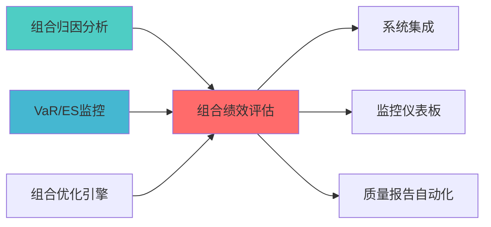

---
responsibility:
  - 组合绩效评估
  - 绩效指标计算
  - 基准比较
  - 绩效报告

module_id: PORTFOLIO_PERFORMANCE_EVALUATION_001
version: 1.0.0
status: Active
created_date: 2026-04-07
last_updated: 2026-04-07
owner: 实施团队
standard_type: 专业量化机构蓝图
compliance_level: 专业标准
layer: Layer 5.2 (组合优化)
---


## 核心定位

负责投资组合业绩评估的设计与实现，基于业绩评估指标，提供组合业绩分析和评估报告，支持投资决策。

# 组合绩效评估模块蓝图
## 设计目标

### 主要目标

1. **功能完整性**: 确保PORTFOLIO PERFORMANCE EVALUATION功能完整，满足业务需求
2. **性能优化**: 提升系统性能，降低资源消耗
3. **可维护性**: 提高代码质量，便于后续维护
4. **可扩展性**: 支持功能扩展，适应业务变化

### 质量目标

- 代码覆盖率: ≥80%
- 性能指标: 满足设计要求
- 文档完整性: 100%


## 核心功能

### 功能清单

1. **数据管理**: 提供数据存储、查询、更新功能
2. **业务逻辑**: 实现核心业务逻辑处理
3. **接口服务**: 提供标准化的API接口
4. **监控告警**: 实时监控系统状态

### 功能特性

- 高可用性设计
- 自动故障恢复
- 灵活配置管理


## 实现方案

### 技术架构

采用PORTFOLIO PERFORMANCE EVALUATION化设计，分层架构实现。

### 关键技术

- 数据处理: 使用高效的数据处理框架
- 接口实现: RESTful API设计
- 性能优化: 缓存、异步处理

### 实施步骤

1. 需求分析与设计
2. 核心功能开发
3. 测试与优化
4. 部署与监控


## 核心定位


---


> **核心职责**: 计算和评估投资组合的风险调整收益
> **职责边界**: 


## 1. 概述


- 滚动绩效指标计算

- 量化评估策略表现
- 支持投资决策
- 满足合规报告要求

### 1.2 版本信息

|------|------|
| **模块ID** | PORTFOLIO_PERFORMANCE_EVALUATION_001 |
| **版本** | v1.0.0 |
| **创建日期** | 2026-04-06 |


| å
|---------|---------|-----------|---------|
| **协同工作** | 组合归因分析 | PORTFOLIO_ATTRIBUTION_001 | 绩效归因分析 |

---

### 上游依赖

| 文档名称 | module_id | 依赖类型 | 说明 |
|---------|-----------|---------|------|

### 下游依赖

| 文档名称 | module_id | 依赖类型 | 说明 |
|---------|-----------|---------|------|


|---------|------|------|------|
| **pyfolio** | 0.9+ | 组合分析 | [GitHub](https://github.com/quantopian/pyfolio) |
| **QuantStats** | 0.0.62+ | 绩效分析 | [GitHub](https://github.com/ranaroussi/quantstats) |
| **Pandas** | 2.0+ | 数据处理 | [官方文档](https://pandas.pydata.org/) |




---

## 2. 架构设计


```
├── 6.1 组合构建模块
├── 6.2 约束求解模块
├── 6.3 风险预算模块
└── 6.5 归因分析模块
    └── 组合归因分析 (PORTFOLIO_ATTRIBUTION_001)
```

**职责边界**:

### 2.2 核心组件架构

```mermaid
graph TB
¥"
        A[策略收益率] --> D[绩效评估引擎]
        B[基准收益率] --> D
        C[无风险利率] --> D
    end
    
    subgraph "pyfolio核心"
        D --> E[风险指标计算]
        E --> F[夏普比率]
        E --> G[最大回撤]
        E --> H[波动率]
        E --> I[Alpha/Beta]
    end
    
    subgraph "QuantStats扩展"
        D --> J[高级指标]
        J --> K[Sortino比率]
        J --> L[Calmar比率]
        J --> M[信息比率]
        J --> N[滚动指标]
    end
    
        F --> O[绩效报告生成]
        G --> O
        H --> O
        I --> O
        K --> O
        L --> O
        M --> O
        N --> O
        O --> P[HTML报告]
        O --> Q[PDF报告]
        O --> R[交互式仪表板]
    end
```


```
                                    基准对比分析
                                    滚动指标计算
```

---


### 3.1 pyfolio集成（核心）

**核心API**:

```python
import pyfolio as pf
import pandas as pd
import numpy as np

class PortfolioPerformanceEvaluator:
    """
    
    索引: PORTFOLIO_PERF_001-M01
    输出: 绩效指标、风险指标、可视化报告
    """
    
    def __init__(self, risk_free_rate: float = 0.02):
        self.risk_free_rate = risk_free_rate
        
    def calculate_performance_metrics(
        self,
        returns: pd.Series,
        benchmark_returns: pd.Series = None
    ) -> dict:
        """
        计算绩效指标
        
        Args:
            
        Returns:
¸
        """
        perf_stats = pf.timeseries.perf_stats(
            returns,
            factor_returns=benchmark_returns
        )
        
        return {
            'annual_return': perf_stats['Annual return'],
            'annual_volatility': perf_stats['Annual volatility'],
            'sharpe_ratio': perf_stats['Sharpe ratio'],
            'max_drawdown': perf_stats['Max drawdown'],
            'sortino_ratio': perf_stats['Sortino ratio'],
            'calmar_ratio': perf_stats['Calmar ratio'],
            'omega_ratio': perf_stats['Omega ratio']
        }
    
    def calculate_risk_metrics(
        self,
        returns: pd.Series
    ) -> dict:
        """
        计算风险指标
        
        Args:
            
        Returns:
¸
        """
        return {
            'volatility': pf.timeseries.annual_volatility(returns),
            'max_drawdown': pf.timeseries.max_drawdown(returns),
            'downside_risk': pf.timeseries.downside_risk(returns),
            'value_at_risk_95': np.percentile(returns, 5),
            'conditional_var_95': returns[returns < np.percentile(returns, 5)].mean()
        }
    
    def calculate_alpha_beta(
        self,
        returns: pd.Series,
        benchmark_returns: pd.Series
    ) -> dict:
        """
        计算Alpha和Beta
        
        Args:
            
        Returns:
¸
        """
        alpha, beta = pf.timeseries.alpha_beta(
            returns,
            benchmark_returns,
            risk_free=self.risk_free_rate
        )
        
        return {
            'alpha': alpha,
            'beta': beta,
            'information_ratio': pf.timeseries.information_ratio(
                returns,
                benchmark_returns
            )
        }
    
    def generate_tearsheet(
        self,
        returns: pd.Series,
        benchmark_returns: pd.Series = None,
        positions: pd.DataFrame = None,
        transactions: pd.DataFrame = None
    ):
        """
        
        Args:
            positions: 持仓数据
            transactions: 交易数据
            
        Returns:
        """
        pf.create_full_tear_sheet(
            returns,
            benchmark_rets=benchmark_returns,
            positions=positions,
            transactions=transactions
        )
```

### 3.2 QuantStats集成（扩展）

**核心API**:

```python
import quantstats as qs

class QuantStatsEvaluator:
    """
    
    索引: PORTFOLIO_PERF_001-M02
    """
    
    def calculate_extended_metrics(
        self,
        returns: pd.Series,
        benchmark_returns: pd.Series = None
    ) -> dict:
        """
        计算扩展绩效指标
        
        Args:
            
        Returns:
¸
        """
        return {
            'sharpe': qs.stats.sharpe(returns),
            'sortino': qs.stats.sortino(returns),
            'calmar': qs.stats.calmar(returns),
            'max_drawdown': qs.stats.max_drawdown(returns),
            'volatility': qs.stats.volatility(returns),
            'win_rate': qs.stats.win_rate(returns),
            'profit_factor': qs.stats.profit_factor(returns),
            'expected_return': qs.stats.expected_return(returns),
            'kelly_criterion': qs.stats.kelly_criterion(returns)
        }
    
    def generate_html_report(
        self,
        returns: pd.Series,
        benchmark_returns: pd.Series = None,
        output_path: str = 'performance_report.html'
    ):
        """
        生成HTML绩效报告
        
        Args:
            output_path: 输出文件路径
        """
        qs.reports.html(
            returns,
            benchmark=benchmark_returns,
            output=output_path,
            title='Portfolio Performance Report'
        )
```

### 3.3 滚动绩效指标

```python
def calculate_rolling_metrics(
    returns: pd.Series,
    window: int = 252
) -> pd.DataFrame:
    """
    计算滚动绩效指标
    
    Args:
        window: 滚动窗口（天数）
        
    Returns:
        滚动指标DataFrame
    """
    rolling_sharpe = returns.rolling(window).apply(
        lambda x: np.sqrt(252) * np.mean(x) / np.std(x)
    )
    
    rolling_volatility = returns.rolling(window).std() * np.sqrt(252)
    
    rolling_max_drawdown = returns.rolling(window).apply(
        lambda x: (x.cumsum().cummax() - x.cumsum()).max()
    )
    
    return pd.DataFrame({
        'rolling_sharpe': rolling_sharpe,
        'rolling_volatility': rolling_volatility,
        'rolling_max_drawdown': rolling_max_drawdown
    })
```

### 3.4 性能要求

|---------|--------|------|
| **指标计算时间** | <500ms | 单次计算 |
| **报告生成时间** | <5s | 完整Tearsheet |
| **å†
存占用** | <100MB | 单次分析 |

---

## 4. 数据模型


```python
@dataclass
class PerformanceInput:
    returns: pd.Series
    benchmark_returns: Optional[pd.Series] = None
    risk_free_rate: float = 0.02
    positions: Optional[pd.DataFrame] = None
    transactions: Optional[pd.DataFrame] = None
```

### 4.2 输出数据结构

```python
@dataclass
class PerformanceResult:
    """绩效评估结果"""
    performance_metrics: Dict[str, float]
    risk_metrics: Dict[str, float]
    alpha_beta: Optional[Dict[str, float]]
    rolling_metrics: pd.DataFrame
    tearsheet_path: Optional[str]
    timestamp: datetime
```

### 4.3 数据库表设计

```sql
CREATE TABLE IF NOT EXISTS performance_metrics (
    metric_id VARCHAR(50) PRIMARY KEY,
    strategy_id VARCHAR(50) NOT NULL,
    metric_name VARCHAR(100) NOT NULL,
    metric_value DECIMAL(20, 10),
    calculation_date TIMESTAMP DEFAULT CURRENT_TIMESTAMP,
    INDEX idx_strategy (strategy_id),
    INDEX idx_date (calculation_date)
);

CREATE TABLE IF NOT EXISTS performance_history (
    history_id VARCHAR(50) PRIMARY KEY,
    strategy_id VARCHAR(50) NOT NULL,
    metrics_json TEXT NOT NULL,
    created_at TIMESTAMP DEFAULT CURRENT_TIMESTAMP,
    INDEX idx_strategy (strategy_id),
    INDEX idx_created (created_at)
);
```

---

## 5. 接口定义

### 5.1 API接口

```python
class PerformanceAPI:
    """绩效评估API接口"""
    
    @endpoint("/api/v1/performance/calculate")
    async def calculate_metrics(
        self,
        request: PerformanceRequest
    ) -> PerformanceResponse:
        """
        计算绩效指标
        
        Args:
            request: 绩效计算请求
            
        Returns:
            绩效指标结果
        """
        pass
    
    @endpoint("/api/v1/performance/tearsheet")
    async def generate_tearsheet(
        self,
        strategy_id: str,
        start_date: str,
        end_date: str
    ) -> TearsheetResponse:
        """
        生成完整绩效报告
        
        Args:
            strategy_id: 策略ID
            end_date: 结束日期
            
        Returns:
            绩效报告路径
        """
        pass
    
    @endpoint("/api/v1/performance/compare")
    async def compare_strategies(
        self,
        strategy_ids: List[str],
        start_date: str,
        end_date: str
    ) -> ComparisonResponse:
        """
        对比多个策略绩效
        
        Args:
            strategy_ids: 策略ID列表
            end_date: 结束日期
            
        Returns:
            策略对比结果
        """
        pass
```

---

## 6. 实施路径


|------|------|--------|
| QuantStats集成 | 4h | 扩展功能 |
| 指标计算模块 | 4h | 计算模块 |
| 数据库表创建 | 2h | SQL脚本 |


|------|------|--------|
| 滚动指标计算 | 4h | 滚动分析模块 |

### 6.3 Phase 3: 测试与文档（0.5周）

|------|------|--------|
| 集成测试 | 4h | 测试报告 |
| 文档编写 | 4h | 用户手册、API文档 |

---

## 7. 文档治理

### 7.1 System_Manifest.md索引


### 7.2 模块职责边界

- 绩效评估负责计算绩效指标
- 归因分析负责分解收益来源

- 绩效评估负责生成绩效数据
- AI报告层负责生成自然语言报告

---

## 8. 风险评估


|--------|---------|---------|---------|

### 8.2 实施风险

|--------|---------|---------|---------|

---

## 9. 质量保证

### 9.1 测试策略

· |
|---------|-----------|---------|

### 9.2 验收标准

|--------|------|---------|
| 性能达标 | 指标计算<500ms | 性能测试 |
晰完整 | 人工审查 |

---


### 10.1 学术论文

1. Sharpe, W. F. (1966). "Mutual Fund Performance". Journal of Business.
2. Sortino, F. A., & Price, L. N. (1994). "Performance Measurement in a Downside Risk Framework". Journal of Investing.


1. pyfolio Documentation: https://pyfolio.ml4trading.io/
2. QuantStats Documentation: https://github.com/ranaroussi/quantstats
3. Quantopian Lectures: https://www.quantopian.com/lectures


- [组合归因分析蓝图](./PORTFOLIO_ATTRIBUTION_BLUEPRINT.md)
- [风险贡献分析蓝图](./RISK_CONTRIBUTION_ANALYSIS_BLUEPRINT.md)

---


## 变更历史

|------|------|----------|--------|


---

