---
responsibility:
  - 组合再平è¡?
  - 权重调整
  - 成本优化
  - 再平衡触å?

module_id: PORTFOLIO_REBALANCING_001
version: 1.0.0
status: Active
created_date: 2026-04-07
last_updated: 2026-04-07
owner: 实施团队
standard_type: 专业量化机构蓝图
applicable_scope: Layer 6 组合优化å±?
compliance_level: 专业标准
layer: "Layer 6 (组合优化å±?"
---

# 组合再平衡蓝å›?

## 核心定位

负责投资组合再平衡，基于信号触发和风控约束，执行组合权重调整，确保组合符合投资策略要求。


> **核心职责**: 智能再平衡决策，平衡跟踪误差与交易成æœ?
> **职责边界**: 
> - âœ?本文档负责：再平衡触发、权重调整、成本优åŒ?
> - â?本文档不负责：RL增强调仓（由RL_REBALANCING_SYSTEM负责ï¼?


## 1. 概述

### 1.1 设计背景与业务目?
**业务需?*?- 当前系统缺乏系统性的再平衡策略框?- 无法智能决策何时执行再平?- 无法平衡跟踪误差与交易成?- 缺乏多种再平衡触发机?
**技术痛?*?- 无再平衡触发机制
- 无交易成本优?- 无再平衡效果评估
- 无再平衡历史记录

**预期?*?- 再平衡策略完整性：提升40%
- 交易成本优化：降?5-20%
- 跟踪误差控制：提?0%
- 系统化再平衡决策：新增能?
### 1.2 技术定位与架构层归å±?

**Layer定位**: Layer 6 - 组合优化层（执行层）

**模块类别**: 支持模块（P2级）

**与TRANSACTION_COST_AWARE_REBALANCING的关ç³?*:
- 本文档是**基础再平衡框æž?*，提供触发机制和决策引擎
- [TRANSACTION_COST_AWARE_REBALANCING_BLUEPRINT.md](./TRANSACTION_COST_AWARE_REBALANCING_BLUEPRINT.md)æ˜?*高级成本感知再平衡模å?*，在再平衡决策中显式考虑交易成本
- **职责边界**: 本文档负责基础再平衡决策，TRANSACTION_COST_AWARE负责成本优化决策
- **依赖关系**: TRANSACTION_COST_AWARE_REBALANCING依赖本文档的触发机制和决策框æž?
- **推荐实施路径**: 先实现本文档ï¼?0h），再实施成本感知增强（5-7天）

**架构角色**: 
- 作为组合优化的执行层，负责再平衡决策
- 作为交易成本优化的执行者，平衡成本与跟踪误?- 作为风险控制的执行者，维持组合风险目标

### 1.3 核心功能清单

1. **再平衡触发机?*: 定期触发、阈值触发、风险触?2. **再平衡决?*: 是否执行再平衡的智能决策
3. **交易成本优化**: 最优交易执?4. **再平衡效果评?*: 评估再平衡效?5. **再平衡历史记?*: 记录再平衡历?
---

## 2. 架构设计

### 2.1 系统架构?
```
┌─────────────────────────────────────────────────────────────────??                   组合再平衡策略系统架?                       ?├─────────────────────────────────────────────────────────────────??                                                                ?? ┌──────────────────────────────────────────────────────────? ?? ?             触发机制?                                   ? ?? ? ┌──────────? ┌──────────? ┌──────────?              ? ?? ? ?定期触发 ? ?阈值触?? ?风险触发 ?              ? ?? ? ?         ? ?         ? ?         ?              ? ?? ? └──────────? └──────────? └──────────?              ? ?? └──────────────────────────────────────────────────────────? ??                         ?                                     ?? ┌──────────────────────────────────────────────────────────? ?? ?             决策?                                       ? ?? ? ┌────────────────────────────────────────────────────? ? ?? ? ? Rebalancing Decision Engine                       ? ? ?? ? ? - 成本收益分析                                     ? ? ?? ? ? - 跟踪误差评估                                     ? ? ?? ? ? - 再平衡决?                                      ? ? ?? ? └────────────────────────────────────────────────────? ? ?? └──────────────────────────────────────────────────────────? ??                         ?                                     ?? ┌──────────────────────────────────────────────────────────? ?? ?             执行?                                       ? ?? ? ┌──────────? ┌──────────? ┌──────────?              ? ?? ? ?交易成本 ? ?最优执?? ?订单生成 ?              ? ?? ? ?优化     ? ?算法     ? ?         ?              ? ?? ? └──────────? └──────────? └──────────?              ? ?? └──────────────────────────────────────────────────────────? ??                         ?                                     ?? ┌──────────────────────────────────────────────────────────? ?? ?             评估?                                       ? ?? ? ┌──────────? ┌──────────? ┌──────────?              ? ?? ? ?效果评估 ? ?历史记录 ? ?报告生成 ?              ? ?? ? ?         ? ?         ? ?         ?              ? ?? ? └──────────? └──────────? └──────────?              ? ?? └──────────────────────────────────────────────────────────? ?└─────────────────────────────────────────────────────────────────?```

### 2.2 核心数据?
```
组合状态监?    ?触发机制检测（定期/?风险?    ?再平衡决策（成本收益分析?    ?交易成本优化（最优执行）
    ?输出：再平衡订单、效果评估、历史记?```

---

## 3. 核心模块设计

### 3.1 再平衡策略核心类（RebalancingStrategy?
```python
class RebalancingStrategy:
    """
    再平衡策略核心类
    
    索引: REBALANCING_001-M01
    职责: 智能再平衡决策与执行
    输入: 组合状态、目标权?    输出: 再平衡订单、执行报?    """
    
    def __init__(self, config: RebalancingConfig):
        self.config = config
        self.trigger_detector = RebalancingTriggerDetector(config.trigger_config)
        self.decision_engine = RebalancingDecisionEngine(config.decision_config)
        self.cost_optimizer = TradingCostOptimizer(config.cost_config)
        self.evaluator = RebalancingEvaluator(config.eval_config)
        
    def check_rebalance(self,
                       current_weights: pd.Series,
                       target_weights: pd.Series,
                       portfolio_value: float) -> RebalancingSignal:
        """
        检查是否需要再平衡
        
        Args:
            current_weights: 当前权重
            target_weights: 目标权重
            portfolio_value: 组合?            
        Returns:
            RebalancingSignal: 再平衡信?        """
        # 1. 检测触发条?        trigger_result = self.trigger_detector.detect(
            current_weights, target_weights, portfolio_value
        )
        
        # 2. 如果触发，进行决策分?        if trigger_result.triggered:
            decision = self.decision_engine.decide(
                current_weights, target_weights, portfolio_value, trigger_result
            )
            
            return RebalancingSignal(
                should_rebalance=decision.should_rebalance,
                trigger_type=trigger_result.trigger_type,
                trigger_reason=trigger_result.reason,
                expected_cost=decision.expected_cost,
                expected_benefit=decision.expected_benefit,
                net_benefit=decision.net_benefit,
                timestamp=datetime.now()
            )
        
        return RebalancingSignal(
            should_rebalance=False,
            trigger_type='none',
            timestamp=datetime.now()
        )
    
    def execute_rebalance(self,
                         current_weights: pd.Series,
                         target_weights: pd.Series,
                         portfolio_value: float) -> RebalancingResult:
        """
        执行再平?        
        Args:
            current_weights: 当前权重
            target_weights: 目标权重
            portfolio_value: 组合?            
        Returns:
            RebalancingResult: 再平衡结?        """
        # 1. 交易成本优化
        optimal_trades = self.cost_optimizer.optimize(
            current_weights, target_weights, portfolio_value
        )
        
        # 2. 生成订单
        orders = self._generate_orders(optimal_trades, portfolio_value)
        
        # 3. 执行订单（模拟）
        execution_result = self._execute_orders(orders)
        
        # 4. 评估效果
        evaluation = self.evaluator.evaluate(
            current_weights, target_weights, execution_result
        )
        
        return RebalancingResult(
            orders=orders,
            execution_result=execution_result,
            evaluation=evaluation,
            timestamp=datetime.now()
        )
    
    def _generate_orders(self,
                        optimal_trades: pd.Series,
                        portfolio_value: float) -> List[Order]:
        """生成交易订单"""
        orders = []
        
        for asset, weight_change in optimal_trades.items():
            if abs(weight_change) > self.config.min_trade_size:
                order = Order(
                    asset=asset,
                    direction='buy' if weight_change > 0 else 'sell',
                    quantity=abs(weight_change * portfolio_value),
                    order_type='market',
                    timestamp=datetime.now()
                )
                orders.append(order)
        
        return orders
    
    def _execute_orders(self, orders: List[Order]) -> ExecutionResult:
        """执行订单（模拟）"""
        executed_orders = []
        total_cost = 0.0
        
        for order in orders:
            # 模拟执行
            executed_order = ExecutedOrder(
                order=order,
                executed_price=100.0,  # 模拟价格
                executed_quantity=order.quantity,
                execution_cost=order.quantity * 0.001,  # 0.1%交易成本
                timestamp=datetime.now()
            )
            executed_orders.append(executed_order)
            total_cost += executed_order.execution_cost
        
        return ExecutionResult(
            executed_orders=executed_orders,
            total_cost=total_cost,
            timestamp=datetime.now()
        )
```

### 3.2 再平衡触发检测器（RebalancingTriggerDetector?
```python
class RebalancingTriggerDetector:
    """
    再平衡触发检测器
    
    索引: REBALANCING_001-M02
    职责: 检测再平衡触发条件
    """
    
    def __init__(self, config: TriggerConfig):
        self.config = config
        
    def detect(self,
              current_weights: pd.Series,
              target_weights: pd.Series,
              portfolio_value: float) -> TriggerResult:
        """
        检测触发条?        
        Args:
            current_weights: 当前权重
            target_weights: 目标权重
            portfolio_value: 组合?            
        Returns:
            TriggerResult: 触发结果
        """
        triggers = []
        
        # 1. 定期触发
        if self._check_periodic_trigger():
            triggers.append(('periodic', '达到再平衡周?))
        
        # 2. 阈值触?        threshold_violations = self._check_threshold_trigger(
            current_weights, target_weights
        )
        if threshold_violations:
            triggers.append(('threshold', f'权重偏离超阈? {threshold_violations}'))
        
        # 3. 风险触发
        risk_violations = self._check_risk_trigger(current_weights, target_weights)
        if risk_violations:
            triggers.append(('risk', f'风险指标超限: {risk_violations}'))
        
        # 返回最高优先级触发
        if triggers:
            trigger_type, reason = triggers[0]
            return TriggerResult(
                triggered=True,
                trigger_type=trigger_type,
                reason=reason,
                all_triggers=triggers
            )
        
        return TriggerResult(triggered=False, trigger_type='none')
    
    def _check_periodic_trigger(self) -> bool:
        """检查定期触?""
        # 简化实现：检查是否到达再平衡日期
        # 实际应从配置中获取再平衡周期
        last_rebalance_date = self.config.last_rebalance_date
        rebalance_frequency = self.config.rebalance_frequency  # days
        
        days_since_last = (datetime.now() - last_rebalance_date).days
        
        return days_since_last >= rebalance_frequency
    
    def _check_threshold_trigger(self,
                                 current_weights: pd.Series,
                                 target_weights: pd.Series) -> List[str]:
        """检查阈值触?""
        violations = []
        weight_deviation = (current_weights - target_weights).abs()
        
        for asset, deviation in weight_deviation.items():
            if deviation > self.config.weight_threshold:
                violations.append(f'{asset}: {deviation:.2%}')
        
        return violations
    
    def _check_risk_trigger(self,
                           current_weights: pd.Series,
                           target_weights: pd.Series) -> List[str]:
        """检查风险触?""
        violations = []
        
        # 简化实现：检查风险指?        # 实际应计算风险指标并与阈值比?        # 例如：组合波动率、VaR、跟踪误差等
        
        return violations
```

### 3.3 再平衡决策引擎（RebalancingDecisionEngine?
```python
class RebalancingDecisionEngine:
    """
    再平衡决策引?    
    索引: REBALANCING_001-M03
    职责: 分析再平衡成本收益，做出决策
    """
    
    def __init__(self, config: DecisionConfig):
        self.config = config
        
    def decide(self,
              current_weights: pd.Series,
              target_weights: pd.Series,
              portfolio_value: float,
              trigger_result: TriggerResult) -> Decision:
        """
        再平衡决?        
        Args:
            current_weights: 当前权重
            target_weights: 目标权重
            portfolio_value: 组合?            trigger_result: 触发结果
            
        Returns:
            Decision: 决策结果
        """
        # 1. 估计交易成本
        expected_cost = self._estimate_transaction_cost(
            current_weights, target_weights, portfolio_value
        )
        
        # 2. 估计收益
        expected_benefit = self._estimate_rebalancing_benefit(
            current_weights, target_weights
        )
        
        # 3. 计算净收益
        net_benefit = expected_benefit - expected_cost
        
        # 4. 决策
        should_rebalance = net_benefit > self.config.min_net_benefit
        
        return Decision(
            should_rebalance=should_rebalance,
            expected_cost=expected_cost,
            expected_benefit=expected_benefit,
            net_benefit=net_benefit,
            reason=f'净收益={net_benefit:.4f}, ?{self.config.min_net_benefit}'
        )
    
    def _estimate_transaction_cost(self,
                                   current_weights: pd.Series,
                                   target_weights: pd.Series,
                                   portfolio_value: float) -> float:
        """估计交易成本"""
        # 交易成本 = 交易?* 交易成本?        weight_changes = (target_weights - current_weights).abs()
        total_trade_value = (weight_changes * portfolio_value).sum()
        
        # 交易成本率（包括佣金、冲击成本等?        cost_rate = self.config.transaction_cost_rate
        
        return total_trade_value * cost_rate
    
    def _estimate_rebalancing_benefit(self,
                                      current_weights: pd.Series,
                                      target_weights: pd.Series) -> float:
        """估计再平衡收?""
        # 简化实现：估计跟踪误差降低带来的收?        # 实际应使用更复杂的模?        
        # 跟踪误差 = 权重偏离 * 预期收益
        weight_deviation = (target_weights - current_weights).abs()
        
        # 假设预期收益（实际应从模型获取）
        expected_returns = pd.Series(0.1, index=current_weights.index)
        
        # 跟踪误差降低带来的收?        benefit = (weight_deviation * expected_returns).sum()
        
        return benefit
```

### 3.4 交易成本优化器（TradingCostOptimizer?
```python
class TradingCostOptimizer:
    """
    交易成本优化?    
    索引: REBALANCING_001-M04
    职责: 优化交易执行以最小化成本
    """
    
    def __init__(self, config: CostOptimizationConfig):
        self.config = config
        
    def optimize(self,
                current_weights: pd.Series,
                target_weights: pd.Series,
                portfolio_value: float) -> pd.Series:
        """
        优化交易执行
        
        Args:
            current_weights: 当前权重
            target_weights: 目标权重
            portfolio_value: 组合?            
        Returns:
            pd.Series: 最优交易量
        """
        # 1. 计算理想交易?        ideal_trades = target_weights - current_weights
        
        # 2. 考虑交易成本优化
        # 简化实现：使用阈值过滤小交易
        optimal_trades = ideal_trades.copy()
        optimal_trades[ideal_trades.abs() < self.config.min_trade_threshold] = 0
        
        # 3. 考虑市场冲击
        # 简化实现：大交易分批执?        if self.config.enable_batch_trading:
            optimal_trades = self._apply_batch_trading(optimal_trades, portfolio_value)
        
        return optimal_trades
    
    def _apply_batch_trading(self,
                            trades: pd.Series,
                            portfolio_value: float) -> pd.Series:
        """应用分批交易"""
        # 简化实现：大交易分?        batch_trades = trades.copy()
        
        for asset, trade in trades.items():
            trade_value = abs(trade * portfolio_value)
            if trade_value > self.config.large_trade_threshold:
                # 分批执行
                batch_trades[asset] = trade * self.config.batch_ratio
        
        return batch_trades
```

### 3.5 再平衡效果评估器（RebalancingEvaluator?
```python
class RebalancingEvaluator:
    """
    再平衡效果评估器
    
    索引: REBALANCING_001-M05
    职责: 评估再平衡效?    """
    
    def __init__(self, config: EvaluationConfig):
        self.config = config
        
    def evaluate(self,
                current_weights: pd.Series,
                target_weights: pd.Series,
                execution_result: ExecutionResult) -> Evaluation:
        """
        评估再平衡效?        
        Args:
            current_weights: 当前权重
            target_weights: 目标权重
            execution_result: 执行结果
            
        Returns:
            Evaluation: 评估结果
        """
        # 1. 计算跟踪误差改善
        tracking_error_improvement = self._calculate_tracking_error_improvement(
            current_weights, target_weights
        )
        
        # 2. 计算风险改善
        risk_improvement = self._calculate_risk_improvement(
            current_weights, target_weights
        )
        
        # 3. 计算成本效率
        cost_efficiency = self._calculate_cost_efficiency(
            tracking_error_improvement, execution_result.total_cost
        )
        
        return Evaluation(
            tracking_error_improvement=tracking_error_improvement,
            risk_improvement=risk_improvement,
            cost_efficiency=cost_efficiency,
            total_cost=execution_result.total_cost,
            timestamp=datetime.now()
        )
    
    def _calculate_tracking_error_improvement(self,
                                             current_weights: pd.Series,
                                             target_weights: pd.Series) -> float:
        """计算跟踪误差改善"""
        # 简化实现：权重偏离降低
        before_deviation = (current_weights - target_weights).abs().sum()
        after_deviation = 0.0  # 再平衡后偏离?
        
        return before_deviation - after_deviation
    
    def _calculate_risk_improvement(self,
                                   current_weights: pd.Series,
                                   target_weights: pd.Series) -> float:
        """计算风险改善"""
        # 简化实现：风险指标改善
        # 实际应计算具体风险指?        return 0.0
    
    def _calculate_cost_efficiency(self,
                                  improvement: float,
                                  cost: float) -> float:
        """计算成本效率"""
        if cost == 0:
            return float('inf')
        
        return improvement / cost
```

### 3.6 配置类定?
```python
@dataclass
class RebalancingConfig:
    """再平衡配?""
    trigger_config: TriggerConfig
    decision_config: DecisionConfig
    cost_config: CostOptimizationConfig
    eval_config: EvaluationConfig
    min_trade_size: float = 0.001  # 最小交易规?    
@dataclass
class TriggerConfig:
    """触发配置"""
    rebalance_frequency: int = 30  # 再平衡周期（天）
    weight_threshold: float = 0.05  # 权重偏离?    last_rebalance_date: datetime = None
    
@dataclass
class DecisionConfig:
    """决策配置"""
    min_net_benefit: float = 0.001  # 最小净收益?    transaction_cost_rate: float = 0.001  # 交易成本?    
@dataclass
class CostOptimizationConfig:
    """成本优化配置"""
    min_trade_threshold: float = 0.01  # 最小交易阈?    enable_batch_trading: bool = True  # 启用分批交易
    large_trade_threshold: float = 1000000  # 大交易阈?    batch_ratio: float = 0.5  # 分批比例
```

---

## 4. 数据模型定义

### 4.1 输入数据模型

```python
@dataclass
class PortfolioState:
    """组合?""
    weights: pd.Series  # 当前权重
    value: float  # 组合?    timestamp: datetime
```

### 4.2 输出数据模型

```python
@dataclass
class RebalancingSignal:
    """再平衡信?""
    should_rebalance: bool  # 是否需要再平衡
    trigger_type: str  # 触发类型
    trigger_reason: str  # 触发原因
    expected_cost: float = 0.0  # 预期成本
    expected_benefit: float = 0.0  # 预期收益
    net_benefit: float = 0.0  # 净收益
    timestamp: datetime = None
    
@dataclass
class RebalancingResult:
    """再平衡结?""
    orders: List[Order]  # 交易订单
    execution_result: ExecutionResult  # 执行结果
    evaluation: Evaluation  # 评估结果
    timestamp: datetime
    
@dataclass
class Order:
    """交易订单"""
    asset: str  # 资产
    direction: str  # 方向?buy', 'sell'?    quantity: float  # 数量
    order_type: str  # 订单类型
    timestamp: datetime
    
@dataclass
class ExecutionResult:
    """执行结果"""
    executed_orders: List[ExecutedOrder]  # 已执行订?    total_cost: float  # 总成?    timestamp: datetime
    
@dataclass
class Evaluation:
    """评估结果"""
    tracking_error_improvement: float  # 跟踪误差改善
    risk_improvement: float  # 风险改善
    cost_efficiency: float  # 成本效率
    total_cost: float  # 总成?    timestamp: datetime
```

---

## 5. 集成方案

### 5.1 与组合优化器集成

```python
class PortfolioOptimizer:
    """组合优化器（集成再平衡策略）"""
    
    def __init__(self, rebalancing_strategy: RebalancingStrategy):
        self.rebalancing_strategy = rebalancing_strategy
        
    def optimize_and_rebalance(self,
                              current_weights: pd.Series,
                              expected_returns: pd.Series,
                              covariance_matrix: pd.DataFrame) -> RebalancingResult:
        """优化并再平衡"""
        # 1. 优化目标权重
        target_weights = self.optimize(expected_returns, covariance_matrix)
        
        # 2. 检查是否需要再平衡
        signal = self.rebalancing_strategy.check_rebalance(
            current_weights, target_weights, 1000000
        )
        
        # 3. 如果需要，执行再平?        if signal.should_rebalance:
            return self.rebalancing_strategy.execute_rebalance(
                current_weights, target_weights, 1000000
            )
        
        return None
```

### 5.2 与交易成本优化模块集?
```python
class TradingCostOptimizationModule:
    """交易成本优化模块（集成再平衡策略?""
    
    def __init__(self, rebalancing_strategy: RebalancingStrategy):
        self.rebalancing_strategy = rebalancing_strategy
        
    def optimize_execution(self,
                          current_weights: pd.Series,
                          target_weights: pd.Series) -> pd.Series:
        """优化执行"""
        return self.rebalancing_strategy.cost_optimizer.optimize(
            current_weights, target_weights, 1000000
        )
```

---

## 6. 实施路线?
### 6.1 开发阶段（1周）

**Day 1-2: 核心模块开?*
- 再平衡触发检测器
- 再平衡决策引?
**Day 3-4: 执行与评?*
- 交易成本优化?- 再平衡效果评估器

**Day 5: 集成与测?*
- 系统集成
- 测试与文?
### 6.2 里程?
| 里程?| 时间 | 交付?| 验收标准 |
|--------|------|--------|----------|
| **M1: 触发器完?* | Day 1 | 再平衡触发检测器 | 触发检测正?|
| **M2: 决策引擎完成** | Day 2 | 再平衡决策引?| 决策合理 |
| **M3: 优化器完?* | Day 3 | 交易成本优化?| 优化有效 |
| **M4: 评估器完?* | Day 4 | 再平衡效果评估器 | 评估准确 |
| **M5: 测试通过** | Day 5 | 测试报告 | 所有测试通过 |

---

## 7. 预期收益评估

### 7.1 定量收益

| 指标 | 当前水平 | 目标水平 | 提升幅度 |
|------|---------|---------|---------|
| **再平衡策略完?* | 60% | 100% | +40% |
| **交易成本优化** | 基准 | -15% | 降低15% |
| **跟踪误差控制** | 基准 | +30% | 提升30% |
| **系统化决?* | ?| ?| 新增能力 |

### 7.2 定性收?
- ?系统化再平衡决策框架
- ?多种触发机制（定??风险?- ?交易成本优化
- ?再平衡效果评?- ?历史记录与回?
---

## 8. 技术栈选择

### 8.1 核心依赖?
| 库名 | 版本 | ?| 必要?|
|------|------|------|--------|
| **pandas** | ?.5 | 数据处理 | 必需 |
| **numpy** | ?.21 | 数值计?| 必需 |
| **datetime** | - | 时间处理 | 必需 |

### 8.2 安装命令

```bash
pip install pandas>=1.5
pip install numpy>=1.21
```

---

## 9. 风险评估

### 9.1 技术风?
| 风险?| 风险等级 | 缓解措施 |
|--------|---------|---------|
| **触发机制误判** | ?| 多重触发条件验证 |
| **成本估计偏差** | ?| 使用历史数据校准 |
| **执行延迟** | ?| 实时监控 |

### 9.2 实施风险

| 风险?| 风险等级 | 缓解措施 |
|--------|---------|---------|
| **开发时间超?* | ?| 分阶段实?|
| **集成困难** | ?| 充分测试 |
| **性能不达?* | ?| 性能优化 |

---

## 📚 相关文档

### 上游依赖

| 文档名称 | module_id | 依赖类型 | 说明 |
|---------|-----------|---------|------|
| [季度调仓蓝图](./QUARTERLY_REBALANCE_BLUEPRINT.md) | QUARTERLY_REBALANCE_001 | 强依èµ?| 提供调仓决策 |
| [数据质量监控蓝图](./DATA_QUALITY_MONITORING_BLUEPRINT.md) | DATA_QUALITY_MONITORING_001 | 强依èµ?| 提供数据质量指标 |
| [交易成本分析引擎蓝图](./TRANSACTION_COST_ANALYSIS_ENGINE_BLUEPRINT.md) | TRANSACTION_COST_ANALYSIS_ENGINE_001 | 中依èµ?| 提供成本分析 |

### 下游依赖

| 文档名称 | module_id | 依赖类型 | 说明 |
|---------|-----------|---------|------|
| [强化学习调仓系统蓝图](RL_REBALANCING_SYSTEM_BLUEPRINT.md) | RL_REBALANCING_SYSTEM_001 | 强依èµ?| AI增强调仓 |
| [交易成本感知再平衡蓝图](./TRANSACTION_COST_AWARE_REBALANCING_BLUEPRINT.md) | TRANSACTION_COST_AWARE_REBALANCING_001 | 强依èµ?| 成本感知再平è¡?|
| [算法交易优化器蓝图](./ALGORITHMIC_TRADING_OPTIMIZER_BLUEPRINT.md) | ALGORITHMIC_TRADING_OPTIMIZER_001 | 中依èµ?| 算法交易执行 |

### 技术依èµ?

| 技术组ä»?| 版本 | 用é€?| 文档 |
|---------|------|------|------|
| **NumPy** | 1.24+ | 数值计ç®?| [官方文档](https://numpy.org/) |
| **Pandas** | 2.0+ | 数据处理 | [官方文档](https://pandas.pydata.org/) |
| **SciPy** | 1.10+ | 科学计算 | [官方文档](https://scipy.org/) |

### 引用关系å›?

```mermaid
graph LR
    A[季度调仓] --> B[组合再平衡]
    C[数据质量监控] --> B
    D[交易成本分析引擎] --> B
    
    B --> E[强化学习调仓系统]
    B --> F[交易成本感知再平衡]
    B --> G[算法交易优化器]
    
    style B fill:#ff6b6b
    style A fill:#4ecdc4
    style C fill:#45b7d1
```



---

## 10. 文档治理

### 10.1 System_Manifest.md索引

```markdown
#### Layer 6: 组合优化å±?
##### 6.8 组合再平衡策ç•?
- **模块ID**: REBALANCING_001
- **蓝图文档**: PORTFOLIO_REBALANCING_BLUEPRINT.md
- **技术规格书**: 待创å»?
- **职责**: 再平衡决策、交易成本优化、效果评ä¼?
- **状æ€?*: 设计阶段
```

### 10.2 模块职责边界

| 模块 | 职责 | 边界 |
|------|------|------|
| **再平衡策?* | 再平衡决策与执行 | **执行层面** |
| **组合优化?* | 组合权重优化 | 提供目标权重 |
| **交易成本优化** | 交易成本建模 | 提供成本模型 |

---

## 附录

### A. 参考文?
1. **再平衡理?*:
   - Perold, A.F. and Sharpe, W.F. (1988). "Dynamic Strategies for Asset Allocation"
   - Tsatsaronis, K. (2000). "The Cost of Rebalancing"

2. **交易成本优化**:
   - Almgren, R. and Chriss, N. (2001). "Optimal Execution of Portfolio Transactions"

### B. 术语?
| 术语 | 定义 | 上下?|
|------|------|--------|
| **再平?* | 调整组合权重以维持目标配?| 组合管理 |
| **跟踪误差** | 组合与基准的偏离程度 | 风险度量 |
| **交易成本** | 买卖资产产生的成?| 成本分析 |
| **触发机制** | 启动再平衡的条件 | 决策逻辑 |

---

**蓝图版本**: v1.0 | **创建日期**: 2026-04-03 | **?*: Final | **下一?*: 技术规格书编写

## 变更历史

| 版本 | 日期 | 变更内容 | 变更äº?|
|------|------|----------|--------|
| v1.0.0 | 2026-04-03 | 初始版本创建 | 组合优化层负责人 |
| v1.0.1 | 2026-04-06 | 补充YAML头部字段和变更历å?| 审计系统 |

---

**蓝图版本**: v1.0.1 | **创建日期**: 2026-04-03 | **状æ€?*: Active
