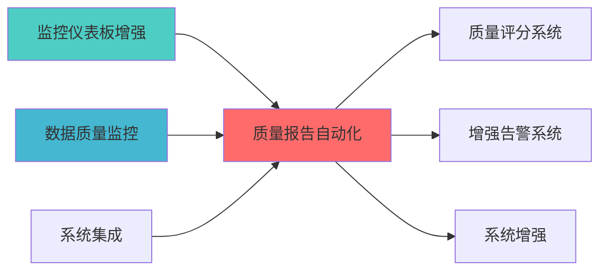

---
module_id: QUALITY_REPORT_AUTOMATION_BLUEPRINT_001
version: 1.0.0
status: Active
created_date: 2026-04-07
last_updated: 2026-04-07
owner: 个人开发者
standard_type: 专业量化机构文档
responsibility:
  - 数据质量 (Layer 1)

layer: "Layer 9 (监控层)"
---
# 质量报告自动化蓝图

> **核心定位**: 质量报告自动化蓝图的核心功能实现


> **模块ID**: `QUALITY_REPORT_AUTO_001`
> **实施周期**: Week 10-11（1周）
> **优先级**: P1（重要）
> **预期收益**: 减少90%报告生成时间，提高报告质量一致性

## 核心定位

质量报告自动化模块，负责自动生成系统和数据质量报告，支持治理决策


## 一、设计背景与目标

### 1.1 业务需求

**当前痛点**:
- 数据质量报告生成耗时，需要人工汇总
- 报告格式不统一，缺少标准化模板
- 报告内容不全面，缺少深度分析
- 报告分发不及时，影响决策效率

**业务目标**:
- 自动生成标准化数据质量报告
- 支持多种报告类型和格式
- 提供深度分析和可视化
- 自动化报告分发和归档

### 1.2 技术目标

| 指标 | 目标值 | 说明 |
|------|--------|------|
| **报告生成时间** | <5分钟 | 自动生成报告时间<5分钟 |
| **报告格式支持** | ≥3种 | 支持PDF、HTML、Excel等格式 |
| **报告类型支持** | ≥5种 | 支持日报、周报、月报等类型 |
| **报告自动化率** | ≥90% | 90%以上报告自动生成 |

## 三、核心模块设计

### 3.1 报告模板管理器 (ReportTemplateManager)

**职责**: 管理报告模板

```python
from dataclasses import dataclass, field
from typing import Dict, List, Any, Optional
from datetime import datetime
from enum import Enum
from jinja2 import Environment, FileSystemLoader
import json

class ReportType(Enum):
    """报告类型"""
    DAILY = "daily"
    WEEKLY = "weekly"
    MONTHLY = "monthly"
    QUARTERLY = "quarterly"
    ADHOC = "adhoc"

class ReportFormat(Enum):
    """报告格式"""
    PDF = "pdf"
    HTML = "html"
    EXCEL = "excel"
    JSON = "json"

@dataclass
class ReportTemplate:
    """报告模板"""
    template_id: str
    template_name: str
    report_type: ReportType
    template_path: str
    sections: List[str]
    parameters: Dict[str, Any] = field(default_factory=dict)
    created_at: datetime = field(default_factory=datetime.now)

class ReportTemplateManager:
    """报告模板管理器"""
    
    def __init__(self, template_dir: str):
        self.template_dir = template_dir
        self.env = Environment(loader=FileSystemLoader(template_dir))
        self.templates: Dict[str, ReportTemplate] = {}
    
    def load_template(self, template_id: str) -> ReportTemplate:
        """加载模板"""
        template_file = f"{template_id}.json"
        with open(f"{self.template_dir}/{template_file}", 'r') as f:
            template_data = json.load(f)
        
        template = ReportTemplate(
            template_id=template_data['template_id'],
            template_name=template_data['template_name'],
            report_type=ReportType(template_data['report_type']),
            template_path=template_data['template_path'],
            sections=template_data['sections'],
            parameters=template_data.get('parameters', {})
        )
        
        self.templates[template_id] = template
        return template
    
    def render_template(self, template_id: str, 
                        context: Dict[str, Any]) -> str:
        """渲染模板"""
        template = self.templates.get(template_id)
        if not template:
            raise ValueError(f"Template {template_id} not found")
        
        jinja_template = self.env.get_template(template.template_path)
        return jinja_template.render(**context)
    
    def create_custom_template(self, template_config: Dict[str, Any]) -> ReportTemplate:
        """创建自定义模板"""
        template = ReportTemplate(
            template_id=template_config['template_id'],
            template_name=template_config['template_name'],
            report_type=ReportType(template_config['report_type']),
            template_path=template_config['template_path'],
            sections=template_config['sections'],
            parameters=template_config.get('parameters', {})
        )
        
        self.templates[template.template_id] = template
        return template
```

### 3.2 数据聚合器 (DataAggregator)

**职责**: 聚合报告所需数据

```python
from typing import Dict, List, Any
from datetime import datetime, timedelta
import pandas as pd

class DataAggregator:
    """数据聚合器"""
    
    def __init__(self, db_connection):
        self.db = db_connection
    
    def aggregate_quality_scores(self, table_names: List[str],
                                   start_date: datetime,
                                   end_date: datetime) -> Dict[str, Any]:
        """聚合质量评分数据"""
        query = """
        SELECT table_name, overall_score, grade, calculated_at
        FROM quality_scores
        WHERE table_name IN %s
        AND calculated_at BETWEEN %s AND %s
        ORDER BY table_name, calculated_at
        """
        
        results = self.db.fetch_all(query, (table_names, start_date, end_date))
        
        df = pd.DataFrame(results)
        
        aggregated_data = {}
        for table_name in table_names:
            table_df = df[df['table_name'] == table_name]
            
            aggregated_data[table_name] = {
                'average_score': table_df['overall_score'].mean(),
                'min_score': table_df['overall_score'].min(),
                'max_score': table_df['overall_score'].max(),
                'score_trend': table_df['overall_score'].tolist(),
                'grade_distribution': table_df['grade'].value_counts().to_dict()
            }
        
        return aggregated_data
    
    def aggregate_quality_issues(self, table_names: List[str],
                                  start_date: datetime,
                                  end_date: datetime) -> Dict[str, Any]:
        """聚合质量问题数据"""
        query = """
        SELECT table_name, problem_type, severity, COUNT(*) as count
        FROM quality_issues
        WHERE table_name IN %s
        AND detected_at BETWEEN %s AND %s
        GROUP BY table_name, problem_type, severity
        ORDER BY table_name, problem_type, severity
        """
        
        results = self.db.fetch_all(query, (table_names, start_date, end_date))
        
        df = pd.DataFrame(results)
        
        aggregated_data = {}
        for table_name in table_names:
            table_df = df[df['table_name'] == table_name]
            
            aggregated_data[table_name] = {
                'total_issues': table_df['count'].sum(),
                'by_type': table_df.groupby('problem_type')['count'].sum().to_dict(),
                'by_severity': table_df.groupby('severity')['count'].sum().to_dict()
            }
        
        return aggregated_data
    
    def aggregate_repair_statistics(self, table_names: List[str],
                                     start_date: datetime,
                                     end_date: datetime) -> Dict[str, Any]:
        """聚合修复统计数据"""
        query = """
        SELECT table_name, 
               COUNT(*) as total_repairs,
               SUM(CASE WHEN passed THEN 1 ELSE 0 END) as successful_repairs
        FROM repair_actions
        WHERE table_name IN %s
        AND executed_at BETWEEN %s AND %s
        GROUP BY table_name
        """
        
        results = self.db.fetch_all(query, (table_names, start_date, end_date))
        
        df = pd.DataFrame(results)
        
        aggregated_data = {}
        for _, row in df.iterrows():
            table_name = row['table_name']
            success_rate = (row['successful_repairs'] / row['total_repairs'] 
                           if row['total_repairs'] > 0 else 0)
            
            aggregated_data[table_name] = {
                'total_repairs': row['total_repairs'],
                'successful_repairs': row['successful_repairs'],
                'success_rate': success_rate
            }
        
        return aggregated_data
```

### 3.3 报告生成器 (ReportGenerator)

**职责**: 生成各类报告

```python
from typing import Dict, List, Any, Optional
from datetime import datetime
import pandas as pd
from weasyprint import HTML
import plotly.graph_objects as go

class ReportGenerator:
    """报告生成器"""
    
    def __init__(self, template_manager: ReportTemplateManager,
                 data_aggregator: DataAggregator):
        self.template_manager = template_manager
        self.data_aggregator = data_aggregator
    
    def generate_daily_report(self, table_names: List[str],
                               report_date: datetime) -> Dict[str, Any]:
        """生成日报"""
        start_date = report_date.replace(hour=0, minute=0, second=0)
        end_date = report_date.replace(hour=23, minute=59, second=59)
        
        quality_scores = self.data_aggregator.aggregate_quality_scores(
            table_names, start_date, end_date
        )
        
        quality_issues = self.data_aggregator.aggregate_quality_issues(
            table_names, start_date, end_date
        )
        
        repair_stats = self.data_aggregator.aggregate_repair_statistics(
            table_names, start_date, end_date
        )
        
        context = {
            'report_date': report_date.strftime('%Y-%m-%d'),
            'table_names': table_names,
            'quality_scores': quality_scores,
            'quality_issues': quality_issues,
            'repair_stats': repair_stats,
            'generated_at': datetime.now()
        }
        
        html_content = self.template_manager.render_template(
            'daily_report_template', context
        )
        
        return {
            'report_type': 'daily',
            'report_date': report_date,
            'html_content': html_content,
            'data': context
        }
    
    def generate_weekly_report(self, table_names: List[str],
                                end_date: datetime) -> Dict[str, Any]:
        """生成周报"""
        start_date = end_date - timedelta(days=7)
        
        quality_scores = self.data_aggregator.aggregate_quality_scores(
            table_names, start_date, end_date
        )
        
        quality_issues = self.data_aggregator.aggregate_quality_issues(
            table_names, start_date, end_date
        )
        
        repair_stats = self.data_aggregator.aggregate_repair_statistics(
            table_names, start_date, end_date
        )
        
        trends = self._calculate_weekly_trends(quality_scores)
        
        context = {
            'start_date': start_date.strftime('%Y-%m-%d'),
            'end_date': end_date.strftime('%Y-%m-%d'),
            'table_names': table_names,
            'quality_scores': quality_scores,
            'quality_issues': quality_issues,
            'repair_stats': repair_stats,
            'trends': trends,
            'generated_at': datetime.now()
        }
        
        html_content = self.template_manager.render_template(
            'weekly_report_template', context
        )
        
        return {
            'report_type': 'weekly',
            'start_date': start_date,
            'end_date': end_date,
            'html_content': html_content,
            'data': context
        }
    
    def _calculate_weekly_trends(self, quality_scores: Dict[str, Any]) -> Dict[str, Any]:
        """计算周趋势"""
        trends = {}
        
        for table_name, scores in quality_scores.items():
            score_trend = scores.get('score_trend', [])
            
            if len(score_trend) >= 2:
                recent_avg = sum(score_trend[-3:]) / 3
                older_avg = sum(score_trend[:3]) / 3
                
                if recent_avg > older_avg * 1.05:
                    trend = 'improving'
                elif recent_avg < older_avg * 0.95:
                    trend = 'declining'
                else:
                    trend = 'stable'
                
                trends[table_name] = {
                    'trend': trend,
                    'change_percentage': ((recent_avg - older_avg) / older_avg) * 100
                }
        
        return trends
```

### 3.4 报告格式化器 (ReportFormatter)

**职责**: 格式化报告为不同格式

```python
from typing import Dict, Any
from weasyprint import HTML
import openpyxl
from openpyxl.styles import Font, Alignment, PatternFill
import json

class ReportFormatter:
    """报告格式化器"""
    
    def to_pdf(self, html_content: str, output_path: str):
        """转换为PDF"""
        HTML(string=html_content).write_pdf(output_path)
    
    def to_html(self, html_content: str, output_path: str):
        """保存为HTML"""
        with open(output_path, 'w', encoding='utf-8') as f:
            f.write(html_content)
    
    def to_excel(self, report_data: Dict[str, Any], output_path: str):
        """转换为Excel"""
        wb = openpyxl.Workbook()
        
        ws_summary = wb.active
        ws_summary.title = "Summary"
        
        ws_summary['A1'] = "Data Quality Report"
        ws_summary['A1'].font = Font(size=16, bold=True)
        
        ws_summary['A3'] = "Report Date:"
        ws_summary['B3'] = report_data.get('report_date', '')
        
        ws_summary['A4'] = "Generated At:"
        ws_summary['B4'] = str(report_data.get('generated_at', ''))
        
        quality_scores = report_data.get('quality_scores', {})
        
        ws_scores = wb.create_sheet("Quality Scores")
        ws_scores['A1'] = "Table Name"
        ws_scores['B1'] = "Average Score"
        ws_scores['C1'] = "Min Score"
        ws_scores['D1'] = "Max Score"
        
        for idx, (table_name, scores) in enumerate(quality_scores.items(), start=2):
            ws_scores[f'A{idx}'] = table_name
            ws_scores[f'B{idx}'] = scores.get('average_score', 0)
            ws_scores[f'C{idx}'] = scores.get('min_score', 0)
            ws_scores[f'D{idx}'] = scores.get('max_score', 0)
        
        wb.save(output_path)
    
    def to_json(self, report_data: Dict[str, Any], output_path: str):
        """转换为JSON"""
        with open(output_path, 'w', encoding='utf-8') as f:
            json.dump(report_data, f, indent=2, default=str, ensure_ascii=False)
```

---

## 四、数据流设计

### 4.1 报告生成流程

```
定时触发 → 数据聚合 → 模板渲染 → 格式转换 → 分发归档
```

### 4.2 报告分发流程

```
报告生成 → 格式检查 → 收件人匹配 → 邮件发送 → 归档存储
```

---

## 五、接口设计

### 5.1 RESTful API

#### 5.1.1 生成报告

```http
POST /api/v1/reports/generate
```

**请求示例**:
```json
{
  "report_type": "daily",
  "table_names": ["stock_prices", "stock_returns"],
  "report_date": "2026-04-06",
  "format": "pdf"
}
```

**响应示例**:
```json
{
  "report_id": "report_20260406_daily_001",
  "report_type": "daily",
  "status": "generated",
  "download_url": "/api/v1/reports/download/report_20260406_daily_001.pdf",
  "generated_at": "2026-04-06T10:30:00Z"
}
```

#### 5.1.2 查询报告历史

```http
GET /api/v1/reports/history?report_type=daily&days=30
```

---

## 六、部署架构

### 6.1 容器化部署

```yaml
version: '3.8'
services:
  report-generator:
    build: .
    ports:
      - "8080:8080"
    environment:
      - DB_HOST=postgres
      - TEMPLATE_DIR=/templates
    volumes:
      - ./templates:/templates
      - ./reports:/reports
    depends_on:
      - postgres
  
  postgres:
    image: postgres:15
    environment:
      - POSTGRES_DB=quality_reports
      - POSTGRES_PASSWORD=password
    volumes:
      - pg-data:/var/lib/postgresql/data

volumes:
  pg-data:
```

---

## 七、监控指标

### 7.1 核心指标

| 指标名称 | 指标类型 | 说明 |
|---------|---------|------|
| `reports_generated_total` | Counter | 生成的报告总数 |
| `report_generation_duration_seconds` | Histogram | 报告生成耗时 |
| `reports_sent_total` | Counter | 发送的报告总数 |
| `report_generation_errors_total` | Counter | 报告生成错误数 |

---

## 八、实施计划

### 8.1 开发阶段

| 阶段 | 任务 | 预计时间 | 负责人 |
|------|------|---------|--------|
| **阶段1** | 开发模板管理器 | 1天 | 后端工程师 |
| **阶段2** | 开发数据聚合器 | 1天 | 后端工程师 |
| **阶段3** | 开发报告生成器 | 2天 | 后端工程师 |
| **阶段4** | 开发格式化器 | 1天 | 后端工程师 |
| **阶段5** | 集成测试和部署 | 1天 | QA工程师 |

### 8.2 验收标准

- [ ] 支持至少5种报告类型
- [ ] 支持至少3种报告格式
- [ ] 报告生成时间<5分钟
- [ ] 报告自动化率≥90%
- [ ] 邮件分发功能正常

---

## 九、风险管理

### 9.1 技术风险

| 风险 | 影响 | 缓解措施 |
|------|------|---------|
| 报告生成性能瓶颈 | 中 | 异步生成，缓存机制 |
| 模板渲染错误 | 低 | 模板验证，错误处理 |
| 邮件发送失败 | 中 | 重试机制，备用通道 |

---

## 📚 相关文档

### 上游依赖

| 文档名称 | module_id | 依赖类型 | 说明 |
|---------|-----------|---------|------|
| [监控仪表板增强蓝图](./MONITORING_DASHBOARD_ENHANCEMENT_BLUEPRINT.md) | MONITORING_DASHBOARD_ENHANCEMENT_001 | 强依赖 | 提供监控数据 |
| [数据质量监控蓝图](./DATA_QUALITY_MONITORING_BLUEPRINT.md) | DATA_QUALITY_MONITORING_001 | 强依赖 | 提供数据质量指标 |
| [系统集成蓝图](./SYSTEM_INTEGRATION_BLUEPRINT.md) | SYSTEM_INTEGRATION_001 | 中依赖 | 提供系统集成数据 |

### 下游依赖

| 文档名称 | module_id | 依赖类型 | 说明 |
|---------|-----------|---------|------|
| [质量评分系统蓝图](./QUALITY_SCORING_SYSTEM_BLUEPRINT.md) | QUALITY_SCORING_SYSTEM_001 | 强依赖 | 质量评分系统 |
| [增强告警系统蓝图](./ENHANCED_ALERT_SYSTEM_BLUEPRINT.md) | ENHANCED_ALERT_SYSTEM_001 | 中依赖 | 增强告警系统 |
| [系统增强蓝图](./SYSTEM_ENHANCEMENT_BLUEPRINT.md) | SYSTEM_ENHANCEMENT_001 | 中依赖 | 系统增强 |

### 技术依赖

| 技术组件 | 版本 | 用途 | 文档 |
|---------|------|------|------|
| **Jinja2** | 3.1+ | 模板引擎 | [官方文档](https://jinja.palletsprojects.com/) |
| **WeasyPrint** | 60+ | PDF生成 | [官方文档](https://weasyprint.org/) |
| **Pandas** | 2.0+ | 数据处理 | [官方文档](https://pandas.pydata.org/) |
| **Redis** | 7.0+ | 缓存系统 | [官方文档](https://redis.io/) |

### 引用关系图



---

**文档版本**: v1.0.0 | **创建日期**: 2026-04-06 | **维护者**: 首席蓝图架构师
---

## 1. 文档治理

### 1.1 System_Manifest.md索引

```markdown
#### Layer 6: 组合优化层
##### 6.001. Quality Report Automation
- **模块ID**: QUALITY_REPORT_AUTOMATION_001
- **蓝图文档**: QUALITY_REPORT_AUTOMATION_BLUEPRINT.md
- **技术规格书**: 待创建
- **职责**: Layer 1数据预处理层 | 业务架构: 三级时间框架融合架构
- **状态**: Active
```

### 1.2 模块职责边界

| 模块 | 职责 | 边界 |
|------|------|------|
| **Quality Report Automation** | Layer 1数据预处理层 | 业务架构: 三级时间框架融合架构 | **核心模块** |

### 1.3 版本管理

| 版本 | 日期 | 变更内容 | 变更人 |
|------|------|----------|--------|
| v1.0.0 | 2026-04-06 | 初始版本创建 | 首席蓝图架构师 |

---

**蓝图版本**: v1.0.0 | **创建日期**: 2026-04-06 | **状态**: Active

## 变更历史

| 版本 | 日期 | 变更内容 | 变更人 |
|------|------|----------|--------|
| v1.0.0 | 2026-04-07 | 初始版本创建 | 实施团队 |


---

**蓝图版本**: v1.0.0 | **创建日期**: 2026-04-07 | **状态**: Active
