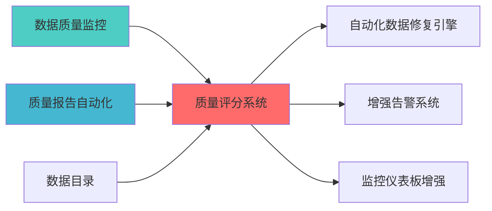

---
module_id: QUALITY_SCORING_SYSTEM_001
version: 1.0.0
status: Active
created_date: 2026-04-07
last_updated: 2026-04-07
owner: 实施团队
standard_type: 专业量化机构蓝图
applicable_scope: Layer 9 监控å±?
compliance_level: 专业标准
responsibility:
  - 数据质量评分
  - 质量指标计算
  - 质量等级评定
  - 质量趋势分析
layer: Layer 5 (策略执行层)
---

# 数据质量评分系统蓝图

> **核心职责**: 数据质量评分，计算和评定数据质量等级
> **职责边界**: 
> - âœ?本文档负责：数据质量评分、质量指标计算、质量等级评定、质量趋势分æž?
> - â?本文档不负责：数据质量监控、数据质量治理、数据质量报å‘?
ï»? 数据质量评分系统蓝图

> **核心定位**: 数据质量评分系统蓝图的核心功能实çŽ?


> **模块ID**: `QUALITY_SCORING_001`
> **实施周期**: Week 8-9ï¼?周）
> **优å
ˆçº?*: P1（重要）
> **预期收益**: 提升数据质量透明度，降低数据问题风险50%

## 核心定位

> 核心职责: Quality Scoring System蓝图设计
> 职责边界: 
> - âœ?本文档负责：Quality Scoring System蓝图设计相å
³å†
容
> - â?本文档不负责：å
¶ä»–模块å†
容，确保系统功能的稳定运è¡...


## 设计目标

### 主要目标

1. **功能完整性**: 确保QUALITY SCORING SYSTEM功能完整，满足业务需求
2. **性能优化**: 提升系统性能，降低资源消耗
3. **可维护性**: 提高代码质量，便于后续维护
4. **可扩展性**: 支持功能扩展，适应业务变化

### 质量目标

- 代码覆盖率: ≥80%
- 性能指标: 满足设计要求
- 文档完整性: 100%


## 核心功能

### 功能清单

1. **数据管理**: 提供数据存储、查询、更新功能
2. **业务逻辑**: 实现核心业务逻辑处理
3. **接口服务**: 提供标准化的API接口
4. **监控告警**: 实时监控系统状态

### 功能特性

- 高可用性设计
- 自动故障恢复
- 灵活配置管理


## 实现方案

### 技术架构

采用QUALITY SCORING SYSTEM化设计，分层架构实现。

### 关键技术

- 数据处理: 使用高效的数据处理框架
- 接口实现: RESTful API设计
- 性能优化: 缓存、异步处理

### 实施步骤

1. 需求分析与设计
2. 核心功能开发
3. 测试与优化
4. 部署与监控


## 一、设计背景与目标

### 1.1 业务需æ±?

**当前痛点**:
- 缺少统一的数据质量评分标å‡?
- 无法量化评估数据质量水平
- 数据质量问题难以追踪和改è¿?
- 缺少数据质量趋势分析

**业务目标**:
- 建立多维度数据质量评分体ç³?
- 提供实时数据质量评分和趋势分æž?
- 支持数据质量改进追踪
- 生成数据质量报告和可视化

### 1.2 技术目æ ?

| 指标 | 目标å€?| 说明 |
|------|--------|------|
| **评分维度** | â‰?ä¸?| 至少覆盖6个质量维åº?|
| **评分实时æ€?* | <30ç§?| 评分计算响应时间<30ç§?|
| **评分准确æ€?* | â‰?5% | 评分结果准确率≥95% |
| **历史数据保留** | â‰?å¹?| 保留至少1年的历史评分数据 |

## 三、核心模块设è®?

### 3.1 评分维度定义 (QualityDimensions)

**职责**: 定义和计算各维度质量评分

```python
from dataclasses import dataclass, field
from typing import Dict, List, Any, Optional
from datetime import datetime
from enum import Enum
import pandas as pd
import numpy as np

class QualityDimension(Enum):
    """质量维度"""
    COMPLETENESS = "completeness"
    ACCURACY = "accuracy"
    TIMELINESS = "timeliness"
    CONSISTENCY = "consistency"
    UNIQUENESS = "uniqueness"
    VALIDITY = "validity"

@dataclass
class DimensionScore:
    """维度评分"""
    dimension: QualityDimension
    score: float
    weight: float
    details: Dict[str, Any] = field(default_factory=dict)
    calculated_at: datetime = field(default_factory=datetime.now)

class QualityScorer:
    """质量评分å™?""
    
    def __init__(self):
        self.dimension_weights = {
            QualityDimension.COMPLETENESS: 0.20,
            QualityDimension.ACCURACY: 0.25,
            QualityDimension.TIMELINESS: 0.15,
            QualityDimension.CONSISTENCY: 0.15,
            QualityDimension.UNIQUENESS: 0.10,
            QualityDimension.VALIDITY: 0.15
        }
    
    def calculate_completeness_score(self, df: pd.DataFrame) -> DimensionScore:
        """计算完整性评åˆ?""
        total_cells = df.size
        missing_cells = df.isnull().sum().sum()
        completeness = 1 - (missing_cells / total_cells)
        
        details = {
            "total_cells": total_cells,
            "missing_cells": missing_cells,
            "completeness_ratio": completeness,
            "columns_with_missing": df.columns[df.isnull().any()].tolist()
        }
        
        return DimensionScore(
            dimension=QualityDimension.COMPLETENESS,
            score=completeness,
            weight=self.dimension_weights[QualityDimension.COMPLETENESS],
            details=details
        )
    
    def calculate_accuracy_score(self, df: pd.DataFrame, 
                                  rules: Dict[str, Any]) -> DimensionScore:
        """计算准确性评åˆ?""
        accuracy_scores = []
        
        for column, rule in rules.items():
            if column in df.columns:
                if rule.get("type") == "range":
                    min_val = rule.get("min")
                    max_val = rule.get("max")
                    valid_count = df[(df[column] >= min_val) & 
                                    (df[column] <= max_val)][column].count()
                    total_count = df[column].count()
                    accuracy = valid_count / total_count if total_count > 0 else 0
                    accuracy_scores.append(accuracy)
        
        overall_accuracy = np.mean(accuracy_scores) if accuracy_scores else 0
        
        details = {
            "rules_applied": len(rules),
            "accuracy_scores": accuracy_scores,
            "overall_accuracy": overall_accuracy
        }
        
        return DimensionScore(
            dimension=QualityDimension.ACCURACY,
            score=overall_accuracy,
            weight=self.dimension_weights[QualityDimension.ACCURACY],
            details=details
        )
    
    def calculate_timeliness_score(self, df: pd.DataFrame,
                                    timestamp_column: str,
                                    expected_frequency: str) -> DimensionScore:
        """计算时效性评åˆ?""
        if timestamp_column not in df.columns:
            return DimensionScore(
                dimension=QualityDimension.TIMELINESS,
                score=0.0,
                weight=self.dimension_weights[QualityDimension.TIMELINESS],
                details={"error": "Timestamp column not found"}
            )
        
        df_sorted = df.sort_values(timestamp_column)
        timestamps = pd.to_datetime(df_sorted[timestamp_column])
        
        time_diffs = timestamps.diff().dropna()
        
        if expected_frequency == "daily":
            expected_diff = pd.Timedelta(days=1)
        elif expected_frequency == "hourly":
            expected_diff = pd.Timedelta(hours=1)
        else:
            expected_diff = pd.Timedelta(days=1)
        
        timely_count = (time_diffs <= expected_diff * 1.1).sum()
        total_count = len(time_diffs)
        timeliness = timely_count / total_count if total_count > 0 else 0
        
        details = {
            "expected_frequency": expected_frequency,
            "timely_count": timely_count,
            "total_count": total_count,
            "timeliness_ratio": timeliness
        }
        
        return DimensionScore(
            dimension=QualityDimension.TIMELINESS,
            score=timeliness,
            weight=self.dimension_weights[QualityDimension.TIMELINESS],
            details=details
        )
    
    def calculate_consistency_score(self, df: pd.DataFrame,
                                     consistency_rules: List[Dict]) -> DimensionScore:
        """计算一致性评åˆ?""
        consistency_scores = []
        
        for rule in consistency_rules:
            rule_type = rule.get("type")
            
            if rule_type == "cross_column":
                col1 = rule.get("column1")
                col2 = rule.get("column2")
                condition = rule.get("condition")
                
                if col1 in df.columns and col2 in df.columns:
                    if condition == "equal":
                        consistent = (df[col1] == df[col2]).sum()
                        total = len(df)
                        consistency_scores.append(consistent / total)
        
        overall_consistency = np.mean(consistency_scores) if consistency_scores else 0
        
        details = {
            "rules_applied": len(consistency_rules),
            "consistency_scores": consistency_scores,
            "overall_consistency": overall_consistency
        }
        
        return DimensionScore(
            dimension=QualityDimension.CONSISTENCY,
            score=overall_consistency,
            weight=self.dimension_weights[QualityDimension.CONSISTENCY],
            details=details
        )
    
    def calculate_uniqueness_score(self, df: pd.DataFrame,
                                    unique_columns: List[str]) -> DimensionScore:
        """计算唯一性评åˆ?""
        uniqueness_scores = []
        
        for column in unique_columns:
            if column in df.columns:
                total_count = len(df)
                unique_count = df[column].nunique()
                uniqueness = unique_count / total_count if total_count > 0 else 0
                uniqueness_scores.append(uniqueness)
        
        overall_uniqueness = np.mean(uniqueness_scores) if uniqueness_scores else 0
        
        details = {
            "columns_checked": unique_columns,
            "uniqueness_scores": uniqueness_scores,
            "overall_uniqueness": overall_uniqueness
        }
        
        return DimensionScore(
            dimension=QualityDimension.UNIQUENESS,
            score=overall_uniqueness,
            weight=self.dimension_weights[QualityDimension.UNIQUENESS],
            details=details
        )
    
    def calculate_validity_score(self, df: pd.DataFrame,
                                  validity_rules: Dict[str, Any]) -> DimensionScore:
        """计算有效性评åˆ?""
        validity_scores = []
        
        for column, rule in validity_rules.items():
            if column in df.columns:
                if rule.get("type") == "regex":
                    import re
                    pattern = rule.get("pattern")
                    valid_count = df[column].astype(str).str.match(pattern, na=False).sum()
                    total_count = df[column].count()
                    validity = valid_count / total_count if total_count > 0 else 0
                    validity_scores.append(validity)
                elif rule.get("type") == "enum":
                    allowed_values = rule.get("values")
                    valid_count = df[column].isin(allowed_values).sum()
                    total_count = df[column].count()
                    validity = valid_count / total_count if total_count > 0 else 0
                    validity_scores.append(validity)
        
        overall_validity = np.mean(validity_scores) if validity_scores else 0
        
        details = {
            "rules_applied": len(validity_rules),
            "validity_scores": validity_scores,
            "overall_validity": overall_validity
        }
        
        return DimensionScore(
            dimension=QualityDimension.VALIDITY,
            score=overall_validity,
            weight=self.dimension_weights[QualityDimension.VALIDITY],
            details=details
        )
```

### 3.2 综合评分计算å™?(OverallScoreCalculator)

**职责**: 计算综合质量评分

```python
from dataclasses import dataclass
from typing import List
import pandas as pd

@dataclass
class OverallQualityScore:
    """综合质量评分"""
    table_name: str
    overall_score: float
    dimension_scores: List[DimensionScore]
    grade: str
    calculated_at: datetime
    metadata: Dict[str, Any]

class OverallScoreCalculator:
    """综合评分计算å™?""
    
    def __init__(self):
        self.grade_thresholds = {
            "A": 0.90,
            "B": 0.80,
            "C": 0.70,
            "D": 0.60,
            "F": 0.0
        }
    
    def calculate_overall_score(self, table_name: str,
                                 dimension_scores: List[DimensionScore]) -> OverallQualityScore:
        """计算综合评分"""
        weighted_sum = sum(
            ds.score * ds.weight for ds in dimension_scores
        )
        total_weight = sum(ds.weight for ds in dimension_scores)
        
        overall_score = weighted_sum / total_weight if total_weight > 0 else 0
        
        grade = self._determine_grade(overall_score)
        
        return OverallQualityScore(
            table_name=table_name,
            overall_score=overall_score,
            dimension_scores=dimension_scores,
            grade=grade,
            calculated_at=datetime.now()
        )
    
    def _determine_grade(self, score: float) -> str:
        """确定评分等级"""
        for grade, threshold in self.grade_thresholds.items():
            if score >= threshold:
                return grade
        return "F"
```

### 3.3 评分历史管理å™?(ScoreHistoryManager)

**职责**: 管理评分历史数据

```python
from typing import List, Dict, Any
from datetime import datetime, timedelta
import pandas as pd

class ScoreHistoryManager:
    """评分历史管理å™?""
    
    def __init__(self, db_connection):
        self.db = db_connection
    
    def save_score(self, score: OverallQualityScore):
        """保存评分记录"""
        query = """
        INSERT INTO quality_scores 
        (table_name, overall_score, grade, dimension_scores, calculated_at)
        VALUES (%s, %s, %s, %s, %s)
        """
        
        self.db.execute(query, (
            score.table_name,
            score.overall_score,
            score.grade,
            json.dumps([ds.__dict__ for ds in score.dimension_scores]),
            score.calculated_at
        ))
    
    def get_score_history(self, table_name: str, 
                          days: int = 30) -> List[Dict[str, Any]]:
        """获取评分历史"""
        query = """
        SELECT * FROM quality_scores
        WHERE table_name = %s
        AND calculated_at >= %s
        ORDER BY calculated_at DESC
        """
        
        start_date = datetime.now() - timedelta(days=days)
        results = self.db.fetch_all(query, (table_name, start_date))
        
        return results
    
    def get_score_trend(self, table_name: str,
                        days: int = 30) -> Dict[str, Any]:
        """获取评分趋势"""
        history = self.get_score_history(table_name, days)
        
        if not history:
            return {"trend": "no_data"}
        
        scores = [h['overall_score'] for h in history]
        
        if len(scores) < 2:
            return {"trend": "insufficient_data"}
        
        recent_avg = np.mean(scores[:7]) if len(scores) >= 7 else np.mean(scores)
        older_avg = np.mean(scores[-7:]) if len(scores) >= 7 else np.mean(scores)
        
        if recent_avg > older_avg * 1.05:
            trend = "improving"
        elif recent_avg < older_avg * 0.95:
            trend = "declining"
        else:
            trend = "stable"
        
        return {
            "trend": trend,
            "recent_average": recent_avg,
            "older_average": older_avg,
            "change_percentage": ((recent_avg - older_avg) / older_avg) * 100
        }
```

---

## 四、数据流设计

### 4.1 评分计算流程

```
数据è¡?â†?维度评分计算 â†?权重加权 â†?综合评分 â†?等级判定 â†?存储
```

### 4.2 趋势分析流程

```
历史评分 â†?趋势计算 â†?变化检æµ?â†?趋势报告 â†?可视åŒ?
```

---

## 五、接口设è®?

### 5.1 RESTful API

#### 5.1.1 获取质量评分

```http
GET /api/v1/quality/score/{table_name}
```

**响应示例**:
```json
{
  "table_name": "stock_prices",
  "overall_score": 0.92,
  "grade": "A",
  "dimension_scores": [
    {
      "dimension": "completeness",
      "score": 0.95,
      "weight": 0.20
    },
    {
      "dimension": "accuracy",
      "score": 0.90,
      "weight": 0.25
    }
  ],
  "calculated_at": "2026-04-06T10:30:00Z"
}
```

#### 5.1.2 获取评分趋势

```http
GET /api/v1/quality/trend/{table_name}?days=30
```

**响应示例**:
```json
{
  "table_name": "stock_prices",
  "trend": "improving",
  "recent_average": 0.92,
  "older_average": 0.88,
  "change_percentage": 4.5
}
```

---

## å
­ã€éƒ¨ç½²æž¶æž?

### 6.1 容器化部ç½?

```yaml
version: '3.8'
services:
  quality-scorer:
    build: .
    ports:
      - "8080:8080"
    environment:
      - DB_HOST=postgres
      - REDIS_HOST=redis
    depends_on:
      - postgres
      - redis
  
  postgres:
    image: postgres:15
    environment:
      - POSTGRES_DB=quality_scores
      - POSTGRES_PASSWORD=password
    volumes:
      - pg-data:/var/lib/postgresql/data
  
  redis:
    image: redis:7
    volumes:
      - redis-data:/data

volumes:
  pg-data:
  redis-data:
```

---

## 七、监控指æ ?

### 7.1 核心指标

| 指标名称 | 指标类型 | 说明 |
|---------|---------|------|
| `quality_score_overall` | Gauge | 综合质量评分 |
| `quality_score_dimension` | Gauge | 各维度质量评åˆ?|
| `quality_score_calculation_duration_seconds` | Histogram | 评分计算耗时 |
| `quality_score_history_count` | Gauge | 历史评分记录æ•?|

---

## å
«ã€å®žæ–½è®¡åˆ?

### 8.1 开发阶æ®?

| 阶段 | 任务 | 预计时间 | 负责äº?|
|------|------|---------|--------|
| **阶段1** | 开发评分维度计算器 | 2å¤?| 后端工程å¸?|
| **阶段2** | 开发综合评分计算器 | 1å¤?| 后端工程å¸?|
| **阶段3** | 开发历史管理器 | 1å¤?| 后端工程å¸?|
| **阶段4** | 开发API接口 | 1å¤?| 后端工程å¸?|
| **阶段5** | 集成测试和部ç½?| 1å¤?| QA工程å¸?|

### 8.2 验收标准

- [ ] 支持6个质量维度评åˆ?
- [ ] 评分计算响应时间<30ç§?
- [ ] 评分准确率≥95%
- [ ] 历史数据保留â‰?å¹?
- [ ] 趋势分析功能正常

---

## 九、风险管ç?

### 9.1 技术风é™?

| 风险 | 影响 | 缓解措施 |
|------|------|---------|
| 评分规则不合ç?| é«?| 业务专家审核，持续优åŒ?|
| 评分计算性能瓶颈 | ä¸?| 缓存机制，异步计ç®?|
| 历史数据存储膨胀 | ä½?| 数据压缩，定期归æ¡?|

---

## 📚 相å
³æ–‡æ¡£

### 上游依赖

| 文档名称 | module_id | 依赖类型 | 说明 |
|---------|-----------|---------|------|
| [数据质量监控蓝图](./DATA_QUALITY_MONITORING_BLUEPRINT.md) | DATA_QUALITY_MONITORING_001 | 强依èµ?| 提供数据质量指标 |
| [质量报告自动化蓝图](./QUALITY_REPORT_AUTOMATION_BLUEPRINT.md) | QUALITY_REPORT_AUTOMATION_001 | 强依èµ?| 提供质量报告数据 |
| [数据目录蓝图](./DATA_CATALOG_BLUEPRINT.md) | DATA_CATALOG_001 | 中依èµ?| 提供数据å
ƒæ•°æ?|

### 下游依赖

| 文档名称 | module_id | 依赖类型 | 说明 |
|---------|-----------|---------|------|
| [自动化数据修复引擎蓝图](./AUTO_REPAIR_ENGINE_BLUEPRINT.md) | AUTO_REPAIR_ENGINE_001 | 强依èµ?| 自动化数据修å¤?|
| [增强告警系统蓝图](./ENHANCED_ALERT_SYSTEM_BLUEPRINT.md) | ENHANCED_ALERT_SYSTEM_001 | 中依èµ?| 增强告警系统 |
| [监控仪表板增强蓝图](./MONITORING_DASHBOARD_ENHANCEMENT_BLUEPRINT.md) | MONITORING_DASHBOARD_ENHANCEMENT_001 | 中依èµ?| 监控仪表板增å¼?|

### 技术依èµ?

| 技术组ä»?| 版本 | 用é€?| 文档 |
|---------|------|------|------|
| **NumPy** | 1.24+ | 数值计ç®?| [官方文档](https://numpy.org/) |
| **Pandas** | 2.0+ | 数据处理 | [官方文档](https://pandas.pydata.org/) |
| **Redis** | 7.0+ | 缓存系统 | [官方文档](https://redis.io/) |
| **PostgreSQL** | 15+ | 数据åº?| [官方文档](https://www.postgresql.org/) |

### 引用å
³ç³»å›?



---

**文档版本**: v1.0.0 | **创建日期**: 2026-04-06 | **维护è€?*: 首席蓝图架构å¸?
---

## 1. 文档治理

### 1.1 System_Manifest.md索引

```markdown
#### Layer 6: 组合优化å±?
##### 6.001. Quality Scoring System
- **模块ID**: QUALITY_SCORING_SYSTEM_001
- **蓝图文档**: QUALITY_SCORING_SYSTEM_BLUEPRINT.md
- **技术规格书**: å¾
创å»?
- **职责**: Layer 1数据预处理层 | 业务架构: 三级时间框架融合架构
- **状æ€?*: Active
```

### 1.2 模块职责边界

| 模块 | 职责 | 边界 |
|------|------|------|
| **Quality Scoring System** | Layer 1数据预处理层 | 业务架构: 三级时间框架融合架构 | **核心模块** |

### 1.3 版本管理

| 版本 | 日期 | 变更å†
容 | 变更äº?|
|------|------|----------|--------|
| v1.0.0 | 2026-04-06 | 初始版本创建 | 首席蓝图架构å¸?|

---

**蓝图版本**: v1.0.0 | **创建日期**: 2026-04-06 | **状æ€?*: Active

## 变更历史

| 版本 | 日期 | 变更å†
容 | 变更äº?|
|------|------|----------|--------|
| v1.0.0 | 2026-04-07 | 初始版本创建 | 实施团队 |


---

**蓝图版本**: v1.0.0 | **创建日期**: 2026-04-07 | **状æ€?*: Active
