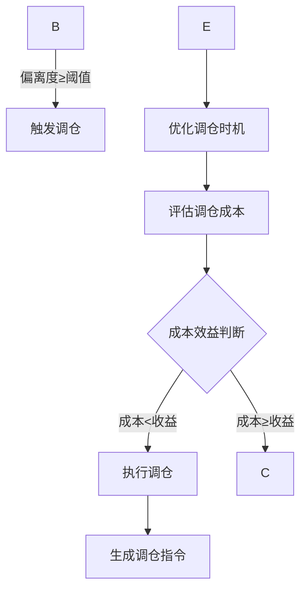
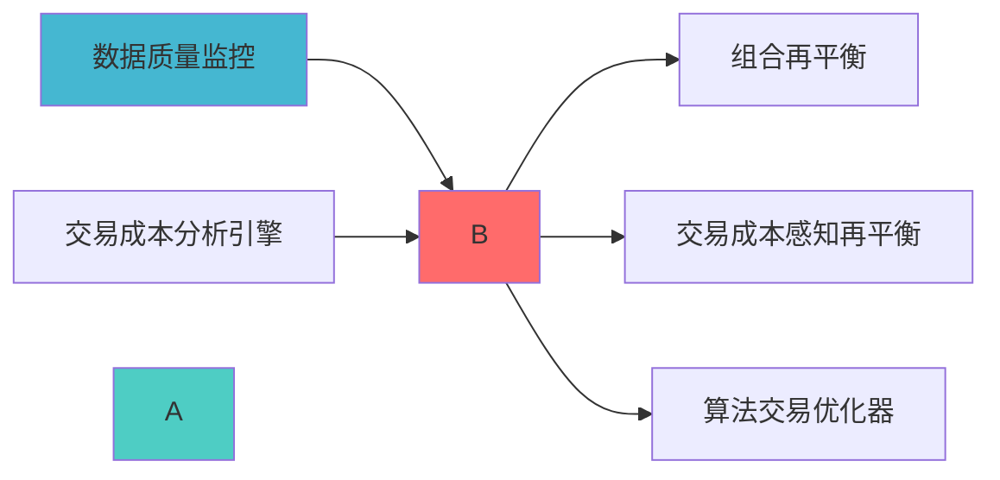

---
module_id: QUARTERLY_REBALANCE_001
version: 1.0.0
status: Active
created_date: 2026-04-07
last_updated: 2026-04-07
owner: 实施团队
standard_type: 专业量化机构蓝图
applicable_scope: Layer 6 组合优化层
compliance_level: 专业标准
responsibility:
  - 季度调仓实现
  - 季度再平衡执行
  - 定期调仓决策
  - 季度权重调整
layer: Layer 6 (组合优化层)
---
# 季度调仓蓝图

## 核心定位

负责季度再平衡的设计与实现，执行定期投资组合再平衡。


> **职责边界**: 
> ...


## 设计目标

### 主要目标

1. **功能完整性**: 确保QUARTERLY REBALANCE功能完整，满足业务需求
2. **性能优化**: 提升系统性能，降低资源消耗
3. **可维护性**: 提高代码质量，便于后续维护
4. **可扩展性**: 支持功能扩展，适应业务变化

### 质量目标

- 代码覆盖率: ≥80%
- 性能指标: 满足设计要求
- 文档完整性: 100%


## 核心功能

### 功能清单

1. **数据管理**: 提供数据存储、查询、更新功能
2. **业务逻辑**: 实现核心业务逻辑处理
3. **接口服务**: 提供标准化的API接口
4. **监控告警**: 实时监控系统状态

### 功能特性

- 高可用性设计
- 自动故障恢复
- 灵活配置管理


## 实现方案

### 技术架构

采用QUARTERLY REBALANCE化设计，分层架构实现。

### 关键技术

- 数据处理: 使用高效的数据处理框架
- 接口实现: RESTful API设计
- 性能优化: 缓存、异步处理

### 实施步骤

1. 需求分析与设计
2. 核心功能开发
3. 测试与优化
4. 部署与监控


## 核心定位


### 核心职责

|---------|---------|---------|
| **å¹
度 | 调仓计划 |
| **成本评估** | 评估调仓成本 | 成本报告 |

---


### 调仓决策流程



---


```python
from typing import Dict, Any
import pandas as pd
import numpy as np

class RebalanceTrigger:
    
    def __init__(self):
        
    def check_trigger(self,
                     current_allocation: Dict[str, float],
                     target_allocation: Dict[str, float],
                     last_rebalance_date: pd.Timestamp) -> Dict[str, Any]:
        drift = self._calculate_drift(current_allocation, target_allocation)
        
        # 计算距离上次调仓天数
        days_since_last = (pd.Timestamp.now() - last_rebalance_date).days
        
        # 判断是否触发
        triggered = False
        trigger_reasons = []
        
        if drift > self.drift_threshold:
            triggered = True
            trigger_reasons.append(f'é
过阈值{self.drift_threshold:.2%}')
        
        if days_since_last > self.time_threshold:
            triggered = True
        
        return {
            'triggered': triggered,
            'drift': drift,
            'days_since_last': days_since_last,
            'trigger_reasons': trigger_reasons
        }
    
    def _calculate_drift(self,
                        current: Dict[str, float],
                        target: Dict[str, float]) -> float:
        drifts = []
        
        for asset in target.keys():
            if asset in current:
                drift = abs(current[asset] - target[asset])
                drifts.append(drift)
        
        return max(drifts) if drifts else 0
```


```python
class RebalanceMagnitudeCalculator:
    
    def __init__(self):
        self.max_turnover = 0.30  # 最大换手率30%
        
    def calculate(self,
                 current_allocation: Dict[str, float],
                 target_allocation: Dict[str, float],
                 cost_budget: float) -> Dict[str, Any]:
        ideal_adjustments = {}
        for asset in target_allocation.keys():
            current_weight = current_allocation.get(asset, 0)
            target_weight = target_allocation[asset]
            adjustment = target_weight - current_weight
            ideal_adjustments[asset] = adjustment
        
        turnover = sum(abs(adj) for adj in ideal_adjustments.values()) / 2
        
        if turnover > self.max_turnover:
            scale_factor = self.max_turnover / turnover
            for asset in ideal_adjustments:
                ideal_adjustments[asset] *= scale_factor
            turnover = self.max_turnover
        
        return {
            'adjustments': ideal_adjustments,
            'turnover': turnover,
            'is_scaled': turnover >= self.max_turnover
        }
```


```python
class RebalancingTimingOptimizer:
    
    def __init__(self):
        self.avoid_periods = [
            ('01-15', '01-31'),  # 避开春节前后
            ('10-01', '10-07')   # 避开国庆假期
        ]
        
    def optimize(self,
                market_conditions: pd.DataFrame,
                liquidity_forecast: pd.DataFrame) -> Dict[str, Any]:
        """优化调仓时机"""
        # 获取未来5个交易日
        future_dates = pd.date_range(start=pd.Timestamp.now(), periods=5, freq='B')
        
        # 评分每个日期
        scores = {}
        for date in future_dates:
            score = self._score_date(date, market_conditions, liquidity_forecast)
            scores[date] = score
        
        best_date = max(scores, key=scores.get)
        
        return {
            'best_date': best_date,
            'scores': scores,
            'reason': self._explain_score(best_date, scores[best_date])
        }
    
    def _score_date(self,
                   date: pd.Timestamp,
                   market_conditions: pd.DataFrame,
                   liquidity_forecast: pd.DataFrame) -> float:
        """评分日期"""
        score = 100.0
        
        date_str = date.strftime('%m-%d')
        for start, end in self.avoid_periods:
            if start <= date_str <= end:
                score -= 30
        
        # 检查市场波动率
        if date in market_conditions.index:
            volatility = market_conditions.loc[date, 'volatility']
            if volatility > 0.30:
                score -= 20
            elif volatility > 0.20:
                score -= 10
        
        if date in liquidity_forecast.index:
            liquidity = liquidity_forecast.loc[date, 'liquidity']
            if liquidity < 0.5:
                score -= 20
            elif liquidity < 0.8:
                score -= 10
        
        return max(score, 0)
    
    def _explain_score(self, date: pd.Timestamp, score: float) -> str:
        """解释评分"""
        if score >= 80:
            return f"{date.strftime('%Y-%m-%d')}是理想的调仓日期"
        elif score >= 60:
        else:
```

---

## 🚀 实施要点


**任务**:

---


**任务**:
度计算

---


**任务**:

---

## 📈 性能指标

### 调仓决策质量

|------|--------|
| **å¹
| **时机优化收益** | > 0.1% |

---


### 上游依赖

| 文档名称 | module_id | 依赖类型 | 说明 |
|---------|-----------|---------|------|

### 下游依赖

| 文档名称 | module_id | 依赖类型 | 说明 |
|---------|-----------|---------|------|


|---------|------|------|------|
| **Pandas** | 2.0+ | 数据处理 | [官方文档](https://pandas.pydata.org/) |
| **SciPy** | 1.10+ | 科学计算 | [官方文档](https://scipy.org/) |





- [经济范式判断引擎蓝图](./ECONOMIC_REGIME_ENGINE_BLUEPRINT.md)

---

## 📝 变更历史

|------|------|---------|------|

---

---

## 1. 文档治理

### 1.1 System_Manifest.md索引

```markdown
##### 6.001. Quarterly Rebalance
- **模块ID**: QUARTERLY_REBALANCE_001
- **蓝图文档**: QUARTERLY_REBALANCE_BLUEPRINT.md
```

### 1.2 模块职责边界

| 模块 | 职责 | 边界 |
|------|------|------|

### 1.3 版本管理

|------|------|----------|--------|

---

