# 季度调仓蓝图

## 核心定位

负责季度再平衡的设计与实现，执行定期投资组合再平衡。


> **核心职责**: 季度调仓决策，季度权重调æ•?
> **职责边界**: 
> - âœ?本文档负责：季度调仓、季度再平衡、调仓决策、季度权重调æ•?
> - â?本文档不负责：日内调仓、实时调仓、风险控åˆ?

ï»? 📋 执行摘要

> **版本**: v1.0
> **创建日期**: 2026-04-06
> **核心定位**: 宏观配置层季度调仓决ç­?
> **索引**: `QUARTERLY_REBALANCE_001`
> **开发周æœ?*: 2å‘?

## 核心定位

负责Quarterly Rebalance的设计、实现和维护，提供核心功能支持，确保系统模块的稳定运行和高效执行ã€?

## 🎯 模块定位与职è´?

### 核心职责

| 职责类别 | 具体职责 | 输出产物 |
|---------|---------|---------|
| **触发判断** | 判断是否需要调ä»?| 调仓触发信号 |
| **幅度计算** | 计算调仓幅度 | 调仓计划 |
| **时机优化** | 优化调仓时机 | 执行时间è¡?|
| **成本评估** | 评估调仓成本 | 成本报告 |

---

## 🏗ï¸?架构设计

### 调仓决策流程

```mermaid
graph TB
    A[当前配置] --> B{偏离度检查}
    B -->|偏离åº?阈值| C[不调仓]
    B -->|偏离度≥阈值| D[触发调仓]
    
    D --> E[计算调仓幅度]
    E --> F[优化调仓时机]
    F --> G[评估调仓成本]
    
    G --> H{成本效益判断}
    H -->|成本<收益| I[执行调仓]
    H -->|成本≥收益| C
    
    I --> J[生成调仓指令]
```



---

## 🔧 关键组件设计

### 1. 调仓触发å™?

```python
from typing import Dict, Any
import pandas as pd
import numpy as np

class RebalanceTrigger:
    """调仓触发å™?""
    
    def __init__(self):
        self.drift_threshold = 0.05  # 偏离度阈å€?%
        self.time_threshold = 90  # 时间阈å€?0å¤?
        
    def check_trigger(self,
                     current_allocation: Dict[str, float],
                     target_allocation: Dict[str, float],
                     last_rebalance_date: pd.Timestamp) -> Dict[str, Any]:
        """检查调仓触发条ä»?""
        # 计算配置偏离åº?
        drift = self._calculate_drift(current_allocation, target_allocation)
        
        # 计算距离上次调仓天数
        days_since_last = (pd.Timestamp.now() - last_rebalance_date).days
        
        # 判断是否触发
        triggered = False
        trigger_reasons = []
        
        if drift > self.drift_threshold:
            triggered = True
            trigger_reasons.append(f'配置偏离度{drift:.2%}超过阈值{self.drift_threshold:.2%}')
        
        if days_since_last > self.time_threshold:
            triggered = True
            trigger_reasons.append(f'距离上次调仓{days_since_last}天超过阈值{self.time_threshold}å¤?)
        
        return {
            'triggered': triggered,
            'drift': drift,
            'days_since_last': days_since_last,
            'trigger_reasons': trigger_reasons
        }
    
    def _calculate_drift(self,
                        current: Dict[str, float],
                        target: Dict[str, float]) -> float:
        """计算配置偏离åº?""
        drifts = []
        
        for asset in target.keys():
            if asset in current:
                drift = abs(current[asset] - target[asset])
                drifts.append(drift)
        
        return max(drifts) if drifts else 0
```

### 2. 调仓幅度计算å™?

```python
class RebalanceMagnitudeCalculator:
    """调仓幅度计算å™?""
    
    def __init__(self):
        self.max_turnover = 0.30  # 最大换手率30%
        
    def calculate(self,
                 current_allocation: Dict[str, float],
                 target_allocation: Dict[str, float],
                 cost_budget: float) -> Dict[str, Any]:
        """计算调仓幅度"""
        # 计算理想调仓幅度
        ideal_adjustments = {}
        for asset in target_allocation.keys():
            current_weight = current_allocation.get(asset, 0)
            target_weight = target_allocation[asset]
            adjustment = target_weight - current_weight
            ideal_adjustments[asset] = adjustment
        
        # 计算换手çŽ?
        turnover = sum(abs(adj) for adj in ideal_adjustments.values()) / 2
        
        # 如果换手率超过限制，按比例缩å‡?
        if turnover > self.max_turnover:
            scale_factor = self.max_turnover / turnover
            for asset in ideal_adjustments:
                ideal_adjustments[asset] *= scale_factor
            turnover = self.max_turnover
        
        return {
            'adjustments': ideal_adjustments,
            'turnover': turnover,
            'is_scaled': turnover >= self.max_turnover
        }
```

### 3. 调仓时机优化å™?

```python
class RebalancingTimingOptimizer:
    """调仓时机优化å™?""
    
    def __init__(self):
        self.avoid_periods = [
            ('01-15', '01-31'),  # 避开春节前后
            ('04-15', '04-30'),  # 避开年报密集æœ?
            ('10-01', '10-07')   # 避开国庆假期
        ]
        
    def optimize(self,
                market_conditions: pd.DataFrame,
                liquidity_forecast: pd.DataFrame) -> Dict[str, Any]:
        """优化调仓时机"""
        # 获取未来5个交易日
        future_dates = pd.date_range(start=pd.Timestamp.now(), periods=5, freq='B')
        
        # 评分每个日期
        scores = {}
        for date in future_dates:
            score = self._score_date(date, market_conditions, liquidity_forecast)
            scores[date] = score
        
        # 选择最佳日æœ?
        best_date = max(scores, key=scores.get)
        
        return {
            'best_date': best_date,
            'scores': scores,
            'reason': self._explain_score(best_date, scores[best_date])
        }
    
    def _score_date(self,
                   date: pd.Timestamp,
                   market_conditions: pd.DataFrame,
                   liquidity_forecast: pd.DataFrame) -> float:
        """评分日期"""
        score = 100.0
        
        # 检查是否在避开æœ?
        date_str = date.strftime('%m-%d')
        for start, end in self.avoid_periods:
            if start <= date_str <= end:
                score -= 30
        
        # 检查市场波动率
        if date in market_conditions.index:
            volatility = market_conditions.loc[date, 'volatility']
            if volatility > 0.30:
                score -= 20
            elif volatility > 0.20:
                score -= 10
        
        # 检查流动æ€?
        if date in liquidity_forecast.index:
            liquidity = liquidity_forecast.loc[date, 'liquidity']
            if liquidity < 0.5:
                score -= 20
            elif liquidity < 0.8:
                score -= 10
        
        return max(score, 0)
    
    def _explain_score(self, date: pd.Timestamp, score: float) -> str:
        """解释评分"""
        if score >= 80:
            return f"{date.strftime('%Y-%m-%d')}是理想的调仓日期"
        elif score >= 60:
            return f"{date.strftime('%Y-%m-%d')}是可接受的调仓日æœ?
        else:
            return f"{date.strftime('%Y-%m-%d')}不是理想的调仓日æœ?
```

---

## 🚀 实施要点

### 阶段1：调仓触发器开发（ç¬?周）

**任务**:
1. âœ?实现偏离度计ç®?
2. âœ?实现时间阈值检æŸ?
3. âœ?实现触发条件判断
4. âœ?编写单元测试

---

### 阶段2：调仓幅度计算器开发（ç¬?周）

**任务**:
1. âœ?实现理想调仓幅度计算
2. âœ?实现换手率限åˆ?
3. âœ?实现成本预算约束
4. âœ?编写单元测试

---

### 阶段3：调仓时机优化器开发（ç¬?周）

**任务**:
1. âœ?实现日期评分
2. âœ?实现避开期检æŸ?
3. âœ?实现流动性评ä¼?
4. âœ?集成测试

---

## 📈 性能指标

### 调仓决策质量

| 指标 | 目标å€?|
|------|--------|
| **触发准确çŽ?* | â‰?95% |
| **幅度计算精度** | â‰?98% |
| **时机优化收益** | > 0.1% |
| **成本节约çŽ?* | > 20% |

---

## 📚 相关文档

### 上游依赖

| 文档名称 | module_id | 依赖类型 | 说明 |
|---------|-----------|---------|------|
| [战略权重分配蓝图](./STRATEGIC_WEIGHTING_BLUEPRINT.md) | STRATEGIC_WEIGHTING_001 | 强依èµ?| 提供目标权重方案 |
| [数据质量监控蓝图](./DATA_QUALITY_MONITORING_BLUEPRINT.md) | DATA_QUALITY_MONITORING_001 | 强依èµ?| 提供数据质量指标 |
| [交易成本分析引擎蓝图](./TRANSACTION_COST_ANALYSIS_ENGINE_BLUEPRINT.md) | TRANSACTION_COST_ANALYSIS_ENGINE_001 | 中依èµ?| 提供成本分析 |

### 下游依赖

| 文档名称 | module_id | 依赖类型 | 说明 |
|---------|-----------|---------|------|
| [组合再平衡蓝图](./PORTFOLIO_REBALANCING_BLUEPRINT.md) | PORTFOLIO_REBALANCING_001 | 强依èµ?| 组合再平è¡?|
| [交易成本感知再平衡蓝图](./TRANSACTION_COST_AWARE_REBALANCING_BLUEPRINT.md) | TRANSACTION_COST_AWARE_REBALANCING_001 | 中依èµ?| 成本感知再平è¡?|
| [算法交易优化器蓝图](./ALGORITHMIC_TRADING_OPTIMIZER_BLUEPRINT.md) | ALGORITHMIC_TRADING_OPTIMIZER_001 | 中依èµ?| 算法交易执行 |

### 技术依èµ?

| 技术组ä»?| 版本 | 用é€?| 文档 |
|---------|------|------|------|
| **Pandas** | 2.0+ | 数据处理 | [官方文档](https://pandas.pydata.org/) |
| **NumPy** | 1.24+ | 数值计ç®?| [官方文档](https://numpy.org/) |
| **SciPy** | 1.10+ | 科学计算 | [官方文档](https://scipy.org/) |
| **CVXPY** | 1.4+ | 凸优åŒ?| [官方文档](https://www.cvxpy.org/) |

### 引用关系å›?

```mermaid
graph LR
    A[战略权重分配] --> B[季度调仓]
    C[数据质量监控] --> B
    D[交易成本分析引擎] --> B
    
    B --> E[组合再平衡]
    B --> F[交易成本感知再平衡]
    B --> G[算法交易优化器]
    
    style B fill:#ff6b6b
    style A fill:#4ecdc4
    style C fill:#45b7d1
```



### 相关蓝图文档

- [战略资产权重分配系统蓝图](./STRATEGIC_WEIGHTING_BLUEPRINT.md)
- [经济范式判断引擎蓝图](./ECONOMIC_REGIME_ENGINE_BLUEPRINT.md)
- 专业多时间框架策略架æž?

---

## 📝 变更历史

| 版本 | 日期 | 变更内容 | 作è€?|
|------|------|---------|------|
| v1.0.0 | 2026-04-06 | 初始版本创建 | 首席架构å¸?|

---

**蓝图状æ€?*: âœ?设计完成
**下一æ­?*: 开始实施阶æ®? - 调仓触发器开å?
---

## 1. 文档治理

### 1.1 System_Manifest.md索引

```markdown
#### Layer 6: 组合优化å±?
##### 6.001. Quarterly Rebalance
- **模块ID**: QUARTERLY_REBALANCE_001
- **蓝图文档**: QUARTERLY_REBALANCE_BLUEPRINT.md
- **技术规格书**: 待创å»?
- **职责**: 组合优化层季度调ä»?
- **状æ€?*: Active
```

### 1.2 模块职责边界

| 模块 | 职责 | 边界 |
|------|------|------|
| **Quarterly Rebalance** | 组合优化层季度调ä»?| **核心模块** |

### 1.3 版本管理

| 版本 | 日期 | 变更内容 | 变更äº?|
|------|------|----------|--------|
| v1.0.0 | 2026-04-06 | 初始版本创建 | 首席蓝图架构å¸?|

---

**蓝图版本**: v1.0.0 | **创建日期**: 2026-04-06 | **状æ€?*: Active
