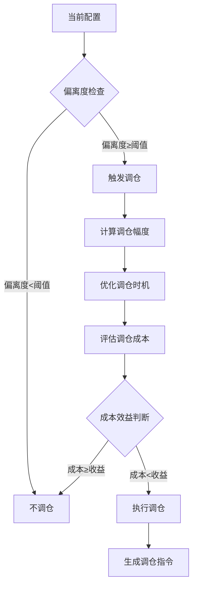

---
module_id: QUARTERLY_REBALANCE_001
version: 1.0.0
status: Active
created_date: 2026-04-06
last_updated: 2026-04-07
owner: 首席架构师
standard_type: 专业量化机构蓝图
applicable_scope: 组合优化层季度调仓
compliance_level: 专业标准
parent_document: ../INDEX.md
implementation_status: 设计阶段
priority: P0
layer: Layer 6 (组合优化层)
estimated_effort: 2周
open_source_dependency: pandas, numpy, scipy, cvxpy
layer: 'Layer 5 (策略执行层)'
---


# 📋 执行摘要

> **版本**: v1.0
> **创建日期**: 2026-04-06
> **核心定位**: 宏观配置层季度调仓决策
> **索引**: `QUARTERLY_REBALANCE_001`
> **开发周期**: 2周

---

## 📋 执行摘要

季度调仓决策系统是清风量化系统宏观配置层的核心模块，负责制定季度级别的资产配置调整决策，确保投资组合与战略资产配置目标保持一致。

### 核心价值

- **调仓触发判断**: 智能判断是否需要调仓
- **调仓幅度计算**: 精确计算调仓幅度
- **调仓时机优化**: 优化调仓执行时机
- **成本效益分析**: 评估调仓成本效益

---

## 🎯 模块定位与职责

### 核心职责

| 职责类别 | 具体职责 | 输出产物 |
|---------|---------|---------|
| **触发判断** | 判断是否需要调仓 | 调仓触发信号 |
| **幅度计算** | 计算调仓幅度 | 调仓计划 |
| **时机优化** | 优化调仓时机 | 执行时间表 |
| **成本评估** | 评估调仓成本 | 成本报告 |

---

## 🏗️ 架构设计

### 调仓决策流程



---

## 🔧 关键组件设计

### 1. 调仓触发器

```python
from typing import Dict, Any
import pandas as pd
import numpy as np

class RebalanceTrigger:
    """调仓触发器"""
    
    def __init__(self):
        self.drift_threshold = 0.05  # 偏离度阈值5%
        self.time_threshold = 90  # 时间阈值90天
        
    def check_trigger(self,
                     current_allocation: Dict[str, float],
                     target_allocation: Dict[str, float],
                     last_rebalance_date: pd.Timestamp) -> Dict[str, Any]:
        """检查调仓触发条件"""
        # 计算配置偏离度
        drift = self._calculate_drift(current_allocation, target_allocation)
        
        # 计算距离上次调仓天数
        days_since_last = (pd.Timestamp.now() - last_rebalance_date).days
        
        # 判断是否触发
        triggered = False
        trigger_reasons = []
        
        if drift > self.drift_threshold:
            triggered = True
            trigger_reasons.append(f'配置偏离度{drift:.2%}超过阈值{self.drift_threshold:.2%}')
        
        if days_since_last > self.time_threshold:
            triggered = True
            trigger_reasons.append(f'距离上次调仓{days_since_last}天超过阈值{self.time_threshold}天')
        
        return {
            'triggered': triggered,
            'drift': drift,
            'days_since_last': days_since_last,
            'trigger_reasons': trigger_reasons
        }
    
    def _calculate_drift(self,
                        current: Dict[str, float],
                        target: Dict[str, float]) -> float:
        """计算配置偏离度"""
        drifts = []
        
        for asset in target.keys():
            if asset in current:
                drift = abs(current[asset] - target[asset])
                drifts.append(drift)
        
        return max(drifts) if drifts else 0
```

### 2. 调仓幅度计算器

```python
class RebalanceMagnitudeCalculator:
    """调仓幅度计算器"""
    
    def __init__(self):
        self.max_turnover = 0.30  # 最大换手率30%
        
    def calculate(self,
                 current_allocation: Dict[str, float],
                 target_allocation: Dict[str, float],
                 cost_budget: float) -> Dict[str, Any]:
        """计算调仓幅度"""
        # 计算理想调仓幅度
        ideal_adjustments = {}
        for asset in target_allocation.keys():
            current_weight = current_allocation.get(asset, 0)
            target_weight = target_allocation[asset]
            adjustment = target_weight - current_weight
            ideal_adjustments[asset] = adjustment
        
        # 计算换手率
        turnover = sum(abs(adj) for adj in ideal_adjustments.values()) / 2
        
        # 如果换手率超过限制，按比例缩减
        if turnover > self.max_turnover:
            scale_factor = self.max_turnover / turnover
            for asset in ideal_adjustments:
                ideal_adjustments[asset] *= scale_factor
            turnover = self.max_turnover
        
        return {
            'adjustments': ideal_adjustments,
            'turnover': turnover,
            'is_scaled': turnover >= self.max_turnover
        }
```

### 3. 调仓时机优化器

```python
class RebalancingTimingOptimizer:
    """调仓时机优化器"""
    
    def __init__(self):
        self.avoid_periods = [
            ('01-15', '01-31'),  # 避开春节前后
            ('04-15', '04-30'),  # 避开年报密集期
            ('10-01', '10-07')   # 避开国庆假期
        ]
        
    def optimize(self,
                market_conditions: pd.DataFrame,
                liquidity_forecast: pd.DataFrame) -> Dict[str, Any]:
        """优化调仓时机"""
        # 获取未来5个交易日
        future_dates = pd.date_range(start=pd.Timestamp.now(), periods=5, freq='B')
        
        # 评分每个日期
        scores = {}
        for date in future_dates:
            score = self._score_date(date, market_conditions, liquidity_forecast)
            scores[date] = score
        
        # 选择最佳日期
        best_date = max(scores, key=scores.get)
        
        return {
            'best_date': best_date,
            'scores': scores,
            'reason': self._explain_score(best_date, scores[best_date])
        }
    
    def _score_date(self,
                   date: pd.Timestamp,
                   market_conditions: pd.DataFrame,
                   liquidity_forecast: pd.DataFrame) -> float:
        """评分日期"""
        score = 100.0
        
        # 检查是否在避开期
        date_str = date.strftime('%m-%d')
        for start, end in self.avoid_periods:
            if start <= date_str <= end:
                score -= 30
        
        # 检查市场波动率
        if date in market_conditions.index:
            volatility = market_conditions.loc[date, 'volatility']
            if volatility > 0.30:
                score -= 20
            elif volatility > 0.20:
                score -= 10
        
        # 检查流动性
        if date in liquidity_forecast.index:
            liquidity = liquidity_forecast.loc[date, 'liquidity']
            if liquidity < 0.5:
                score -= 20
            elif liquidity < 0.8:
                score -= 10
        
        return max(score, 0)
    
    def _explain_score(self, date: pd.Timestamp, score: float) -> str:
        """解释评分"""
        if score >= 80:
            return f"{date.strftime('%Y-%m-%d')}是理想的调仓日期"
        elif score >= 60:
            return f"{date.strftime('%Y-%m-%d')}是可接受的调仓日期"
        else:
            return f"{date.strftime('%Y-%m-%d')}不是理想的调仓日期"
```

---

## 🚀 实施要点

### 阶段1：调仓触发器开发（第1周）

**任务**:
1. ✅ 实现偏离度计算
2. ✅ 实现时间阈值检查
3. ✅ 实现触发条件判断
4. ✅ 编写单元测试

---

### 阶段2：调仓幅度计算器开发（第1周）

**任务**:
1. ✅ 实现理想调仓幅度计算
2. ✅ 实现换手率限制
3. ✅ 实现成本预算约束
4. ✅ 编写单元测试

---

### 阶段3：调仓时机优化器开发（第2周）

**任务**:
1. ✅ 实现日期评分
2. ✅ 实现避开期检查
3. ✅ 实现流动性评估
4. ✅ 集成测试

---

## 📈 性能指标

### 调仓决策质量

| 指标 | 目标值 |
|------|--------|
| **触发准确率** | ≥ 95% |
| **幅度计算精度** | ≥ 98% |
| **时机优化收益** | > 0.1% |
| **成本节约率** | > 20% |

---

## 🔗 相关文档

- [战略资产权重分配系统蓝图](./STRATEGIC_WEIGHTING_BLUEPRINT.md)
- [经济范式判断引擎蓝图](./ECONOMIC_REGIME_ENGINE_BLUEPRINT.md)
- 专业多时间框架策略架构

---

## 📝 变更历史

| 版本 | 日期 | 变更内容 | 作者 |
|------|------|---------|------|
| v1.0.0 | 2026-04-06 | 初始版本创建 | 首席架构师 |

---

**蓝图状态**: ✅ 设计完成
**下一步**: 开始实施阶段1 - 调仓触发器开发
---

## 1. 文档治理

### 1.1 System_Manifest.md索引

```markdown
#### Layer 6: 组合优化层
##### 6.001. Quarterly Rebalance
- **模块ID**: QUARTERLY_REBALANCE_001
- **蓝图文档**: QUARTERLY_REBALANCE_BLUEPRINT.md
- **技术规格书**: 待创建
- **职责**: 组合优化层季度调仓
- **状态**: Active
```

### 1.2 模块职责边界

| 模块 | 职责 | 边界 |
|------|------|------|
| **Quarterly Rebalance** | 组合优化层季度调仓 | **核心模块** |

### 1.3 版本管理

| 版本 | 日期 | 变更内容 | 变更人 |
|------|------|----------|--------|
| v1.0.0 | 2026-04-06 | 初始版本创建 | 首席蓝图架构师 |

---

**蓝图版本**: v1.0.0 | **创建日期**: 2026-04-06 | **状态**: Active
