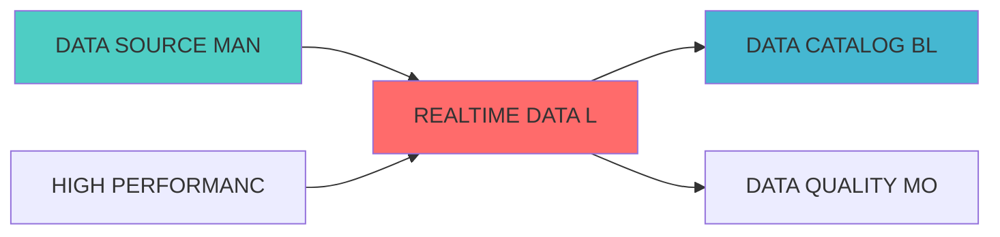

### 3.1 数据湖管理器 (DataLakeManager)

```python
from delta.tables import DeltaTable
from pyspark.sql import SparkSession
from typing import Dict, List, Any
import pandas as pd

class DataLakeManager:
    """数据湖管理器"""
    
    def __init__(self, spark: SparkSession, lake_path: str):
        self.spark = spark
        self.lake_path = lake_path
    
    def create_table(self, table_name: str, schema: Dict[str, str],
                     partition_columns: List[str] = None):
        """创建数据湖表"""
        table_path = f"{self.lake_path}/{table_name}"
        
        df = self.spark.createDataFrame([], schema)
        
        writer = df.write.format("delta").mode("overwrite")
        
        if partition_columns:
            writer = writer.partitionBy(*partition_columns)
        
        writer.save(table_path)
    
    def write_data(self, table_name: str, df: pd.DataFrame,
                   mode: str = "append"):
"""
"""
        table_path = f"{self.lake_path}/{table_name}"
        
        spark_df = self.spark.createDataFrame(df)
        
        spark_df.write.format("delta").mode(mode).save(table_path)
    
    def read_data(self, table_name: str, 
                  filters: Dict[str, Any] = None) -> pd.DataFrame:
        """读取数据"""
        table_path = f"{self.lake_path}/{table_name}"
        
        delta_table = DeltaTable.forPath(self.spark, table_path)
        
        df = delta_table.toDF()
        
        if filters:
            for column, value in filters.items():
                df = df.filter(df[column] == value)
        
        return df.toPandas()
    
    def get_table_history(self, table_name: str) -> List[Dict]:
        table_path = f"{self.lake_path}/{table_name}"
        
        delta_table = DeltaTable.forPath(self.spark, table_path)
        
        history = delta_table.history()
        
        return history.toPandas().to_dict('records')
    
    def restore_table_version(self, table_name: str, version: int):
        """恢复表到指定版本"""
        table_path = f"{self.lake_path}/{table_name}"
        
        delta_table = DeltaTable.forPath(self.spark, table_path)
        
        delta_table.restoreToVersion(version)
```


```python
from typing import Dict, List, Any
import pandas as pd

class QueryOptimizer:
    
    def __init__(self, data_lake_manager: DataLakeManager):
        self.data_lake = data_lake_manager
    
    def optimize_time_range_query(self, table_name: str,
                                   start_time: str,
                                   end_time: str,
                                   columns: List[str] = None) -> pd.DataFrame:
        """优化时间范围查询"""
        spark = self.data_lake.spark
        table_path = f"{self.data_lake.lake_path}/{table_name}"
        
        query = f"""
        SELECT {', '.join(columns) if columns else '*'}
        FROM delta.`{table_path}`
        WHERE timestamp BETWEEN '{start_time}' AND '{end_time}'
        """
        
        return spark.sql(query).toPandas()
    
    def optimize_partition_query(self, table_name: str,
                                  partition_filters: Dict[str, Any]) -> pd.DataFrame:
        """优化分区查询"""
        spark = self.data_lake.spark
        table_path = f"{self.data_lake.lake_path}/{table_name}"
        
        where_clauses = [f"{k} = '{v}'" for k, v in partition_filters.items()]
        where_clause = " AND ".join(where_clauses)
        
        query = f"""
        SELECT *
        FROM delta.`{table_path}`
        WHERE {where_clause}
        """
        
        return spark.sql(query).toPandas()
```

---


### 4.1 RESTful API

#### 4.1.1

```http
POST /api/v1/datalake/write
```

**请求示例**:
```json
{
  "table_name": "stock_prices",
  "data": [
    {"symbol": "AAPL", "price": 150.0, "timestamp": "2026-04-06T10:00:00Z"}
  ],
  "mode": "append"
}
```

#### 4.1.2 查询数据

```http
POST /api/v1/datalake/query
```

**请求示例**:
```json
{
  "table_name": "stock_prices",
  "filters": {
    "symbol": "AAPL",
    "start_time": "2026-04-01",
    "end_time": "2026-04-06"
  }
}
```

---


```yaml
version: '3.8'
services:
  minio:
    image: minio/minio:latest
    command: server /data --console-address ":9001"
    ports:
      - "9000:9000"
      - "9001:9001"
    environment:
      - MINIO_ROOT_USER=admin
      - MINIO_ROOT_PASSWORD=password
    volumes:
      - minio-data:/data
  
  spark:
    image: bitnami/spark:latest
    ports:
      - "8080:8080"
    environment:
      - SPARK_MODE=master

volumes:
  minio-data:
```

---

##

| 指标名称 | 指标类型 | 说明 |
|---------|---------|------|
| `datalake_query_duration_seconds` | Histogram | 查询延迟 |
| `datalake_write_operations_total` | Counter |
?|
| `datalake_compression_ratio` | Gauge | ?|

---


| 阶段 | 任务 | 预计时间 |
|------|------|---------|
Delta Lake | 3?|

---

##
?

- [数据网格蓝图](./DATA_MESH_BLUEPRINT.md)

---

---

## 1. 文档治理

### 1.1 System_Manifest.md索引

```markdown
##### 6.001. Realtime Data Lake
- **模块ID**: REALTIME_DATA_LAKE_001
- **蓝图文档**: REALTIME_DATA_LAKE_BLUEPRINT.md
?
- **职责**: Layer 0数据源层 | 业务架构: 三级时间框架融合架构
- **?*: Active
```

### 1.2 模块职责边界

| 模块 | 职责 | 边界 |
|------|------|------|
| **Realtime Data Lake** | Layer 0数据源层 | 业务架构: 三级时间框架融合架构 | **核心模块** |

### 1.3 版本管理

|------|------|----------|--------|

---


---

##

### 上游依赖

| 文档名称 | module_id | 依赖类型 | 说明 |
|---------|-----------|---------|------|

### 下游依赖

| 文档名称 | module_id | 依赖类型 | 说明 |
|---------|-----------|---------|------|


|---------|------|------|------|
| **MinIO** | latest | 对象存储 | [官方文档](https://min.io/) |

###
?



## 变更历史

|------|------|----------|--------|
| v1.0.0 | 2026-04-07 | 初始版本创建 | 实施团队 |


---

