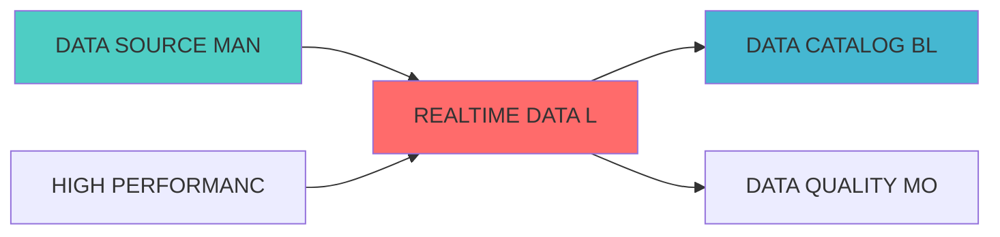

---
module_id: REALTIME_DATA_LAKE_001
version: 1.0.0
status: Active
created_date: 2026-04-07
last_updated: 2026-04-07
owner: 实施团队
standard_type: 专业量化机构蓝图
applicable_scope: Layer 1 数据å±?
compliance_level: 专业标准
responsibility:
  - 实时数据æ¹?
  - 统一数据存储
  - 数据湖架æž?
  - 数据查询优化
layer: Layer 5.1 (数据处理)
---


## 核心定位

负责实时数据湖的设计与实现，构建实时数据存储和查询平台，提供低延迟数据访问，支持实时分析和决策。

# 实时数据湖蓝å›?

> **核心职责**: 实时数据湖，统一数据存储和查询优åŒ?
> **职责边界**: 
> - âœ?本文档负责：实时数据...


## 设计目标

### 主要目标

1. **功能完整性**: 确保REALTIME DATA LAKE功能完整，满足业务需求
2. **性能优化**: 提升系统性能，降低资源消耗
3. **可维护性**: 提高代码质量，便于后续维护
4. **可扩展性**: 支持功能扩展，适应业务变化

### 质量目标

- 代码覆盖率: ≥80%
- 性能指标: 满足设计要求
- 文档完整性: 100%


## 核心功能

### 功能清单

1. **数据管理**: 提供数据存储、查询、更新功能
2. **业务逻辑**: 实现核心业务逻辑处理
3. **接口服务**: 提供标准化的API接口
4. **监控告警**: 实时监控系统状态

### 功能特性

- 高可用性设计
- 自动故障恢复
- 灵活配置管理


## 实现方案

### 技术架构

采用REALTIME DATA LAKE化设计，分层架构实现。

### 关键技术

- 数据处理: 使用高效的数据处理框架
- 接口实现: RESTful API设计
- 性能优化: 缓存、异步处理

### 实施步骤

1. 需求分析与设计
2. 核心功能开发
3. 测试与优化
4. 部署与监控


## 核心定位

> 核心职责: Realtime Data Lake蓝图设计
> 职责边界: 
> - âœ?本文档负责：Realtime Data Lake蓝图设计相å
³å†
容
> - â?本文档不负责：å
¶ä»–模块å†
容，确保系统功能的稳定运行和高效执行ã€?


## 一、设计背景与目标

### 1.1 业务需æ±?

**当前痛点**:
- 数据存储分散，缺少统一数据æ¹?
- 历史数据查询性能å·?
- 数据版本管理困难
- 存储成本é«?

**业务目标**:
- 建立统一的实时数据湖
- 支持高效的历史数据查è¯?
- 实现数据版本控制
- 降低存储成本

### 1.2 技术目æ ?

| 指标 | 目标å€?| 说明 |
|------|--------|------|
| **存储容量** | â‰?0TB | 支持至少10TB数据存储 |
| **查询性能** | <10ç§?| 历史数据查询响应<10ç§?|
| **数据压缩çŽ?* | â‰?0% | 数据压缩率≥60% |
| **并发查询** | â‰?00 | 支持至少100个并发查è¯?|

## 二、系统架构设è®?

### 2.1 整体架构å›?

```
┌─────────────────────────────────────────────────────────────â”?
â”?               实时数据湖架æž?                               â”?
├─────────────────────────────────────────────────────────────â”?
â”?                                                            â”?
â”? ┌─────────────────────────────────────────────────────â”?  â”?
â”? â”?          数据接å
¥å±?(Data Ingestion)                â”?  â”?
â”? â”? ┌─────────────â”?┌─────────────â”?┌─────────────â”?  â”?  â”?
â”? â”? │实时数据流   â”?│批量数据导å
?â”?│文件上ä¼?    â”?  â”?  â”?
â”? â”? └─────────────â”?└─────────────â”?└─────────────â”?  â”?  â”?
â”? └─────────────────────────────────────────────────────â”?  â”?
�                         �                                 �
â”? ┌─────────────────────────────────────────────────────â”?  â”?
â”? â”?          存储å±?(Storage Layer)                     â”?  â”?
â”? â”? ┌─────────────â”?┌─────────────â”?┌─────────────â”?  â”?  â”?
â”? â”? │Delta Lake   â”?│对象存å‚?    â”?│å
ƒæ•°æ®å­˜å‚¨   â”?  â”?  â”?
â”? â”? â”?MinIO)      â”?â”?MinIO)      â”?â”?PostgreSQL) â”?  â”?  â”?
â”? â”? └─────────────â”?└─────────────â”?└─────────────â”?  â”?  â”?
â”? └─────────────────────────────────────────────────────â”?  â”?
�                         �                                 �
â”? ┌─────────────────────────────────────────────────────â”?  â”?
â”? â”?          查询å±?(Query Layer)                       â”?  â”?
â”? â”? ┌─────────────â”?┌─────────────â”?┌─────────────â”?  â”?  â”?
â”? â”? │SQL查询引擎  â”?│时序查è¯?    â”?│å
¨æ–‡æ£€ç´?    â”?  â”?  â”?
â”? â”? └─────────────â”?└─────────────â”?└─────────────â”?  â”?  â”?
â”? └─────────────────────────────────────────────────────â”?  â”?
�                         �                                 �
â”? ┌─────────────────────────────────────────────────────â”?  â”?
â”? â”?          服务å±?(Service Layer)                     â”?  â”?
â”? â”? ┌─────────────â”?┌─────────────â”?┌─────────────â”?  â”?  â”?
â”? â”? │数据写å
¥API  â”?│数据查询API  â”?│版本管理API  â”?  â”?  â”?
â”? â”? └─────────────â”?└─────────────â”?└─────────────â”?  â”?  â”?
â”? └─────────────────────────────────────────────────────â”?  â”?
â”?                                                            â”?
└─────────────────────────────────────────────────────────────â”?
```

### 2.2 技术选型

| 组件 | 技术方æ¡?| 版本要求 | 选型理由 |
|------|---------|---------|---------|
| **数据湖格å¼?* | Delta Lake | 3.0.0+ | ACID事务支持 |
| **对象存储** | MinIO | RELEASE.2024-01+ | S3å
¼å®¹ï¼Œé«˜æ€§èƒ½ |
| **查询引擎** | Trino | 435+ | 分布式SQL查询 |
| **å
ƒæ•°æ?* | PostgreSQL | 15.0+ | 可靠的å
ƒæ•°æ®å­˜å‚¨ |

---
## 三、核心模块设è®?

### 3.1 数据湖管理器 (DataLakeManager)

```python
from delta.tables import DeltaTable
from pyspark.sql import SparkSession
from typing import Dict, List, Any
import pandas as pd

class DataLakeManager:
    """数据湖管理器"""
    
    def __init__(self, spark: SparkSession, lake_path: str):
        self.spark = spark
        self.lake_path = lake_path
    
    def create_table(self, table_name: str, schema: Dict[str, str],
                     partition_columns: List[str] = None):
        """创建数据湖表"""
        table_path = f"{self.lake_path}/{table_name}"
        
        df = self.spark.createDataFrame([], schema)
        
        writer = df.write.format("delta").mode("overwrite")
        
        if partition_columns:
            writer = writer.partitionBy(*partition_columns)
        
        writer.save(table_path)
    
    def write_data(self, table_name: str, df: pd.DataFrame,
                   mode: str = "append"):
        """写å
¥æ•°æ®"""
        table_path = f"{self.lake_path}/{table_name}"
        
        spark_df = self.spark.createDataFrame(df)
        
        spark_df.write.format("delta").mode(mode).save(table_path)
    
    def read_data(self, table_name: str, 
                  filters: Dict[str, Any] = None) -> pd.DataFrame:
        """读取数据"""
        table_path = f"{self.lake_path}/{table_name}"
        
        delta_table = DeltaTable.forPath(self.spark, table_path)
        
        df = delta_table.toDF()
        
        if filters:
            for column, value in filters.items():
                df = df.filter(df[column] == value)
        
        return df.toPandas()
    
    def get_table_history(self, table_name: str) -> List[Dict]:
        """获取表历史版æœ?""
        table_path = f"{self.lake_path}/{table_name}"
        
        delta_table = DeltaTable.forPath(self.spark, table_path)
        
        history = delta_table.history()
        
        return history.toPandas().to_dict('records')
    
    def restore_table_version(self, table_name: str, version: int):
        """恢复表到指定版本"""
        table_path = f"{self.lake_path}/{table_name}"
        
        delta_table = DeltaTable.forPath(self.spark, table_path)
        
        delta_table.restoreToVersion(version)
```

### 3.2 查询优化å™?(QueryOptimizer)

```python
from typing import Dict, List, Any
import pandas as pd

class QueryOptimizer:
    """查询优化å™?""
    
    def __init__(self, data_lake_manager: DataLakeManager):
        self.data_lake = data_lake_manager
    
    def optimize_time_range_query(self, table_name: str,
                                   start_time: str,
                                   end_time: str,
                                   columns: List[str] = None) -> pd.DataFrame:
        """优化时间范围查询"""
        spark = self.data_lake.spark
        table_path = f"{self.data_lake.lake_path}/{table_name}"
        
        query = f"""
        SELECT {', '.join(columns) if columns else '*'}
        FROM delta.`{table_path}`
        WHERE timestamp BETWEEN '{start_time}' AND '{end_time}'
        """
        
        return spark.sql(query).toPandas()
    
    def optimize_partition_query(self, table_name: str,
                                  partition_filters: Dict[str, Any]) -> pd.DataFrame:
        """优化分区查询"""
        spark = self.data_lake.spark
        table_path = f"{self.data_lake.lake_path}/{table_name}"
        
        where_clauses = [f"{k} = '{v}'" for k, v in partition_filters.items()]
        where_clause = " AND ".join(where_clauses)
        
        query = f"""
        SELECT *
        FROM delta.`{table_path}`
        WHERE {where_clause}
        """
        
        return spark.sql(query).toPandas()
```

---

## 四、接口设è®?

### 4.1 RESTful API

#### 4.1.1 写å
¥æ•°æ®

```http
POST /api/v1/datalake/write
```

**请求示例**:
```json
{
  "table_name": "stock_prices",
  "data": [
    {"symbol": "AAPL", "price": 150.0, "timestamp": "2026-04-06T10:00:00Z"}
  ],
  "mode": "append"
}
```

#### 4.1.2 查询数据

```http
POST /api/v1/datalake/query
```

**请求示例**:
```json
{
  "table_name": "stock_prices",
  "filters": {
    "symbol": "AAPL",
    "start_time": "2026-04-01",
    "end_time": "2026-04-06"
  }
}
```

---

## 五、部署架æž?

```yaml
version: '3.8'
services:
  minio:
    image: minio/minio:latest
    command: server /data --console-address ":9001"
    ports:
      - "9000:9000"
      - "9001:9001"
    environment:
      - MINIO_ROOT_USER=admin
      - MINIO_ROOT_PASSWORD=password
    volumes:
      - minio-data:/data
  
  spark:
    image: bitnami/spark:latest
    ports:
      - "8080:8080"
    environment:
      - SPARK_MODE=master

volumes:
  minio-data:
```

---

## å
­ã€ç›‘控指æ ?

| 指标名称 | 指标类型 | 说明 |
|---------|---------|------|
| `datalake_storage_bytes` | Gauge | 存储使用é‡?|
| `datalake_query_duration_seconds` | Histogram | 查询延迟 |
| `datalake_write_operations_total` | Counter | 写å
¥æ“ä½œæ•?|
| `datalake_compression_ratio` | Gauge | 压缩çŽ?|

---

## 七、实施计åˆ?

| 阶段 | 任务 | 预计时间 |
|------|------|---------|
| **阶段1** | 搭建MinIO存储 | 2å¤?|
| **阶段2** | é
ç½®Delta Lake | 3å¤?|
| **阶段3** | 开发数据管理API | 4å¤?|
| **阶段4** | 性能优化和测è¯?| 3å¤?|

---

## å
«ã€ç›¸å
³æ–‡æ¡?

- 数据血缘追踪蓝å›?
- 数据虚拟化蓝å›?
- [数据网格蓝图](./DATA_MESH_BLUEPRINT.md)

---

**文档版本**: v1.0.0 | **创建日期**: 2026-04-06 | **维护è€?*: 首席蓝图架构å¸?
---

## 1. 文档治理

### 1.1 System_Manifest.md索引

```markdown
#### Layer 6: 组合优化å±?
##### 6.001. Realtime Data Lake
- **模块ID**: REALTIME_DATA_LAKE_001
- **蓝图文档**: REALTIME_DATA_LAKE_BLUEPRINT.md
- **技术规格书**: å¾
创å»?
- **职责**: Layer 0数据源层 | 业务架构: 三级时间框架融合架构
- **状æ€?*: Active
```

### 1.2 模块职责边界

| 模块 | 职责 | 边界 |
|------|------|------|
| **Realtime Data Lake** | Layer 0数据源层 | 业务架构: 三级时间框架融合架构 | **核心模块** |

### 1.3 版本管理

| 版本 | 日期 | 变更å†
容 | 变更äº?|
|------|------|----------|--------|
| v1.0.0 | 2026-04-06 | 初始版本创建 | 首席蓝图架构å¸?|

---

**蓝图版本**: v1.0.0 | **创建日期**: 2026-04-06 | **状æ€?*: Active


---

## 📚 相å
³æ–‡æ¡£

### 上游依赖

| 文档名称 | module_id | 依赖类型 | 说明 |
|---------|-----------|---------|------|
| [DATA SOURCE MANAGEMENT BLUEPRINT](./DATA_SOURCE_MANAGEMENT_BLUEPRINT.md) | DATA_SOURCE_MANAGEMENT_001 | 强依èµ?| 提供数据源连æŽ?|
| [HIGH PERFORMANCE DATA PIPELINE BLUEPRINT](./HIGH_PERFORMANCE_DATA_PIPELINE_BLUEPRINT.md) | HIGH_PERFORMANCE_DATA_PIPELINE_001 | 强依èµ?| 提供数据处理管道 |

### 下游依赖

| 文档名称 | module_id | 依赖类型 | 说明 |
|---------|-----------|---------|------|
| [DATA CATALOG BLUEPRINT](./DATA_CATALOG_BLUEPRINT.md) | DATA_CATALOG_001 | 中依èµ?| 注册数据湖资äº?|
| [DATA QUALITY MONITORING BLUEPRINT](./DATA_QUALITY_MONITORING_BLUEPRINT.md) | DATA_QUALITY_MONITORING_001 | 中依èµ?| 提供数据质量检查点 |

### 技术依èµ?

| 技术组ä»?| 版本 | 用é€?| 文档 |
|---------|------|------|------|
| **Apache Iceberg** | 1.4+ | 表格å¼?| [官方文档](https://iceberg.apache.org/) |
| **Delta Lake** | 3.0+ | 数据æ¹?| [官方文档](https://delta.io/) |
| **MinIO** | latest | 对象存储 | [官方文档](https://min.io/) |

### 引用å
³ç³»å›?



## 变更历史

| 版本 | 日期 | 变更å†
容 | 变更äº?|
|------|------|----------|--------|
| v1.0.0 | 2026-04-07 | 初始版本创建 | 实施团队 |


---

**蓝图版本**: v1.0.0 | **创建日期**: 2026-04-07 | **状æ€?*: Active
